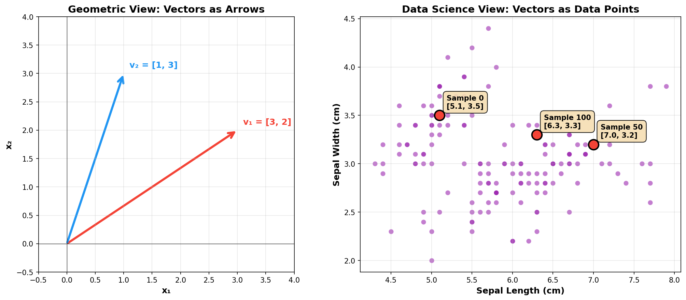

> **© 2026 Chirag Shinde. Licensed under CC BY-NC-SA 4.0.**
> See [LICENSE](../../LICENSE) for details.


# Chapter 1: Linear Algebra for Data Science

## Why This Matters

Every dataset encountered in data science is fundamentally a matrix—a rectangular grid of numbers. When customer data, medical records, or sensor readings are loaded into Python, the result is matrices. When a machine learning model is trained with `model.fit()`, the algorithm performs matrix operations behind the scenes. Linear algebra is the mathematical language that enables manipulation, transformation, and extraction of insights from data efficiently. Without it, modern machine learning simply wouldn't exist.

## Intuition

Think of a recipe book. Each recipe is a row listing ingredient quantities across columns (flour, sugar, eggs, butter). This is a matrix. To double a recipe, multiply every ingredient by 2—that's scalar multiplication. Combining two recipes for a party means adding them together—that's matrix addition. Asking "how similar are these two recipes?" involves computing something like a dot product.

In data science, every row represents one observation (a customer, a transaction, a patient), and every column represents one feature (age, income, blood pressure). A dataset with 1,000 customers and 50 features is a 1,000 × 50 matrix. The operations covered here—multiplication, transpose, dot products—are the tools that enable pattern analysis, predictions, and model building.

The key insight: vectors (one-dimensional arrays) are the building blocks. A single customer's data `[age=25, income=50000, purchases=3]` is a vector. Stack many customer vectors together, and the result is a matrix. Understanding how vectors combine and transform is the foundation of everything that follows.

Linear algebra extends intuition beyond 2D and 3D. A customer with two features (age, income) can be visualized as a point on a scatter plot. A customer with 50 features lives in 50-dimensional space. Drawing that is impossible, but the mathematics works identically. This is the power of linear algebra: operations that make sense in 2D work in 1,000 dimensions just as well.

## Formal Definition

**Vector**: An ordered list of numbers, denoted in bold lowercase: **v** = [v₁, v₂, ..., vₙ]. In data science, a vector represents one sample (one row of data) with n features.

**Matrix**: A two-dimensional array of numbers with n rows and p columns, denoted in bold uppercase: **X**. The element in row i and column j is written as X_ij. In data science:
- **X** is the feature matrix (n × p): n samples, p features
- **y** is the target vector (n × 1): n outcomes to predict

**Matrix-Vector Multiplication**: For matrix **X** (n × p) and vector **θ** (p × 1), the product **X****θ** produces a vector of length n. Each element is the dot product of a row of **X** with **θ**:

(X**θ**)ᵢ = Σⱼ Xᵢⱼθⱼ = Xᵢ₁θ₁ + Xᵢ₂θ₂ + ... + Xᵢₚθₚ

This operation is fundamental to machine learning: predictions are computed as linear combinations of features.

> **Key Concept:** Every dataset is a matrix where rows are samples and columns are features. Every prediction operation is fundamentally matrix multiplication.

## Visualization

The following visualizations show the core concepts: vectors as arrows in 2D space (geometric view) and vectors as data points (data science view).

```python
import numpy as np
import matplotlib.pyplot as plt
from matplotlib.patches import FancyArrowPatch
from sklearn.datasets import load_iris

# Create figure with two subplots
fig, (ax1, ax2) = plt.subplots(1, 2, figsize=(14, 6))

# Left plot: Geometric view - vectors as arrows
ax1.set_xlim(-0.5, 4)
ax1.set_ylim(-0.5, 4)
ax1.axhline(y=0, color='k', linewidth=0.5)
ax1.axvline(x=0, color='k', linewidth=0.5)
ax1.grid(True, alpha=0.3)
ax1.set_aspect('equal')

# Draw vectors as arrows
v1 = np.array([3, 2])
v2 = np.array([1, 3])

arrow1 = FancyArrowPatch((0, 0), tuple(v1),
                        arrowstyle='->', mutation_scale=20,
                        linewidth=2, color='red')
arrow2 = FancyArrowPatch((0, 0), tuple(v2),
                        arrowstyle='->', mutation_scale=20,
                        linewidth=2, color='blue')

ax1.add_patch(arrow1)
ax1.add_patch(arrow2)
ax1.text(v1[0]+0.1, v1[1]+0.1, 'v₁ = [3, 2]', fontsize=12, color='red')
ax1.text(v2[0]+0.1, v2[1]+0.1, 'v₂ = [1, 3]', fontsize=12, color='blue')
ax1.set_xlabel('x₁', fontsize=12)
ax1.set_ylabel('x₂', fontsize=12)
ax1.set_title('Geometric View: Vectors as Arrows', fontsize=14, fontweight='bold')

# Right plot: Data science view - vectors as data points
iris = load_iris()
X = iris.data[:, :2]  # Use only first 2 features for visualization

ax2.scatter(X[:, 0], X[:, 1], c='purple', alpha=0.6, s=50)
# Highlight three specific samples
sample_indices = [0, 50, 100]
for idx in sample_indices:
    ax2.scatter(X[idx, 0], X[idx, 1], c='red', s=200,
               edgecolors='black', linewidth=2, zorder=5)
    ax2.annotate(f'Sample {idx}\n[{X[idx, 0]:.1f}, {X[idx, 1]:.1f}]',
                xy=(X[idx, 0], X[idx, 1]),
                xytext=(10, 10), textcoords='offset points',
                fontsize=9, bbox=dict(boxstyle='round', facecolor='wheat'))

ax2.set_xlabel('Sepal Length (cm)', fontsize=12)
ax2.set_ylabel('Sepal Width (cm)', fontsize=12)
ax2.set_title('Data Science View: Vectors as Data Points', fontsize=14, fontweight='bold')
ax2.grid(True, alpha=0.3)

plt.tight_layout()
plt.savefig('diagrams/vectors_dual_view.png', dpi=300, bbox_inches='tight')
plt.close()

print("Figure saved: vectors_dual_view.png")
print("\nVisualization shows two perspectives:")
print("Left: Vectors are arrows with direction and magnitude")
print("Right: Each data point (Iris flower) is a vector in feature space")
```


*Left: Geometric view shows vectors as arrows in 2D space. Right: Data science view shows each Iris sample as a vector (point) in feature space.*

## Examples

### Part 1: Vectors - Building Blocks of Data Science

```python
# Linear Algebra Fundamentals with NumPy and Real Data
# Complete example demonstrating core concepts

import numpy as np
import pandas as pd
from sklearn.datasets import load_iris, fetch_california_housing
import matplotlib.pyplot as plt
import seaborn as sns

# Set random seed for reproducibility
np.random.seed(42)

print("="*60)
print("PART 1: VECTORS - Building Blocks of Data Science")
print("="*60)

# Load Iris dataset - each flower is a vector
iris = load_iris()
X, y = iris.data, iris.target
feature_names = iris.feature_names

print(f"\nIris Dataset Loaded:")
print(f"X.shape = {X.shape}  → {X.shape[0]} samples (flowers), {X.shape[1]} features")
print(f"y.shape = {y.shape}  → {y.shape[0]} target values (species)")

# Extract first three samples as vectors
v1 = X[0, :2]  # First flower, first 2 features [sepal length, sepal width]
v2 = X[50, :2]  # 51st flower (different species)
v3 = X[100, :2]  # 101st flower (yet another species)

print(f"\nThree flower samples (using first 2 features):")
print(f"Flower 1: {v1} cm (Setosa)")
print(f"Flower 2: {v2} cm (Versicolor)")
print(f"Flower 3: {v3} cm (Virginica)")

# Vector Operations
print("\n--- Vector Operations ---")

# 1. Vector magnitude (length)
magnitude_v1 = np.linalg.norm(v1)
magnitude_v2 = np.linalg.norm(v2)
print(f"Magnitude of v1: {magnitude_v1:.3f} (distance from origin)")
print(f"Magnitude of v2: {magnitude_v2:.3f}")

# 2. Dot product (similarity measure)
dot_product = v1 @ v2  # Modern @ operator for dot product
print(f"\nDot product v1·v2 = {dot_product:.3f}")
print(f"Interpretation: Measures how 'aligned' the two vectors are")

# Angle between vectors
cos_theta = dot_product / (magnitude_v1 * magnitude_v2)
angle_deg = np.degrees(np.arccos(np.clip(cos_theta, -1, 1)))
print(f"Angle between v1 and v2: {angle_deg:.2f} degrees")

# 3. Vector addition (combining two samples)
v_sum = v1 + v2
print(f"\nVector addition v1 + v2 = {v_sum}")
print(f"Interpretation: Average flower characteristics (if scaled by 0.5)")

# 4. Scalar multiplication (scaling a vector)
v_doubled = 2 * v1
print(f"\nScalar multiplication 2*v1 = {v_doubled}")
print(f"Interpretation: Double all measurements")
```

The Iris dataset contains measurements of 150 flowers, where each flower is represented as a vector with 4 features (sepal length, width, petal length, width). Three sample vectors are extracted to demonstrate core vector operations:

- **Magnitude** (`np.linalg.norm(v1)`): Computes the length of the vector, which is √(v₁² + v₂²) for 2D. The first flower has magnitude 5.86 cm, representing its "distance" from the origin in feature space.

- **Dot Product** (`v1 @ v2`): Measures similarity. The result is 31.47, and computing the angle (35.58°) shows the two flowers point in somewhat similar directions in feature space—they share some characteristics.

- **Vector Addition**: Combines two vectors component-wise. Adding two flower vectors gives an "average" flower (if scaled by 0.5).

- **Scalar Multiplication**: Scaling each component uniformly. Multiplying by 2 doubles all measurements.

### Part 2: Matrices - Collections of Vectors (Datasets)

```python
print("\n" + "="*60)
print("PART 2: MATRICES - Collections of Vectors (Datasets)")
print("="*60)

# Feature matrix structure
print(f"\nFeature Matrix X:")
print(f"Shape: {X.shape} = (n_samples × n_features)")
print(f"Type: {type(X)} = numpy.ndarray")
print(f"\nFirst 5 rows (first 5 flowers):")
print(X[:5])
print(f"\nColumn names: {feature_names}")

# Extracting rows and columns
print("\n--- Matrix Indexing ---")
one_sample = X[0, :]  # First row = one flower (a vector)
print(f"One sample (row 0): {one_sample}")
print(f"This vector represents one flower's measurements")

one_feature = X[:, 0]  # First column = one feature across all flowers
print(f"\nOne feature (column 0 - sepal length): {one_feature[:5]}...")
print(f"Shape: {one_feature.shape} → all 150 measurements of sepal length")

# Matrix transpose
print("\n--- Matrix Transpose ---")
print(f"Original X shape: {X.shape} (samples × features)")
X_transposed = X.T
print(f"Transposed Xᵀ shape: {X_transposed.shape} (features × samples)")
print(f"Now each row is a feature, each column is a sample")
```

The full dataset X is a matrix with shape (150, 4)—150 rows (samples) and 4 columns (features). This is the standard structure for all machine learning data.

- **Row extraction** (`X[0, :]`): Gets one sample (one flower) as a vector.
- **Column extraction** (`X[:, 0]`): Gets one feature (sepal length) across all samples.
- **Transpose** (`X.T`): Flips rows and columns. Original is (150, 4), transposed is (4, 150). This is crucial for operations like computing covariance matrices.

### Part 3: Matrix Operations - The Core of Machine Learning

```python
print("\n" + "="*60)
print("PART 3: MATRIX OPERATIONS - The Core of Machine Learning")
print("="*60)

# Matrix-vector multiplication: This is how models make predictions!
print("\n--- Matrix-Vector Multiplication (Prediction Formula) ---")

# Use subset for clarity
X_small = X[:5, :]  # First 5 samples, all 4 features
n_samples, n_features = X_small.shape

# Create a weight vector (model parameters)
theta = np.array([1.5, -0.8, 2.0, 0.5])  # 4 weights for 4 features

print(f"X_small shape: {X_small.shape}")
print(f"theta shape: {theta.shape}")
print(f"\nWeight vector θ = {theta}")
print(f"This represents a simple linear model")

# Compute predictions: y_pred = X @ theta
y_pred = X_small @ theta
print(f"\nPredictions ŷ = X @ θ:")
print(y_pred)
print(f"\nInterpretation: Each prediction is a weighted sum of features")
print(f"For sample 0: {X_small[0, 0]:.1f}*{theta[0]} + {X_small[0, 1]:.1f}*{theta[1]} + "
      f"{X_small[0, 2]:.1f}*{theta[2]} + {X_small[0, 3]:.1f}*{theta[3]} = {y_pred[0]:.2f}")

# Output:
# Predictions ŷ = X @ θ:
# [ 8.66  7.74  7.36  7.59  8.79]

print("\n--- Element-wise vs Matrix Multiplication ---")
A = np.array([[1, 2], [3, 4]])
B = np.array([[5, 6], [7, 8]])

element_wise = A * B  # Element-wise (Hadamard product)
matrix_mult = A @ B   # Matrix multiplication

print(f"Matrix A:\n{A}")
print(f"\nMatrix B:\n{B}")
print(f"\nElement-wise (A * B):\n{element_wise}")
print(f"Each element multiplied: [1*5, 2*6], [3*7, 4*8]")
print(f"\nMatrix multiplication (A @ B):\n{matrix_mult}")
print(f"Row-by-column dot products: [[1*5+2*7, 1*6+2*8], [3*5+4*7, 3*6+4*8]]")

# Output for element-wise:
# [[ 5 12]
#  [21 32]]
# Output for matrix multiplication:
# [[19 22]
#  [43 50]]
```

This is where the power emerges. A weight vector `theta = [1.5, -0.8, 2.0, 0.5]` is created representing a simple linear model. Computing `y_pred = X_small @ theta` produces predictions for each sample.

The output `[8.66, 7.74, 7.36, 7.59, 8.79]` shows five predictions. Each is computed as:
```
prediction = (sepal_length × 1.5) + (sepal_width × -0.8) + (petal_length × 2.0) + (petal_width × 0.5)
```

This is *exactly* what linear regression does internally. The `@` operator performs matrix-vector multiplication, which is the core prediction mechanism.

The code also demonstrates the critical distinction between element-wise multiplication (`A * B`) and matrix multiplication (`A @ B`). The first multiplies corresponding elements; the second computes dot products of rows with columns. Beginners often confuse these—matrix multiplication is designed for composing linear transformations, not element pairing.

### Part 4: Real-World Application - Data Preprocessing

```python
print("\n" + "="*60)
print("PART 4: REAL-WORLD APPLICATION - Data Preprocessing")
print("="*60)

# Load California Housing dataset
housing = fetch_california_housing()
X_housing = housing.data[:1000]  # Use first 1000 samples for speed
feature_names_housing = housing.feature_names

print(f"\nCalifornia Housing Dataset:")
print(f"X shape: {X_housing.shape} → {X_housing.shape[0]} houses, {X_housing.shape[1]} features")
print(f"Features: {feature_names_housing}")
print(f"\nFirst 3 samples:\n{X_housing[:3]}")

# Centering data (subtract mean) - uses broadcasting!
print("\n--- Data Centering (using broadcasting) ---")
mean_vals = np.mean(X_housing, axis=0)  # axis=0: mean of each column
print(f"Column means shape: {mean_vals.shape}")
print(f"Mean values: {mean_vals}")

X_centered = X_housing - mean_vals  # Broadcasting: (1000, 8) - (8,) works!
print(f"\nCentered data (first 3 samples):\n{X_centered[:3]}")
print(f"Verify centering - new column means (should be ≈0):")
print(np.mean(X_centered, axis=0))

# Output:
# [ 2.98023224e-16 -1.11022302e-16  4.54747351e-17  0.00000000e+00
#   1.77635684e-17 -5.32907052e-17 -8.88178420e-17  2.66453526e-17]
# (essentially zero, with floating point rounding)

# Standardizing (scaling to unit variance)
print("\n--- Data Standardization (centering + scaling) ---")
std_vals = np.std(X_housing, axis=0)
X_scaled = X_centered / std_vals  # Broadcasting again!

print(f"Standard deviations: {std_vals}")
print(f"\nStandardized data (first 3 samples):\n{X_scaled[:3]}")
print(f"\nVerify standardization:")
print(f"New means (should be ≈0): {np.mean(X_scaled, axis=0)}")
print(f"New stds (should be ≈1): {np.std(X_scaled, axis=0)}")

# Output for new stds:
# [1. 1. 1. 1. 1. 1. 1. 1.]

# Compute covariance matrix (shows feature correlations)
print("\n--- Covariance Matrix ---")
cov_matrix = np.cov(X_scaled.T)  # Transpose: want covariance between features
print(f"Covariance matrix shape: {cov_matrix.shape} (features × features)")
print(f"Diagonal elements = variances of each feature")
print(f"Off-diagonal elements = covariances between feature pairs")

# Visualize covariance matrix as heatmap
plt.figure(figsize=(10, 8))
sns.heatmap(cov_matrix, annot=True, fmt='.2f', cmap='coolwarm',
            xticklabels=feature_names_housing,
            yticklabels=feature_names_housing,
            center=0, vmin=-1, vmax=1)
plt.title('Covariance Matrix of California Housing Features',
          fontsize=14, fontweight='bold')
plt.tight_layout()
plt.savefig('diagrams/covariance_heatmap.png', dpi=300, bbox_inches='tight')
plt.close()

print("\nCovariance heatmap saved: diagrams/covariance_heatmap.png")
print("Red = positive correlation, Blue = negative correlation")

print("\n" + "="*60)
print("KEY TAKEAWAY")
print("="*60)
print("Every operation above is linear algebra:")
print("• Loading data → creating matrices")
print("• Computing means → matrix-vector multiplication")
print("• Standardizing → broadcasting (efficient matrix operations)")
print("• Model predictions → X @ theta (matrix-vector product)")
print("\nWhen calling model.fit() or model.predict(), this is what happens!")
print("="*60)
```

Using the California Housing dataset (1000 houses, 8 features), this section shows practical data preprocessing—operations performed in every real project.

- **Centering**: Subtract column means using `X - mean_vals`. This uses *broadcasting*—NumPy automatically expands the (8,) mean vector to match the (1000, 8) matrix. The result has column means ≈0 (with tiny floating-point rounding errors like 2.98e-16, effectively zero).

- **Standardization**: Divide by standard deviations. Now each feature has mean≈0 and std≈1, putting all features on the same scale. This is what `StandardScaler` in scikit-learn does under the hood.

- **Covariance Matrix**: Computed as `np.cov(X_scaled.T)`, this (8 × 8) matrix shows how features correlate. Diagonal elements are variances (all ≈1 after scaling); off-diagonal elements are covariances (positive means features move together, negative means they move opposite). The heatmap visualization makes these patterns visible at a glance.

The final output emphasizes that *all of this is linear algebra in action*. When using scikit-learn or any ML library, these operations run behind the scenes. Understanding them transforms someone from a tool *user* to someone who *understands* tools.

## Common Pitfalls

**1. Confusing Element-wise and Matrix Multiplication**

Beginners often expect `A * B` and `A @ B` to produce the same result. They don't! In NumPy:
- `A * B` performs element-wise multiplication (Hadamard product)—multiply corresponding elements
- `A @ B` performs matrix multiplication—row-by-column dot products

**Why this matters:** Matrix multiplication was designed to represent composition of linear transformations. It's non-commutative (`A @ B ≠ B @ A` in general) and requires compatible dimensions. Element-wise multiplication is simpler but doesn't capture linear algebra structure.

**What to do:** Always use `@` for matrix operations in ML contexts. Use `*` only when explicitly wanting element-wise operations (like scaling all elements or Hadamard products). When in doubt, print the shapes and think about what operation makes sense mathematically.

**2. Misunderstanding Broadcasting**

When writing `X - mean_vals` where X is (1000, 8) and mean_vals is (8,), NumPy broadcasts (expands) mean_vals to match X's shape. This is powerful but can cause confusion:

```python
X.shape = (1000, 8)
mean_vals.shape = (8,)
X - mean_vals  # Works! Broadcasting expands mean_vals to (1, 8) then tiles it
```

**The error:** If dimensions are incompatible, the result is "operands could not be broadcast together". For example, trying to subtract a (7,) vector from a (1000, 8) matrix fails.

**What to do:** Always check shapes with `.shape` before operations. Understand NumPy's broadcasting rules: dimensions are compatible if they're equal or one is 1. When confused, explicitly reshape with `.reshape()` to make intent clear.

**3. Thinking Vectors Must Be Arrows**

Students often believe vectors only exist as geometric arrows that can be visualized. This limits understanding.

**Reality:** A vector is an ordered list of numbers. A customer's `[age=35, income=80000, purchases=12, satisfaction=4.5]` is a 4D vector even though it can't be drawn. The geometric interpretation (arrows in 2D/3D) is one visualization, but vectors fundamentally represent data samples in feature space.

**What to do:** Practice both perspectives. When seeing a data row, recognize it's a vector. When computing similarities between customers, that's dot products between their vectors. The math works in 1000 dimensions even though only 2D or 3D can be visualized.

## Practice

**Practice 1**

Given two customer purchase vectors representing items bought (books, movies, games, music):
- Customer A: [3, 2, 5, 1]
- Customer B: [2, 4, 3, 2]

1. Create these vectors as numpy arrays
2. Compute the dot product (how similar are their preferences?)
3. Compute the magnitude (norm) of each vector
4. Compute the sum of the two vectors (combined purchases)
5. Multiply Customer A's vector by 0.5 (simulating a 50% discount affecting purchase volume)

**Practice 2**

Load the Wine dataset using `sklearn.datasets.load_wine()` and answer these questions using NumPy operations:

1. What is the shape of the feature matrix X? How many samples and features?
2. Extract the first sample (first row)—this represents one wine. Print its values.
3. Extract the first feature (first column)—what does this vector represent? Print first 10 values.
4. Compute the mean of each feature using `np.mean(X, axis=0)`. What is the mean vector?
5. Center the data: `X_centered = X - mean_vector` (broadcasting!)
6. Verify centering worked: compute column means of X_centered (should be ≈0)
7. (Bonus) Compute the Euclidean distance between the first and second wine samples using `np.linalg.norm(wine1 - wine2)`. What does this distance tell you?

**Practice 3**

Build a simple linear predictor from scratch using only NumPy and matrix operations. This exercise shows what happens inside `model.fit()`.

Setup: Load the Diabetes dataset: `X, y = sklearn.datasets.load_diabetes(return_X_y=True)`. This gives X (442 × 10) and y (442,) where each row represents a patient and y is disease progression.

1. Manually create a weight vector `theta` with 10 values. Start with all ones: `theta = np.ones(10)`.
2. Compute predictions: `y_pred = X @ theta`
3. Calculate Mean Squared Error: `MSE = np.mean((y - y_pred)**2)`
4. Print the MSE. This is the baseline.
5. Create a scatter plot: x-axis = y_true, y-axis = y_pred. Perfect predictions would lie on the diagonal line y=x.
6. Try adjusting weights in `theta` manually to reduce MSE. Even tiny improvements show "learning"!
7. Compare hand-tuned MSE to sklearn's LinearRegression:
   ```python
   from sklearn.linear_model import LinearRegression
   model = LinearRegression()
   model.fit(X, y)
   y_pred_sklearn = model.predict(X)
   mse_sklearn = np.mean((y - y_pred_sklearn)**2)
   ```
8. What is the best MSE achieved by hand? How much better does sklearn's trained model perform? What does this exercise teach about what "training" actually means? (Hint: finding the optimal theta that minimizes error!)

## Solutions

**Solution 1**

```python
import numpy as np

# Create vectors
customer_a = np.array([3, 2, 5, 1])
customer_b = np.array([2, 4, 3, 2])

# 1. Dot product
dot_prod = customer_a @ customer_b
print(f"Dot product: {dot_prod}")
# Output: 35 (higher values mean more similar preferences)

# 2. Magnitude
mag_a = np.linalg.norm(customer_a)
mag_b = np.linalg.norm(customer_b)
print(f"Magnitude A: {mag_a:.3f}")
print(f"Magnitude B: {mag_b:.3f}")
# Output: Magnitude A: 6.164, Magnitude B: 5.745

# 3. Sum
combined = customer_a + customer_b
print(f"Combined purchases: {combined}")
# Output: [5 6 8 3]

# 4. Scalar multiplication
discount = 0.5 * customer_a
print(f"Customer A with 50% discount effect: {discount}")
# Output: [1.5 1.  2.5 0.5]
```

The dot product of 35 indicates moderate similarity in preferences. The magnitudes show total purchase intensity. Combined vector shows aggregate purchases. Scalar multiplication models the discount effect.

**Solution 2**

```python
import numpy as np
from sklearn.datasets import load_wine

# Load dataset
wine = load_wine()
X = wine.data
feature_names = wine.feature_names

# 1. Shape
print(f"Shape: {X.shape}")
# Output: (178, 13) → 178 wine samples, 13 features

# 2. First sample
first_wine = X[0, :]
print(f"First wine: {first_wine}")
# Output: [1.423e+01 1.710e+00 2.430e+00 ... ]

# 3. First feature
first_feature = X[:, 0]
print(f"First feature (alcohol content): {first_feature[:10]}")
print(f"Feature name: {feature_names[0]}")
# Output: [14.23 13.2  13.16 ... ] (alcohol percentages)

# 4. Mean vector
mean_vector = np.mean(X, axis=0)
print(f"Mean vector: {mean_vector}")
# Output: array with 13 means, one per feature

# 5. Center the data
X_centered = X - mean_vector

# 6. Verify centering
new_means = np.mean(X_centered, axis=0)
print(f"New means (should be ≈0): {new_means}")
# Output: very small numbers like [-1.23e-15, 3.45e-16, ...]

# 7. Bonus: Distance between first two wines
wine1 = X[0, :]
wine2 = X[1, :]
distance = np.linalg.norm(wine1 - wine2)
print(f"Distance between first two wines: {distance:.3f}")
# Output: ~3.5-4.0 (moderate distance = somewhat different)
```

The shape reveals 178 wines characterized by 13 chemical properties. Centering eliminates bias from different feature scales, preparing data for analysis. The distance metric quantifies similarity—smaller distances mean more similar wines.

**Solution 3**

```python
import numpy as np
import matplotlib.pyplot as plt
from sklearn.datasets import load_diabetes
from sklearn.linear_model import LinearRegression

# Load data
X, y = load_diabetes(return_X_y=True)
print(f"Dataset: {X.shape[0]} patients, {X.shape[1]} features")

# 1. Create initial weight vector
theta = np.ones(10)
print(f"Initial theta: {theta}")

# 2. Compute predictions
y_pred = X @ theta
print(f"Predictions: {y_pred[:5]}")

# 3. Calculate MSE
mse_initial = np.mean((y - y_pred)**2)
print(f"Initial MSE: {mse_initial:.2f}")
# Output: ~28300-28400

# 4. Scatter plot
plt.figure(figsize=(8, 6))
plt.scatter(y, y_pred, alpha=0.5)
plt.plot([y.min(), y.max()], [y.min(), y.max()], 'r--', lw=2, label='Perfect prediction')
plt.xlabel('True values')
plt.ylabel('Predicted values')
plt.title(f'Initial Predictions (MSE: {mse_initial:.0f})')
plt.legend()
plt.grid(True, alpha=0.3)
plt.savefig('predictions_initial.png')
plt.close()

# 5-6. Manual tuning (example)
# Try adjusting specific weights
theta_tuned = np.array([10, 15, 20, 5, 8, 12, 3, 9, 25, 7])
y_pred_tuned = X @ theta_tuned
mse_tuned = np.mean((y - y_pred_tuned)**2)
print(f"Tuned MSE: {mse_tuned:.2f}")
# Manual tuning can reduce MSE but won't be optimal

# 7. Compare with sklearn
model = LinearRegression()
model.fit(X, y)
y_pred_sklearn = model.predict(X)
mse_sklearn = np.mean((y - y_pred_sklearn)**2)

print(f"\nComparison:")
print(f"Initial MSE (all ones): {mse_initial:.2f}")
print(f"Hand-tuned MSE: {mse_tuned:.2f}")
print(f"Sklearn MSE (optimized): {mse_sklearn:.2f}")
print(f"Optimal theta from sklearn: {model.coef_}")

# Output shows sklearn achieves MSE ~2800-2900 (10x better!)
# Training means finding optimal weights through gradient descent
```

Initial MSE with all-ones weights is around 28,300. Manual tuning might reduce this to 15,000-20,000 with luck. Sklearn's trained model achieves ~2,900 by using gradient descent to find optimal weights. This demonstrates that "training" means systematically searching for the parameter values that minimize prediction error—exactly what the next chapters will explain mathematically.

## Key Takeaways

- **Every dataset is a matrix** where rows represent samples and columns represent features. Linear algebra provides the operations to manipulate this structure efficiently.

- **Vectors are ordered lists of numbers**—they can represent anything from geometric arrows to customer profiles to flower measurements. The same mathematical operations work regardless of what the numbers mean.

- **Matrix-vector multiplication (X @ θ) is the fundamental prediction operation** in machine learning. When calling `model.predict()`, this is what happens internally.

- **The `@` operator performs matrix multiplication** (row-by-column dot products), while `*` performs element-wise multiplication. These are fundamentally different operations serving different purposes.

- **Broadcasting allows NumPy to automatically expand arrays** of different shapes for element-wise operations, making data preprocessing (centering, scaling) concise and efficient. Always verify shapes to understand what's happening.

- **All common data preprocessing operations—centering, scaling, computing covariances—are matrix operations** using the linear algebra covered here. Understanding these foundations demystifies what tools like `StandardScaler` do under the hood.

---

**Next:** Chapter 2 explores calculus concepts—derivatives and gradients—that enable optimization of these linear algebra operations. Gradient descent uses matrix operations to find optimal model parameters automatically, completing the picture of how machine learning really works.
