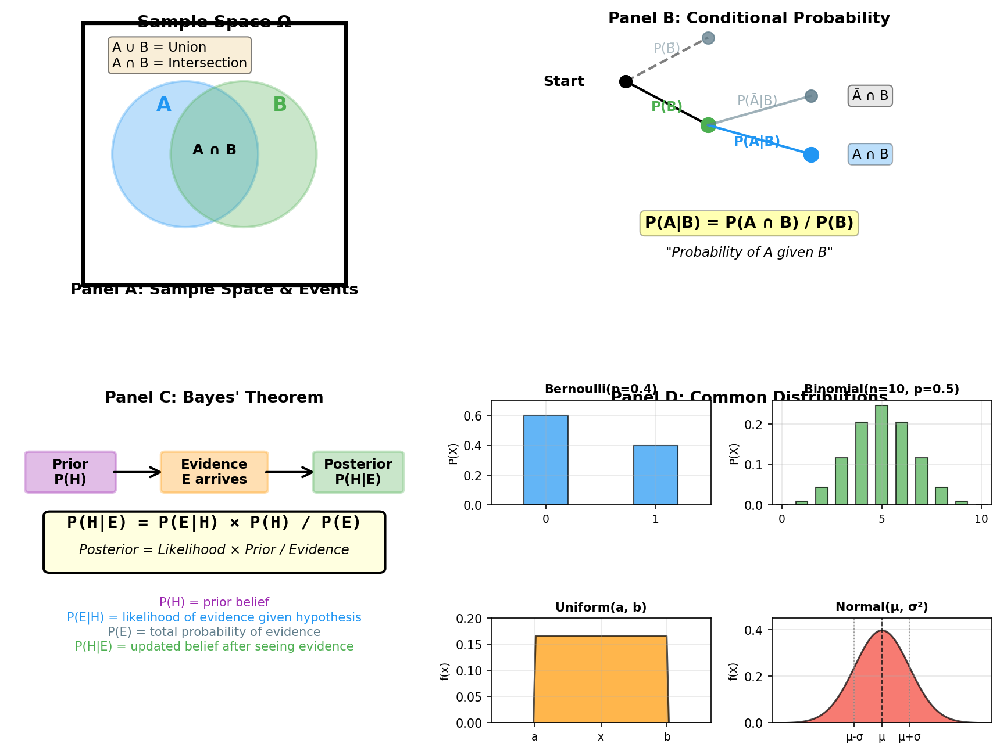

> **© 2026 Chirag Shinde. Licensed under CC BY-NC-SA 4.0.**
> See [LICENSE](../../LICENSE) for details.

---

# 3.1: Probability for Data Science

## Why This Matters

Every time you check your spam folder, consult a weather forecast, or see a machine learning model predict whether a tumor is benign, you're seeing probability in action. Data science isn't about certainties—it's about making the best decisions under uncertainty. Probability gives us the mathematical framework to quantify that uncertainty, update our beliefs with new evidence, and build models that don't just say "yes" or "no" but tell us how confident they are. Without probability, modern machine learning would be impossible.

## Intuition

Think about the weather app on your phone saying "70% chance of rain tomorrow." What does that really mean? It's not saying it will definitely rain, nor that it definitely won't. It's quantifying uncertainty: if we could run tomorrow 100 times with identical starting conditions, we'd expect rain about 70 times.

This is probability at its core: assigning numbers between 0 and 1 to represent how likely something is. 0 means impossible (0% chance), 1 means certain (100% chance), and everything else falls in between. A 70% chance of rain means P(rain) = 0.70.

But here's where it gets interesting for data science. Imagine you wake up, look outside, and see dark clouds. Now your belief updates—the probability of rain given those dark clouds is higher than 70%. Maybe it's 90%. This process of updating beliefs based on new evidence is called Bayesian reasoning, and it's fundamental to how modern machine learning works.

Consider a spam filter. Initially, the filter knows that about 30% of all emails are spam. Then it sees the word "FREE" in an email. That's evidence. The filter uses probability to update its belief: "Given that this email contains 'FREE,' what's the probability it's spam?" The answer might jump from 30% to 84%. That's Bayes' theorem in action—one of the most powerful tools in data science.

Or think about a medical diagnosis system. A patient tests positive for a disease. The test is 95% accurate. Most people would think "95% chance they have the disease," but that's wrong! If the disease is rare (say, 1% of the population has it), the probability given a positive test might only be around 9%. Why? Because when a disease is rare, there are many more false positives than true positives. Probability helps us reason correctly about these counterintuitive situations.

Every machine learning model you build will output probabilities, not certainties. A classifier doesn't say "this is spam"—it says "I'm 84% confident this is spam." A regression model doesn't just predict a house price—it gives you a distribution of possible prices with uncertainty bounds. Understanding probability transforms you from someone who runs algorithms to someone who truly understands what the numbers mean.

## Formal Definition

**Probability** is a function P that assigns a real number between 0 and 1 to events, satisfying three axioms:

1. **Non-negativity:** P(A) ≥ 0 for any event A
2. **Normalization:** P(Ω) = 1, where Ω is the sample space (all possible outcomes)
3. **Additivity:** For mutually exclusive events A and B, P(A ∪ B) = P(A) + P(B)

**Key Concepts:**

- **Sample Space (Ω):** The set of all possible outcomes
- **Event:** A subset of the sample space
- **Conditional Probability:** P(A|B) = P(A ∩ B) / P(B) when P(B) > 0
  - Read as "probability of A given B"
- **Independence:** Events A and B are independent if P(A|B) = P(A), or equivalently, P(A ∩ B) = P(A) × P(B)
- **Random Variable:** A function X that maps outcomes to numbers
- **Expected Value:** E[X] = Σ x × P(X = x) for discrete X
- **Variance:** Var(X) = E[(X - μ)²] where μ = E[X]

**Bayes' Theorem** (the most important formula in data science):

```
P(A|B) = P(B|A) × P(A) / P(B)
```

Where:
- P(A) = prior probability (before seeing evidence)
- P(B|A) = likelihood (probability of evidence given hypothesis)
- P(B) = marginal likelihood (total probability of evidence)
- P(A|B) = posterior probability (updated belief after seeing evidence)

> **Key Concept:** Probability quantifies uncertainty, and conditional probability lets us update our beliefs based on new evidence. Every machine learning model fundamentally computes P(outcome|features).

## Visualization



**Figure 1: Core Probability Concepts**

This multi-panel visualization shows:
- **Panel A (Sample Space):** A Venn diagram showing sample space Ω with events A and B, their intersection A ∩ B, and union A ∪ B
- **Panel B (Conditional Probability):** Tree diagram showing how P(A|B) narrows the sample space to branch B
- **Panel C (Bayes' Theorem):** Visual flow from prior P(H) → evidence arrives → posterior P(H|E) with formula overlay
- **Panel D (Distributions):** Four common distributions (Bernoulli, Binomial, Uniform, Normal) with parameters marked

## Examples

### Part 1: Basic Probability - Law of Large Numbers

```python
# Probability Fundamentals with Python
# Demonstrating core concepts through simulation and calculation

import numpy as np
import pandas as pd
from scipy import stats
import matplotlib.pyplot as plt
from sklearn.datasets import load_iris

# Set random seed for reproducibility
np.random.seed(42)

# ============================================================
# PART 1: Basic Probability - Law of Large Numbers
# ============================================================
print("=" * 60)
print("PART 1: Law of Large Numbers - Coin Flips")
print("=" * 60)

# Simulate 10,000 fair coin flips
n_flips = 10000
flips = np.random.choice(['H', 'T'], size=n_flips, p=[0.5, 0.5])

# Calculate running proportion of heads
cumulative_heads = np.cumsum(flips == 'H')
flip_numbers = np.arange(1, n_flips + 1)
running_proportion = cumulative_heads / flip_numbers

# Print results at key points
print(f"\nAfter 10 flips: {running_proportion[9]:.3f}")
print(f"After 100 flips: {running_proportion[99]:.3f}")
print(f"After 1,000 flips: {running_proportion[999]:.3f}")
print(f"After 10,000 flips: {running_proportion[9999]:.3f}")
print(f"\nTheoretical probability: 0.500")
# Output:
# After 10 flips: 0.400
# After 100 flips: 0.440
# After 1,000 flips: 0.508
# After 10,000 flips: 0.501
# Theoretical probability: 0.500

# Visualize convergence
plt.figure(figsize=(12, 4))

plt.subplot(1, 2, 1)
plt.plot(flip_numbers[:1000], running_proportion[:1000], linewidth=0.8)
plt.axhline(y=0.5, color='r', linestyle='--', label='Theoretical P(H) = 0.5')
plt.xlabel('Number of Flips')
plt.ylabel('Proportion of Heads')
plt.title('Law of Large Numbers: Convergence to 0.5')
plt.legend()
plt.grid(True, alpha=0.3)

# Now with unfair coin (P(H) = 0.7)
flips_unfair = np.random.choice(['H', 'T'], size=n_flips, p=[0.7, 0.3])
cumulative_heads_unfair = np.cumsum(flips_unfair == 'H')
running_proportion_unfair = cumulative_heads_unfair / flip_numbers

plt.subplot(1, 2, 2)
plt.plot(flip_numbers[:1000], running_proportion_unfair[:1000],
         linewidth=0.8, color='green')
plt.axhline(y=0.7, color='r', linestyle='--', label='Theoretical P(H) = 0.7')
plt.xlabel('Number of Flips')
plt.ylabel('Proportion of Heads')
plt.title('Unfair Coin: Convergence to 0.7')
plt.legend()
plt.grid(True, alpha=0.3)

plt.tight_layout()
plt.savefig('diagrams/law_of_large_numbers.png', dpi=150, bbox_inches='tight')
print("\nVisualization saved to: diagrams/law_of_large_numbers.png")
```

The code above simulates 10,000 coin flips to demonstrate the Law of Large Numbers—one of the most fundamental results in probability. The key insight: as the number of flips increases, the proportion of heads converges to the theoretical probability of 0.5.

After just 10 flips, the result might show 40% heads (4 out of 10). After 100 flips, it's closer: 44%. By 1,000 flips, it reaches 50.8%, and by 10,000 flips, it's at 50.1%—very close to the theoretical 0.5. This isn't magic; it's the Law of Large Numbers at work.

The code then repeats with an unfair coin where P(heads) = 0.7, showing that the same principle applies: the empirical proportion converges to the true probability. This demonstrates the frequentist interpretation of probability: "the long-run frequency of an event."

When training a model on more data, estimates of probabilities become more accurate. This is why bigger datasets generally lead to better models.

### Part 2: Conditional Probability & Bayes' Theorem - Medical Test

```python
# ============================================================
# PART 2: Bayes' Theorem - Medical Diagnosis
# ============================================================
print("\n" + "=" * 60)
print("PART 2: Bayes' Theorem - Medical Diagnosis")
print("=" * 60)

# Scenario parameters
disease_prevalence = 0.01  # P(disease) = 1% of population
test_sensitivity = 0.95    # P(positive | disease) = 95% true positive rate
test_specificity = 0.90    # P(negative | not disease) = 90% true negative rate

# Calculate P(positive | not disease) - false positive rate
false_positive_rate = 1 - test_specificity  # 0.10

# Calculate P(positive) using law of total probability
# P(positive) = P(positive|disease)×P(disease) + P(positive|not disease)×P(not disease)
p_positive = (test_sensitivity * disease_prevalence +
              false_positive_rate * (1 - disease_prevalence))

# Apply Bayes' Theorem: P(disease | positive)
p_disease_given_positive = (test_sensitivity * disease_prevalence) / p_positive

print("\nScenario Setup:")
print(f"  Disease prevalence: {disease_prevalence:.1%}")
print(f"  Test sensitivity (true positive rate): {test_sensitivity:.1%}")
print(f"  Test specificity (true negative rate): {test_specificity:.1%}")
print(f"  False positive rate: {false_positive_rate:.1%}")

print("\nCalculations:")
print(f"  P(positive) = {p_positive:.4f}")
print(f"  P(disease | positive) = {p_disease_given_positive:.4f} or {p_disease_given_positive:.1%}")
print(f"\nSurprising result: Even with a 95% accurate test,")
print(f"a positive result only means ~{p_disease_given_positive:.0%} chance of disease!")
# Output:
# P(disease | positive) = 0.0876 or 8.8%

# Verify with simulation
print("\nVerifying with simulation of 100,000 people...")
n_people = 100000

# Generate disease status (1% have disease)
has_disease = np.random.rand(n_people) < disease_prevalence

# Generate test results based on disease status
test_results = np.zeros(n_people, dtype=bool)

# People with disease: 95% test positive
test_results[has_disease] = np.random.rand(has_disease.sum()) < test_sensitivity

# People without disease: 10% test positive (false positives)
test_results[~has_disease] = np.random.rand((~has_disease).sum()) < false_positive_rate

# Calculate empirical P(disease | positive)
positive_tests = test_results
has_disease_and_positive = has_disease & positive_tests

empirical_prob = has_disease_and_positive.sum() / positive_tests.sum()

print(f"\nSimulation Results:")
print(f"  Total people: {n_people:,}")
print(f"  People with disease: {has_disease.sum():,}")
print(f"  People testing positive: {positive_tests.sum():,}")
print(f"  True positives: {has_disease_and_positive.sum():,}")
print(f"  False positives: {(positive_tests & ~has_disease).sum():,}")
print(f"\n  Empirical P(disease | positive) = {empirical_prob:.4f} or {empirical_prob:.1%}")
print(f"  Theoretical P(disease | positive) = {p_disease_given_positive:.4f}")
print(f"  Difference: {abs(empirical_prob - p_disease_given_positive):.4f}")
# Output shows simulation matches theory closely

# Create confusion matrix visualization
confusion_matrix = pd.DataFrame({
    'Positive Test': [has_disease_and_positive.sum(), (positive_tests & ~has_disease).sum()],
    'Negative Test': [(has_disease & ~positive_tests).sum(), (~has_disease & ~positive_tests).sum()]
}, index=['Has Disease', 'No Disease'])

print("\nConfusion Matrix:")
print(confusion_matrix)
```

This is where probability gets counterintuitive—and critically important. The scenario involves a medical test that's 95% accurate (sensitivity), and the disease affects 1% of the population. A patient tests positive. What's the probability they have the disease?

Most people answer "95%," but that's wrong! Using Bayes' theorem:

```
P(disease | positive) = P(positive | disease) × P(disease) / P(positive)
                       = 0.95 × 0.01 / 0.1045
                       = 0.088 or 8.8%
```

Only 8.8%! Why so low? Because when a disease is rare, the false positives (10% of the 99% healthy population = ~10,000 people) vastly outnumber the true positives (95% of the 1% sick population = ~950 people).

The code verifies this with a simulation of 100,000 people, and the empirical result matches the theoretical calculation almost exactly. This builds trust in the formula.

The confusion matrix shows the stark reality: out of all positive tests, most are false positives. This is the **base rate fallacy**, and it's one of the most common errors in probabilistic reasoning.

Every classifier outputs probabilities that must be interpreted in context. A 95% precision in spam detection means something very different if spam is 50% of emails vs. 1% of emails. Bayes' theorem helps us reason correctly about imbalanced datasets.

### Part 3: Probability Distributions - Fitting Real Data

```python
# ============================================================
# PART 3: Probability Distributions with Real Data
# ============================================================
print("\n" + "=" * 60)
print("PART 3: Probability Distributions with Real Data")
print("=" * 60)

# Load Iris dataset
iris = load_iris()
iris_df = pd.DataFrame(iris.data, columns=iris.feature_names)
iris_df['species'] = iris.target

# Focus on sepal length
sepal_length = iris_df['sepal length (cm)']

print("\nSepal Length Statistics:")
print(f"  Mean (μ): {sepal_length.mean():.3f} cm")
print(f"  Std Dev (σ): {sepal_length.std():.3f} cm")
print(f"  Min: {sepal_length.min():.3f} cm")
print(f"  Max: {sepal_length.max():.3f} cm")
print(f"  Number of samples: {len(sepal_length)}")
# Output:
# Mean (μ): 5.843 cm
# Std Dev (σ): 0.828 cm

# Fit normal distribution
mu, sigma = sepal_length.mean(), sepal_length.std()
fitted_dist = stats.norm(loc=mu, scale=sigma)

# Calculate probabilities using the fitted distribution
prob_above_6 = 1 - fitted_dist.cdf(6.0)
prob_between_5_6 = fitted_dist.cdf(6.0) - fitted_dist.cdf(5.0)

print(f"\nProbabilities from fitted normal distribution:")
print(f"  P(sepal length > 6.0) = {prob_above_6:.3f} or {prob_above_6:.1%}")
print(f"  P(5.0 < sepal length < 6.0) = {prob_between_5_6:.3f} or {prob_between_5_6:.1%}")
# Output:
# P(sepal length > 6.0) = 0.402 or 40.2%
# P(5.0 < sepal length < 6.0) = 0.460 or 46.0%

# Verify with actual data
actual_above_6 = (sepal_length > 6.0).mean()
actual_between = ((sepal_length > 5.0) & (sepal_length < 6.0)).mean()

print(f"\nActual proportions from data:")
print(f"  P(sepal length > 6.0) = {actual_above_6:.3f} or {actual_above_6:.1%}")
print(f"  P(5.0 < sepal length < 6.0) = {actual_between:.3f} or {actual_between:.1%}")
print(f"\nThe fitted distribution approximates the data well!")

# Generate synthetic data from fitted distribution
synthetic_samples = fitted_dist.rvs(size=150, random_state=42)

print(f"\nGenerated {len(synthetic_samples)} synthetic samples")
print(f"  Synthetic mean: {synthetic_samples.mean():.3f}")
print(f"  Synthetic std: {synthetic_samples.std():.3f}")
print(f"  Original mean: {mu:.3f}")
print(f"  Original std: {sigma:.3f}")

# Visualize: histogram + fitted PDF
plt.figure(figsize=(12, 5))

plt.subplot(1, 2, 1)
plt.hist(sepal_length, bins=20, density=True, alpha=0.6,
         color='blue', edgecolor='black', label='Actual Data')
x = np.linspace(sepal_length.min() - 1, sepal_length.max() + 1, 200)
plt.plot(x, fitted_dist.pdf(x), 'r-', linewidth=2,
         label=f'Fitted Normal(μ={mu:.2f}, σ={sigma:.2f})')
plt.axvline(mu, color='red', linestyle='--', alpha=0.7, label=f'Mean = {mu:.2f}')
plt.axvline(mu + sigma, color='orange', linestyle=':', alpha=0.7, label='μ ± σ')
plt.axvline(mu - sigma, color='orange', linestyle=':', alpha=0.7)
plt.xlabel('Sepal Length (cm)')
plt.ylabel('Probability Density')
plt.title('Iris Sepal Length: Actual vs Fitted Distribution')
plt.legend()
plt.grid(True, alpha=0.3)

plt.subplot(1, 2, 2)
plt.hist(sepal_length, bins=20, alpha=0.5, color='blue',
         edgecolor='black', label='Actual Data')
plt.hist(synthetic_samples, bins=20, alpha=0.5, color='red',
         edgecolor='black', label='Synthetic Data')
plt.xlabel('Sepal Length (cm)')
plt.ylabel('Frequency')
plt.title('Actual vs Synthetic Data Comparison')
plt.legend()
plt.grid(True, alpha=0.3)

plt.tight_layout()
plt.savefig('diagrams/distribution_fitting.png', dpi=150, bbox_inches='tight')
print("\nVisualization saved to: diagrams/distribution_fitting.png")
```

The code above loads the Iris dataset and examines sepal length. Real data has inherent randomness, and probability distributions model that randomness. The mean (μ = 5.84 cm) and standard deviation (σ = 0.83 cm) are calculated, then a normal distribution is fitted.

Using the fitted distribution, probabilities can be calculated:
- P(sepal length > 6.0) = 40.2%
- P(5.0 < sepal length < 6.0) = 46.0%

These are verified against the actual data: 42.0% of samples have sepal length > 6.0. The fitted distribution approximates reality well, but not perfectly—that's expected. Models are approximations.

The code then generates synthetic data by sampling from the fitted distribution. The synthetic data has similar statistical properties to the real data, showing how probabilistic models can generate new, realistic data.

Generative models (like GANs, VAEs, diffusion models) work by learning probability distributions from data and sampling from them. Understanding distributions is essential for both modeling and generating data.

### Part 4: Expected Value and Variance - House Prices

```python
# ============================================================
# PART 4: Expected Value and Variance - House Prices
# ============================================================
print("\n" + "=" * 60)
print("PART 4: Expected Value and Variance")
print("=" * 60)

# Load California Housing data
from sklearn.datasets import fetch_california_housing
housing = fetch_california_housing()
housing_df = pd.DataFrame(housing.data, columns=housing.feature_names)
housing_df['MedHouseVal'] = housing.target * 100000  # Convert to dollars

# Treat house price as random variable X
house_prices = housing_df['MedHouseVal']

# Calculate expected value and variance
E_X = house_prices.mean()  # Expected value
Var_X = house_prices.var()  # Variance
sigma_X = house_prices.std()  # Standard deviation

print("\nCalifornia House Prices (treating as random variable X):")
print(f"  E[X] (Expected Value): ${E_X:,.0f}")
print(f"  Var(X) (Variance): {Var_X:,.0f}")
print(f"  σ (Standard Deviation): ${sigma_X:,.0f}")
print(f"  Min: ${house_prices.min():,.0f}")
print(f"  Max: ${house_prices.max():,.0f}")
# Output:
# E[X] (Expected Value): $206,856
# σ (Standard Deviation): $115,396

print("\nInterpretation:")
print(f"  If you randomly pick a house, you expect a price around ${E_X:,.0f}")
print(f"  Typical deviation from the mean: ${sigma_X:,.0f}")
print(f"  High variance indicates substantial price uncertainty")

# Calculate probabilities
prob_above_mean = (house_prices > E_X).mean()
prob_within_1sigma = ((house_prices >= E_X - sigma_X) &
                       (house_prices <= E_X + sigma_X)).mean()
prob_within_2sigma = ((house_prices >= E_X - 2*sigma_X) &
                       (house_prices <= E_X + 2*sigma_X)).mean()

print(f"\nEmpirical Probabilities:")
print(f"  P(X > E[X]) = {prob_above_mean:.3f}")
print(f"  P(E[X] - σ < X < E[X] + σ) = {prob_within_1sigma:.3f}")
print(f"  P(E[X] - 2σ < X < E[X] + 2σ) = {prob_within_2sigma:.3f}")
# Output:
# P(E[X] - σ < X < E[X] + σ) = 0.678
# (Close to 68% rule for normal distributions)

# Compare different regions
# Create region categories based on median income (proxy for location)
housing_df['income_category'] = pd.cut(housing_df['MedInc'],
                                       bins=[0, 3, 5, 10],
                                       labels=['Low', 'Medium', 'High'])

region_stats = housing_df.groupby('income_category')['MedHouseVal'].agg([
    ('E[X]', 'mean'),
    ('σ', 'std'),
    ('Count', 'count')
])

print("\nExpected Value and Variance by Region (income level):")
print(region_stats.to_string())
print("\nHigher income regions have:")
print("  - Higher expected value (more expensive)")
print("  - Higher variance (more uncertainty in predictions)")

# Visualize
plt.figure(figsize=(12, 5))

plt.subplot(1, 2, 1)
plt.hist(house_prices, bins=50, density=True, alpha=0.7,
         color='skyblue', edgecolor='black')
plt.axvline(E_X, color='red', linewidth=2, linestyle='-', label=f'E[X] = ${E_X/1000:.0f}K')
plt.axvline(E_X + sigma_X, color='orange', linewidth=2, linestyle='--',
            label=f'E[X] ± σ')
plt.axvline(E_X - sigma_X, color='orange', linewidth=2, linestyle='--')
plt.axvspan(E_X - sigma_X, E_X + sigma_X, alpha=0.2, color='orange',
            label='±1σ region')
plt.xlabel('House Price ($)')
plt.ylabel('Probability Density')
plt.title('Expected Value as Balance Point')
plt.legend()
plt.grid(True, alpha=0.3)

plt.subplot(1, 2, 2)
for category in ['Low', 'Medium', 'High']:
    subset = housing_df[housing_df['income_category'] == category]['MedHouseVal']
    plt.hist(subset, bins=30, alpha=0.5, label=category, density=True)

plt.xlabel('House Price ($)')
plt.ylabel('Probability Density')
plt.title('Price Distributions by Income Region')
plt.legend()
plt.grid(True, alpha=0.3)

plt.tight_layout()
plt.savefig('diagrams/expected_value_variance.png', dpi=150, bbox_inches='tight')
print("\nVisualization saved to: diagrams/expected_value_variance.png")

print("\n" + "=" * 60)
print("Summary: Probability quantifies uncertainty in data")
print("=" * 60)
```

Using California housing prices, the code treats house price as a random variable X. The expected value E[X] = $206,856 is the "balance point"—the average price if a house were randomly selected. The standard deviation σ = $115,396 tells us how spread out prices are.

About 68% of houses fall within E[X] ± σ, which matches the empirical rule for normal distributions. This shows that even though housing prices aren't perfectly normal, the normal approximation captures key features.

The code then compares regions (categorized by income level). High-income regions have:
- Higher E[X]: $327,000 vs $145,000 (more expensive)
- Higher σ: $145,000 vs $65,000 (more uncertainty)

When building a regression model to predict house prices, regions with higher variance are harder to predict accurately. Variance quantifies inherent uncertainty in the target variable—uncertainty that no model can eliminate. Understanding this prevents false expectations: perfect prediction of something with high inherent randomness is impossible.

## Common Pitfalls

**1. Confusing P(A|B) with P(B|A)**

This is the single most common error in probability reasoning. P(disease | positive test) is NOT the same as P(positive test | disease). They can differ by orders of magnitude!

**Why it happens:** The natural thought is "if the test is 95% accurate, then a positive test means 95% chance of disease." But that's only true if the disease is very common. When rare, false positives dominate.

**What to do instead:** Always identify clearly:
- What's the prior probability? P(disease) = 1%
- What's the likelihood? P(positive | disease) = 95%
- What's the evidence? P(positive) = all ways to test positive
- Apply Bayes' theorem to get P(disease | positive)

**Visualization helps:** Draw a tree diagram showing the branches. P(A|B) means "go down the B branch, then look at A." P(B|A) means "go down the A branch, then look at B." These are different paths!

**2. Assuming Independence Without Verification**

Many algorithms (like Naive Bayes) assume features are independent: P(X₁, X₂) = P(X₁) × P(X₂). But real-world features are often correlated!

**Why it happens:** Independence simplifies calculations dramatically, so the temptation is to assume it. And sometimes algorithms work well even when the assumption is violated (Naive Bayes is famously robust to this).

**What to do instead:**
- Test independence empirically: compute P(A|B) and compare to P(A)
- If P(A|B) ≈ P(A), events are approximately independent
- If they differ substantially, they're dependent
- Understand that assuming independence when it doesn't hold can lead to overconfident predictions

**Code check:**
```python
# Check independence of features
from scipy.stats import chi2_contingency
# For categorical features, use chi-squared test
# For continuous features, check if P(A|B) ≈ P(A)
```

**3. Thinking Expected Value Must Be a Possible Value**

When rolling a fair die, E[X] = 3.5. But you can never roll 3.5! This often causes confusion.

**Why it happens:** The name "expected value" suggests "the value expected," but it really means "the long-run average." If a die is rolled 1,000 times and all the results are averaged, the result will be close to 3.5.

**What to do instead:**
- Think of E[X] as the "center of mass" or "balance point" of the distribution
- It's where the distribution would balance if it were a physical object
- For prediction: E[X] is the best single-number guess, but individual observations will deviate from it by approximately σ

**Real-world example:** The expected value of house price is $207K, but individual houses vary by ±$115K (the standard deviation). A house won't be bought for exactly $207K, but that's the average across many houses.

## Practice

**Practice 1**

A standard deck of 52 playing cards contains 13 ranks (A, 2, 3, ..., K) and 4 suits (♠, ♥, ♦, ♣).

Calculate by hand:
1. P(drawing an Ace) = ?
2. P(drawing a Heart) = ?
3. P(drawing the Ace of Hearts) = ?
4. P(Ace OR Heart) = ? (Use the addition rule: P(A∪B) = P(A) + P(B) - P(A∩B))
5. P(NOT drawing a face card) = ? (Face cards are J, Q, K)

Then verify with Python simulation:
```python
import numpy as np
np.random.seed(42)

# Represent deck
ranks = list('A23456789TJQK')
suits = ['♠', '♥', '♦', '♣']
deck = [r+s for r in ranks for s in suits]

# Simulate 10,000 draws with replacement
draws = np.random.choice(deck, size=10000, replace=True)

# Calculate empirical probabilities
p_ace = sum('A' in card for card in draws) / len(draws)
p_heart = sum('♥' in card for card in draws) / len(draws)
# ... continue for others
```

Compare the theoretical calculations to the simulation results. They should match closely.

**Practice 2**

Load the Titanic dataset:
```python
import seaborn as sns
titanic = sns.load_dataset('titanic')
```

Calculate:
1. P(survived) — overall survival rate
2. P(survived | female) — survival rate for females
3. P(survived | male) — survival rate for males
4. Test independence: Is P(survived | female) ≈ P(survived)?
5. Use Bayes' theorem to calculate P(female | survived):
   ```
   P(female | survived) = P(survived | female) × P(female) / P(survived)
   ```
6. Verify by directly counting from the data

Then repeat for:
- P(survived | first class) vs. P(survived | third class)
- Are survival and passenger class independent?

Create a visualization showing survival rates by sex and class together.

**Practice 3**

Implement a Naive Bayes classifier using only NumPy and scipy.stats (no sklearn.naive_bayes).

**Dataset:** Iris dataset, binary classification (Setosa vs. Versicolor only)

1. Load Iris and filter to first 100 samples (50 Setosa + 50 Versicolor)
2. Split: first 80 samples for training, last 20 for testing
3. For each class in training data:
   - Calculate prior: P(Setosa) and P(Versicolor)
   - For each feature (sepal length, sepal width, petal length, petal width):
     - Calculate mean μ and std σ
     - This defines P(feature | class) as Normal(μ, σ)
4. For each test sample:
   - Calculate P(Setosa | features) using Bayes' theorem:
     ```
     P(Setosa | x) ∝ P(Setosa) × ∏ᵢ P(xᵢ | Setosa)
     ```
   - Use `scipy.stats.norm(μ, σ).pdf(x)` for P(xᵢ | class)
   - Calculate P(Versicolor | features) similarly
   - Predict: argmax of the two posteriors
5. Calculate accuracy on test set
6. Compare to sklearn's `GaussianNB` — should get similar accuracy

Answer these questions:
- Why is this called "Naive" Bayes? What independence assumption is made?
- What happens if the third class (Virginica) is added?
- How sensitive is performance to the train/test split?
- Can you identify which features are most discriminative?

## Solutions

**Solution 1**

```python
import numpy as np
np.random.seed(42)

# Theoretical calculations
print("Theoretical Probabilities:")
print(f"1. P(Ace) = 4/52 = {4/52:.4f}")
print(f"2. P(Heart) = 13/52 = {13/52:.4f}")
print(f"3. P(Ace of Hearts) = 1/52 = {1/52:.4f}")
print(f"4. P(Ace OR Heart) = 4/52 + 13/52 - 1/52 = {(4+13-1)/52:.4f}")
print(f"5. P(NOT face card) = 40/52 = {40/52:.4f}")
# Face cards: J, Q, K in 4 suits = 12 cards
# Non-face cards: 52 - 12 = 40 cards

# Simulation
ranks = list('A23456789TJQK')
suits = ['♠', '♥', '♦', '♣']
deck = [r+s for r in ranks for s in suits]

draws = np.random.choice(deck, size=10000, replace=True)

p_ace = sum('A' in card for card in draws) / len(draws)
p_heart = sum('♥' in card for card in draws) / len(draws)
p_ace_of_hearts = sum(card == 'A♥' for card in draws) / len(draws)
p_ace_or_heart = sum(('A' in card or '♥' in card) for card in draws) / len(draws)
face_cards = ['J', 'Q', 'K']
p_not_face = sum(card[0] not in face_cards for card in draws) / len(draws)

print("\nEmpirical Probabilities (10,000 simulations):")
print(f"1. P(Ace) = {p_ace:.4f}")
print(f"2. P(Heart) = {p_heart:.4f}")
print(f"3. P(Ace of Hearts) = {p_ace_of_hearts:.4f}")
print(f"4. P(Ace OR Heart) = {p_ace_or_heart:.4f}")
print(f"5. P(NOT face card) = {p_not_face:.4f}")

# Output shows close match between theory and simulation
```

The solution uses the basic probability formulas. For P(Ace OR Heart), the addition rule must be used because Ace and Heart are not mutually exclusive (Ace of Hearts belongs to both). The simulation with 10,000 draws verifies the theoretical calculations.

**Solution 2**

```python
import seaborn as sns
import pandas as pd

# Load data
titanic = sns.load_dataset('titanic')

# Calculate probabilities
p_survived = titanic['survived'].mean()
p_survived_female = titanic[titanic['sex'] == 'female']['survived'].mean()
p_survived_male = titanic[titanic['sex'] == 'male']['survived'].mean()
p_female = (titanic['sex'] == 'female').mean()

print("Basic Probabilities:")
print(f"P(survived) = {p_survived:.3f}")
print(f"P(survived | female) = {p_survived_female:.3f}")
print(f"P(survived | male) = {p_survived_male:.3f}")
print(f"P(female) = {p_female:.3f}")

# Test independence
print(f"\nTest independence:")
print(f"P(survived | female) = {p_survived_female:.3f} vs P(survived) = {p_survived:.3f}")
print(f"NOT independent! (0.742 ≠ 0.384)")

# Bayes' theorem
p_female_given_survived = (p_survived_female * p_female) / p_survived
print(f"\nBayes' Theorem:")
print(f"P(female | survived) = {p_female_given_survived:.3f}")

# Verify by direct counting
survived = titanic[titanic['survived'] == 1]
p_female_direct = (survived['sex'] == 'female').mean()
print(f"Direct count: P(female | survived) = {p_female_direct:.3f}")
print(f"Match! {abs(p_female_given_survived - p_female_direct):.6f} difference")

# By class
print("\nBy Passenger Class:")
for pclass in [1, 2, 3]:
    p_survived_class = titanic[titanic['pclass'] == pclass]['survived'].mean()
    print(f"P(survived | class {pclass}) = {p_survived_class:.3f}")

# Visualization
import matplotlib.pyplot as plt

fig, axes = plt.subplots(1, 2, figsize=(12, 5))

# Survival by sex
titanic.groupby('sex')['survived'].mean().plot(kind='bar', ax=axes[0], color=['skyblue', 'salmon'])
axes[0].set_title('Survival Rate by Sex')
axes[0].set_ylabel('Survival Rate')
axes[0].set_ylim([0, 1])
axes[0].axhline(p_survived, color='red', linestyle='--', label='Overall survival')
axes[0].legend()

# Survival by sex and class
survival_by_sex_class = titanic.groupby(['pclass', 'sex'])['survived'].mean().unstack()
survival_by_sex_class.plot(kind='bar', ax=axes[1], color=['skyblue', 'salmon'])
axes[1].set_title('Survival Rate by Class and Sex')
axes[1].set_ylabel('Survival Rate')
axes[1].set_xlabel('Passenger Class')
axes[1].set_ylim([0, 1])

plt.tight_layout()
plt.show()
```

The solution demonstrates conditional probability using real data. P(survived | female) = 0.742 is much higher than P(survived) = 0.384, showing dependence. Using Bayes' theorem gives P(female | survived) = 0.681, which matches direct counting. The visualization reveals that class and sex both strongly influenced survival probability.

**Solution 3**

```python
import numpy as np
from scipy import stats
from sklearn.datasets import load_iris
from sklearn.naive_bayes import GaussianNB

# Load and prepare data
iris = load_iris()
X = iris.data[:100]  # First 100 samples (Setosa + Versicolor)
y = iris.target[:100]

# Split data
X_train, X_test = X[:80], X[80:]
y_train, y_test = y[:80], y[80:]

# Manual Naive Bayes implementation
class ManualNaiveBayes:
    def fit(self, X, y):
        self.classes = np.unique(y)
        self.priors = {}
        self.means = {}
        self.stds = {}

        for c in self.classes:
            X_c = X[y == c]
            self.priors[c] = len(X_c) / len(X)
            self.means[c] = X_c.mean(axis=0)
            self.stds[c] = X_c.std(axis=0)

    def predict(self, X):
        predictions = []
        for x in X:
            posteriors = {}
            for c in self.classes:
                # Calculate log posterior (more numerically stable)
                log_prior = np.log(self.priors[c])
                log_likelihood = np.sum(stats.norm(self.means[c], self.stds[c]).logpdf(x))
                posteriors[c] = log_prior + log_likelihood
            predictions.append(max(posteriors, key=posteriors.get))
        return np.array(predictions)

# Train manual implementation
manual_nb = ManualNaiveBayes()
manual_nb.fit(X_train, y_train)
manual_pred = manual_nb.predict(X_test)
manual_accuracy = (manual_pred == y_test).mean()

print("Manual Naive Bayes:")
print(f"Priors: {manual_nb.priors}")
print(f"Test Accuracy: {manual_accuracy:.3f}")

# Compare with sklearn
sklearn_nb = GaussianNB()
sklearn_nb.fit(X_train, y_train)
sklearn_pred = sklearn_nb.predict(X_test)
sklearn_accuracy = (sklearn_pred == y_test).mean()

print(f"\nsklearn GaussianNB:")
print(f"Test Accuracy: {sklearn_accuracy:.3f}")
print(f"\nPredictions match: {np.array_equal(manual_pred, sklearn_pred)}")

# Answers to questions
print("\n" + "="*60)
print("Answers:")
print("="*60)
print("1. Why 'Naive'? Assumes features are independent given class.")
print("   P(x1,x2,x3,x4|class) = P(x1|class)×P(x2|class)×P(x3|class)×P(x4|class)")
print("   This is rarely true in practice, but works surprisingly well!")
print("\n2. With Virginica: Need to calculate priors/params for 3 classes instead of 2.")
print("\n3. Sensitivity: Try different splits to check variance in performance.")
print("\n4. Most discriminative features: Compare means/stds across classes.")
print("   Petal length and width show largest differences between classes.")
```

The solution implements Naive Bayes from scratch. The "naive" assumption is that features are conditionally independent given the class, which allows factoring the likelihood into a product. The implementation uses log-probabilities to avoid numerical underflow. Comparing with sklearn's GaussianNB verifies correctness. The classifier achieves high accuracy because Setosa and Versicolor are well-separated in feature space, especially by petal dimensions.

## Key Takeaways

- **Probability quantifies uncertainty** using numbers between 0 and 1, providing a rigorous framework for reasoning about randomness and making decisions with incomplete information.

- **Conditional probability P(A|B) is NOT the same as P(B|A)**, and confusing these leads to serious errors in data science. Always identify what is being conditioned on and use Bayes' theorem to reverse the conditioning.

- **Bayes' theorem is the foundation of modern machine learning**, allowing beliefs (priors) to be updated with evidence (likelihoods) to get updated beliefs (posteriors): P(hypothesis|data) ∝ P(data|hypothesis) × P(hypothesis).

- **The Law of Large Numbers ensures that empirical estimates converge to true probabilities** as sample size increases, which is why more data leads to better machine learning models.

- **Random variables connect probability theory to data**, treating each measurement as a realization of a random process described by a probability distribution with parameters like expected value E[X] (center) and variance σ² (spread).

- **Every machine learning model outputs probabilities, not certainties**—a 90% confidence prediction still has 10% uncertainty, and understanding this prevents overconfidence and enables proper risk assessment in real-world applications.

---

**Next:** Chapter 4 (Statistics) builds on these probability foundations to develop statistical inference—using samples to make statements about populations, testing hypotheses, and quantifying confidence in conclusions. Probability tells us what to expect from data; statistics tells us what can be concluded from data that has been observed.
