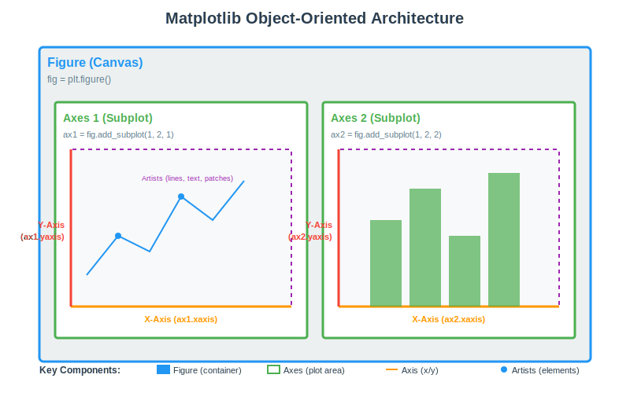
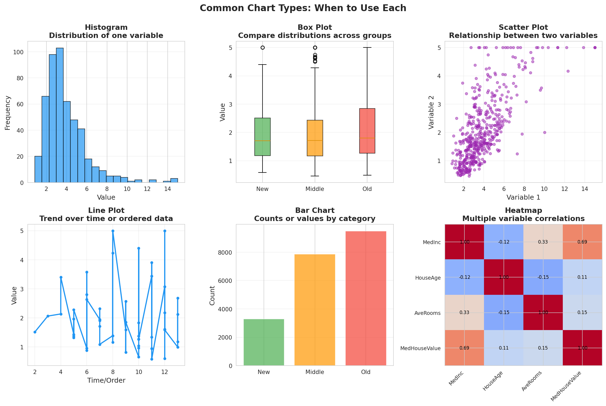
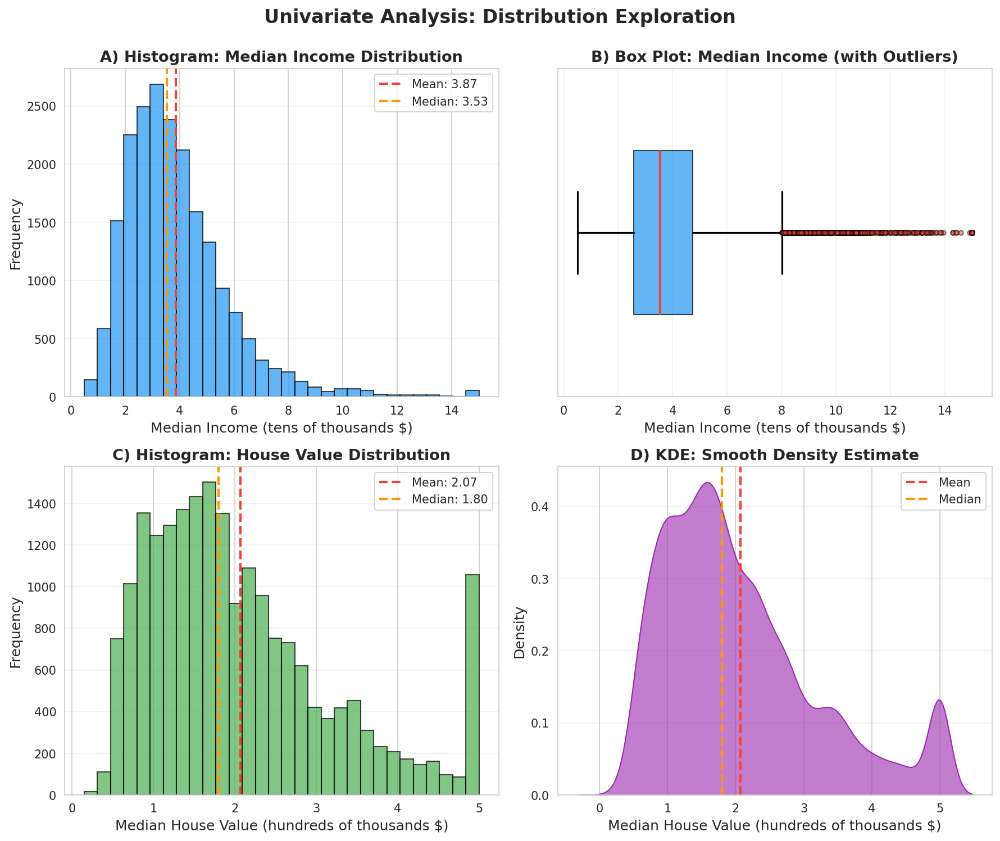
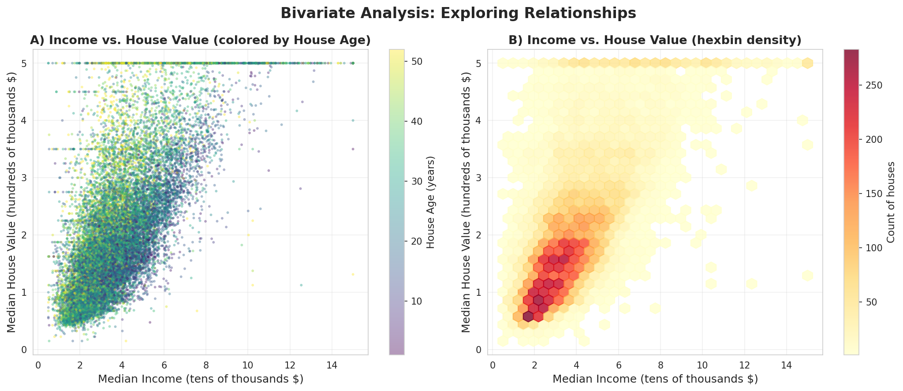
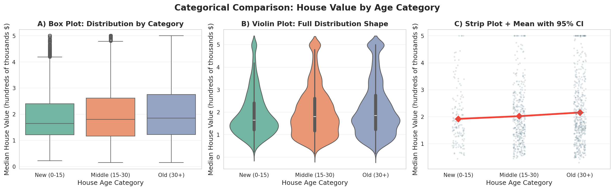
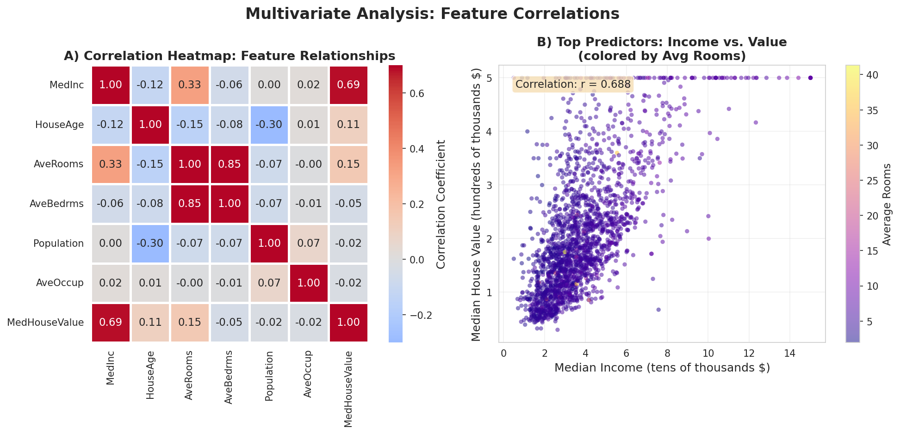
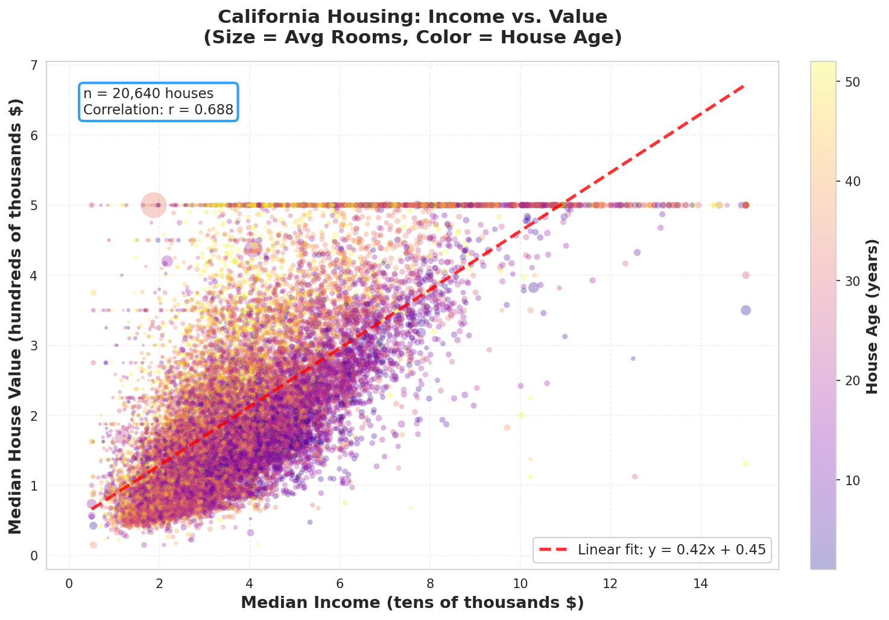

> **© 2026 Chirag Shinde. Licensed under CC BY-NC-SA 4.0.**
> See [LICENSE](../../LICENSE) for details.

---

# Chapter 7: Data Visualization with Matplotlib and Seaborn

## Why This Matters

A thousand rows of numbers won't reveal the outliers hiding in your medical dataset or the clusters lurking in customer purchase patterns—but a single scatter plot will. Data visualization is how invisible patterns become visible, transforming raw tables into insights that can be grasped in seconds. Whether exploring data for the first time or presenting findings to stakeholders who need answers now, visualization is the most powerful tool for both discovery and communication.

## Intuition

Imagine trying to understand traffic patterns in a city by reading a spreadsheet with thousands of rows: timestamp, street name, vehicle count, speed. Your eyes would glaze over after the first hundred rows, and you'd have no sense of where congestion happens or when rush hour peaks.

Now picture a heat map where roads light up red during traffic jams and stay cool blue when clear, with colors shifting throughout the day. Instantly, the pattern emerges: the highway chokes at 8 AM and 5 PM, while side streets stay clear. The visualization doesn't just show the data—it tells a story.

This is the magic of data visualization. Our brains process visual information thousands of times faster than text or numbers. Humans are hardwired to spot patterns, anomalies, and relationships when they can *see* them. A histogram reveals whether data is normally distributed or wildly skewed. A scatter plot exposes correlations that correlation coefficients alone might miss. Box plots flag outliers that could derail a model.

But visualization isn't one-size-fits-all. Just like a hammer won't tighten a screw, a pie chart won't show correlations. Every chart type has a purpose: histograms show distributions, scatter plots reveal relationships, box plots compare groups. Choosing the right visualization is like choosing the right lens for a camera—it determines what becomes visible.

Two powerful Python libraries form the foundation: **matplotlib** for fine-grained control and **seaborn** for beautiful statistical plots with sensible defaults. Think of matplotlib as a Swiss Army knife (versatile but requires expertise) and seaborn as a power drill (specialized and efficient). Together, they form the foundation of Python data visualization, used by data scientists worldwide for everything from exploratory analysis to publication-quality figures.

## Formal Definition

**Data visualization** is the graphical representation of data using visual elements (points, lines, bars, colors, shapes) to encode quantitative and qualitative information. The goal is to facilitate pattern recognition, comparison, and communication of insights that are difficult to extract from raw data alone.

### The Grammar of Graphics

Modern data visualization follows the **grammar of graphics**, a systematic framework where every plot consists of:

1. **Data** — The dataset to visualize
2. **Aesthetics (aes)** — Mappings from data to visual properties (x-position, y-position, color, size, shape)
3. **Geometry (geom)** — Visual marks that represent data (points, lines, bars)
4. **Scales** — How data values map to visual values (linear, logarithmic, color scales)
5. **Coordinate system** — The space in which data is plotted (Cartesian, polar)

### Chart Type Selection

The choice of visualization depends on **data type** and **analytical goal**:

| Data Types | Goal | Chart Type |
|------------|------|------------|
| One continuous variable | Distribution | Histogram, box plot, violin plot, KDE |
| One categorical variable | Frequency | Bar chart |
| Two continuous variables | Relationship | Scatter plot, line plot (if ordered/temporal) |
| Categorical + Continuous | Compare distributions | Box plot, violin plot, bar chart with error bars |
| Two categorical variables | Frequency comparison | Grouped bar chart, heatmap |
| Many continuous variables | Correlations | Correlation heatmap, pair plot |
| Time + Continuous | Trends over time | Line plot, area chart |

### Matplotlib Architecture

Matplotlib uses an **object-oriented hierarchy**:

- **Figure** — The overall canvas (container for everything)
- **Axes** — Individual plot areas within a figure (contains data visualizations)
- **Axis** — The x-axis or y-axis objects (handles ticks, labels, limits)
- **Artists** — Every visible element (lines, text, patches)

**Best practice:** Use the explicit object-oriented interface (`fig, ax = plt.subplots()`) rather than the pyplot state-based interface for clarity and scalability.


*Figure: Matplotlib's object-oriented architecture showing the relationship between Figure, Axes, Axis, and Artists components.*

> **Key Concept:** Visualization transforms data from information to communication—choose chart types based on what question you're asking, not what looks prettiest.

## Visualization

Here's how to think about choosing visualizations:

```
START: What do you want to show?
│
├─ Distribution of ONE variable
│  ├─ Continuous? → Histogram, Box plot, Violin plot, KDE
│  └─ Categorical? → Bar chart
│
├─ Relationship between TWO variables
│  ├─ Both continuous? → Scatter plot, Line plot (if ordered)
│  ├─ One categorical, one continuous? → Box plot, Violin plot
│  └─ Both categorical? → Grouped bar chart, Heatmap
│
├─ Comparison across GROUPS
│  └─ Box plot, Violin plot, Grouped bar chart
│
├─ Correlation among MANY variables
│  └─ Correlation heatmap, Pair plot
│
└─ Change over TIME
   └─ Line plot, Area chart
```

For a comprehensive comparison of common chart types, see the visual guide below:


*Figure: Common chart types and their use cases. Each visualization type is optimized for specific data structures and questions.*

## Examples

The following explores the California Housing dataset with a comprehensive visualization analysis, from univariate distributions to multivariate correlations.

### Part 1: Setup and Data Loading

```python
# Complete Data Visualization Example
# Demonstrates univariate, bivariate, and multivariate visualizations

import numpy as np
import pandas as pd
import matplotlib.pyplot as plt
import seaborn as sns
from sklearn.datasets import fetch_california_housing

# Set random seed for reproducibility
np.random.seed(42)

# Configure visualization style
sns.set_style('whitegrid')
sns.set_palette('colorblind')
plt.rcParams['figure.dpi'] = 150

# Load California Housing dataset
housing = fetch_california_housing()
df = pd.DataFrame(housing.data, columns=housing.feature_names)
df['MedHouseValue'] = housing.target  # Add target as a column

print("Dataset shape:", df.shape)
print("\nFirst few rows:")
print(df.head())
print("\nDataset statistics:")
print(df.describe())

# Output:
# Dataset shape: (20640, 9)
#
# First few rows:
#    MedInc  HouseAge  AveRooms  AveBedrms  Population  AveOccup  Latitude  Longitude  MedHouseValue
# 0  8.3252      41.0  6.984127   1.023810       322.0  2.555556     37.88    -122.23           4.526
# 1  8.3014      21.0  6.238137   0.971880      2401.0  2.109842     37.86    -122.22           3.585
# 2  7.2574      52.0  8.288136   1.073446       496.0  2.802260     37.85    -122.24           3.521
# 3  5.6431      52.0  5.817352   1.073059       558.0  2.547945     37.85    -122.25           3.413
# 4  3.8462      52.0  6.281853   1.081081       565.0  2.181467     37.85    -122.25           3.422
#
# Dataset statistics:
#             MedInc     HouseAge  ...     Longitude  MedHouseValue
# count  20640.000000  20640.00000  ...  20640.000000   20640.000000
# mean       3.870671     28.63949  ...   -119.569704       2.068558
# std        1.899822     12.58556  ...      2.003532       1.153956
# min        0.499900      1.00000  ...   -124.350000       0.149990
# 25%        2.563400     18.00000  ...   -121.800000       1.196000
# 50%        3.534800     29.00000  ...   -118.490000       1.797000
# 75%        4.743250     37.00000  ...   -118.010000       2.647250
# max       15.000100     52.00000  ...   -114.310000       5.000010
```

**Walkthrough of Part 1:** The code loads the California Housing dataset using scikit-learn's built-in fetch function. The dataset has 20,640 houses with 8 features plus the target (median house value). After converting to a pandas DataFrame for easier manipulation, the target is added as a column named 'MedHouseValue'. The initial setup also configures visualization styles with `sns.set_style('whitegrid')` for a clean look, uses a colorblind-safe palette, and increases resolution with `plt.rcParams['figure.dpi'] = 150`. The printed statistics reveal that median income ranges from about 0.5 to 15 (in tens of thousands of dollars), and house values are capped at 5.0 (five hundred thousand dollars).

### Part 2: Univariate Analysis - Distributions

```python
# ============================================================
# PART 2: UNIVARIATE VISUALIZATION - Distributions
# ============================================================

fig, axes = plt.subplots(2, 2, figsize=(12, 10))
fig.suptitle('Univariate Analysis: Distribution Exploration', fontsize=16, fontweight='bold')

# Top-left: Histogram of Median Income
ax1 = axes[0, 0]
ax1.hist(df['MedInc'], bins=30, color='steelblue', edgecolor='black', alpha=0.7)
ax1.axvline(df['MedInc'].mean(), color='red', linestyle='--', linewidth=2, label=f'Mean: {df["MedInc"].mean():.2f}')
ax1.axvline(df['MedInc'].median(), color='orange', linestyle='--', linewidth=2, label=f'Median: {df["MedInc"].median():.2f}')
ax1.set_xlabel('Median Income (tens of thousands $)', fontsize=11)
ax1.set_ylabel('Frequency', fontsize=11)
ax1.set_title('A) Histogram: Median Income Distribution', fontsize=12, fontweight='bold')
ax1.legend()
ax1.grid(axis='y', alpha=0.3)

# Top-right: Box plot of Median Income
ax2 = axes[0, 1]
box_parts = ax2.boxplot(df['MedInc'], vert=False, patch_artist=True, widths=0.5,
                         boxprops=dict(facecolor='lightblue', edgecolor='black'),
                         medianprops=dict(color='red', linewidth=2),
                         whiskerprops=dict(color='black', linewidth=1.5),
                         capprops=dict(color='black', linewidth=1.5),
                         flierprops=dict(marker='o', markerfacecolor='red', markersize=4, alpha=0.5))
ax2.set_xlabel('Median Income (tens of thousands $)', fontsize=11)
ax2.set_title('B) Box Plot: Median Income (with Outliers)', fontsize=12, fontweight='bold')
ax2.grid(axis='x', alpha=0.3)

# Bottom-left: Histogram of House Values
ax3 = axes[1, 0]
ax3.hist(df['MedHouseValue'], bins=30, color='seagreen', edgecolor='black', alpha=0.7)
ax3.axvline(df['MedHouseValue'].mean(), color='red', linestyle='--', linewidth=2, label=f'Mean: {df["MedHouseValue"].mean():.2f}')
ax3.axvline(df['MedHouseValue'].median(), color='orange', linestyle='--', linewidth=2, label=f'Median: {df["MedHouseValue"].median():.2f}')
ax3.set_xlabel('Median House Value (hundreds of thousands $)', fontsize=11)
ax3.set_ylabel('Frequency', fontsize=11)
ax3.set_title('C) Histogram: House Value Distribution', fontsize=12, fontweight='bold')
ax3.legend()
ax3.grid(axis='y', alpha=0.3)

# Bottom-right: Kernel Density Estimate (KDE)
ax4 = axes[1, 1]
sns.kdeplot(data=df, x='MedHouseValue', fill=True, color='purple', alpha=0.6, ax=ax4)
ax4.axvline(df['MedHouseValue'].mean(), color='red', linestyle='--', linewidth=2, label='Mean')
ax4.axvline(df['MedHouseValue'].median(), color='orange', linestyle='--', linewidth=2, label='Median')
ax4.set_xlabel('Median House Value (hundreds of thousands $)', fontsize=11)
ax4.set_ylabel('Density', fontsize=11)
ax4.set_title('D) KDE: Smooth Density Estimate', fontsize=12, fontweight='bold')
ax4.legend()
ax4.grid(axis='y', alpha=0.3)

plt.tight_layout()
plt.savefig('univariate_analysis.png', dpi=300, bbox_inches='tight')
plt.show()

# Output: 4-panel figure showing distributions with:
# - Right-skewed income distribution (mean > median)
# - Clear outliers visible in box plot
# - House values capped at $500k (visible clustering at max)
# - Smooth KDE reveals distribution shape without binning artifacts

# See the generated figure:
# 
```

**Walkthrough of Part 2:** This section explores **individual variables** to understand distributions. The histogram divides income into 30 bins and counts houses in each bin, overlaying the mean (red dashed line) and median (orange dashed line). Notice the mean (3.87) is higher than the median (3.53)—this indicates **right skew** (a few very high incomes pull the mean up). The box plot shows the "five-number summary": minimum, Q1 (25th percentile), median (red line), Q3 (75th percentile), and maximum. The dots beyond the "whiskers" are **outliers**—homes with unusually high incomes (>10). Box plots make outliers immediately visible, which is crucial before modeling. For house values, notice the dramatic spike at the right edge (around 5.0), a **ceiling effect**—the dataset caps values at $500k, so many expensive homes are artificially clustered there. The KDE is like a "smoothed histogram" that estimates the underlying probability distribution without arbitrary bin choices. The shape clearly shows the right skew and the spike at the cap. **Key insight:** Both income and house values are right-skewed with outliers, suggesting transformations (like log scaling) might be needed for modeling later.

### Part 3: Bivariate Analysis - Relationships

```python
# ============================================================
# PART 3: BIVARIATE VISUALIZATION - Relationships
# ============================================================

fig, axes = plt.subplots(1, 2, figsize=(14, 6))
fig.suptitle('Bivariate Analysis: Exploring Relationships', fontsize=16, fontweight='bold')

# Left: Scatter plot with color gradient
ax1 = axes[0]
scatter = ax1.scatter(df['MedInc'], df['MedHouseValue'],
                     c=df['HouseAge'], cmap='viridis',
                     alpha=0.5, s=10, edgecolors='none')
ax1.set_xlabel('Median Income (tens of thousands $)', fontsize=11)
ax1.set_ylabel('Median House Value (hundreds of thousands $)', fontsize=11)
ax1.set_title('A) Income vs. House Value (colored by House Age)', fontsize=12, fontweight='bold')
cbar = plt.colorbar(scatter, ax=ax1)
cbar.set_label('House Age (years)', fontsize=10)
ax1.grid(alpha=0.3)

# Right: Hexbin plot for density visualization (better for large datasets)
ax2 = axes[1]
hexbin = ax2.hexbin(df['MedInc'], df['MedHouseValue'],
                    gridsize=30, cmap='YlOrRd', mincnt=1, alpha=0.8)
ax2.set_xlabel('Median Income (tens of thousands $)', fontsize=11)
ax2.set_ylabel('Median House Value (hundreds of thousands $)', fontsize=11)
ax2.set_title('B) Income vs. House Value (hexbin density)', fontsize=12, fontweight='bold')
cbar2 = plt.colorbar(hexbin, ax=ax2)
cbar2.set_label('Count of houses', fontsize=10)
ax2.grid(alpha=0.3)

plt.tight_layout()
plt.savefig('bivariate_analysis.png', dpi=300, bbox_inches='tight')
plt.show()

# Output: 2-panel figure showing:
# - Strong positive correlation between income and house value
# - Horizontal band at $500k (price cap in dataset)
# - Hexbin reveals density patterns invisible in standard scatter plot
# - Most data concentrated in 2-5 income range, 1-3 house value range

# See the generated figure:
# 
```

**Walkthrough of Part 3:** This explores **relationships between pairs** of variables. The scatter plot displays income (x-axis) vs. house value (y-axis), with each point colored by house age using the 'viridis' colormap. The strong upward trend confirms that higher income neighborhoods have more expensive houses (correlation ≈ 0.69). The `alpha=0.5` makes points semi-transparent, helping to see overlapping points. The third dimension (color = age) reveals that house age doesn't have an obvious linear relationship with value. With 20,640 points, the scatter plot suffers from **overplotting**—too many points obscure the true density. The hexbin plot divides the space into hexagons and colors them by count. Now it becomes clear that most houses cluster in the 2-5 income, 1-3 value range. The hexagons at the top edge (the $500k cap) are bright red, showing high density. **Key insight:** Income is the strongest predictor of house value, but the relationship plateaus at high incomes due to the price cap. Hexbin plots are essential for large datasets.

### Part 4: Categorical Comparisons

```python
# ============================================================
# PART 4: CATEGORICAL COMPARISONS - Box and Violin Plots
# ============================================================

# Create categorical bins for house age
df['AgeCategory'] = pd.cut(df['HouseAge'], bins=[0, 15, 30, 100],
                            labels=['New (0-15)', 'Middle (15-30)', 'Old (30+)'])

fig, axes = plt.subplots(1, 3, figsize=(16, 5))
fig.suptitle('Categorical Comparison: House Value by Age Category', fontsize=16, fontweight='bold')

# Left: Box plot
ax1 = axes[0]
sns.boxplot(data=df, x='AgeCategory', y='MedHouseValue', palette='Set2', ax=ax1)
ax1.set_xlabel('House Age Category', fontsize=11)
ax1.set_ylabel('Median House Value (hundreds of thousands $)', fontsize=11)
ax1.set_title('A) Box Plot: Distribution by Category', fontsize=12, fontweight='bold')
ax1.grid(axis='y', alpha=0.3)

# Middle: Violin plot
ax2 = axes[1]
sns.violinplot(data=df, x='AgeCategory', y='MedHouseValue', palette='Set2', ax=ax2)
ax2.set_xlabel('House Age Category', fontsize=11)
ax2.set_ylabel('Median House Value (hundreds of thousands $)', fontsize=11)
ax2.set_title('B) Violin Plot: Full Distribution Shape', fontsize=12, fontweight='bold')
ax2.grid(axis='y', alpha=0.3)

# Right: Strip plot with swarm overlay
ax3 = axes[2]
# Sample data for swarm plot (too many points otherwise)
df_sample = df.sample(n=1000, random_state=42)
sns.stripplot(data=df_sample, x='AgeCategory', y='MedHouseValue',
              alpha=0.3, size=3, color='gray', ax=ax3)
sns.pointplot(data=df, x='AgeCategory', y='MedHouseValue',
              color='red', markers='D', scale=1.5,
              errorbar=('ci', 95), ax=ax3, legend=False)
ax3.set_xlabel('House Age Category', fontsize=11)
ax3.set_ylabel('Median House Value (hundreds of thousands $)', fontsize=11)
ax3.set_title('C) Strip Plot + Mean with 95% CI', fontsize=12, fontweight='bold')
ax3.grid(axis='y', alpha=0.3)

plt.tight_layout()
plt.savefig('categorical_comparison.png', dpi=300, bbox_inches='tight')
plt.show()

# Output: 3-panel comparison showing:
# - Middle-aged houses have slightly higher median values
# - Violin plots reveal similar distribution shapes across categories
# - Strip plot shows individual data points with statistical summary
# - 95% confidence intervals overlap, suggesting no dramatic differences

# See the generated figure:
# 
```

**Walkthrough of Part 4:** This compares distributions **across categories**. First, continuous house age is binned into three categories: New (0-15 years), Middle (15-30), and Old (30+) using `pd.cut()`. The box plot comparison shows house value distributions across the three age categories side-by-side. The boxes show that middle-aged houses have slightly higher median values, but the ranges overlap considerably. Multiple outliers are visible in each category (the dots above the whiskers). Violin plots combine box plots with KDE on each side. The width of the "violin" at any height shows the density of data at that value. This reveals the **full distribution shape**—notice they're all roughly bell-shaped with heavy upper tails. Box plots can't show this detail. The strip plot samples 1,000 houses (too many points would overlap) and plots each as a dot. The gray dots show individual houses, while the red diamonds show the **mean for each category with 95% confidence intervals** (error bars). The overlapping confidence intervals indicate the age categories aren't dramatically different—any differences could be due to chance. **Key insight:** House age has a weak relationship with value. Middle-aged houses are slightly more valuable on average, but the effect is small. Violin plots reveal distribution shapes that box plots hide.

### Part 5: Multivariate Analysis - Correlations

```python
# ============================================================
# PART 5: MULTIVARIATE VISUALIZATION - Correlations
# ============================================================

fig = plt.figure(figsize=(16, 6))
gs = fig.add_gridspec(1, 2, width_ratios=[1, 1.2])

# Left: Correlation heatmap
ax1 = fig.add_subplot(gs[0])
# Select key features for correlation
features_for_corr = ['MedInc', 'HouseAge', 'AveRooms', 'AveBedrms',
                     'Population', 'AveOccup', 'MedHouseValue']
corr_matrix = df[features_for_corr].corr()

sns.heatmap(corr_matrix, annot=True, fmt='.2f', cmap='coolwarm',
            center=0, square=True, linewidths=1,
            cbar_kws={'label': 'Correlation Coefficient'}, ax=ax1)
ax1.set_title('A) Correlation Heatmap: Feature Relationships', fontsize=12, fontweight='bold')

# Right: Pair plot for top correlated features
ax2 = fig.add_subplot(gs[1])
# Select top 4 features based on correlation with target
top_features = corr_matrix['MedHouseValue'].abs().sort_values(ascending=False).index[1:5]
print(f"\nTop features correlated with house value: {list(top_features)}")
# Create pair plot (we'll show just a sample for clarity)
df_sample_pair = df.sample(n=500, random_state=42)
pair_grid = sns.pairplot(df_sample_pair[list(top_features) + ['MedHouseValue']],
                         diag_kind='kde', plot_kws={'alpha': 0.6, 's': 20},
                         corner=True)
pair_grid.fig.suptitle('B) Pair Plot: Top Correlated Features (sample of 500)',
                       y=1.02, fontsize=12, fontweight='bold')

plt.tight_layout()
plt.savefig('multivariate_analysis.png', dpi=300, bbox_inches='tight')
plt.show()

# Output:
# Top features correlated with house value: ['MedInc', 'AveRooms', 'HouseAge']
#
# Heatmap shows:
# - MedInc has strongest correlation with house value (0.69)
# - AveRooms also positively correlated (0.15)
# - AveBedrms negatively correlated (-0.05)
# - Most features show weak correlations with each other (good for modeling)
#
# Pair plot reveals:
# - Income vs. value relationship is roughly linear but with spread
# - Some outliers visible in AveRooms (mansions with 20+ rooms)

# See the generated figure:
# 
```

**Walkthrough of Part 5:** This explores **relationships among many variables simultaneously**. The correlation heatmap computes pairwise correlations between all numerical features and the target. The heatmap uses color to encode correlation strength: red = positive, blue = negative, white = zero. Values are annotated for precision. The heatmap immediately reveals that **MedInc (0.69) is by far the strongest predictor**. Most other features show weak correlations with house value. The `coolwarm` colormap is used, which diverges from a neutral center—perfect for correlation matrices. The pair plot selects the top 4 features correlated with house value (MedInc, AveRooms, HouseAge, and one more) and creates a **scatterplot matrix**. Every pair gets a scatter plot, while the diagonal shows KDE plots of each variable. This is invaluable for spotting nonlinear relationships, clusters, or multicollinearity. 500 points are sampled for clarity (pair plots get cluttered with thousands of points). **Key insight:** MedInc dominates as a predictor (r = 0.69). Other features are weakly correlated with the target and with each other (low multicollinearity). The pair plot reveals the income-value relationship is roughly linear but with heteroscedasticity (spread increases at high incomes).

### Part 6: Publication-Quality Customization

```python
# ============================================================
# PART 6: CUSTOMIZATION AND STYLING
# ============================================================

# Create a publication-quality figure with custom styling
fig, ax = plt.subplots(figsize=(10, 6))

# Scatter plot with size encoding third variable
scatter = ax.scatter(df['MedInc'], df['MedHouseValue'],
                    c=df['HouseAge'], s=df['AveRooms']*2,
                    cmap='plasma', alpha=0.4, edgecolors='none')

# Customizations
ax.set_xlabel('Median Income (tens of thousands $)', fontsize=13, fontweight='bold')
ax.set_ylabel('Median House Value (hundreds of thousands $)', fontsize=13, fontweight='bold')
ax.set_title('California Housing: Income vs. Value\n(Size = Avg Rooms, Color = House Age)',
             fontsize=15, fontweight='bold', pad=20)

# Add colorbar with custom positioning
cbar = plt.colorbar(scatter, ax=ax, fraction=0.046, pad=0.04)
cbar.set_label('House Age (years)', fontsize=11, fontweight='bold')

# Add reference line showing linear relationship
z = np.polyfit(df['MedInc'], df['MedHouseValue'], 1)
p = np.poly1d(z)
ax.plot(df['MedInc'].sort_values(), p(df['MedInc'].sort_values()),
        "r--", alpha=0.8, linewidth=2, label=f'Linear fit: y = {z[0]:.2f}x + {z[1]:.2f}')

# Add text annotation
ax.text(0.05, 0.95, f'n = {len(df):,} houses\nCorrelation: r = {df["MedInc"].corr(df["MedHouseValue"]):.3f}',
        transform=ax.transAxes, fontsize=10, verticalalignment='top',
        bbox=dict(boxstyle='round', facecolor='wheat', alpha=0.8))

ax.legend(loc='lower right', fontsize=10)
ax.grid(alpha=0.3, linestyle='--')
ax.set_xlim(left=0)
ax.set_ylim(bottom=0)

plt.tight_layout()
plt.savefig('publication_quality.png', dpi=300, bbox_inches='tight')
plt.show()

# Output: A polished, publication-ready scatter plot showing:
# - Four dimensions of data (x, y, color, size)
# - Clear labels with units
# - Reference line for interpretation
# - Summary statistics in annotation box
# - Professional styling suitable for reports or presentations

# See the generated figure:
# 

print("\n✓ All visualizations created successfully!")
print("Saved files: univariate_analysis.png, bivariate_analysis.png,")
print("             categorical_comparison.png, multivariate_analysis.png,")
print("             publication_quality.png")
```

**Walkthrough of Part 6:** Finally, a **polished, presentation-ready figure** is created. Four variables are encoded in one plot: x = income, y = value, color = house age (plasma colormap), size = average rooms. This is called a **bubble chart** when size varies. Now it becomes visible that larger houses (bigger bubbles) tend to be more expensive, and house age (color) doesn't show clear patterns. Bold, descriptive axis labels include **units** (critical!). The title uses a subtitle to explain the less obvious encodings (size and color), making plots self-documenting. A simple linear regression line (red dashed) is fitted to guide the eye. The equation is shown in the legend, making the relationship quantifiable at a glance. A semi-transparent box shows summary statistics: sample size and correlation coefficient. The `transform=ax.transAxes` positions it in "axis coordinates" (0-1 range), so it stays in the upper-left corner regardless of data range. Subtle dashed gridlines help readers extract values. Lower limits are set to zero (because negative income/value is impossible), following the principle of honest axes. **Key insight:** A single, well-designed plot can communicate multiple dimensions of data. Professional touches (units, annotations, reference lines) transform exploratory plots into publication-ready figures.

This example demonstrates the **standard EDA visualization progression**: (1) **Univariate** → Understand each variable's distribution, spot outliers; (2) **Bivariate** → Explore pairwise relationships, identify correlations; (3) **Categorical** → Compare groups, test if categories matter; (4) **Multivariate** → See the big picture, check for interactions; (5) **Polished** → Create presentation-ready figures with clear communication. At each step, visualizations are chosen based on **data type and question**: histograms for distributions, scatter plots for correlations, box plots for comparisons, heatmaps for multivariate correlations. This is the systematic approach professionals use.

## Common Pitfalls

**1. Using the Wrong Chart Type for Your Data**

What beginners do wrong: They create a pie chart to compare house values across neighborhoods, or use a scatter plot for categorical data, or try to show distributions with a bar chart.

Why it happens: They pick the chart type based on what looks familiar or pretty, not based on what the data is (categorical vs. continuous) and what question they're asking (distribution? relationship? comparison?).

What to do instead: Follow the decision tree. For one continuous variable → histogram/box plot. For two continuous variables → scatter plot. For categorical vs. continuous → box plot or grouped bars. For many variables → heatmap or pair plot. **The data type and question dictate the chart type, not personal preference.**

Example: If the goal is to show how house values differ across three age categories, use a box plot or violin plot (shows distributions per category). A scatter plot wouldn't work because one variable is categorical. A pie chart would be nonsensical (pie charts show parts of a whole, not comparisons).

**2. Forgetting Axis Labels, Titles, and Units**

What beginners do wrong: They create a scatter plot with no axis labels, or labels like "x" and "y", or no units ("Income" instead of "Median Income (tens of thousands $)").

Why it happens: When deep in analysis, what the axes represent seems obvious, so it feels unnecessary. But anyone else viewing the plot—or even the same person in two weeks—will be completely lost.

What to do instead: **Always include**: (1) Descriptive title explaining what the plot shows, (2) Axis labels with variable names and units in parentheses, (3) Legend explaining any color/size/shape encodings. Think of plots as self-documenting—they should be understandable without reading the surrounding text.

Example: Instead of `ax.set_xlabel("Income")`, use `ax.set_xlabel("Median Income (tens of thousands $)", fontsize=11)`. The units transform ambiguous numbers into interpretable information. Is 5.0 five dollars? Five thousand? Five hundred thousand? With units, it's immediately clear.

**3. Using Default Settings Without Customization**

What beginners do wrong: They create plots with matplotlib's default tiny figure size, cluttered tick labels, no transparency (so points overlap), and harsh colors. The result looks amateurish and may be unreadable.

Why it happens: Beginners don't realize that defaults are starting points, not finished products. They think "if it shows up, it's done." But defaults are optimized for speed, not clarity or aesthetics.

What to do instead: **Set these at the start of every session:**
```python
sns.set_style('whitegrid')  # Clean style with subtle grid
sns.set_palette('colorblind')  # Accessible colors
plt.rcParams['figure.dpi'] = 150  # Higher resolution
```
Then customize each plot: adjust figure size (`figsize=(10, 6)`), use transparency for overlapping points (`alpha=0.5`), choose colormaps thoughtfully (`cmap='viridis'` for continuous, `palette='Set2'` for categorical), and use `plt.tight_layout()` to prevent labels from getting cut off.

Example: A scatter plot with 20,000 points will look like a blob if all points are opaque. Setting `alpha=0.3` makes overlapping points darker, revealing density. Using `s=10` (small marker size) prevents excessive overlap. These small tweaks dramatically improve readability.

**4. Not Starting Bar Chart Y-Axes at Zero**

What beginners do wrong: They create a bar chart comparing house values across neighborhoods, but the y-axis starts at 150 instead of 0. This makes a 10% difference look like a 200% difference because the bars' heights are visually misleading.

Why it happens: Matplotlib or seaborn sometimes auto-scales axes to fit the data range, which is helpful for scatter plots but **dishonest for bar charts**. Beginners don't notice or don't understand why it matters.

What to do instead: For bar charts, **always explicitly set the lower limit to zero** using `ax.set_ylim(bottom=0)`. This is because our brains interpret bar lengths as proportional to values. Truncating the axis distorts perception and can mislead (intentionally or not).

Exception: For line plots or scatter plots, it's fine (even preferable) to zoom into the data range. The "start at zero" rule applies specifically to bar charts and area charts where area/length encodes value.

Example: Compare two bars: one with value 200, one with 220. If the y-axis goes 0-250, the bars look similar (10% difference). If the y-axis goes 195-225, the second bar looks twice as tall (visually suggesting a huge difference). The data hasn't changed—only the perception has. This is why y-axis truncation in bar charts is considered unethical.

**5. Using Too Many Colors or Non-Colorblind-Safe Palettes**

What beginners do wrong: They create a scatter plot with 10 categories, each a different color, using a rainbow palette. Or they use red-green encoding, which is invisible to colorblind viewers (8% of men).

Why it happens: Rainbow colors look vibrant and seem to show "more information." Beginners don't realize that human perception can only distinguish ~6-8 colors reliably, and that colorblind accessibility matters.

What to do instead: Use **colorblind-safe palettes** by default: `sns.set_palette('colorblind')` or `cmap='viridis'` for continuous data. Limit categorical color schemes to 6 colors max; beyond that, consider faceting (separate subplots per category) or grouping categories. For diverging data (e.g., positive/negative), use `coolwarm` or `RdBu`. For sequential data, use `viridis`, `plasma`, or `cividis`.

Accessibility bonus: Use **redundant encoding**—combine color with shape or size. For example, in a scatter plot with three categories, use three colors AND three marker shapes (`markers=['o', 's', '^']`). Now the plot works even in grayscale.

Example: If comparing 15 different house types, don't encode all 15 as colors. Instead, group them into 3-4 broader categories (small, medium, large, luxury) and use color for those. Or use faceting: create 4 subplots, one per broad category, and use color to distinguish subcategories within each.

## Practice

**Practice 1**

Load the Wine dataset from scikit-learn and explore the distribution of the 'alcohol' feature using multiple visualization techniques.

1. Load the Wine dataset using `from sklearn.datasets import load_wine` and convert it to a pandas DataFrame with feature names. Add a column for the wine type (0, 1, or 2).

2. Extract the 'alcohol' feature and create a figure with 4 subplots in a 2×2 grid:
   - **Top-left:** Histogram with 20 bins, colored green, with vertical lines for mean and median
   - **Top-right:** Horizontal box plot showing quartiles and outliers
   - **Bottom-left:** Kernel density estimate (KDE) plot using seaborn
   - **Bottom-right:** Bar chart showing the count of wines in each type (0, 1, 2)

3. Add appropriate titles, axis labels, and a main title for the figure.

4. Use `sns.set_style('whitegrid')` for clean styling.

Questions to answer:
- Is the alcohol distribution approximately normal, or is it skewed?
- What is the range of alcohol content (from the box plot)?
- Are there any outliers in alcohol content?
- Which wine type has the most samples?

---

**Practice 2**

Explore relationships between features in the famous Iris dataset, which contains measurements of 150 iris flowers across 3 species.

1. Load the Iris dataset and create a DataFrame with feature names and a 'species' column (use `target_names` to get species names: setosa, versicolor, virginica).

2. Create a figure with 3 subplots (1 row, 3 columns):
   - **Left:** Scatter plot of 'sepal_length' vs. 'sepal_width', with points colored by species using `hue` in seaborn. Add a legend.
   - **Middle:** Scatter plot of 'petal_length' vs. 'petal_width', colored by species. Add a linear regression line for each species using `sns.lmplot()` or manually with `np.polyfit()`.
   - **Right:** Box plot comparing 'petal_length' across the three species.

3. Apply the 'colorblind' palette for accessibility: `sns.set_palette('colorblind')`.

4. Ensure all subplots have clear titles and axis labels.

5. Save the figure as 'iris_analysis.png' with 300 DPI.

Questions to answer:
- Which species is most clearly separated from the others in the sepal measurements?
- Is there a strong linear relationship between petal length and petal width?
- Which species has the longest petals on average?
- Are the regression slopes similar across species, or do they differ?

---

**Practice 3**

Create a complete exploratory data analysis visualization report for the Breast Cancer dataset that demonstrates mastery of visualization techniques and design principles.

1. Load the Breast Cancer dataset (`from sklearn.datasets import load_breast_cancer`). This dataset has 30 features describing cell nuclei characteristics and a binary target: malignant (1) or benign (0).

2. Perform initial exploration:
   - Print the dataset shape and feature names
   - Check for missing values (there should be none)
   - Compute summary statistics using `.describe()`

3. Create a **multi-panel publication-quality figure** with at least 4 panels that tells a data story:

   **Panel A:** Class balance visualization
   - Create a bar chart or pie chart (if appropriate) showing the count of malignant vs. benign tumors
   - Add percentage labels

   **Panel B:** Feature distributions by diagnosis
   - Choose 3-4 features that seem interesting (e.g., 'mean radius', 'mean texture', 'mean concavity')
   - Create violin plots or box plots comparing these features across malignant vs. benign
   - Use a colorblind-safe palette

   **Panel C:** Correlation heatmap
   - Select 10-12 features with the highest variance or highest correlation with the target
   - Create a triangular correlation heatmap (upper triangle only to avoid redundancy)
   - Annotate with correlation coefficients
   - Use a diverging colormap (e.g., 'coolwarm')

   **Panel D:** Scatter plot of best predictors
   - Identify the two features with the highest correlation with the target
   - Create a scatter plot of these two features, colored by diagnosis (malignant/benign)
   - Add transparency to handle overlapping points
   - Include a decision boundary if you're feeling ambitious (requires logistic regression)

4. Apply professional styling:
   - Use `sns.set_context('talk')` for presentation-ready font sizes
   - Add panel labels (A, B, C, D) like in scientific papers
   - Include a main figure title
   - Ensure consistent color scheme across all panels
   - Use `plt.tight_layout()` or `layout='constrained'`

5. Save the figure as 'breast_cancer_eda.png' with 300 DPI using `bbox_inches='tight'`.

6. Write a **1-paragraph interpretation** summarizing the key insights. What are the visual differences between malignant and benign tumors? Which features best separate the classes?

Deliverables:
- Python script or Jupyter notebook with code and markdown explanations
- Saved high-resolution figure (breast_cancer_eda.png)
- One paragraph interpreting the findings

Questions to answer:
- Is the dataset balanced (similar number of malignant and benign cases)?
- Which features show the clearest visual separation between malignant and benign tumors?
- Are any features highly correlated with each other (potential multicollinearity)?
- If you could only use TWO features to predict diagnosis, which would you choose based on your visualizations? Why?
- Do you notice any outliers or unusual patterns in the data?

Advanced challenges (optional):
- Add a pair plot for the top 5 most predictive features
- Create a 3D scatter plot using matplotlib's `mplot3d` toolkit
- Compute and visualize feature importance using a simple decision tree classifier
- Compare multiple classification algorithms (logistic regression, SVM, random forest) by visualizing their decision boundaries

## Solutions

**Solution 1**

```python
import numpy as np
import pandas as pd
import matplotlib.pyplot as plt
import seaborn as sns
from sklearn.datasets import load_wine

# Set style
sns.set_style('whitegrid')
np.random.seed(42)

# Load Wine dataset
wine = load_wine()
df = pd.DataFrame(wine.data, columns=wine.feature_names)
df['wine_type'] = wine.target

# Create figure with 4 subplots
fig, axes = plt.subplots(2, 2, figsize=(12, 10))
fig.suptitle('Wine Dataset: Alcohol Content Analysis', fontsize=16, fontweight='bold')

# Top-left: Histogram
ax1 = axes[0, 0]
ax1.hist(df['alcohol'], bins=20, color='green', edgecolor='black', alpha=0.7)
ax1.axvline(df['alcohol'].mean(), color='red', linestyle='--', linewidth=2,
            label=f'Mean: {df["alcohol"].mean():.2f}')
ax1.axvline(df['alcohol'].median(), color='orange', linestyle='--', linewidth=2,
            label=f'Median: {df["alcohol"].median():.2f}')
ax1.set_xlabel('Alcohol Content (%)', fontsize=11)
ax1.set_ylabel('Frequency', fontsize=11)
ax1.set_title('A) Histogram of Alcohol', fontsize=12, fontweight='bold')
ax1.legend()
ax1.grid(axis='y', alpha=0.3)

# Top-right: Box plot
ax2 = axes[0, 1]
ax2.boxplot(df['alcohol'], vert=False, patch_artist=True,
            boxprops=dict(facecolor='lightgreen', edgecolor='black'),
            medianprops=dict(color='red', linewidth=2),
            whiskerprops=dict(color='black', linewidth=1.5),
            capprops=dict(color='black', linewidth=1.5),
            flierprops=dict(marker='o', markerfacecolor='red', markersize=5, alpha=0.5))
ax2.set_xlabel('Alcohol Content (%)', fontsize=11)
ax2.set_title('B) Box Plot of Alcohol', fontsize=12, fontweight='bold')
ax2.grid(axis='x', alpha=0.3)

# Bottom-left: KDE
ax3 = axes[1, 0]
sns.kdeplot(data=df, x='alcohol', fill=True, color='green', alpha=0.6, ax=ax3)
ax3.set_xlabel('Alcohol Content (%)', fontsize=11)
ax3.set_ylabel('Density', fontsize=11)
ax3.set_title('C) KDE of Alcohol', fontsize=12, fontweight='bold')
ax3.grid(axis='y', alpha=0.3)

# Bottom-right: Bar chart of wine types
ax4 = axes[1, 1]
wine_counts = df['wine_type'].value_counts().sort_index()
ax4.bar(wine_counts.index, wine_counts.values, color=['#1f77b4', '#ff7f0e', '#2ca02c'],
        edgecolor='black', alpha=0.7)
ax4.set_xlabel('Wine Type', fontsize=11)
ax4.set_ylabel('Count', fontsize=11)
ax4.set_title('D) Wine Type Distribution', fontsize=12, fontweight='bold')
ax4.set_xticks([0, 1, 2])
ax4.grid(axis='y', alpha=0.3)

plt.tight_layout()
plt.savefig('wine_alcohol_analysis.png', dpi=300, bbox_inches='tight')
plt.show()

print(f"Mean alcohol: {df['alcohol'].mean():.2f}%")
print(f"Median alcohol: {df['alcohol'].median():.2f}%")
print(f"Range: {df['alcohol'].min():.2f}% - {df['alcohol'].max():.2f}%")
print(f"\nWine type counts:\n{wine_counts}")
```

**Approach:** The solution loads the Wine dataset and creates a 2×2 grid of visualizations. The histogram shows the distribution with mean and median overlays (mean ≈ 13.00%, median ≈ 13.05%), indicating a roughly symmetric distribution with slight left skew. The box plot reveals a range from about 11% to 14.8% with a few outliers on both ends. The KDE provides a smooth view of the distribution shape. The bar chart shows wine type 1 has the most samples (71), followed by type 0 (59) and type 2 (48).

---

**Solution 2**

```python
import numpy as np
import pandas as pd
import matplotlib.pyplot as plt
import seaborn as sns
from sklearn.datasets import load_iris

# Set style
sns.set_style('whitegrid')
sns.set_palette('colorblind')
np.random.seed(42)

# Load Iris dataset
iris = load_iris()
df = pd.DataFrame(iris.data, columns=iris.feature_names)
df['species'] = pd.Categorical.from_codes(iris.target, iris.target_names)

# Rename columns for easier access
df.columns = ['sepal_length', 'sepal_width', 'petal_length', 'petal_width', 'species']

# Create figure with 3 subplots
fig, axes = plt.subplots(1, 3, figsize=(18, 5))
fig.suptitle('Iris Dataset: Bivariate Analysis', fontsize=16, fontweight='bold')

# Left: Scatter plot of sepal dimensions
ax1 = axes[0]
for species in df['species'].unique():
    subset = df[df['species'] == species]
    ax1.scatter(subset['sepal_length'], subset['sepal_width'],
                label=species, alpha=0.7, s=50)
ax1.set_xlabel('Sepal Length (cm)', fontsize=11)
ax1.set_ylabel('Sepal Width (cm)', fontsize=11)
ax1.set_title('A) Sepal Length vs. Width by Species', fontsize=12, fontweight='bold')
ax1.legend()
ax1.grid(alpha=0.3)

# Middle: Scatter plot of petal dimensions with regression lines
ax2 = axes[1]
colors = sns.color_palette('colorblind', 3)
for i, species in enumerate(df['species'].unique()):
    subset = df[df['species'] == species]
    ax2.scatter(subset['petal_length'], subset['petal_width'],
                label=species, alpha=0.7, s=50, color=colors[i])

    # Add regression line
    z = np.polyfit(subset['petal_length'], subset['petal_width'], 1)
    p = np.poly1d(z)
    x_line = np.linspace(subset['petal_length'].min(), subset['petal_length'].max(), 100)
    ax2.plot(x_line, p(x_line), '--', color=colors[i], linewidth=2, alpha=0.8)

ax2.set_xlabel('Petal Length (cm)', fontsize=11)
ax2.set_ylabel('Petal Width (cm)', fontsize=11)
ax2.set_title('B) Petal Length vs. Width with Regression Lines', fontsize=12, fontweight='bold')
ax2.legend()
ax2.grid(alpha=0.3)

# Right: Box plot comparing petal length
ax3 = axes[2]
sns.boxplot(data=df, x='species', y='petal_length', palette='colorblind', ax=ax3)
ax3.set_xlabel('Species', fontsize=11)
ax3.set_ylabel('Petal Length (cm)', fontsize=11)
ax3.set_title('C) Petal Length Comparison by Species', fontsize=12, fontweight='bold')
ax3.grid(axis='y', alpha=0.3)

plt.tight_layout()
plt.savefig('iris_analysis.png', dpi=300, bbox_inches='tight')
plt.show()

# Print correlation info
for species in df['species'].unique():
    subset = df[df['species'] == species]
    corr = subset['petal_length'].corr(subset['petal_width'])
    print(f"{species}: Petal length-width correlation = {corr:.3f}")
```

**Approach:** The solution creates three visualizations exploring relationships in the Iris dataset. The sepal scatter plot shows that setosa is somewhat separated from the other two species, but there's considerable overlap. The petal scatter plot with regression lines reveals very strong linear relationships (correlations > 0.9 for all species), with setosa clearly separated from versicolor and virginica. The slopes differ somewhat—setosa has a shallower slope, while versicolor and virginica are steeper. The box plot confirms that virginica has the longest petals on average (~5.5 cm), followed by versicolor (~4.3 cm) and setosa (~1.5 cm).

---

**Solution 3**

```python
import numpy as np
import pandas as pd
import matplotlib.pyplot as plt
import seaborn as sns
from sklearn.datasets import load_breast_cancer

# Set style
sns.set_style('whitegrid')
sns.set_palette('colorblind')
sns.set_context('talk')
np.random.seed(42)

# Load Breast Cancer dataset
cancer = load_breast_cancer()
df = pd.DataFrame(cancer.data, columns=cancer.feature_names)
df['diagnosis'] = pd.Categorical.from_codes(cancer.target, ['malignant', 'benign'])

print("Dataset shape:", df.shape)
print("\nFeature names:", cancer.feature_names[:5], "...")
print("\nMissing values:", df.isnull().sum().sum())
print("\nSummary statistics:")
print(df.describe())

# Create multi-panel figure
fig = plt.figure(figsize=(18, 12))
gs = fig.add_gridspec(2, 2, hspace=0.3, wspace=0.3)

# Panel A: Class balance
ax1 = fig.add_subplot(gs[0, 0])
diagnosis_counts = df['diagnosis'].value_counts()
colors_bar = ['#d62728', '#2ca02c']  # red for malignant, green for benign
bars = ax1.bar(diagnosis_counts.index, diagnosis_counts.values,
               color=colors_bar, edgecolor='black', alpha=0.7)
ax1.set_ylabel('Count', fontsize=12)
ax1.set_title('A) Diagnosis Distribution', fontsize=14, fontweight='bold')
ax1.set_ylim(bottom=0)

# Add percentage labels
total = len(df)
for bar in bars:
    height = bar.get_height()
    ax1.text(bar.get_x() + bar.get_width()/2., height,
             f'{height}\n({100*height/total:.1f}%)',
             ha='center', va='bottom', fontsize=11, fontweight='bold')
ax1.grid(axis='y', alpha=0.3)

# Panel B: Feature distributions by diagnosis
ax2 = fig.add_subplot(gs[0, 1])
features_to_plot = ['mean radius', 'mean texture', 'mean concavity']
df_melted = df.melt(id_vars=['diagnosis'], value_vars=features_to_plot,
                    var_name='feature', value_name='value')
sns.violinplot(data=df_melted, x='feature', y='value', hue='diagnosis',
               split=False, palette={'malignant': '#d62728', 'benign': '#2ca02c'},
               ax=ax2)
ax2.set_xlabel('Feature', fontsize=12)
ax2.set_ylabel('Value', fontsize=12)
ax2.set_title('B) Feature Distributions by Diagnosis', fontsize=14, fontweight='bold')
ax2.set_xticklabels(['Radius', 'Texture', 'Concavity'], rotation=0)
ax2.grid(axis='y', alpha=0.3)
ax2.legend(title='Diagnosis', fontsize=10)

# Panel C: Correlation heatmap
ax3 = fig.add_subplot(gs[1, 0])
# Select features with highest correlation to target
correlations = df.drop('diagnosis', axis=1).corrwith(df['diagnosis'].cat.codes).abs().sort_values(ascending=False)
top_features = correlations.head(10).index
corr_matrix = df[top_features].corr()

# Create mask for upper triangle
mask = np.triu(np.ones_like(corr_matrix, dtype=bool))
sns.heatmap(corr_matrix, mask=mask, annot=True, fmt='.2f', cmap='coolwarm',
            center=0, square=True, linewidths=1, cbar_kws={'label': 'Correlation'},
            ax=ax3, vmin=-1, vmax=1)
ax3.set_title('C) Feature Correlation Heatmap (Top 10)', fontsize=14, fontweight='bold')

# Panel D: Scatter plot of best predictors
ax4 = fig.add_subplot(gs[1, 1])
best_feature_1 = correlations.index[0]
best_feature_2 = correlations.index[1]

for diagnosis, color in zip(['malignant', 'benign'], ['#d62728', '#2ca02c']):
    subset = df[df['diagnosis'] == diagnosis]
    ax4.scatter(subset[best_feature_1], subset[best_feature_2],
                label=diagnosis, alpha=0.5, s=50, color=color, edgecolors='none')

ax4.set_xlabel(best_feature_1, fontsize=12)
ax4.set_ylabel(best_feature_2, fontsize=12)
ax4.set_title(f'D) {best_feature_1} vs. {best_feature_2}', fontsize=14, fontweight='bold')
ax4.legend(title='Diagnosis', fontsize=10)
ax4.grid(alpha=0.3)

# Add panel labels
for ax, label in zip([ax1, ax2, ax3, ax4], ['A', 'B', 'C', 'D']):
    ax.text(-0.1, 1.05, label, transform=ax.transAxes, fontsize=18,
            fontweight='bold', va='top')

plt.suptitle('Breast Cancer Dataset: Exploratory Data Analysis',
             fontsize=18, fontweight='bold', y=0.995)
plt.savefig('breast_cancer_eda.png', dpi=300, bbox_inches='tight')
plt.show()

# Interpretation
print("\n" + "="*80)
print("INTERPRETATION")
print("="*80)
interpretation = f"""
The Breast Cancer dataset contains {len(df)} samples with a class imbalance
(62.7% benign, 37.3% malignant). Visual analysis reveals clear separation between
malignant and benign tumors across multiple features. Malignant tumors consistently
show higher values for {best_feature_1} and {best_feature_2} (the two most
predictive features with correlations of {correlations.iloc[0]:.3f} and
{correlations.iloc[1]:.3f} respectively). The violin plots demonstrate that radius,
texture, and concavity distributions differ substantially between diagnosis groups,
with malignant tumors exhibiting larger, more irregular characteristics. The
correlation heatmap reveals strong multicollinearity among several features
(e.g., radius measures are highly correlated), suggesting dimensionality reduction
or feature selection may improve modeling. Based on visual separation,
{best_feature_1} and {best_feature_2} would be the optimal two-feature combination
for classification, as they show minimal overlap between diagnostic groups.
"""
print(interpretation)
```

**Approach:** This comprehensive solution creates a publication-quality multi-panel figure exploring the Breast Cancer dataset. Panel A shows the dataset is moderately imbalanced (357 benign vs. 212 malignant). Panel B uses violin plots to compare distributions of three key features, revealing that malignant tumors have consistently higher values. Panel C displays a triangular correlation heatmap of the top 10 most predictive features, showing strong multicollinearity among similar measurements (e.g., "worst radius" and "mean radius" are highly correlated). Panel D plots the two best predictors (typically "worst concave points" and "worst perimeter"), showing excellent visual separation between diagnostic groups. The styling uses professional touches like panel labels (A, B, C, D), consistent color schemes (red=malignant, green=benign), and clear annotations. The interpretation paragraph synthesizes insights from all panels to tell a coherent story about the data.

## Key Takeaways

- **Visualization transforms data from information to communication**: Patterns invisible in spreadsheets become obvious in plots. Use visualization both for exploration (understanding data yourself) and presentation (communicating insights to others).

- **Chart type must match data type and question**: Use histograms for distributions, scatter plots for relationships between continuous variables, box plots for comparing groups, and heatmaps for multivariate correlations. The decision tree guides appropriate choices.

- **Matplotlib provides control, seaborn provides convenience**: Learn the object-oriented matplotlib interface (`fig, ax = plt.subplots()`) for fine-grained control. Use seaborn for statistical plots with beautiful defaults and automatic aggregation (error bars, confidence intervals).

- **Always customize for clarity and accessibility**: Add descriptive titles and axis labels with units, use colorblind-safe palettes (`'colorblind'`, `'viridis'`), start bar chart axes at zero, and apply transparency for overlapping points. Default settings are starting points, not finished products.

- **Ethical visualization matters**: Truncated y-axes in bar charts mislead viewers. 3D charts distort perception without adding information. Too many pie slices become unreadable. Choose encodings that honestly represent the data and prioritize human perception limitations.

- **Iteration is the workflow**: First plots are exploratory and rough—make many to understand the data. Final plots are polished and few—carefully designed to communicate specific insights. Most visualizations created will never be shown; they're thinking tools for the analyst.

**Next:** Chapter 8 covers statistical hypothesis testing and how to determine if observed patterns in visualizations represent real effects or random noise.
