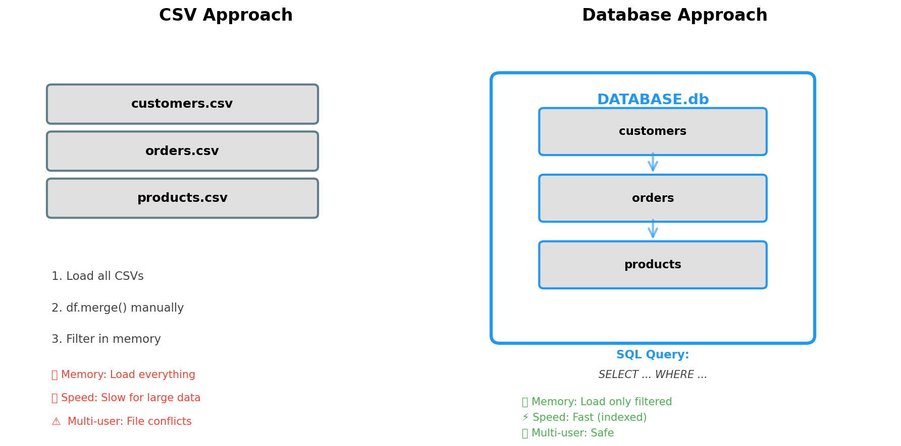
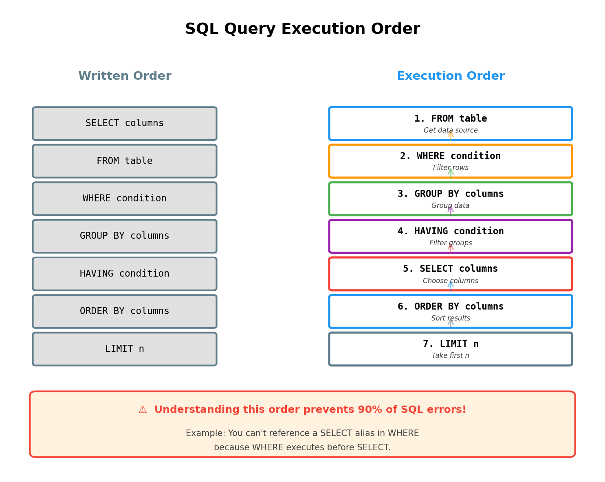
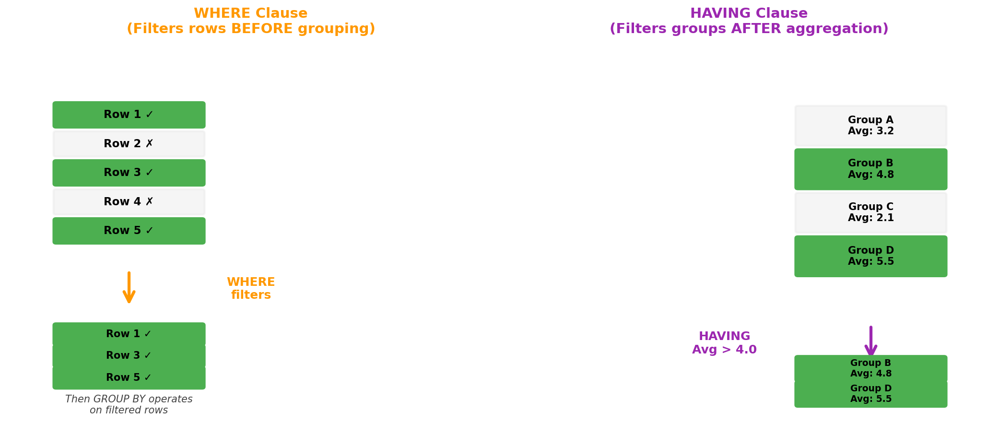
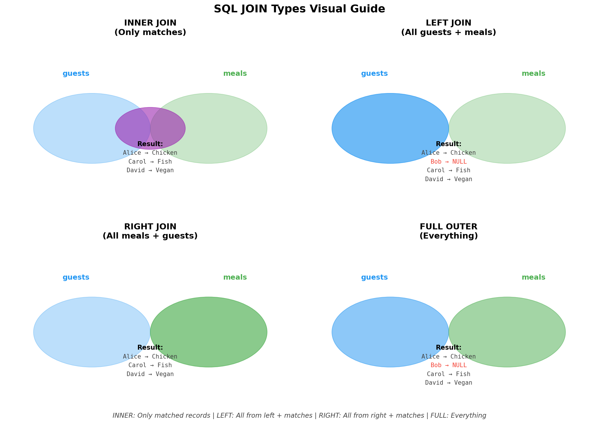

> **© 2026 Chirag Shinde. Licensed under CC BY-NC-SA 4.0.**
> See [LICENSE](../../LICENSE) for details.

---

# Chapter 8: SQL Databases for Data Science

## Why This Matters

Most real-world data doesn't live in CSV files—it lives in databases. Whether analyzing customer behavior, tracking transactions, or building machine learning models, extracting data from database systems is essential. SQL (Structured Query Language) is the universal language for querying databases, and mastering it transforms someone from analyzing pre-packaged datasets to extracting exactly the data needed from production systems. This chapter bridges the gap between pandas-based analysis and the real-world systems where data actually lives.

## Intuition

Think of a database as a highly organized filing cabinet system in a large company. Instead of keeping all information in one massive file (like a giant CSV), the database splits information into multiple related tables—customer information in one drawer, orders in another, products in a third. Each drawer (table) has a consistent structure with labeled folders (columns), and each folder contains many records (rows).

When information spans multiple drawers, there's no need to manually pull out papers and match them by hand. The database system has a built-in way to connect related information using unique identifiers (like customer IDs). A query—a question in SQL—instructs the database to assemble the answer automatically.

**The Library Analogy:** Imagine a library with three card catalogs:

```
BOOKS Table:
book_id | title                | author_id | year
--------|---------------------|-----------|------
1       | "Data Science 101"  | 101       | 2020
2       | "Python Basics"     | 102       | 2019
3       | "SQL Mastery"       | 101       | 2021

AUTHORS Table:
author_id | name
----------|----------------
101       | "Jane Smith"
102       | "Bob Johnson"
```

To find all books by Jane Smith, one could manually look up her author_id (101) in the AUTHORS table, then search through BOOKS for that ID. Or write a SQL query that does this automatically:

```sql
SELECT title, name
FROM books
JOIN authors ON books.author_id = authors.author_id
WHERE name = 'Jane Smith';
```

This is the power of **relational databases**: data is organized in connected tables, and SQL queries across those connections effortlessly.

**Why not just use CSVs?** Think of CSVs as Post-it notes scattered across a desk. For small projects, they work fine. But imagine tracking 10 million customers with their orders, addresses, and payment methods. Loading all that into memory would crash pandas. Even if it didn't, finding "all orders from California customers in the last 30 days" would require loading everything first, then filtering—extremely slow and wasteful. Databases filter at the source, loading only what's needed. They're also multi-user safe: multiple people can query simultaneously without file corruption.

## Formal Definition

A **relational database** is a structured collection of data organized into tables (relations), where:

- Each **table** has a defined schema specifying column names and data types
- Each **row** represents a record or observation
- Each **column** represents an attribute or feature
- Tables can be related through **keys** (unique identifiers)

**SQL (Structured Query Language)** is a declarative language for managing and querying relational databases. Unlike imperative languages (Python, Java), where the process *how* to achieve a result is specified step-by-step, SQL is declarative—the desired result *what* is specified, and the database engine figures out how to retrieve it efficiently.

**Key components:**
- **Database**: A collection of related tables stored together
- **Table**: A structured dataset with rows and columns (similar to a pandas DataFrame)
- **Schema**: The definition of table structure (column names, types, constraints)
- **Primary Key**: A unique identifier for each row (e.g., customer_id)
- **Foreign Key**: A column that references a primary key in another table (establishes relationships)
- **Query**: A SQL statement requesting specific data from one or more tables

**SQLite**, used in this chapter, is a serverless, file-based database engine. The entire database is stored in a single file, making it perfect for learning, prototyping, and local data analysis. The SQL syntax transfers directly to larger systems like PostgreSQL, MySQL, and even distributed systems like Spark SQL.

> **Key Concept:** SQL is a declarative language for extracting and manipulating structured data stored in relational databases—the desired result is described, not how to get it.

## Visualization



**When to use CSV:** Small datasets, quick sharing, one-time analysis
**When to use Database:** Large data, relationships, production systems, multi-user

**SQL Query Execution Order:**



## Examples

### Part 1: Create a SQLite Database from California Housing Dataset

```python
# Complete SQL + Python workflow: Database → Query → DataFrame → Analysis
import sqlite3
import pandas as pd
import numpy as np
from sklearn.datasets import fetch_california_housing
import matplotlib.pyplot as plt

# Load the dataset
housing = fetch_california_housing()
df_housing = pd.DataFrame(
    housing.data,
    columns=housing.feature_names
)
df_housing['MedHouseVal'] = housing.target

# Add a region identifier for demonstration
np.random.seed(42)
regions = ['North', 'South', 'East', 'West', 'Central']
df_housing['Region'] = np.random.choice(regions, size=len(df_housing))

print("Dataset loaded:")
print(df_housing.head())
print(f"\nShape: {df_housing.shape}")
# Output:
#    MedInc  HouseAge  AveRooms  AveBedrms  Population  AveOccup  Latitude  Longitude  MedHouseVal Region
# 0  8.3252      41.0  6.984127   1.023810       322.0  2.555556     37.88    -122.23        4.526   East
# 1  8.3014      21.0  6.238137   0.971880      2401.0  2.109842     37.86    -122.22        3.585  South
# ...
# Shape: (20640, 9)

# Create SQLite database and save data
conn = sqlite3.connect('housing.db')
df_housing.to_sql('housing', conn, if_exists='replace', index=False)
print("\n✓ Database 'housing.db' created with table 'housing'")
```

**Walkthrough of Part 1:**
This code loads the California Housing dataset from sklearn, which contains 20,640 observations of housing characteristics. After converting to a pandas DataFrame, a synthetic `Region` column is added for demonstration purposes. Then a SQLite database file called `housing.db` is created using `sqlite3.connect()` and the DataFrame is saved as a table using `to_sql()`. The `if_exists='replace'` parameter means if the table already exists, it will be overwritten.

### Part 2: Basic SQL Queries - SELECT, WHERE, ORDER BY, LIMIT

```python
# Query 1: Select specific columns, first 5 rows
query1 = """
SELECT MedInc, HouseAge, MedHouseVal, Region
FROM housing
LIMIT 5;
"""
print("\n--- Query 1: Basic SELECT ---")
df_result1 = pd.read_sql_query(query1, conn)
print(df_result1)
# Output:
#    MedInc  HouseAge  MedHouseVal Region
# 0  8.3252      41.0        4.526   East
# 1  8.3014      21.0        3.585  South
# ...

# Query 2: Filter with WHERE - high-income areas
query2 = """
SELECT MedInc, MedHouseVal, Region
FROM housing
WHERE MedInc > 8.0
ORDER BY MedInc DESC
LIMIT 10;
"""
print("\n--- Query 2: WHERE filtering (MedInc > 8.0) ---")
df_result2 = pd.read_sql_query(query2, conn)
print(df_result2)
print(f"Found {len(df_result2)} high-income areas")
# Output: Shows top 10 areas with median income > 8.0
```

**Walkthrough of Part 2:**
Query 1 demonstrates the fundamental SELECT statement: specific columns are requested and LIMIT returns just the first 5 rows. This is equivalent to `df[['MedInc', 'HouseAge', 'MedHouseVal', 'Region']].head()` in pandas.

Query 2 adds the WHERE clause to filter rows. `WHERE MedInc > 8.0` keeps only high-income areas. The ORDER BY clause sorts results by income in descending order. This is equivalent to: `df[df['MedInc'] > 8.0].sort_values('MedInc', ascending=False).head(10)`.

### Part 3: Multiple Conditions with AND/OR

```python
# Query 3: Multiple conditions with AND/OR
query3 = """
SELECT Region, AVG(MedInc) as AvgIncome, AVG(MedHouseVal) as AvgPrice
FROM housing
WHERE MedInc > 5.0 AND HouseAge < 30
GROUP BY Region;
"""
print("\n--- Query 3: Multiple conditions + GROUP BY ---")
df_result3 = pd.read_sql_query(query3, conn)
print(df_result3)
# Output:
#   Region  AvgIncome  AvgPrice
# 0  Central   6.532    3.245
# 1  East      6.421    3.198
# ...
```

**Walkthrough of Part 3:**
Query 3 combines multiple conditions using AND, and introduces GROUP BY with aggregate functions. This groups data by region and calculates average income and house value for each region. The pandas equivalent would be: `df[(df['MedInc'] > 5.0) & (df['HouseAge'] < 30)].groupby('Region').agg({'MedInc': 'mean', 'MedHouseVal': 'mean'})`.

### Part 4: Aggregation with GROUP BY and HAVING

```python
# Query 4: Summary statistics by region
query4 = """
SELECT
    Region,
    COUNT(*) as NumAreas,
    AVG(MedInc) as AvgIncome,
    AVG(MedHouseVal) as AvgHouseValue,
    MIN(MedHouseVal) as MinPrice,
    MAX(MedHouseVal) as MaxPrice
FROM housing
GROUP BY Region
ORDER BY AvgHouseValue DESC;
"""
print("\n--- Query 4: GROUP BY with multiple aggregates ---")
df_summary = pd.read_sql_query(query4, conn)
print(df_summary)
# Output:
#   Region  NumAreas  AvgIncome  AvgHouseValue  MinPrice  MaxPrice
# 0  North      4145      3.845          2.089     0.150     5.000
# ...

# Example visualization of GROUP BY results:
# See diagrams/groupby_example.png for a bar chart representation

# Query 5: HAVING clause - filter groups (regions with avg price > 2.0)
query5 = """
SELECT
    Region,
    AVG(MedHouseVal) as AvgPrice,
    COUNT(*) as NumAreas
FROM housing
GROUP BY Region
HAVING AVG(MedHouseVal) > 2.0
ORDER BY AvgPrice DESC;
"""
print("\n--- Query 5: HAVING clause (filter groups) ---")
df_expensive_regions = pd.read_sql_query(query5, conn)
print(df_expensive_regions)
# Output: Only regions where average house value > 2.0
```

**Walkthrough of Part 4:**
Query 4 shows the real power of GROUP BY: multiple aggregates are calculated simultaneously—count, average, minimum, and maximum—all grouped by region. SQL's aggregate functions are highly optimized for this type of computation. The result gives a complete statistical summary for each region in one query.

Query 5 demonstrates the HAVING clause, which is crucial to understand: WHERE filters individual rows *before* grouping, while HAVING filters groups *after* aggregation. Using `WHERE AVG(MedHouseVal) > 2.0` would fail because WHERE executes before the aggregation happens. HAVING is specifically designed for filtering aggregated results.

### Part 5: Combining SQL Extraction with Pandas Analysis

```python
# Extract filtered data using SQL, analyze in pandas
query6 = """
SELECT MedInc, HouseAge, MedHouseVal, Region
FROM housing
WHERE MedInc BETWEEN 4.0 AND 6.0
    AND HouseAge < 40;
"""
df_filtered = pd.read_sql_query(query6, conn)

print(f"\n--- Workflow: SQL filter → pandas analysis ---")
print(f"Original dataset: {len(df_housing)} rows")
print(f"After SQL filter: {len(df_filtered)} rows")
print(f"\nPandas analysis on filtered data:")
print(df_filtered.describe())

# Visualization: Average house value by region (from Query 4 results)
plt.figure(figsize=(10, 6))
plt.bar(df_summary['Region'], df_summary['AvgHouseValue'], color='steelblue')
plt.xlabel('Region', fontsize=12)
plt.ylabel('Average House Value (100k $)', fontsize=12)
plt.title('Average House Value by Region\n(Extracted via SQL GROUP BY)',
          fontsize=14, fontweight='bold')
plt.xticks(rotation=45)
plt.grid(axis='y', alpha=0.3)
plt.tight_layout()
plt.savefig('sql_groupby_results.png', dpi=100, bbox_inches='tight')
print("\n✓ Visualization saved as 'sql_groupby_results.png'")
```

**Walkthrough of Part 5:**
This section shows the recommended real-world pattern: use SQL to filter and extract a subset of data, then load it into pandas for detailed analysis. Query 6 extracts only rows where income is between 4.0 and 6.0 and house age is less than 40. This reduces the dataset from 20,640 rows to a more manageable size. Pandas is then used for descriptive statistics and visualization.

The key insight: loading all 20,640 rows and filtering in pandas would load unnecessary data into memory. For truly large datasets (millions of rows), this SQL-first approach is essential for performance. The visualization uses results from the GROUP BY query—a common pattern where SQL does aggregation and pandas/matplotlib handles visualization.

### Part 6: Security - Parameterized Queries

```python
# ❌ NEVER DO THIS (SQL injection vulnerability):
# user_region = "'; DROP TABLE housing; --"
# bad_query = f"SELECT * FROM housing WHERE Region = '{user_region}'"

# ✅ ALWAYS DO THIS (safe parameterized query):
user_region = 'North'
safe_query = "SELECT * FROM housing WHERE Region = ? LIMIT 5;"
df_safe = pd.read_sql_query(safe_query, conn, params=(user_region,))
print(f"\n--- Safe parameterized query (Region = {user_region}) ---")
print(df_safe[['MedInc', 'MedHouseVal', 'Region']].head())

# Clean up
conn.close()
print("\n✓ Database connection closed")

# Output summary:
# - Created SQLite database from California Housing data
# - Demonstrated SELECT, WHERE, ORDER BY, LIMIT
# - Showed GROUP BY with aggregate functions (COUNT, AVG, MIN, MAX)
# - Used HAVING to filter aggregated results
# - Combined SQL extraction with pandas analysis
# - Visualized results (bar chart of regional averages)
# - Demonstrated secure parameterized queries
```

**Walkthrough of Part 6:**
This section demonstrates **parameterized queries**, which are non-negotiable for security. Never use f-strings or string concatenation to insert values into SQL queries when those values come from user input. If `f"SELECT * FROM housing WHERE Region = '{user_input}'"` is written and a malicious user provides `'; DROP TABLE housing; --'` as input, the query becomes two statements: one SELECT and one DROP TABLE that deletes the data. Parameterized queries with `?` placeholders treat all input as data, never as code, completely preventing SQL injection attacks.

**Key Performance Insight:** Notice that `pd.read_sql_query()` is used throughout. This is the bridge between SQL and pandas—it executes the SQL query and returns a DataFrame directly. This is cleaner and more efficient than using `cursor.execute()` and `fetchall()`, then manually converting results to a DataFrame.

## Common Pitfalls

### 1. Confusing WHERE and HAVING (Execution Order)

**The Mistake:**
```python
# ❌ WRONG: Cannot use aggregate function in WHERE
query = """
SELECT Region, AVG(MedInc) as AvgIncome
FROM housing
WHERE AVG(MedInc) > 5.0
GROUP BY Region;
"""
# Error: misuse of aggregate function AVG()
```

**Why It Happens:** Students think SQL executes in the order it's written: SELECT → FROM → WHERE → GROUP BY. Actually, SQL executes FROM → WHERE → GROUP BY → HAVING → SELECT. Since WHERE executes *before* GROUP BY, aggregate functions don't exist yet at the WHERE stage.

**The Fix:**
```python
# ✅ CORRECT: Use HAVING to filter aggregated results
query = """
SELECT Region, AVG(MedInc) as AvgIncome
FROM housing
GROUP BY Region
HAVING AVG(MedInc) > 5.0;
"""
```

**Mental Model:** WHERE is a bouncer at the door (filters rows entering the group). HAVING is a bouncer after groups form (filters the groups themselves).



### 2. Missing Columns in GROUP BY

**The Mistake:**
```python
# ❌ WRONG: Region not in GROUP BY but appears in SELECT
query = """
SELECT Region, HouseAge, AVG(MedInc) as AvgIncome
FROM housing
GROUP BY Region;
"""
# Error: column "HouseAge" must appear in GROUP BY or be used in aggregate
```

**Why It Happens:** The rule is strict: every column in SELECT that is NOT inside an aggregate function (COUNT, AVG, SUM, etc.) MUST appear in the GROUP BY clause. When grouping by Region, each region becomes one row. Trying to show HouseAge without aggregating it creates ambiguity—SQL doesn't know which of the thousands of HouseAge values for that region to display.

**The Fix:**
```python
# ✅ Option 1: Add HouseAge to GROUP BY
query = """
SELECT Region, HouseAge, AVG(MedInc) as AvgIncome
FROM housing
GROUP BY Region, HouseAge;
"""

# ✅ Option 2: Aggregate HouseAge
query = """
SELECT Region, AVG(HouseAge) as AvgAge, AVG(MedInc) as AvgIncome
FROM housing
GROUP BY Region;
"""
```

### 3. NULL Handling Errors

**The Mistake:**
```python
# ❌ WRONG: Using = NULL instead of IS NULL
query = "SELECT * FROM housing WHERE Region = NULL;"
# Returns 0 rows even if NULL values exist!
```

**Why It Happens:** NULL represents "unknown" in SQL. Since unknown = unknown is also unknown (not true), the comparison `Region = NULL` never evaluates to true. Additionally, students often confuse `COUNT(*)` with `COUNT(column)`:

```python
# If table has 1000 rows, 50 have NULL in 'email' column:
query1 = "SELECT COUNT(*) FROM customers;"      # Returns 1000 (all rows)
query2 = "SELECT COUNT(email) FROM customers;"  # Returns 950 (non-NULL only)
```

**The Fix:**
```python
# ✅ CORRECT: Use IS NULL or IS NOT NULL
query = "SELECT * FROM housing WHERE Region IS NULL;"

# ✅ Use COUNT(*) to count all rows, COUNT(column) to count non-NULL values
query = """
SELECT
    COUNT(*) as total_rows,
    COUNT(Region) as non_null_regions,
    COUNT(*) - COUNT(Region) as null_regions
FROM housing;
"""
```

**Key Insight:** Aggregate functions (AVG, SUM) automatically ignore NULL values. If 5 students scored [80, 90, NULL, 70, 100], `AVG(score)` returns 85 (sum of 340 divided by 4), not 68 (which would happen if NULL were treated as 0).

### 4. SQL Injection Vulnerability

**The Mistake:**
```python
# ❌ DANGEROUS: Never concatenate user input into SQL
user_input = "North'; DROP TABLE housing; --"
query = f"SELECT * FROM housing WHERE Region = '{user_input}'"
conn.execute(query)
# This executes TWO statements:
# 1. SELECT * FROM housing WHERE Region = 'North';
# 2. DROP TABLE housing; -- (deletes your table!)
```

**Why It Happens:** String formatting treats user input as SQL code, not as data. This is one of the OWASP Top 10 security vulnerabilities and has caused massive data breaches.

**The Fix:**
```python
# ✅ SAFE: Always use parameterized queries with ? placeholders
user_input = "North'; DROP TABLE housing; --"
query = "SELECT * FROM housing WHERE Region = ?"
df = pd.read_sql_query(query, conn, params=(user_input,))
# The malicious input is treated as a literal string to search for
# (it won't find any matches, but no damage is done)
```

**Non-negotiable rule:** ALWAYS use parameterized queries when incorporating any external input (user input, API data, file contents) into SQL. This applies even if the input seems "safe"—it's not worth the risk.

## Practice

**Practice 1**

A SQLite database `movies.db` has a table `movies` containing these columns:
- `movie_id` (INTEGER, primary key)
- `title` (TEXT)
- `year` (INTEGER)
- `rating` (REAL, 0.0-5.0 scale)
- `genre` (TEXT)
- `director` (TEXT)

Write SQL queries to answer these questions:

1. Retrieve all movie titles and their release years, ordered by year (newest first)
2. Find all movies released after 2015 with a rating of at least 4.0
3. Count how many movies are in the "Comedy" genre
4. Find the top 5 highest-rated movies (show title, rating, year)
5. List all unique genres in the database (Hint: use DISTINCT)
6. Find all movies directed by "Christopher Nolan"

**Setup code:**
```python
import sqlite3
import pandas as pd

# Create sample database (provided)
conn = sqlite3.connect('movies.db')
sample_data = pd.DataFrame({
    'movie_id': range(1, 11),
    'title': ['Inception', 'The Matrix', 'Interstellar', 'Parasite',
              'The Godfather', 'Toy Story', 'The Dark Knight',
              'Pulp Fiction', 'Forrest Gump', 'The Shawshank Redemption'],
    'year': [2010, 1999, 2014, 2019, 1972, 1995, 2008, 1994, 1994, 1994],
    'rating': [4.5, 4.4, 4.6, 4.7, 4.9, 4.3, 4.8, 4.6, 4.5, 4.9],
    'genre': ['Sci-Fi', 'Sci-Fi', 'Sci-Fi', 'Thriller', 'Crime',
              'Animation', 'Action', 'Crime', 'Drama', 'Drama'],
    'director': ['Nolan', 'Wachowski', 'Nolan', 'Bong', 'Coppola',
                'Lasseter', 'Nolan', 'Tarantino', 'Zemeckis', 'Darabont']
})
sample_data.to_sql('movies', conn, if_exists='replace', index=False)

# Queries here:
query1 = "YOUR SQL QUERY HERE"
df1 = pd.read_sql_query(query1, conn)
print(df1)
```

**Expected outcomes:**
- Query 1 should return 10 rows, with Parasite (2019) first
- Query 2 should return 4 movies (Interstellar, Parasite, Inception, The Dark Knight)
- Query 3 should return count = 2 (Pulp Fiction, The Godfather)
- Query 4 should show The Godfather and The Shawshank Redemption (both 4.9)

**Practice 2**

Using the same `movies.db` database:

1. Count how many movies are in each genre (use GROUP BY)
2. Calculate the average rating for each genre, ordered by average rating (highest first)
3. Find the decade (1990s, 2000s, 2010s) with the most movie releases
   - Hint: Calculate decade as `(year / 10) * 10`
4. Find genres where the average rating is above 4.5 (use HAVING)
5. For each director with more than one movie in the database, show their name and average rating
   - Use GROUP BY director, HAVING COUNT(*) > 1

**Additional challenge:**
Load the results from query #2 (average rating by genre) into a pandas DataFrame and create a horizontal bar chart showing the ratings. Color bars based on rating: green if ≥ 4.5, orange if 4.0-4.5, red if < 4.0.

**Hint for query 3:**
```sql
SELECT (year / 10) * 10 AS decade, COUNT(*) as movie_count
FROM movies
GROUP BY decade
ORDER BY movie_count DESC;
```

**Expected insights:**
- Sci-Fi has the highest count (3 movies) and average rating around 4.5
- The 1990s should have the most movies in this dataset
- Only certain genres will meet the HAVING threshold of 4.5+

**Practice 3**

An e-commerce database has three related tables:

**customers**
- `customer_id` (INTEGER, primary key)
- `name` (TEXT)
- `email` (TEXT)
- `city` (TEXT)
- `signup_date` (TEXT, YYYY-MM-DD format)

**orders**
- `order_id` (INTEGER, primary key)
- `customer_id` (INTEGER, foreign key → customers)
- `order_date` (TEXT, YYYY-MM-DD format)
- `total_amount` (REAL)

**order_items**
- `item_id` (INTEGER, primary key)
- `order_id` (INTEGER, foreign key → orders)
- `product_name` (TEXT)
- `quantity` (INTEGER)
- `unit_price` (REAL)

Write SQL queries to answer these business questions:

1. **Customer order summary:** List all customers with their total number of orders
   - Include customers with 0 orders (use LEFT JOIN)
   - Order by number of orders (descending)

2. **City-level revenue:** Calculate total revenue per city
   - Join customers and orders tables
   - Group by city and sum order totals
   - Show only cities with revenue > $1000

3. **Product popularity:** Find the top 5 most-ordered products by total quantity
   - Use order_items table
   - Sum quantities across all orders
   - Show product name and total quantity sold

4. **High-value customers:** Find customers who have spent more than $500 total
   - Join customers and orders
   - Group by customer name
   - Filter using HAVING
   - Show customer name and total spent

5. **Average order value by city:** Calculate the average order amount for each city
   - Requires joining customers and orders
   - GROUP BY city
   - Use AVG() function
   - Order results by average order value (highest first)

**Setup code:**
```python
import sqlite3
import pandas as pd
import numpy as np

# Create sample e-commerce database
np.random.seed(42)
conn = sqlite3.connect('ecommerce.db')

# Create customers table
customers = pd.DataFrame({
    'customer_id': range(1, 21),
    'name': [f'Customer_{i}' for i in range(1, 21)],
    'email': [f'customer{i}@email.com' for i in range(1, 21)],
    'city': np.random.choice(['New York', 'Los Angeles', 'Chicago', 'Houston'], 20),
    'signup_date': pd.date_range('2023-01-01', periods=20, freq='W').astype(str)
})

# Create orders table (some customers have multiple orders, some have none)
orders = pd.DataFrame({
    'order_id': range(1, 41),
    'customer_id': np.random.choice(range(1, 16), 40),  # Only first 15 customers
    'order_date': np.random.choice(pd.date_range('2024-01-01', '2024-12-31', freq='D').astype(str), 40),
    'total_amount': np.random.uniform(20, 500, 40).round(2)
})

# Create order_items table
order_items = pd.DataFrame({
    'item_id': range(1, 101),
    'order_id': np.random.choice(range(1, 41), 100),
    'product_name': np.random.choice(['Laptop', 'Phone', 'Tablet', 'Headphones', 'Monitor'], 100),
    'quantity': np.random.randint(1, 5, 100),
    'unit_price': np.random.uniform(10, 200, 100).round(2)
})

# Save to database
customers.to_sql('customers', conn, if_exists='replace', index=False)
orders.to_sql('orders', conn, if_exists='replace', index=False)
order_items.to_sql('order_items', conn, if_exists='replace', index=False)

# Queries here:
query1 = """
YOUR SQL QUERY HERE
"""
df1 = pd.read_sql_query(query1, conn)
print(df1)
```

**Bonus challenge:**
Create a complete analysis pipeline:
1. Extract data for the last 6 months using SQL (filter by order_date)
2. Load into pandas DataFrame
3. Calculate additional metrics:
   - Customer lifetime value (total spent per customer)
   - Average items per order
   - Month-over-month revenue growth
4. Create visualizations:
   - Line chart of monthly revenue trend
   - Bar chart of top 10 products by revenue
   - Scatter plot of orders per customer vs. total spent
5. Write summary statistics back to a new table `analytics_summary` in the database

**Expected insights:**
- Query 1 should show all 20 customers, including 5 with 0 orders
- Query 2 should reveal which cities generate the most revenue
- Query 3 will show which products are bestsellers
- Query 4 identifies the most valuable customers

**Key learning goal:** Understanding when to use INNER JOIN (only matched records) vs. LEFT JOIN (preserve all records from left table) is crucial. For customer analytics, LEFT JOIN is almost always needed so customers who haven't purchased yet aren't lost.

## Solutions

**Solution 1**

```python
import sqlite3
import pandas as pd

conn = sqlite3.connect('movies.db')
sample_data = pd.DataFrame({
    'movie_id': range(1, 11),
    'title': ['Inception', 'The Matrix', 'Interstellar', 'Parasite',
              'The Godfather', 'Toy Story', 'The Dark Knight',
              'Pulp Fiction', 'Forrest Gump', 'The Shawshank Redemption'],
    'year': [2010, 1999, 2014, 2019, 1972, 1995, 2008, 1994, 1994, 1994],
    'rating': [4.5, 4.4, 4.6, 4.7, 4.9, 4.3, 4.8, 4.6, 4.5, 4.9],
    'genre': ['Sci-Fi', 'Sci-Fi', 'Sci-Fi', 'Thriller', 'Crime',
              'Animation', 'Action', 'Crime', 'Drama', 'Drama'],
    'director': ['Nolan', 'Wachowski', 'Nolan', 'Bong', 'Coppola',
                'Lasseter', 'Nolan', 'Tarantino', 'Zemeckis', 'Darabont']
})
sample_data.to_sql('movies', conn, if_exists='replace', index=False)

# Query 1: All titles and years, ordered newest first
query1 = """
SELECT title, year
FROM movies
ORDER BY year DESC;
"""
print("Query 1:")
print(pd.read_sql_query(query1, conn))

# Query 2: Movies after 2015 with rating >= 4.0
query2 = """
SELECT title, year, rating
FROM movies
WHERE year > 2015 AND rating >= 4.0;
"""
print("\nQuery 2:")
print(pd.read_sql_query(query2, conn))

# Query 3: Count Comedy movies
query3 = """
SELECT COUNT(*) as comedy_count
FROM movies
WHERE genre = 'Comedy';
"""
print("\nQuery 3:")
print(pd.read_sql_query(query3, conn))

# Query 4: Top 5 highest-rated movies
query4 = """
SELECT title, rating, year
FROM movies
ORDER BY rating DESC, year DESC
LIMIT 5;
"""
print("\nQuery 4:")
print(pd.read_sql_query(query4, conn))

# Query 5: All unique genres
query5 = """
SELECT DISTINCT genre
FROM movies
ORDER BY genre;
"""
print("\nQuery 5:")
print(pd.read_sql_query(query5, conn))

# Query 6: Movies by Christopher Nolan
query6 = """
SELECT title, year, rating
FROM movies
WHERE director = 'Nolan';
"""
print("\nQuery 6:")
print(pd.read_sql_query(query6, conn))

conn.close()
```

**Explanation:** These queries demonstrate basic SELECT operations with filtering (WHERE), sorting (ORDER BY), and limiting results (LIMIT). Query 3 uses COUNT() to aggregate, while Query 5 uses DISTINCT to remove duplicates. The key pattern: start with FROM to specify the table, add WHERE to filter, then ORDER BY to sort results.

**Solution 2**

```python
import sqlite3
import pandas as pd
import matplotlib.pyplot as plt

conn = sqlite3.connect('movies.db')

# Query 1: Count movies per genre
query1 = """
SELECT genre, COUNT(*) as movie_count
FROM movies
GROUP BY genre
ORDER BY movie_count DESC;
"""
print("Query 1:")
print(pd.read_sql_query(query1, conn))

# Query 2: Average rating by genre
query2 = """
SELECT genre, AVG(rating) as avg_rating, COUNT(*) as count
FROM movies
GROUP BY genre
ORDER BY avg_rating DESC;
"""
print("\nQuery 2:")
df_genre_ratings = pd.read_sql_query(query2, conn)
print(df_genre_ratings)

# Query 3: Decade with most releases
query3 = """
SELECT (year / 10) * 10 AS decade, COUNT(*) as movie_count
FROM movies
GROUP BY decade
ORDER BY movie_count DESC;
"""
print("\nQuery 3:")
print(pd.read_sql_query(query3, conn))

# Query 4: Genres with average rating > 4.5
query4 = """
SELECT genre, AVG(rating) as avg_rating
FROM movies
GROUP BY genre
HAVING AVG(rating) > 4.5
ORDER BY avg_rating DESC;
"""
print("\nQuery 4:")
print(pd.read_sql_query(query4, conn))

# Query 5: Directors with multiple movies and their average rating
query5 = """
SELECT director, COUNT(*) as movie_count, AVG(rating) as avg_rating
FROM movies
GROUP BY director
HAVING COUNT(*) > 1
ORDER BY avg_rating DESC;
"""
print("\nQuery 5:")
print(pd.read_sql_query(query5, conn))

# Visualization challenge: Color-coded bar chart
colors = ['green' if x >= 4.5 else 'orange' if x >= 4.0 else 'red'
          for x in df_genre_ratings['avg_rating']]
plt.figure(figsize=(10, 6))
plt.barh(df_genre_ratings['genre'], df_genre_ratings['avg_rating'], color=colors)
plt.xlabel('Average Rating', fontsize=12)
plt.ylabel('Genre', fontsize=12)
plt.title('Average Movie Rating by Genre', fontsize=14, fontweight='bold')
plt.xlim(0, 5)
plt.grid(axis='x', alpha=0.3)
plt.tight_layout()
plt.savefig('genre_ratings.png', dpi=100, bbox_inches='tight')
print("\n✓ Visualization saved as 'genre_ratings.png'")

conn.close()
```

**Explanation:** These queries demonstrate GROUP BY with aggregate functions (COUNT, AVG). The key distinction: WHERE filters individual rows before grouping, while HAVING filters groups after aggregation. Query 3 shows calculated columns (`(year / 10) * 10`) which can be used in GROUP BY. The visualization uses conditional color coding based on rating thresholds.

**Solution 3**

```python
import sqlite3
import pandas as pd
import numpy as np
import matplotlib.pyplot as plt

# Create sample database
np.random.seed(42)
conn = sqlite3.connect('ecommerce.db')

customers = pd.DataFrame({
    'customer_id': range(1, 21),
    'name': [f'Customer_{i}' for i in range(1, 21)],
    'email': [f'customer{i}@email.com' for i in range(1, 21)],
    'city': np.random.choice(['New York', 'Los Angeles', 'Chicago', 'Houston'], 20),
    'signup_date': pd.date_range('2023-01-01', periods=20, freq='W').astype(str)
})

orders = pd.DataFrame({
    'order_id': range(1, 41),
    'customer_id': np.random.choice(range(1, 16), 40),
    'order_date': np.random.choice(pd.date_range('2024-01-01', '2024-12-31', freq='D').astype(str), 40),
    'total_amount': np.random.uniform(20, 500, 40).round(2)
})

order_items = pd.DataFrame({
    'item_id': range(1, 101),
    'order_id': np.random.choice(range(1, 41), 100),
    'product_name': np.random.choice(['Laptop', 'Phone', 'Tablet', 'Headphones', 'Monitor'], 100),
    'quantity': np.random.randint(1, 5, 100),
    'unit_price': np.random.uniform(10, 200, 100).round(2)
})

customers.to_sql('customers', conn, if_exists='replace', index=False)
orders.to_sql('orders', conn, if_exists='replace', index=False)
order_items.to_sql('order_items', conn, if_exists='replace', index=False)

# Query 1: Customer order summary with LEFT JOIN
query1 = """
SELECT
    c.name,
    c.email,
    COUNT(o.order_id) as total_orders
FROM customers c
LEFT JOIN orders o ON c.customer_id = o.customer_id
GROUP BY c.customer_id, c.name, c.email
ORDER BY total_orders DESC;
"""
print("Query 1 - Customer Order Summary:")
print(pd.read_sql_query(query1, conn))

# Query 2: City-level revenue
query2 = """
SELECT
    c.city,
    SUM(o.total_amount) as total_revenue,
    COUNT(o.order_id) as order_count
FROM customers c
JOIN orders o ON c.customer_id = o.customer_id
GROUP BY c.city
HAVING SUM(o.total_amount) > 1000
ORDER BY total_revenue DESC;
"""
print("\nQuery 2 - City Revenue (> $1000):")
print(pd.read_sql_query(query2, conn))

# Query 3: Top 5 products by quantity
query3 = """
SELECT
    product_name,
    SUM(quantity) as total_quantity,
    COUNT(*) as times_ordered
FROM order_items
GROUP BY product_name
ORDER BY total_quantity DESC
LIMIT 5;
"""
print("\nQuery 3 - Top 5 Products by Quantity:")
print(pd.read_sql_query(query3, conn))

# Query 4: High-value customers (spent > $500)
query4 = """
SELECT
    c.name,
    c.city,
    SUM(o.total_amount) as total_spent,
    COUNT(o.order_id) as order_count
FROM customers c
JOIN orders o ON c.customer_id = o.customer_id
GROUP BY c.customer_id, c.name, c.city
HAVING SUM(o.total_amount) > 500
ORDER BY total_spent DESC;
"""
print("\nQuery 4 - High-Value Customers (> $500):")
print(pd.read_sql_query(query4, conn))

# Query 5: Average order value by city
query5 = """
SELECT
    c.city,
    AVG(o.total_amount) as avg_order_value,
    COUNT(o.order_id) as order_count
FROM customers c
JOIN orders o ON c.customer_id = o.customer_id
GROUP BY c.city
ORDER BY avg_order_value DESC;
"""
print("\nQuery 5 - Average Order Value by City:")
print(pd.read_sql_query(query5, conn))

# Bonus: Complete analysis pipeline
print("\n--- Bonus Analysis Pipeline ---")

# Extract last 6 months data
query_recent = """
SELECT
    c.customer_id,
    c.name,
    c.city,
    o.order_id,
    o.order_date,
    o.total_amount
FROM customers c
JOIN orders o ON c.customer_id = o.customer_id
WHERE o.order_date >= DATE('now', '-6 months');
"""
df_recent = pd.read_sql_query(query_recent, conn)

# Calculate customer lifetime value
customer_ltv = df_recent.groupby(['customer_id', 'name', 'city']).agg({
    'total_amount': 'sum',
    'order_id': 'count'
}).rename(columns={'total_amount': 'lifetime_value', 'order_id': 'order_count'})
print("\nCustomer Lifetime Value:")
print(customer_ltv.sort_values('lifetime_value', ascending=False).head())

# Monthly revenue trend
df_recent['month'] = pd.to_datetime(df_recent['order_date']).dt.to_period('M')
monthly_revenue = df_recent.groupby('month')['total_amount'].sum()

plt.figure(figsize=(12, 5))

# Monthly revenue trend
plt.subplot(1, 2, 1)
monthly_revenue.plot(kind='line', marker='o', color='steelblue', linewidth=2)
plt.title('Monthly Revenue Trend', fontsize=12, fontweight='bold')
plt.xlabel('Month', fontsize=10)
plt.ylabel('Revenue ($)', fontsize=10)
plt.grid(alpha=0.3)

# Orders per customer vs total spent
customer_analysis = df_recent.groupby('customer_id').agg({
    'order_id': 'count',
    'total_amount': 'sum'
})
plt.subplot(1, 2, 2)
plt.scatter(customer_analysis['order_id'], customer_analysis['total_amount'],
           alpha=0.6, s=100, color='coral')
plt.title('Orders vs Total Spent', fontsize=12, fontweight='bold')
plt.xlabel('Number of Orders', fontsize=10)
plt.ylabel('Total Spent ($)', fontsize=10)
plt.grid(alpha=0.3)

plt.tight_layout()
plt.savefig('ecommerce_analysis.png', dpi=100, bbox_inches='tight')
print("\n✓ Visualizations saved as 'ecommerce_analysis.png'")

# Write summary back to database
summary_stats = pd.DataFrame({
    'metric': ['Total Revenue', 'Average Order Value', 'Total Orders', 'Unique Customers'],
    'value': [
        df_recent['total_amount'].sum(),
        df_recent['total_amount'].mean(),
        len(df_recent),
        df_recent['customer_id'].nunique()
    ]
})
summary_stats.to_sql('analytics_summary', conn, if_exists='replace', index=False)
print("\n✓ Summary statistics written to 'analytics_summary' table")

conn.close()
```

**Explanation:** These queries demonstrate JOIN operations and multi-table analysis. Query 1 uses LEFT JOIN to include all customers (even those with 0 orders), while Queries 2, 4, and 5 use INNER JOIN (only customers with orders). The key learning: LEFT JOIN preserves all rows from the left table, adding NULL for non-matches from the right table. INNER JOIN keeps only rows that match in both tables.

The bonus pipeline demonstrates the SQL→pandas workflow: extract filtered data with SQL, then use pandas for complex metrics and visualizations. The final step writes results back to the database, completing the bidirectional workflow.

## Key Takeaways

- **SQL is essential for real-world data science:** Most production data lives in databases, not CSV files. SQL is the universal language for extracting data from these systems.

- **Declarative vs. imperative:** SQL is declarative (the desired result *what* is specified, not *how* to get it), unlike Python. Queries describe the desired result, and the database engine optimizes the execution.

- **Execution order matters:** SQL executes FROM → WHERE → GROUP BY → HAVING → SELECT → ORDER BY → LIMIT, not in written order. Understanding this prevents errors like using aggregates in WHERE or referencing SELECT aliases in WHERE.

- **The SQL + pandas workflow:** Use SQL for extraction, filtering, and initial aggregation (efficient, operates at the database); use pandas for complex transformations, statistical analysis, and visualization (flexible, operates in memory). This combination is the standard pattern in industry.

- **GROUP BY rules are strict:** Every column in SELECT must either be in the GROUP BY clause or wrapped in an aggregate function (COUNT, AVG, SUM, etc.). Use WHERE to filter rows before grouping, HAVING to filter groups after aggregation.

- **JOIN types determine what data is kept:** INNER JOIN returns only matching rows (intersection). LEFT JOIN returns all rows from the left table plus matches from the right (preserves left table, adds NULLs for non-matches). Choose based on whether all records from one table need to be preserved.

- **Security is non-negotiable:** Always use parameterized queries with `?` placeholders when incorporating external input into SQL. Never use f-strings or string concatenation—this creates SQL injection vulnerabilities that can lead to data theft or destruction.

- **NULL is "unknown," not zero:** Use `IS NULL` and `IS NOT NULL` for NULL checks (never `= NULL`). COUNT(*) counts all rows including NULLs; COUNT(column) counts only non-NULL values. Aggregate functions automatically ignore NULLs.

---

## Appendix: Advanced Topics

### A. JOIN Types Visual Guide



**Example Tables:**

```
Table: guests (RSVP list)          Table: meals (meal selections)
guest_id | name                    guest_id | meal
---------|--------                 ---------|-------
1        | Alice                   1        | Chicken
2        | Bob                     3        | Fish
3        | Carol                   4        | Vegan
4        | David
```

**When to use each JOIN type:**
- **INNER JOIN**: Only want records that exist in both tables
- **LEFT JOIN**: Want all records from the primary table (most common)
- **RIGHT JOIN**: Rare—usually just flip the tables and use LEFT instead
- **FULL OUTER JOIN**: Want everything from both tables (also rare)

### B. Creating and Modifying Data (Brief Overview)

While data scientists primarily *query* databases, understanding how to insert, update, and delete data is useful:

```python
import sqlite3
conn = sqlite3.connect('example.db')
cursor = conn.cursor()

# CREATE TABLE: Define schema
cursor.execute("""
CREATE TABLE IF NOT EXISTS products (
    product_id INTEGER PRIMARY KEY,
    name TEXT NOT NULL,
    price REAL,
    stock INTEGER DEFAULT 0
);
""")

# INSERT: Add new rows
cursor.execute("""
INSERT INTO products (name, price, stock)
VALUES ('Laptop', 999.99, 50);
""")

# INSERT multiple rows at once (more efficient)
new_products = [
    ('Mouse', 29.99, 200),
    ('Keyboard', 79.99, 150),
    ('Monitor', 299.99, 75)
]
cursor.executemany("""
INSERT INTO products (name, price, stock)
VALUES (?, ?, ?);
""", new_products)

# UPDATE: Modify existing rows
cursor.execute("""
UPDATE products
SET price = 899.99
WHERE name = 'Laptop';
""")

# DELETE: Remove rows
cursor.execute("""
DELETE FROM products
WHERE stock = 0;
""")

# Always commit changes
conn.commit()
conn.close()
```

**Best practices:**
- Always test modifications with SELECT first: `SELECT * FROM products WHERE stock = 0;` before `DELETE FROM products WHERE stock = 0;`
- Use transactions for multiple related changes: wrap in `BEGIN` and `COMMIT`, or use context managers
- In production, INSERT/UPDATE/DELETE are typically done by backend services, not data scientists directly

### C. SQLite vs. Other Databases

The SQL learned here transfers to other databases with minor differences:

| Feature | SQLite | PostgreSQL | MySQL |
|---------|--------|------------|-------|
| Setup | None (file-based) | Install server | Install server |
| Concurrency | Single writer | High | High |
| Size limit | ~280 TB (file size) | Unlimited | Unlimited |
| RIGHT JOIN | ❌ No (use LEFT) | ✅ Yes | ✅ Yes |
| FULL OUTER JOIN | ❌ No (workaround) | ✅ Yes | ❌ No |
| Date functions | Limited | Excellent | Good |
| JSON support | Basic | Excellent (JSONB) | Good |
| Best for | Learning, prototypes, local analysis | Production, analytics | Web apps, read-heavy |
| Data science use | Development, small data | Production, large data | Less common |

**When to transition from SQLite:**
- Need concurrent writes (multiple users modifying data simultaneously)
- Dataset exceeds ~10 GB (SQLite still works but slower)
- Need advanced features (window functions, CTEs, full-text search)
- Production deployment with multiple users

**Syntax differences example:**
```sql
-- String concatenation
-- SQLite:
SELECT name || ' ' || city FROM customers;
-- PostgreSQL:
SELECT name || ' ' || city FROM customers;  -- Same
SELECT CONCAT(name, ' ', city) FROM customers;  -- Also works
-- MySQL:
SELECT CONCAT(name, ' ', city) FROM customers;  -- Preferred

-- Date arithmetic
-- SQLite:
SELECT DATE('now', '+7 days');
-- PostgreSQL:
SELECT CURRENT_DATE + INTERVAL '7 days';
-- MySQL:
SELECT DATE_ADD(CURDATE(), INTERVAL 7 DAY);
```

**Bottom line:** Learn SQL with SQLite, then transfer the knowledge. The core concepts (SELECT, WHERE, JOIN, GROUP BY) are identical across all SQL databases.

### D. Performance Tips

1. **Filter early with WHERE:** Reduce data before expensive operations
   ```sql
   -- ✅ Good: Filter first, then aggregate
   SELECT city, AVG(price)
   FROM sales
   WHERE date > '2024-01-01'  -- Reduces rows early
   GROUP BY city;

   -- ❌ Less efficient: Aggregate everything, then filter
   SELECT city, AVG(price)
   FROM sales
   GROUP BY city
   HAVING MAX(date) > '2024-01-01';  -- Processes all rows first
   ```

2. **Select only needed columns:** Don't use `SELECT *` in production
   ```sql
   -- ❌ Bad: Loads all columns (slow, memory-intensive)
   SELECT * FROM large_table;

   -- ✅ Good: Load only what's needed
   SELECT customer_id, order_date, total FROM large_table;
   ```

3. **Use LIMIT for exploration:** Test queries on small samples first
   ```sql
   -- Test query logic on 100 rows first
   SELECT ... FROM large_table LIMIT 100;
   -- Once verified, remove LIMIT for full run
   ```

4. **Understand indexes:** Primary keys are automatically indexed (fast lookups). For large tables, consider indexing frequently queried columns.

5. **Use pandas chunking for huge results:**
   ```python
   # Instead of loading 10 million rows at once:
   for chunk in pd.read_sql_query(query, conn, chunksize=10000):
       process(chunk)  # Process in manageable pieces
   ```

### E. Connection Management Best Practices

Always close database connections, preferably using context managers:

```python
import sqlite3

# ✅ Best: Use context manager (auto-closes)
with sqlite3.connect('housing.db') as conn:
    df = pd.read_sql_query("SELECT * FROM housing LIMIT 10", conn)
    # Connection automatically closes when exiting 'with' block

# ✅ Also good: Manual close (but easy to forget)
conn = sqlite3.connect('housing.db')
try:
    df = pd.read_sql_query("SELECT * FROM housing LIMIT 10", conn)
finally:
    conn.close()  # Always executes, even if error occurs

# ❌ Bad: No close (leaves connection open, wastes resources)
conn = sqlite3.connect('housing.db')
df = pd.read_sql_query("SELECT * FROM housing LIMIT 10", conn)
# If script crashes, connection stays open
```

For long-running scripts, reuse a single connection rather than opening/closing repeatedly:

```python
with sqlite3.connect('housing.db') as conn:
    # Perform multiple operations with same connection
    df1 = pd.read_sql_query(query1, conn)
    df2 = pd.read_sql_query(query2, conn)
    df3 = pd.read_sql_query(query3, conn)
    # Connection closes once at the end
```

---

## Glossary Additions

**Database** — A structured collection of data organized into tables, where each table has a defined schema and can be related to other tables through keys. First introduced in Section 2.8.

**Foreign Key** — A column in one table that references the primary key of another table, establishing a relationship between the two tables. First introduced in Section 2.8.

**HAVING Clause** — A SQL clause that filters groups after aggregation (used with GROUP BY). Unlike WHERE (which filters rows before grouping), HAVING filters based on aggregate function results. First introduced in Section 2.8.

**Primary Key** — A unique identifier for each row in a database table (e.g., customer_id). Unlike DataFrame indexes, primary keys are enforced constraints that guarantee uniqueness. First introduced in Section 2.8.

**Relational Database** — A database system where data is organized into related tables with defined relationships through keys. Supports SQL queries for extracting and combining data across tables. First introduced in Section 2.8.

**Schema** — The formal definition of a database table's structure, specifying column names, data types, constraints, and relationships. First introduced in Section 2.8.

**SQL (Structured Query Language)** — A declarative language for querying and managing relational databases. The desired data is specified, and the database engine determines how to retrieve it efficiently. First introduced in Section 2.8.

**SQL Injection** — A security vulnerability where malicious SQL code is inserted into application queries through user input, potentially leading to data theft or destruction. Prevented by using parameterized queries. First introduced in Section 2.8.

**SQLite** — A serverless, file-based relational database engine included in Python's standard library. The entire database is stored in a single file, making it ideal for learning, prototyping, and local data analysis. First introduced in Section 2.8.

**Table** — A structured dataset within a database consisting of rows (records) and columns (attributes), similar to a pandas DataFrame but with enforced schema and constraints. First introduced in Section 2.8.

---

**Next:** Chapter 9 covers version control with Git for data science projects, enabling collaboration, reproducibility, and tracking changes in code and analysis.
