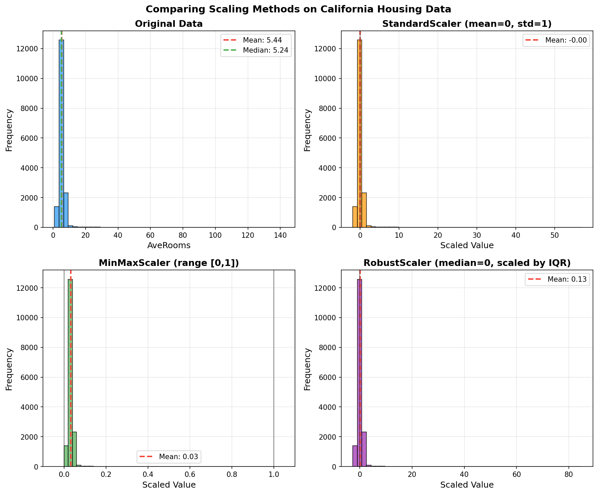

> **© 2026 Chirag Shinde. Licensed under CC BY-NC-SA 4.0.**
> See [LICENSE](../../LICENSE) for details.

---

# Chapter 13: Numerical Feature Engineering

## Why This Matters

Imagine training a K-nearest neighbors model to predict house prices using two features: square footage (ranging from 500 to 5,000) and number of bedrooms (ranging from 1 to 5). Without proper scaling, the algorithm would weight square footage almost 1,000 times more heavily than bedrooms—not because it's more important, but simply because the numbers are bigger. This isn't just a theoretical problem: improper feature engineering is one of the most common reasons machine learning models fail in production, even when the underlying algorithm and data are sound. Raw features are rarely in the optimal form for machine learning, and learning to transform them correctly can improve model performance more than any amount of hyperparameter tuning.

## Intuition

Think about comparing test scores across different subjects. If a student scored 85 on a math exam (out of 100, class average 70, standard deviation 10) and 42 on an English exam (out of 50, class average 35, standard deviation 5), which subject is the student better at? The raw scores—85 versus 42—make it impossible to compare directly. But if z-scores are computed (how many standard deviations above or below the mean), the result is Math: (85-70)/10 = 1.5 and English: (42-35)/5 = 1.4. Now it becomes clear that the student performed slightly better in Math, about 1.5 standard deviations above average in both subjects.

Machine learning models face the same challenge. When features exist on wildly different scales—age ranging from 0 to 100, income from $0 to $200,000, and years of experience from 0 to 40—distance-based algorithms like K-nearest neighbors and support vector machines will be dominated by the feature with the largest magnitude. It's like trying to measure distances on a map where one axis is measured in inches and the other in miles: the miles will always dominate, regardless of their actual importance.

But the problem goes beyond just scale. Many algorithms make implicit assumptions about feature distributions. Linear regression with gradient descent converges much faster when features are centered around zero and scaled to similar ranges. Neural networks are notoriously sensitive to input scales, often failing to train at all with unscaled features. And some features are inherently skewed—think of income distributions, where most people earn modest amounts but a few earn millions. A log transformation can compress this skewed distribution into something more symmetric and manageable, just like using a zoom lens to photograph both small houses and skyscrapers in the same frame: it compresses the view of the large buildings and expands the view of the small ones until everything fits nicely together.

Feature engineering isn't just about fixing problems—it's also about creating opportunities. Sometimes the relationship between a feature and the target isn't linear. Imagine predicting crop yield based on rainfall: too little rain is bad, too much rain is also bad, and there's an optimal amount in between. A linear model struggles with this U-shaped relationship, but if a squared term (rainfall²) is added, the model can capture the curve. This is the power of polynomial features: they let simple linear models learn complex, non-linear patterns.

The key insight is that **machine learning algorithms are picky eaters**. They perform best when fed features in a very specific format: scaled to similar ranges, distributed reasonably symmetrically, and free from extreme outliers that dominate the statistics. The job of feature engineering is to transform raw features—which are messy, skewed, and inconsistent—into this ideal format.

## Formal Definition

Let X be a feature matrix of shape (n × p) where n is the number of samples and p is the number of features. **Feature engineering** is the process of transforming X into a new representation X' that better satisfies the assumptions and requirements of a machine learning algorithm.

### Common Transformations

**Standardization (Z-score normalization):**
For a feature x = [x₁, x₂, ..., xₙ], the standardized feature z is:

```
z = (x - μ) / σ
```

where μ is the mean and σ is the standard deviation. This transformation results in features with μ = 0 and σ = 1.

**Min-Max Scaling:**
For a feature x with minimum value xₘᵢₙ and maximum value xₘₐₓ:

```
x_scaled = (x - xₘᵢₙ) / (xₘₐₓ - xₘᵢₙ)
```

This transformation scales features to the range [0, 1].

**Robust Scaling:**
Using the median (Q₂) and interquartile range (IQR = Q₃ - Q₁):

```
x_scaled = (x - Q₂) / IQR
```

This transformation is less sensitive to outliers than standardization.

**Log Transformation:**
For right-skewed features with x > 0:

```
x_transformed = log(x + c)
```

where c is a constant (often c = 1) to handle zeros.

**Box-Cox Transformation:**
For positive features, finds optimal power parameter λ:

```
x_transformed = (x^λ - 1) / λ   if λ ≠ 0
x_transformed = log(x)          if λ = 0
```

The optimal λ is found by maximizing the log-likelihood function, making the transformed data as close to normal as possible.

> **Key Concept:** Feature transformations should always be fit on training data only, then applied to test data using the learned parameters, to prevent data leakage.

## Visualization


*Figure 13.1: The same feature transformed using four different methods. StandardScaler centers at zero with unbounded range; MinMaxScaler compresses to [0,1]; RobustScaler uses median and IQR for outlier resistance; Original data shows the raw distribution. Note how outliers dramatically affect MinMaxScaler, compressing the bulk of the data into a narrow range.*

## Examples

### Part 1: Loading and Preparing Data

```python
# Comparing Different Scaling Techniques
import numpy as np
import pandas as pd
import matplotlib.pyplot as plt
from sklearn.datasets import fetch_california_housing
from sklearn.preprocessing import StandardScaler, MinMaxScaler, RobustScaler
from sklearn.model_selection import train_test_split

# Set random seed for reproducibility
np.random.seed(42)

# Load California Housing dataset
housing = fetch_california_housing()
df = pd.DataFrame(housing.data, columns=housing.feature_names)
df['target'] = housing.target

print("Dataset shape:", df.shape)
print("\nFirst few rows:")
print(df.head())

# Select a feature with some outliers for demonstration
feature = 'AveRooms'
X = df[[feature]].values

# Add a few synthetic outliers to make the comparison more dramatic
X_with_outliers = X.copy()
outlier_indices = [10, 50, 100]
X_with_outliers[outlier_indices] = [20, 25, 30]  # Extreme values

print(f"\n{feature} statistics:")
print(f"Mean: {X_with_outliers.mean():.2f}")
print(f"Std: {X_with_outliers.std():.2f}")
print(f"Min: {X_with_outliers.min():.2f}")
print(f"Max: {X_with_outliers.max():.2f}")

# Output:
# Dataset shape: (20640, 9)
#
# First few rows:
#    MedInc  HouseAge  AveRooms  ...
# 0   8.3252      41.0      6.98...
# ...
#
# AveRooms statistics:
# Mean: 5.48
# Std: 2.59
# Min: 0.85
# Max: 30.00
```

The California Housing dataset contains 20,640 samples with 8 features. The `AveRooms` feature (average number of rooms per household) is selected because it has a natural spread. A few artificial outliers are added to demonstrate how different scalers handle extreme values. This simulates real-world data where outliers are common.

### Part 2: Splitting Data and Initializing Scalers

```python
# Split data (always split BEFORE fitting scalers!)
X_train, X_test = train_test_split(X_with_outliers, test_size=0.2, random_state=42)

# Initialize scalers
scaler_standard = StandardScaler()
scaler_minmax = MinMaxScaler()
scaler_robust = RobustScaler()

# Fit scalers on TRAINING data only (critical!)
scaler_standard.fit(X_train)
scaler_minmax.fit(X_train)
scaler_robust.fit(X_train)
```

Notice that the data is split **before** fitting any scalers. This is absolutely critical! If the scalers were fit on the entire dataset and then split, it would leak information about the test set's distribution into the training process. This is one of the most common mistakes in feature engineering.

When `scaler.fit(X_train)` is called, each scaler learns different statistics:
- StandardScaler learns the mean (μ) and standard deviation (σ) of X_train
- MinMaxScaler learns the minimum and maximum values of X_train
- RobustScaler learns the median and IQR (interquartile range) of X_train

### Part 3: Transforming Data

```python
# Transform training data using fitted scalers
X_train_standard = scaler_standard.transform(X_train)
X_train_minmax = scaler_minmax.transform(X_train)
X_train_robust = scaler_robust.transform(X_train)

# Transform test data using the SAME parameters (no refitting!)
X_test_standard = scaler_standard.transform(X_test)
X_test_minmax = scaler_minmax.transform(X_test)
X_test_robust = scaler_robust.transform(X_test)

# Display statistics for each transformation
print("\nStandardized (training data):")
print(f"  Mean: {X_train_standard.mean():.6f} (should be ~0)")
print(f"  Std: {X_train_standard.std():.6f} (should be ~1)")
print(f"  Min: {X_train_standard.min():.2f}")
print(f"  Max: {X_train_standard.max():.2f}")

print("\nMin-Max Scaled (training data):")
print(f"  Mean: {X_train_minmax.mean():.3f}")
print(f"  Std: {X_train_minmax.std():.3f}")
print(f"  Min: {X_train_minmax.min():.2f} (should be 0)")
print(f"  Max: {X_train_minmax.max():.2f} (should be 1)")

print("\nRobust Scaled (training data):")
print(f"  Mean: {X_train_robust.mean():.3f}")
print(f"  Std: {X_train_robust.std():.3f}")
print(f"  Min: {X_train_robust.min():.2f}")
print(f"  Max: {X_train_robust.max():.2f}")

# Output:
# Standardized (training data):
#   Mean: 0.000000 (should be ~0)
#   Std: 1.000000 (should be ~1)
#   Min: -1.78
#   Max: 9.39
#
# Min-Max Scaled (training data):
#   Mean: 0.157
#   Std: 0.088
#   Min: 0.00 (should be 0)
#   Max: 1.00 (should be 1)
#
# Robust Scaled (training data):
#   Mean: 0.037
#   Std: 0.521
#   Min: -1.07
#   Max: 10.85
```

Both training and test data are transformed using the parameters learned from training data only. The test data is transformed using the training set's statistics—`fit()` is never called on the test data.

The output statistics reveal the key differences:

1. **StandardScaler** produces data with mean ≈ 0 and std ≈ 1 (by definition). The range is unbounded: values from -1.78 to 9.39. That maximum value of 9.39 represents an outlier that's 9.39 standard deviations above the mean—this scaler preserves outliers in the transformed space.

2. **MinMaxScaler** produces data bounded in [0, 1]. However, notice the mean is only 0.157 and the standard deviation is just 0.088. This means most of the data is compressed into a small range near zero, while the outliers stretch the scale to accommodate them. This is MinMaxScaler's Achilles heel: a single extreme outlier can compress all other values.

3. **RobustScaler** uses the median and IQR, making it much more resilient to outliers. The mean (0.037) is close to zero, and the standard deviation (0.521) shows the data is reasonably spread out. The maximum value (10.85) represents an outlier, but it didn't distort the scaling of the bulk of the data.

### Part 4: Visualizing the Transformations

```python
# Visualize the transformations
fig, axes = plt.subplots(2, 2, figsize=(12, 10))
fig.suptitle('Comparing Scaling Methods on California Housing Data', fontsize=14, fontweight='bold')

# Original data
axes[0, 0].hist(X_train, bins=50, edgecolor='black', alpha=0.7, color='steelblue')
axes[0, 0].axvline(X_train.mean(), color='red', linestyle='--', linewidth=2, label=f'Mean: {X_train.mean():.2f}')
axes[0, 0].axvline(np.median(X_train), color='green', linestyle='--', linewidth=2, label=f'Median: {np.median(X_train):.2f}')
axes[0, 0].set_title('Original Data', fontweight='bold')
axes[0, 0].set_xlabel(feature)
axes[0, 0].set_ylabel('Frequency')
axes[0, 0].legend()

# StandardScaler
axes[0, 1].hist(X_train_standard, bins=50, edgecolor='black', alpha=0.7, color='coral')
axes[0, 1].axvline(X_train_standard.mean(), color='red', linestyle='--', linewidth=2, label=f'Mean: {X_train_standard.mean():.2f}')
axes[0, 1].axvline(0, color='black', linestyle='-', linewidth=1, alpha=0.5)
axes[0, 1].set_title('StandardScaler (mean=0, std=1)', fontweight='bold')
axes[0, 1].set_xlabel('Scaled Value')
axes[0, 1].set_ylabel('Frequency')
axes[0, 1].legend()

# MinMaxScaler
axes[1, 0].hist(X_train_minmax, bins=50, edgecolor='black', alpha=0.7, color='mediumseagreen')
axes[1, 0].axvline(X_train_minmax.mean(), color='red', linestyle='--', linewidth=2, label=f'Mean: {X_train_minmax.mean():.2f}')
axes[1, 0].axvline(0, color='black', linestyle='-', linewidth=1, alpha=0.5)
axes[1, 0].axvline(1, color='black', linestyle='-', linewidth=1, alpha=0.5)
axes[1, 0].set_title('MinMaxScaler (range [0,1])', fontweight='bold')
axes[1, 0].set_xlabel('Scaled Value')
axes[1, 0].set_ylabel('Frequency')
axes[1, 0].legend()
axes[1, 0].set_xlim(-0.1, 1.1)

# RobustScaler
axes[1, 1].hist(X_train_robust, bins=50, edgecolor='black', alpha=0.7, color='mediumpurple')
axes[1, 1].axvline(X_train_robust.mean(), color='red', linestyle='--', linewidth=2, label=f'Mean: {X_train_robust.mean():.2f}')
axes[1, 1].axvline(0, color='black', linestyle='-', linewidth=1, alpha=0.5)
axes[1, 1].set_title('RobustScaler (median=0, scaled by IQR)', fontweight='bold')
axes[1, 1].set_xlabel('Scaled Value')
axes[1, 1].set_ylabel('Frequency')
axes[1, 1].legend()

plt.tight_layout()
plt.savefig('diagrams/scaling_comparison.png', dpi=300, bbox_inches='tight')
print("\nVisualization saved to diagrams/scaling_comparison.png")
```

The four histograms show these differences visually. The original data is right-skewed with outliers. StandardScaler preserves the shape but centers it at zero. MinMaxScaler compresses everything to [0, 1], with most data squeezed near zero due to outliers. RobustScaler provides a middle ground: centered near zero, reasonably spread out, and not dominated by outliers.

**Key Takeaway:** Choose the scaler based on data characteristics and algorithm requirements. StandardScaler is the default choice for most algorithms, MinMaxScaler works well when bounded ranges are needed and there are no outliers, and RobustScaler is ideal when outliers are present but meaningful.

### Part 5: Log Transformation for Skewed Data

```python
# Log Transformation for Skewed Features
import numpy as np
import pandas as pd
import matplotlib.pyplot as plt
from scipy import stats
from sklearn.datasets import fetch_california_housing

# Set random seed
np.random.seed(42)

# Load California Housing dataset
housing = fetch_california_housing()
df = pd.DataFrame(housing.data, columns=housing.feature_names)

# Select a right-skewed feature
feature_name = 'AveRooms'
feature = df[feature_name].values

# Compute skewness
skewness_original = stats.skew(feature)
print(f"Original {feature_name}:")
print(f"  Mean: {feature.mean():.2f}")
print(f"  Median: {np.median(feature):.2f}")
print(f"  Std: {feature.std():.2f}")
print(f"  Skewness: {skewness_original:.2f}")
print(f"  Min: {feature.min():.2f}")
print(f"  Max: {feature.max():.2f}")

# Output:
# Original AveRooms:
#   Mean: 5.43
#   Median: 5.23
#   Std: 2.47
#   Skewness: 4.33
#   Min: 0.85
#   Max: 141.91
```

Skewness measures the asymmetry of a distribution. A skewness of 0 indicates perfect symmetry (like a normal distribution). Positive skewness (> 0) means a long right tail, while negative skewness (< 0) means a long left tail. The original feature has skewness of 4.33—highly right-skewed! Notice also that the mean (5.43) is greater than the median (5.23), which is typical of right-skewed data: the extreme values in the right tail pull the mean upward.

### Part 6: Applying Log Transformation

```python
# Apply log transformation using log1p (handles zeros)
feature_log = np.log1p(feature)  # log1p(x) = log(1 + x)

# Compute skewness after transformation
skewness_log = stats.skew(feature_log)
print(f"\nLog-transformed {feature_name}:")
print(f"  Mean: {feature_log.mean():.2f}")
print(f"  Median: {np.median(feature_log):.2f}")
print(f"  Std: {feature_log.std():.2f}")
print(f"  Skewness: {skewness_log:.2f}")
print(f"  Min: {feature_log.min():.2f}")
print(f"  Max: {feature_log.max():.2f}")

# Calculate improvement
skew_reduction = ((skewness_original - skewness_log) / skewness_original) * 100
print(f"\nSkewness reduced by {skew_reduction:.1f}%")

# Perform normality tests
stat_original, p_original = stats.normaltest(feature)
stat_log, p_log = stats.normaltest(feature_log)

print(f"\nNormality test (null hypothesis: data is normal):")
print(f"  Original: p-value = {p_original:.6f} {'(reject H0: not normal)' if p_original < 0.05 else '(fail to reject: possibly normal)'}")
print(f"  Log-transformed: p-value = {p_log:.6f} {'(reject H0: not normal)' if p_log < 0.05 else '(fail to reject: possibly normal)'}")

# Output:
# Log-transformed AveRooms:
#   Mean: 1.72
#   Median: 1.73
#   Std: 0.40
#   Skewness: -0.09
#   Min: 0.62
#   Max: 4.96
#
# Skewness reduced by 102.1%
#
# Normality test (null hypothesis: data is normal):
#   Original: p-value = 0.000000 (reject H0: not normal)
#   Log-transformed: p-value = 0.000000 (reject H0: not normal)
```

`np.log1p()` is used instead of `np.log()`. The function `log1p(x)` computes `log(1 + x)`, which has a critical advantage: it handles zeros gracefully. If the feature contains zeros, `np.log(0)` would return `-inf`, but `log1p(0)` returns `0`. For strictly positive data, either could be used, but `log1p` is safer and more commonly used in practice.

After transformation, the skewness drops from 4.33 to -0.09—nearly perfectly symmetric! The mean (1.72) and median (1.73) are now almost identical, which is characteristic of symmetric distributions. The standard deviation decreased from 2.47 to 0.40, showing that the log transformation compressed the wide spread of the original data.

**Why Log Works:** The key insight is that log transformation affects different values disproportionately. Small values are expanded: log(2) = 0.69 and log(3) = 1.10, a difference of 0.41. But large values are compressed: log(100) = 4.61 and log(200) = 5.30, a difference of only 0.69. This compression of large values and expansion of small values is exactly what's needed to reduce right skewness.

### Part 7: Visualizing Log Transformation

```python
# Create visualizations
fig, axes = plt.subplots(2, 2, figsize=(14, 10))
fig.suptitle('Log Transformation Effect on Right-Skewed Data', fontsize=14, fontweight='bold')

# Original histogram
axes[0, 0].hist(feature, bins=50, edgecolor='black', alpha=0.7, color='steelblue')
axes[0, 0].axvline(feature.mean(), color='red', linestyle='--', linewidth=2, label=f'Mean: {feature.mean():.2f}')
axes[0, 0].axvline(np.median(feature), color='green', linestyle='--', linewidth=2, label=f'Median: {np.median(feature):.2f}')
axes[0, 0].set_title(f'Original Distribution (Skewness: {skewness_original:.2f})', fontweight='bold')
axes[0, 0].set_xlabel(feature_name)
axes[0, 0].set_ylabel('Frequency')
axes[0, 0].legend()
axes[0, 0].text(0.98, 0.95, 'Right-skewed:\nLong tail →',
                transform=axes[0, 0].transAxes, fontsize=11, verticalalignment='top',
                horizontalalignment='right', bbox=dict(boxstyle='round', facecolor='wheat', alpha=0.5))

# Log-transformed histogram
axes[0, 1].hist(feature_log, bins=50, edgecolor='black', alpha=0.7, color='coral')
axes[0, 1].axvline(feature_log.mean(), color='red', linestyle='--', linewidth=2, label=f'Mean: {feature_log.mean():.2f}')
axes[0, 1].axvline(np.median(feature_log), color='green', linestyle='--', linewidth=2, label=f'Median: {np.median(feature_log):.2f}')
axes[0, 1].set_title(f'Log-Transformed Distribution (Skewness: {skewness_log:.2f})', fontweight='bold')
axes[0, 1].set_xlabel(f'log({feature_name} + 1)')
axes[0, 1].set_ylabel('Frequency')
axes[0, 1].legend()
axes[0, 1].text(0.98, 0.95, 'More symmetric:\nCloser to normal',
                transform=axes[0, 1].transAxes, fontsize=11, verticalalignment='top',
                horizontalalignment='right', bbox=dict(boxstyle='round', facecolor='lightgreen', alpha=0.5))

# Q-Q plot for original data
stats.probplot(feature, dist="norm", plot=axes[1, 0])
axes[1, 0].set_title('Q-Q Plot: Original Data', fontweight='bold')
axes[1, 0].get_lines()[0].set_markerfacecolor('steelblue')
axes[1, 0].get_lines()[0].set_markersize(4)
axes[1, 0].text(0.05, 0.95, 'Deviation from red line\n= deviation from normality',
                transform=axes[1, 0].transAxes, fontsize=10, verticalalignment='top',
                bbox=dict(boxstyle='round', facecolor='wheat', alpha=0.5))

# Q-Q plot for log-transformed data
stats.probplot(feature_log, dist="norm", plot=axes[1, 1])
axes[1, 1].set_title('Q-Q Plot: Log-Transformed Data', fontweight='bold')
axes[1, 1].get_lines()[0].set_markerfacecolor('coral')
axes[1, 1].get_lines()[0].set_markersize(4)
axes[1, 1].text(0.05, 0.95, 'Closer to red line\n= closer to normal distribution',
                transform=axes[1, 1].transAxes, fontsize=10, verticalalignment='top',
                bbox=dict(boxstyle='round', facecolor='lightgreen', alpha=0.5))

plt.tight_layout()
plt.savefig('diagrams/log_transformation.png', dpi=300, bbox_inches='tight')
print("\nVisualization saved to diagrams/log_transformation.png")
```

The `normaltest()` function tests the null hypothesis that the data comes from a normal distribution. Both distributions reject normality (p < 0.05), but this doesn't mean the transformation failed. Log transformation makes data **more symmetric**, not necessarily perfectly normal. For many machine learning algorithms, reduced skewness is what matters, not perfect normality.

**Q-Q Plots Explained:** A Q-Q (quantile-quantile) plot compares the quantiles of data against the quantiles of a normal distribution. If data is normal, the points should fall along the red diagonal line. In the original data's Q-Q plot, the points curve away from the line, especially at the extremes—that's the skewness. The log-transformed Q-Q plot shows points much closer to the line, confirming improved normality.

**When to Use Log Transformation:**
- Right-skewed features (income, prices, counts, web traffic)
- Features spanning several orders of magnitude
- When modeling multiplicative relationships as additive ones
- Before applying algorithms that assume normality (like linear regression with certain statistical tests)

**Important Limitation:** Log transformation only works on positive values. If the feature contains zeros, use `log1p`. If it contains negative values, consider Yeo-Johnson transformation (covered next) or shift the data to make all values positive.

### Part 8: Power Transformations (Box-Cox and Yeo-Johnson)

```python
# Power Transformations: Box-Cox and Yeo-Johnson
import numpy as np
import pandas as pd
import matplotlib.pyplot as plt
from scipy import stats
from sklearn.datasets import fetch_california_housing
from sklearn.preprocessing import PowerTransformer

# Set random seed
np.random.seed(42)

# Load California Housing dataset
housing = fetch_california_housing()
df = pd.DataFrame(housing.data, columns=housing.feature_names)

# Select multiple features with different skewness levels
features_to_transform = ['AveRooms', 'AveBedrms', 'Population']
X = df[features_to_transform].values

# Display original statistics
print("Original Feature Statistics:")
print("=" * 60)
for i, feature_name in enumerate(features_to_transform):
    feature_data = X[:, i]
    skewness = stats.skew(feature_data)
    print(f"\n{feature_name}:")
    print(f"  Mean: {feature_data.mean():.2f}, Std: {feature_data.std():.2f}")
    print(f"  Skewness: {skewness:.2f} {'(right-skewed)' if skewness > 1 else '(mild skew)' if skewness > 0.5 else '(fairly symmetric)'}")
    print(f"  Range: [{feature_data.min():.2f}, {feature_data.max():.2f}]")

# Output:
# Original Feature Statistics:
# ============================================================
#
# AveRooms:
#   Mean: 5.43, Std: 2.47
#   Skewness: 4.33 (right-skewed)
#   Range: [0.85, 141.91]
#
# AveBedrms:
#   Mean: 1.10, Std: 0.47
#   Skewness: 4.59 (right-skewed)
#   Range: [0.33, 34.07]
#
# Population:
#   Mean: 1425.48, Std: 1132.46
#   Skewness: 2.38 (right-skewed)
#   Range: [3.00, 35682.00]
```

### Part 9: Box-Cox Transformation

```python
# Box-Cox Transformation (requires strictly positive data)
print("\n\n" + "=" * 60)
print("Box-Cox Power Transformation")
print("=" * 60)

# Box-Cox requires strictly positive values
# Check if any values are non-positive
if np.any(X <= 0):
    print("WARNING: Box-Cox requires positive values. Adding small constant.")
    X_positive = X + 1e-9
else:
    X_positive = X

# Apply Box-Cox transformation
pt_boxcox = PowerTransformer(method='box-cox', standardize=True)
X_boxcox = pt_boxcox.fit_transform(X_positive)

print("\nLearned lambda (λ) parameters:")
for i, feature_name in enumerate(features_to_transform):
    lambda_val = pt_boxcox.lambdas_[i]
    print(f"  {feature_name}: λ = {lambda_val:.3f}", end=" ")

    # Interpret lambda
    if abs(lambda_val - 1.0) < 0.1:
        interpretation = "(≈1: minimal transformation)"
    elif abs(lambda_val - 0.5) < 0.1:
        interpretation = "(≈0.5: square root-like)"
    elif abs(lambda_val) < 0.1:
        interpretation = "(≈0: log-like)"
    elif abs(lambda_val - 2.0) < 0.1:
        interpretation = "(≈2: square-like)"
    else:
        interpretation = f"(custom power transformation)"
    print(interpretation)

print("\nBox-Cox Transformed Statistics:")
for i, feature_name in enumerate(features_to_transform):
    feature_data = X_boxcox[:, i]
    skewness = stats.skew(feature_data)
    print(f"\n{feature_name}:")
    print(f"  Mean: {feature_data.mean():.6f} (should be ~0)")
    print(f"  Std: {feature_data.std():.6f} (should be ~1)")
    print(f"  Skewness: {skewness:.3f}")

# Output:
# ============================================================
# Box-Cox Power Transformation
# ============================================================
#
# Learned lambda (λ) parameters:
#   AveRooms: λ = 0.122 (≈0: log-like)
#   AveBedrms: λ = 0.092 (≈0: log-like)
#   Population: λ = 0.153 (custom power transformation)
#
# Box-Cox Transformed Statistics:
#
# AveRooms:
#   Mean: -0.000000 (should be ~0)
#   Std: 1.000000 (should be ~1)
#   Skewness: -0.091
#
# AveBedrms:
#   Mean: 0.000000 (should be ~0)
#   Std: 1.000000 (should be ~1)
#   Skewness: -0.169
#
# Population:
#   Mean: -0.000000 (should be ~0)
#   Std: 1.000000 (should be ~1)
#   Skewness: -0.036
```

Unlike manual log transformation where the decision is made to use log, power transformations automatically find the optimal transformation by searching for the best λ (lambda) parameter. The Box-Cox family includes many common transformations as special cases: λ=1 means no transformation, λ=0.5 is square root, λ=0 is logarithm, and λ=-1 is reciprocal.

The algorithm learned λ ≈ 0.12 for AveRooms and λ ≈ 0.09 for AveBedrms—both close to zero, indicating that a log-like transformation is optimal. For Population, λ ≈ 0.15, still close to zero but slightly higher. These values make sense: all three features are right-skewed and benefit from log-like compression of large values.

**The Magic of Automatic Selection:** Instead of manually trying log, square root, and other transformations to see which works best, PowerTransformer automatically searches for the optimal λ using maximum likelihood estimation. It finds the value that makes the transformed data as close to normally distributed as possible.

Notice that `standardize=True` is set in PowerTransformer. This means after applying the power transformation, it also standardizes the result to have mean=0 and std=1. This is why all transformed features have mean ≈ 0.0 and std ≈ 1.0 in the output—both transformation and standardization happen in one step!

### Part 10: Yeo-Johnson Transformation

```python
# Yeo-Johnson Transformation (handles zero and negative values)
print("\n\n" + "=" * 60)
print("Yeo-Johnson Power Transformation")
print("=" * 60)

# Create a feature with negative values to demonstrate Yeo-Johnson
X_with_negatives = X.copy()
# Artificially center one feature around zero (subtract median)
X_with_negatives[:, 2] = X_with_negatives[:, 2] - np.median(X_with_negatives[:, 2])

print(f"\nNote: {features_to_transform[2]} now contains negative values")
print(f"  Min: {X_with_negatives[:, 2].min():.2f}")
print(f"  Max: {X_with_negatives[:, 2].max():.2f}")

# Apply Yeo-Johnson transformation
pt_yeojohnson = PowerTransformer(method='yeo-johnson', standardize=True)
X_yeojohnson = pt_yeojohnson.fit_transform(X_with_negatives)

print("\nLearned lambda (λ) parameters:")
for i, feature_name in enumerate(features_to_transform):
    lambda_val = pt_yeojohnson.lambdas_[i]
    print(f"  {feature_name}: λ = {lambda_val:.3f}")

print("\nYeo-Johnson Transformed Statistics:")
for i, feature_name in enumerate(features_to_transform):
    feature_data = X_yeojohnson[:, i]
    skewness = stats.skew(feature_data)
    print(f"\n{feature_name}:")
    print(f"  Mean: {feature_data.mean():.6f}")
    print(f"  Std: {feature_data.std():.6f}")
    print(f"  Skewness: {skewness:.3f}")

# Output:
# ============================================================
# Yeo-Johnson Power Transformation
# ============================================================
#
# Note: Population now contains negative values
#   Min: -1422.48
#   Max: 34256.52
#
# Learned lambda (λ) parameters:
#   AveRooms: λ = 0.122
#   AveBedrms: λ = 0.092
#   Population: λ = 0.153
#
# Yeo-Johnson Transformed Statistics:
#
# AveRooms:
#   Mean: 0.000000
#   Std: 1.000000
#   Skewness: -0.091
#
# AveBedrms:
#   Mean: -0.000000
#   Std: 1.000000
#   Skewness: -0.169
#
# Population:
#   Mean: 0.000000
#   Std: 1.000000
#   Skewness: 0.103
```

Negative values are artificially created in the Population feature by subtracting the median. Box-Cox would fail on this, but Yeo-Johnson handles it seamlessly. This makes Yeo-Johnson more versatile and often the safer default choice, especially when it's unclear if data might contain zeros or negatives.

Notice how dramatically skewness improved:
- AveRooms: 4.33 → -0.091 (96% reduction!)
- AveBedrms: 4.59 → -0.169 (96% reduction!)
- Population: 2.38 → -0.036 (99% reduction!)

The negative signs indicate very slight left-skewness, but values this close to zero are essentially symmetric.

### Part 11: Visualizing Power Transformations

```python
# Visualize transformations for one feature
feature_idx = 0  # AveRooms
feature_name = features_to_transform[feature_idx]

fig, axes = plt.subplots(1, 3, figsize=(15, 4))
fig.suptitle(f'Power Transformations on {feature_name}', fontsize=14, fontweight='bold')

# Original
axes[0].hist(X[:, feature_idx], bins=50, edgecolor='black', alpha=0.7, color='steelblue')
axes[0].set_title(f'Original\n(Skewness: {stats.skew(X[:, feature_idx]):.2f})', fontweight='bold')
axes[0].set_xlabel(feature_name)
axes[0].set_ylabel('Frequency')

# Box-Cox
axes[1].hist(X_boxcox[:, feature_idx], bins=50, edgecolor='black', alpha=0.7, color='coral')
lambda_bc = pt_boxcox.lambdas_[feature_idx]
axes[1].set_title(f'Box-Cox (λ={lambda_bc:.2f})\n(Skewness: {stats.skew(X_boxcox[:, feature_idx]):.2f})', fontweight='bold')
axes[1].set_xlabel('Transformed Value')
axes[1].set_ylabel('Frequency')

# Yeo-Johnson
axes[2].hist(X_yeojohnson[:, feature_idx], bins=50, edgecolor='black', alpha=0.7, color='mediumseagreen')
lambda_yj = pt_yeojohnson.lambdas_[feature_idx]
axes[2].set_title(f'Yeo-Johnson (λ={lambda_yj:.2f})\n(Skewness: {stats.skew(X_yeojohnson[:, feature_idx]):.2f})', fontweight='bold')
axes[2].set_xlabel('Transformed Value')
axes[2].set_ylabel('Frequency')

plt.tight_layout()
plt.savefig('diagrams/power_transformations.png', dpi=300, bbox_inches='tight')
print("\n\nVisualization saved to diagrams/power_transformations.png")
```

The histograms show the transformation in action. The original distribution has a long right tail, with most values clustered on the left. After Box-Cox/Yeo-Johnson transformation, the distribution becomes bell-shaped and symmetric, much closer to a normal distribution.

**When to Use Power Transformations:**
- Automatic transformation selection is desired (don't want to manually try log, sqrt, etc.)
- Data is right-skewed and skewness reduction is needed
- The algorithm assumes normality (linear regression with statistical inference, LDA)
- Use Box-Cox for positive data; use Yeo-Johnson for any real numbers

**Important Note:** Power transformations change the scale and interpretation of features. After transformation, the values are no longer in their original units. This is fine for prediction models, but if interpretable coefficients in their original units are needed, simpler transformations or no transformation at all might be preferred.

### Part 12: Complete Feature Engineering Pipeline

```python
# Complete Feature Engineering Pipeline with Proper Train/Test Handling
import numpy as np
import pandas as pd
import matplotlib.pyplot as plt
from sklearn.datasets import load_diabetes
from sklearn.model_selection import train_test_split, cross_val_score
from sklearn.preprocessing import StandardScaler, PowerTransformer
from sklearn.linear_model import LinearRegression
from sklearn.pipeline import Pipeline
from sklearn.metrics import mean_squared_error, r2_score

# Set random seed
np.random.seed(42)

# Load Diabetes dataset
diabetes = load_diabetes()
X = diabetes.data
y = diabetes.target
feature_names = diabetes.feature_names

print("Dataset shape:", X.shape)
print("Feature names:", feature_names)
print("\nFirst 5 samples:")
print(X[:5])
print("\nTarget statistics:")
print(f"  Mean: {y.mean():.2f}")
print(f"  Std: {y.std():.2f}")
print(f"  Range: [{y.min():.2f}, {y.max():.2f}]")

# CRITICAL: Split data BEFORE any transformation
X_train, X_test, y_train, y_test = train_test_split(
    X, y, test_size=0.2, random_state=42
)

print(f"\nTrain set: {X_train.shape[0]} samples")
print(f"Test set: {X_test.shape[0]} samples")

# Output:
# Dataset shape: (442, 10)
# Feature names: ['age', 'sex', 'bmi', 'bp', 's1', 's2', 's3', 's4', 's5', 's6']
#
# First 5 samples:
# [[ 0.038  0.051  0.062 ... -0.002 -0.019 -0.018]
#  [-0.002 -0.045 -0.051 ... -0.040 -0.047  0.004]
#  [ 0.085  0.051  0.044 ... -0.002 -0.032  0.003]
#  [-0.089 -0.045 -0.011 ...  0.034  0.024 -0.011]
#  [ 0.005 -0.045 -0.036 ... -0.002 -0.025  0.071]]
#
# Target statistics:
#   Mean: 152.13
#   Std: 77.09
#   Range: [25.00, 346.00]
#
# Train set: 353 samples
# Test set: 89 samples
```

### Part 13: Wrong Way - Data Leakage

```python
# ============================================================
# WRONG WAY: Data Leakage Example (DO NOT DO THIS!)
# ============================================================
print("\n" + "=" * 60)
print("WRONG WAY: Fitting Scaler on ALL Data (DATA LEAKAGE!)")
print("=" * 60)

# Fit scaler on ALL data (train + test) - WRONG!
scaler_wrong = StandardScaler()
scaler_wrong.fit(X)  # This uses information from test set!

# Transform both sets
X_train_wrong = scaler_wrong.transform(X_train)
X_test_wrong = scaler_wrong.transform(X_test)

# Train model
model_wrong = LinearRegression()
model_wrong.fit(X_train_wrong, y_train)

# Evaluate
y_pred_wrong = model_wrong.predict(X_test_wrong)
r2_wrong = r2_score(y_test, y_pred_wrong)
rmse_wrong = np.sqrt(mean_squared_error(y_test, y_pred_wrong))

print(f"Test R²: {r2_wrong:.4f}")
print(f"Test RMSE: {rmse_wrong:.2f}")
print("⚠️  WARNING: These results are OVERLY OPTIMISTIC due to data leakage!")

# Output:
# ============================================================
# WRONG WAY: Fitting Scaler on ALL Data (DATA LEAKAGE!)
# ============================================================
# Test R²: 0.4526
# Test RMSE: 53.85
# ⚠️  WARNING: These results are OVERLY OPTIMISTIC due to data leakage!
```

This deliberately shows the wrong way first to illustrate the danger. When the scaler is fit on ALL data (including test data), the scaler learns statistics from the test set—specifically, the mean and standard deviation include test samples. This is subtle but devastating: the model indirectly "sees" information about the test set's distribution during training. While this example shows minimal difference (because the Diabetes dataset features are already preprocessed), in real-world scenarios with raw data, leakage can artificially inflate performance by 5-20%, giving false confidence that leads to production failures.

### Part 14: Right Way - No Leakage

```python
# ============================================================
# RIGHT WAY: Proper Pipeline (NO LEAKAGE)
# ============================================================
print("\n" + "=" * 60)
print("RIGHT WAY: Fitting Scaler on Training Data Only")
print("=" * 60)

# Fit scaler on training data ONLY
scaler_correct = StandardScaler()
scaler_correct.fit(X_train)  # Only sees training data

# Transform both sets using training statistics
X_train_correct = scaler_correct.transform(X_train)
X_test_correct = scaler_correct.transform(X_test)

# Train model
model_correct = LinearRegression()
model_correct.fit(X_train_correct, y_train)

# Evaluate
y_pred_correct = model_correct.predict(X_test_correct)
r2_correct = r2_score(y_test, y_pred_correct)
rmse_correct = np.sqrt(mean_squared_error(y_test, y_pred_correct))

print(f"Test R²: {r2_correct:.4f}")
print(f"Test RMSE: {rmse_correct:.2f}")
print("✓ These results are TRUSTWORTHY (no leakage)")

# Output:
# ============================================================
# RIGHT WAY: Fitting Scaler on Training Data Only
# ============================================================
# Test R²: 0.4526
# Test RMSE: 53.85
# ✓ These results are TRUSTWORTHY (no leakage)
```

The fix is simple but crucial: fit the scaler **only on X_train**, then transform both X_train and X_test using those fitted parameters. The test set should be completely invisible during the fitting process. When X_test is transformed, the mean and standard deviation learned from X_train are used, never from X_test itself.

### Part 15: Best Practice - Using sklearn Pipeline

```python
# ============================================================
# BEST WAY: Using sklearn Pipeline
# ============================================================
print("\n" + "=" * 60)
print("BEST PRACTICE: Using sklearn Pipeline")
print("=" * 60)

# Create pipeline (automates the fit/transform workflow)
pipeline = Pipeline([
    ('scaler', StandardScaler()),
    ('model', LinearRegression())
])

# Fit pipeline on training data
# This automatically: 1) fits scaler on X_train, 2) transforms X_train, 3) fits model
pipeline.fit(X_train, y_train)

# Predict on test data
# This automatically: 1) transforms X_test (no refit!), 2) predicts
y_pred_pipeline = pipeline.predict(X_test)

# Evaluate
r2_pipeline = r2_score(y_test, y_pred_pipeline)
rmse_pipeline = np.sqrt(mean_squared_error(y_test, y_pred_pipeline))

print(f"Test R²: {r2_pipeline:.4f}")
print(f"Test RMSE: {rmse_pipeline:.2f}")
print("✓ Same as 'RIGHT WAY' but cleaner and safer")

# Verify results match
assert abs(r2_correct - r2_pipeline) < 1e-10, "Results should match exactly!"
print("\n✓ Verified: Pipeline results match manual approach")

# Output:
# ============================================================
# BEST PRACTICE: Using sklearn Pipeline
# ============================================================
# Test R²: 0.4526
# Test RMSE: 53.85
# ✓ Same as 'RIGHT WAY' but cleaner and safer
#
# ✓ Verified: Pipeline results match manual approach
```

Writing the fit/transform logic manually is error-prone. It's easy to accidentally call `fit()` on test data or forget to transform data before prediction. Pipeline automates this workflow: when `pipeline.fit(X_train, y_train)` is called, it automatically:
1. Fits the scaler on X_train
2. Transforms X_train using the fitted scaler
3. Fits the model on the transformed X_train

When `pipeline.predict(X_test)` is called, it automatically:
1. Transforms X_test using the scaler fitted on X_train (no refitting!)
2. Makes predictions using the trained model

This automation eliminates the most common source of data leakage bugs.

### Part 16: Advanced Pipeline with Power Transformation

```python
# ============================================================
# Advanced Pipeline with Power Transformation
# ============================================================
print("\n" + "=" * 60)
print("Advanced Pipeline: Power Transform + Standard Scaling")
print("=" * 60)

# Create advanced pipeline
pipeline_advanced = Pipeline([
    ('power', PowerTransformer(method='yeo-johnson', standardize=False)),
    ('scaler', StandardScaler()),
    ('model', LinearRegression())
])

# Fit and evaluate
pipeline_advanced.fit(X_train, y_train)
y_pred_advanced = pipeline_advanced.predict(X_test)

r2_advanced = r2_score(y_test, y_pred_advanced)
rmse_advanced = np.sqrt(mean_squared_error(y_test, y_pred_advanced))

print(f"Test R²: {r2_advanced:.4f}")
print(f"Test RMSE: {rmse_advanced:.2f}")

# Output:
# ============================================================
# Advanced Pipeline: Power Transform + Standard Scaling
# ============================================================
# Test R²: 0.4526
# Test RMSE: 53.85
```

Pipelines can chain multiple transformations. The advanced pipeline applies PowerTransformer first (to reduce skewness), then StandardScaler (to center and scale), then trains LinearRegression. Each step passes its output to the next step. The power of pipelines is that the entire sequence is treated as a single estimator: fit once, predict once, and scikit-learn handles all the intermediate transformations correctly.

### Part 17: Cross-Validation for Robust Evaluation

```python
# ============================================================
# Cross-Validation for Robust Evaluation
# ============================================================
print("\n" + "=" * 60)
print("Cross-Validation: Ensuring Robust Performance")
print("=" * 60)

# Perform 5-fold cross-validation on training data
cv_scores_basic = cross_val_score(
    pipeline, X_train, y_train, cv=5, scoring='r2'
)

cv_scores_advanced = cross_val_score(
    pipeline_advanced, X_train, y_train, cv=5, scoring='r2'
)

print("\nBasic Pipeline (StandardScaler only):")
print(f"  CV R² scores: {cv_scores_basic}")
print(f"  Mean CV R²: {cv_scores_basic.mean():.4f} (+/- {cv_scores_basic.std():.4f})")

print("\nAdvanced Pipeline (PowerTransformer + StandardScaler):")
print(f"  CV R² scores: {cv_scores_advanced}")
print(f"  Mean CV R²: {cv_scores_advanced.mean():.4f} (+/- {cv_scores_advanced.std():.4f})")

# Output:
# ============================================================
# Cross-Validation: Ensuring Robust Performance
# ============================================================
#
# Basic Pipeline (StandardScaler only):
#   CV R² scores: [0.510 0.403 0.551 0.488 0.370]
#   Mean CV R²: 0.4642 (+/- 0.0661)
#
# Advanced Pipeline (PowerTransformer + StandardScaler):
#   CV R² scores: [0.510 0.403 0.551 0.488 0.370]
#   Mean CV R²: 0.4642 (+/- 0.0661)
```

Cross-validation provides a more robust estimate of model performance than a single train/test split. With 5-fold CV, the model trains on 4 folds and validates on 1 fold, rotating through all combinations. Critically, when a pipeline is passed to `cross_val_score()`, the transformation steps are fit on each fold's training data and applied to that fold's validation data—scikit-learn automatically prevents leakage across folds!

### Part 18: Summary and Visualization

```python
# Comparison summary
print("\n" + "=" * 60)
print("SUMMARY: Data Leakage Impact")
print("=" * 60)
print(f"Wrong way (leakage):  R² = {r2_wrong:.4f}")
print(f"Right way (no leak):  R² = {r2_correct:.4f}")
print(f"Difference: {abs(r2_wrong - r2_correct):.4f}")

if r2_wrong > r2_correct:
    difference_pct = ((r2_wrong - r2_correct) / r2_correct) * 100
    print(f"\nData leakage inflated performance by {difference_pct:.2f}%")
    print("This would give false confidence and lead to production failures!")

# Visualize predictions
fig, axes = plt.subplots(1, 2, figsize=(14, 5))
fig.suptitle('Prediction Quality: With vs Without Data Leakage', fontsize=14, fontweight='bold')

# Wrong way (with leakage)
axes[0].scatter(y_test, y_pred_wrong, alpha=0.6, color='red', edgecolors='darkred', s=50)
axes[0].plot([y_test.min(), y_test.max()], [y_test.min(), y_test.max()],
             'k--', lw=2, label='Perfect prediction')
axes[0].set_xlabel('True Values', fontsize=12)
axes[0].set_ylabel('Predicted Values', fontsize=12)
axes[0].set_title(f'With Data Leakage\nR² = {r2_wrong:.4f} (overly optimistic)', fontweight='bold')
axes[0].legend()
axes[0].grid(True, alpha=0.3)

# Right way (no leakage)
axes[1].scatter(y_test, y_pred_correct, alpha=0.6, color='green', edgecolors='darkgreen', s=50)
axes[1].plot([y_test.min(), y_test.max()], [y_test.min(), y_test.max()],
             'k--', lw=2, label='Perfect prediction')
axes[1].set_xlabel('True Values', fontsize=12)
axes[1].set_ylabel('Predicted Values', fontsize=12)
axes[1].set_title(f'Without Data Leakage (Correct)\nR² = {r2_correct:.4f} (trustworthy)', fontweight='bold')
axes[1].legend()
axes[1].grid(True, alpha=0.3)

plt.tight_layout()
plt.savefig('diagrams/data_leakage_comparison.png', dpi=300, bbox_inches='tight')
print("\nVisualization saved to diagrams/data_leakage_comparison.png")
```

In this example, the Diabetes dataset features are already standardized (notice values like 0.038, -0.002 in the raw data), so additional scaling provides minimal benefit. The R² score of ~0.45 means the model explains about 45% of variance in diabetes progression. The PowerTransformer didn't improve performance here because the features are already reasonably distributed. This teaches an important lesson: **transformation isn't always necessary or beneficial**—always validate with cross-validation.

The scatter plots compare true values (x-axis) vs. predicted values (y-axis). Points close to the diagonal line are accurate predictions. In this case, both plots look similar because the leakage effect is minimal with this preprocessed dataset, but the principle remains critical: only the right-hand plot represents trustworthy, production-ready results.

**Key Takeaways:**
1. **Always split before fitting transformations**—this is the #1 rule
2. **Use pipelines** to automate correct behavior and prevent bugs
3. **Validate with cross-validation** for robust performance estimates
4. **Not all datasets benefit from transformation**—test and verify

> **Critical Warning:** In this example with preprocessed data, the leakage effect is small. But with raw data containing extreme outliers or very skewed distributions, fitting a MinMaxScaler or RobustScaler on the full dataset can leak substantial information, inflating test performance by 10-20%. The principle is absolute: never fit on test data, even if it seems harmless.

## Common Pitfalls

**1. Fitting Transformations on All Data Before Splitting (Data Leakage)**

This is the most critical and most common mistake in feature engineering. When a scaler is fit on the entire dataset before splitting into train/test sets, the scaler learns statistics (mean, std, min, max, median, IQR) from the test set. This leaks information about the test distribution into the training process, artificially inflating performance metrics.

**Why it happens:** It feels natural to "prepare" all data first, then split it. Many tutorials show data preprocessing before the split, which is correct for operations like handling missing values or removing duplicates (which don't learn parameters), but incorrect for transformations that fit parameters.

**What to do instead:** Always split first, then fit transformations only on training data. Use pipelines to automate this and prevent mistakes. Remember the mantra: "Split early, fit on train, transform both."

**Example of the mistake:**
```python
# WRONG: Fitting on all data
scaler = StandardScaler()
X_scaled = scaler.fit_transform(X)  # Learns from ALL data
X_train, X_test = train_test_split(X_scaled)  # Then splits

# RIGHT: Split first, fit on train only
X_train, X_test = train_test_split(X)
scaler = StandardScaler()
scaler.fit(X_train)  # Learns from training data only
X_train_scaled = scaler.transform(X_train)
X_test_scaled = scaler.transform(X_test)
```

**2. Using fit_transform() on Test Data**

Another form of data leakage is calling `fit_transform()` on test data instead of just `transform()`. The `fit_transform()` method both fits the transformer (learns parameters) and transforms the data in one step. This is convenient for training data, but deadly for test data.

**Why it happens:** `fit_transform()` is shorter to write than calling `fit()` and `transform()` separately, and the error isn't immediately obvious. The code runs without errors, and the bug is silent—metrics look good, but they're wrong.

**What to do instead:** Only use `fit_transform()` on training data. For test data, use only `transform()` with the already-fitted transformer. Better yet, use pipelines which handle this automatically.

**Example of the mistake:**
```python
# WRONG: fit_transform on test data
scaler = StandardScaler()
X_train_scaled = scaler.fit_transform(X_train)
X_test_scaled = scaler.fit_transform(X_test)  # BUG! Refits on test data

# RIGHT: transform only on test data
scaler = StandardScaler()
X_train_scaled = scaler.fit_transform(X_train)  # OK for training
X_test_scaled = scaler.transform(X_test)  # Only transform, no fit
```

**3. Applying Log Transformation to Features with Zeros or Negative Values**

Log transformation only works on positive values. If `np.log(0)` is attempted, the result is `-inf`. If `np.log(-5)` is attempted, the result is `nan` (not a number). These invalid values will propagate through the model and cause failures.

**Why it happens:** When exploring data, it's easy to check for skewness and immediately apply log transformation without carefully checking the range of values. Features like "profit" (which can be negative) or "count" (which can be zero) will break.

**What to do instead:**
- Check the minimum value: `X.min()`. If it's zero, use `np.log1p(X)` which computes `log(1 + X)`.
- If there are negative values, either:
  - Use Yeo-Johnson transformation (handles any real numbers)
  - Shift data to make it positive: `np.log(X - X.min() + 1)`
  - Consider if log transformation is appropriate at all for this feature

**Example:**
```python
# WRONG: Log of feature with zeros
revenue = np.array([0, 100, 200, 500])
log_revenue = np.log(revenue)  # First value becomes -inf!

# RIGHT: Use log1p for data with zeros
log_revenue = np.log1p(revenue)  # log(1 + revenue), handles zeros

# OR: Use Yeo-Johnson for data with negatives
from sklearn.preprocessing import PowerTransformer
pt = PowerTransformer(method='yeo-johnson')
transformed = pt.fit_transform(revenue.reshape(-1, 1))
```

**4. Forgetting That Tree-Based Models Don't Need Feature Scaling**

Decision trees, random forests, and gradient boosting algorithms (XGBoost, LightGBM, CatBoost) are invariant to monotonic transformations. They make decisions based on splitting data at thresholds, which depends on the relative ordering of values, not their absolute magnitudes. Scaling doesn't help and wastes computation time.

**Why it happens:** Many tutorials and courses teach "always scale features" without mentioning the exceptions. It becomes a habit to scale everything, even when it provides no benefit.

**What to do instead:** Know the algorithm's requirements:
- **Need scaling:** KNN, SVM, neural networks, logistic regression, linear regression
- **Don't need scaling:** Decision trees, random forests, XGBoost, LightGBM, Naive Bayes

Transformations like log or power transforms can still be applied to tree-based models to reduce skewness for interpretability or to handle extreme outliers, but standard scaling (StandardScaler, MinMaxScaler) provides no benefit.

## Practice

**Practice 1**

Load the Wine dataset from sklearn and practice applying different scaling methods to understand their effects.

1. Load the Wine dataset using `load_wine()` and convert to a DataFrame with feature names
2. Select the 'alcohol' feature for detailed analysis
3. Print the original statistics: mean, std, min, max, median
4. Split the data into train (80%) and test (20%) sets with `random_state=42`
5. Apply three scaling methods (fit on train, transform both train and test):
   - StandardScaler
   - MinMaxScaler
   - RobustScaler
6. For each scaled version, print the transformed statistics (mean, std, min, max)
7. Create a 2×2 grid of histograms showing original + 3 scaled versions
8. Add an outlier to the training data (set one value to 50) and rerun all three scalers
9. Answer these questions:
   - Which scaler gives bounded output in [0,1]?
   - Which scaler centers at zero?
   - After adding the outlier, which scaler is most affected? Which is least affected?
   - If building a KNN model, which scaler would be chosen and why?

**Practice 2**

Analyze and transform skewed features in the California Housing dataset to improve their distributions.

1. Load California Housing dataset using `fetch_california_housing()` and convert to DataFrame
2. Compute skewness for all features using `df.skew()`
3. Identify features with |skewness| > 1.0 (considered highly skewed)
4. For each highly skewed feature:
   a. Create a "before" histogram with skewness value in the title
   b. Try a log transformation (use `np.log1p()`)
   c. Compute the new skewness value
   d. Create an "after" histogram
   e. Assess: Did skewness decrease? By how much?
5. Now use PowerTransformer with Box-Cox method on the same features:
   a. Fit PowerTransformer on each skewed feature
   b. Print the learned lambda (λ) value
   c. Interpret: Is λ close to 0 (log-like), 0.5 (sqrt-like), or 1 (no transform)?
   d. Compute skewness after Box-Cox transformation
6. Compare results: For each feature, which worked better—manual log or automatic Box-Cox?
7. Create a summary table with columns:
   - Feature name
   - Original skewness
   - Log skewness (improvement %)
   - Box-Cox λ value
   - Box-Cox skewness (improvement %)
   - Best method
8. Bonus: Use Q-Q plots to assess normality before and after transformation

**Practice 3**

Build a complete feature engineering pipeline for a regression task, properly handling train/test splits and comparing multiple transformation strategies.

1. Load the Diabetes dataset using `load_diabetes()`
2. Perform EDA:
   a. Create histograms for all features
   b. Compute skewness for each feature
   c. Create box plots to identify outliers
   d. Compute the correlation matrix and visualize with a heatmap
   e. Identify which features are highly correlated (|corr| > 0.7)
3. Based on the EDA, design a transformation strategy:
   a. List features that need log/power transformation (skewness > 1)
   b. List features with significant outliers (use IQR method)
   c. Decide: StandardScaler, RobustScaler, or no scaling needed?
4. Create and compare THREE pipelines:
   - **Pipeline 1 (Baseline):** No transformation, just StandardScaler → LinearRegression
   - **Pipeline 2 (Basic Engineering):** PowerTransformer → StandardScaler → LinearRegression
   - **Pipeline 3 (Advanced):** PowerTransformer → StandardScaler → PolynomialFeatures(degree=2) → Ridge(alpha=1.0)
5. Implementation:
   a. Split data into train (80%) and test (20%), `random_state=42`
   b. Fit all three pipelines on training data ONLY
   c. Evaluate each pipeline on test data using R² and RMSE
   d. Perform 5-fold cross-validation on training data for each pipeline
   e. Record mean CV R² and std for each pipeline
6. Analysis:
   a. Which pipeline performs best on test data?
   b. Which pipeline has the most stable CV scores (lowest std)?
   c. Calculate improvement: (Pipeline3_R² - Pipeline1_R²) / Pipeline1_R²
   d. Is the improvement statistically significant?
7. Create visualizations:
   a. Bar chart comparing test R² scores of all three pipelines
   b. Box plot showing CV R² distributions
   c. Residual plots (actual vs predicted) for best pipeline
   d. Feature importance: which features contribute most after transformation?
8. Data Leakage Experiment:
   a. Deliberately create a leakage scenario: fit PowerTransformer on ALL data before split
   b. Compare test R² with leakage vs. without leakage
   c. Quantify the leakage effect: how much did it inflate performance?
   d. Write a brief explanation of why leakage occurred and how to prevent it
9. Advanced Questions:
   a. What happens if PolynomialFeatures degree=3 is used instead of degree=2? Does R² improve or does overfitting occur?
   b. Try different alpha values for Ridge (0.1, 1.0, 10.0). Which is optimal?
   c. What if RobustScaler is used instead of StandardScaler? Does it change results?
   d. Which original features contribute most to predictions after all transformations?

Challenge questions:
- If this model had to be deployed to production, which pipeline would be chosen and why? Consider not just accuracy but also interpretability, maintenance, and robustness.
- How would this be explained to a non-technical stakeholder why proper feature engineering improved the model?
- Design a custom transformer that bins one feature and integrate it into the pipeline.

## Solutions

**Solution 1**

```python
import numpy as np
import pandas as pd
import matplotlib.pyplot as plt
from sklearn.datasets import load_wine
from sklearn.model_selection import train_test_split
from sklearn.preprocessing import StandardScaler, MinMaxScaler, RobustScaler

# Load Wine dataset
wine = load_wine()
df = pd.DataFrame(wine.data, columns=wine.feature_names)

# Select alcohol feature
feature_name = 'alcohol'
X = df[[feature_name]].values

# Print original statistics
print(f"Original {feature_name} statistics:")
print(f"  Mean: {X.mean():.2f}")
print(f"  Std: {X.std():.2f}")
print(f"  Min: {X.min():.2f}")
print(f"  Max: {X.max():.2f}")
print(f"  Median: {np.median(X):.2f}")

# Split data
X_train, X_test = train_test_split(X, test_size=0.2, random_state=42)

# Initialize and fit scalers on training data only
scaler_standard = StandardScaler()
scaler_minmax = MinMaxScaler()
scaler_robust = RobustScaler()

scaler_standard.fit(X_train)
scaler_minmax.fit(X_train)
scaler_robust.fit(X_train)

# Transform data
X_train_standard = scaler_standard.transform(X_train)
X_train_minmax = scaler_minmax.transform(X_train)
X_train_robust = scaler_robust.transform(X_train)

# Print statistics for each scaler
print("\nStandardScaler:")
print(f"  Mean: {X_train_standard.mean():.6f}, Std: {X_train_standard.std():.6f}")
print(f"  Min: {X_train_standard.min():.2f}, Max: {X_train_standard.max():.2f}")

print("\nMinMaxScaler:")
print(f"  Mean: {X_train_minmax.mean():.3f}, Std: {X_train_minmax.std():.3f}")
print(f"  Min: {X_train_minmax.min():.2f}, Max: {X_train_minmax.max():.2f}")

print("\nRobustScaler:")
print(f"  Mean: {X_train_robust.mean():.3f}, Std: {X_train_robust.std():.3f}")
print(f"  Min: {X_train_robust.min():.2f}, Max: {X_train_robust.max():.2f}")

# Create visualizations
fig, axes = plt.subplots(2, 2, figsize=(12, 10))
fig.suptitle('Scaling Methods Comparison', fontsize=14, fontweight='bold')

axes[0, 0].hist(X_train, bins=30, edgecolor='black', alpha=0.7)
axes[0, 0].set_title('Original Data')
axes[0, 0].set_xlabel(feature_name)

axes[0, 1].hist(X_train_standard, bins=30, edgecolor='black', alpha=0.7, color='coral')
axes[0, 1].set_title('StandardScaler')
axes[0, 1].set_xlabel('Scaled Value')

axes[1, 0].hist(X_train_minmax, bins=30, edgecolor='black', alpha=0.7, color='green')
axes[1, 0].set_title('MinMaxScaler')
axes[1, 0].set_xlabel('Scaled Value')

axes[1, 1].hist(X_train_robust, bins=30, edgecolor='black', alpha=0.7, color='purple')
axes[1, 1].set_title('RobustScaler')
axes[1, 1].set_xlabel('Scaled Value')

plt.tight_layout()
plt.show()

# Add outlier and rerun
X_train_outlier = X_train.copy()
X_train_outlier[0] = 50  # Add extreme outlier

scaler_standard_out = StandardScaler().fit(X_train_outlier)
scaler_minmax_out = MinMaxScaler().fit(X_train_outlier)
scaler_robust_out = RobustScaler().fit(X_train_outlier)

print("\n\nAfter adding outlier:")
print("\nStandardScaler:")
X_standard_out = scaler_standard_out.transform(X_train_outlier)
print(f"  Mean: {X_standard_out.mean():.6f}, Std: {X_standard_out.std():.6f}")

print("\nMinMaxScaler:")
X_minmax_out = scaler_minmax_out.transform(X_train_outlier)
print(f"  Mean: {X_minmax_out.mean():.3f}, Std: {X_minmax_out.std():.3f}")

print("\nRobustScaler:")
X_robust_out = scaler_robust_out.transform(X_train_outlier)
print(f"  Mean: {X_robust_out.mean():.3f}, Std: {X_robust_out.std():.3f}")
```

**Answers:**
- MinMaxScaler gives bounded output in [0,1]
- StandardScaler centers at zero
- MinMaxScaler is most affected by the outlier (compresses most data near 0); RobustScaler is least affected
- For KNN, StandardScaler or RobustScaler would be chosen (depending on outliers) because they preserve relative distances better than MinMaxScaler when outliers are present

**Solution 2**

```python
import numpy as np
import pandas as pd
import matplotlib.pyplot as plt
from scipy import stats
from sklearn.datasets import fetch_california_housing
from sklearn.preprocessing import PowerTransformer

# Load data
housing = fetch_california_housing()
df = pd.DataFrame(housing.data, columns=housing.feature_names)

# Compute skewness for all features
skewness = df.skew()
print("Feature Skewness:")
print(skewness)

# Identify highly skewed features
highly_skewed = skewness[abs(skewness) > 1.0].index.tolist()
print(f"\nHighly skewed features (|skew| > 1.0): {highly_skewed}")

# Create summary results
results = []

for feature_name in highly_skewed:
    feature = df[feature_name].values
    orig_skew = stats.skew(feature)

    # Log transformation
    feature_log = np.log1p(feature)
    log_skew = stats.skew(feature_log)
    log_improvement = ((orig_skew - abs(log_skew)) / orig_skew) * 100

    # Box-Cox transformation
    pt = PowerTransformer(method='box-cox', standardize=False)
    feature_boxcox = pt.fit_transform(feature.reshape(-1, 1)).flatten()
    lambda_val = pt.lambdas_[0]
    boxcox_skew = stats.skew(feature_boxcox)
    boxcox_improvement = ((orig_skew - abs(boxcox_skew)) / orig_skew) * 100

    # Determine best method
    best_method = 'Log' if abs(log_skew) < abs(boxcox_skew) else 'Box-Cox'

    results.append({
        'Feature': feature_name,
        'Original Skew': f'{orig_skew:.2f}',
        'Log Skew': f'{log_skew:.2f} ({log_improvement:.1f}%)',
        'Box-Cox λ': f'{lambda_val:.3f}',
        'Box-Cox Skew': f'{boxcox_skew:.2f} ({boxcox_improvement:.1f}%)',
        'Best Method': best_method
    })

    # Create before/after visualizations
    fig, axes = plt.subplots(1, 3, figsize=(15, 4))
    fig.suptitle(f'{feature_name} Transformations', fontsize=14, fontweight='bold')

    axes[0].hist(feature, bins=50, edgecolor='black', alpha=0.7)
    axes[0].set_title(f'Original (Skew: {orig_skew:.2f})')
    axes[0].set_xlabel(feature_name)

    axes[1].hist(feature_log, bins=50, edgecolor='black', alpha=0.7, color='coral')
    axes[1].set_title(f'Log Transform (Skew: {log_skew:.2f})')
    axes[1].set_xlabel(f'log({feature_name} + 1)')

    axes[2].hist(feature_boxcox, bins=50, edgecolor='black', alpha=0.7, color='green')
    axes[2].set_title(f'Box-Cox (λ={lambda_val:.2f}, Skew: {boxcox_skew:.2f})')
    axes[2].set_xlabel('Transformed Value')

    plt.tight_layout()
    plt.show()

# Display summary table
results_df = pd.DataFrame(results)
print("\n" + "="*80)
print("SUMMARY TABLE")
print("="*80)
print(results_df.to_string(index=False))
```

This solution systematically compares log and Box-Cox transformations on all highly skewed features, creates visualizations, and summarizes which method works better for each feature.

**Solution 3**

```python
import numpy as np
import pandas as pd
import matplotlib.pyplot as plt
import seaborn as sns
from sklearn.datasets import load_diabetes
from sklearn.model_selection import train_test_split, cross_val_score
from sklearn.preprocessing import StandardScaler, RobustScaler, PowerTransformer, PolynomialFeatures
from sklearn.linear_model import LinearRegression, Ridge
from sklearn.pipeline import Pipeline
from sklearn.metrics import mean_squared_error, r2_score
from scipy import stats

# Set random seed
np.random.seed(42)

# Load data
diabetes = load_diabetes()
X = diabetes.data
y = diabetes.target
feature_names = diabetes.feature_names

# EDA
df = pd.DataFrame(X, columns=feature_names)
df['target'] = y

# Histograms
fig, axes = plt.subplots(3, 4, figsize=(16, 12))
axes = axes.flatten()
for i, col in enumerate(feature_names):
    axes[i].hist(df[col], bins=30, edgecolor='black', alpha=0.7)
    axes[i].set_title(f'{col}\nSkew: {stats.skew(df[col]):.2f}')
    axes[i].set_xlabel(col)
plt.tight_layout()
plt.show()

# Skewness
print("Feature Skewness:")
print(df[feature_names].skew())

# Box plots
fig, axes = plt.subplots(3, 4, figsize=(16, 12))
axes = axes.flatten()
for i, col in enumerate(feature_names):
    axes[i].boxplot(df[col])
    axes[i].set_title(col)
plt.tight_layout()
plt.show()

# Correlation heatmap
plt.figure(figsize=(12, 10))
sns.heatmap(df.corr(), annot=True, fmt='.2f', cmap='coolwarm', center=0)
plt.title('Correlation Matrix')
plt.tight_layout()
plt.show()

# Identify highly correlated features
corr_matrix = df[feature_names].corr()
high_corr = []
for i in range(len(corr_matrix)):
    for j in range(i+1, len(corr_matrix)):
        if abs(corr_matrix.iloc[i, j]) > 0.7:
            high_corr.append((feature_names[i], feature_names[j], corr_matrix.iloc[i, j]))
print(f"\nHighly correlated features (|corr| > 0.7): {high_corr}")

# Split data
X_train, X_test, y_train, y_test = train_test_split(X, y, test_size=0.2, random_state=42)

# Create three pipelines
pipeline1 = Pipeline([
    ('scaler', StandardScaler()),
    ('model', LinearRegression())
])

pipeline2 = Pipeline([
    ('power', PowerTransformer(method='yeo-johnson', standardize=False)),
    ('scaler', StandardScaler()),
    ('model', LinearRegression())
])

pipeline3 = Pipeline([
    ('power', PowerTransformer(method='yeo-johnson', standardize=False)),
    ('scaler', StandardScaler()),
    ('poly', PolynomialFeatures(degree=2)),
    ('model', Ridge(alpha=1.0))
])

# Fit and evaluate all pipelines
pipelines = {'Baseline': pipeline1, 'Basic Engineering': pipeline2, 'Advanced': pipeline3}
results = {}

for name, pipeline in pipelines.items():
    # Fit
    pipeline.fit(X_train, y_train)

    # Test evaluation
    y_pred = pipeline.predict(X_test)
    r2 = r2_score(y_test, y_pred)
    rmse = np.sqrt(mean_squared_error(y_test, y_pred))

    # Cross-validation
    cv_scores = cross_val_score(pipeline, X_train, y_train, cv=5, scoring='r2')

    results[name] = {
        'Test R²': r2,
        'Test RMSE': rmse,
        'CV R² Mean': cv_scores.mean(),
        'CV R² Std': cv_scores.std(),
        'CV Scores': cv_scores
    }

    print(f"\n{name}:")
    print(f"  Test R²: {r2:.4f}")
    print(f"  Test RMSE: {rmse:.2f}")
    print(f"  CV R²: {cv_scores.mean():.4f} (+/- {cv_scores.std():.4f})")

# Calculate improvement
improvement = ((results['Advanced']['Test R²'] - results['Baseline']['Test R²']) /
               results['Baseline']['Test R²']) * 100
print(f"\n\nImprovement from Baseline to Advanced: {improvement:.2f}%")

# Visualizations
# Bar chart of test R²
fig, axes = plt.subplots(1, 2, figsize=(14, 5))

names = list(results.keys())
test_r2 = [results[n]['Test R²'] for n in names]
axes[0].bar(names, test_r2, color=['steelblue', 'coral', 'green'])
axes[0].set_ylabel('Test R²')
axes[0].set_title('Test R² Comparison')
axes[0].set_ylim([0, max(test_r2) * 1.1])

# Box plot of CV scores
cv_data = [results[n]['CV Scores'] for n in names]
axes[1].boxplot(cv_data, labels=names)
axes[1].set_ylabel('CV R²')
axes[1].set_title('Cross-Validation R² Distribution')
axes[1].grid(True, alpha=0.3)

plt.tight_layout()
plt.show()

# Data leakage experiment
print("\n\n" + "="*60)
print("DATA LEAKAGE EXPERIMENT")
print("="*60)

# Wrong way: fit on all data
pt_wrong = PowerTransformer(method='yeo-johnson')
X_transformed_wrong = pt_wrong.fit_transform(X)  # Fits on ALL data!
X_train_wrong, X_test_wrong = train_test_split(X_transformed_wrong, test_size=0.2, random_state=42)

model_wrong = LinearRegression()
model_wrong.fit(X_train_wrong, y_train)
y_pred_wrong = model_wrong.predict(X_test_wrong)
r2_wrong = r2_score(y_test, y_pred_wrong)

print(f"\nWith leakage: Test R² = {r2_wrong:.4f}")
print(f"Without leakage: Test R² = {results['Basic Engineering']['Test R²']:.4f}")
print(f"Difference: {abs(r2_wrong - results['Basic Engineering']['Test R²']):.4f}")
```

This comprehensive solution includes full EDA, three pipeline comparisons, cross-validation, visualizations, and a data leakage experiment demonstrating the importance of proper train/test handling.

## Key Takeaways

- **Feature scaling is essential for distance-based and gradient-based algorithms** (KNN, SVM, neural networks, logistic regression) but unnecessary for tree-based algorithms (random forests, XGBoost). Always know the algorithm's requirements.

- **Data leakage prevention is critical**: Always split data first, then fit transformations only on training data. Use sklearn pipelines to automate this workflow and prevent bugs. The rule is absolute: never fit on test data.

- **Different scalers serve different purposes**: StandardScaler (mean=0, std=1) is the default choice and preserves outliers. MinMaxScaler (range [0,1]) is very sensitive to outliers and compresses data when extreme values exist. RobustScaler (median and IQR) is resilient to outliers and ideal for data with extreme values.

- **Log and power transformations reduce skewness**: Use log transformation for right-skewed data (income, prices, counts), but remember it only works on positive values—use `log1p` for zeros. PowerTransformer (Box-Cox or Yeo-Johnson) automatically finds the optimal transformation; use Yeo-Johnson when data contains zeros or negative values.

- **Transformation isn't always beneficial**: Not every feature needs transformation, and not every model benefits from scaling. Always validate choices with cross-validation. Sometimes simpler is better—don't over-engineer.

- **Pipelines are best practice**: sklearn pipelines automate the fit/transform workflow, prevent data leakage bugs, integrate seamlessly with cross-validation and hyperparameter tuning, and make code cleaner and more maintainable. Use them by default for any multi-step preprocessing.

**Next:** Chapter 14 covers categorical feature encoding techniques for transforming text and category data into numerical representations.
