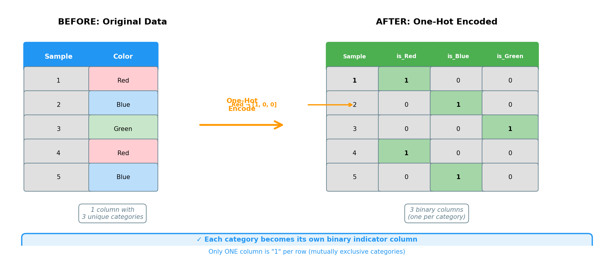
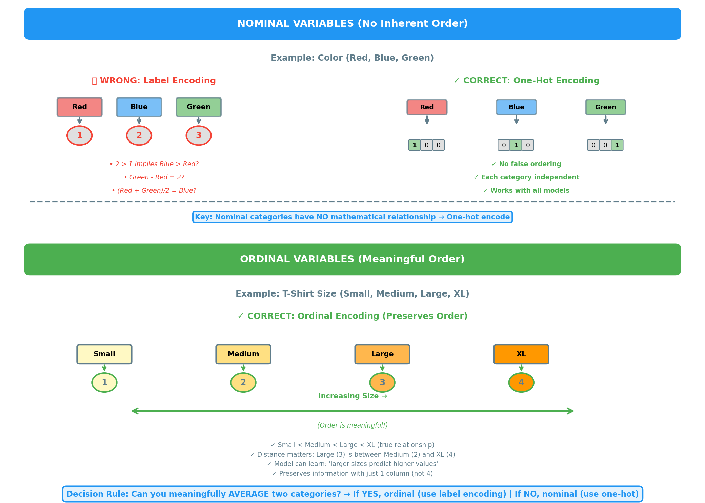
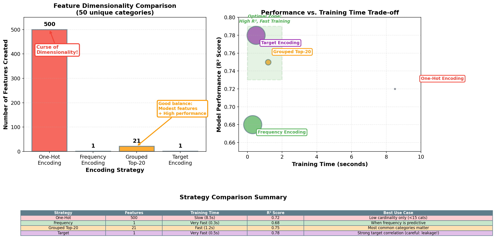
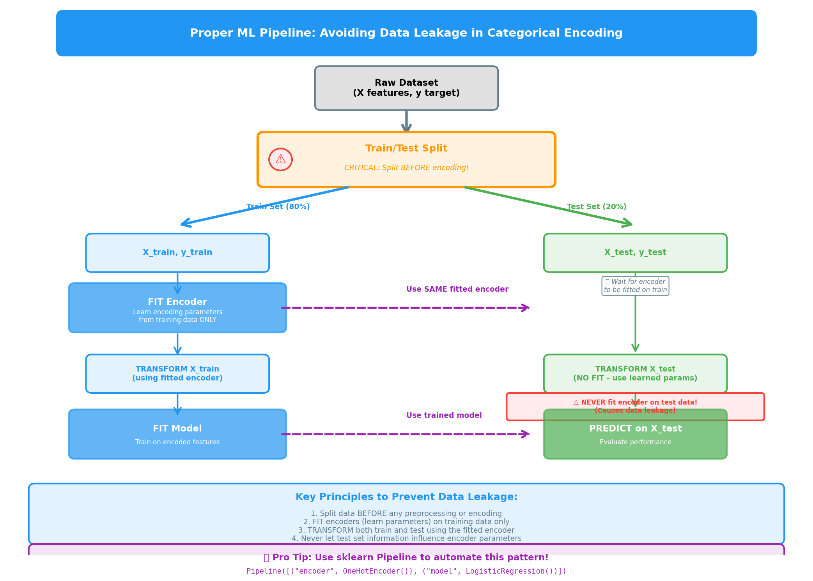
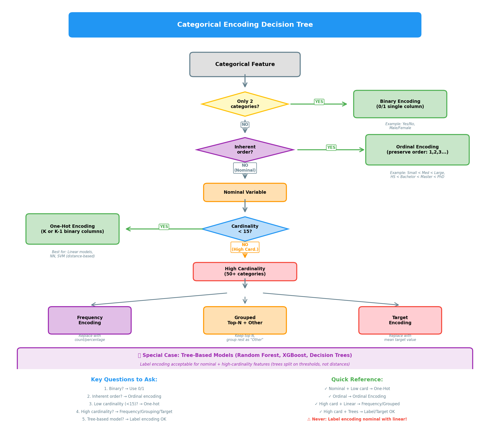

# Diagram Insertion Guide for Chapter 14: Categorical Features

All 5 diagrams have been successfully generated. Here's where to insert them in content.md:

## Diagram 1: One-Hot Encoding Visual
**File:** `diagrams/01_one_hot_encoding_visual.png`
**Insert at:** Line 71 (in the "Visual" section, right after the ## Visual heading)

**Markdown to add:**
```markdown


*Figure 1: One-hot encoding transforms a single categorical column into multiple binary indicator columns. Each category becomes its own column, with exactly one "1" per row.*
```

---

## Diagram 2: Ordinal vs Nominal Comparison
**File:** `diagrams/02_ordinal_vs_nominal.png`
**Insert at:** After the formal definition section, before the ASCII decision tree (around line 88, after the Key Concept box)

**Markdown to add:**
```markdown


*Figure 2: Comparison of nominal categories (which require one-hot encoding) versus ordinal categories (which can use label encoding). The key distinction is whether there's a meaningful mathematical relationship between categories.*
```

---

## Diagram 3: High-Cardinality Problem Visualization
**File:** `diagrams/03_high_cardinality_comparison.png`
**Insert at:** In the "Walkthrough" section, after discussing Part 3: High-Cardinality Strategies (around line 610, after the explanation of the three encoding alternatives)

**Markdown to add:**
```markdown


*Figure 3: Performance comparison of different encoding strategies for high-cardinality features. One-hot encoding creates hundreds of features and is slow, while frequency, grouped, and target encoding offer better trade-offs between dimensionality and performance.*
```

---

## Diagram 4: ML Pipeline and Data Leakage Prevention
**File:** `diagrams/04_pipeline_leakage.png`
**Insert at:** In the "Common Pitfalls" section, under **2. Encoding Before Train/Test Split** (around line 660, after explaining the correct approach)

**Markdown to add:**
```markdown


*Figure 4: Proper machine learning pipeline for categorical encoding. The encoder must be fitted on training data only, then applied to both train and test sets. This prevents data leakage where test information influences the encoding parameters.*
```

---

## Diagram 5: Categorical Encoding Decision Tree
**File:** `diagrams/05_encoding_decision_tree.png`
**Insert at:** In the "Key Takeaways" section or just before it (around line 753, before the bullet points)

**Markdown to add:**
```markdown


*Figure 5: Decision flowchart for selecting the appropriate categorical encoding strategy. Start by identifying whether your feature is binary, ordinal, or nominal, then consider cardinality and model type to choose the best encoding approach.*
```

---

## Summary

All diagrams use the consistent color palette:
- Blue (#2196F3): Primary/informational
- Green (#4CAF50): Correct approaches
- Orange (#FF9800): Warnings/alternatives
- Red (#F44336): Errors/problems
- Purple (#9C27B0): Special cases
- Gray (#607D8B): Neutral/structure

All diagrams are:
- 150 DPI (high quality)
- White background
- Maximum 800px wide (mobile-friendly)
- Properly labeled with clear titles and annotations
- Using 12pt+ font sizes for readability

## Files Generated

1. `01_one_hot_encoding_visual.png` - 96 KB
2. `02_ordinal_vs_nominal.png` - 233 KB
3. `03_high_cardinality_comparison.png` - 218 KB
4. `04_pipeline_leakage.png` - 221 KB
5. `05_encoding_decision_tree.png` - 274 KB

Total size: ~1 MB for all diagrams

## Python Source Files

All diagram generation scripts are saved in the diagrams/ directory:
- `01_one_hot_encoding_visual.py`
- `02_ordinal_vs_nominal.py`
- `03_high_cardinality_comparison.py`
- `04_pipeline_leakage.py`
- `05_encoding_decision_tree.py`

These can be re-run to regenerate diagrams if needed.
