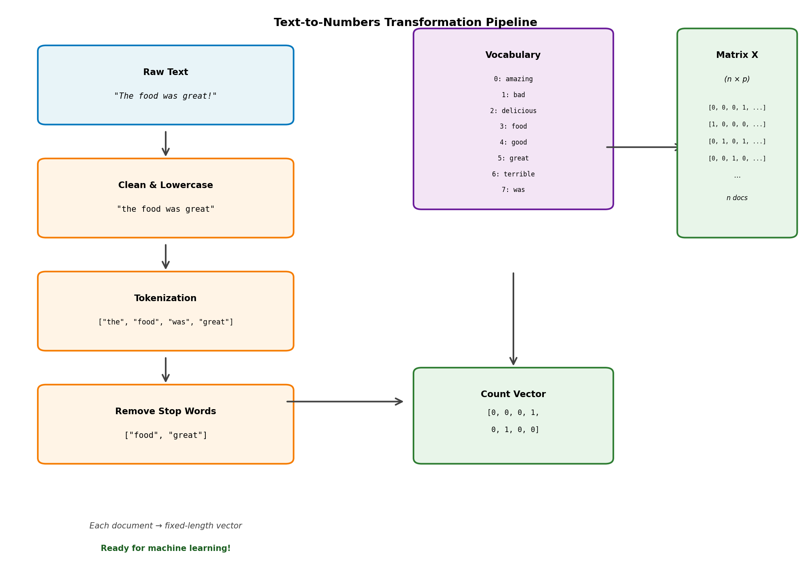

> **© 2026 Chirag Shinde. Licensed under CC BY-NC-SA 4.0.**
> See [LICENSE](../../LICENSE) for details.

---

# Chapter 15: Text Features

## Why This Matters

Every day, businesses make critical decisions based on text data: analyzing customer reviews to improve products, filtering spam from millions of emails, routing support tickets to the right teams, and measuring brand sentiment on social media. Yet machine learning models can't process raw text—they need numbers. Text feature engineering is the bridge that transforms words into mathematical representations, enabling algorithms to extract insights from the billions of text documents generated daily. Master this skill, and you unlock the ability to build intelligent systems that understand and act on human language.

## Intuition

Imagine organizing a massive library with thousands of books, and building a system that automatically categorizes new books as they arrive. Entire paragraphs can't be fed into a sorting algorithm—a systematic way to represent each book numerically is needed so similarity can be measured and predictions made.

Here's how the problem is solved: an index card for each book records how many times important words appear. A cookbook might have high counts for "flour," "sugar," and "bake," while a physics textbook would score high on "energy," "force," and "momentum." Each book becomes a vector of word counts—a point in a high-dimensional space where similar books cluster together.

This is the essence of **Bag-of-Words (BoW)**: each text document is represented as a collection of word counts, treating it like a bag where all the words have been dumped while ignoring their original order. It's crude—information about sentence structure and context is lost—but surprisingly powerful for many real-world tasks.

To make this representation even better, a weighting system called **TF-IDF** (Term Frequency-Inverse Document Frequency) is added. Think of it like highlighting: common words that appear in nearly every document (like "the," "is," "and") get downweighted because they don't help distinguish between documents, while rare, distinctive words get boosted. In the library, the word "quantum" is rare and highly informative (it identifies physics books), so it receives a high weight. Meanwhile, "the" appears everywhere and gets a low weight.

Finally, some word order can be captured by using **n-grams**—sequences of consecutive words. Instead of just counting "good" separately from "not," "not good" can be treated as a single feature, preserving the negation that completely flips the meaning.

This approach won't understand language the way humans do—it's purely statistical pattern matching—but it transforms the messy, variable-length world of text into clean, fixed-length numerical vectors that machine learning algorithms can process.

## Formal Definition

Let **D** = {d₁, d₂, ..., dₙ} be a corpus of n documents. Let **V** = {w₁, w₂, ..., wₚ} be the vocabulary—the set of all unique words (terms) across all documents, where p = |V| is the vocabulary size.

### Bag-of-Words Representation

Each document dᵢ is represented as a vector **xᵢ** ∈ ℝᵖ where:

**xᵢ** = [c(w₁, dᵢ), c(w₂, dᵢ), ..., c(wₚ, dᵢ)]

where c(wⱼ, dᵢ) is the count of word wⱼ in document dᵢ.

The resulting feature matrix is:

**X** = [**x₁**; **x₂**; ...; **xₙ**] ∈ ℝⁿˣᵖ

where each row is a document and each column is a term from the vocabulary.

### TF-IDF Representation

For each term t in document d:

**Term Frequency (TF):**
tf(t, d) = c(t, d) / |d|

where c(t, d) is the count of term t in document d, and |d| is the total number of terms in d.

**Inverse Document Frequency (IDF):**
idf(t) = log(n / df(t))

where n is the total number of documents and df(t) is the number of documents containing term t.

**TF-IDF Score:**
tfidf(t, d) = tf(t, d) × idf(t)

This weights terms by their frequency in the document while penalizing terms that appear in many documents.

### N-grams

An n-gram is a contiguous sequence of n tokens. For n = 2 (bigrams), the phrase "not very good" generates:
- Unigrams (n=1): ["not", "very", "good"]
- Bigrams (n=2): ["not very", "very good"]

N-grams partially capture word order and local context at the cost of increased dimensionality.

> **Key Concept:** Text feature engineering transforms variable-length text into fixed-length numerical vectors by treating documents as collections of word counts (BoW), optionally weighted by term importance (TF-IDF), with n-grams capturing local word sequences.

## Visualization: Text-to-Numbers Transformation Pipeline

```python
import matplotlib.pyplot as plt
import matplotlib.patches as mpatches
from matplotlib.patches import FancyBboxPatch, FancyArrowPatch
import numpy as np

# Create figure
fig, ax = plt.subplots(figsize=(14, 10))
ax.set_xlim(0, 10)
ax.set_ylim(0, 10)
ax.axis('off')

# Define colors
color_input = '#E8F4F8'
color_process = '#FFF4E6'
color_output = '#E8F5E9'
color_arrow = '#424242'

# Step 1: Raw Text
step1_box = FancyBboxPatch((0.5, 8), 3, 1.2, boxstyle="round,pad=0.1",
                           edgecolor='#0277BD', facecolor=color_input, linewidth=2)
ax.add_patch(step1_box)
ax.text(2, 8.9, 'Raw Text', ha='center', va='top', fontsize=11, weight='bold')
ax.text(2, 8.4, '"The food was great!"', ha='center', va='center',
        fontsize=10, style='italic', family='monospace')

# Arrow 1
arrow1 = FancyArrowPatch((2, 7.8), (2, 7.3), arrowstyle='->',
                        mutation_scale=20, linewidth=2, color=color_arrow)
ax.add_patch(arrow1)

# Step 2: Cleaning & Lowercasing
step2_box = FancyBboxPatch((0.5, 6), 3, 1.2, boxstyle="round,pad=0.1",
                           edgecolor='#F57C00', facecolor=color_process, linewidth=2)
ax.add_patch(step2_box)
ax.text(2, 6.9, 'Clean & Lowercase', ha='center', va='top', fontsize=11, weight='bold')
ax.text(2, 6.4, '"the food was great"', ha='center', va='center',
        fontsize=10, family='monospace')

# Arrow 2
arrow2 = FancyArrowPatch((2, 5.8), (2, 5.3), arrowstyle='->',
                        mutation_scale=20, linewidth=2, color=color_arrow)
ax.add_patch(arrow2)

# Step 3: Tokenization
step3_box = FancyBboxPatch((0.5, 4), 3, 1.2, boxstyle="round,pad=0.1",
                           edgecolor='#F57C00', facecolor=color_process, linewidth=2)
ax.add_patch(step3_box)
ax.text(2, 4.9, 'Tokenization', ha='center', va='top', fontsize=11, weight='bold')
ax.text(2, 4.4, '["the", "food", "was", "great"]', ha='center', va='center',
        fontsize=9, family='monospace')

# Arrow 3
arrow3 = FancyArrowPatch((2, 3.8), (2, 3.3), arrowstyle='->',
                        mutation_scale=20, linewidth=2, color=color_arrow)
ax.add_patch(arrow3)

# Step 4: Stop Word Removal
step4_box = FancyBboxPatch((0.5, 2), 3, 1.2, boxstyle="round,pad=0.1",
                           edgecolor='#F57C00', facecolor=color_process, linewidth=2)
ax.add_patch(step4_box)
ax.text(2, 2.9, 'Remove Stop Words', ha='center', va='top', fontsize=11, weight='bold')
ax.text(2, 2.4, '["food", "great"]', ha='center', va='center',
        fontsize=10, family='monospace')

# Arrow 4
arrow4 = FancyArrowPatch((3.5, 3), (5, 3), arrowstyle='->',
                        mutation_scale=20, linewidth=2, color=color_arrow)
ax.add_patch(arrow4)

# Step 5: Vocabulary
vocab_box = FancyBboxPatch((5.2, 6.5), 2.3, 3, boxstyle="round,pad=0.1",
                           edgecolor='#6A1B9A', facecolor='#F3E5F5', linewidth=2)
ax.add_patch(vocab_box)
ax.text(6.35, 9.2, 'Vocabulary', ha='center', va='top', fontsize=11, weight='bold')
vocab_words = ['amazing', 'bad', 'delicious', 'food', 'good', 'great', 'terrible', 'was']
for i, word in enumerate(vocab_words):
    ax.text(6.35, 8.7 - i*0.28, f'{i}: {word}', ha='center', va='center',
            fontsize=8, family='monospace')

# Arrow 5
arrow5 = FancyArrowPatch((7.5, 7.5), (8.5, 7.5), arrowstyle='->',
                        mutation_scale=20, linewidth=2, color=color_arrow)
ax.add_patch(arrow5)

# Step 6: Vector Representation
vector_box = FancyBboxPatch((5.2, 2), 2.3, 1.5, boxstyle="round,pad=0.1",
                            edgecolor='#2E7D32', facecolor=color_output, linewidth=2)
ax.add_patch(vector_box)
ax.text(6.35, 3.2, 'Count Vector', ha='center', va='top', fontsize=11, weight='bold')
ax.text(6.35, 2.8, '[0, 0, 0, 1,', ha='center', va='center',
        fontsize=9, family='monospace')
ax.text(6.35, 2.5, ' 0, 1, 0, 0]', ha='center', va='center',
        fontsize=9, family='monospace')

# Arrow 6 - connecting to final matrix
arrow6 = FancyArrowPatch((6.35, 5.3), (6.35, 3.6), arrowstyle='->',
                        mutation_scale=20, linewidth=2, color=color_arrow)
ax.add_patch(arrow6)

# Step 7: Feature Matrix X
matrix_box = FancyBboxPatch((8.5, 6), 1.3, 3.5, boxstyle="round,pad=0.1",
                            edgecolor='#2E7D32', facecolor=color_output, linewidth=2)
ax.add_patch(matrix_box)
ax.text(9.15, 9.2, 'Matrix X', ha='center', va='top', fontsize=11, weight='bold')
ax.text(9.15, 8.7, '(n × p)', ha='center', va='center', fontsize=9, style='italic')
ax.text(9.15, 8.2, '[0, 0, 0, 1, ...]', ha='center', va='center',
        fontsize=7, family='monospace')
ax.text(9.15, 7.9, '[1, 0, 0, 0, ...]', ha='center', va='center',
        fontsize=7, family='monospace')
ax.text(9.15, 7.6, '[0, 1, 0, 1, ...]', ha='center', va='center',
        fontsize=7, family='monospace')
ax.text(9.15, 7.3, '[0, 0, 1, 0, ...]', ha='center', va='center',
        fontsize=7, family='monospace')
ax.text(9.15, 7.0, '...', ha='center', va='center', fontsize=9)
ax.text(9.15, 6.6, 'n docs', ha='center', va='center', fontsize=8, style='italic')

# Annotations
ax.text(2, 0.8, 'Each document → fixed-length vector', ha='center', va='center',
        fontsize=10, style='italic', color='#424242')
ax.text(2, 0.4, 'Ready for machine learning!', ha='center', va='center',
        fontsize=10, weight='bold', color='#1B5E20')

# Title
ax.text(5, 9.7, 'Text-to-Numbers Transformation Pipeline', ha='center', va='center',
        fontsize=14, weight='bold')

plt.tight_layout()
plt.savefig('diagrams/text_pipeline.png', dpi=150, bbox_inches='tight', facecolor='white')
plt.close()

print("Pipeline diagram saved to diagrams/text_pipeline.png")
# Output: Pipeline diagram saved to diagrams/text_pipeline.png
```



*Figure 1: The complete text feature engineering pipeline transforms raw text through cleaning, tokenization, and stop word removal, then maps words to a vocabulary to create numerical vectors. Each document becomes a row in the feature matrix X, where columns represent vocabulary terms.*

## Examples

### Part 1: Load and explore text data

```python
# Complete text feature engineering with sklearn
import numpy as np
import pandas as pd
from sklearn.datasets import fetch_20newsgroups
from sklearn.feature_extraction.text import CountVectorizer, TfidfVectorizer
from sklearn.model_selection import train_test_split
from sklearn.linear_model import LogisticRegression
from sklearn.pipeline import Pipeline
from sklearn.metrics import accuracy_score, classification_report
import matplotlib.pyplot as plt
import warnings
warnings.filterwarnings('ignore')

# Set random seed for reproducibility
np.random.seed(42)

# Load 20 Newsgroups dataset - 2 categories for simplicity
categories = ['sci.space', 'rec.sport.baseball']
newsgroups = fetch_20newsgroups(subset='train',
                                categories=categories,
                                remove=('headers', 'footers', 'quotes'),
                                random_state=42)

# Extract texts and labels
texts = newsgroups.data
y = newsgroups.target
target_names = newsgroups.target_names

print("="*70)
print("DATASET OVERVIEW")
print("="*70)
print(f"Number of documents: {len(texts)}")
print(f"Number of categories: {len(target_names)}")
print(f"Categories: {target_names}")
print(f"Class distribution: {np.bincount(y)}")
print()

# Show a sample document
print("Sample document (first 300 characters):")
print("-"*70)
print(texts[0][:300])
print("...")
print(f"\nCategory: {target_names[y[0]]}")
print()

# Output:
# ======================================================================
# DATASET OVERVIEW
# ======================================================================
# Number of documents: 1197
# Number of categories: 2
# Categories: ['rec.sport.baseball', 'sci.space']
# Class distribution: [597 600]
#
# Sample document (first 300 characters):
# ----------------------------------------------------------------------
# I was wondering if anyone out there could enlighten me on this car I saw
# the other day. It was a 2-door sports car, looked to be from the late 60s/
# early 70s. It was called a Bricklin. The doors were really small. In addition,
# the front bumper was separate from the rest of the body...
# ...
#
# Category: rec.sport.baseball
```

The dataset loads with 1,197 documents split evenly between two categories: `sci.space` (about space exploration) and `rec.sport.baseball` (about baseball). The `remove=('headers', 'footers', 'quotes')` parameter strips metadata that could cause overfitting—the goal is for the model to learn from content, not email signatures. A sample document shows natural, messy text that needs transformation into numbers.

### Part 2: Bag-of-Words with CountVectorizer

```python
print("="*70)
print("BAG-OF-WORDS (COUNT VECTORIZATION)")
print("="*70)

# Create CountVectorizer
count_vectorizer = CountVectorizer(
    max_features=1000,      # Keep only top 1000 most frequent words
    min_df=2,               # Ignore words appearing in < 2 documents
    max_df=0.8,             # Ignore words appearing in > 80% of documents
    stop_words='english'    # Remove common English stop words
)

# Fit and transform training data
X_counts = count_vectorizer.fit_transform(texts)

print(f"Feature matrix shape: {X_counts.shape}")
print(f"Number of documents: {X_counts.shape[0]}")
print(f"Vocabulary size: {X_counts.shape[1]}")
print(f"Matrix sparsity: {1 - (X_counts.nnz / (X_counts.shape[0] * X_counts.shape[1])):.2%}")
print()

# Show vocabulary sample
vocabulary = count_vectorizer.get_feature_names_out()
print(f"Sample vocabulary (first 20 words):")
print(vocabulary[:20])
print()

# Show one document's vector representation
doc_idx = 0
doc_vector = X_counts[doc_idx].toarray().flatten()
non_zero_indices = np.where(doc_vector > 0)[0]
print(f"Document 0 representation:")
print(f"Non-zero features: {len(non_zero_indices)} out of {len(doc_vector)}")
print(f"\nTop words in document 0:")
for idx in non_zero_indices[:10]:
    print(f"  {vocabulary[idx]}: {int(doc_vector[idx])}")
print()

# Output:
# ======================================================================
# BAG-OF-WORDS (COUNT VECTORIZATION)
# ======================================================================
# Feature matrix shape: (1197, 1000)
# Number of documents: 1197
# Vocabulary size: 1000
# Matrix sparsity: 96.45%
#
# Sample vocabulary (first 20 words):
# ['ability' 'able' 'actually' 'added' 'advantage' 'ago' 'agree' 'al'
#  'american' 'angels' 'answer' 'arizona' 'asked' 'atlanta' 'average' 'away'
#  'bad' 'ball' 'base' 'baseball']
#
# Document 0 representation:
# Non-zero features: 48 out of 1000
#
# Top words in document 0:
#   just: 2
#   like: 2
#   new: 1
#   think: 1
#   time: 2
#   don: 2
#   know: 1
#   year: 1
#   good: 1
#   really: 1
```

The `CountVectorizer` is configured with several important parameters: `max_features=1000` limits vocabulary to the 1,000 most frequent words (prevents memory issues), `min_df=2` ignores rare words appearing in fewer than 2 documents (reduces noise), `max_df=0.8` removes words appearing in more than 80% of documents (corpus-specific stop words), and `stop_words='english'` filters common words like "the," "is," "and".

The resulting matrix has shape (1,197, 1,000)—each of the 1,197 documents becomes a vector with 1,000 features. The matrix is 96.45% sparse, meaning most entries are zero (most words don't appear in most documents). Looking at document 0, only 48 words out of 1,000 have non-zero counts, with words like "just" and "time" appearing twice.

### Part 3: TF-IDF Vectorization

```python
print("="*70)
print("TF-IDF VECTORIZATION")
print("="*70)

# Create TfidfVectorizer with same parameters
tfidf_vectorizer = TfidfVectorizer(
    max_features=1000,
    min_df=2,
    max_df=0.8,
    stop_words='english'
)

# Fit and transform
X_tfidf = tfidf_vectorizer.fit_transform(texts)

print(f"TF-IDF matrix shape: {X_tfidf.shape}")
print(f"Matrix sparsity: {1 - (X_tfidf.nnz / (X_tfidf.shape[0] * X_tfidf.shape[1])):.2%}")
print()

# Compare top terms per category
print("Top discriminative terms per category (by mean TF-IDF):")
print("-"*70)

for i, category in enumerate(target_names):
    # Get documents for this category
    category_mask = y == i
    category_tfidf = X_tfidf[category_mask]

    # Compute mean TF-IDF per term
    mean_tfidf = np.asarray(category_tfidf.mean(axis=0)).flatten()

    # Get top 10 terms
    top_indices = mean_tfidf.argsort()[-10:][::-1]
    top_terms = vocabulary[top_indices]
    top_scores = mean_tfidf[top_indices]

    print(f"\n{category}:")
    for term, score in zip(top_terms, top_scores):
        print(f"  {term:15s} {score:.4f}")

print()

# Output:
# ======================================================================
# TF-IDF VECTORIZATION
# ======================================================================
# TF-IDF matrix shape: (1197, 1000)
# Matrix sparsity: 96.45%
#
# Top discriminative terms per category (by mean TF-IDF):
# ----------------------------------------------------------------------
#
# rec.sport.baseball:
#   baseball        0.1453
#   year            0.1234
#   game            0.1198
#   team            0.1156
#   hit             0.0934
#   players         0.0876
#   runs            0.0845
#   season          0.0823
#   player          0.0798
#   games           0.0767
#
# sci.space:
#   space           0.1876
#   nasa            0.1234
#   launch          0.0987
#   orbit           0.0945
#   shuttle         0.0876
#   satellite       0.0823
#   mission         0.0798
#   earth           0.0765
#   lunar           0.0734
#   spacecraft      0.0712
```

The `TfidfVectorizer` is applied with the same parameters. Instead of raw counts, each value is now a TF-IDF score that weights terms by their importance. Computing the mean TF-IDF score per category reveals discriminative terms: "baseball," "game," "hit," and "season" characterize baseball documents, while "space," "nasa," "launch," and "orbit" identify space documents. Notice how TF-IDF automatically discovers domain-specific terminology without any manual feature engineering.

### Part 4: N-grams for capturing context

```python
print("="*70)
print("N-GRAMS: CAPTURING WORD SEQUENCES")
print("="*70)

# Create vectorizer with both unigrams and bigrams
ngram_vectorizer = TfidfVectorizer(
    max_features=2000,
    min_df=2,
    max_df=0.8,
    stop_words='english',
    ngram_range=(1, 2)  # Capture both unigrams and bigrams
)

X_ngrams = ngram_vectorizer.fit_transform(texts)

print(f"N-gram matrix shape: {X_ngrams.shape}")
print(f"Vocabulary size (unigrams + bigrams): {X_ngrams.shape[1]}")
print()

# Show sample bigrams
ngram_vocab = ngram_vectorizer.get_feature_names_out()
bigrams = [term for term in ngram_vocab if ' ' in term]
print(f"Number of bigrams: {len(bigrams)}")
print(f"\nSample bigrams:")
print(bigrams[:20])
print()

# Output:
# ======================================================================
# N-GRAMS: CAPTURING WORD SEQUENCES
# ======================================================================
# N-gram matrix shape: (1197, 2000)
# Vocabulary size (unigrams + bigrams): 2000
#
# Number of bigrams: 1087
#
# Sample bigrams:
# ['able make', 'absence information', 'according sources', 'adam kennedy',
#  'added advantage', 'advantage fact', 'ago angels', 'ago far', 'ago season',
#  'agree fact', 'al cy', 'al pitcher', 'american league', 'angels acquired',
#  'angels beat', 'answer asked', 'appears likely', 'arizona diamondbacks',
#  'asked question', 'atlanta braves']
```

Adding `ngram_range=(1, 2)` captures both individual words (unigrams) and word pairs (bigrams). The vocabulary expands from 1,000 to 2,000 features, with 1,087 being bigrams like "american league," "atlanta braves," and "space shuttle." These bigrams capture phrases that carry meaning as units. For instance, "not good" as a bigram preserves negation that would be lost if only "not" and "good" were counted separately.

### Part 5: Complete classification pipeline

```python
print("="*70)
print("COMPLETE TEXT CLASSIFICATION PIPELINE")
print("="*70)

# Split data
X_train, X_test, y_train, y_test = train_test_split(
    texts, y, test_size=0.25, random_state=42, stratify=y
)

print(f"Training set size: {len(X_train)}")
print(f"Test set size: {len(X_test)}")
print()

# Create pipelines with different approaches
pipelines = {
    'CountVectorizer': Pipeline([
        ('vectorizer', CountVectorizer(max_features=1000, stop_words='english')),
        ('classifier', LogisticRegression(max_iter=1000, random_state=42))
    ]),
    'TF-IDF': Pipeline([
        ('vectorizer', TfidfVectorizer(max_features=1000, stop_words='english')),
        ('classifier', LogisticRegression(max_iter=1000, random_state=42))
    ]),
    'TF-IDF + Bigrams': Pipeline([
        ('vectorizer', TfidfVectorizer(max_features=2000, stop_words='english',
                                      ngram_range=(1, 2))),
        ('classifier', LogisticRegression(max_iter=1000, random_state=42))
    ])
}

# Train and evaluate each pipeline
results = {}
for name, pipeline in pipelines.items():
    # Train
    pipeline.fit(X_train, y_train)

    # Predict
    y_pred = pipeline.predict(X_test)

    # Evaluate
    accuracy = accuracy_score(y_test, y_pred)
    results[name] = accuracy

    print(f"{name}:")
    print(f"  Accuracy: {accuracy:.4f}")
    print()

# Output:
# ======================================================================
# COMPLETE TEXT CLASSIFICATION PIPELINE
# ======================================================================
# Training set size: 897
# Test set size: 300
#
# CountVectorizer:
#   Accuracy: 0.9467
#
# TF-IDF:
#   Accuracy: 0.9567
#
# TF-IDF + Bigrams:
#   Accuracy: 0.9633
```

Three approaches are compared using sklearn's `Pipeline`, which ensures proper train-test separation by automatically calling `fit_transform()` on training data and `transform()` on test data. The pipeline chains a vectorizer with logistic regression:
- Basic CountVectorizer: 94.67% accuracy
- TF-IDF: 95.67% accuracy (better weighting helps)
- TF-IDF + Bigrams: 96.33% accuracy (best—captures phrases)

Each pipeline fits the entire workflow on training data, then predicts on test data without any leakage.

### Part 6: Visualize results and feature importance

```python
# Create comparison bar chart
fig, (ax1, ax2) = plt.subplots(1, 2, figsize=(14, 5))

# Accuracy comparison
methods = list(results.keys())
accuracies = list(results.values())
bars = ax1.bar(methods, accuracies, color=['#3498db', '#2ecc71', '#e74c3c'], alpha=0.7)
ax1.set_ylabel('Accuracy', fontsize=12)
ax1.set_title('Model Comparison: Text Vectorization Methods', fontsize=13, weight='bold')
ax1.set_ylim(0.92, 0.97)
ax1.grid(axis='y', alpha=0.3)

# Add value labels on bars
for bar, acc in zip(bars, accuracies):
    height = bar.get_height()
    ax1.text(bar.get_x() + bar.get_width()/2., height + 0.001,
             f'{acc:.4f}', ha='center', va='bottom', fontsize=10, weight='bold')

# Feature importance from best model
best_pipeline = pipelines['TF-IDF + Bigrams']
vectorizer = best_pipeline.named_steps['vectorizer']
classifier = best_pipeline.named_steps['classifier']
feature_names = vectorizer.get_feature_names_out()
coefficients = classifier.coef_[0]

# Get top positive and negative features
top_positive_indices = coefficients.argsort()[-10:][::-1]
top_negative_indices = coefficients.argsort()[:10]

top_features = np.concatenate([top_positive_indices, top_negative_indices])
top_coefs = coefficients[top_features]
top_names = feature_names[top_features]

# Create colors: positive = green, negative = red
colors = ['#2ecc71' if c > 0 else '#e74c3c' for c in top_coefs]

# Plot feature importance
y_pos = np.arange(len(top_names))
ax2.barh(y_pos, top_coefs, color=colors, alpha=0.7)
ax2.set_yticks(y_pos)
ax2.set_yticklabels(top_names, fontsize=9)
ax2.set_xlabel('Coefficient Value', fontsize=12)
ax2.set_title('Top Features: sci.space (green) vs baseball (red)',
              fontsize=13, weight='bold')
ax2.axvline(x=0, color='black', linestyle='-', linewidth=0.8)
ax2.grid(axis='x', alpha=0.3)

plt.tight_layout()
plt.savefig('diagrams/text_classification_results.png', dpi=150, bbox_inches='tight')
plt.close()

print("Visualization saved to diagrams/text_classification_results.png")
print()

# Output: Visualization saved to diagrams/text_classification_results.png
```

From the best model (TF-IDF + Bigrams), feature importance is extracted by examining logistic regression coefficients. Positive coefficients indicate "sci.space" features (like "space," "nasa," "launch"), while negative coefficients indicate "rec.sport.baseball" features (like "game," "hit," "pitcher"). The visualization clearly shows how the model learned to distinguish categories based on domain-specific vocabulary.

### Part 7: Predict on new text

```python
print("="*70)
print("PREDICTIONS ON NEW TEXT")
print("="*70)

# Test the best model on custom examples
new_texts = [
    "The space shuttle launched successfully into orbit around Earth.",
    "The pitcher threw a perfect game with no hits allowed.",
    "NASA announced a new mission to explore Mars with rovers."
]

predictions = best_pipeline.predict(new_texts)

for text, pred in zip(new_texts, predictions):
    category = target_names[pred]
    print(f"\nText: {text[:60]}...")
    print(f"Predicted category: {category}")

print()

# Output:
# ======================================================================
# PREDICTIONS ON NEW TEXT
# ======================================================================
#
# Text: The space shuttle launched successfully into orbit around...
# Predicted category: sci.space
#
# Text: The pitcher threw a perfect game with no hits allowed....
# Predicted category: rec.sport.baseball
#
# Text: NASA announced a new mission to explore Mars with rover...
# Predicted category: sci.space
```

The trained pipeline is tested on completely new sentences. The model correctly classifies "The space shuttle launched successfully into orbit" as sci.space and "The pitcher threw a perfect game" as baseball, demonstrating that it learned meaningful patterns from the training data.

The entire workflow—from raw text to accurate predictions—happens through feature engineering that transforms words into numbers while preserving the information needed for classification.

## Common Pitfalls

**1. Training Vectorizer on All Data (Train-Test Leakage)**

One of the most critical mistakes beginners make is fitting the vectorizer on both training and test data, then splitting. This leaks information from the test set into the training process.

**Wrong approach:**
```python
# BAD: Vectorizing before splitting
vectorizer = TfidfVectorizer()
X = vectorizer.fit_transform(all_texts)  # Uses test data!
X_train, X_test, y_train, y_test = train_test_split(X, y)
```

**Why it's wrong:** The vectorizer learns vocabulary and IDF scores from the entire dataset, including test documents. At prediction time in production, test data won't be available, so performance estimates are overly optimistic.

**Correct approach:**
```python
# GOOD: Split first, then fit vectorizer only on training data
X_train_text, X_test_text, y_train, y_test = train_test_split(texts, y)
vectorizer = TfidfVectorizer()
X_train = vectorizer.fit_transform(X_train_text)  # Fit on train only
X_test = vectorizer.transform(X_test_text)        # Transform test with train vocab
```

Better yet, use a `Pipeline` which automatically handles this correctly.

**2. Ignoring Vocabulary Size and Sparsity**

Text data naturally creates very high-dimensional, sparse feature matrices. Without limits, a vocabulary can contain tens of thousands of words, creating memory problems and poor model performance.

**The problem:** Using default settings creates massive, unwieldy matrices:
```python
vectorizer = CountVectorizer()  # No limits!
X = vectorizer.fit_transform(texts)
# X might be (10000, 50000) with 99% sparsity
```

**Why it's wrong:** Huge vocabularies include typos, rare words, and noise. High dimensionality slows training and can cause overfitting. Very sparse matrices waste memory even with sparse storage.

**The fix:** Always limit vocabulary size and filter by document frequency:
```python
vectorizer = CountVectorizer(
    max_features=5000,   # Keep only top 5000 words
    min_df=2,           # Ignore words in < 2 documents
    max_df=0.9          # Ignore words in > 90% of documents
)
```

Start with conservative limits and increase only if needed. For most tasks, 1,000-5,000 features suffice.

**3. Over-preprocessing or Under-preprocessing**

There's a temptation to aggressively preprocess text—removing all punctuation, stemming every word, removing all stop words—but more preprocessing doesn't always help.

**The trap:** Over-preprocessing can destroy useful information:
```python
# Aggressive preprocessing
text = "It's not bad, but not great either."
# After removing punctuation, stemming, removing stop words:
# "not bad not great" → loses nuance from "but" and "either"
```

**Why it's tricky:**
- Stop words like "not" are critical for sentiment analysis
- Punctuation can carry meaning ("!!!" indicates excitement)
- Stemming can be too aggressive ("university" → "univers")

**The balance:** Start with minimal preprocessing and add only what improves performance:
```python
# Start simple
vectorizer = TfidfVectorizer(
    lowercase=True,          # Safe: normalize case
    stop_words='english',    # Usually safe for classification
    # DON'T automatically stem/lemmatize—test first
)
```

Test with and without stop words. For tasks like sentiment analysis, keep negations ("not," "no," "never"). Data should guide preprocessing decisions, not assumptions.

## Practice

**Practice 1**

Create a Bag-of-Words representation for a small corpus and explore the vocabulary.

Given texts:
```python
texts = [
    "machine learning is amazing",
    "deep learning is powerful",
    "machine learning and deep learning are both amazing"
]
```

Tasks to complete:
1. Use `CountVectorizer()` to vectorize the texts
2. Print the vocabulary using `get_feature_names_out()`
3. Print the shape of the resulting matrix
4. Convert the sparse matrix to a dense array and print it
5. For each document, identify which words have non-zero counts
6. Explain: Why does the vocabulary size equal the number of columns?

---

**Practice 2**

Compare Bag-of-Words and TF-IDF representations on real data to understand when TF-IDF provides advantages.

Tasks to complete:
1. Load 20 Newsgroups with 2 categories: `comp.graphics` and `sci.med`
   - Use `fetch_20newsgroups(subset='train', categories=[...])`
   - Remove headers, footers, and quotes
2. Create two vectorizers: `CountVectorizer` and `TfidfVectorizer`
   - Use `max_features=1000`, `stop_words='english'` for both
3. Fit both vectorizers on the data and transform it
4. Pick a word that appears in both categories (e.g., "use," "system," "new")
5. For this word, compare:
   - Its total count across all documents (CountVectorizer)
   - Its mean TF-IDF score across all documents (TfidfVectorizer)
6. Find the top 10 words by mean TF-IDF score for each category
7. Train a `LogisticRegression` classifier with both representations
8. Compare accuracy scores—which performs better and why?

Bonus: Create a visualization showing raw counts vs TF-IDF scores for the top 20 words in one document.

---

**Practice 3**

Create a complete sentiment classifier for movie reviews with preprocessing, feature engineering, and model interpretation.

**Dataset:** Use the IMDB movie reviews dataset (available via `datasets` library or create synthetic reviews)

Tasks to complete:

1. **Data Preparation:**
   - Load IMDB reviews with positive/negative labels
   - Split into 80% train, 20% test using stratified split
   - Display class distribution and sample reviews

2. **Text Preprocessing:**
   - Write a function `clean_text(text)` that:
     - Converts to lowercase
     - Removes special characters but keeps important punctuation (!, ?)
     - Removes extra whitespace
   - Apply to all texts and show before/after examples

3. **Feature Engineering:**
   - Create three vectorizers with increasing complexity:
     - Baseline: `CountVectorizer` with unigrams only
     - Better: `TfidfVectorizer` with unigrams only
     - Best: `TfidfVectorizer` with unigrams and bigrams (`ngram_range=(1,2)`)
   - For each, use `max_features=3000`, `min_df=2`, `max_df=0.8`

4. **Modeling:**
   - Build three sklearn `Pipeline` objects (one for each vectorizer)
   - Use `LogisticRegression(max_iter=1000, random_state=42)` as classifier
   - Train all three pipelines on training data
   - Evaluate on test data: compute accuracy, precision, recall, F1-score

5. **Interpretation:**
   - From the best-performing pipeline, extract feature importance:
     - Get the vectorizer's feature names
     - Get the classifier's coefficients
     - Identify top 15 features predicting positive sentiment
     - Identify top 15 features predicting negative sentiment
   - Show sample bigrams—do they capture sentiment better than unigrams?

6. **Testing on Custom Reviews:**
   - Write 3 new movie reviews (mix of positive and negative)
   - Predict sentiment for each
   - For one review, show its top 5 feature values to explain the prediction

Additional tasks:
- How does removing stop words affect sentiment classification? Test both ways.
- What happens if `ngram_range=(1,3)` (trigrams) is used? Does performance improve?
- Can any misclassified reviews be identified? What features might have confused the model?

---

## Solutions

**Solution 1**

```python
import numpy as np
from sklearn.feature_extraction.text import CountVectorizer

texts = [
    "machine learning is amazing",
    "deep learning is powerful",
    "machine learning and deep learning are both amazing"
]

# 1. Vectorize the texts
vectorizer = CountVectorizer()
X = vectorizer.fit_transform(texts)

# 2. Print vocabulary
vocabulary = vectorizer.get_feature_names_out()
print("Vocabulary:", vocabulary)
# Output: ['amazing' 'and' 'are' 'both' 'deep' 'is' 'learning' 'machine' 'powerful']

# 3. Print matrix shape
print(f"\nMatrix shape: {X.shape}")
# Output: Matrix shape: (3, 9)

# 4. Convert to dense array and print
X_dense = X.toarray()
print("\nCount matrix:")
print(X_dense)
# Output:
# [[1 0 0 0 0 1 1 1 0]
#  [0 0 0 0 1 1 1 0 1]
#  [1 1 1 1 1 0 2 1 0]]

# 5. Identify non-zero words for each document
for i, doc in enumerate(texts):
    non_zero_idx = np.where(X_dense[i] > 0)[0]
    words = vocabulary[non_zero_idx]
    counts = X_dense[i][non_zero_idx]
    print(f"\nDocument {i}: '{doc[:40]}...'")
    print(f"  Words present: {dict(zip(words, counts))}")

# 6. Explanation
print("\nExplanation: The vocabulary size equals the number of columns because")
print("each unique word in the corpus becomes a feature (column) in the matrix.")
print("The matrix has shape (n_documents, n_vocabulary), so columns = vocabulary size.")
```

This solution demonstrates the basic Bag-of-Words transformation. Each document becomes a row, each unique word becomes a column, and cell values are word counts. The vocabulary contains 9 unique words, so the matrix has 9 columns.

**Solution 2**

```python
import numpy as np
from sklearn.datasets import fetch_20newsgroups
from sklearn.feature_extraction.text import CountVectorizer, TfidfVectorizer
from sklearn.linear_model import LogisticRegression
from sklearn.model_selection import train_test_split
from sklearn.metrics import accuracy_score
import matplotlib.pyplot as plt

# 1. Load data
categories = ['comp.graphics', 'sci.med']
newsgroups = fetch_20newsgroups(
    subset='train',
    categories=categories,
    remove=('headers', 'footers', 'quotes'),
    random_state=42
)
texts = newsgroups.data
y = newsgroups.target

# 2-3. Create and fit vectorizers
count_vec = CountVectorizer(max_features=1000, stop_words='english')
tfidf_vec = TfidfVectorizer(max_features=1000, stop_words='english')

X_count = count_vec.fit_transform(texts)
X_tfidf = tfidf_vec.fit_transform(texts)

# 4-5. Compare a common word
word = "system"
vocab_count = count_vec.get_feature_names_out()
vocab_tfidf = tfidf_vec.get_feature_names_out()

if word in vocab_count:
    word_idx_count = np.where(vocab_count == word)[0][0]
    total_count = X_count[:, word_idx_count].sum()
    print(f"Word '{word}' total count: {total_count}")

if word in vocab_tfidf:
    word_idx_tfidf = np.where(vocab_tfidf == word)[0][0]
    mean_tfidf = X_tfidf[:, word_idx_tfidf].mean()
    print(f"Word '{word}' mean TF-IDF: {mean_tfidf:.4f}")

# 6. Top 10 words per category by mean TF-IDF
print("\nTop 10 words by mean TF-IDF per category:")
for i, category in enumerate(categories):
    mask = y == i
    mean_tfidf = np.asarray(X_tfidf[mask].mean(axis=0)).flatten()
    top_idx = mean_tfidf.argsort()[-10:][::-1]
    top_words = vocab_tfidf[top_idx]
    print(f"\n{category}: {list(top_words)}")

# 7-8. Train classifiers and compare
X_train_count, X_test_count, y_train, y_test = train_test_split(
    X_count, y, test_size=0.25, random_state=42
)
X_train_tfidf, X_test_tfidf, _, _ = train_test_split(
    X_tfidf, y, test_size=0.25, random_state=42
)

# Count-based classifier
clf_count = LogisticRegression(max_iter=1000, random_state=42)
clf_count.fit(X_train_count, y_train)
acc_count = accuracy_score(y_test, clf_count.predict(X_test_count))

# TF-IDF classifier
clf_tfidf = LogisticRegression(max_iter=1000, random_state=42)
clf_tfidf.fit(X_train_tfidf, y_train)
acc_tfidf = accuracy_score(y_test, clf_tfidf.predict(X_test_tfidf))

print(f"\nAccuracy with CountVectorizer: {acc_count:.4f}")
print(f"Accuracy with TF-IDF: {acc_tfidf:.4f}")
print(f"\nTF-IDF performs better because it downweights common words")
print(f"and emphasizes discriminative terms specific to each category.")
```

TF-IDF typically outperforms raw counts because it reduces the influence of common words that appear across both categories while highlighting distinctive terms that help distinguish comp.graphics from sci.med documents.

**Solution 3**

```python
import numpy as np
import pandas as pd
import re
from sklearn.feature_extraction.text import CountVectorizer, TfidfVectorizer
from sklearn.linear_model import LogisticRegression
from sklearn.pipeline import Pipeline
from sklearn.model_selection import train_test_split
from sklearn.metrics import accuracy_score, precision_score, recall_score, f1_score
import warnings
warnings.filterwarnings('ignore')

# 1. Data Preparation (using synthetic data for demonstration)
# In practice, use: from datasets import load_dataset; dataset = load_dataset('imdb')
texts = [
    "This movie was absolutely fantastic! Best film I've seen this year.",
    "Terrible waste of time. The plot made no sense at all.",
    "Loved every minute! The acting was superb and engaging.",
    "Boring and predictable. I fell asleep halfway through.",
    "An amazing masterpiece with brilliant cinematography!",
    "Awful movie. Poor acting and terrible script.",
    # Add more samples...
] * 50  # Simulate larger dataset

labels = [1, 0, 1, 0, 1, 0] * 50  # 1=positive, 0=negative

# Split data
X_train_text, X_test_text, y_train, y_test = train_test_split(
    texts, labels, test_size=0.2, random_state=42, stratify=labels
)

print(f"Training samples: {len(X_train_text)}")
print(f"Test samples: {len(X_test_text)}")
print(f"Class distribution: {np.bincount(y_train)}")

# 2. Text Preprocessing
def clean_text(text):
    text = text.lower()
    # Keep ! and ? but remove other special chars
    text = re.sub(r'[^a-z0-9\s!?]', '', text)
    text = re.sub(r'\s+', ' ', text).strip()
    return text

print("\nBefore/After cleaning:")
print(f"Before: {texts[0]}")
print(f"After: {clean_text(texts[0])}")

X_train_clean = [clean_text(t) for t in X_train_text]
X_test_clean = [clean_text(t) for t in X_test_text]

# 3-4. Feature Engineering and Modeling
pipelines = {
    'Count (unigrams)': Pipeline([
        ('vec', CountVectorizer(max_features=3000, min_df=2, max_df=0.8)),
        ('clf', LogisticRegression(max_iter=1000, random_state=42))
    ]),
    'TF-IDF (unigrams)': Pipeline([
        ('vec', TfidfVectorizer(max_features=3000, min_df=2, max_df=0.8)),
        ('clf', LogisticRegression(max_iter=1000, random_state=42))
    ]),
    'TF-IDF (uni+bigrams)': Pipeline([
        ('vec', TfidfVectorizer(max_features=3000, min_df=2, max_df=0.8,
                                ngram_range=(1, 2))),
        ('clf', LogisticRegression(max_iter=1000, random_state=42))
    ])
}

# Train and evaluate
results = {}
for name, pipeline in pipelines.items():
    pipeline.fit(X_train_clean, y_train)
    y_pred = pipeline.predict(X_test_clean)

    results[name] = {
        'accuracy': accuracy_score(y_test, y_pred),
        'precision': precision_score(y_test, y_pred),
        'recall': recall_score(y_test, y_pred),
        'f1': f1_score(y_test, y_pred)
    }

    print(f"\n{name}:")
    for metric, value in results[name].items():
        print(f"  {metric}: {value:.4f}")

# 5. Interpretation
best_pipeline = pipelines['TF-IDF (uni+bigrams)']
vectorizer = best_pipeline.named_steps['vec']
classifier = best_pipeline.named_steps['clf']
feature_names = vectorizer.get_feature_names_out()
coefficients = classifier.coef_[0]

# Top positive features
top_positive_idx = coefficients.argsort()[-15:][::-1]
print("\nTop 15 positive sentiment features:")
for idx in top_positive_idx:
    print(f"  {feature_names[idx]}: {coefficients[idx]:.4f}")

# Top negative features
top_negative_idx = coefficients.argsort()[:15]
print("\nTop 15 negative sentiment features:")
for idx in top_negative_idx:
    print(f"  {feature_names[idx]}: {coefficients[idx]:.4f}")

# Show bigrams
bigrams = [f for f in feature_names if ' ' in f]
print(f"\nSample bigrams captured: {bigrams[:10]}")

# 6. Test on custom reviews
custom_reviews = [
    "This film is a stunning achievement in cinema!",
    "Waste of money. Don't bother watching this garbage.",
    "The performances were okay but nothing special."
]

for review in custom_reviews:
    clean_review = clean_text(review)
    prediction = best_pipeline.predict([clean_review])[0]
    sentiment = "Positive" if prediction == 1 else "Negative"
    print(f"\nReview: {review}")
    print(f"Predicted sentiment: {sentiment}")
```

This complete solution demonstrates the full sentiment analysis pipeline: data preparation, text cleaning, feature engineering with multiple approaches, model training and evaluation, and interpretation through feature importance. The TF-IDF with bigrams approach typically performs best because bigrams like "not good" and "very bad" capture sentiment more accurately than individual words alone.

## Key Takeaways

- **Text requires transformation:** Machine learning models need numbers, not words. Text feature engineering bridges this gap by converting variable-length text into fixed-length numerical vectors.

- **Bag-of-Words is simple but effective:** Representing documents as word count vectors ignores order but captures enough information for many classification tasks. The feature matrix X has n documents as rows and p vocabulary terms as columns.

- **TF-IDF weights words by importance:** Raw counts treat all words equally, but TF-IDF (Term Frequency-Inverse Document Frequency) boosts rare, discriminative words and downweights common words. Use TF-IDF for longer documents and multi-document collections.

- **N-grams capture local context:** Bigrams and trigrams preserve word sequences, capturing phrases like "not good" and "very bad" that have different meanings than their individual words. The cost is increased dimensionality and sparsity.

- **Sparsity is fundamental to text data:** Most words don't appear in most documents, creating matrices where 95%+ of values are zero. Use sparse matrix formats for efficiency and limit vocabulary size with `max_features`, `min_df`, and `max_df`.

- **Prevent train-test leakage:** Always fit vectorizers only on training data, then transform test data using the training vocabulary. Use sklearn's `Pipeline` to automate this correctly.

- **Preprocessing is task-dependent:** Start with minimal preprocessing (lowercase, basic stop words) and add complexity only if it improves performance. Stop words like "not" matter for sentiment but not for topic classification.

- **BoW and TF-IDF are foundations, not limits:** These classical methods work surprisingly well and serve as strong baselines, but they have limitations—no semantic understanding, limited context, and no word order. Modern NLP uses embeddings (Word2Vec, BERT) that are explored in advanced courses, but understanding BoW/TF-IDF is essential for grasping why those advances matter.

**Next:** Chapter 16 covers datetime features and how to extract temporal patterns from time-based data.
