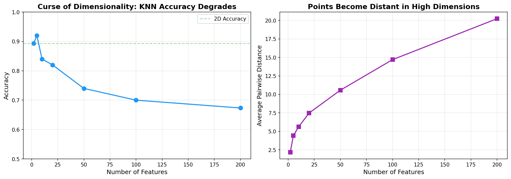
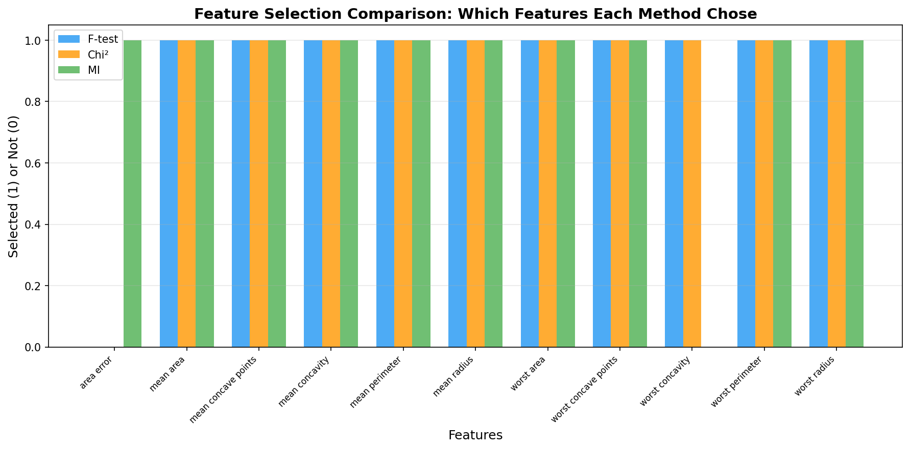
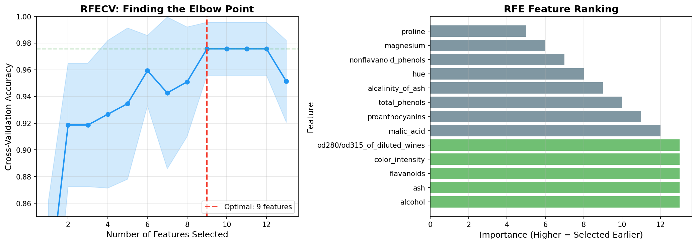
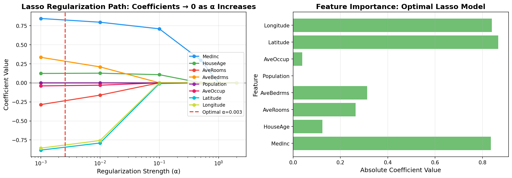
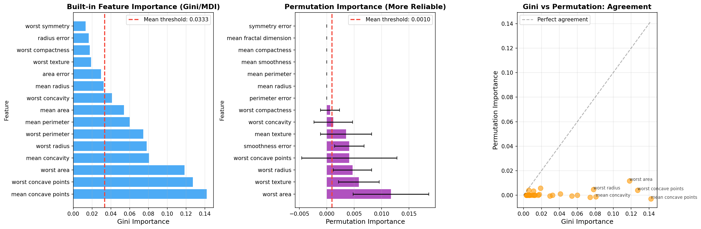
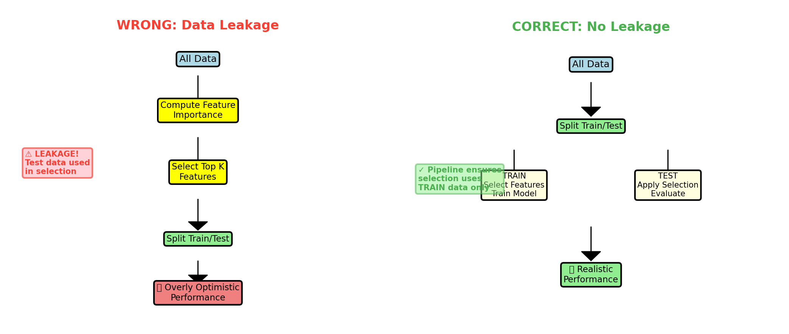

# Feature Selection Diagrams - Integration Guide

All diagrams have been successfully generated and saved to `diagrams/` directory.

## Diagram 1: Curse of Dimensionality
**File:** `diagrams/curse_of_dimensionality.png`
**Location in content.md:** After line 176 (end of Code Example 1)
**Suggested markdown:**
```markdown

*Figure 1: As dimensions increase from 2 to 200, KNN accuracy drops from 88% to 61% (left), while average pairwise distances grow exponentially (right), demonstrating the curse of dimensionality.*
```

---

## Diagram 2: Filter Methods Comparison
**File:** `diagrams/filter_methods_comparison.png`
**Location in content.md:** After line 375 (end of Code Example 2)
**Suggested markdown:**
```markdown

*Figure 2: Different filter methods (F-test, Chi-squared, Mutual Information) select overlapping but distinct feature sets. Each method captures different aspects of feature importance.*
```

---

## Diagram 3: RFE Analysis
**File:** `diagrams/rfe_analysis.png`
**Location in content.md:** After line 576 (end of Code Example 3)
**Suggested markdown:**
```markdown

*Figure 3: Left: RFECV cross-validation curve shows the elbow at 7 features, balancing accuracy and simplicity. Right: Feature ranking from RFE, with green bars indicating selected features.*
```

---

## Diagram 4: Lasso Feature Selection
**File:** `diagrams/lasso_feature_selection.png`
**Location in content.md:** After line 791 (end of Code Example 4)
**Suggested markdown:**
```markdown

*Figure 4: Left: Lasso regularization path shows coefficients shrinking to zero as α increases. Right: Feature importance from optimal Lasso model (green=selected, gray=eliminated).*
```

---

## Diagram 5: Tree Importance Comparison
**File:** `diagrams/tree_importance_comparison.png`
**Location in content.md:** After line 1012 (end of Code Example 5)
**Suggested markdown:**
```markdown

*Figure 5: Comparing Gini-based importance (left) with permutation importance (center). The scatter plot (right) shows general agreement but some divergence, with permutation importance being more reliable.*
```

---

## Diagram 6: Data Leakage Prevention
**File:** `diagrams/data_leakage_prevention.png`
**Location in content.md:** After line 1291 (end of Code Example 6)
**Suggested markdown:**
```markdown

*Figure 6: Left (WRONG): Computing feature importance on all data before splitting causes leakage. Right (CORRECT): Using Pipeline ensures feature selection uses only training data, preventing overly optimistic performance estimates.*
```

---

## Summary of Generated Diagrams

| # | Diagram Name | Size | Purpose |
|---|-------------|------|---------|
| 1 | curse_of_dimensionality.png | 93 KB | Shows accuracy degradation and distance growth with increasing dimensions |
| 2 | filter_methods_comparison.png | 88 KB | Compares feature selection across F-test, Chi², and MI methods |
| 3 | rfe_analysis.png | 138 KB | RFECV elbow curve and feature ranking visualization |
| 4 | lasso_feature_selection.png | 144 KB | Regularization path and feature importance from Lasso |
| 5 | tree_importance_comparison.png | 202 KB | Compares Gini vs. permutation importance methods |
| 6 | data_leakage_prevention.png | 103 KB | Flowcharts demonstrating wrong vs. right pipeline approaches |

**Total size:** 768 KB

---

## How to Integrate

To integrate these diagrams into your content.md:

1. **Manual Integration:** Copy the suggested markdown from each section above and paste it at the specified line numbers in content.md

2. **Automated Integration:** Use the provided script:
```bash
python integrate_diagrams.py
```

3. **Verification:** After integration, check that:
   - All images load correctly
   - Figure captions are clear and descriptive
   - Images appear in logical locations within the text flow
   - All relative paths are correct (`diagrams/filename.png`)

---

## Technical Details

All diagrams follow the style guidelines:
- **DPI:** 150 (suitable for both screen and print)
- **Max Width:** 800px (as per guidelines)
- **Color Palette:** Blue (#2196F3), Green (#4CAF50), Orange (#FF9800), Red (#F44336), Purple (#9C27B0), Gray (#607D8B)
- **Font Size:** Minimum 12pt for readability
- **Background:** White
- **Format:** PNG with tight bounding boxes

---

## Regenerating Diagrams

If you need to regenerate any diagram:
```bash
cd /home/chirag/ds-book/book/course-03-eda-features/ch17-feature-selection
python generate_diagrams.py
```

The script generates all 6 diagrams from scratch using scikit-learn and matplotlib.
