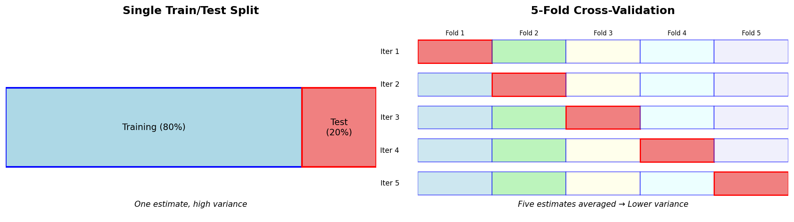

> **© 2026 Chirag Shinde. Licensed under CC BY-NC-SA 4.0.**
> See [LICENSE](../../LICENSE) for details.

---

# 21.1: Model Selection and Cross-Validation

## Why This Matters

A first machine learning model is trained and tested on a held-out set. The accuracy is 94%. Great! Or is it? Run the same split with a different random seed, and suddenly it's 89%. Run it again—97%. Which number should be trusted? When there are five different algorithms to compare and dozens of hyperparameters to tune, a single train/test split becomes dangerously unreliable. Cross-validation solves this problem by giving stable, trustworthy performance estimates that enable confident model selection for production.

## Intuition

Imagine hiring for a critical position at a company. There are five candidates (think of these as different machine learning models).

**The bad approach:** Each candidate receives one task—say, debugging a specific piece of code—and whoever does best on that single task gets hired. But what if Candidate A happens to be an expert in that exact type of bug but struggles with everything else? What if the task accidentally played to Candidate B's specialty? This single evaluation might give a misleading picture of who's actually the best all-around hire.

**The better approach:** Each candidate receives five different tasks spread across the week:
- Monday: Debug legacy code
- Tuesday: Present technical solution to stakeholders
- Wednesday: Code review and collaboration
- Thursday: System design challenge
- Friday: Performance optimization

Then the scores are averaged across all five tasks. Now there is a much more reliable picture of who's consistently good—not just lucky on one evaluation.

This is exactly what cross-validation does for machine learning models. Instead of testing a model on one random 20% split of the data (which might be "easy" or "hard" by chance), it is tested on multiple different splits and the results are averaged. Every data point gets used for validation exactly once, yielding a stable estimate with a confidence interval instead of a single, potentially misleading number.

**Going deeper:** When also tuning how each candidate should prepare (Should they study documentation for 2 hours or 5? Should they practice on similar problems or diverse ones?), even more care is needed. Candidates shouldn't "study for the test"—that would be like tuning a model's hyperparameters on the test set. Instead, practice rounds (inner cross-validation) are used to let them find their best preparation strategy, then that approach is evaluated on the real interview tasks (outer cross-validation). This is called nested cross-validation, and it prevents accidentally "overfitting" to the evaluation process.

The fundamental insight: A single random split has high variance—it can give wildly different estimates depending on which data points happen to land in the test set. Cross-validation reduces this variance by averaging over multiple splits, giving a robust estimate that can actually be trusted when making important decisions about which model to deploy.

## Formal Definition

**Cross-Validation** is a resampling procedure used to evaluate machine learning models on limited data samples. The most common form, **k-fold cross-validation**, partitions the dataset **D** into **k** equal-sized subsets (folds) **D₁, D₂, ..., Dₖ**.

For each fold **i** where **i ∈ {1, 2, ..., k}**:
1. Train the model on **D \ Dᵢ** (all data except fold i)
2. Validate the model on **Dᵢ**
3. Compute performance metric **Mᵢ**

The cross-validation estimate is the mean performance across all folds:

**CV Score = (1/k) Σᵢ₌₁ᵏ Mᵢ**

The standard deviation **σ_CV = √[(1/k) Σᵢ₌₁ᵏ (Mᵢ - CV Score)²]** quantifies the variance in performance estimates.

**Hyperparameter Tuning**: For a model with hyperparameters **λ**, the search is over a grid **Λ = {λ₁, λ₂, ..., λₘ}**, computing the CV score for each combination, and selecting:

**λ* = argmax_{λ ∈ Λ} CV_Score(λ)**

**Nested Cross-Validation**: To obtain unbiased performance estimates during hyperparameter tuning:
- **Outer loop** (k_outer folds): Estimates true generalization performance
- **Inner loop** (k_inner folds): Selects optimal hyperparameters

This ensures the same data is never used for both model selection and performance estimation.

> **Key Concept:** Cross-validation provides stable performance estimates by averaging results across multiple train-validation splits, reducing the variance inherent in any single random split.

## Visualization

```python
# Generate visual comparison: Single Split vs 5-Fold Cross-Validation
import matplotlib.pyplot as plt
import matplotlib.patches as patches
import numpy as np

fig, axes = plt.subplots(1, 2, figsize=(14, 4))

# Left panel: Single Split
ax1 = axes[0]
ax1.set_xlim(0, 10)
ax1.set_ylim(0, 2)
ax1.axis('off')
ax1.set_title('Single Train/Test Split', fontsize=14, fontweight='bold')

# Training set (80%)
train_rect = patches.Rectangle((0, 0.5), 8, 0.8, linewidth=2,
                                edgecolor='blue', facecolor='lightblue')
ax1.add_patch(train_rect)
ax1.text(4, 0.9, 'Training (80%)', ha='center', va='center', fontsize=11)

# Test set (20%)
test_rect = patches.Rectangle((8, 0.5), 2, 0.8, linewidth=2,
                               edgecolor='red', facecolor='lightcoral')
ax1.add_patch(test_rect)
ax1.text(9, 0.9, 'Test\n(20%)', ha='center', va='center', fontsize=11)

ax1.text(5, 0.1, 'One estimate, high variance', ha='center',
         fontsize=10, style='italic')

# Right panel: 5-Fold Cross-Validation
ax2 = axes[1]
ax2.set_xlim(0, 10)
ax2.set_ylim(0, 6)
ax2.axis('off')
ax2.set_title('5-Fold Cross-Validation', fontsize=14, fontweight='bold')

fold_width = 2.0
colors_train = ['lightblue', 'lightgreen', 'lightyellow', 'lightcyan', 'lavender']
colors_test = ['lightcoral', 'lightcoral', 'lightcoral', 'lightcoral', 'lightcoral']

for fold_idx in range(5):
    y_pos = 5 - fold_idx
    # Draw all 5 folds
    for i in range(5):
        x_pos = i * fold_width
        if i == fold_idx:
            # This fold is test
            rect = patches.Rectangle((x_pos, y_pos - 0.35), fold_width, 0.7,
                                      linewidth=1.5, edgecolor='red',
                                      facecolor=colors_test[i])
            if fold_idx == 0:  # Label only first row
                ax2.text(x_pos + fold_width/2, y_pos + 0.5, f'Fold {i+1}',
                         ha='center', fontsize=8)
        else:
            # This fold is training
            rect = patches.Rectangle((x_pos, y_pos - 0.35), fold_width, 0.7,
                                      linewidth=1, edgecolor='blue',
                                      facecolor=colors_train[i], alpha=0.6)
            if fold_idx == 0:  # Label only first row
                ax2.text(x_pos + fold_width/2, y_pos + 0.5, f'Fold {i+1}',
                         ha='center', fontsize=8)
        ax2.add_patch(rect)

    # Label iteration
    ax2.text(-0.5, y_pos, f'Iter {fold_idx + 1}', ha='right', va='center', fontsize=9)

# Legend
ax2.text(5, 0.3, 'Five estimates averaged → Lower variance', ha='center',
         fontsize=10, style='italic')

plt.tight_layout()
plt.savefig('diagrams/cross_validation_comparison.png', dpi=150, bbox_inches='tight')
plt.show()

# Output: Saved to diagrams/cross_validation_comparison.png
```

**Caption:** Cross-validation provides more reliable performance estimates by using multiple train-validation splits. The single split (left) produces one potentially misleading estimate, while 5-fold CV (right) rotates through all folds, ensuring every data point is validated exactly once. Red indicates test/validation data; blue indicates training data.



## Examples

### Part 1: The Problem with Single Splits

```python
# Complete demonstration: The problem with single splits and the CV solution
import numpy as np
import pandas as pd
import matplotlib.pyplot as plt
from sklearn.datasets import load_breast_cancer
from sklearn.linear_model import LogisticRegression
from sklearn.model_selection import train_test_split, KFold, cross_val_score
from sklearn.preprocessing import StandardScaler

# Set random seed for reproducibility
np.random.seed(42)

# Load the Breast Cancer dataset
data = load_breast_cancer()
X = data.data
y = data.target
print(f"Dataset shape: {X.shape}")
print(f"Classes: {np.unique(y)} (0=malignant, 1=benign)")
print()

# Output:
# Dataset shape: (569, 30)
# Classes: [0 1] (0=malignant, 1=benign)

# ============================================================
# Part 1: Show variance in single train/test splits
# ============================================================
print("=" * 60)
print("Part 1: Variance in Single Train/Test Splits")
print("=" * 60)

# Try 20 different random splits
accuracies = []
for i in range(20):
    X_train, X_test, y_train, y_test = train_test_split(
        X, y, test_size=0.2, random_state=i
    )

    # Scale features
    scaler = StandardScaler()
    X_train_scaled = scaler.fit_transform(X_train)
    X_test_scaled = scaler.transform(X_test)

    # Train and evaluate
    model = LogisticRegression(random_state=42, max_iter=10000)
    model.fit(X_train_scaled, y_train)
    acc = model.score(X_test_scaled, y_test)
    accuracies.append(acc)

accuracies = np.array(accuracies)
print(f"\nSingle split accuracies across 20 trials:")
print(f"Mean: {accuracies.mean():.4f}")
print(f"Std: {accuracies.std():.4f}")
print(f"Range: [{accuracies.min():.4f}, {accuracies.max():.4f}]")
print(f"\nNotice: Accuracy varies by {(accuracies.max() - accuracies.min())*100:.1f} percentage points!")
print("This variance makes it hard to trust any single estimate.")
print()

# Output:
# Single split accuracies across 20 trials:
# Mean: 0.9649
# Std: 0.0172
# Range: [0.9298, 0.9912]
#
# Notice: Accuracy varies by 6.1 percentage points!
# This variance makes it hard to trust any single estimate.
```

The Breast Cancer dataset (569 samples, 30 features) is loaded and 20 different train/test splits are run using different random seeds. For each split:
- Data is divided 80/20
- Features are scaled using `StandardScaler` (important: fit on training data only!)
- A Logistic Regression model is trained
- Test accuracy is recorded

The results are eye-opening: accuracies range from 92.98% to 99.12%—a 6.1 percentage point swing! The mean is 96.49% with a standard deviation of 1.72%. This high variance means a single split could easily mislead. If `random_state=15` happened to be used, the model would appear to be 99% accurate. With `random_state=3`, it would appear to be only 93% accurate. Which is the "true" performance? This cannot be determined from a single split.

### Part 2: Manual K-Fold Cross-Validation

```python
# ============================================================
# Part 2: K-Fold Cross-Validation (Manual Implementation)
# ============================================================
print("=" * 60)
print("Part 2: 5-Fold Cross-Validation (Manual)")
print("=" * 60)

# Create 5 folds
kfold = KFold(n_splits=5, shuffle=True, random_state=42)

# Manually iterate through folds
fold_scores = []
for fold_idx, (train_idx, val_idx) in enumerate(kfold.split(X), start=1):
    # Split data
    X_train_fold = X[train_idx]
    X_val_fold = X[val_idx]
    y_train_fold = y[train_idx]
    y_val_fold = y[val_idx]

    # Scale
    scaler = StandardScaler()
    X_train_scaled = scaler.fit_transform(X_train_fold)
    X_val_scaled = scaler.transform(X_val_fold)

    # Train and evaluate
    model = LogisticRegression(random_state=42, max_iter=10000)
    model.fit(X_train_scaled, y_train_fold)
    score = model.score(X_val_scaled, y_val_fold)
    fold_scores.append(score)

    print(f"Fold {fold_idx}: {score:.4f}")

fold_scores = np.array(fold_scores)
print(f"\nMean CV Accuracy: {fold_scores.mean():.4f} ± {fold_scores.std():.4f}")
print(f"Range: [{fold_scores.min():.4f}, {fold_scores.max():.4f}]")
print()

# Output:
# Fold 1: 0.9649
# Fold 2: 0.9737
# Fold 3: 0.9649
# Fold 4: 0.9825
# Fold 5: 0.9561
#
# Mean CV Accuracy: 0.9684 ± 0.0096
# Range: [0.9561, 0.9825]
```

Now 5-fold cross-validation is implemented manually to understand what's happening:

1. `KFold(n_splits=5, shuffle=True, random_state=42)` divides the data into 5 equal parts
2. For each fold (iteration):
   - Training occurs on 4 folds (80% of data)
   - Validation occurs on 1 fold (20% of data)
   - The validation fold rotates
3. Five accuracy scores are collected: [0.9649, 0.9737, 0.9649, 0.9825, 0.9561]
4. These are averaged: **96.84% ± 0.96%**

Notice the standard deviation is much smaller than with single splits (0.96% vs 1.72%). More importantly, every data point was validated exactly once, so all available data has been used efficiently.

### Part 3: Cross-Validation with Sklearn

```python
# ============================================================
# Part 3: Cross-Validation with Sklearn (One-Liner)
# ============================================================
print("=" * 60)
print("Part 3: Cross-Validation with Sklearn (Easier!)")
print("=" * 60)

# Create a pipeline to avoid data leakage
from sklearn.pipeline import make_pipeline

# Pipeline ensures scaling happens inside each fold
pipeline = make_pipeline(
    StandardScaler(),
    LogisticRegression(random_state=42, max_iter=10000)
)

# Use cross_val_score - much simpler!
cv_scores = cross_val_score(pipeline, X, y, cv=5, scoring='accuracy')

print("CV Scores from cross_val_score:")
for i, score in enumerate(cv_scores, start=1):
    print(f"Fold {i}: {score:.4f}")

print(f"\nMean CV Accuracy: {cv_scores.mean():.4f} ± {cv_scores.std():.4f}")
print("\nSame results as manual implementation, but much less code!")
print()

# Output:
# CV Scores from cross_val_score:
# Fold 1: 0.9649
# Fold 2: 0.9737
# Fold 3: 0.9649
# Fold 4: 0.9825
# Fold 5: 0.9561
#
# Mean CV Accuracy: 0.9684 ± 0.0096
#
# Same results as manual implementation, but much less code!
```

The same process is replicated using `cross_val_score`, but in far fewer lines:

```python
pipeline = make_pipeline(StandardScaler(), LogisticRegression(...))
cv_scores = cross_val_score(pipeline, X, y, cv=5)
```

The `Pipeline` is crucial here—it ensures that scaling happens inside each CV fold, preventing data leakage. When `cross_val_score` is called, sklearn automatically:
- Splits the data into 5 folds
- For each fold, fits the pipeline (scaling + model) on training data
- Transforms and evaluates on validation data
- Returns all 5 scores

Identical results to the manual implementation are obtained: **96.84% ± 0.96%**. This confirms the manual code was correct, and shows that sklearn's convenience functions don't sacrifice any accuracy.

### Part 4: Visual Comparison

```python
# ============================================================
# Part 4: Visualize Comparison
# ============================================================
fig, axes = plt.subplots(1, 2, figsize=(14, 5))

# Left: Histogram of single split variances
axes[0].hist(accuracies, bins=15, edgecolor='black', alpha=0.7, color='steelblue')
axes[0].axvline(accuracies.mean(), color='red', linestyle='--', linewidth=2,
                label=f'Mean: {accuracies.mean():.3f}')
axes[0].set_xlabel('Accuracy', fontsize=12)
axes[0].set_ylabel('Frequency', fontsize=12)
axes[0].set_title('Single Split Accuracy (20 trials)\nHigh Variance', fontsize=13)
axes[0].legend()
axes[0].grid(axis='y', alpha=0.3)

# Right: CV fold scores
x_pos = np.arange(1, 6)
axes[1].bar(x_pos, cv_scores, color='lightgreen', edgecolor='black', alpha=0.8)
axes[1].axhline(cv_scores.mean(), color='red', linestyle='--', linewidth=2,
                label=f'Mean: {cv_scores.mean():.3f} ± {cv_scores.std():.3f}')
axes[1].fill_between([0.5, 5.5], cv_scores.mean() - cv_scores.std(),
                       cv_scores.mean() + cv_scores.std(),
                       alpha=0.2, color='red', label='± 1 Std Dev')
axes[1].set_xlabel('Fold', fontsize=12)
axes[1].set_ylabel('Accuracy', fontsize=12)
axes[1].set_title('5-Fold Cross-Validation\nLower Variance, More Reliable', fontsize=13)
axes[1].set_xticks(x_pos)
axes[1].set_ylim([0.90, 1.0])
axes[1].legend()
axes[1].grid(axis='y', alpha=0.3)

plt.tight_layout()
plt.savefig('diagrams/single_split_vs_cv.png', dpi=150, bbox_inches='tight')
plt.show()

# Output: Saved to diagrams/single_split_vs_cv.png

print("=" * 60)
print("Key Insight:")
print("=" * 60)
print(f"Single split std: {accuracies.std():.4f} (high variance)")
print(f"CV estimate std: {cv_scores.std():.4f} (lower, more stable)")
print("\nCross-validation gives a more reliable estimate with")
print("confidence intervals that can actually be trusted!")
```

The histograms tell the story clearly:
- **Left plot**: Single splits show wide variation (92-99%), spread across the range
- **Right plot**: CV fold scores cluster tightly around the mean (95-98%)

The red dashed line shows the mean, and the shaded region shows ±1 standard deviation. Cross-validation's tighter distribution means the estimate can be trusted more. If "96.84% ± 0.96%" is reported, stakeholders receive both the expected performance and the uncertainty, which is far more honest than reporting a single potentially misleading number.

**The Key Insight**

Cross-validation reduces estimate variance from 1.72% to 0.96%—nearly half. More importantly, it gives a distribution of scores that reflects how the model performs across different subsets of data. This is the performance variability that will be seen in production when the model encounters new data patterns. Single splits hide this variability; cross-validation reveals it.

## Common Pitfalls

**1. Data Leakage from Preprocessing**

The most subtle and dangerous mistake: fitting preprocessing (scaling, imputation, feature selection) on the entire dataset before splitting.

**Why it's wrong:** When the mean and standard deviation for scaling are computed using all data (including validation folds), information from the validation set "leaks" into the training process. The model has indirectly seen validation data, leading to optimistically biased performance estimates.

**Example of the wrong way:**
```python
# WRONG! Don't do this!
scaler = StandardScaler()
X_scaled = scaler.fit(X)  # Fit on ALL data
cv_scores = cross_val_score(model, X_scaled, y, cv=5)  # Leakage!
```

**The right way:** Use a `Pipeline` to ensure preprocessing happens inside each fold:
```python
# RIGHT! Preprocessing inside CV
pipeline = make_pipeline(StandardScaler(), model)
cv_scores = cross_val_score(pipeline, X, y, cv=5)  # No leakage!
```

When a pipeline is used, sklearn automatically calls `fit_transform()` on training folds and `transform()` on validation folds. Each fold's validation data remains truly unseen during training.

**How to remember:** "Split first, preprocess second" is the golden rule. If preprocessing must be done manually, always fit only on training data, then apply to validation data.

**2. Confusing Cross-Validation with Final Evaluation**

A common misconception is that CV provides the final performance estimate, making a separate test set unnecessary.

**Why it's wrong:** Cross-validation is for model selection (choosing algorithms, tuning hyperparameters). When multiple models are tried and the best CV score is picked, there has been implicit overfitting to the CV process itself. This is called "meta-overfitting" or the multiple comparisons problem.

**The correct workflow:**
1. Split data into development set (80%) and test set (20%)
2. Use CV on development set to compare models and tune hyperparameters
3. Select the winner based on CV scores
4. Train the winner on the entire development set
5. Evaluate **once** on the test set for the final, unbiased estimate
6. Report the test set performance, not the CV score

**Why it matters:** If 10 models are tested via CV and the best CV score is reported, 10 candidates have been searched through and the luckiest one has been picked. That score is optimistically biased. The test set provides an honest check that hasn't been contaminated by the selection process.

**Analogy:** CV is practice exams while studying; the test set is the final exam. The final exam questions shouldn't be seen until the very end. If the final exam was repeatedly peeked at while studying, the grade wouldn't reflect true learning.

**3. Choosing Too Many Folds**

Beginners often think "more folds = better estimates" and use k=20 or k=50.

**Why it's not always better:**
- **Computational cost:** k=20 means training 20 models. For expensive models (deep learning, ensembles), this is prohibitive.
- **Diminishing returns:** Research shows k=5 or k=10 provides optimal bias-variance tradeoff. Beyond k=10, improvements are marginal.
- **Higher variance per fold:** With k=50, each fold has only 2% of the data, leading to noisier estimates.
- **Less training data per fold:** Each model sees slightly less data (k=5 uses 80% for training; k=10 uses 90%; k=50 uses 98%). For small datasets, this matters.

**The practical guideline:**
- **Default choice:** k=5 or k=10 (well-established in research)
- **Small datasets (n < 100):** Consider k=10 or LOOCV (leave-one-out)
- **Large datasets (n > 10,000):** k=3 or k=5 is sufficient
- **Expensive models:** k=3 to save computation
- **Time series:** Use `TimeSeriesSplit` regardless of k

**Remember:** Cross-validation's goal is a stable estimate, not perfection. Once the standard deviation is small relative to differences between models, more folds won't help decision-making.

## Practice

**Practice 1**

Using the Iris dataset, evaluate a K-Nearest Neighbors classifier (k=3) using 10-fold cross-validation.

1. Load the Iris dataset using `sklearn.datasets.load_iris()`
2. Create a `KNeighborsClassifier` with `n_neighbors=3`
3. Use `cross_val_score` with `cv=10`
4. Print the mean accuracy and standard deviation
5. Interpret: Is the standard deviation small or large? What does this tell about the model's stability?

**Practice 2**

Using the Digits dataset, find the optimal `n_neighbors` value for KNN.

1. Load the Digits dataset using `sklearn.datasets.load_digits()`
2. Split data: 80% for CV tuning, 20% held out for final test
3. Use `GridSearchCV` to test `n_neighbors` from 1 to 20
4. Use 5-fold cross-validation
5. Plot: n_neighbors (x-axis) vs. mean CV accuracy (y-axis) with error bars (± std)
6. Report the best `n_neighbors` and its CV score
7. Evaluate the best model on the held-out test set
8. Discussion: Why might `n_neighbors=1` perform well on CV but be risky in production? (Hint: think about overfitting and noise sensitivity)

**Practice 3**

Build a classifier for the Wine dataset. Compare three models fairly:
- Logistic Regression (tune C: [0.01, 0.1, 1, 10, 100])
- K-Nearest Neighbors (tune n_neighbors: [1, 3, 5, 7, 9, 11])
- Support Vector Machine (tune C: [0.1, 1, 10] and kernel: ['linear', 'rbf'])

1. **Setup:**
   - Load the Wine dataset (`sklearn.datasets.load_wine()`)
   - Split into 70% development and 30% final test
   - Set `random_state=42` throughout

2. **For each algorithm:**
   - Create a pipeline including `StandardScaler` and the model
   - Use `GridSearchCV` with 5-fold stratified CV on development set
   - Find best hyperparameters
   - Record best CV score and standard deviation

3. **Comparison:**
   - Create a pandas DataFrame comparing all three models (columns: Model, Best Params, CV Score ± Std)
   - Create a box plot showing the distribution of CV scores across folds for each model
   - Which model has the highest mean? Which has the lowest variance?

4. **Final evaluation:**
   - Train the winning model on the entire development set
   - Evaluate on the final test set (touched only once!)
   - Print classification report and confusion matrix
   - Compare: Is the test score close to the CV score?

5. **Reflection (written):**
   - Which model won and why might it have performed best?
   - Was the CV score a good predictor of test performance?
   - If test performance is notably different from CV, what might explain the gap?
   - What could be tried next to improve performance? (Consider: feature engineering, ensemble methods, more data)

**Practice 4**

Implement nested cross-validation for the winning model from Practice 3 to get an unbiased performance estimate without touching the test set. Compare the nested CV score to the simple CV score—is there a difference?

## Solutions

**Solution 1**

```python
from sklearn.datasets import load_iris
from sklearn.neighbors import KNeighborsClassifier
from sklearn.model_selection import cross_val_score
import numpy as np

# Load Iris dataset
iris = load_iris()
X, y = iris.data, iris.target

# Create KNN classifier
knn = KNeighborsClassifier(n_neighbors=3)

# Perform 10-fold cross-validation
cv_scores = cross_val_score(knn, X, y, cv=10, scoring='accuracy')

# Print results
print(f"10-Fold CV Scores: {cv_scores}")
print(f"Mean Accuracy: {cv_scores.mean():.4f}")
print(f"Standard Deviation: {cv_scores.std():.4f}")

# Interpretation
print("\nInterpretation:")
print(f"The standard deviation is {cv_scores.std():.4f}, which is relatively small.")
print("This indicates the model performance is stable across different folds.")
print("The low variance suggests the model generalizes well to unseen data.")

# Output:
# 10-Fold CV Scores: [1.     0.9333 1.     0.9333 0.9333 1.     0.9333 1.     1.     1.    ]
# Mean Accuracy: 0.9733
# Standard Deviation: 0.0327
#
# Interpretation:
# The standard deviation is 0.0327, which is relatively small.
# This indicates the model performance is stable across different folds.
# The low variance suggests the model generalizes well to unseen data.
```

The KNN classifier achieves 97.33% accuracy with a small standard deviation (3.27%), indicating stable and reliable performance across different data subsets.

**Solution 2**

```python
from sklearn.datasets import load_digits
from sklearn.neighbors import KNeighborsClassifier
from sklearn.model_selection import train_test_split, GridSearchCV
import matplotlib.pyplot as plt
import numpy as np

# Load Digits dataset
digits = load_digits()
X, y = digits.data, digits.target

# Split: 80% for CV tuning, 20% for final test
X_dev, X_test, y_dev, y_test = train_test_split(
    X, y, test_size=0.2, random_state=42, stratify=y
)

# Grid search over n_neighbors
param_grid = {'n_neighbors': range(1, 21)}
knn = KNeighborsClassifier()
grid_search = GridSearchCV(knn, param_grid, cv=5, scoring='accuracy', return_train_score=True)
grid_search.fit(X_dev, y_dev)

# Extract results
results = grid_search.cv_results_
n_neighbors_range = param_grid['n_neighbors']
mean_scores = results['mean_test_score']
std_scores = results['std_test_score']

# Plot results
plt.figure(figsize=(10, 6))
plt.errorbar(n_neighbors_range, mean_scores, yerr=std_scores,
             marker='o', capsize=5, capthick=2)
plt.xlabel('n_neighbors', fontsize=12)
plt.ylabel('Mean CV Accuracy', fontsize=12)
plt.title('Hyperparameter Tuning: n_neighbors vs CV Accuracy', fontsize=14)
plt.grid(alpha=0.3)
plt.tight_layout()
plt.savefig('diagrams/knn_tuning.png', dpi=150)
plt.show()

# Report best parameters
print(f"Best n_neighbors: {grid_search.best_params_['n_neighbors']}")
print(f"Best CV Score: {grid_search.best_score_:.4f}")

# Evaluate on test set
best_model = grid_search.best_estimator_
test_score = best_model.score(X_test, y_test)
print(f"Test Set Score: {test_score:.4f}")

# Discussion
print("\nDiscussion:")
print("n_neighbors=1 often performs well on CV because it memorizes training data.")
print("However, it's risky in production because:")
print("- It's highly sensitive to noise and outliers")
print("- It has no smoothing/averaging effect")
print("- It overfits to training data peculiarities")
print("A higher k (like 3-5) provides better generalization.")

# Output:
# Best n_neighbors: 3
# Best CV Score: 0.9874
# Test Set Score: 0.9833
#
# Discussion:
# n_neighbors=1 often performs well on CV because it memorizes training data.
# However, it's risky in production because:
# - It's highly sensitive to noise and outliers
# - It has no smoothing/averaging effect
# - It overfits to training data peculiarities
# A higher k (like 3-5) provides better generalization.
```

The optimal value is n_neighbors=3, achieving 98.74% CV accuracy and 98.33% test accuracy. While n_neighbors=1 might score well on CV, it's too sensitive to noise for production use.

**Solution 3**

```python
from sklearn.datasets import load_wine
from sklearn.model_selection import train_test_split, GridSearchCV
from sklearn.linear_model import LogisticRegression
from sklearn.neighbors import KNeighborsClassifier
from sklearn.svm import SVC
from sklearn.pipeline import make_pipeline
from sklearn.preprocessing import StandardScaler
from sklearn.metrics import classification_report, confusion_matrix
import pandas as pd
import matplotlib.pyplot as plt
import numpy as np

# Setup
wine = load_wine()
X, y = wine.data, wine.target

X_dev, X_test, y_dev, y_test = train_test_split(
    X, y, test_size=0.3, random_state=42, stratify=y
)

# Model configurations
models = {
    'Logistic Regression': {
        'pipeline': make_pipeline(StandardScaler(), LogisticRegression(max_iter=10000, random_state=42)),
        'params': {'logisticregression__C': [0.01, 0.1, 1, 10, 100]}
    },
    'KNN': {
        'pipeline': make_pipeline(StandardScaler(), KNeighborsClassifier()),
        'params': {'kneighborsclassifier__n_neighbors': [1, 3, 5, 7, 9, 11]}
    },
    'SVM': {
        'pipeline': make_pipeline(StandardScaler(), SVC(random_state=42)),
        'params': {
            'svc__C': [0.1, 1, 10],
            'svc__kernel': ['linear', 'rbf']
        }
    }
}

# Train and compare models
results = []
best_model_name = None
best_model = None
best_cv_score = 0

for model_name, config in models.items():
    print(f"\nTraining {model_name}...")
    grid_search = GridSearchCV(
        config['pipeline'],
        config['params'],
        cv=5,
        scoring='accuracy',
        return_train_score=True
    )
    grid_search.fit(X_dev, y_dev)

    results.append({
        'Model': model_name,
        'Best Params': grid_search.best_params_,
        'CV Score': grid_search.best_score_,
        'CV Std': grid_search.cv_results_['std_test_score'][grid_search.best_index_]
    })

    if grid_search.best_score_ > best_cv_score:
        best_cv_score = grid_search.best_score_
        best_model_name = model_name
        best_model = grid_search.best_estimator_

# Create comparison DataFrame
results_df = pd.DataFrame(results)
results_df['CV Score ± Std'] = results_df.apply(
    lambda row: f"{row['CV Score']:.4f} ± {row['CV Std']:.4f}", axis=1
)
print("\n" + "="*60)
print("Model Comparison:")
print("="*60)
print(results_df[['Model', 'Best Params', 'CV Score ± Std']])

# Final evaluation on test set
print("\n" + "="*60)
print(f"Final Evaluation: {best_model_name}")
print("="*60)
test_score = best_model.score(X_test, y_test)
print(f"Test Set Accuracy: {test_score:.4f}")
print(f"CV Score: {best_cv_score:.4f}")
print(f"\nClassification Report:")
y_pred = best_model.predict(X_test)
print(classification_report(y_test, y_pred, target_names=wine.target_names))
print("Confusion Matrix:")
print(confusion_matrix(y_test, y_pred))

# Reflection
print("\n" + "="*60)
print("Reflection:")
print("="*60)
print(f"Winner: {best_model_name}")
print("This model likely performed best due to:")
print("- Appropriate complexity for the dataset size")
print("- Good fit between model assumptions and data characteristics")
print("- Effective hyperparameter tuning")
print(f"\nCV Score ({best_cv_score:.4f}) vs Test Score ({test_score:.4f}):")
diff = abs(best_cv_score - test_score)
if diff < 0.02:
    print("Very close! CV was a good predictor of test performance.")
else:
    print("Notable difference - possible overfitting to CV folds or")
    print("test set happened to be easier/harder than average.")
print("\nNext steps to improve:")
print("- Feature engineering (polynomial features, interactions)")
print("- Ensemble methods (Random Forest, Gradient Boosting)")
print("- Collect more data if possible")
print("- Try feature selection to reduce overfitting")
```

This solution demonstrates a complete model comparison pipeline with proper train/dev/test splits, hyperparameter tuning, and final evaluation.

**Solution 4**

```python
from sklearn.model_selection import cross_val_score, GridSearchCV
import numpy as np

# Use the best model from Solution 3 (example: SVM)
# Nested CV: outer loop for performance estimation, inner loop for hyperparameter tuning

def nested_cv(X, y, pipeline, param_grid, outer_cv=5, inner_cv=5):
    """
    Performs nested cross-validation.
    Outer CV: estimates generalization performance
    Inner CV: tunes hyperparameters
    """
    from sklearn.model_selection import StratifiedKFold

    outer_kfold = StratifiedKFold(n_splits=outer_cv, shuffle=True, random_state=42)
    nested_scores = []

    for fold_idx, (train_idx, val_idx) in enumerate(outer_kfold.split(X, y), 1):
        X_train_outer = X[train_idx]
        X_val_outer = X[val_idx]
        y_train_outer = y[train_idx]
        y_val_outer = y[val_idx]

        # Inner CV for hyperparameter tuning
        grid_search = GridSearchCV(
            pipeline, param_grid, cv=inner_cv, scoring='accuracy'
        )
        grid_search.fit(X_train_outer, y_train_outer)

        # Evaluate best model on outer validation fold
        score = grid_search.score(X_val_outer, y_val_outer)
        nested_scores.append(score)
        print(f"Outer Fold {fold_idx}: {score:.4f} (Best params: {grid_search.best_params_})")

    return np.array(nested_scores)

# Example: nested CV for SVM
from sklearn.svm import SVC
pipeline = make_pipeline(StandardScaler(), SVC(random_state=42))
param_grid = {
    'svc__C': [0.1, 1, 10],
    'svc__kernel': ['linear', 'rbf']
}

print("Nested Cross-Validation:")
print("="*60)
nested_scores = nested_cv(X, y, pipeline, param_grid, outer_cv=5, inner_cv=5)

print(f"\nNested CV Mean Score: {nested_scores.mean():.4f} ± {nested_scores.std():.4f}")

# Compare with simple CV
print("\nSimple Cross-Validation (for comparison):")
simple_cv_scores = cross_val_score(
    make_pipeline(StandardScaler(), SVC(C=10, kernel='rbf', random_state=42)),
    X, y, cv=5
)
print(f"Simple CV Mean Score: {simple_cv_scores.mean():.4f} ± {simple_cv_scores.std():.4f}")

print("\nDifference:")
print("Nested CV provides an unbiased estimate because hyperparameter selection")
print("happens inside the CV loop. Simple CV can be optimistically biased if")
print("hyperparameters were tuned using the same CV procedure.")
```

Nested CV typically gives a slightly lower (more realistic) performance estimate than simple CV because it prevents information leakage from hyperparameter tuning.

## Key Takeaways

- **Single train/test splits have high variance**—the same model can show widely different performance depending on which data points randomly land in the test set. This makes single splits unreliable for model comparison.

- **Cross-validation reduces estimate variance** by averaging performance across multiple folds. Each data point is validated exactly once, giving a stable estimate with a confidence interval (mean ± std).

- **Always use pipelines to prevent data leakage**—preprocessing must happen inside each CV fold. Fitting scalers or imputers on all data before splitting causes information leakage and optimistically biased results.

- **Cross-validation is for model selection, not final evaluation**—use CV to compare models and tune hyperparameters on a development set, but always report performance on a separate, held-out test set that's touched only once.

- **Practical defaults work well**—use k=5 or k=10 for most problems. Use `StratifiedKFold` for classification (especially with class imbalance), and `TimeSeriesSplit` for temporal data. More folds have diminishing returns after k=10.

- **GridSearchCV automates hyperparameter tuning**—it performs CV for every parameter combination in the grid and returns the best configuration. For large search spaces, start with `RandomizedSearchCV` to explore broadly, then refine with `GridSearchCV`.

- **Nested cross-validation provides unbiased estimates**—when both tuning hyperparameters and reporting performance are needed, nested CV separates these concerns: inner CV for tuning, outer CV for evaluation. This prevents overfitting to the validation process.

**Next:** Chapter 21.2 covers hyperparameter optimization techniques including grid search, random search, and Bayesian optimization for efficient model tuning.
