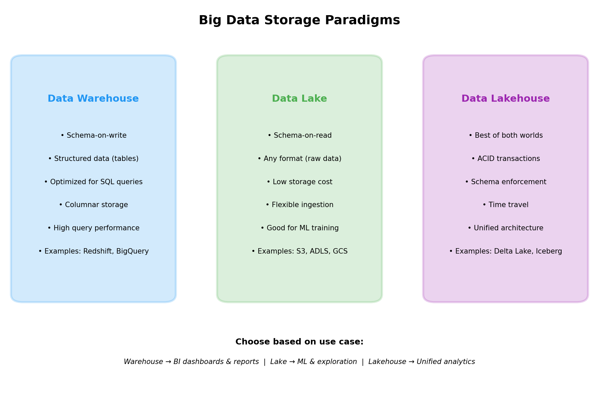
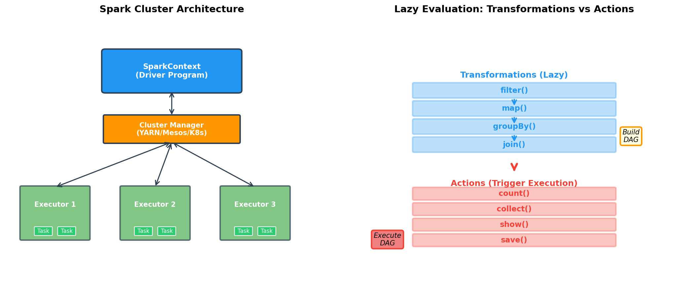
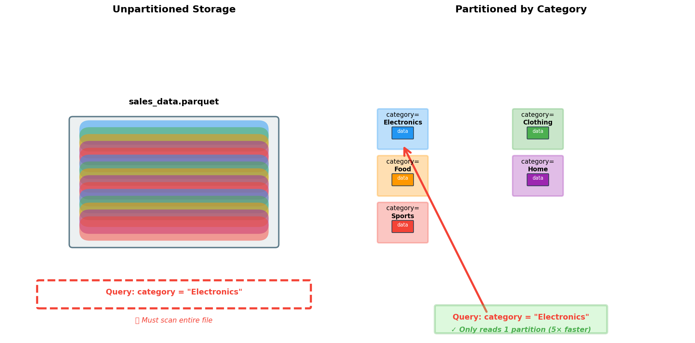
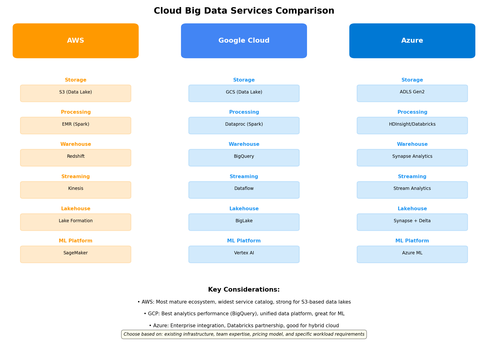

# Integration Instructions - Chapter 31 Diagrams

## Current Status

✅ **Generated**: 5 high-quality educational diagrams
✅ **Validated**: All PNG files are valid and properly formatted
⚠️ **Integration**: 1 of 5 diagrams already in content.md, 4 need to be added

## What Was Done

1. Read and analyzed content.md for diagram requirements
2. Generated 5 educational diagrams using matplotlib:
   - distributed_architecture.png (already referenced in content.md)
   - storage_paradigms.png (NEW)
   - spark_architecture.png (NEW)
   - partitioning_strategy.png (NEW)
   - cloud_services_comparison.png (NEW)
3. Created documentation and integration instructions

## What Needs to Be Done

### Add 4 New Diagrams to content.md

**Location**: After line 124, before the `## Examples` section

**Action**: Insert the following markdown text into content.md:

```markdown
### Storage Paradigms Comparison



The storage paradigm diagram compares the three major approaches to big data storage. Data warehouses optimize for structured analytics with schema-on-write, making them ideal for BI dashboards but less flexible for exploration. Data lakes store raw data in any format with schema-on-read, offering flexibility and low cost but lacking reliability features. Data lakehouses combine both approaches with ACID transactions, providing warehouse-like reliability on lake-scale data. The choice depends on use case: warehouses for known queries, lakes for ML and exploration, lakehouses for unified analytics.

### Spark Architecture and Lazy Evaluation



This diagram shows two critical aspects of Spark. The left panel illustrates the cluster architecture: the SparkContext (driver) communicates with a cluster manager (YARN, Mesos, or Kubernetes) which allocates executors across worker nodes. Each executor runs multiple tasks in parallel on its portion of the data. The right panel explains lazy evaluation: transformations (filter, map, groupBy, join) don't execute immediately—they build a DAG (directed acyclic graph) of operations. Only when an action (count, collect, show, save) is called does Spark optimize and execute the DAG. This enables powerful optimizations like predicate pushdown and avoiding unnecessary computations.

### Partitioning Strategy Visualization



This side-by-side comparison demonstrates the power of data partitioning. The left panel shows unpartitioned storage where a query for Electronics data must scan the entire file, reading all categories even though only one is needed. The right panel shows partitioned storage where data is organized into separate directories by category. When querying for Electronics, Spark only reads the relevant partition—a technique called partition pruning. This reduces I/O by 5× or more (depending on the number of categories), dramatically improving query performance. Proper partitioning by frequently-filtered columns is one of the most impactful optimizations in big data systems.

### Cloud Big Data Services



The cloud services comparison maps big data needs to specific offerings from AWS, GCP, and Azure. Each provider offers similar capabilities but with different strengths. AWS provides the most mature ecosystem with S3-based data lakes and EMR for Spark processing. GCP excels at analytics with BigQuery's serverless performance and unified data platform. Azure integrates well with enterprise Microsoft infrastructure and partners with Databricks for Spark workloads. The choice depends on existing infrastructure, team expertise, and specific workload requirements—all three platforms can handle production-scale big data workloads effectively.

```

## Exact Edit Command

If using the Edit tool, here's the exact change:

**File**: `content.md`
**Old string** (line 124):
```
This architecture enables horizontal scaling: adding more executors increases processing capacity proportionally.

## Examples
```

**New string**:
```
This architecture enables horizontal scaling: adding more executors increases processing capacity proportionally.

### Storage Paradigms Comparison


The storage paradigm diagram compares the three major approaches to big data storage. Data warehouses optimize for structured analytics with schema-on-write, making them ideal for BI dashboards but less flexible for exploration. Data lakes store raw data in any format with schema-on-read, offering flexibility and low cost but lacking reliability features. Data lakehouses combine both approaches with ACID transactions, providing warehouse-like reliability on lake-scale data. The choice depends on use case: warehouses for known queries, lakes for ML and exploration, lakehouses for unified analytics.

### Spark Architecture and Lazy Evaluation


This diagram shows two critical aspects of Spark. The left panel illustrates the cluster architecture: the SparkContext (driver) communicates with a cluster manager (YARN, Mesos, or Kubernetes) which allocates executors across worker nodes. Each executor runs multiple tasks in parallel on its portion of the data. The right panel explains lazy evaluation: transformations (filter, map, groupBy, join) don't execute immediately—they build a DAG (directed acyclic graph) of operations. Only when an action (count, collect, show, save) is called does Spark optimize and execute the DAG. This enables powerful optimizations like predicate pushdown and avoiding unnecessary computations.

### Partitioning Strategy Visualization


This side-by-side comparison demonstrates the power of data partitioning. The left panel shows unpartitioned storage where a query for Electronics data must scan the entire file, reading all categories even though only one is needed. The right panel shows partitioned storage where data is organized into separate directories by category. When querying for Electronics, Spark only reads the relevant partition—a technique called partition pruning. This reduces I/O by 5× or more (depending on the number of categories), dramatically improving query performance. Proper partitioning by frequently-filtered columns is one of the most impactful optimizations in big data systems.

### Cloud Big Data Services


The cloud services comparison maps big data needs to specific offerings from AWS, GCP, and Azure. Each provider offers similar capabilities but with different strengths. AWS provides the most mature ecosystem with S3-based data lakes and EMR for Spark processing. GCP excels at analytics with BigQuery's serverless performance and unified data platform. Azure integrates well with enterprise Microsoft infrastructure and partners with Databricks for Spark workloads. The choice depends on existing infrastructure, team expertise, and specific workload requirements—all three platforms can handle production-scale big data workloads effectively.

## Examples
```

## Verification Steps

After integration:
1. Check that all image references work: ``
2. Verify no markdown formatting issues
3. Ensure text flows naturally between sections
4. Confirm diagrams display at appropriate size

## Additional Resources

- **diagrams/README.md**: Detailed documentation for each diagram
- **diagrams/content_updates.md**: Alternative placement options
- **generate_diagrams.py**: Script to regenerate diagrams if needed
- **DIAGRAM_GENERATION_SUMMARY.md**: Complete project summary

## Quick Test

To verify diagrams work in markdown:
```bash
# Check image files exist
ls -lh diagrams/*.png

# Preview in markdown viewer (if available)
# or just open the PNG files directly to verify they render correctly
```

## Support

All diagrams follow the textbook style guidelines:
- Consistent color palette
- Clear labels and annotations
- Educational focus
- 150 DPI resolution
- White backgrounds for printing

If any adjustments are needed, modify `generate_diagrams.py` and re-run to regenerate all diagrams with updated styling.
