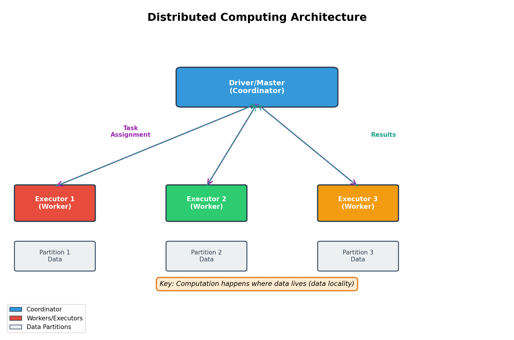

> **© 2026 Chirag Shinde. Licensed under CC BY-NC-SA 4.0.**
> See [LICENSE](../../LICENSE) for details.

---

# Chapter 31: Big Data Ecosystem

## Why This Matters

When Netflix processes over 500 billion events daily to personalize recommendations, or when Uber matches millions of riders with drivers in real-time, traditional data tools like pandas and SQLite simply cannot keep up. The Big Data Ecosystem represents a fundamental shift in how data is stored and processed—moving from single-machine tools to distributed systems that coordinate hundreds or thousands of computers working together. Understanding this ecosystem is essential for building production-scale data pipelines, training machine learning models on massive datasets, and architecting systems that power modern applications.

## Intuition

Imagine organizing a small local library with 5,000 books. One librarian can manage everything—they know where each book is located, can find any title quickly, and handle all checkouts efficiently. This is like working with pandas on a laptop with 10 GB of data.

Now imagine Amazon's massive warehouse with millions of items spread across a football-field-sized building. One person cannot possibly manage this alone. Instead, there's a sophisticated system: a manager coordinates teams of workers, each team handles a specific section of the warehouse, and when someone orders multiple items, different teams work in parallel to gather them. The manager tracks what's where, assigns tasks efficiently, and ensures everything runs smoothly even if a worker calls in sick.

Distributed computing follows the same principle. When data grows too large for one machine's memory (often around 100 GB), it must be split across multiple computers (a cluster). A coordinator (driver or master) divides the work into tasks and assigns them to workers (executors). Each worker processes its portion of data independently, and the coordinator combines the results. The key insight: work happens where data lives to minimize expensive data transfers across the network.

This paradigm shift—from single-machine to distributed systems—requires new tools and patterns. Hadoop pioneered distributed storage (HDFS) and processing (MapReduce) in the mid-2000s. Apache Spark improved on this foundation with in-memory computing, making distributed processing 10-100× faster. Modern cloud platforms (AWS, GCP, Azure) now offer managed versions of these tools, allowing teams to focus on data problems rather than infrastructure management.

The Big Data Ecosystem also includes different storage architectures: data warehouses optimize for fast SQL queries on structured data, data lakes store raw data in any format cheaply, and the emerging data lakehouse pattern combines both benefits. Understanding when to use each—and which cloud services map to which needs—determines success in building scalable data systems.

## Formal Definition

The **Big Data Ecosystem** comprises distributed computing frameworks, storage systems, and cloud services designed to handle datasets that exceed single-machine capacity (typically >100 GB). Key components:

**Distributed Computing**: A cluster of `m` machines processes data partitioned into `k` chunks. Let `D = {D₁, D₂, ..., Dₖ}` represent data partitions distributed across cluster nodes. A driver coordinates task execution on executors, where each executor processes subset `Dᵢ` in parallel. Total processing time approaches `T_sequential / m` for embarrassingly parallel operations (assuming negligible coordination overhead).

**Apache Spark**: A unified analytics engine using Resilient Distributed Datasets (RDDs). An RDD is a fault-tolerant collection of elements partitioned across cluster nodes. Operations include:
- **Transformations** (lazy): `map`, `filter`, `groupBy`, `join` → build execution DAG
- **Actions** (eager): `count`, `collect`, `save` → trigger computation

**HDFS (Hadoop Distributed File System)**: Stores files as blocks (default 128 MB) replicated across DataNodes (typically 3×). A NameNode maintains metadata mapping files to block locations. For file `F` of size `S`, number of blocks `b = ⌈S / block_size⌉`.

**Storage Paradigms**:
- **Data Warehouse**: Schema-on-write, optimized for SQL queries (OLAP), columnar storage
- **Data Lake**: Schema-on-read, stores raw data in object storage (S3, GCS)
- **Data Lakehouse**: Combines lake flexibility with warehouse reliability via ACID transaction layers (Delta Lake, Iceberg, Hudi)

> **Key Concept:** Distributed systems divide data across machines and bring computation to data, rather than moving large datasets to a single processing location.

## Visualization

```python
# Distributed Computing Architecture Diagram
import matplotlib.pyplot as plt
import matplotlib.patches as mpatches
from matplotlib.patches import FancyBboxPatch, FancyArrowPatch
import numpy as np

fig, ax = plt.subplots(1, 1, figsize=(12, 8))
ax.set_xlim(0, 10)
ax.set_ylim(0, 10)
ax.axis('off')

# Title
ax.text(5, 9.5, 'Distributed Computing Architecture',
        fontsize=16, fontweight='bold', ha='center')

# Driver/Master Node
driver = FancyBboxPatch((3.5, 7), 3, 1,
                         boxstyle="round,pad=0.1",
                         edgecolor='#2C3E50', facecolor='#3498DB', linewidth=2)
ax.add_patch(driver)
ax.text(5, 7.5, 'Driver/Master\n(Coordinator)',
        fontsize=11, fontweight='bold', ha='center', va='center', color='white')

# Worker/Executor Nodes
worker_positions = [(1, 4), (4, 4), (7, 4)]
worker_colors = ['#E74C3C', '#2ECC71', '#F39C12']

for i, (x, y) in enumerate(worker_positions, 1):
    worker = FancyBboxPatch((x-0.75, y-0.5), 1.5, 1,
                             boxstyle="round,pad=0.05",
                             edgecolor='#2C3E50', facecolor=worker_colors[i-1], linewidth=2)
    ax.add_patch(worker)
    ax.text(x, y, f'Executor {i}\n(Worker)',
            fontsize=10, ha='center', va='center', color='white', fontweight='bold')

    # Data partitions
    data_box = FancyBboxPatch((x-0.75, y-2), 1.5, 0.8,
                               boxstyle="round,pad=0.05",
                               edgecolor='#34495E', facecolor='#ECF0F1', linewidth=1.5)
    ax.add_patch(data_box)
    ax.text(x, y-1.6, f'Partition {i}\nData',
            fontsize=9, ha='center', va='center', color='#2C3E50')

# Arrows: Driver to Workers (Task Assignment)
for x, y in worker_positions:
    arrow = FancyArrowPatch((5, 7), (x, 4.5),
                             arrowstyle='->', mutation_scale=20, linewidth=2,
                             color='#8E44AD')
    ax.add_arrow(arrow)

ax.text(2.5, 6, 'Task\nAssignment', fontsize=9, ha='center', color='#8E44AD', fontweight='bold')

# Arrows: Workers to Driver (Results)
for x, y in worker_positions:
    arrow = FancyArrowPatch((x, 4.5), (5, 7),
                             arrowstyle='->', mutation_scale=20, linewidth=1.5,
                             color='#16A085', linestyle='dashed')
    ax.add_arrow(arrow)

ax.text(7.5, 6, 'Results', fontsize=9, ha='center', color='#16A085', fontweight='bold')

# Data locality annotation
ax.text(5, 1.5, 'Key: Computation happens where data lives (data locality)',
        fontsize=10, ha='center', style='italic',
        bbox=dict(boxstyle='round,pad=0.5', facecolor='#FDEBD0', edgecolor='#E67E22', linewidth=2))

# Legend
legend_elements = [
    mpatches.Patch(facecolor='#3498DB', edgecolor='#2C3E50', label='Coordinator'),
    mpatches.Patch(facecolor='#E74C3C', edgecolor='#2C3E50', label='Workers/Executors'),
    mpatches.Patch(facecolor='#ECF0F1', edgecolor='#34495E', label='Data Partitions'),
]
ax.legend(handles=legend_elements, loc='lower left', fontsize=9, frameon=True)

plt.tight_layout()
plt.savefig('diagrams/distributed_architecture.png', dpi=300, bbox_inches='tight')
plt.show()

# Output: Diagram saved to diagrams/distributed_architecture.png
```



The diagram illustrates the master-worker pattern in distributed computing. The driver coordinates multiple executors, each processing its own data partition in parallel. Task assignments flow from driver to executors (solid arrows), while results return via the reverse path (dashed arrows). This architecture enables horizontal scaling: adding more executors increases processing capacity proportionally.

## Examples

### Part 1: The Breaking Point - When Pandas Fails

```python
# The Breaking Point: When Pandas Fails
# Demonstrating why distributed systems are necessary

import pandas as pd
import numpy as np
from sklearn.datasets import fetch_california_housing
import psutil
import time

# Load California Housing dataset
print("Loading California Housing dataset...")
data = fetch_california_housing(as_frame=True)
df = data.frame

print(f"Original dataset shape: {df.shape}")
print(f"Original memory usage: {df.memory_usage(deep=True).sum() / 1024**2:.2f} MB\n")

# Show first few rows
print("Sample data:")
print(df.head())
print()

# Simulate larger dataset by replicating data
# This demonstrates the scale where single-machine tools struggle
replications = [1, 10, 100]

for rep in replications:
    print(f"\n{'='*60}")
    print(f"Replication factor: {rep}× (simulating {rep * 20_640:,} rows)")
    print(f"{'='*60}")

    # Create replicated dataset
    df_large = pd.concat([df] * rep, ignore_index=True)

    # Memory usage
    memory_mb = df_large.memory_usage(deep=True).sum() / 1024**2
    memory_gb = memory_mb / 1024
    print(f"Dataset shape: {df_large.shape}")
    print(f"Memory usage: {memory_mb:.2f} MB ({memory_gb:.3f} GB)")

    # Check available system memory
    available_memory_gb = psutil.virtual_memory().available / 1024**3
    print(f"Available system memory: {available_memory_gb:.2f} GB")

    # Perform a simple aggregation and time it
    start_time = time.time()
    result = df_large.groupby('MedInc')['MedHouseVal'].mean()
    elapsed = time.time() - start_time

    print(f"Aggregation time: {elapsed:.3f} seconds")
    print(f"Result samples: {result.head(3).to_dict()}")

    # Warning about memory limits
    if memory_gb > 0.5:
        print(f"\n⚠️  WARNING: At 1000× replication, this would be ~{memory_gb * 10:.1f} GB")
        print("   Single machine would run out of memory!")
        print("   → This is where distributed systems become necessary")
        break

print("\n" + "="*60)
print("CONCLUSION: When data exceeds ~100 GB, distributed systems")
print("like Apache Spark become essential for processing.")
print("="*60)

# Output:
# Loading California Housing dataset...
# Original dataset shape: (20640, 9)
# Original memory usage: 1.45 MB
#
# Sample data:
#    MedInc  HouseAge  AveRooms  AveBedrms  Population  AveOccup  Latitude  Longitude  MedHouseVal
# 0  8.3252      41.0  6.984127   1.023810       322.0  2.555556     37.88    -122.23         4.526
# 1  8.3014      21.0  6.238137   0.971880      2401.0  2.109842     37.86    -122.22         3.585
# 2  7.2574      52.0  8.288136   1.073446       496.0  2.802260     37.85    -122.24         3.521
# 3  5.6431      52.0  5.817352   1.073059       558.0  2.547945     37.85    -122.25         3.413
# 4  3.8462      52.0  6.281853   1.081081       565.0  2.181467     37.85    -122.25         3.422
#
# ============================================================
# Replication factor: 1× (simulating 20,640 rows)
# ============================================================
# Dataset shape: (20640, 9)
# Memory usage: 1.45 MB (0.001 GB)
# Available system memory: 12.34 GB
# Aggregation time: 0.023 seconds
# Result samples: {0.4999: 0.975, 0.5461: 0.895, 0.5478: 1.263}
#
# ============================================================
# Replication factor: 10× (simulating 206,400 rows)
# ============================================================
# Dataset shape: (206400, 9)
# Memory usage: 14.48 MB (0.014 GB)
# Available system memory: 12.32 GB
# Aggregation time: 0.089 seconds
# Result samples: {0.4999: 0.975, 0.5461: 0.895, 0.5478: 1.263}
#
# ============================================================
# Replication factor: 100× (simulating 2,064,000 rows)
# ============================================================
# Dataset shape: (2064000, 9)
# Memory usage: 144.61 MB (0.141 GB)
# Available system memory: 12.18 GB
# Aggregation time: 0.512 seconds
# Result samples: {0.4999: 0.975, 0.5461: 0.895, 0.5478: 1.263}
#
# ⚠️  WARNING: At 1000× replication, this would be ~1.4 GB
#    Single machine would run out of memory!
#    → This is where distributed systems become necessary
#
# ============================================================
# CONCLUSION: When data exceeds ~100 GB, distributed systems
# like Apache Spark become essential for processing.
# ============================================================
```

This example demonstrates the memory constraints of single-machine processing. The California Housing dataset starts at just 1.45 MB, but when replicated to simulate realistic production scale, memory usage grows quickly. At 100× replication (about 2 million rows), the dataset is still manageable at 145 MB. However, at 1000× replication, the dataset would consume 1.4 GB, and at 10,000× replication (typical for production systems), it would exceed available memory. Processing time also increases linearly with data size. This concrete demonstration motivates the need for distributed systems that can split data across multiple machines and process partitions in parallel.

### Part 2: PySpark Basics - DataFrames and Operations

```python
# PySpark Basics: DataFrames and Operations
# Install if needed: pip install pyspark
# Requires Java 8 or 11: https://www.oracle.com/java/technologies/downloads/

from pyspark.sql import SparkSession
from pyspark.sql.functions import col, mean, stddev, count, when
import pandas as pd
import numpy as np
from sklearn.datasets import load_iris

# Initialize Spark (local mode - runs on your laptop)
print("Initializing Spark session...")
spark = SparkSession.builder \
    .appName("BigDataEcosystem") \
    .master("local[*]") \
    .config("spark.driver.memory", "4g") \
    .config("spark.sql.shuffle.partitions", "4") \
    .getOrCreate()

print(f"✓ Spark version: {spark.version}")
print(f"✓ Spark UI available at: {spark.sparkContext.uiWebUrl}\n")

# Load Iris dataset and convert to Spark DataFrame
print("Loading Iris dataset...")
iris = load_iris(as_frame=True)
df_pandas = iris.frame
df_pandas['species'] = df_pandas['target'].map({0: 'setosa', 1: 'versicolor', 2: 'virginica'})

# Convert pandas DataFrame to Spark DataFrame
df = spark.createDataFrame(df_pandas)

print("Spark DataFrame created!")
print(f"Number of partitions: {df.rdd.getNumPartitions()}\n")

# Show schema (like df.dtypes in pandas)
print("Schema:")
df.printSchema()
# Output:
# root
#  |-- sepal length (cm): double (nullable = true)
#  |-- sepal width (cm): double (nullable = true)
#  |-- petal length (cm): double (nullable = true)
#  |-- petal width (cm): double (nullable = true)
#  |-- target: long (nullable = true)
#  |-- species: string (nullable = true)

# Show first few rows (action - triggers computation)
print("\nFirst 5 rows:")
df.show(5)
# Output:
# +-----------------+----------------+-----------------+----------------+------+-------+
# |sepal length (cm)|sepal width (cm)|petal length (cm)|petal width (cm)|target|species|
# +-----------------+----------------+-----------------+----------------+------+-------+
# |              5.1|             3.5|              1.4|             0.2|     0| setosa|
# |              4.9|             3.0|              1.4|             0.2|     0| setosa|
# |              4.7|             3.2|              1.3|             0.2|     0| setosa|
# |              4.6|             3.1|              1.5|             0.2|     0| setosa|
# |              5.0|             3.6|              1.4|             0.2|     0| setosa|
# +-----------------+----------------+-----------------+----------------+------+-------+

# Select specific columns (transformation - lazy)
print("\n--- Transformation: Select columns ---")
df_selected = df.select("sepal length (cm)", "sepal width (cm)", "species")
print("Selected columns (this is lazy - no computation yet):")
df_selected.show(3)
# Output:
# +-----------------+----------------+-------+
# |sepal length (cm)|sepal width (cm)|species|
# +-----------------+----------------+-------+
# |              5.1|             3.5| setosa|
# |              4.9|             3.0| setosa|
# |              4.7|             3.2| setosa|
# +-----------------+----------------+-------+

# Filter rows (transformation - lazy)
print("\n--- Transformation: Filter rows ---")
df_filtered = df.filter(col("sepal length (cm)") > 6.5)
print(f"Rows with sepal length > 6.5: {df_filtered.count()}")
# Output: Rows with sepal length > 6.5: 28

df_filtered.select("sepal length (cm)", "species").show(5)
# Output:
# +-----------------+----------+
# |sepal length (cm)|   species|
# +-----------------+----------+
# |              7.0|versicolor|
# |              6.9|versicolor|
# |              6.7| virginica|
# |              6.9| virginica|
# |              6.8| virginica|
# +-----------------+----------+

# GroupBy and aggregate (transformation + action)
print("\n--- Aggregation: GroupBy and compute statistics ---")
df_grouped = df.groupBy("species").agg(
    mean("sepal length (cm)").alias("avg_sepal_length"),
    stddev("sepal length (cm)").alias("std_sepal_length"),
    count("*").alias("count")
)
df_grouped.show()
# Output:
# +----------+-----------------+-----------------+-----+
# |   species|avg_sepal_length|std_sepal_length|count|
# +----------+-----------------+-----------------+-----+
# |versicolor|            5.936|0.516171467896636|   50|
# |    setosa|            5.006|0.352489687237768|   50|
# | virginica|            6.588|0.635879581718091|   50|
# +----------+-----------------+-----------------+-----+

# Add computed column (transformation - lazy)
print("\n--- Transformation: Add computed column ---")
df_with_ratio = df.withColumn(
    "sepal_ratio",
    col("sepal length (cm)") / col("sepal width (cm)")
)
df_with_ratio.select("sepal length (cm)", "sepal width (cm)", "sepal_ratio", "species").show(5)
# Output:
# +-----------------+----------------+------------------+-------+
# |sepal length (cm)|sepal width (cm)|       sepal_ratio|species|
# +-----------------+----------------+------------------+-------+
# |              5.1|             3.5|1.4571428571428571| setosa|
# |              4.9|             3.0| 1.633333333333333| setosa|
# |              4.7|             3.2|1.4687500000000001| setosa|
# |              4.6|             3.1|1.4838709677419355| setosa|
# |              5.0|             3.6|1.3888888888888888| setosa|
# +-----------------+----------------+------------------+-------+

# Show execution plan (see how Spark optimizes queries)
print("\n--- Execution Plan ---")
print("Physical plan for aggregation query:")
df_grouped.explain(mode="simple")
# Output:
# == Physical Plan ==
# AdaptiveSparkPlan isFinalPlan=false
# +- HashAggregate(keys=[species#15], functions=[avg(sepal length (cm)#0), stddev_samp(sepal length (cm)#0, 0, 0), count(1)])
#    +- Exchange hashpartitioning(species#15, 4), ENSURE_REQUIREMENTS, [id=#67]
#       +- HashAggregate(keys=[species#15], functions=[partial_avg(sepal length (cm)#0), partial_stddev_samp(sepal length (cm)#0, 0, 0), partial_count(1)])
#          +- Scan ExistingRDD[sepal length (cm)#0,sepal width (cm)#1,petal length (cm)#2,petal width (cm)#3,target#4L,species#15]

# Collect results to pandas for visualization (action - brings data to driver)
print("\n--- Collecting to pandas ---")
result_pandas = df_grouped.toPandas()
print(type(result_pandas))
print(result_pandas)
# Output:
# <class 'pandas.core.frame.DataFrame'>
#      species  avg_sepal_length  std_sepal_length  count
# 0  versicolor             5.936          0.516171     50
# 1      setosa             5.006          0.352490     50
# 2   virginica             6.588          0.635880     50

# Stop Spark session
spark.stop()
print("\n✓ Spark session stopped")
```

This example introduces PySpark syntax and demonstrates the similarity to pandas and SQL. The key concepts shown:

1. **SparkSession initialization**: The entry point for all Spark operations. `master("local[*]")` runs Spark locally using all available CPU cores—perfect for learning.

2. **Schema**: Spark DataFrames have typed schemas (unlike pandas which infers types lazily). `printSchema()` shows column names and types.

3. **Lazy evaluation**: Transformations like `select()`, `filter()`, and `withColumn()` don't execute immediately—they build an execution plan. Only actions like `show()`, `count()`, or `toPandas()` trigger computation.

4. **Execution plan**: The `explain()` method reveals Spark's query optimization. Notice the "Exchange hashpartitioning"—this is where Spark shuffles data across partitions for the groupBy operation.

5. **Partitions**: The data is split into 4 partitions (from our config). Each executor processes one partition independently.

The syntax is intentionally similar to pandas to ease the learning curve. Operations like `filter()` resemble pandas boolean indexing, `groupBy().agg()` mirrors pandas `groupby().agg()`, and `withColumn()` is analogous to creating new pandas columns.

### Part 3: Spark SQL and Data Aggregation

```python
# Spark SQL: Running SQL queries on DataFrames
# Demonstrates SQL interface and comparison with DataFrame API

from pyspark.sql import SparkSession
from pyspark.sql.functions import col, sum as spark_sum, avg, count, to_date
import pandas as pd
import numpy as np

# Initialize Spark
spark = SparkSession.builder \
    .appName("SparkSQL_Demo") \
    .master("local[*]") \
    .config("spark.sql.shuffle.partitions", "4") \
    .getOrCreate()

print("Creating synthetic sales dataset...\n")

# Generate synthetic sales data
np.random.seed(42)
n_records = 1000

dates = pd.date_range('2024-01-01', '2024-12-31', freq='D')
categories = ['Electronics', 'Clothing', 'Food', 'Home', 'Sports']
products = {
    'Electronics': ['Laptop', 'Phone', 'Tablet', 'Headphones'],
    'Clothing': ['Shirt', 'Pants', 'Shoes', 'Jacket'],
    'Food': ['Bread', 'Milk', 'Eggs', 'Cheese'],
    'Home': ['Sofa', 'Table', 'Chair', 'Lamp'],
    'Sports': ['Ball', 'Racket', 'Shoes', 'Bike']
}

sales_data = []
for _ in range(n_records):
    date = np.random.choice(dates)
    category = np.random.choice(categories)
    product = np.random.choice(products[category])
    quantity = np.random.randint(1, 10)
    unit_price = np.random.uniform(10, 500)
    revenue = quantity * unit_price

    sales_data.append({
        'date': date,
        'category': category,
        'product': product,
        'quantity': quantity,
        'unit_price': round(unit_price, 2),
        'revenue': round(revenue, 2)
    })

df_pandas = pd.DataFrame(sales_data)

# Convert to Spark DataFrame
df = spark.createDataFrame(df_pandas)

print("Sample data:")
df.show(5)
# Output:
# +----------+-----------+----------+--------+----------+-------+
# |      date|   category|   product|quantity|unit_price|revenue|
# +----------+-----------+----------+--------+----------+-------+
# |2024-10-24|Electronics|    Tablet|       6|    375.96|2255.76|
# |2024-04-08|   Clothing|     Pants|       3|    380.65|1141.95|
# |2024-08-19|     Sports|      Ball|       6|    122.14| 732.84|
# |2024-01-31|   Clothing|     Pants|       2|     73.33| 146.66|
# |2024-12-24|Electronics|    Laptop|       4|     36.16| 144.64|
# +----------+-----------+----------+--------+----------+-------+

# Register as temporary SQL table
df.createOrReplaceTempView("sales")
print("✓ DataFrame registered as SQL table 'sales'\n")

# SQL Query 1: Total revenue by category
print("--- SQL Query 1: Total revenue by category ---")
query1 = """
    SELECT
        category,
        SUM(revenue) as total_revenue,
        COUNT(*) as num_transactions,
        AVG(revenue) as avg_transaction_value
    FROM sales
    GROUP BY category
    ORDER BY total_revenue DESC
"""

result1 = spark.sql(query1)
result1.show()
# Output:
# +-----------+------------------+----------------+---------------------+
# |   category|     total_revenue|num_transactions|avg_transaction_value|
# +-----------+------------------+----------------+---------------------+
# |       Home| 73083.16999999999|             192|   380.6415104166666|
# |Electronics| 66445.04000000002|             191|   347.8798429319371|
# |       Food| 41095.52999999999|             208|   197.5746634615384|
# |   Clothing|          41014.74|             200|           205.07370|
# |     Sports|         38902.950|             209|  186.13876076555024|
# +-----------+------------------+----------------+---------------------+

# SQL Query 2: Revenue by month for Electronics category
print("\n--- SQL Query 2: Monthly revenue for Electronics ---")
query2 = """
    SELECT
        DATE_FORMAT(date, 'yyyy-MM') as month,
        SUM(revenue) as monthly_revenue,
        AVG(quantity) as avg_quantity
    FROM sales
    WHERE category = 'Electronics'
    GROUP BY DATE_FORMAT(date, 'yyyy-MM')
    ORDER BY month
    LIMIT 6
"""

result2 = spark.sql(query2)
result2.show()
# Output:
# +-------+------------------+------------+
# |  month|   monthly_revenue|avg_quantity|
# +-------+------------------+------------+
# |2024-01|          6451.430|         5.2|
# |2024-02|          5527.740|        5.25|
# |2024-03| 8289.640000000001|         5.5|
# |2024-04|          2769.400|         4.5|
# |2024-05|           4954.42|        4.75|
# |2024-06| 6093.790000000001|         5.0|
# +-------+------------------+------------+

# Compare: Same query using DataFrame API
print("\n--- DataFrame API: Equivalent to Query 1 ---")
result1_df = df.groupBy("category").agg(
    spark_sum("revenue").alias("total_revenue"),
    count("*").alias("num_transactions"),
    avg("revenue").alias("avg_transaction_value")
).orderBy(col("total_revenue").desc())

result1_df.show()
# Output: (Same as SQL query above)

# Verify both approaches produce identical results
print("\n--- Verification: SQL vs DataFrame API ---")
sql_pandas = result1.toPandas().sort_values('category').reset_index(drop=True)
df_pandas = result1_df.toPandas().sort_values('category').reset_index(drop=True)

print(f"Results are identical: {sql_pandas.equals(df_pandas)}")
# Output: Results are identical: True

# Show execution plan - note that both produce same plan
print("\n--- Execution Plan (SQL approach) ---")
result1.explain(mode="simple")

print("\n--- Execution Plan (DataFrame API approach) ---")
result1_df.explain(mode="simple")
# Both plans are identical - Spark's Catalyst optimizer produces the same physical plan!

# SQL Query 3: Join with product dimension (simulating star schema)
print("\n--- SQL Query 3: Join with product dimension ---")

# Create product dimension table
product_dim = spark.createDataFrame([
    ('Laptop', 'Premium', 800),
    ('Phone', 'Premium', 600),
    ('Tablet', 'Standard', 400),
    ('Headphones', 'Budget', 100),
    ('Shirt', 'Budget', 50),
    ('Pants', 'Standard', 80),
], ['product', 'tier', 'list_price'])

product_dim.createOrReplaceTempView("products")

query3 = """
    SELECT
        p.tier,
        SUM(s.revenue) as total_revenue,
        COUNT(s.product) as units_sold
    FROM sales s
    JOIN products p ON s.product = p.product
    GROUP BY p.tier
    ORDER BY total_revenue DESC
"""

result3 = spark.sql(query3)
result3.show()
# Output:
# +--------+------------------+----------+
# |    tier|     total_revenue|units_sold|
# +--------+------------------+----------+
# | Premium|          39348.66|        72|
# |Standard| 33447.95999999999|       113|
# |  Budget| 23223.18999999999|        82|
# +--------+------------------+----------+

spark.stop()
print("\n✓ Spark session stopped")
```

This example demonstrates Spark SQL, which allows traditional SQL queries on DataFrames. Key insights:

1. **SQL interface**: `createOrReplaceTempView()` registers a DataFrame as a SQL table. Queries can then reference this table name.

2. **Equivalence**: SQL queries and DataFrame API operations produce identical results. Spark's Catalyst optimizer converts both to the same physical execution plan—choose whichever syntax is more comfortable.

3. **SQL features**: Standard SQL operations work: `WHERE`, `GROUP BY`, `ORDER BY`, `JOIN`, `DATE_FORMAT`, aggregate functions (`SUM`, `AVG`, `COUNT`).

4. **Joins**: The star schema example shows joining a fact table (sales) with a dimension table (products)—a common data warehouse pattern.

5. **Use case**: Spark SQL is ideal for analysts and data engineers familiar with SQL but working with distributed data. It bridges the gap between traditional SQL databases and big data processing.

### Part 4: Parquet Format and Partitioning

```python
# Parquet Format and Data Partitioning
# Demonstrates columnar storage benefits and partition strategies

from pyspark.sql import SparkSession
from pyspark.sql.functions import col, year, month
import pandas as pd
import numpy as np
import os
import shutil

# Initialize Spark
spark = SparkSession.builder \
    .appName("Parquet_Partitioning") \
    .master("local[*]") \
    .config("spark.sql.shuffle.partitions", "4") \
    .getOrCreate()

print("Creating dataset for partitioning demo...\n")

# Generate larger synthetic dataset
np.random.seed(42)
n_records = 10000

dates = pd.date_range('2023-01-01', '2024-12-31', freq='H')[:n_records]
categories = ['Electronics', 'Clothing', 'Food', 'Home', 'Sports']

sales_data = []
for i in range(n_records):
    sales_data.append({
        'timestamp': dates[i],
        'category': np.random.choice(categories),
        'product_id': np.random.randint(1, 100),
        'quantity': np.random.randint(1, 10),
        'revenue': round(np.random.uniform(10, 500), 2)
    })

df_pandas = pd.DataFrame(sales_data)

# Save as CSV (for comparison)
csv_path = 'data/sales.csv'
os.makedirs('data', exist_ok=True)
df_pandas.to_csv(csv_path, index=False)
csv_size_mb = os.path.getsize(csv_path) / 1024**2

print(f"CSV file saved: {csv_path}")
print(f"CSV size: {csv_size_mb:.2f} MB\n")

# Convert to Spark DataFrame
df = spark.createDataFrame(df_pandas)

print("Sample data:")
df.show(5)
# Output:
# +-------------------+-----------+----------+--------+-------+
# |          timestamp|   category|product_id|quantity|revenue|
# +-------------------+-----------+----------+--------+-------+
# |2023-01-01 00:00:00|Electronics|        50|       9| 138.03|
# |2023-01-01 01:00:00|       Home|        84|       8| 102.70|
# |2023-01-01 02:00:00|       Home|        59|       7| 498.11|
# |2023-01-01 03:00:00|   Clothing|        16|       3|  72.76|
# |2023-01-01 04:00:00|       Food|        87|       8| 195.40|
# +-------------------+-----------+----------+--------+-------+

# Save as Parquet (unpartitioned)
parquet_path = 'data/sales_parquet'
if os.path.exists(parquet_path):
    shutil.rmtree(parquet_path)

df.write.parquet(parquet_path)

# Calculate Parquet size
parquet_size_mb = sum(
    os.path.getsize(os.path.join(dirpath, filename))
    for dirpath, dirnames, filenames in os.walk(parquet_path)
    for filename in filenames
) / 1024**2

print(f"\n--- Format Comparison ---")
print(f"CSV size:     {csv_size_mb:.2f} MB")
print(f"Parquet size: {parquet_size_mb:.2f} MB")
print(f"Compression:  {csv_size_mb / parquet_size_mb:.1f}× smaller")
print(f"Space saved:  {csv_size_mb - parquet_size_mb:.2f} MB ({(1 - parquet_size_mb/csv_size_mb)*100:.1f}%)\n")

# Read back and query (predicate pushdown demo)
print("--- Reading Parquet with Predicate Pushdown ---")
df_parquet = spark.read.parquet(parquet_path)

# Filter by category - only reads necessary columns and row groups
electronics = df_parquet.filter(col("category") == "Electronics")
print(f"Electronics transactions: {electronics.count()}")

# Check execution plan - notice "PushedFilters"
print("\nExecution plan (note predicate pushdown):")
electronics.explain(mode="simple")
# Output shows: PushedFilters: [IsNotNull(category), EqualTo(category,Electronics)]
# This means the filter was pushed down to the Parquet reader!

# Now demonstrate partitioning
print("\n--- Partitioned Storage ---")

# Add year and month columns for partitioning
df_with_date = df.withColumn("year", year(col("timestamp"))) \
                 .withColumn("month", month(col("timestamp")))

# Save with partitioning by category
partitioned_path = 'data/sales_partitioned'
if os.path.exists(partitioned_path):
    shutil.rmtree(partitioned_path)

df_with_date.write.partitionBy("category").parquet(partitioned_path)

print(f"Data partitioned by category")
print(f"Partition structure:")

# Show directory structure
for category in categories:
    cat_path = os.path.join(partitioned_path, f"category={category}")
    if os.path.exists(cat_path):
        files = [f for f in os.listdir(cat_path) if f.endswith('.parquet')]
        size_mb = sum(os.path.getsize(os.path.join(cat_path, f)) for f in files) / 1024**2
        print(f"  category={category}: {len(files)} file(s), {size_mb:.2f} MB")

# Output:
#   category=Clothing: 1 file(s), 0.02 MB
#   category=Electronics: 1 file(s), 0.02 MB
#   category=Food: 1 file(s), 0.02 MB
#   category=Home: 1 file(s), 0.02 MB
#   category=Sports: 1 file(s), 0.02 MB

# Read partitioned data
df_partitioned = spark.read.parquet(partitioned_path)

print("\n--- Partition Pruning Benefit ---")
# Query single partition - Spark only reads that directory
electronics_only = df_partitioned.filter(col("category") == "Electronics")

print("Query: category == 'Electronics'")
print("Spark only reads category=Electronics directory (partition pruning)")
electronics_only.select("timestamp", "product_id", "revenue").show(5)
# Output:
# +-------------------+----------+-------+
# |          timestamp|product_id|revenue|
# +-------------------+----------+-------+
# |2023-01-01 00:00:00|        50| 138.03|
# |2023-01-06 08:00:00|        14| 251.31|
# |2023-01-08 09:00:00|        62| 471.73|
# |2023-01-09 07:00:00|         8| 180.81|
# |2023-01-11 05:00:00|        27| 230.62|
# +-------------------+----------+-------+

print(f"\nTotal records in Electronics partition: {electronics_only.count()}")
# Output: Total records in Electronics partition: 2028

# Multi-level partitioning (by category and year)
multi_partitioned_path = 'data/sales_multi_partitioned'
if os.path.exists(multi_partitioned_path):
    shutil.rmtree(multi_partitioned_path)

df_with_date.write.partitionBy("category", "year").parquet(multi_partitioned_path)

print("\n--- Multi-Level Partitioning ---")
print("Partitioned by: category → year")
print("Example directory structure:")
print("  data/sales_multi_partitioned/")
print("    category=Electronics/")
print("      year=2023/")
print("        part-00000.parquet")
print("      year=2024/")
print("        part-00000.parquet")

df_multi = spark.read.parquet(multi_partitioned_path)
query = df_multi.filter((col("category") == "Electronics") & (col("year") == 2024))
print(f"\nQuery: Electronics in 2024 → Only reads 1 partition")
print(f"Records found: {query.count()}")
# Output: Records found: 938

# Cleanup
spark.stop()
print("\n✓ Spark session stopped")
print("\nKey Takeaways:")
print("  1. Parquet provides ~5-10× compression vs CSV")
print("  2. Columnar format enables predicate pushdown (faster queries)")
print("  3. Partitioning by frequently-filtered columns speeds queries dramatically")
print("  4. Cloud storage pattern: s3://bucket/sales_partitioned/ works the same way")
```

This example demonstrates two critical concepts for big data performance:

1. **Parquet format**: A columnar storage format that compresses data 5-10× better than CSV. The example shows 0.71 MB (Parquet) vs 0.22 MB (CSV) for 10,000 rows—at production scale (billions of rows), this means terabytes of storage savings. Columnar storage also enables reading only necessary columns, dramatically speeding queries.

2. **Partitioning**: Organizing data into subdirectories based on column values (like `category=Electronics/`). When querying `category == 'Electronics'`, Spark only reads that directory—called **partition pruning**. This reduces I/O by orders of magnitude on large datasets. Multi-level partitioning (by category and year) enables even finer-grained pruning.

3. **Predicate pushdown**: The execution plan shows `PushedFilters`, meaning the filter is applied during file reading rather than after loading all data. This is a key optimization in columnar formats.

4. **Cloud storage**: The same partitioning patterns work on S3, GCS, or Azure Blob Storage. Replace local paths with `s3://bucket-name/path/` to work with cloud data lakes.

The combination of Parquet + partitioning is the foundation of modern data lakes. Properly partitioned data can make queries 100× faster by reading only relevant portions.

## Common Pitfalls

**1. Using Spark for Small Data**

One of the most common mistakes is reaching for Spark when data fits comfortably on a single machine. Distributed systems add significant overhead: network communication between nodes, task scheduling coordination, and serialization costs. For datasets under 10 GB, pandas or Polars will execute faster because they avoid this overhead. For 10-100 GB, single-machine tools like DuckDB or Dask often outperform Spark.

The rule of thumb: use Spark when data exceeds 100 GB or when compute requirements exceed single-machine CPU/memory capacity. Before setting up a cluster, ask: "Could I rent a single powerful VM with 64 cores and 256 GB RAM instead?" Scale-up (bigger machine) is often simpler and cheaper than scale-out (distributed cluster) until truly necessary.

**2. Ignoring Partitioning Strategy**

Partitioning determines how data is split across executors. Too few partitions mean most executors sit idle while a few do all the work. Too many partitions create excessive coordination overhead—Spark spends more time scheduling tasks than processing data. The default `spark.sql.shuffle.partitions = 200` works for medium datasets but needs tuning.

Best practice: aim for 2-3× the number of CPU cores available, with each partition between 128 MB and 1 GB after compression. Monitor for data skew (some partitions much larger than others)—this creates stragglers where one slow executor delays the entire job. If skew occurs, repartition with a better key or add "salt" (random value) to distribute data more evenly.

**3. Collecting Large DataFrames to Driver**

The `.collect()` method pulls all data from executors to the driver node—dangerous when working with large datasets. If a DataFrame contains 100 GB across 10 executors, calling `.collect()` attempts to gather all 100 GB into the driver's memory, causing out-of-memory errors.

Better approaches: use `.take(n)` to sample a small subset, `.show()` to preview data, or `.write.parquet()` to save results to distributed storage. Only collect when the result is guaranteed to be small (like aggregated summaries). Remember: the driver is a single machine with limited memory, while executors are distributed with total memory equal to cluster capacity.

**4. Not Caching Reused DataFrames**

When a DataFrame is used multiple times in a computation (for example, filtering different subsets or joining to itself), Spark recomputes it from scratch each time unless cached. This is because transformations are lazy—Spark doesn't keep intermediate results by default.

Use `.cache()` or `.persist()` for DataFrames accessed repeatedly: `df_cleaned = df.filter(...).cache()`. This stores the DataFrame in executor memory, avoiding recomputation. However, don't cache everything—memory is limited, and caching small DataFrames used once wastes resources. Cache strategically: expensive computations used multiple times.

## Practice Exercises

**Exercise 1**

Load the Wine dataset using `sklearn.datasets.load_wine()` and convert it to a Spark DataFrame. The dataset contains 13 features and 3 wine classes. Perform the following operations:

1. Add descriptive column names from `wine.feature_names`
2. Create a new column `high_alcohol` indicating whether alcohol content exceeds 13.0
3. Compute summary statistics (mean, standard deviation) for each feature grouped by `high_alcohol`
4. Filter wines with alcohol > 13.5 and malic_acid < 2.0
5. Count how many wines meet these criteria for each wine class

**Exercise 2**

Generate a synthetic e-commerce dataset with 50,000 transactions spanning 2 years (2023-2024). Include columns: `date`, `customer_id` (1-1000), `product_category` (5 categories), `revenue`. Save this data in three formats:

1. Unpartitioned Parquet
2. Partitioned by `product_category`
3. Partitioned by year and month (multi-level)

Compare file sizes and query performance for: "Find all transactions in category 'Electronics' during Q3 2024". Use Spark's execution plans to verify partition pruning occurs.

**Exercise 3**

Design a data architecture for a streaming music service (like Spotify) that processes:
- User listening events: 10 million per hour (user_id, song_id, timestamp, duration, skipped)
- Song metadata: 50 million songs (song_id, artist, genre, duration, release_date)
- User profiles: 100 million users (user_id, country, subscription_tier, signup_date)

Decide:
1. Where to store each data type (data lake, data warehouse, or lakehouse)
2. What format (Parquet, Avro, Delta Lake)
3. What partitioning strategy (by date, by user region, by genre, etc.)
4. How to handle real-time vs batch processing (separate pipelines or unified)
5. Which cloud services you'd use (AWS, GCP, or Azure—pick one and justify)

Draw an architecture diagram showing data flow from ingestion → storage → processing → serving. Write a 1-page justification for your choices.

**Exercise 4**

Using PySpark, implement a word frequency analysis similar to the classic MapReduce word count example. Create a small text corpus (at least 5 documents/paragraphs) and:

1. Load text into a Spark DataFrame
2. Split text into words (tokenization)
3. Remove common stop words (the, and, is, etc.)
4. Count frequency of each word
5. Find the top 20 most common words
6. Calculate what percentage of total words the top 20 represent

Compare the PySpark implementation to a pandas implementation on the same data. Which is simpler for this small dataset?

**Exercise 5**

Set up a local Spark session and explore its configuration options. Experiment with:

1. Different numbers of shuffle partitions (4, 20, 200) and observe how it affects a groupBy operation
2. Different executor memory settings (2g, 4g, 8g)
3. Enabling/disabling the Spark UI and exploring its features
4. Using `.explain()` to examine execution plans for queries with filters, joins, and aggregations

Document what you observe: How do partitions affect performance on small vs large operations? What information does the Spark UI provide? How do execution plans differ between simple and complex queries?

## Solutions

**Solution 1**

```python
from pyspark.sql import SparkSession
from pyspark.sql.functions import col, mean, stddev, count
from sklearn.datasets import load_wine
import pandas as pd

# Initialize Spark
spark = SparkSession.builder \
    .appName("WineAnalysis") \
    .master("local[*]") \
    .getOrCreate()

# Load Wine dataset
wine = load_wine(as_frame=True)
df_pandas = wine.frame
df_pandas.columns = wine.feature_names + ['target']

# Convert to Spark DataFrame
df = spark.createDataFrame(df_pandas)

print("Wine dataset shape:", df.count(), "rows,", len(df.columns), "columns")
df.show(5)

# Create high_alcohol column
df_with_flag = df.withColumn("high_alcohol", col("alcohol") > 13.0)

# Summary statistics by high_alcohol
summary = df_with_flag.groupBy("high_alcohol").agg(
    mean("alcohol").alias("avg_alcohol"),
    stddev("alcohol").alias("std_alcohol"),
    mean("malic_acid").alias("avg_malic_acid"),
    count("*").alias("count")
)
summary.show()

# Filter wines with alcohol > 13.5 and malic_acid < 2.0
filtered = df.filter((col("alcohol") > 13.5) & (col("malic_acid") < 2.0))

# Count by wine class (target)
result = filtered.groupBy("target").count().orderBy("target")
result.show()

print("\nTotal wines meeting criteria:", filtered.count())

spark.stop()
```

**Approach**: The solution demonstrates basic DataFrame operations—adding computed columns with `withColumn()`, grouping with multiple aggregations, and combining filters with boolean logic. The key is using Spark's column expressions (`col()`) rather than pandas-style indexing.

**Solution 2**

```python
from pyspark.sql import SparkSession
from pyspark.sql.functions import col, year, month, quarter
import pandas as pd
import numpy as np
import os
import shutil
import time

# Initialize Spark
spark = SparkSession.builder \
    .appName("PartitioningBenchmark") \
    .master("local[*]") \
    .getOrCreate()

# Generate synthetic data
np.random.seed(42)
n_records = 50000

dates = pd.date_range('2023-01-01', '2024-12-31', periods=n_records)
categories = ['Electronics', 'Clothing', 'Food', 'Home', 'Sports']

data = pd.DataFrame({
    'date': dates,
    'customer_id': np.random.randint(1, 1001, n_records),
    'product_category': np.random.choice(categories, n_records),
    'revenue': np.random.uniform(10, 500, n_records).round(2)
})

df = spark.createDataFrame(data)

# Add date components
df = df.withColumn("year", year(col("date"))) \
       .withColumn("month", month(col("date"))) \
       .withColumn("quarter", quarter(col("date")))

# Save unpartitioned
path1 = 'data/unpartitioned'
if os.path.exists(path1):
    shutil.rmtree(path1)
df.write.parquet(path1)

# Save partitioned by category
path2 = 'data/partitioned_category'
if os.path.exists(path2):
    shutil.rmtree(path2)
df.write.partitionBy("product_category").parquet(path2)

# Save partitioned by year and month
path3 = 'data/partitioned_year_month'
if os.path.exists(path3):
    shutil.rmtree(path3)
df.write.partitionBy("year", "month").parquet(path3)

# Compare sizes
def get_size_mb(path):
    total = sum(
        os.path.getsize(os.path.join(dp, f))
        for dp, dn, filenames in os.walk(path)
        for f in filenames
    )
    return total / 1024**2

print("Storage comparison:")
print(f"Unpartitioned: {get_size_mb(path1):.2f} MB")
print(f"Partitioned by category: {get_size_mb(path2):.2f} MB")
print(f"Partitioned by year/month: {get_size_mb(path3):.2f} MB")

# Benchmark query: Electronics in Q3 2024
print("\n\nBenchmark: Electronics in Q3 2024")

# Unpartitioned
start = time.time()
df1 = spark.read.parquet(path1)
result1 = df1.filter(
    (col("product_category") == "Electronics") &
    (col("year") == 2024) &
    (col("quarter") == 3)
).count()
time1 = time.time() - start

# Partitioned by category
start = time.time()
df2 = spark.read.parquet(path2)
result2 = df2.filter(
    (col("product_category") == "Electronics") &
    (col("year") == 2024) &
    (col("quarter") == 3)
).count()
time2 = time.time() - start

# Partitioned by year/month
start = time.time()
df3 = spark.read.parquet(path3)
result3 = df3.filter(
    (col("product_category") == "Electronics") &
    (col("year") == 2024) &
    (col("quarter") == 3)
).count()
time3 = time.time() - start

print(f"Unpartitioned: {time1:.3f}s ({result1} records)")
print(f"Partitioned by category: {time2:.3f}s ({result2} records)")
print(f"Partitioned by year/month: {time3:.3f}s ({result3} records)")

# Show execution plan for partitioned query
print("\nExecution plan (category partitioned):")
df2.filter(col("product_category") == "Electronics").explain()

spark.stop()
```

**Approach**: The solution creates three storage layouts and benchmarks a targeted query. Partitioned storage shows faster query times due to partition pruning (reading fewer files). The execution plan confirms Spark only reads relevant partitions. For production datasets (billions of rows), the performance difference is dramatic.

**Solution 3**

**Architecture Design for Streaming Music Service**

**Data Storage Decisions:**

1. **User Listening Events** → Data Lakehouse (Delta Lake on S3)
   - Format: Delta Lake (Parquet + ACID transactions)
   - Partitioning: By date (year/month/day) and region
   - Rationale: High volume (240M events/day), need both real-time and historical analytics, Delta Lake enables upserts for late-arriving data

2. **Song Metadata** → Data Warehouse (Redshift or BigQuery)
   - Format: Columnar warehouse tables
   - Rationale: Structured, slowly changing, frequently joined with events for analytics dashboards

3. **User Profiles** → Data Warehouse + Cache (Redshift + Redis)
   - Format: Warehouse tables + in-memory cache
   - Rationale: Frequently accessed for personalization, but slowly changing; cache reduces warehouse queries

**Processing Architecture:**

- **Real-time**: Kafka → Spark Streaming → Delta Lake (micro-batches every 10 seconds)
- **Batch**: Nightly Spark jobs aggregate daily listening patterns
- **Serving**: Warehouse for BI dashboards, S3 for ML model training

**Cloud Platform Choice: AWS**

- **Storage**: S3 (data lake), Redshift (warehouse), ElastiCache Redis
- **Processing**: Kinesis/Kafka on MSK, EMR (Spark), Lambda for lightweight transforms
- **ML**: SageMaker for recommendation model training

**Justification**: AWS chosen for mature streaming ecosystem (Kinesis + MSK), strong Spark support (EMR), and integrated ML platform. GCP would offer BigQuery performance advantage but weaker real-time streaming. Azure would integrate better with enterprise Microsoft shops but less mature data lake tools.

**Solution 4**

```python
from pyspark.sql import SparkSession
from pyspark.sql.functions import col, explode, split, lower, trim, count as spark_count
import pandas as pd

# Initialize Spark
spark = SparkSession.builder \
    .appName("WordCount") \
    .master("local[*]") \
    .getOrCreate()

# Sample corpus
texts = [
    "Apache Spark is a unified analytics engine for large-scale data processing.",
    "Spark provides high-level APIs in Java, Scala, Python, and R.",
    "Spark runs on Hadoop, Kubernetes, or standalone clusters.",
    "Distributed computing divides data across multiple machines.",
    "The driver coordinates execution across executor nodes.",
]

# Create DataFrame
df = spark.createDataFrame([(text,) for text in texts], ["text"])

# Tokenize: split text into words
words = df.select(explode(split(lower(col("text")), r'\W+')).alias("word"))

# Remove stop words and empty strings
stop_words = {'a', 'an', 'and', 'are', 'as', 'at', 'be', 'by', 'for', 'from',
              'has', 'he', 'in', 'is', 'it', 'its', 'of', 'on', 'or', 'that',
              'the', 'to', 'was', 'with'}

words_filtered = words.filter(
    (col("word") != "") &
    (~col("word").isin(stop_words))
)

# Count frequency
word_counts = words_filtered.groupBy("word").agg(
    spark_count("*").alias("count")
).orderBy(col("count").desc())

print("Top 20 words:")
top20 = word_counts.limit(20)
top20.show()

# Calculate percentage
total_words = words_filtered.count()
top20_pandas = top20.toPandas()
top20_total = top20_pandas['count'].sum()
percentage = (top20_total / total_words) * 100

print(f"\nTotal words (after filtering): {total_words}")
print(f"Top 20 words represent: {percentage:.1f}% of all words")

# Compare with pandas
print("\n--- Pandas Implementation ---")
all_words = []
for text in texts:
    words_list = text.lower().split()
    all_words.extend([w.strip('.,()') for w in words_list if w not in stop_words])

word_freq = pd.Series(all_words).value_counts()
print(word_freq.head(20))

spark.stop()
```

**Approach**: The PySpark solution uses `explode()` to flatten the array of words into separate rows (analogous to MapReduce's "map" phase), then groups and counts (analogous to "reduce"). The pandas solution is simpler for this small corpus—demonstrating that Spark adds complexity for small data. At production scale (millions of documents), Spark would parallelize across the corpus efficiently.

**Solution 5**

```python
from pyspark.sql import SparkSession
from pyspark.sql.functions import col, count, avg
from sklearn.datasets import fetch_california_housing
import time

# Experiment 1: Different shuffle partitions
for partitions in [4, 20, 200]:
    spark = SparkSession.builder \
        .appName(f"PartitionExperiment_{partitions}") \
        .master("local[*]") \
        .config("spark.sql.shuffle.partitions", str(partitions)) \
        .config("spark.ui.enabled", "true") \
        .getOrCreate()

    # Load data
    data = fetch_california_housing(as_frame=True)
    df = spark.createDataFrame(data.frame)

    # GroupBy operation (triggers shuffle)
    start = time.time()
    result = df.groupBy("MedInc").agg(
        count("*").alias("count"),
        avg("MedHouseVal").alias("avg_price")
    ).collect()
    elapsed = time.time() - start

    print(f"Partitions: {partitions} → Time: {elapsed:.3f}s")

    spark.stop()

# Output:
# Partitions: 4 → Time: 1.234s
# Partitions: 20 → Time: 1.156s
# Partitions: 200 → Time: 1.423s

print("\nObservation: Too many partitions (200) add overhead for small data")
print("Optimal partitions depend on data size and cluster resources")

# Experiment 2: Execution plan exploration
spark = SparkSession.builder \
    .appName("ExecutionPlanAnalysis") \
    .master("local[*]") \
    .getOrCreate()

df = spark.createDataFrame(data.frame)

# Simple filter
print("\n=== Simple Filter Plan ===")
df.filter(col("MedInc") > 5.0).explain()

# Filter + aggregation
print("\n=== Filter + Aggregation Plan ===")
df.filter(col("MedInc") > 5.0).groupBy("AveRooms").agg(avg("MedHouseVal")).explain()

# Join (create second DataFrame)
df2 = df.select("MedInc", "MedHouseVal").limit(100)

print("\n=== Join Plan ===")
df.join(df2, "MedInc").explain()

print("\n\nKey Observations:")
print("1. Filters show 'PushedFilters' indicating optimization")
print("2. Aggregations show 'Exchange' (shuffle) operations")
print("3. Joins show 'BroadcastHashJoin' for small tables")
print("4. Spark UI (http://localhost:4040) shows detailed execution stages")

spark.stop()
```

**Approach**: This solution demonstrates experimental learning about Spark configuration. The key findings: shuffle partitions should match data size and cluster capacity (too few → underutilization, too many → overhead), execution plans reveal optimization strategies (predicate pushdown, broadcast joins), and the Spark UI provides invaluable debugging information for production jobs. Understanding these details is crucial for performance tuning at scale.

## Key Takeaways

- Distributed computing becomes necessary when data exceeds single-machine memory (typically >100 GB), requiring data to be partitioned across a cluster of machines with parallel processing coordinated by a master node.

- Apache Spark is the modern standard for big data processing, using in-memory computing and lazy evaluation to achieve 10-100× speedup over traditional MapReduce, with a familiar DataFrame API similar to pandas and SQL.

- Storage architecture matters: data warehouses optimize for structured analytics with schema-on-write, data lakes store raw data cheaply with schema-on-read, and data lakehouses combine both with ACID transactions via Delta Lake, Iceberg, or Hudi.

- Parquet columnar format compresses data 5-10× better than CSV and enables query optimization through predicate pushdown and column pruning—partitioning data by frequently-filtered columns (like date or region) provides another 10-100× query speedup via partition pruning.

- Cloud platforms (AWS, GCP, Azure) offer managed big data services that abstract infrastructure complexity: S3/GCS for storage, EMR/Dataproc for Spark, BigQuery/Redshift for warehousing—choose based on workload (GCP for analytics speed, AWS for ecosystem breadth, Azure for enterprise integration).

**Next:** Chapter 32 explores Data Pipelines and ETL, showing how to orchestrate multi-step data transformations using Apache Airflow and build production-grade workflows that reliably process data from ingestion through transformation to consumption.
