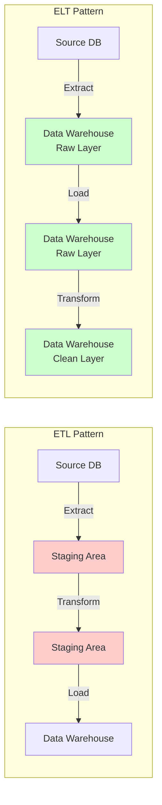
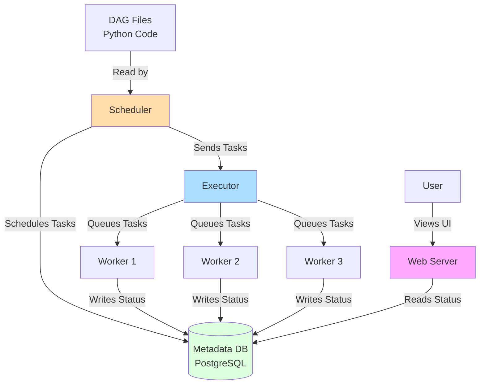
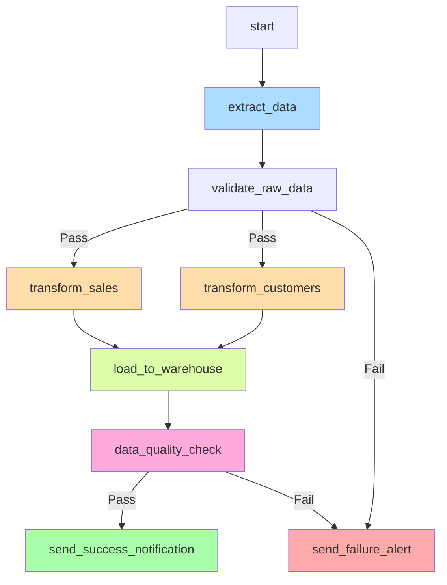

> **© 2026 Chirag Shinde. Licensed under CC BY-NC-SA 4.0.**
> See [LICENSE](../../LICENSE) for details.

---

# 32.1: Data Pipelines — ETL, ELT, and Apache Airflow

## Why This Matters

Every day, companies process millions of transactions, customer interactions, and sensor readings—yet this data rarely arrives in analysis-ready form. Data pipelines automate the reliable, repeatable movement and transformation of data from messy sources to clean destinations, turning raw logs into actionable insights. Without orchestration tools like Apache Airflow, data teams spend weekends manually running failed scripts, debugging why reports are missing yesterday's data, and explaining to executives why the dashboard still shows last week's numbers. Mastering data pipelines transforms fragile, manual workflows into production-grade systems that run reliably at 3 AM when no one is watching.

## Intuition

Think of a data pipeline as an automotive assembly line. Raw materials (data) enter at one end, move through various stations (transformation tasks) where workers (operators) perform specific operations—welding, painting, quality checks—and finally the finished product (clean, transformed data) rolls out at the end. Just as an assembly line needs coordination to ensure parts arrive at the right station at the right time, a data pipeline needs orchestration to ensure tasks run in the correct order with proper dependencies.

If one station breaks down (a task fails), the whole line doesn't need to scrap everything built so far. Instead, it can pause, fix the problem, and restart from that checkpoint—this is retry logic. The assembly line manager (Airflow scheduler) monitors progress, coordinates workers, and alerts supervisors when something goes wrong.

The key difference between ETL and ELT is where the transformation "factory" is located. ETL is like having a separate workshop (staging area) where parts are machined and painted before moving to the final assembly building (data warehouse). The parts arrive perfectly finished and ready to use. ELT is like moving all raw materials directly into a massive warehouse with industrial tools already inside. The warehouse has so much space and power that it's faster to sort and assemble everything there rather than in a separate facility.

Why does this matter? In the past, data warehouses were expensive and slow, so companies built separate staging areas to do the heavy lifting before loading clean data. Today's cloud warehouses (Snowflake, BigQuery) are so powerful and storage is so cheap that it's often faster to load everything first and transform it using the warehouse's compute power. However, some industries (healthcare, finance) must transform sensitive data before loading it anywhere due to privacy regulations—they can't risk storing raw patient records or financial data, even temporarily.

The orchestration layer (Apache Airflow) sits above these patterns, managing when tasks run, in what order, what to do when failures occur, and how to process historical data. Without orchestration, pipelines are fragile scripts that break silently at 3 AM. With orchestration, pipelines are self-monitoring systems that retry transient errors, alert humans to real problems, and maintain detailed audit logs of every execution.

## Formal Definition

A **data pipeline** is an automated workflow $P$ that moves data from source systems $S = \{s_1, s_2, \ldots, s_m\}$ to destination systems $D = \{d_1, d_2, \ldots, d_k\}$ through a sequence of transformations $T = \{t_1, t_2, \ldots, t_n\}$:

$$P: S \xrightarrow{T} D$$

The pipeline execution follows a **Directed Acyclic Graph (DAG)** $G = (V, E)$ where:
- $V$ represents tasks (extract, transform, load, validate)
- $E$ represents dependencies between tasks
- Acyclic property ensures the pipeline terminates (no infinite loops)

**ETL (Extract-Transform-Load)** performs transformations in a staging area before loading:

$$\text{Source} \xrightarrow{\text{Extract}} \text{Staging} \xrightarrow{\text{Transform}} \text{Staging} \xrightarrow{\text{Load}} \text{Warehouse}$$

**ELT (Extract-Load-Transform)** loads raw data first, then transforms in the destination:

$$\text{Source} \xrightarrow{\text{Extract}} \text{Raw Data} \xrightarrow{\text{Load}} \text{Warehouse} \xrightarrow{\text{Transform}} \text{Clean Data}$$

A task $t_i$ is **idempotent** if executing it $n$ times with the same input produces the same result as executing it once:

$$\forall n \geq 1: t_i^n(x) = t_i(x)$$

Idempotency is critical for **backfilling** (processing historical dates) and retry logic after failures.

> **Key Concept:** A production data pipeline must be idempotent (safe to re-run), observable (logs and metrics), and resilient (handles failures gracefully with retries and alerts).

## Visualization

### ETL vs. ELT Architecture



**Figure 1:** ETL transforms data in a separate staging area (red) before loading into the warehouse, while ELT loads raw data directly into the warehouse (green) and transforms it there. ETL minimizes warehouse storage requirements but requires separate compute infrastructure. ELT leverages warehouse compute power and provides flexibility to transform data differently for different use cases.

### Apache Airflow Architecture



**Figure 2:** Airflow's architecture separates concerns. The Scheduler reads DAG files and decides when tasks should run, the Executor distributes tasks to Workers, Workers execute the actual Python/Bash/SQL code, the Metadata Database tracks all state, and the Web Server provides a UI for monitoring. This separation enables horizontal scaling (add more workers) and fault tolerance (scheduler failure doesn't lose task history).

### Sample DAG with Dependencies



**Figure 3:** A realistic DAG showing parallel task execution (transform_sales and transform_customers run simultaneously), branching logic (validation can route to either transformation or alert), and data quality checks after loading. The DAG guarantees load_to_warehouse only runs after both transformations complete successfully.

## Examples

### Example 1: Simple ETL Pipeline (Without Airflow)

Before introducing orchestration, understanding the basic ETL pattern establishes the foundation. This example extracts data from a CSV, transforms it by cleaning nulls and calculating aggregates, then loads the result into a SQLite database.

```python
# Simple ETL pipeline without orchestration
import pandas as pd
import sqlite3
from datetime import datetime

# Extract: Load data from CSV
print("=== EXTRACT ===")
df_raw = pd.DataFrame({
    'date': ['2024-01-01', '2024-01-01', '2024-01-02', '2024-01-02', '2024-01-03'],
    'product': ['Widget', 'Gadget', 'Widget', 'Gadget', 'Widget'],
    'quantity': [10, None, 15, 20, None],  # Missing values
    'price': [19.99, 29.99, 19.99, 29.99, 19.99]
})
print(f"Extracted {len(df_raw)} rows")
print(df_raw.head())
# Output:
#          date product  quantity  price
# 0  2024-01-01  Widget      10.0  19.99
# 1  2024-01-01  Gadget       NaN  29.99
# 2  2024-01-02  Widget      15.0  19.99
# 3  2024-01-02  Gadget      20.0  29.99
# 4  2024-01-03  Widget       NaN  19.99

# Transform: Clean data and calculate revenue
print("\n=== TRANSFORM ===")
df_clean = df_raw.copy()

# Fill missing quantities with 0
df_clean['quantity'] = df_clean['quantity'].fillna(0)

# Calculate revenue
df_clean['revenue'] = df_clean['quantity'] * df_clean['price']

# Aggregate by date and product
df_agg = df_clean.groupby(['date', 'product'], as_index=False).agg({
    'quantity': 'sum',
    'revenue': 'sum'
})

print(f"Transformed to {len(df_agg)} aggregated rows")
print(df_agg)
# Output:
#          date product  quantity  revenue
# 0  2024-01-01  Gadget       0.0     0.00
# 1  2024-01-01  Widget      10.0   199.90
# 2  2024-01-02  Gadget      20.0   599.80
# 3  2024-01-02  Widget      15.0   299.85
# 4  2024-01-03  Widget       0.0     0.00

# Load: Insert into SQLite database
print("\n=== LOAD ===")
conn = sqlite3.connect('sales.db')

# Create table if not exists (idempotent pattern)
conn.execute('''
    CREATE TABLE IF NOT EXISTS sales_summary (
        date TEXT,
        product TEXT,
        quantity REAL,
        revenue REAL,
        loaded_at TIMESTAMP,
        PRIMARY KEY (date, product)
    )
''')

# Delete existing data for these dates (idempotent pattern)
dates_to_load = df_agg['date'].unique()
placeholders = ','.join(['?'] * len(dates_to_load))
conn.execute(f'DELETE FROM sales_summary WHERE date IN ({placeholders})',
             tuple(dates_to_load))

# Insert transformed data
df_agg['loaded_at'] = datetime.now()
df_agg.to_sql('sales_summary', conn, if_exists='append', index=False)

# Verify load
result = pd.read_sql('SELECT * FROM sales_summary ORDER BY date, product', conn)
print(f"Loaded {len(result)} rows into database")
print(result[['date', 'product', 'quantity', 'revenue']].head())
# Output:
#          date product  quantity  revenue
# 0  2024-01-01  Gadget       0.0     0.00
# 1  2024-01-01  Widget      10.0   199.90
# 2  2024-01-02  Gadget      20.0   599.80
# 3  2024-01-02  Widget      15.0   299.85
# 4  2024-01-03  Widget       0.0     0.00

conn.commit()
conn.close()
print("\n=== ETL COMPLETE ===")
```

This script demonstrates the ETL pattern: extract from CSV, transform with pandas, load to SQLite. Notice the idempotent patterns: `CREATE TABLE IF NOT EXISTS` ensures the table exists, and `DELETE ... WHERE date IN (...)` followed by `INSERT` ensures running this script multiple times for the same dates produces the same result (no duplicates). The transformed data is aggregated—if the source has 1 million rows, the target might only have thousands of summary rows.

The limitation of this approach: if this script fails at 3 AM due to a database connection timeout, no one knows until someone checks manually. There's no automatic retry, no alerting, and no easy way to process historical dates. This is where orchestration becomes essential.

### Example 2: First Airflow DAG (Hello World)

An Airflow DAG is simply Python code that defines tasks and their dependencies. This minimal example introduces the core syntax without any actual data processing.

```python
# my_first_dag.py
# Place this file in ~/airflow/dags/ directory
from airflow import DAG
from airflow.operators.python import PythonOperator
from datetime import datetime, timedelta

# Define default arguments for all tasks
default_args = {
    'owner': 'data_team',
    'depends_on_past': False,
    'email_on_failure': False,
    'email_on_retry': False,
    'retries': 2,
    'retry_delay': timedelta(minutes=5),
}

# Define the DAG
dag = DAG(
    dag_id='hello_world_pipeline',
    default_args=default_args,
    description='My first Airflow DAG',
    schedule_interval='@daily',  # Run once per day
    start_date=datetime(2024, 1, 1),
    catchup=False,  # Don't backfill historical runs
    tags=['tutorial', 'beginner'],
)

# Task functions
def task_a():
    print("Task A: Extracting data...")
    return "Data extracted successfully"

def task_b():
    print("Task B: Transforming data...")
    return "Data transformed successfully"

def task_c():
    print("Task C: Loading data...")
    return "Data loaded successfully"

# Define tasks
extract = PythonOperator(
    task_id='extract_data',
    python_callable=task_a,
    dag=dag,
)

transform = PythonOperator(
    task_id='transform_data',
    python_callable=task_b,
    dag=dag,
)

load = PythonOperator(
    task_id='load_data',
    python_callable=task_c,
    dag=dag,
)

# Define task dependencies
# These three notations are equivalent:
# Option 1: Bit shift operators (most common)
extract >> transform >> load

# Option 2: Set upstream/downstream (more explicit)
# transform.set_upstream(extract)
# load.set_upstream(transform)

# Option 3: List notation for parallel tasks
# extract >> [transform1, transform2] >> load

# Output when run:
# [2024-01-15 10:00:00] {python.py:177} INFO - Task A: Extracting data...
# [2024-01-15 10:00:02] {python.py:177} INFO - Task B: Transforming data...
# [2024-01-15 10:00:04] {python.py:177} INFO - Task C: Loading data...
```

This DAG defines three tasks that run sequentially. The `>>` operator establishes dependencies: `extract` must complete before `transform` starts, and `transform` must complete before `load` starts. The `schedule_interval='@daily'` means Airflow will automatically run this pipeline once per day.

To test this DAG without waiting for the schedule:

```bash
# Test individual task (doesn't run dependencies)
airflow tasks test hello_world_pipeline extract_data 2024-01-15

# Test entire DAG for specific date
airflow dags test hello_world_pipeline 2024-01-15
```

The `default_args` define behavior for all tasks: automatically retry failed tasks twice with 5-minute delays between attempts. If a task fails twice, the DAG run is marked as failed.

Key insight: The DAG file is just Python code. It runs every few seconds to check if tasks should be scheduled, but the actual task execution happens separately in workers. This separation enables Airflow to manage thousands of DAGs efficiently.

### Example 3: ETL Pipeline in Airflow with Real Data

This example implements a complete ETL pipeline using the California Housing dataset, demonstrating data passing between tasks, transformation logic, and database loading.

```python
# california_housing_pipeline.py
from airflow import DAG
from airflow.operators.python import PythonOperator
from datetime import datetime, timedelta
import pandas as pd
import sqlite3
from sklearn.datasets import fetch_california_housing
import numpy as np

default_args = {
    'owner': 'data_team',
    'retries': 3,
    'retry_delay': timedelta(minutes=5),
}

dag = DAG(
    dag_id='california_housing_etl',
    default_args=default_args,
    description='ETL pipeline for California Housing data',
    schedule_interval='@weekly',  # Run once per week
    start_date=datetime(2024, 1, 1),
    catchup=False,
    tags=['etl', 'housing', 'sklearn'],
)

# Task 1: Extract data and save to staging
def extract_housing_data(**context):
    """Extract California Housing dataset and save to CSV."""
    print("Extracting California Housing data...")

    # Load dataset
    housing = fetch_california_housing(as_frame=True)
    df = housing.frame

    # Add execution date to data
    execution_date = context['ds']  # Airflow provides execution date as YYYY-MM-DD
    df['batch_date'] = execution_date

    # Save to staging area (in production, use S3, GCS, or similar)
    staging_path = f'/tmp/housing_raw_{execution_date}.csv'
    df.to_csv(staging_path, index=False)

    print(f"Extracted {len(df)} rows")
    print(f"Columns: {list(df.columns)}")
    print(f"Saved to {staging_path}")

    # Return path for downstream tasks (via XCom)
    return staging_path
    # Output:
    # Extracting California Housing data...
    # Extracted 20640 rows
    # Columns: ['MedInc', 'HouseAge', 'AveRooms', 'AveBedrms', 'Population',
    #           'AveOccup', 'Latitude', 'Longitude', 'MedHouseVal', 'batch_date']
    # Saved to /tmp/housing_raw_2024-01-15.csv

extract_task = PythonOperator(
    task_id='extract_data',
    python_callable=extract_housing_data,
    dag=dag,
)

# Task 2: Transform data
def transform_housing_data(**context):
    """Apply transformations: add derived features, handle outliers."""
    print("Transforming housing data...")

    # Pull staging path from upstream task
    ti = context['ti']
    staging_path = ti.xcom_pull(task_ids='extract_data')

    # Load from staging
    df = pd.read_csv(staging_path)
    print(f"Loaded {len(df)} rows for transformation")

    # Transformation 1: Add derived features
    df['RoomsPerHousehold'] = df['AveRooms'] * df['AveOccup']
    df['BedroomsPerRoom'] = df['AveBedrms'] / (df['AveRooms'] + 1e-6)  # Avoid division by zero
    df['PopulationPerHousehold'] = df['Population'] / (df['AveOccup'] + 1e-6)

    # Transformation 2: Handle outliers (cap at 99th percentile)
    for col in ['MedInc', 'HouseAge', 'AveRooms', 'MedHouseVal']:
        percentile_99 = df[col].quantile(0.99)
        outlier_count = (df[col] > percentile_99).sum()
        df[col] = df[col].clip(upper=percentile_99)
        print(f"Capped {outlier_count} outliers in {col} at {percentile_99:.2f}")

    # Transformation 3: Create price category
    df['price_category'] = pd.cut(
        df['MedHouseVal'],
        bins=[0, 1.5, 3.0, 5.0],
        labels=['low', 'medium', 'high']
    )

    # Save transformed data
    execution_date = context['ds']
    transformed_path = f'/tmp/housing_clean_{execution_date}.csv'
    df.to_csv(transformed_path, index=False)

    print(f"Transformed data saved to {transformed_path}")
    print(f"New columns: RoomsPerHousehold, BedroomsPerRoom, PopulationPerHousehold, price_category")

    return transformed_path
    # Output:
    # Transforming housing data...
    # Loaded 20640 rows for transformation
    # Capped 206 outliers in MedInc at 12.48
    # Capped 206 outliers in HouseAge at 52.00
    # Capped 206 outliers in AveRooms at 8.67
    # Capped 206 outliers in MedHouseVal at 5.00
    # Transformed data saved to /tmp/housing_clean_2024-01-15.csv
    # New columns: RoomsPerHousehold, BedroomsPerRoom, PopulationPerHousehold, price_category

transform_task = PythonOperator(
    task_id='transform_data',
    python_callable=transform_housing_data,
    dag=dag,
)

# Task 3: Load data into database
def load_to_database(**context):
    """Load transformed data into SQLite database."""
    print("Loading data to database...")

    # Pull transformed path from upstream task
    ti = context['ti']
    transformed_path = ti.xcom_pull(task_ids='transform_data')

    # Load transformed data
    df = pd.read_csv(transformed_path)

    # Connect to database
    conn = sqlite3.connect('/tmp/housing.db')

    # Create table (idempotent)
    conn.execute('''
        CREATE TABLE IF NOT EXISTS housing_data (
            MedInc REAL,
            HouseAge REAL,
            AveRooms REAL,
            AveBedrms REAL,
            Population REAL,
            AveOccup REAL,
            Latitude REAL,
            Longitude REAL,
            MedHouseVal REAL,
            batch_date TEXT,
            RoomsPerHousehold REAL,
            BedroomsPerRoom REAL,
            PopulationPerHousehold REAL,
            price_category TEXT
        )
    ''')

    # Delete existing data for this batch date (idempotent pattern)
    execution_date = context['ds']
    conn.execute('DELETE FROM housing_data WHERE batch_date = ?', (execution_date,))

    # Insert new data
    df.to_sql('housing_data', conn, if_exists='append', index=False)

    # Verify load
    row_count = conn.execute('SELECT COUNT(*) FROM housing_data WHERE batch_date = ?',
                             (execution_date,)).fetchone()[0]

    print(f"Loaded {row_count} rows into housing_data table for batch_date={execution_date}")

    # Data quality metrics
    price_dist = pd.read_sql(
        'SELECT price_category, COUNT(*) as count FROM housing_data WHERE batch_date = ? GROUP BY price_category',
        conn,
        params=(execution_date,)
    )
    print("\nPrice category distribution:")
    print(price_dist)
    # Output:
    # Loading data to database...
    # Loaded 20640 rows into housing_data table for batch_date=2024-01-15
    #
    # Price category distribution:
    #   price_category  count
    # 0            low  10420
    # 1         medium   8146
    # 2           high   2074

    conn.commit()
    conn.close()

    return row_count

load_task = PythonOperator(
    task_id='load_data',
    python_callable=load_to_database,
    dag=dag,
)

# Task 4: Send notification
def send_notification(**context):
    """Send success notification with metrics."""
    ti = context['ti']
    row_count = ti.xcom_pull(task_ids='load_data')
    execution_date = context['ds']

    message = f"""
    ✅ California Housing ETL Pipeline Completed Successfully

    Execution Date: {execution_date}
    Rows Processed: {row_count:,}
    Pipeline: extract → transform → load → notify

    Next Run: Tomorrow at scheduled time
    """

    print(message)
    # In production: send to Slack, email, or monitoring system
    # Output:
    # ✅ California Housing ETL Pipeline Completed Successfully
    #
    # Execution Date: 2024-01-15
    # Rows Processed: 20,640
    # Pipeline: extract → transform → load → notify
    #
    # Next Run: Tomorrow at scheduled time

notify_task = PythonOperator(
    task_id='send_notification',
    python_callable=send_notification,
    dag=dag,
)

# Define task dependencies
extract_task >> transform_task >> load_task >> notify_task
```

This pipeline demonstrates several production patterns:

**Data Passing via XCom**: Each task returns a file path (not the data itself). Downstream tasks pull this path using `ti.xcom_pull(task_ids='task_name')`. XCom is stored in the metadata database and should only contain small values like paths, row counts, or status indicators—never entire DataFrames.

**Idempotent Loading**: The load task deletes existing data for the batch_date before inserting new data. Running this pipeline multiple times for the same date produces identical results in the database (no duplicates).

**Execution Date Awareness**: Using `context['ds']` (execution date as string) in filenames and database records makes the pipeline date-aware. This enables backfilling historical dates and prevents data from different runs from colliding.

**Transformation Logic**: The transform task adds derived features, caps outliers, and creates categorical bins. This business logic is separate from orchestration logic—in production, move these transformations to separate modules with unit tests.

The pipeline processes 20,640 rows, which represents a typical batch processing scenario. The weekly schedule means the pipeline runs every Sunday at midnight, processing that week's data.

### Example 4: Scheduled Pipeline with Incremental Loading

Incremental loading processes only new or changed data since the last run, essential for large datasets where full refresh is impractical. This example demonstrates incremental patterns using simulated daily user events.

```python
# incremental_user_events_pipeline.py
from airflow import DAG
from airflow.operators.python import PythonOperator
from datetime import datetime, timedelta
import pandas as pd
import sqlite3
import numpy as np

default_args = {
    'owner': 'data_team',
    'retries': 3,
    'retry_delay': timedelta(minutes=5),
}

dag = DAG(
    dag_id='incremental_user_events',
    default_args=default_args,
    description='Incremental loading of daily user events',
    schedule_interval='@daily',  # Run every day at midnight
    start_date=datetime(2024, 1, 1),
    catchup=True,  # Enable backfilling for historical dates
    max_active_runs=1,  # Process one date at a time
    tags=['incremental', 'events'],
)

# Simulate data source with daily events
def generate_daily_events(**context):
    """Simulate extracting events for a specific date from source system."""
    execution_date = context['ds']  # YYYY-MM-DD format
    print(f"Extracting events for {execution_date}")

    # Simulate API/database query that returns events for execution_date
    # In production: SELECT * FROM events WHERE date = '{execution_date}'
    np.random.seed(int(execution_date.replace('-', '')))  # Reproducible random data

    n_events = np.random.randint(1000, 2000)
    df = pd.DataFrame({
        'event_date': execution_date,
        'user_id': np.random.randint(1000, 9999, n_events),
        'event_type': np.random.choice(['login', 'purchase', 'view', 'logout'], n_events),
        'event_timestamp': pd.date_range(
            start=f'{execution_date} 00:00:00',
            end=f'{execution_date} 23:59:59',
            periods=n_events
        ),
        'revenue': np.where(
            np.random.choice(['login', 'purchase', 'view', 'logout'], n_events) == 'purchase',
            np.random.uniform(10, 500, n_events).round(2),
            0
        )
    })

    staging_path = f'/tmp/events_{execution_date}.csv'
    df.to_csv(staging_path, index=False)

    print(f"Extracted {len(df)} events for {execution_date}")
    print(f"Event types: {df['event_type'].value_counts().to_dict()}")

    return staging_path
    # Output:
    # Extracting events for 2024-01-15
    # Extracted 1456 events for 2024-01-15
    # Event types: {'view': 378, 'login': 365, 'purchase': 361, 'logout': 352}

extract_task = PythonOperator(
    task_id='extract_daily_events',
    python_callable=generate_daily_events,
    dag=dag,
)

# Incremental load task
def load_incremental(**context):
    """Load events only if not already loaded for this date."""
    execution_date = context['ds']
    print(f"Loading events for {execution_date}")

    # Get staging data
    ti = context['ti']
    staging_path = ti.xcom_pull(task_ids='extract_daily_events')
    df = pd.read_csv(staging_path)

    # Connect to database
    conn = sqlite3.connect('/tmp/events.db')

    # Create table (idempotent)
    conn.execute('''
        CREATE TABLE IF NOT EXISTS user_events (
            event_date TEXT,
            user_id INTEGER,
            event_type TEXT,
            event_timestamp TEXT,
            revenue REAL,
            loaded_at TIMESTAMP
        )
    ''')

    # Check if data for this date already exists
    existing_count = conn.execute(
        'SELECT COUNT(*) FROM user_events WHERE event_date = ?',
        (execution_date,)
    ).fetchone()[0]

    if existing_count > 0:
        print(f"Found {existing_count} existing events for {execution_date}")
        print("Deleting existing data (idempotent re-run)...")
        conn.execute('DELETE FROM user_events WHERE event_date = ?', (execution_date,))

    # Insert new data
    df['loaded_at'] = datetime.now()
    df.to_sql('user_events', conn, if_exists='append', index=False)

    # Verify
    new_count = conn.execute(
        'SELECT COUNT(*) FROM user_events WHERE event_date = ?',
        (execution_date,)
    ).fetchone()[0]

    print(f"Loaded {new_count} events for {execution_date}")

    # Calculate metrics
    metrics = pd.read_sql(f"""
        SELECT
            event_date,
            COUNT(*) as total_events,
            COUNT(DISTINCT user_id) as unique_users,
            SUM(CASE WHEN event_type = 'purchase' THEN 1 ELSE 0 END) as purchases,
            ROUND(SUM(revenue), 2) as total_revenue
        FROM user_events
        WHERE event_date = '{execution_date}'
        GROUP BY event_date
    """, conn)

    print("\nDaily Metrics:")
    print(metrics.to_string(index=False))
    # Output:
    # Loading events for 2024-01-15
    # Found 0 existing events for 2024-01-15
    # Loaded 1456 events for 2024-01-15
    #
    # Daily Metrics:
    #  event_date  total_events  unique_users  purchases  total_revenue
    #  2024-01-15          1456           838        361       62847.82

    conn.commit()
    conn.close()

    return new_count

load_task = PythonOperator(
    task_id='load_incremental',
    python_callable=load_incremental,
    dag=dag,
)

# Validation task
def validate_data_freshness(**context):
    """Verify data for execution_date was loaded successfully."""
    execution_date = context['ds']
    print(f"Validating data freshness for {execution_date}")

    conn = sqlite3.connect('/tmp/events.db')

    # Check if data exists for execution_date
    result = conn.execute(
        'SELECT COUNT(*) as count, MAX(loaded_at) as latest_load FROM user_events WHERE event_date = ?',
        (execution_date,)
    ).fetchone()

    count, latest_load = result

    if count == 0:
        raise ValueError(f"Data validation FAILED: No data found for {execution_date}")

    print(f"✅ Data validation PASSED")
    print(f"   Events for {execution_date}: {count}")
    print(f"   Latest load time: {latest_load}")

    # Check for data gaps (in production)
    prev_date = (datetime.strptime(execution_date, '%Y-%m-%d') - timedelta(days=1)).strftime('%Y-%m-%d')
    prev_count = conn.execute(
        'SELECT COUNT(*) FROM user_events WHERE event_date = ?',
        (prev_date,)
    ).fetchone()[0]

    if prev_count > 0:
        print(f"   Previous date ({prev_date}): {prev_count} events")
    else:
        print(f"   Previous date ({prev_date}): No data (might be first run or gap)")

    conn.close()
    # Output:
    # Validating data freshness for 2024-01-15
    # ✅ Data validation PASSED
    #    Events for 2024-01-15: 1456
    #    Latest load time: 2024-01-15 10:30:45.123456
    #    Previous date (2024-01-14): 1523 events

validate_task = PythonOperator(
    task_id='validate_freshness',
    python_callable=validate_data_freshness,
    dag=dag,
)

# Define dependencies
extract_task >> load_task >> validate_task
```

This incremental pipeline demonstrates several key patterns:

**Date-Aware Processing**: The pipeline uses `context['ds']` to process only the execution date's data. When scheduled daily, it processes yesterday's data each day. The `schedule_interval='@daily'` with `start_date=datetime(2024, 1, 1)` means the first run processes 2024-01-01 data.

**Catchup and Backfilling**: Setting `catchup=True` means if the pipeline was turned off for 7 days, when restarted it will automatically run 7 times (once for each missed date). This backfills historical data. Test backfilling manually:

```bash
# Backfill a specific date range
airflow dags backfill incremental_user_events \
  --start-date 2024-01-01 \
  --end-date 2024-01-07
```

**Idempotent Loading**: The load task checks if data for the execution date already exists. If found (rerun scenario), it deletes the existing data before inserting new data. This ensures backfilling and retries don't create duplicates.

**Data Validation**: The validation task verifies data was loaded for the execution date. If the check fails, the entire DAG run is marked as failed, alerting operators to investigate. Validation catches issues like: source system was down, extraction returned 0 rows, or database connection failed.

**Sequential Processing**: Setting `max_active_runs=1` ensures only one date is processed at a time. This prevents parallel backfills from overwhelming the source system or database.

The key insight: This pipeline can process 2024-01-15 data on 2024-01-15, and years later, you can backfill 2024-01-15 data again and get identical results. This reproducibility is the core value of orchestrated, idempotent pipelines.

### Example 5: Data Quality Checks with Branching Logic

Production pipelines must validate data quality and route to different paths based on validation results. This example adds branching logic using BranchPythonOperator.

```python
# data_quality_pipeline.py
from airflow import DAG
from airflow.operators.python import PythonOperator, BranchPythonOperator
from airflow.operators.dummy import DummyOperator
from datetime import datetime, timedelta
import pandas as pd
import sqlite3

default_args = {
    'owner': 'data_team',
    'retries': 2,
    'retry_delay': timedelta(minutes=5),
}

dag = DAG(
    dag_id='data_quality_pipeline',
    default_args=default_args,
    description='Pipeline with data quality checks and branching',
    schedule_interval='@daily',
    start_date=datetime(2024, 1, 1),
    catchup=False,
    tags=['quality', 'branching'],
)

# Extract task (reusing logic from previous example)
def extract_data(**context):
    """Extract California Housing data."""
    from sklearn.datasets import fetch_california_housing

    execution_date = context['ds']
    housing = fetch_california_housing(as_frame=True)
    df = housing.frame
    df['batch_date'] = execution_date

    staging_path = f'/tmp/housing_{execution_date}.csv'
    df.to_csv(staging_path, index=False)

    print(f"Extracted {len(df)} rows")
    return staging_path

extract_task = PythonOperator(
    task_id='extract_data',
    python_callable=extract_data,
    dag=dag,
)

# Load raw data to database
def load_raw_data(**context):
    """Load raw data into staging table."""
    ti = context['ti']
    staging_path = ti.xcom_pull(task_ids='extract_data')
    df = pd.read_csv(staging_path)

    conn = sqlite3.connect('/tmp/housing_quality.db')

    # Create staging table
    conn.execute('''
        CREATE TABLE IF NOT EXISTS raw_housing (
            MedInc REAL,
            HouseAge REAL,
            AveRooms REAL,
            AveBedrms REAL,
            Population REAL,
            AveOccup REAL,
            Latitude REAL,
            Longitude REAL,
            MedHouseVal REAL,
            batch_date TEXT
        )
    ''')

    execution_date = context['ds']
    conn.execute('DELETE FROM raw_housing WHERE batch_date = ?', (execution_date,))
    df.to_sql('raw_housing', conn, if_exists='append', index=False)

    conn.commit()
    conn.close()

    print(f"Loaded {len(df)} rows to raw_housing table")
    return len(df)

load_raw_task = PythonOperator(
    task_id='load_raw_data',
    python_callable=load_raw_data,
    dag=dag,
)

# Data quality checks
def check_data_quality(**context):
    """
    Perform data quality checks. Returns task_id to branch to.

    Checks:
    1. Row count within expected range
    2. No nulls in critical columns
    3. Values within reasonable ranges
    """
    execution_date = context['ds']
    conn = sqlite3.connect('/tmp/housing_quality.db')

    print("=" * 50)
    print("RUNNING DATA QUALITY CHECKS")
    print("=" * 50)

    issues = []

    # Check 1: Row count
    row_count = conn.execute(
        'SELECT COUNT(*) FROM raw_housing WHERE batch_date = ?',
        (execution_date,)
    ).fetchone()[0]

    expected_min, expected_max = 20000, 21000
    if expected_min <= row_count <= expected_max:
        print(f"✅ Check 1 PASSED: Row count {row_count} within range [{expected_min}, {expected_max}]")
    else:
        print(f"❌ Check 1 FAILED: Row count {row_count} outside range [{expected_min}, {expected_max}]")
        issues.append(f"Row count: {row_count}")

    # Check 2: Null values
    df = pd.read_sql(
        f"SELECT * FROM raw_housing WHERE batch_date = '{execution_date}'",
        conn
    )

    critical_columns = ['MedInc', 'MedHouseVal', 'Latitude', 'Longitude']
    null_counts = df[critical_columns].isnull().sum()

    if null_counts.sum() == 0:
        print(f"✅ Check 2 PASSED: No nulls in critical columns")
    else:
        print(f"❌ Check 2 FAILED: Found nulls in critical columns:")
        for col, count in null_counts[null_counts > 0].items():
            print(f"   {col}: {count} nulls")
        issues.append(f"Null values: {null_counts[null_counts > 0].to_dict()}")

    # Check 3: Value ranges
    range_checks = {
        'MedInc': (0, 20),
        'HouseAge': (0, 100),
        'MedHouseVal': (0, 10),
        'Latitude': (30, 45),
        'Longitude': (-130, -110),
    }

    all_ranges_valid = True
    for col, (min_val, max_val) in range_checks.items():
        out_of_range = ((df[col] < min_val) | (df[col] > max_val)).sum()
        if out_of_range == 0:
            print(f"✅ Check 3.{col} PASSED: All values in range [{min_val}, {max_val}]")
        else:
            print(f"❌ Check 3.{col} FAILED: {out_of_range} values outside range [{min_val}, {max_val}]")
            issues.append(f"{col} range violations: {out_of_range}")
            all_ranges_valid = False

    conn.close()

    # Store issues in XCom for downstream tasks
    context['ti'].xcom_push(key='quality_issues', value=issues)

    # Branch decision
    print("=" * 50)
    if len(issues) == 0:
        print("RESULT: All checks PASSED ✅")
        print("Branching to: quality_passed")
        return 'quality_passed'  # Task ID to execute
    else:
        print(f"RESULT: {len(issues)} checks FAILED ❌")
        print("Branching to: quality_failed")
        return 'quality_failed'  # Task ID to execute
    # Output (success scenario):
    # ==================================================
    # RUNNING DATA QUALITY CHECKS
    # ==================================================
    # ✅ Check 1 PASSED: Row count 20640 within range [20000, 21000]
    # ✅ Check 2 PASSED: No nulls in critical columns
    # ✅ Check 3.MedInc PASSED: All values in range [0, 20]
    # ✅ Check 3.HouseAge PASSED: All values in range [0, 100]
    # ✅ Check 3.MedHouseVal PASSED: All values in range [0, 10]
    # ✅ Check 3.Latitude PASSED: All values in range [30, 45]
    # ✅ Check 3.Longitude PASSED: All values in range [-130, -110]
    # ==================================================
    # RESULT: All checks PASSED ✅
    # Branching to: quality_passed

quality_check_task = BranchPythonOperator(
    task_id='check_quality',
    python_callable=check_data_quality,
    dag=dag,
)

# Success path: Transform and load
def transform_and_load(**context):
    """Apply transformations and load to final table."""
    execution_date = context['ds']
    conn = sqlite3.connect('/tmp/housing_quality.db')

    # Load raw data
    df = pd.read_sql(
        f"SELECT * FROM raw_housing WHERE batch_date = '{execution_date}'",
        conn
    )

    # Apply transformations
    df['RoomsPerHousehold'] = df['AveRooms'] * df['AveOccup']
    df['price_category'] = pd.cut(
        df['MedHouseVal'],
        bins=[0, 1.5, 3.0, 5.0],
        labels=['low', 'medium', 'high']
    )

    # Create final table
    conn.execute('''
        CREATE TABLE IF NOT EXISTS final_housing (
            MedInc REAL,
            HouseAge REAL,
            AveRooms REAL,
            MedHouseVal REAL,
            Latitude REAL,
            Longitude REAL,
            RoomsPerHousehold REAL,
            price_category TEXT,
            batch_date TEXT,
            processed_at TIMESTAMP
        )
    ''')

    conn.execute('DELETE FROM final_housing WHERE batch_date = ?', (execution_date,))

    df['processed_at'] = datetime.now()
    df[['MedInc', 'HouseAge', 'AveRooms', 'MedHouseVal', 'Latitude', 'Longitude',
        'RoomsPerHousehold', 'price_category', 'batch_date', 'processed_at']].to_sql(
        'final_housing', conn, if_exists='append', index=False
    )

    conn.commit()
    conn.close()

    print(f"✅ Transformed and loaded {len(df)} rows to final_housing")

quality_passed_task = PythonOperator(
    task_id='quality_passed',
    python_callable=transform_and_load,
    dag=dag,
)

# Failure path: Alert and quarantine
def handle_quality_failure(**context):
    """Alert on quality failures and quarantine bad data."""
    ti = context['ti']
    execution_date = context['ds']
    issues = ti.xcom_pull(task_ids='check_quality', key='quality_issues')

    print("=" * 50)
    print("DATA QUALITY FAILURE HANDLER")
    print("=" * 50)
    print(f"Execution Date: {execution_date}")
    print(f"Number of Issues: {len(issues)}")
    print("\nDetailed Issues:")
    for i, issue in enumerate(issues, 1):
        print(f"  {i}. {issue}")

    # In production: Send to Slack, PagerDuty, email
    alert_message = f"""
    🚨 DATA QUALITY ALERT

    Pipeline: data_quality_pipeline
    Date: {execution_date}
    Status: FAILED

    Issues Found:
    {chr(10).join(f'  - {issue}' for issue in issues)}

    Action Required:
    1. Investigate source data for {execution_date}
    2. Fix data quality issues at source
    3. Re-run pipeline for {execution_date}

    Data has been quarantined in raw_housing table.
    """

    print(alert_message)

    # Quarantine data (move to separate table for investigation)
    conn = sqlite3.connect('/tmp/housing_quality.db')
    conn.execute('''
        CREATE TABLE IF NOT EXISTS quarantine_housing (
            MedInc REAL,
            HouseAge REAL,
            AveRooms REAL,
            MedHouseVal REAL,
            Latitude REAL,
            Longitude REAL,
            batch_date TEXT,
            quarantined_at TIMESTAMP,
            issues TEXT
        )
    ''')

    conn.execute(f'''
        INSERT INTO quarantine_housing
        SELECT *, '{datetime.now()}', '{"; ".join(issues)}'
        FROM raw_housing
        WHERE batch_date = '{execution_date}'
    ''')

    conn.commit()
    conn.close()

    print(f"Bad data quarantined to quarantine_housing table")
    # Output (failure scenario):
    # ==================================================
    # DATA QUALITY FAILURE HANDLER
    # ==================================================
    # Execution Date: 2024-01-15
    # Number of Issues: 2
    #
    # Detailed Issues:
    #   1. Row count: 15000
    #   2. Null values: {'MedInc': 500}
    #
    # 🚨 DATA QUALITY ALERT
    # ...

quality_failed_task = PythonOperator(
    task_id='quality_failed',
    python_callable=handle_quality_failure,
    dag=dag,
)

# Join point (both paths lead here)
join_task = DummyOperator(
    task_id='join',
    trigger_rule='none_failed_min_one_success',  # Run if at least one upstream succeeded
    dag=dag,
)

# Define dependencies
extract_task >> load_raw_task >> quality_check_task
quality_check_task >> [quality_passed_task, quality_failed_task]
quality_passed_task >> join_task
quality_failed_task >> join_task
```

This pipeline demonstrates branching logic:

**BranchPythonOperator**: The `check_data_quality` function returns a task_id ('quality_passed' or 'quality_failed') indicating which branch to execute. Airflow marks the other branch as "skipped".

**Data Quality Checks**: Three types of checks: row count (detect missing data), null checks (data completeness), and value range checks (data validity). Production pipelines should check schema consistency, referential integrity, and business rule violations.

**Quarantine Pattern**: Failed data is moved to a separate quarantine table for investigation rather than being discarded. This enables root cause analysis—data scientists can examine quarantined data to understand what went wrong.

**Trigger Rules**: The join task uses `trigger_rule='none_failed_min_one_success'` meaning it runs if at least one upstream task succeeded and none failed (some can be skipped). Default trigger rule is 'all_success'.

**Actionable Alerts**: The failure handler provides specific information about what failed and recommended actions. Avoid generic alerts like "Pipeline failed"—include enough context for on-call engineers to triage without accessing logs.

The key insight: Data quality checks are not optional extras. They prevent bad data from propagating downstream, corrupting reports, and breaking ML models. The cost of catching issues early (in the pipeline) is far lower than the cost of fixing issues after bad data reaches production dashboards.

## Common Pitfalls

**1. Not Making Tasks Idempotent**

Beginners write tasks that append data or create files without checking if processing already occurred for that date. A pipeline that extracts 1,000 rows and appends them to a table, when run twice, creates 2,000 rows—1,000 duplicates. Running the same task for 2024-01-15 five times should produce identical results, not duplicate data.

This happens because developers think linearly: "The pipeline runs once per day, so I only need to append data." They don't anticipate backfilling (reprocessing historical dates), debugging (rerunning failed tasks), or data corrections (fixing and reloading bad data). Without idempotency, these operations corrupt data.

The solution is to include date-awareness and existence checks in every task. For SQL loads, use `DELETE WHERE date = execution_date` followed by `INSERT`, or use `INSERT ... ON CONFLICT DO UPDATE` (upsert). For file operations, include the execution date in filenames: `data_{execution_date}.csv` instead of `data.csv`. For incremental tables, check if the date already exists before processing. The pattern: detect existing data, remove it, then insert fresh data. Running this process N times produces the same result as running it once.

Example of non-idempotent code (wrong):
```python
df.to_sql('sales', conn, if_exists='append')  # Creates duplicates on rerun
```

Example of idempotent code (correct):
```python
conn.execute('DELETE FROM sales WHERE date = ?', (execution_date,))
df.to_sql('sales', conn, if_exists='append')  # Safe to rerun
```

**2. Hardcoding Dates Instead of Using Airflow's Template Variables**

Beginners hardcode dates in SQL queries like `WHERE date = '2024-01-15'`, making backfills impossible and causing the pipeline to always process the same data regardless of when it runs. The pipeline becomes a static script that happens to be scheduled, rather than a date-aware workflow.

This happens because developers initially test with specific dates and forget to parameterize them. They copy-paste SQL from ad-hoc analysis notebooks directly into production code. The problem manifests when attempting to backfill historical dates—the hardcoded query ignores the execution date and processes the wrong data.

The solution is to use Airflow's template variables: `{{ ds }}` (execution date as YYYY-MM-DD), `{{ execution_date }}` (full datetime object), `{{ prev_ds }}` (previous execution date). Airflow replaces these at runtime based on which date is being processed. In SQL queries, write `WHERE date = '{{ ds }}'`. In Python functions, access via `context['ds']`. This makes pipelines backfill-compatible and enables testing with different dates.

Example of hardcoded dates (wrong):
```python
query = "SELECT * FROM transactions WHERE date = '2024-01-15'"  # Always processes same date
```

Example using template variables (correct):
```python
query = "SELECT * FROM transactions WHERE date = '{{ ds }}'"  # Processes execution_date
```

For Python operators:
```python
def process_data(**context):
    execution_date = context['ds']  # Access from context
    query = f"SELECT * FROM transactions WHERE date = '{execution_date}'"
```

**3. Storing Business Logic in DAG Files Instead of Separate Modules**

Beginners write complex data transformations directly in PythonOperator functions within the DAG file, creating 500-line DAG files filled with pandas operations, calculations, and business rules. This makes code untestable (can't run unit tests without triggering Airflow), unreusable (logic tied to DAG structure), and hard to debug (must trigger entire pipeline to test one transformation).

This happens because it feels convenient—everything in one place, no imports needed. The DAG file is treated as a script rather than orchestration configuration. Testing requires running the entire pipeline, which is slow and requires an Airflow environment.

The solution is to separate orchestration from business logic. DAG files should only define task structure, dependencies, and scheduling—typically under 100 lines. Move transformation logic to separate Python modules in a `src/` or `transforms/` directory with proper unit tests. The DAG imports and calls these modules. This enables fast unit testing (`pytest transforms/test_sales.py`), code reuse (same transformations used by multiple DAGs), and easier debugging (test transformations in isolation).

Example structure:
```
project/
├── dags/
│   └── sales_pipeline.py          # Only orchestration (100 lines)
├── src/
│   ├── transforms/
│   │   ├── sales_transforms.py    # Business logic (300 lines)
│   │   └── customer_transforms.py
│   └── utils/
│       └── database.py
└── tests/
    └── test_sales_transforms.py   # Unit tests
```

In the DAG file:
```python
from src.transforms.sales_transforms import aggregate_daily_sales

def run_aggregation(**context):
    df = load_data(context['ds'])
    result = aggregate_daily_sales(df)  # Testable function
    save_data(result, context['ds'])
```

Now `aggregate_daily_sales()` can be tested independently with pytest, reused in other DAGs, and modified without touching orchestration logic.

## Practice Exercises

**Exercise 1**

Create an Airflow DAG that implements an ELT pipeline for the Iris dataset (sklearn.datasets.load_iris). The pipeline should extract the data, load it into a SQLite table called `raw_iris`, then transform the data using SQL to calculate mean measurements per species and store results in an `iris_summary` table. Configure the DAG to run daily with 3 retries and 5-minute retry delays. Ensure the pipeline is idempotent—running it multiple times for the same date should not create duplicate data. Test by running the DAG twice for the same execution date and verifying row counts remain unchanged.

**Exercise 2**

Build an incremental loading pipeline for simulated time-series data. Create a CSV file with synthetic daily temperature readings containing columns: date, city (5 cities), temperature (celsius). Build an Airflow DAG that processes only the previous day's data on each run using `{{ ds }}` to filter by execution date. Configure the DAG with `catchup=True` to enable backfilling. Add a validation task that checks if the expected date's data was loaded and raises an error if missing. Test the pipeline by backfilling a 7-day date range using the `airflow dags backfill` command and verifying each day was processed exactly once with no duplicates.

**Exercise 3**

Extend the incremental loading pipeline from Exercise 2 with production-grade monitoring and error handling. Add a data quality check task (using BranchPythonOperator) that validates: row count is within expected range (100-200 rows), no null values in the temperature column, and all temperatures are between -50°C and 50°C. If validation passes, route to a success notification task that prints metrics. If validation fails, route to a failure alert task that logs detailed error information. Implement an `on_failure_callback` function that prints task context when any task fails. Test the pipeline with intentionally corrupted data (nulls, extreme values) to verify the branching logic and error handling work correctly.

**Exercise 4**

Create a DAG that demonstrates XCom for passing metadata between tasks. Build a pipeline with three tasks: (1) Extract task that loads California Housing data and returns a dictionary containing row count, column names, and file path via XCom. (2) Profiling task that pulls the XCom data, generates summary statistics (mean, median, std for numeric columns), and returns the statistics via XCom. (3) Report task that pulls both XComs and generates a formatted text report showing extraction metadata and profiling results. Test that XComs are visible in the Airflow UI under Admin → XComs and verify that modifying the extract task's return value changes what downstream tasks receive.

**Exercise 5**

Implement a pipeline that processes data differently based on day of week. Create a DAG scheduled to run daily that: (1) Extracts sample data (use any sklearn dataset). (2) Uses BranchPythonOperator to check if execution_date is a weekday or weekend (use `datetime.strptime(context['ds'], '%Y-%m-%d').weekday()`). (3) If weekday, runs a "full_transform" task with complex transformations. (4) If weekend, runs a "minimal_transform" task with basic transformations. (5) Both paths converge at a final load task. Configure the load task with `trigger_rule='none_failed_min_one_success'` so it runs regardless of which branch executed. Test by running the DAG for various dates (Monday, Saturday, etc.) and verifying the correct branch executes.

## Solutions

**Solution 1**

```python
# iris_elt_pipeline.py
from airflow import DAG
from airflow.operators.python import PythonOperator
from datetime import datetime, timedelta
import pandas as pd
import sqlite3
from sklearn.datasets import load_iris

default_args = {
    'owner': 'data_team',
    'retries': 3,
    'retry_delay': timedelta(minutes=5),
}

dag = DAG(
    dag_id='iris_elt_pipeline',
    default_args=default_args,
    description='ELT pipeline for Iris dataset',
    schedule_interval='@daily',
    start_date=datetime(2024, 1, 1),
    catchup=False,
    tags=['elt', 'iris'],
)

def extract_iris(**context):
    """Extract Iris dataset."""
    iris = load_iris(as_frame=True)
    df = iris.frame
    df['batch_date'] = context['ds']
    print(f"Extracted {len(df)} rows with columns: {list(df.columns)}")
    return df.to_dict('records')  # Return as dict for XCom

extract_task = PythonOperator(
    task_id='extract_iris',
    python_callable=extract_iris,
    dag=dag,
)

def load_raw(**context):
    """Load raw data to database (ELT: load before transform)."""
    ti = context['ti']
    data = ti.xcom_pull(task_ids='extract_iris')
    df = pd.DataFrame(data)

    conn = sqlite3.connect('/tmp/iris.db')

    conn.execute('''
        CREATE TABLE IF NOT EXISTS raw_iris (
            sepal_length REAL,
            sepal_width REAL,
            petal_length REAL,
            petal_width REAL,
            target INTEGER,
            batch_date TEXT
        )
    ''')

    # Idempotent: delete existing data for this batch_date
    execution_date = context['ds']
    conn.execute('DELETE FROM raw_iris WHERE batch_date = ?', (execution_date,))
    df.to_sql('raw_iris', conn, if_exists='append', index=False)

    conn.commit()
    conn.close()
    print(f"Loaded {len(df)} rows to raw_iris")

load_raw_task = PythonOperator(
    task_id='load_raw',
    python_callable=load_raw,
    dag=dag,
)

def transform_sql(**context):
    """Transform using SQL: calculate mean measurements per species."""
    execution_date = context['ds']
    conn = sqlite3.connect('/tmp/iris.db')

    conn.execute('''
        CREATE TABLE IF NOT EXISTS iris_summary (
            species INTEGER,
            mean_sepal_length REAL,
            mean_sepal_width REAL,
            mean_petal_length REAL,
            mean_petal_width REAL,
            count INTEGER,
            batch_date TEXT,
            PRIMARY KEY (species, batch_date)
        )
    ''')

    # Idempotent: delete existing summary for this batch_date
    conn.execute('DELETE FROM iris_summary WHERE batch_date = ?', (execution_date,))

    # Transform with SQL aggregation
    conn.execute(f'''
        INSERT INTO iris_summary
        SELECT
            target as species,
            AVG(sepal_length) as mean_sepal_length,
            AVG(sepal_width) as mean_sepal_width,
            AVG(petal_length) as mean_petal_length,
            AVG(petal_width) as mean_petal_width,
            COUNT(*) as count,
            '{execution_date}' as batch_date
        FROM raw_iris
        WHERE batch_date = '{execution_date}'
        GROUP BY target
    ''')

    result = pd.read_sql('SELECT * FROM iris_summary', conn)
    print("Iris Summary by Species:")
    print(result)

    conn.commit()
    conn.close()

transform_task = PythonOperator(
    task_id='transform_sql',
    python_callable=transform_sql,
    dag=dag,
)

def validate(**context):
    """Validate row counts match expected values."""
    execution_date = context['ds']
    conn = sqlite3.connect('/tmp/iris.db')

    raw_count = conn.execute(
        'SELECT COUNT(*) FROM raw_iris WHERE batch_date = ?',
        (execution_date,)
    ).fetchone()[0]

    summary_count = conn.execute(
        'SELECT SUM(count) FROM iris_summary WHERE batch_date = ?',
        (execution_date,)
    ).fetchone()[0]

    if raw_count == 150 and summary_count == 150:
        print(f"✅ Validation PASSED: raw={raw_count}, summary={summary_count}")
    else:
        raise ValueError(f"Validation FAILED: raw={raw_count}, summary={summary_count}")

    conn.close()

validate_task = PythonOperator(
    task_id='validate',
    python_callable=validate,
    dag=dag,
)

# ELT pipeline: extract → load_raw → transform → validate
extract_task >> load_raw_task >> transform_task >> validate_task
```

This solution loads raw data before transforming (ELT pattern), uses SQL for transformation (leveraging database compute), and implements idempotency through DELETE+INSERT pattern. Running twice for the same date produces identical results.

**Solution 2**

```python
# incremental_temperature_pipeline.py
from airflow import DAG
from airflow.operators.python import PythonOperator
from datetime import datetime, timedelta
import pandas as pd
import sqlite3
import numpy as np

default_args = {
    'owner': 'data_team',
    'retries': 3,
    'retry_delay': timedelta(minutes=5),
}

dag = DAG(
    dag_id='incremental_temperature',
    default_args=default_args,
    schedule_interval='@daily',
    start_date=datetime(2024, 1, 1),
    catchup=True,  # Enable backfilling
    max_active_runs=1,
    tags=['incremental'],
)

# Generate full dataset once (would be external source in production)
def create_temperature_data():
    """Create synthetic temperature dataset for 30 days."""
    dates = pd.date_range('2024-01-01', periods=30, freq='D')
    cities = ['New York', 'London', 'Tokyo', 'Sydney', 'Mumbai']

    data = []
    for date in dates:
        for city in cities:
            # Reproducible random temperatures
            np.random.seed(int(date.strftime('%Y%m%d')) + hash(city) % 1000)
            temp = np.random.normal(loc=20, scale=10)
            data.append({'date': date.strftime('%Y-%m-%d'), 'city': city, 'temperature': round(temp, 1)})

    df = pd.DataFrame(data)
    df.to_csv('/tmp/temperature_source.csv', index=False)
    return len(df)

def extract_daily(**context):
    """Extract only execution_date's data (incremental pattern)."""
    execution_date = context['ds']

    # Read full dataset (simulates querying source database)
    df_full = pd.read_csv('/tmp/temperature_source.csv')

    # Filter for execution_date only
    df_daily = df_full[df_full['date'] == execution_date]

    print(f"Extracted {len(df_daily)} rows for {execution_date}")
    return df_daily.to_dict('records')

extract_task = PythonOperator(
    task_id='extract_daily',
    python_callable=extract_daily,
    dag=dag,
)

def load_incremental(**context):
    """Load data only if not already present (idempotent)."""
    execution_date = context['ds']
    ti = context['ti']
    data = ti.xcom_pull(task_ids='extract_daily')
    df = pd.DataFrame(data)

    conn = sqlite3.connect('/tmp/temperature.db')

    conn.execute('''
        CREATE TABLE IF NOT EXISTS daily_temperature (
            date TEXT,
            city TEXT,
            temperature REAL,
            loaded_at TIMESTAMP,
            PRIMARY KEY (date, city)
        )
    ''')

    # Check existence (idempotent check)
    existing = conn.execute(
        'SELECT COUNT(*) FROM daily_temperature WHERE date = ?',
        (execution_date,)
    ).fetchone()[0]

    if existing > 0:
        print(f"Data for {execution_date} already exists ({existing} rows). Deleting and reloading...")
        conn.execute('DELETE FROM daily_temperature WHERE date = ?', (execution_date,))

    df['loaded_at'] = datetime.now()
    df.to_sql('daily_temperature', conn, if_exists='append', index=False)

    print(f"Loaded {len(df)} rows for {execution_date}")
    conn.commit()
    conn.close()

load_task = PythonOperator(
    task_id='load_incremental',
    python_callable=load_incremental,
    dag=dag,
)

def validate_date(**context):
    """Validate that execution_date's data was loaded."""
    execution_date = context['ds']
    conn = sqlite3.connect('/tmp/temperature.db')

    count = conn.execute(
        'SELECT COUNT(*) FROM daily_temperature WHERE date = ?',
        (execution_date,)
    ).fetchone()[0]

    if count == 0:
        raise ValueError(f"VALIDATION FAILED: No data found for {execution_date}")

    if count != 5:  # Expect 5 cities
        raise ValueError(f"VALIDATION FAILED: Expected 5 rows, found {count} for {execution_date}")

    print(f"✅ Validation PASSED: {count} rows for {execution_date}")
    conn.close()

validate_task = PythonOperator(
    task_id='validate_date',
    python_callable=validate_date,
    dag=dag,
)

extract_task >> load_task >> validate_task

# Create source data (run once manually)
# create_temperature_data()
```

To test backfilling:
```bash
# Create source data first
python -c "from incremental_temperature_pipeline import create_temperature_data; create_temperature_data()"

# Backfill 7 days
airflow dags backfill incremental_temperature \
  --start-date 2024-01-01 \
  --end-date 2024-01-07
```

This solution demonstrates incremental loading: each run processes only `{{ ds }}` data, enabling backfilling. The validation task ensures data for each date was loaded correctly.

**Solution 3**

```python
# temperature_quality_pipeline.py
from airflow import DAG
from airflow.operators.python import PythonOperator, BranchPythonOperator
from airflow.operators.dummy import DummyOperator
from datetime import datetime, timedelta
import pandas as pd
import sqlite3

default_args = {
    'owner': 'data_team',
    'retries': 3,
    'retry_delay': timedelta(minutes=5),
    'on_failure_callback': lambda context: print(f"""
    ❌ TASK FAILURE CALLBACK
    Task: {context['task_instance'].task_id}
    Execution Date: {context['ds']}
    Try Number: {context['task_instance'].try_number}
    Error: {context.get('exception', 'Unknown error')}
    """)
}

dag = DAG(
    dag_id='temperature_quality_pipeline',
    default_args=default_args,
    schedule_interval='@daily',
    start_date=datetime(2024, 1, 1),
    catchup=True,
    max_active_runs=1,
    tags=['quality', 'monitoring'],
)

# Reuse extract and load from Solution 2
def extract_daily(**context):
    execution_date = context['ds']
    df_full = pd.read_csv('/tmp/temperature_source.csv')
    df_daily = df_full[df_full['date'] == execution_date]
    print(f"Extracted {len(df_daily)} rows for {execution_date}")
    return df_daily.to_dict('records')

extract_task = PythonOperator(task_id='extract_daily', python_callable=extract_daily, dag=dag)

def load_incremental(**context):
    execution_date = context['ds']
    ti = context['ti']
    data = ti.xcom_pull(task_ids='extract_daily')
    df = pd.DataFrame(data)

    conn = sqlite3.connect('/tmp/temperature_quality.db')
    conn.execute('''
        CREATE TABLE IF NOT EXISTS daily_temperature (
            date TEXT, city TEXT, temperature REAL, loaded_at TIMESTAMP,
            PRIMARY KEY (date, city)
        )
    ''')

    conn.execute('DELETE FROM daily_temperature WHERE date = ?', (execution_date,))
    df['loaded_at'] = datetime.now()
    df.to_sql('daily_temperature', conn, if_exists='append', index=False)
    conn.commit()
    conn.close()
    print(f"Loaded {len(df)} rows")

load_task = PythonOperator(task_id='load_incremental', python_callable=load_incremental, dag=dag)

def check_quality(**context):
    """Data quality checks with branching logic."""
    execution_date = context['ds']
    conn = sqlite3.connect('/tmp/temperature_quality.db')

    df = pd.read_sql(
        f"SELECT * FROM daily_temperature WHERE date = '{execution_date}'",
        conn
    )
    conn.close()

    issues = []

    # Check 1: Row count
    if not (100 <= len(df) <= 200):
        issues.append(f"Row count {len(df)} outside range [100, 200]")
        print(f"❌ Check 1 FAILED: {issues[-1]}")
    else:
        print(f"✅ Check 1 PASSED: Row count {len(df)} within range")

    # Check 2: No nulls
    null_count = df['temperature'].isnull().sum()
    if null_count > 0:
        issues.append(f"Found {null_count} null temperatures")
        print(f"❌ Check 2 FAILED: {issues[-1]}")
    else:
        print(f"✅ Check 2 PASSED: No null temperatures")

    # Check 3: Temperature range
    out_of_range = ((df['temperature'] < -50) | (df['temperature'] > 50)).sum()
    if out_of_range > 0:
        issues.append(f"Found {out_of_range} temperatures outside [-50, 50]°C")
        print(f"❌ Check 3 FAILED: {issues[-1]}")
    else:
        print(f"✅ Check 3 PASSED: All temperatures in valid range")

    context['ti'].xcom_push(key='issues', value=issues)

    if len(issues) == 0:
        print("RESULT: All checks PASSED ✅")
        return 'success_notification'
    else:
        print(f"RESULT: {len(issues)} checks FAILED ❌")
        return 'failure_alert'

quality_check = BranchPythonOperator(
    task_id='check_quality',
    python_callable=check_quality,
    dag=dag,
)

def success_notification(**context):
    execution_date = context['ds']
    conn = sqlite3.connect('/tmp/temperature_quality.db')

    metrics = pd.read_sql(f"""
        SELECT
            COUNT(*) as total_records,
            COUNT(DISTINCT city) as cities,
            ROUND(AVG(temperature), 2) as avg_temp,
            ROUND(MIN(temperature), 2) as min_temp,
            ROUND(MAX(temperature), 2) as max_temp
        FROM daily_temperature
        WHERE date = '{execution_date}'
    """, conn)
    conn.close()

    print(f"""
    ✅ QUALITY CHECK PASSED

    Date: {execution_date}
    Metrics:
    - Total Records: {metrics.iloc[0]['total_records']}
    - Cities: {metrics.iloc[0]['cities']}
    - Avg Temperature: {metrics.iloc[0]['avg_temp']}°C
    - Range: [{metrics.iloc[0]['min_temp']}°C, {metrics.iloc[0]['max_temp']}°C]

    Pipeline completed successfully.
    """)

success_task = PythonOperator(
    task_id='success_notification',
    python_callable=success_notification,
    dag=dag,
)

def failure_alert(**context):
    execution_date = context['ds']
    ti = context['ti']
    issues = ti.xcom_pull(task_ids='check_quality', key='issues')

    print(f"""
    🚨 DATA QUALITY ALERT

    Date: {execution_date}
    Status: FAILED

    Issues:
    {chr(10).join(f'  - {issue}' for issue in issues)}

    Action Required:
    1. Check source data for {execution_date}
    2. Investigate data quality issues
    3. Fix at source and re-run pipeline
    """)

failure_task = PythonOperator(
    task_id='failure_alert',
    python_callable=failure_alert,
    dag=dag,
)

join_task = DummyOperator(
    task_id='join',
    trigger_rule='none_failed_min_one_success',
    dag=dag,
)

extract_task >> load_task >> quality_check
quality_check >> [success_task, failure_task]
success_task >> join_task
failure_task >> join_task
```

This solution adds branching data quality checks and demonstrates the `on_failure_callback` pattern. To test with corrupted data, modify the extract function to intentionally introduce nulls or extreme values.

**Solution 4**

```python
# xcom_metadata_pipeline.py
from airflow import DAG
from airflow.operators.python import PythonOperator
from datetime import datetime, timedelta
import pandas as pd
from sklearn.datasets import fetch_california_housing

default_args = {'owner': 'data_team', 'retries': 1}

dag = DAG(
    dag_id='xcom_metadata_pipeline',
    default_args=default_args,
    schedule_interval='@daily',
    start_date=datetime(2024, 1, 1),
    catchup=False,
    tags=['xcom', 'metadata'],
)

def extract_with_metadata(**context):
    """Extract data and return metadata via XCom."""
    housing = fetch_california_housing(as_frame=True)
    df = housing.frame

    execution_date = context['ds']
    file_path = f'/tmp/housing_{execution_date}.csv'
    df.to_csv(file_path, index=False)

    metadata = {
        'row_count': len(df),
        'column_names': list(df.columns),
        'file_path': file_path,
        'file_size_mb': round(df.memory_usage(deep=True).sum() / 1024**2, 2),
        'extraction_timestamp': str(datetime.now())
    }

    print(f"Extracted {metadata['row_count']} rows to {metadata['file_path']}")
    return metadata

extract_task = PythonOperator(
    task_id='extract_with_metadata',
    python_callable=extract_with_metadata,
    dag=dag,
)

def profile_data(**context):
    """Generate profiling statistics and return via XCom."""
    ti = context['ti']
    metadata = ti.xcom_pull(task_ids='extract_with_metadata')

    df = pd.read_csv(metadata['file_path'])

    numeric_cols = df.select_dtypes(include=['float64', 'int64']).columns
    stats = {}
    for col in numeric_cols:
        stats[col] = {
            'mean': round(df[col].mean(), 2),
            'median': round(df[col].median(), 2),
            'std': round(df[col].std(), 2),
            'min': round(df[col].min(), 2),
            'max': round(df[col].max(), 2)
        }

    print(f"Profiled {len(numeric_cols)} numeric columns")
    return stats

profile_task = PythonOperator(
    task_id='profile_data',
    python_callable=profile_data,
    dag=dag,
)

def generate_report(**context):
    """Pull both XComs and generate formatted report."""
    ti = context['ti']

    metadata = ti.xcom_pull(task_ids='extract_with_metadata')
    statistics = ti.xcom_pull(task_ids='profile_data')

    report = f"""
    {'=' * 60}
    DATA PIPELINE REPORT
    {'=' * 60}

    EXTRACTION METADATA
    -------------------
    Execution Date: {context['ds']}
    Row Count: {metadata['row_count']:,}
    Column Count: {len(metadata['column_names'])}
    File Size: {metadata['file_size_mb']} MB
    File Path: {metadata['file_path']}
    Extraction Time: {metadata['extraction_timestamp']}

    PROFILING STATISTICS
    --------------------
    """

    for col, stats in list(statistics.items())[:5]:  # First 5 columns
        report += f"\n{col}:\n"
        report += f"  Mean: {stats['mean']}, Median: {stats['median']}, Std: {stats['std']}\n"
        report += f"  Range: [{stats['min']}, {stats['max']}]\n"

    report += f"\n{'=' * 60}\n"

    print(report)

report_task = PythonOperator(
    task_id='generate_report',
    python_callable=generate_report,
    dag=dag,
)

extract_task >> profile_task >> report_task
```

This solution demonstrates XCom for passing metadata (not data) between tasks. View XComs in Airflow UI under Admin → XComs to see the stored values.

**Solution 5**

```python
# weekday_weekend_pipeline.py
from airflow import DAG
from airflow.operators.python import PythonOperator, BranchPythonOperator
from datetime import datetime, timedelta
import pandas as pd
from sklearn.datasets import load_iris

default_args = {'owner': 'data_team', 'retries': 1}

dag = DAG(
    dag_id='weekday_weekend_pipeline',
    default_args=default_args,
    schedule_interval='@daily',
    start_date=datetime(2024, 1, 1),  # Monday
    catchup=True,
    max_active_runs=1,
    tags=['branching', 'scheduling'],
)

def extract_data(**context):
    iris = load_iris(as_frame=True)
    df = iris.frame
    execution_date = context['ds']
    file_path = f'/tmp/iris_{execution_date}.csv'
    df.to_csv(file_path, index=False)
    print(f"Extracted {len(df)} rows")
    return file_path

extract_task = PythonOperator(task_id='extract_data', python_callable=extract_data, dag=dag)

def check_day_type(**context):
    """Branch based on weekday vs weekend."""
    execution_date = context['ds']
    date_obj = datetime.strptime(execution_date, '%Y-%m-%d')
    weekday = date_obj.weekday()  # 0=Monday, 6=Sunday
    day_name = date_obj.strftime('%A')

    if weekday < 5:  # Monday-Friday
        print(f"{execution_date} ({day_name}) is a WEEKDAY → full_transform")
        return 'full_transform'
    else:  # Saturday-Sunday
        print(f"{execution_date} ({day_name}) is a WEEKEND → minimal_transform")
        return 'minimal_transform'

branch_task = BranchPythonOperator(
    task_id='check_day_type',
    python_callable=check_day_type,
    dag=dag,
)

def full_transform(**context):
    ti = context['ti']
    file_path = ti.xcom_pull(task_ids='extract_data')
    df = pd.read_csv(file_path)

    # Complex transformations
    df['sepal_ratio'] = df['sepal length (cm)'] / (df['sepal width (cm)'] + 0.01)
    df['petal_ratio'] = df['petal length (cm)'] / (df['petal width (cm)'] + 0.01)
    df['area'] = df['sepal length (cm)'] * df['sepal width (cm)']
    df['is_large'] = (df['area'] > df['area'].median()).astype(int)

    print(f"Full transform: added 4 derived features")
    return len(df)

full_transform_task = PythonOperator(
    task_id='full_transform',
    python_callable=full_transform,
    dag=dag,
)

def minimal_transform(**context):
    ti = context['ti']
    file_path = ti.xcom_pull(task_ids='extract_data')
    df = pd.read_csv(file_path)

    # Basic transformation
    df['species_code'] = df['target'].apply(lambda x: f'S{x}')

    print(f"Minimal transform: added 1 feature")
    return len(df)

minimal_transform_task = PythonOperator(
    task_id='minimal_transform',
    python_callable=minimal_transform,
    dag=dag,
)

def load_data(**context):
    ti = context['ti']
    # Will pull from whichever transform ran
    row_count = ti.xcom_pull(task_ids=['full_transform', 'minimal_transform'])
    # row_count is a list; one element is None (skipped), one has value
    actual_count = [x for x in row_count if x is not None][0]

    execution_date = context['ds']
    print(f"Loading {actual_count} rows for {execution_date}")

load_task = PythonOperator(
    task_id='load_data',
    python_callable=load_data,
    trigger_rule='none_failed_min_one_success',  # Run if either branch succeeded
    dag=dag,
)

extract_task >> branch_task >> [full_transform_task, minimal_transform_task] >> load_task
```

This solution demonstrates conditional branching based on execution date properties. The load task uses `trigger_rule='none_failed_min_one_success'` to run regardless of which branch executed.

## Key Takeaways

- Data pipelines automate the movement and transformation of data from sources to destinations, ensuring reliability, reproducibility, and scalability without manual intervention.
- ETL (Extract-Transform-Load) transforms data in a staging area before loading, suitable for on-premises systems and compliance scenarios; ELT (Extract-Load-Transform) loads raw data first then transforms in the destination, leveraging cloud warehouse compute power.
- Apache Airflow orchestrates pipelines using DAGs (Directed Acyclic Graphs) where tasks have explicit dependencies, automatic scheduling, and built-in retry logic—transforming fragile scripts into production-grade workflows.
- Idempotency is non-negotiable for production pipelines: running the same task multiple times for the same date must produce identical results, enabling safe backfilling, retries, and data corrections without creating duplicates.
- Use Airflow's template variables (`{{ ds }}`, `{{ execution_date }}`) for date-aware pipelines that support backfilling and incremental processing, rather than hardcoding dates which makes historical processing impossible.

**Next:** Chapter 33 covers streaming data with Apache Kafka and Spark Streaming, where pipelines transition from batch processing (running on schedules) to real-time processing (handling events as they arrive), enabling sub-second latency for fraud detection, live recommendations, and operational monitoring.
