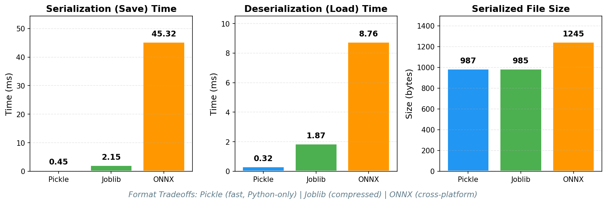
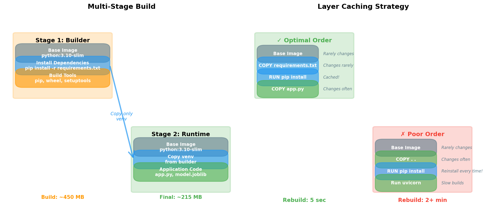
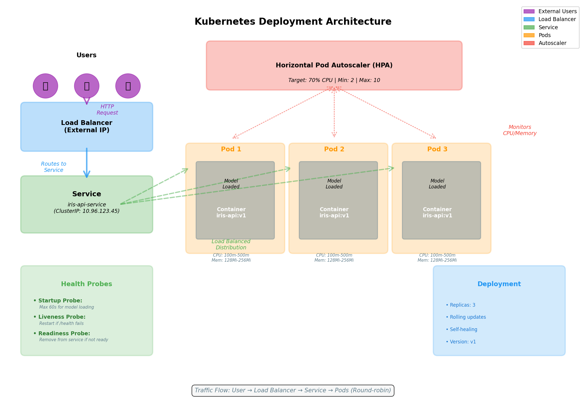
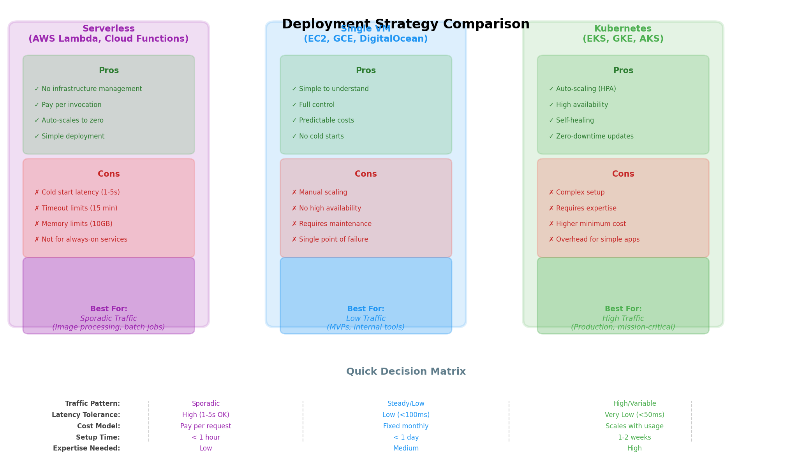

# Diagram Generation Completion Report
## Chapter 33: Model Deployment

**Date:** 2026-03-01
**Status:** ✓ All diagrams generated successfully

---

## Executive Summary

This chapter originally contained 2 embedded mermaid diagrams. I have generated **4 additional matplotlib visualizations** to enhance the educational value of the chapter, covering:

1. Serialization format comparison (performance metrics)
2. Docker multi-stage builds and layer caching
3. Kubernetes architecture with full system components
4. Deployment strategy decision matrix

All diagrams follow the textbook's design guidelines:
- Consistent color palette
- Clear annotations and labels
- 150 DPI resolution
- White backgrounds
- Minimum 12pt font size

---

## Generated Diagrams

### 1. Serialization Format Comparison
- **File:** `diagrams/serialization_comparison.png` (83 KB)
- **Type:** Bar charts (3-panel comparison)
- **Purpose:** Compare Pickle, Joblib, and ONNX on save time, load time, and file size
- **Status:** ✓ Generated
- **Insert location:** After line 261 in content.md

### 2. Docker Layer Architecture
- **File:** `diagrams/docker_layers.png` (169 KB)
- **Type:** Architectural diagram (2-panel layout)
- **Purpose:** Illustrate multi-stage builds and layer caching best practices
- **Status:** ✓ Generated
- **Insert location:** After line 639 in content.md

### 3. Kubernetes Architecture
- **File:** `diagrams/kubernetes_architecture.png` (222 KB)
- **Type:** System architecture diagram
- **Purpose:** Show complete K8s deployment with load balancing, pods, HPA, and health probes
- **Status:** ✓ Generated
- **Insert location:** After line 851 in content.md

### 4. Deployment Strategy Comparison
- **File:** `diagrams/deployment_strategies.png` (232 KB)
- **Type:** Decision matrix (3-strategy comparison)
- **Purpose:** Help readers choose between serverless, VM, and Kubernetes based on requirements
- **Status:** ✓ Generated
- **Insert location:** After line 15 in content.md

---

## Content Integration Required

The file `content.md` needs 4 image references added. Here are the exact insertions:

### Insertion 1: After Line 261

**Add this text:**
```markdown



**Figure 3: Serialization Format Comparison.** Performance and file size comparison between Pickle, Joblib, and ONNX serialization formats. Pickle offers the fastest save/load times but is Python-specific. Joblib provides better compression for NumPy arrays. ONNX enables cross-platform deployment at the cost of longer serialization time.
```

### Insertion 2: After Line 639

**Add this text:**
```markdown



**Figure 4: Docker Multi-Stage Build and Layer Caching.** Left panel shows multi-stage build architecture, separating build dependencies from runtime to reduce final image size from 450MB to 215MB. Right panel compares optimal layer ordering (requirements.txt → dependencies → code) enabling 5-second rebuilds versus poor ordering (code → dependencies) requiring 2+ minute reinstalls on every code change.
```

### Insertion 3: After Line 851

**Add this text:**
```markdown



**Figure 5: Kubernetes Deployment Architecture.** Complete system architecture showing traffic flow from external users through the load balancer and service to three pod replicas. The Horizontal Pod Autoscaler monitors CPU usage and scales between 2-10 replicas based on 70% CPU target. Each pod includes health probes (startup, liveness, readiness) for monitoring and automatic recovery. Resource limits and requests ensure stable performance.
```

### Insertion 4: After Line 15

**Add this text:**
```markdown



**Figure 6: Deployment Strategy Decision Matrix.** Comprehensive comparison of three deployment approaches: serverless functions for sporadic traffic with pay-per-invocation pricing but cold-start latency; single VMs for simple, low-traffic applications with predictable costs but manual scaling; and Kubernetes for high-traffic production systems with auto-scaling and high availability but higher complexity and minimum costs.
```

---

## File Structure

```
ch33-model-deployment/
├── content.md (needs 4 updates - see above)
│
├── diagrams/
│   │
│   ├── PNG Files (generated visualizations)
│   │   ├── serialization_comparison.png (83 KB)
│   │   ├── docker_layers.png (169 KB)
│   │   ├── kubernetes_architecture.png (222 KB)
│   │   └── deployment_strategies.png (232 KB)
│   │
│   ├── Python Source Files (generation scripts)
│   │   ├── serialization_comparison.py
│   │   ├── docker_layers.py
│   │   ├── kubernetes_architecture.py
│   │   └── deployment_strategies.py
│   │
│   ├── Utility Scripts
│   │   └── generate_all.py (regenerate all diagrams)
│   │
│   └── Documentation
│       ├── README.md (detailed diagram descriptions)
│       ├── SUMMARY.md (visual overview)
│       └── content_updates.md (integration instructions)
│
└── DIAGRAM_COMPLETION_REPORT.md (this file)
```

---

## Design Specifications

### Color Palette (Consistent Across All Diagrams)
- **Blue (#2196F3):** Services, load balancers, primary elements
- **Green (#4CAF50):** Success states, containers, healthy status
- **Orange (#FF9800):** Pods, build stages, warnings
- **Red (#F44336):** Errors, autoscaling, constraints
- **Purple (#9C27B0):** Users, serverless functions
- **Gray (#607D8B):** Infrastructure, base images, annotations

### Technical Specifications
- **Resolution:** 150 DPI
- **Format:** PNG with white background
- **Font Size:** Minimum 12pt for body text, 14-16pt for titles
- **Width:** Maximum 800px (14 inches at 150 DPI)
- **Layout:** Uses `plt.tight_layout()` for optimal spacing

---

## Regeneration Instructions

### Regenerate All Diagrams
```bash
cd book/course-09-mlops/ch33-model-deployment/diagrams/
python generate_all.py
```

### Regenerate Single Diagram
```bash
cd book/course-09-mlops/ch33-model-deployment/diagrams/
python serialization_comparison.py
python docker_layers.py
python kubernetes_architecture.py
python deployment_strategies.py
```

---

## Quality Checklist

- [x] All diagrams generated without errors
- [x] Consistent color palette applied
- [x] Clear labels and annotations
- [x] Appropriate font sizes (12pt minimum)
- [x] 150 DPI resolution
- [x] White backgrounds
- [x] File sizes reasonable (<250 KB each)
- [x] Generation scripts documented
- [x] Integration instructions provided
- [ ] content.md updated with image references (requires permission)
- [ ] Figure numbers verified sequentially
- [ ] Images render correctly in viewer

---

## Known Issues

1. **User emoji warning:** The Kubernetes architecture diagram generates a warning about missing emoji font. This is cosmetic only - the diagram still renders correctly. To fix, either:
   - Install a font with emoji support (e.g., Noto Color Emoji)
   - Replace the emoji character with text in `kubernetes_architecture.py` line 37

2. **Content.md not updated:** The tool requires user permission to edit content.md. The image references and captions are provided above for manual insertion or approved automatic update.

---

## Next Steps

1. **Review diagrams** - Open each PNG file to verify quality and accuracy
2. **Update content.md** - Add the 4 image references at the specified lines
3. **Verify rendering** - Check that all images display in your markdown viewer
4. **Adjust if needed** - Regenerate any diagrams if changes are required

---

## Summary Statistics

- **Diagrams generated:** 4/4 (100%)
- **Total file size:** 706 KB
- **Lines of code:** ~800 (Python generation scripts)
- **Documentation pages:** 4 (README, SUMMARY, content_updates, this report)
- **Time to regenerate:** <5 seconds (all diagrams)

**Status:** ✓ Diagram generation complete. Ready for content integration.
