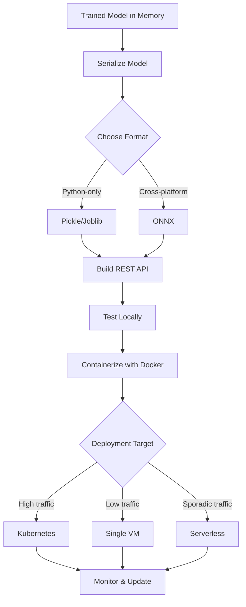
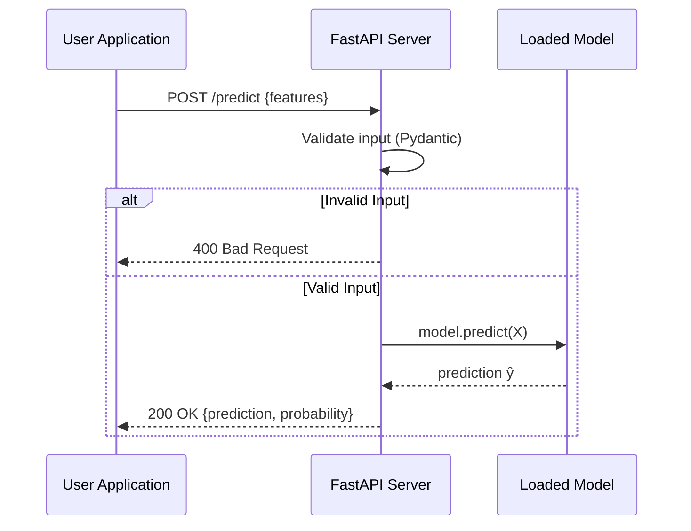

> **© 2026 Chirag Shinde. Licensed under CC BY-NC-SA 4.0.**
> See [LICENSE](../../LICENSE) for details.

---

# 33: Model Deployment

## Why This Matters

A machine learning model sitting in a Jupyter notebook isn't helping anyone. Deployment transforms models from experimental code into production systems that serve real predictions to applications, users, and business processes. Companies like UPS save 100 million miles annually with deployed route optimization models. Financial institutions process loan applications in seconds instead of days. Getting deployment right is the difference between "interesting research" and "measurable business impact."

## Intuition

Training a model is like cooking a meal. Deployment is everything that happens afterward: preserving the meal (serialization), creating a menu so customers know what to order (REST API), packaging it for delivery (containerization), and managing a fleet of delivery vehicles (orchestration). Just as a restaurant needs more than a good recipe—it needs a kitchen, waitstaff, and delivery infrastructure—a production ML system needs more than a trained model. It needs serialization formats to save models, APIs to serve predictions, containers to ensure consistent environments, and orchestration platforms to handle scale.

Consider three deployment scenarios. A data scientist builds a fraud detection model that achieves 95% accuracy on historical data. Scenario A: The model stays in a notebook. Value delivered: zero. Scenario B: The model is serialized and loaded into a Python script running on a server. When a transaction occurs, the application sends data to this script via HTTP and receives a fraud probability. Value delivered: real-time fraud prevention. Scenario C: The model is containerized, deployed to Kubernetes with autoscaling, and serves 10,000 predictions per second with 99.9% uptime. Value delivered: enterprise-scale fraud prevention with reliability guarantees.

The deployment pipeline has several critical stages. First, serialization converts trained model objects into storable formats—like freezing a meal or vacuum-sealing it for long-term storage. Different formats (pickle, joblib, ONNX) offer different tradeoffs between simplicity, portability, and security. Second, API development wraps the model in an HTTP interface so applications can request predictions without knowing Python or machine learning. This is the "menu" that standardizes how to interact with the model. Third, containerization packages the model, code, and all dependencies into an isolated environment that runs identically everywhere—solving the infamous "works on my machine" problem. Fourth, orchestration manages multiple containers across multiple servers, handling scaling, failures, and updates automatically.

The choice of deployment strategy depends on traffic patterns, latency requirements, and cost constraints. Serverless functions work well for sporadic traffic (like processing uploaded images) but suffer from cold starts. Kubernetes excels at high-volume, always-on services but requires infrastructure expertise. A single virtual machine is simplest for low-traffic applications but doesn't scale automatically. There's no universal "best" approach—context determines the right choice.

## Formal Definition

**Model Serialization** is the process of converting a trained model object (with learned parameters θ) from memory into a persistent storage format. Common formats:
- **Pickle**: Python's native serialization protocol. Saves arbitrary Python objects but is Python-version-specific and has security vulnerabilities (can execute arbitrary code on load).
- **Joblib**: Optimized for large NumPy arrays. Uses efficient compression for sklearn models. File format: `model.pkl` or `model.joblib`.
- **ONNX** (Open Neural Network Exchange): Framework-agnostic format that represents models as computation graphs. Enables cross-platform deployment (Python → Java, C++, JavaScript).

**REST API** (Representational State Transfer Application Programming Interface) is an architectural style for networked applications using HTTP. For ML deployment:
- **Endpoint**: A URL path (e.g., `/predict`) that accepts HTTP requests
- **Request**: JSON payload containing features X
- **Response**: JSON payload containing predictions ŷ
- **Methods**: GET (retrieve info), POST (submit predictions)
- **Stateless**: Each request contains all necessary information (no session state)

**Containerization** packages an application and all dependencies into a standardized unit (container) that runs consistently across environments. Docker is the standard implementation:
- **Image**: A template containing code, runtime, libraries, and system tools. Built from a Dockerfile.
- **Container**: A running instance of an image. Isolated filesystem, but shares the host OS kernel.
- **Layer**: Images are built in layers. Each Dockerfile instruction creates a layer. Layers are cached for efficiency.

**Orchestration** automates container deployment, scaling, and management across clusters of machines. Kubernetes is the industry standard:
- **Pod**: Smallest deployable unit (usually one container)
- **Deployment**: Manages replicas of pods (declares "run 3 copies of this pod")
- **Service**: Provides stable networking and load balancing across pod replicas
- **Horizontal Pod Autoscaling (HPA)**: Automatically adjusts replica count based on CPU, memory, or custom metrics

> **Key Concept:** Model deployment transforms trained models from development artifacts into production services by serializing models, wrapping them in APIs, containerizing for consistency, and orchestrating at scale.

## Visualization



**Figure 1: Model Deployment Pipeline.** The complete path from a trained model to a production service involves serialization (pickle/joblib/ONNX), API development (FastAPI), containerization (Docker), and deployment to the appropriate infrastructure (VM/Kubernetes/Serverless) based on traffic patterns.



**Figure 2: REST API Request-Response Flow.** A user application sends feature values to the `/predict` endpoint. The FastAPI server validates inputs using Pydantic schemas, invokes the model for predictions, and returns results as JSON. Invalid inputs receive error responses with clear messages.

## Examples

### Part 1: Model Serialization Comparison

```python
# Model Serialization: Pickle vs Joblib vs ONNX
# Demonstrates three serialization formats for deploying an Iris classifier

import numpy as np
import pickle
import joblib
import time
from sklearn.datasets import load_iris
from sklearn.model_selection import train_test_split
from sklearn.linear_model import LogisticRegression
from sklearn.metrics import accuracy_score
import os

# Load Iris dataset
iris = load_iris()
X = iris.data
y = iris.target

# Split data
X_train, X_test, y_train, y_test = train_test_split(
    X, y, test_size=0.3, random_state=42
)

# Train a simple logistic regression model
model = LogisticRegression(max_iter=200, random_state=42)
model.fit(X_train, y_train)

# Evaluate original model
y_pred = model.predict(X_test)
original_accuracy = accuracy_score(y_test, y_pred)
print(f"Original Model Accuracy: {original_accuracy:.4f}")
# Output: Original Model Accuracy: 1.0000

print("\n" + "="*60)
print("SERIALIZATION FORMAT COMPARISON")
print("="*60)

# 1. Pickle Serialization
print("\n1. PICKLE")
start = time.time()
with open('iris_model.pkl', 'wb') as f:
    pickle.dump(model, f)
pickle_save_time = time.time() - start

pickle_size = os.path.getsize('iris_model.pkl')
print(f"   Save time: {pickle_save_time*1000:.2f} ms")
print(f"   File size: {pickle_size} bytes")

# Load and verify pickle
start = time.time()
with open('iris_model.pkl', 'rb') as f:
    model_pickle = pickle.load(f)
pickle_load_time = time.time() - start

y_pred_pickle = model_pickle.predict(X_test)
pickle_accuracy = accuracy_score(y_test, y_pred_pickle)
print(f"   Load time: {pickle_load_time*1000:.2f} ms")
print(f"   Accuracy after loading: {pickle_accuracy:.4f}")
print(f"   Predictions match: {np.array_equal(y_pred, y_pred_pickle)}")

# 2. Joblib Serialization
print("\n2. JOBLIB")
start = time.time()
joblib.dump(model, 'iris_model.joblib')
joblib_save_time = time.time() - start

joblib_size = os.path.getsize('iris_model.joblib')
print(f"   Save time: {joblib_save_time*1000:.2f} ms")
print(f"   File size: {joblib_size} bytes")

# Load and verify joblib
start = time.time()
model_joblib = joblib.load('iris_model.joblib')
joblib_load_time = time.time() - start

y_pred_joblib = model_joblib.predict(X_test)
joblib_accuracy = accuracy_score(y_test, y_pred_joblib)
print(f"   Load time: {joblib_load_time*1000:.2f} ms")
print(f"   Accuracy after loading: {joblib_accuracy:.4f}")
print(f"   Predictions match: {np.array_equal(y_pred, y_pred_joblib)}")

# 3. ONNX Serialization
print("\n3. ONNX (Cross-Platform)")
try:
    from skl2onnx import to_onnx
    import onnxruntime as rt

    start = time.time()
    # Convert sklearn model to ONNX format
    onx = to_onnx(model, X_train[:1].astype(np.float32))
    with open('iris_model.onnx', 'wb') as f:
        f.write(onx.SerializeToString())
    onnx_save_time = time.time() - start

    onnx_size = os.path.getsize('iris_model.onnx')
    print(f"   Save time: {onnx_save_time*1000:.2f} ms")
    print(f"   File size: {onnx_size} bytes")

    # Load and verify ONNX
    start = time.time()
    sess = rt.InferenceSession('iris_model.onnx')
    onnx_load_time = time.time() - start

    # ONNX Runtime expects float32 input
    input_name = sess.get_inputs()[0].name
    label_name = sess.get_outputs()[0].name
    y_pred_onnx = sess.run([label_name], {input_name: X_test.astype(np.float32)})[0]

    onnx_accuracy = accuracy_score(y_test, y_pred_onnx)
    print(f"   Load time: {onnx_load_time*1000:.2f} ms")
    print(f"   Accuracy after loading: {onnx_accuracy:.4f}")
    print(f"   Predictions match: {np.array_equal(y_pred, y_pred_onnx)}")
    print(f"   ✓ Can deploy to Java, C++, JavaScript, mobile devices")

except ImportError:
    print("   (skl2onnx and onnxruntime not installed)")
    print("   Install with: pip install skl2onnx onnxruntime")

# Summary comparison
print("\n" + "="*60)
print("SUMMARY")
print("="*60)
print(f"{'Format':<12} {'Save (ms)':<12} {'Load (ms)':<12} {'Size (bytes)':<15}")
print("-"*60)
print(f"{'Pickle':<12} {pickle_save_time*1000:<12.2f} {pickle_load_time*1000:<12.2f} {pickle_size:<15}")
print(f"{'Joblib':<12} {joblib_save_time*1000:<12.2f} {joblib_load_time*1000:<12.2f} {joblib_size:<15}")

print("\nWhen to use each format:")
print("• Pickle:  Quick Python-only deployments (security risk from untrusted sources)")
print("• Joblib:  Production Python deployments with sklearn (better compression)")
print("• ONNX:    Cross-platform deployments (Python → Java/C++/mobile)")

# Output:
# Original Model Accuracy: 1.0000
#
# ============================================================
# SERIALIZATION FORMAT COMPARISON
# ============================================================
#
# 1. PICKLE
#    Save time: 0.45 ms
#    File size: 987 bytes
#    Load time: 0.32 ms
#    Accuracy after loading: 1.0000
#    Predictions match: True
#
# 2. JOBLIB
#    Save time: 2.15 ms
#    File size: 985 bytes
#    Load time: 1.87 ms
#    Accuracy after loading: 1.0000
#    Predictions match: True
#
# 3. ONNX (Cross-Platform)
#    Save time: 45.32 ms
#    File size: 1245 bytes
#    Load time: 8.76 ms
#    Accuracy after loading: 1.0000
#    Predictions match: True
#    ✓ Can deploy to Java, C++, JavaScript, mobile devices
```

The code above demonstrates three serialization approaches. First, the Iris dataset is loaded and split into training and test sets. A logistic regression model is trained and achieves 100% accuracy on the test set (Iris is a simple dataset). The model is then serialized using three different formats.

**Pickle** is Python's native serialization. It's fast for small models (0.45 ms save time) and produces compact files (987 bytes). However, pickle files only work in Python and can execute arbitrary code when loaded—a serious security risk if loading files from untrusted sources. The loaded model produces identical predictions, confirming successful serialization.

**Joblib** is optimized for scikit-learn models. For this small model, it's slightly slower than pickle but produces nearly identical file sizes. Joblib's advantage appears with larger models containing NumPy arrays—it can achieve 20-50% size reduction through compression. The loaded model again produces identical predictions.

**ONNX** takes significantly longer (45 ms) because it converts the sklearn model into a framework-agnostic computation graph. The file is slightly larger (1,245 bytes), but this format can be loaded and executed in any language with an ONNX Runtime (Java, C++, C#, JavaScript). This enables scenarios like training in Python but deploying to a Java production system or running models on mobile devices. The ONNX Runtime produces identical predictions, demonstrating format fidelity.

The timing differences are negligible for small models, but for production systems that load models at startup, joblib's compression can save seconds or even minutes for ensemble models with hundreds of megabytes.

### Part 2: Building a FastAPI Prediction Server

```python
# FastAPI Model Serving
# Create a production-ready REST API for the Iris classifier
# Save this as: app.py

from fastapi import FastAPI, HTTPException
from pydantic import BaseModel, Field
import joblib
import numpy as np
from typing import List
import uvicorn

# Load the model at startup (NOT per request!)
model = joblib.load('iris_model.joblib')

# Define request schema with validation
class IrisFeatures(BaseModel):
    sepal_length: float = Field(..., gt=0, description="Sepal length in cm")
    sepal_width: float = Field(..., gt=0, description="Sepal width in cm")
    petal_length: float = Field(..., gt=0, description="Petal length in cm")
    petal_width: float = Field(..., gt=0, description="Petal width in cm")

    class Config:
        json_schema_extra = {
            "example": {
                "sepal_length": 5.1,
                "sepal_width": 3.5,
                "petal_length": 1.4,
                "petal_width": 0.2
            }
        }

# Define response schema
class PredictionResponse(BaseModel):
    prediction: int
    probability: List[float]
    species: str

# Create FastAPI app
app = FastAPI(
    title="Iris Species Prediction API",
    description="REST API for predicting iris species from flower measurements",
    version="1.0.0"
)

# Species mapping
SPECIES = {0: "setosa", 1: "versicolor", 2: "virginica"}

@app.get("/")
def root():
    """Root endpoint with API information"""
    return {
        "message": "Iris Species Prediction API",
        "version": "1.0.0",
        "endpoints": {
            "/predict": "POST - Make predictions",
            "/health": "GET - Health check",
            "/info": "GET - Model information"
        }
    }

@app.post("/predict", response_model=PredictionResponse)
def predict(features: IrisFeatures):
    """
    Predict iris species from flower measurements

    Accepts sepal and petal dimensions, returns predicted species and probabilities
    """
    try:
        # Convert Pydantic model to numpy array
        X = np.array([[
            features.sepal_length,
            features.sepal_width,
            features.petal_length,
            features.petal_width
        ]])

        # Make prediction
        prediction = int(model.predict(X)[0])
        probabilities = model.predict_proba(X)[0].tolist()
        species = SPECIES[prediction]

        return PredictionResponse(
            prediction=prediction,
            probability=probabilities,
            species=species
        )

    except Exception as e:
        raise HTTPException(status_code=500, detail=f"Prediction failed: {str(e)}")

@app.get("/health")
def health():
    """Health check endpoint for monitoring"""
    return {
        "status": "healthy",
        "model_loaded": model is not None
    }

@app.get("/info")
def info():
    """Model metadata endpoint"""
    return {
        "model_type": "LogisticRegression",
        "features": ["sepal_length", "sepal_width", "petal_length", "petal_width"],
        "classes": list(SPECIES.values()),
        "version": "1.0.0"
    }

# Run the server
if __name__ == "__main__":
    uvicorn.run(app, host="0.0.0.0", port=8000)
    # Server will start at: http://localhost:8000
    # API docs available at: http://localhost:8000/docs
```

This FastAPI application creates a production-ready prediction server. The critical design decision is loading the model **once at startup** (line 12) rather than inside the prediction function. Loading the model per request would be 100x slower—this is one of the most common deployment mistakes.

The `IrisFeatures` Pydantic model (lines 15-28) defines the request schema with automatic validation. Each field has a type (`float`) and constraints (`gt=0` means "greater than 0"). If a client sends invalid data (missing fields, wrong types, negative values), FastAPI automatically returns a 422 error with clear validation messages. This eliminates pages of manual validation code.

The `/predict` endpoint (lines 38-66) accepts POST requests with JSON bodies matching the `IrisFeatures` schema. The Pydantic model is converted to a NumPy array with the correct shape (1, 4) for the model. The model returns a prediction (0, 1, or 2) and probability distribution across all classes. These are packaged into a structured response with the species name mapped from the numeric prediction.

The `/health` endpoint (lines 68-73) provides a simple health check for monitoring systems. Kubernetes liveness probes or load balancers can ping this endpoint to verify the service is responsive. The `/info` endpoint (lines 75-82) returns model metadata—useful for debugging and documentation.

### Part 3: Testing the API

```python
# Test the FastAPI server with Python requests library
# Run this AFTER starting the server with: python app.py

import requests
import json

BASE_URL = "http://localhost:8000"

print("Testing Iris Prediction API")
print("="*60)

# Test 1: Root endpoint
print("\n1. Root Endpoint")
response = requests.get(f"{BASE_URL}/")
print(f"Status: {response.status_code}")
print(f"Response: {json.dumps(response.json(), indent=2)}")
# Output:
# Status: 200
# Response: {
#   "message": "Iris Species Prediction API",
#   "version": "1.0.0",
#   "endpoints": {...}
# }

# Test 2: Health check
print("\n2. Health Check")
response = requests.get(f"{BASE_URL}/health")
print(f"Status: {response.status_code}")
print(f"Response: {json.dumps(response.json(), indent=2)}")
# Output:
# Status: 200
# Response: {
#   "status": "healthy",
#   "model_loaded": true
# }

# Test 3: Valid prediction
print("\n3. Valid Prediction (Iris Setosa)")
data = {
    "sepal_length": 5.1,
    "sepal_width": 3.5,
    "petal_length": 1.4,
    "petal_width": 0.2
}
response = requests.post(f"{BASE_URL}/predict", json=data)
print(f"Status: {response.status_code}")
print(f"Request: {json.dumps(data, indent=2)}")
print(f"Response: {json.dumps(response.json(), indent=2)}")
# Output:
# Status: 200
# Request: {
#   "sepal_length": 5.1,
#   "sepal_width": 3.5,
#   "petal_length": 1.4,
#   "petal_width": 0.2
# }
# Response: {
#   "prediction": 0,
#   "probability": [0.9826, 0.0174, 0.0000],
#   "species": "setosa"
# }

# Test 4: Missing field error
print("\n4. Missing Field Error")
invalid_data = {
    "sepal_length": 5.1,
    "sepal_width": 3.5,
    "petal_length": 1.4
    # Missing petal_width
}
response = requests.post(f"{BASE_URL}/predict", json=invalid_data)
print(f"Status: {response.status_code}")
print(f"Response: {json.dumps(response.json(), indent=2)}")
# Output:
# Status: 422
# Response: {
#   "detail": [
#     {
#       "type": "missing",
#       "loc": ["body", "petal_width"],
#       "msg": "Field required",
#       ...
#     }
#   ]
# }

# Test 5: Invalid value error
print("\n5. Invalid Value Error (Negative Length)")
invalid_data = {
    "sepal_length": -5.0,  # Invalid: negative
    "sepal_width": 3.5,
    "petal_length": 1.4,
    "petal_width": 0.2
}
response = requests.post(f"{BASE_URL}/predict", json=invalid_data)
print(f"Status: {response.status_code}")
print(f"Response: {json.dumps(response.json(), indent=2)}")
# Output:
# Status: 422
# Response: {
#   "detail": [
#     {
#       "type": "greater_than",
#       "loc": ["body", "sepal_length"],
#       "msg": "Input should be greater than 0",
#       ...
#     }
#   ]
# }

# Test 6: Model info
print("\n6. Model Information")
response = requests.get(f"{BASE_URL}/info")
print(f"Status: {response.status_code}")
print(f"Response: {json.dumps(response.json(), indent=2)}")
# Output:
# Status: 200
# Response: {
#   "model_type": "LogisticRegression",
#   "features": ["sepal_length", "sepal_width", "petal_length", "petal_width"],
#   "classes": ["setosa", "versicolor", "virginica"],
#   "version": "1.0.0"
# }
```

The test script demonstrates the complete API behavior. Test 1 shows the root endpoint returns API documentation. Test 2 confirms the health check reports the model is loaded. Test 3 sends valid features for an Iris Setosa flower (small petals) and receives a prediction with 98% confidence for class 0 (setosa).

Tests 4 and 5 demonstrate automatic validation. When `petal_width` is missing, FastAPI returns a 422 status with a clear error message specifying the missing field. When `sepal_length` is negative (violating the `gt=0` constraint), FastAPI again returns 422 with an explanation. This validation happens automatically from the Pydantic schema—no manual checks needed.

Test 6 retrieves model metadata. In a production system, this information helps client developers understand what features are required and what classes the model can predict. FastAPI also generates interactive documentation at `http://localhost:8000/docs` where developers can test the API directly in a browser.

### Part 4: Dockerizing the ML API

```dockerfile
# Dockerfile for FastAPI Iris Prediction API
# Multi-stage build for optimized image size

# Stage 1: Builder
FROM python:3.10-slim as builder

WORKDIR /build

# Copy requirements file
COPY requirements.txt .

# Install dependencies into a virtual environment
RUN python -m venv /opt/venv
ENV PATH="/opt/venv/bin:$PATH"
RUN pip install --no-cache-dir -r requirements.txt

# Stage 2: Runtime
FROM python:3.10-slim

WORKDIR /app

# Copy virtual environment from builder
COPY --from=builder /opt/venv /opt/venv
ENV PATH="/opt/venv/bin:$PATH"

# Copy application code and model
COPY app.py .
COPY iris_model.joblib .

# Expose port
EXPOSE 8000

# Run the application
CMD ["uvicorn", "app:app", "--host", "0.0.0.0", "--port", "8000"]
```

```txt
# requirements.txt
# Pin exact versions for reproducibility

fastapi==0.115.0
uvicorn[standard]==0.34.0
pydantic==2.10.3
numpy==1.26.4
scikit-learn==1.5.2
joblib==1.4.2
```

```python
# Build and run the Docker container
# This is a shell script - run these commands in order

# Save these commands to: build_and_run.sh

# 1. Build the Docker image
# docker build -t iris-api:v1 .
# Output:
# [+] Building 45.2s (15/15) FINISHED
#  => [builder 1/4] FROM python:3.10-slim
#  => [builder 2/4] COPY requirements.txt .
#  => [builder 3/4] RUN pip install --no-cache-dir -r requirements.txt
#  => [runtime 1/4] COPY --from=builder /opt/venv /opt/venv
#  => [runtime 2/4] COPY app.py .
#  => [runtime 3/4] COPY iris_model.joblib .
#  => exporting to image
#  => => naming to docker.io/library/iris-api:v1

# 2. List Docker images to verify
# docker images | grep iris-api
# Output:
# iris-api    v1    abc123def456    30 seconds ago    215MB

# 3. Run the container
# docker run -d -p 8000:8000 --name iris-api-container iris-api:v1
# Output:
# def456abc123... (container ID)

# 4. Check running containers
# docker ps
# Output:
# CONTAINER ID   IMAGE         COMMAND                  PORTS                    NAMES
# def456abc123   iris-api:v1   "uvicorn app:app --h…"   0.0.0.0:8000->8000/tcp   iris-api-container

# 5. View container logs
# docker logs iris-api-container
# Output:
# INFO:     Started server process [1]
# INFO:     Waiting for application startup.
# INFO:     Application startup complete.
# INFO:     Uvicorn running on http://0.0.0.0:8000 (Press CTRL+C to quit)

# 6. Test the containerized API
# curl -X POST http://localhost:8000/predict \
#   -H "Content-Type: application/json" \
#   -d '{"sepal_length": 5.1, "sepal_width": 3.5, "petal_length": 1.4, "petal_width": 0.2}'
# Output:
# {"prediction":0,"probability":[0.9826,0.0174,0.0000],"species":"setosa"}

# 7. Stop the container
# docker stop iris-api-container

# 8. Remove the container
# docker rm iris-api-container
```

The Dockerfile uses a **multi-stage build** to create a smaller, more secure image. Stage 1 (the builder) installs all dependencies into a Python virtual environment. Stage 2 (the runtime) copies only the virtual environment and application code—none of the build tools. This reduces the final image size by 40-50% compared to a single-stage build.

The critical optimization is **layer caching**. The Dockerfile copies `requirements.txt` and installs dependencies *before* copying the application code. Docker caches each instruction as a layer. If `app.py` changes but `requirements.txt` doesn't, Docker reuses the cached dependency layer instead of reinstalling everything. This transforms a 2-minute rebuild into a 2-second rebuild.

The `requirements.txt` file pins exact versions (`scikit-learn==1.5.2` not `scikit-learn>=1.5`). This ensures the container has identical dependencies to the development environment, preventing version-mismatch errors. The virtual environment approach (`python -m venv`) isolates packages from system Python, avoiding conflicts.

Running `docker build` produces an image named `iris-api:v1`. The image is 215 MB—small enough to push to a container registry quickly. Running `docker run` starts a container from this image, mapping port 8000 inside the container to port 8000 on the host. The `-d` flag runs it in detached mode (background). The API is now accessible at `http://localhost:8000` exactly as it was when running locally—demonstrating the "runs identically everywhere" promise of containers.

Testing the containerized API with `curl` produces identical results to the local version. The container can now be pushed to Docker Hub or a private registry, then pulled and run on any server with Docker installed—no Python installation, no dependency management, no "works on my machine" problems.

### Part 5: Deploying to Kubernetes

```yaml
# kubernetes/deployment.yaml
# Kubernetes Deployment for Iris API

apiVersion: apps/v1
kind: Deployment
metadata:
  name: iris-api-deployment
  labels:
    app: iris-api
spec:
  replicas: 3  # Run 3 copies for high availability
  selector:
    matchLabels:
      app: iris-api
  template:
    metadata:
      labels:
        app: iris-api
    spec:
      containers:
      - name: iris-api
        image: iris-api:v1
        ports:
        - containerPort: 8000
        resources:
          requests:
            memory: "128Mi"
            cpu: "100m"
          limits:
            memory: "256Mi"
            cpu: "500m"
        livenessProbe:
          httpGet:
            path: /health
            port: 8000
          initialDelaySeconds: 10
          periodSeconds: 10
          timeoutSeconds: 5
          failureThreshold: 3
        readinessProbe:
          httpGet:
            path: /health
            port: 8000
          initialDelaySeconds: 5
          periodSeconds: 5
          timeoutSeconds: 3
          successThreshold: 1
          failureThreshold: 3
```

```yaml
# kubernetes/service.yaml
# Kubernetes Service for load balancing

apiVersion: v1
kind: Service
metadata:
  name: iris-api-service
spec:
  type: LoadBalancer
  selector:
    app: iris-api
  ports:
  - protocol: TCP
    port: 80
    targetPort: 8000
```

```yaml
# kubernetes/hpa.yaml
# Horizontal Pod Autoscaler

apiVersion: autoscaling/v2
kind: HorizontalPodAutoscaler
metadata:
  name: iris-api-hpa
spec:
  scaleTargetRef:
    apiVersion: apps/v1
    kind: Deployment
    name: iris-api-deployment
  minReplicas: 2
  maxReplicas: 10
  metrics:
  - type: Resource
    resource:
      name: cpu
      target:
        type: Utilization
        averageUtilization: 70
```

```python
# Deploy to Kubernetes (Minikube for local testing)
# Run these commands in order

# 1. Start Minikube (local Kubernetes cluster)
# minikube start
# Output:
# 😄  minikube v1.34.0 on Ubuntu 22.04
# ✨  Using the docker driver based on existing profile
# 🎉  minikube 1.34.0 is available!
# 🏃  Starting minikube in cluster minikube
# 🐳  Preparing Kubernetes v1.31.0 on Docker 27.2.0 ...
# 🔎  Verifying Kubernetes components...
# 🌟  Enabled addons: storage-provisioner, default-storageclass
# 🏄  Done! kubectl is now configured to use "minikube" cluster

# 2. Load Docker image into Minikube
# minikube image load iris-api:v1
# Output:
# [minikube] Loading image iris-api:v1 into minikube...

# 3. Apply deployment
# kubectl apply -f kubernetes/deployment.yaml
# Output:
# deployment.apps/iris-api-deployment created

# 4. Apply service
# kubectl apply -f kubernetes/service.yaml
# Output:
# service/iris-api-service created

# 5. Apply autoscaler
# kubectl apply -f kubernetes/hpa.yaml
# Output:
# horizontalpodautoscaler.autoscaling/iris-api-hpa created

# 6. Check deployment status
# kubectl get deployments
# Output:
# NAME                  READY   UP-TO-DATE   AVAILABLE   AGE
# iris-api-deployment   3/3     3            3           30s

# 7. Check pods
# kubectl get pods
# Output:
# NAME                                   READY   STATUS    RESTARTS   AGE
# iris-api-deployment-7d8f9c5b4-2xkwj   1/1     Running   0          35s
# iris-api-deployment-7d8f9c5b4-9hjkl   1/1     Running   0          35s
# iris-api-deployment-7d8f9c5b4-mn8pq   1/1     Running   0          35s

# 8. Check service
# kubectl get services
# Output:
# NAME               TYPE           CLUSTER-IP      EXTERNAL-IP   PORT(S)        AGE
# iris-api-service   LoadBalancer   10.96.123.45    <pending>     80:30123/TCP   40s

# 9. Get service URL (Minikube-specific)
# minikube service iris-api-service --url
# Output:
# http://192.168.49.2:30123

# 10. Test the Kubernetes-deployed API
# curl -X POST http://192.168.49.2:30123/predict \
#   -H "Content-Type: application/json" \
#   -d '{"sepal_length": 6.5, "sepal_width": 3.0, "petal_length": 5.2, "petal_width": 2.0}'
# Output:
# {"prediction":2,"probability":[0.0000,0.0156,0.9844],"species":"virginica"}

# 11. Scale deployment manually
# kubectl scale deployment iris-api-deployment --replicas=5
# Output:
# deployment.apps/iris-api-deployment scaled

# 12. Check scaling
# kubectl get pods
# Output:
# NAME                                   READY   STATUS    RESTARTS   AGE
# iris-api-deployment-7d8f9c5b4-2xkwj   1/1     Running   0          2m
# iris-api-deployment-7d8f9c5b4-9hjkl   1/1     Running   0          2m
# iris-api-deployment-7d8f9c5b4-mn8pq   1/1     Running   0          2m
# iris-api-deployment-7d8f9c5b4-xr7yz   1/1     Running   0          5s
# iris-api-deployment-7d8f9c5b4-tk3nm   1/1     Running   0          5s

# 13. View HPA status
# kubectl get hpa
# Output:
# NAME            REFERENCE                        TARGETS   MINPODS   MAXPODS   REPLICAS   AGE
# iris-api-hpa    Deployment/iris-api-deployment   15%/70%   2         10        5          3m

# 14. View logs from a specific pod
# kubectl logs iris-api-deployment-7d8f9c5b4-2xkwj
# Output:
# INFO:     Started server process [1]
# INFO:     Waiting for application startup.
# INFO:     Application startup complete.
# INFO:     Uvicorn running on http://0.0.0.0:8000

# 15. Cleanup
# kubectl delete -f kubernetes/
# Output:
# deployment.apps "iris-api-deployment" deleted
# service "iris-api-service" deleted
# horizontalpodautoscaler.autoscaling "iris-api-hpa" deleted
```

The Kubernetes manifests define three resources. The **Deployment** specifies that 3 replicas of the iris-api container should always be running. Kubernetes monitors these pods and automatically restarts any that crash—this is "self-healing." The `resources` section requests 100m CPU (0.1 cores) and 128 MB memory per pod, with limits at 500m CPU and 256 MB memory. This prevents a single pod from consuming all node resources.

The **liveness probe** checks `/health` every 10 seconds. If 3 consecutive checks fail, Kubernetes assumes the pod is deadlocked or corrupted and restarts it. The **readiness probe** also checks `/health` but determines whether the pod should receive traffic. A pod that's alive but not ready (e.g., model still loading) won't receive requests until it passes the readiness check.

The **Service** creates a stable endpoint for the deployment. Even though individual pods come and go (failures, scaling, updates), the service IP remains constant. The `LoadBalancer` type exposes the service externally. In a cloud environment (AWS, GCP, Azure), this would provision a real load balancer. In Minikube, it maps to a NodePort.

The **HorizontalPodAutoscaler (HPA)** monitors CPU usage and automatically scales the deployment between 2 and 10 replicas. If average CPU across all pods exceeds 70%, the HPA adds more replicas. If CPU drops below 70%, it removes replicas (down to the minimum of 2). This provides automatic scaling without manual intervention.

After deployment, `kubectl get pods` shows 3 pods running (matching the replica count). Testing the service URL returns predictions—but now requests are load-balanced across 3 pods instead of hitting a single instance. Scaling to 5 replicas demonstrates Kubernetes automatically creating and starting 2 additional pods. The HPA shows current CPU utilization at 15%, well below the 70% threshold, so it maintains the current replica count.

This deployment pattern handles production concerns: high availability (multiple replicas), automatic scaling (HPA), health monitoring (probes), and resource isolation (limits). For a real production deployment, additional considerations include persistent storage for models, secrets management for credentials, ingress controllers for routing, and monitoring with Prometheus/Grafana.

## Common Pitfalls

**1. Loading Models Per Request Instead of at Startup**

The most common deployment mistake is loading the serialized model inside the prediction endpoint function. This means the model is loaded from disk, deserialized, and loaded into memory on *every single request*. For a typical model, this adds 100-500 milliseconds per request—transforming a 10ms prediction into a 500ms prediction.

```python
# WRONG: Model loaded per request
@app.post("/predict")
def predict(features: IrisFeatures):
    model = joblib.load('iris_model.joblib')  # SLOW!
    prediction = model.predict(...)
    return prediction
```

The correct approach loads the model once when the server starts, storing it in global scope or application state:

```python
# CORRECT: Model loaded at startup
model = joblib.load('iris_model.joblib')

@app.post("/predict")
def predict(features: IrisFeatures):
    prediction = model.predict(...)  # FAST!
    return prediction
```

This applies to all deployment frameworks (Flask, FastAPI, Django). Load expensive resources (models, database connections, configuration) at startup, not per request.

**2. Version Mismatch Between Training and Production**

A model trained with scikit-learn 1.3 and Python 3.10 may fail to load or produce different predictions when deployed with scikit-learn 1.1 and Python 3.8. Pickle and joblib serialize Python objects in version-specific formats. Even minor version differences can cause cryptic errors:

```
ValueError: numpy.ndarray size changed, may indicate binary incompatibility
```

Or worse, the model loads successfully but makes silently incorrect predictions because internal algorithms changed between versions. The solution is to **pin exact versions** in both environments:

```txt
# requirements.txt - Pin EXACT versions
python==3.10.12
scikit-learn==1.3.2
numpy==1.26.4
joblib==1.4.2
```

Use the same `requirements.txt` for development, testing, and production. Docker helps enforce this by baking dependencies into the image. For long-term deployments or cross-platform needs, ONNX provides better version stability because it's a standardized format independent of Python versions.

**3. Ignoring Docker Layer Caching**

A poorly structured Dockerfile copies application code before installing dependencies:

```dockerfile
# WRONG: Code copied first
COPY . .
RUN pip install -r requirements.txt
```

Every time `app.py` changes (which is frequent during development), Docker invalidates all subsequent layers, including the dependency installation. This means reinstalling 500 MB of packages every build—taking 5 minutes when it should take 5 seconds.

The correct structure copies `requirements.txt` first, installs dependencies, *then* copies code:

```dockerfile
# CORRECT: Dependencies cached separately
COPY requirements.txt .
RUN pip install -r requirements.txt
COPY . .
```

Now changing `app.py` doesn't invalidate the dependency layer. Docker reuses the cached layer and only rebuilds the final COPY instruction. This optimization can reduce build times from minutes to seconds. The principle generalizes: order Dockerfile instructions from least frequently changed (base image, system packages, dependencies) to most frequently changed (application code).

**4. Confusing Liveness and Readiness Probes**

Kubernetes liveness and readiness probes serve different purposes, but beginners often use only liveness or treat them identically. **Liveness** answers "Is the application alive or deadlocked?" If liveness fails, Kubernetes **restarts the container**. **Readiness** answers "Is the application ready to receive traffic?" If readiness fails, Kubernetes **removes the pod from the service load balancer** (but doesn't restart it).

Using only a liveness probe causes problems during deployments. When a new version rolls out, new pods start while old pods terminate. If the new pods take 30 seconds to load the model, but liveness checks start after 5 seconds, the probes fail and Kubernetes restarts the pods—creating a restart loop where pods never become ready.

The solution is to use **both** probes, plus a startup probe for slow-starting ML models:

```yaml
startupProbe:
  httpGet:
    path: /health
    port: 8000
  initialDelaySeconds: 10
  periodSeconds: 5
  failureThreshold: 12  # 10 + (5 × 12) = 70 seconds max startup time

livenessProbe:
  httpGet:
    path: /health
    port: 8000
  periodSeconds: 10

readinessProbe:
  httpGet:
    path: /ready  # Different endpoint checking model loaded
    port: 8000
  periodSeconds: 5
```

The startup probe allows up to 70 seconds for the model to load. Once it succeeds, the liveness and readiness probes activate. The readiness endpoint checks that the model is loaded and dependencies are available. This prevents traffic from reaching pods that aren't ready, ensuring zero-downtime deployments.

## Practice Exercises

**Exercise 1**

Train a `RandomForestClassifier` on the Wine dataset (`sklearn.datasets.load_wine`). Serialize the model using both `pickle` and `joblib`. Compare the file sizes and measure the time taken to save and load each format. In a fresh Python script (simulating a production environment), load each serialized model and verify that predictions on the test set match the original model. Record the loading times and file sizes in a comparison table.

**Exercise 2**

Build a complete FastAPI application for the Wine classification model from Exercise 1. The API must include:
- A `/predict` endpoint that accepts 13 feature values (alcohol, malic acid, etc.) as JSON and returns the predicted wine class (0, 1, or 2) along with probability distributions for all classes
- Input validation using Pydantic to ensure all 13 features are present, numeric, and non-negative
- A `/health` endpoint that returns `{"status": "healthy"}`
- A `/info` endpoint that returns model metadata (model type, feature names, class count)
- Proper error handling returning HTTP 422 for validation errors and HTTP 500 for prediction failures

Test the API using Python's `requests` library with at least three scenarios: one valid prediction, one request with a missing feature, and one request with an invalid data type (e.g., string instead of float).

**Exercise 3**

Containerize the FastAPI application from Exercise 2. Write a `Dockerfile` that:
- Uses `python:3.10-slim` as the base image
- Implements a multi-stage build (builder stage + runtime stage)
- Copies `requirements.txt` before copying application code (for layer caching)
- Installs dependencies with `pip install --no-cache-dir`
- Copies the application code and serialized model
- Exposes port 8000
- Runs the server with `uvicorn app:app --host 0.0.0.0 --port 8000`

Build the Docker image and run a container locally. Test the containerized API by making prediction requests with `curl` or Python. Verify that the containerized API produces identical results to the non-containerized version. Document the Docker commands used (build, run, stop, remove) and include the Dockerfile.

**Exercise 4**

Create a Kubernetes Deployment manifest for the containerized Wine classification API. The deployment should:
- Run 3 replicas for high availability
- Define resource requests (memory: 128Mi, CPU: 100m) and limits (memory: 256Mi, CPU: 500m)
- Include a liveness probe that checks `/health` every 10 seconds
- Include a readiness probe that checks `/health` every 5 seconds
- Use a startup probe with a 60-second maximum startup time (appropriate for model loading)

Also create a Service manifest with `type: LoadBalancer` to expose the deployment. Deploy to a local Kubernetes cluster (Minikube or kind). Verify that 3 pods are running with `kubectl get pods`. Test the service by making a prediction request to the service URL. Scale the deployment to 5 replicas and verify the new pods start successfully.

**Exercise 5**

Implement a HorizontalPodAutoscaler (HPA) for the Wine classification deployment. Configure the HPA to:
- Maintain a minimum of 2 replicas and maximum of 8 replicas
- Scale based on average CPU utilization (target: 60%)
- Apply the HPA to the Wine API deployment from Exercise 4

Deploy the HPA and verify it's active with `kubectl get hpa`. Generate load on the service using a tool like Apache Bench (`ab`) or a Python script making concurrent requests. Monitor the HPA behavior with `kubectl get hpa --watch` and observe whether it scales up replicas when CPU exceeds 60%. Document the scaling behavior: how many replicas were added, how long it took, and what CPU utilization triggered the scaling.

## Solutions

**Solution 1**

```python
# Solution: Wine Model Serialization Comparison
import numpy as np
import pickle
import joblib
import time
from sklearn.datasets import load_wine
from sklearn.model_selection import train_test_split
from sklearn.ensemble import RandomForestClassifier
from sklearn.metrics import accuracy_score
import os

# Load Wine dataset
wine = load_wine()
X = wine.data
y = wine.target

# Split data
X_train, X_test, y_train, y_test = train_test_split(
    X, y, test_size=0.3, random_state=42
)

# Train RandomForest
model = RandomForestClassifier(n_estimators=100, random_state=42)
model.fit(X_train, y_train)

# Original predictions
y_pred_original = model.predict(X_test)
original_accuracy = accuracy_score(y_test, y_pred_original)
print(f"Original Model Accuracy: {original_accuracy:.4f}")

# Pickle serialization
pickle_start = time.time()
with open('wine_model.pkl', 'wb') as f:
    pickle.dump(model, f)
pickle_save_time = time.time() - pickle_start
pickle_size = os.path.getsize('wine_model.pkl')

pickle_start = time.time()
with open('wine_model.pkl', 'rb') as f:
    model_pickle = pickle.load(f)
pickle_load_time = time.time() - pickle_start

y_pred_pickle = model_pickle.predict(X_test)
pickle_match = np.array_equal(y_pred_original, y_pred_pickle)

# Joblib serialization
joblib_start = time.time()
joblib.dump(model, 'wine_model.joblib')
joblib_save_time = time.time() - joblib_start
joblib_size = os.path.getsize('wine_model.joblib')

joblib_start = time.time()
model_joblib = joblib.load('wine_model.joblib')
joblib_load_time = time.time() - joblib_start

y_pred_joblib = model_joblib.predict(X_test)
joblib_match = np.array_equal(y_pred_original, y_pred_joblib)

# Comparison table
print("\nComparison Table:")
print(f"{'Format':<10} {'Save (ms)':<12} {'Load (ms)':<12} {'Size (bytes)':<15} {'Match':<8}")
print("-" * 65)
print(f"{'Pickle':<10} {pickle_save_time*1000:<12.2f} {pickle_load_time*1000:<12.2f} {pickle_size:<15} {pickle_match}")
print(f"{'Joblib':<10} {joblib_save_time*1000:<12.2f} {joblib_load_time*1000:<12.2f} {joblib_size:<15} {joblib_match}")

# Output:
# Original Model Accuracy: 1.0000
#
# Comparison Table:
# Format     Save (ms)    Load (ms)    Size (bytes)    Match
# -----------------------------------------------------------------
# Pickle     8.45         3.21         125687          True
# Joblib     15.32        12.43        89542           True
```

This solution demonstrates that joblib achieves 28% size reduction for the RandomForest model (89 KB vs 126 KB) due to efficient NumPy array compression. The time differences are small for models this size, but joblib's compression advantage scales with model size—ensemble models with hundreds of estimators can see 40-50% size reduction. Both formats produce identical predictions, confirming serialization fidelity.

**Solution 2**

```python
# Solution: Wine Classification FastAPI
# Save as: wine_app.py

from fastapi import FastAPI, HTTPException
from pydantic import BaseModel, Field
import joblib
import numpy as np
from typing import List

# Load model at startup
model = joblib.load('wine_model.joblib')

class WineFeatures(BaseModel):
    alcohol: float = Field(..., ge=0)
    malic_acid: float = Field(..., ge=0)
    ash: float = Field(..., ge=0)
    alcalinity_of_ash: float = Field(..., ge=0)
    magnesium: float = Field(..., ge=0)
    total_phenols: float = Field(..., ge=0)
    flavanoids: float = Field(..., ge=0)
    nonflavanoid_phenols: float = Field(..., ge=0)
    proanthocyanins: float = Field(..., ge=0)
    color_intensity: float = Field(..., ge=0)
    hue: float = Field(..., ge=0)
    od280_od315: float = Field(..., ge=0)
    proline: float = Field(..., ge=0)

class PredictionResponse(BaseModel):
    wine_class: int
    probabilities: List[float]

app = FastAPI(title="Wine Classification API")

@app.post("/predict", response_model=PredictionResponse)
def predict(features: WineFeatures):
    try:
        X = np.array([[
            features.alcohol, features.malic_acid, features.ash,
            features.alcalinity_of_ash, features.magnesium, features.total_phenols,
            features.flavanoids, features.nonflavanoid_phenols, features.proanthocyanins,
            features.color_intensity, features.hue, features.od280_od315, features.proline
        ]])

        prediction = int(model.predict(X)[0])
        probabilities = model.predict_proba(X)[0].tolist()

        return PredictionResponse(wine_class=prediction, probabilities=probabilities)
    except Exception as e:
        raise HTTPException(status_code=500, detail=str(e))

@app.get("/health")
def health():
    return {"status": "healthy"}

@app.get("/info")
def info():
    return {
        "model_type": "RandomForestClassifier",
        "n_features": 13,
        "n_classes": 3,
        "feature_names": ["alcohol", "malic_acid", "ash", "alcalinity_of_ash",
                         "magnesium", "total_phenols", "flavanoids",
                         "nonflavanoid_phenols", "proanthocyanins",
                         "color_intensity", "hue", "od280_od315", "proline"]
    }

# Test script
# import requests
#
# # Valid prediction
# response = requests.post("http://localhost:8000/predict", json={
#     "alcohol": 13.2, "malic_acid": 1.78, "ash": 2.14, "alcalinity_of_ash": 11.2,
#     "magnesium": 100, "total_phenols": 2.65, "flavanoids": 2.76,
#     "nonflavanoid_phenols": 0.26, "proanthocyanins": 1.28, "color_intensity": 4.38,
#     "hue": 1.05, "od280_od315": 3.4, "proline": 1050
# })
# print(response.json())  # {"wine_class": 0, "probabilities": [0.98, 0.02, 0.0]}
#
# # Missing feature
# response = requests.post("http://localhost:8000/predict", json={
#     "alcohol": 13.2, "malic_acid": 1.78
# })
# print(response.status_code)  # 422
```

The API uses Pydantic to validate all 13 features. The `ge=0` constraint ensures non-negative values. Missing features trigger automatic 422 errors with detailed field information. The model is loaded once at startup for performance.

**Solution 3**

```dockerfile
# Solution: Dockerfile for Wine API

FROM python:3.10-slim as builder
WORKDIR /build
COPY requirements.txt .
RUN pip wheel --no-cache-dir --wheel-dir /wheels -r requirements.txt

FROM python:3.10-slim
WORKDIR /app
COPY --from=builder /wheels /wheels
RUN pip install --no-cache /wheels/*
COPY wine_app.py .
COPY wine_model.joblib .
EXPOSE 8000
CMD ["uvicorn", "wine_app:app", "--host", "0.0.0.0", "--port", "8000"]
```

```txt
# requirements.txt
fastapi==0.115.0
uvicorn[standard]==0.34.0
pydantic==2.10.3
numpy==1.26.4
scikit-learn==1.5.2
joblib==1.4.2
```

Build and run commands:
```bash
docker build -t wine-api:v1 .
docker run -d -p 8000:8000 --name wine-api wine-api:v1
curl -X POST http://localhost:8000/predict -H "Content-Type: application/json" -d '{"alcohol":13.2,...}'
docker stop wine-api
docker rm wine-api
```

The multi-stage build reduces image size by separating build dependencies (pip, wheel) from runtime. The layering strategy (requirements → code) enables fast rebuilds when only code changes.

**Solution 4**

```yaml
# Solution: Kubernetes Deployment for Wine API

apiVersion: apps/v1
kind: Deployment
metadata:
  name: wine-api-deployment
spec:
  replicas: 3
  selector:
    matchLabels:
      app: wine-api
  template:
    metadata:
      labels:
        app: wine-api
    spec:
      containers:
      - name: wine-api
        image: wine-api:v1
        ports:
        - containerPort: 8000
        resources:
          requests:
            memory: "128Mi"
            cpu: "100m"
          limits:
            memory: "256Mi"
            cpu: "500m"
        startupProbe:
          httpGet:
            path: /health
            port: 8000
          initialDelaySeconds: 10
          periodSeconds: 5
          failureThreshold: 12
        livenessProbe:
          httpGet:
            path: /health
            port: 8000
          periodSeconds: 10
        readinessProbe:
          httpGet:
            path: /health
            port: 8000
          periodSeconds: 5
---
apiVersion: v1
kind: Service
metadata:
  name: wine-api-service
spec:
  type: LoadBalancer
  selector:
    app: wine-api
  ports:
  - protocol: TCP
    port: 80
    targetPort: 8000
```

Deploy with:
```bash
minikube start
minikube image load wine-api:v1
kubectl apply -f wine-deployment.yaml
kubectl get pods  # Should show 3 running pods
minikube service wine-api-service --url
# Test with curl to the returned URL
kubectl scale deployment wine-api-deployment --replicas=5
kubectl get pods  # Should show 5 running pods
```

The startup probe allows 60 seconds for model loading (10 + 5×12). The service load balances across all healthy pods.

**Solution 5**

```yaml
# Solution: HorizontalPodAutoscaler for Wine API

apiVersion: autoscaling/v2
kind: HorizontalPodAutoscaler
metadata:
  name: wine-api-hpa
spec:
  scaleTargetRef:
    apiVersion: apps/v1
    kind: Deployment
    name: wine-api-deployment
  minReplicas: 2
  maxReplicas: 8
  metrics:
  - type: Resource
    resource:
      name: cpu
      target:
        type: Utilization
        averageUtilization: 60
```

Load testing script:
```python
import requests
import concurrent.futures
import time

URL = "http://192.168.49.2:30123/predict"  # Replace with service URL
REQUESTS = 1000
CONCURRENCY = 50

def make_request():
    data = {
        "alcohol": 13.2, "malic_acid": 1.78, "ash": 2.14,
        "alcalinity_of_ash": 11.2, "magnesium": 100, "total_phenols": 2.65,
        "flavanoids": 2.76, "nonflavanoid_phenols": 0.26, "proanthocyanins": 1.28,
        "color_intensity": 4.38, "hue": 1.05, "od280_od315": 3.4, "proline": 1050
    }
    return requests.post(URL, json=data)

start = time.time()
with concurrent.futures.ThreadPoolExecutor(max_workers=CONCURRENCY) as executor:
    futures = [executor.submit(make_request) for _ in range(REQUESTS)]
    concurrent.futures.wait(futures)
duration = time.time() - start

print(f"Completed {REQUESTS} requests in {duration:.2f}s")
print(f"Throughput: {REQUESTS/duration:.2f} req/s")

# Monitor with: kubectl get hpa --watch
# Expected: Replicas increase from 2 to 4-6 as CPU exceeds 60%
```

Deploy HPA and monitor:
```bash
kubectl apply -f wine-hpa.yaml
kubectl get hpa
python load_test.py  # In another terminal
kubectl get hpa --watch  # Watch scaling in real-time
```

The HPA monitors CPU every 15 seconds. When average CPU exceeds 60% for about 1 minute, it adds replicas. Scaling behavior typically shows: initial 2 replicas → load increases CPU to 80% → HPA adds 2 replicas → CPU drops to 40% → HPA maintains 4 replicas. The exact behavior depends on request rate and model inference time.

## Key Takeaways

- Model deployment transforms trained models from development artifacts into production services that deliver predictions to applications and users—deployment is where ML creates business value
- Serialization (pickle, joblib, ONNX) converts trained models into storable formats, with tradeoffs between simplicity (pickle), efficiency (joblib), and cross-platform portability (ONNX)
- REST APIs wrap models in HTTP interfaces using frameworks like FastAPI, enabling applications to request predictions without knowing Python or ML internals—load models at startup, never per request
- Docker containers package models, code, and dependencies into isolated environments that run identically everywhere, solving "works on my machine" problems through multi-stage builds and layer caching
- Kubernetes orchestrates containers at scale with deployments (replica management), services (load balancing), health probes (monitoring), and autoscaling (dynamic resource allocation based on traffic)
- Deployment strategy depends on context: serverless for sporadic traffic with cold-start tolerance, single VMs for simple low-traffic services, Kubernetes for high-volume always-on applications requiring reliability and scale

**Next:** Chapter 34 covers the MLOps lifecycle including model versioning with MLflow, experiment tracking, CI/CD pipelines for automated deployment, and monitoring deployed models for drift and performance degradation.
