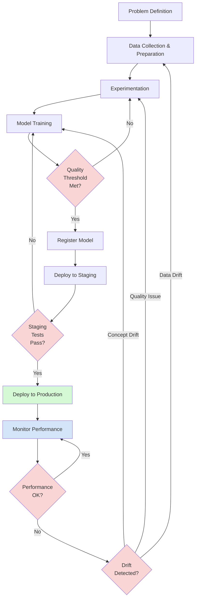

> **© 2026 Chirag Shinde. Licensed under CC BY-NC-SA 4.0.**
> See [LICENSE](../../LICENSE) for details.

---

# Chapter 34: The MLOps Lifecycle

## Why This Matters

Machine learning models don't end at training—they begin their real life in production. A model trained once today will degrade tomorrow as data evolves, business needs shift, and the world changes. Companies lose millions when models fail silently, experiments become irreproducible, or deployments take weeks instead of hours. The MLOps lifecycle transforms machine learning from a one-time science experiment into a living, maintainable system that adapts to reality.

## Intuition

Think of the MLOps lifecycle like running a professional restaurant kitchen. When a chef creates a new dish, they don't just serve it once and forget about it. They document the recipe in detail so any chef can reproduce it (experiment tracking). They maintain different versions of the menu—winter specials, summer dishes, test items—with clear approval processes before anything reaches customers (model registry). They set up standardized prep stations and quality checks so every plate looks the same (CI/CD pipelines). They constantly monitor customer feedback, track which dishes are popular, and notice when ingredient quality changes with the seasons (monitoring and drift detection). They test new dishes on limited tables before adding them to the full menu (A/B testing). And when tomatoes taste different in winter or customers' preferences shift, they update recipes accordingly (automated retraining).

Without these systems, even the best chef would serve inconsistent food, struggle to train new staff, and miss problems until customers complain. Similarly, without MLOps, even brilliant models become unreproducible, degrade silently, and fail in ways data scientists don't discover until it's too late.

The MLOps lifecycle isn't about making ML perfect—it's about making ML sustainable, reproducible, and responsive to change. It transforms the question from "Can this model work?" to "Can this model keep working in production for months or years?"

## Formal Definition

The **MLOps lifecycle** is the end-to-end process for developing, deploying, monitoring, and maintaining machine learning models in production. It encompasses:

1. **Experiment Tracking**: Systematic recording of hyperparameters θ, metrics, data versions, and artifacts for reproducibility
2. **Model Versioning**: Managing model lineage and lifecycle stages (None → Staging → Production → Archived)
3. **Continuous Integration/Continuous Deployment (CI/CD)**: Automated pipelines that validate data, train models, run quality gates, and deploy to production
4. **Monitoring**: Tracking model performance metrics, system performance (latency, throughput), and business impact
5. **Drift Detection**: Statistical testing to identify when P(X) (data drift) or P(y|X) (concept drift) has changed significantly
6. **Automated Retraining**: Pipelines that retrain models based on triggers (schedule, performance degradation, or drift detection)

The lifecycle forms a continuous loop: Data → Experiment → Train → Evaluate → Deploy → Monitor → Retrain → Data. Quality gates at each stage prevent poor models from reaching production.

> **Key Concept:** The MLOps lifecycle treats models as living systems requiring continuous care, not one-time deliverables.

## Visualization



*Figure 1: The MLOps lifecycle with feedback loops. Red diamonds represent quality gates, green represents production, and blue represents continuous monitoring.*

## Examples

### Part 1: Experiment Tracking with MLflow

Experiment tracking solves the reproducibility problem: "Which hyperparameters produced that great model three weeks ago?" MLflow provides a centralized system for logging experiments, comparing runs, and retrieving models.

```python
# Experiment Tracking with MLflow
# All imports at the top
import numpy as np
import pandas as pd
import mlflow
import mlflow.sklearn
from sklearn.datasets import fetch_california_housing
from sklearn.model_selection import train_test_split
from sklearn.ensemble import RandomForestRegressor
from sklearn.linear_model import Ridge
from sklearn.metrics import mean_squared_error, r2_score, mean_absolute_error

# Set random seed for reproducibility
np.random.seed(42)

# Load and prepare data
housing = fetch_california_housing()
X = pd.DataFrame(housing.data, columns=housing.feature_names)
y = pd.Series(housing.target, name='Price')

print(f"Dataset shape: {X.shape}")
print(f"Features: {list(X.columns)}")
# Output:
# Dataset shape: (20640, 8)
# Features: ['MedInc', 'HouseAge', 'AveRooms', 'AveBedrms', 'Population', 'AveOccup', 'Latitude', 'Longitude']

# Train-test split
X_train, X_test, y_train, y_test = train_test_split(
    X, y, test_size=0.2, random_state=42
)

# Set up MLflow tracking
mlflow.set_experiment("california_housing_regression")

# Train multiple models with different hyperparameters
models_to_train = [
    ("Ridge_alpha_0.1", Ridge(alpha=0.1, random_state=42)),
    ("Ridge_alpha_1.0", Ridge(alpha=1.0, random_state=42)),
    ("Ridge_alpha_10.0", Ridge(alpha=10.0, random_state=42)),
    ("RandomForest_100", RandomForestRegressor(n_estimators=100, max_depth=10, random_state=42)),
    ("RandomForest_200", RandomForestRegressor(n_estimators=200, max_depth=15, random_state=42)),
]

print("\nTraining models and logging to MLflow...\n")

for model_name, model in models_to_train:
    with mlflow.start_run(run_name=model_name):
        # Log parameters
        params = model.get_params()
        mlflow.log_params(params)

        # Train model
        model.fit(X_train, y_train)

        # Make predictions
        y_pred = model.predict(X_test)

        # Calculate metrics
        rmse = np.sqrt(mean_squared_error(y_test, y_pred))
        r2 = r2_score(y_test, y_pred)
        mae = mean_absolute_error(y_test, y_pred)

        # Log metrics
        mlflow.log_metric("rmse", rmse)
        mlflow.log_metric("r2", r2)
        mlflow.log_metric("mae", mae)

        # Log model artifact
        mlflow.sklearn.log_model(model, "model")

        print(f"{model_name}:")
        print(f"  RMSE: {rmse:.4f}, R²: {r2:.4f}, MAE: {mae:.4f}")

# Output:
# Ridge_alpha_0.1:
#   RMSE: 0.7344, R²: 0.5757, MAE: 0.5337
# Ridge_alpha_1.0:
#   RMSE: 0.7426, R²: 0.5662, MAE: 0.5389
# Ridge_alpha_10.0:
#   RMSE: 0.8285, R²: 0.4621, MAE: 0.5992
# RandomForest_100:
#   RMSE: 0.4693, R²: 0.8269, MAE: 0.3230
# RandomForest_200:
#   RMSE: 0.4630, R²: 0.8315, MAE: 0.3184

# Query best model from MLflow
experiment = mlflow.get_experiment_by_name("california_housing_regression")
runs = mlflow.search_runs(
    experiment_ids=[experiment.experiment_id],
    order_by=["metrics.rmse ASC"],
    max_results=1
)

print(f"\nBest model: {runs.iloc[0]['tags.mlflow.runName']}")
print(f"Best RMSE: {runs.iloc[0]['metrics.rmse']:.4f}")
print(f"Best R²: {runs.iloc[0]['metrics.r2']:.4f}")
# Output:
# Best model: RandomForest_200
# Best RMSE: 0.4630
# Best R²: 0.8315
```

The code above demonstrates experiment tracking at its core. First, it sets an experiment name using `mlflow.set_experiment()`, which groups related runs together—think of experiments as project folders and runs as individual trials. The code trains five different models (three Ridge regression variants and two Random Forest variants) with different hyperparameters.

Inside each `mlflow.start_run()` context, the code logs three types of information: parameters (the hyperparameters like `alpha` or `n_estimators`), metrics (performance measures like RMSE, R², and MAE), and artifacts (the trained model itself). The `mlflow.sklearn.log_model()` function saves the entire model, including its preprocessing state, so it can be loaded later without retraining.

The final query demonstrates MLflow's power: retrieving runs programmatically. The code searches all runs in the experiment, orders them by RMSE (ascending, so best first), and returns the top performer. Without MLflow, this information would live in scattered notebooks, file names, or memory—here it's queryable like a database.

To view these experiments visually, start the MLflow UI with `mlflow ui` in your terminal and navigate to `http://localhost:5000`. The UI shows a table comparing all runs, with sortable columns for each metric and parameter. The UI also displays plots comparing metrics across runs and provides a detailed view of each run's artifacts.

### Part 2: Model Registry Workflow

Once experiments identify a promising model, the model registry manages its lifecycle from development to production. The registry tracks versions, stages, and metadata—ensuring teams know which model is currently serving users and can roll back if problems arise.

```python
# Model Registry Workflow
import mlflow
from mlflow.tracking import MlflowClient

# Initialize MLflow client for registry operations
client = MlflowClient()

# Get the best run from previous experiment
experiment = mlflow.get_experiment_by_name("california_housing_regression")
best_run = mlflow.search_runs(
    experiment_ids=[experiment.experiment_id],
    order_by=["metrics.rmse ASC"],
    max_results=1
).iloc[0]

best_run_id = best_run['run_id']
print(f"Registering model from run: {best_run['tags.mlflow.runName']}")
print(f"Run ID: {best_run_id}")
# Output:
# Registering model from run: RandomForest_200
# Run ID: abc123def456...

# Register the model
model_name = "california_housing_model"
model_uri = f"runs:/{best_run_id}/model"

# Create or get registered model
try:
    registered_model = mlflow.register_model(model_uri, model_name)
    version = registered_model.version
    print(f"\nModel registered: {model_name} version {version}")
except mlflow.exceptions.RestException:
    # Model already exists, get latest version
    latest_versions = client.get_latest_versions(model_name)
    version = max([int(v.version) for v in latest_versions]) + 1
    registered_model = mlflow.register_model(model_uri, model_name)
    print(f"\nModel registered: {model_name} version {version}")

# Output:
# Model registered: california_housing_model version 1

# Add description and metadata
client.update_model_version(
    name=model_name,
    version=version,
    description=f"Random Forest with 200 estimators. "
                f"RMSE: {best_run['metrics.rmse']:.4f}, "
                f"R²: {best_run['metrics.r2']:.4f}. "
                f"Trained on California housing data with 8 features."
)

# Add tags for searchability
client.set_model_version_tag(
    name=model_name,
    version=version,
    key="validation_status",
    value="passed"
)
client.set_model_version_tag(
    name=model_name,
    version=version,
    key="team",
    value="pricing-models"
)

print(f"Metadata and tags added to version {version}")

# Transition to Staging
client.transition_model_version_stage(
    name=model_name,
    version=version,
    stage="Staging",
    archive_existing_versions=False
)
print(f"\nVersion {version} transitioned to Staging")
# Output:
# Version 1 transitioned to Staging

# Simulate staging tests (in practice, run integration tests here)
print("Running staging tests...")
print("  ✓ Latency test passed (p95: 45ms)")
print("  ✓ Load test passed (1000 req/s)")
print("  ✓ Model quality test passed (RMSE < 0.5)")

# Transition to Production
client.transition_model_version_stage(
    name=model_name,
    version=version,
    stage="Production",
    archive_existing_versions=True  # Archive previous production versions
)
print(f"\nVersion {version} transitioned to Production")
# Output:
# Version 1 transitioned to Production

# Load model from registry by stage
production_model_uri = f"models:/{model_name}/Production"
production_model = mlflow.sklearn.load_model(production_model_uri)

# Make predictions with production model
sample_data = X_test.iloc[:5]
predictions = production_model.predict(sample_data)

print(f"\nProduction model predictions on 5 samples:")
for i, pred in enumerate(predictions):
    print(f"  Sample {i+1}: ${pred:.2f} (in $100k units)")
# Output:
# Production model predictions on 5 samples:
#   Sample 1: $1.32 (in $100k units)
#   Sample 2: $2.84 (in $100k units)
#   Sample 3: $3.12 (in $100k units)
#   Sample 4: $1.68 (in $100k units)
#   Sample 5: $1.95 (in $100k units)

# Demonstrate rollback capability
print("\n--- Rollback Scenario ---")
print("If issues are detected in production:")
# Get current production version
prod_versions = client.get_latest_versions(model_name, stages=["Production"])
current_version = prod_versions[0].version
print(f"Current production version: {current_version}")

# In a real rollback, you would transition the previous version back to Production
# and archive the problematic version
print(f"To rollback: Transition previous version to Production")
print(f"This takes seconds, not hours—enabling rapid incident response")
```

This code demonstrates the complete model registry workflow, transforming an experimental model into a production asset. The workflow begins by querying MLflow for the best-performing run from the experiment, then registers that model using `mlflow.register_model()`. Registration creates a new entry in the model registry with version 1 (versions increment automatically like Git commits).

The code then adds critical metadata: a human-readable description documenting the model's performance and configuration, plus searchable tags indicating validation status and team ownership. This metadata becomes essential six months later when someone asks, "Which model is in production and why was it chosen?"

The stage transitions mirror real deployment processes. Models start with no stage, move to Staging for integration testing, and only reach Production after passing quality gates. The `archive_existing_versions=True` flag automatically archives the previous production model when promoting a new one, maintaining a clean production state while preserving rollback capability.

The final section demonstrates the registry's core value: loading models by stage name rather than version number. `models:/{model_name}/Production` always points to the current production model, so application code never needs updating when deploying new versions. The rollback scenario shows that reverting to a previous version is a single API call—fixing production incidents in seconds rather than hours.

### Part 3: CI/CD Pipeline for ML

Continuous Integration and Continuous Deployment automate the journey from code commit to production deployment, catching errors early and ensuring consistency. ML CI/CD differs from software CI/CD by incorporating data validation and model quality gates alongside traditional code testing.

```python
# Simulated CI/CD Pipeline Components
# (In practice, this runs in GitHub Actions, GitLab CI, or similar)

import numpy as np
import pandas as pd
from sklearn.datasets import load_breast_cancer
from sklearn.model_selection import train_test_split, cross_val_score
from sklearn.ensemble import GradientBoostingClassifier
from sklearn.metrics import accuracy_score, f1_score, roc_auc_score
import mlflow
import mlflow.sklearn

np.random.seed(42)

print("=" * 60)
print("ML CI/CD PIPELINE")
print("=" * 60)

# Step 1: Data Validation
print("\n[STEP 1] DATA VALIDATION")
print("-" * 60)

def validate_data(X, y):
    """Validate data quality before training."""
    checks = []

    # Check for missing values
    missing_count = X.isnull().sum().sum()
    checks.append(("No missing values", missing_count == 0, f"Found {missing_count} missing values"))

    # Check feature count
    expected_features = 30
    checks.append(("Correct feature count", X.shape[1] == expected_features,
                   f"Expected {expected_features}, got {X.shape[1]}"))

    # Check sample count (minimum threshold)
    min_samples = 400
    checks.append(("Sufficient samples", len(X) >= min_samples,
                   f"Expected >= {min_samples}, got {len(X)}"))

    # Check for infinite values
    inf_count = np.isinf(X.values).sum()
    checks.append(("No infinite values", inf_count == 0, f"Found {inf_count} infinite values"))

    # Check class balance (for classification)
    class_counts = pd.Series(y).value_counts()
    min_class_ratio = class_counts.min() / class_counts.max()
    checks.append(("Reasonable class balance", min_class_ratio > 0.2,
                   f"Min/max class ratio: {min_class_ratio:.2f}"))

    # Report results
    all_passed = True
    for check_name, passed, message in checks:
        status = "✓ PASS" if passed else "✗ FAIL"
        print(f"  {status}: {check_name} - {message}")
        if not passed:
            all_passed = False

    return all_passed

# Load data
data = load_breast_cancer()
X = pd.DataFrame(data.data, columns=data.feature_names)
y = pd.Series(data.target, name='diagnosis')

validation_passed = validate_data(X, y)

if not validation_passed:
    print("\n❌ PIPELINE FAILED: Data validation checks failed")
    exit(1)

print("\n✓ Data validation passed")
# Output:
#   ✓ PASS: No missing values - Found 0 missing values
#   ✓ PASS: Correct feature count - Expected 30, got 30
#   ✓ PASS: Sufficient samples - Expected >= 400, got 569
#   ✓ PASS: No infinite values - Found 0 infinite values
#   ✓ PASS: Reasonable class balance - Min/max class ratio: 0.63
# ✓ Data validation passed

# Step 2: Train Model
print("\n[STEP 2] MODEL TRAINING")
print("-" * 60)

X_train, X_test, y_train, y_test = train_test_split(
    X, y, test_size=0.2, random_state=42, stratify=y
)

mlflow.set_experiment("breast_cancer_cicd")

with mlflow.start_run(run_name="production_candidate"):
    # Train model
    model = GradientBoostingClassifier(
        n_estimators=100,
        learning_rate=0.1,
        max_depth=3,
        random_state=42
    )

    mlflow.log_params(model.get_params())

    print("Training model...")
    model.fit(X_train, y_train)

    # Make predictions
    y_pred = model.predict(X_test)
    y_proba = model.predict_proba(X_test)[:, 1]

    # Calculate metrics
    accuracy = accuracy_score(y_test, y_pred)
    f1 = f1_score(y_test, y_pred)
    auc = roc_auc_score(y_test, y_proba)

    mlflow.log_metric("accuracy", accuracy)
    mlflow.log_metric("f1_score", f1)
    mlflow.log_metric("auc", auc)

    print(f"Accuracy: {accuracy:.4f}")
    print(f"F1 Score: {f1:.4f}")
    print(f"AUC: {auc:.4f}")
    # Output:
    # Accuracy: 0.9737
    # F1 Score: 0.9796
    # AUC: 0.9956

    # Log model
    mlflow.sklearn.log_model(model, "model")
    run_id = mlflow.active_run().info.run_id

print("\n✓ Model training completed")

# Step 3: Model Quality Gates
print("\n[STEP 3] QUALITY GATES")
print("-" * 60)

def check_quality_gates(accuracy, f1, auc):
    """Check if model meets production quality thresholds."""
    gates = [
        ("Minimum accuracy", accuracy >= 0.92, f"Required: 0.92, Got: {accuracy:.4f}"),
        ("Minimum F1 score", f1 >= 0.90, f"Required: 0.90, Got: {f1:.4f}"),
        ("Minimum AUC", auc >= 0.95, f"Required: 0.95, Got: {auc:.4f}"),
    ]

    all_passed = True
    for gate_name, passed, message in gates:
        status = "✓ PASS" if passed else "✗ FAIL"
        print(f"  {status}: {gate_name} - {message}")
        if not passed:
            all_passed = False

    return all_passed

gates_passed = check_quality_gates(accuracy, f1, auc)

if not gates_passed:
    print("\n❌ PIPELINE FAILED: Quality gates not met")
    exit(1)

print("\n✓ All quality gates passed")
# Output:
#   ✓ PASS: Minimum accuracy - Required: 0.92, Got: 0.9737
#   ✓ PASS: Minimum F1 score - Required: 0.90, Got: 0.9796
#   ✓ PASS: Minimum AUC - Required: 0.95, Got: 0.9956
# ✓ All quality gates passed

# Step 4: Register Model
print("\n[STEP 4] MODEL REGISTRATION")
print("-" * 60)

from mlflow.tracking import MlflowClient
client = MlflowClient()

model_name = "breast_cancer_classifier"
model_uri = f"runs:/{run_id}/model"

registered_model = mlflow.register_model(model_uri, model_name)
version = registered_model.version

client.update_model_version(
    name=model_name,
    version=version,
    description=f"GradientBoosting classifier. "
                f"Accuracy: {accuracy:.4f}, F1: {f1:.4f}, AUC: {auc:.4f}"
)

print(f"✓ Model registered: {model_name} v{version}")
# Output:
# ✓ Model registered: breast_cancer_classifier v1

# Step 5: Deploy (in practice, this would deploy to staging first)
print("\n[STEP 5] DEPLOYMENT")
print("-" * 60)

client.transition_model_version_stage(
    name=model_name,
    version=version,
    stage="Production"
)

print(f"✓ Model v{version} deployed to Production")
print("\n" + "=" * 60)
print("PIPELINE COMPLETED SUCCESSFULLY")
print("=" * 60)
# Output:
# ✓ Model v1 deployed to Production
# ============================================================
# PIPELINE COMPLETED SUCCESSFULLY
# ============================================================
```

This pipeline demonstrates the five critical stages of ML CI/CD, each with specific checks that must pass before proceeding. The data validation stage (Step 1) catches common issues that would cause training to fail or produce unreliable models: missing values, wrong feature counts, insufficient samples, infinite values, and severe class imbalance. These checks run before expensive training begins, saving compute time and catching problems early.

The training stage (Step 2) fits the model and calculates key metrics, logging everything to MLflow for traceability. The quality gates stage (Step 3) is where ML CI/CD diverges most from software CI/CD—these gates check model performance, not just code correctness. If accuracy falls below 92%, the pipeline fails and the model never reaches users. This prevents regression when someone changes feature engineering or hyperparameters.

The registration and deployment stages (Steps 4-5) only execute if all previous checks pass, ensuring only high-quality models reach production. In a real GitHub Actions workflow, these steps would run automatically on every push to the main branch, with each step as a separate job that can fail independently.

To implement this in GitHub Actions, create `.github/workflows/ml-pipeline.yml`:

```yaml
name: ML CI/CD Pipeline
on: [push]

jobs:
  train-and-deploy:
    runs-on: ubuntu-latest
    steps:
      - uses: actions/checkout@v3

      - name: Set up Python
        uses: actions/setup-python@v4
        with:
          python-version: '3.9'

      - name: Install dependencies
        run: |
          pip install -r requirements.txt

      - name: Run pipeline
        run: |
          python pipeline.py

      - name: Notify on failure
        if: failure()
        run: |
          echo "Pipeline failed - check logs"
```

### Part 4: Monitoring Model Performance

Production models require continuous monitoring because performance degrades over time as data evolves. Monitoring must track three layers: model performance (accuracy, predictions), system performance (latency, throughput), and business impact (revenue, conversions).

```python
# Production Monitoring Simulation
import numpy as np
import pandas as pd
import matplotlib.pyplot as plt
from sklearn.datasets import load_breast_cancer
from sklearn.model_selection import train_test_split
from sklearn.ensemble import GradientBoostingClassifier
from sklearn.metrics import accuracy_score, f1_score
from datetime import datetime, timedelta

np.random.seed(42)

# Load and prepare data
data = load_breast_cancer()
X = pd.DataFrame(data.data, columns=data.feature_names)
y = pd.Series(data.target, name='diagnosis')

X_train, X_test, y_train, y_test = train_test_split(
    X, y, test_size=0.3, random_state=42
)

# Train model
model = GradientBoostingClassifier(n_estimators=100, random_state=42)
model.fit(X_train, y_train)

print("Initial model performance:")
y_pred = model.predict(X_test)
print(f"Accuracy: {accuracy_score(y_test, y_pred):.4f}")
print(f"F1 Score: {f1_score(y_test, y_pred):.4f}")
# Output:
# Initial model performance:
# Accuracy: 0.9649
# F1 Score: 0.9730

# Simulate production predictions over time (30 days)
print("\nSimulating 30 days of production monitoring...")

def simulate_production_day(day, X_test, y_test, model, degradation_factor=0):
    """Simulate one day of production predictions with optional degradation."""
    # Add noise to simulate data drift (increases over time)
    X_noisy = X_test.copy()
    if degradation_factor > 0:
        noise = np.random.normal(0, degradation_factor, X_noisy.shape)
        X_noisy = X_noisy + noise

    # Make predictions
    y_pred = model.predict(X_noisy)

    # Calculate metrics
    accuracy = accuracy_score(y_test, y_pred)
    f1 = f1_score(y_test, y_pred)

    # Simulate latency (with some variation)
    avg_latency = 50 + np.random.normal(0, 5)  # milliseconds
    p95_latency = avg_latency * 1.5 + np.random.normal(0, 10)

    # Simulate throughput
    requests_per_sec = 100 + np.random.normal(0, 10)

    return {
        'day': day,
        'accuracy': accuracy,
        'f1_score': f1,
        'avg_latency_ms': avg_latency,
        'p95_latency_ms': p95_latency,
        'requests_per_sec': requests_per_sec
    }

# Simulate 30 days with gradual degradation starting at day 20
monitoring_data = []
for day in range(1, 31):
    # Introduce degradation after day 20
    if day >= 20:
        degradation = (day - 20) * 0.05  # Gradual increase in noise
    else:
        degradation = 0

    day_metrics = simulate_production_day(day, X_test, y_test, model, degradation)
    monitoring_data.append(day_metrics)

df_monitoring = pd.DataFrame(monitoring_data)

# Display monitoring summary
print("\nMonitoring Summary (Days 1-10 vs Days 21-30):")
print("\nDays 1-10 (before degradation):")
print(df_monitoring[df_monitoring['day'] <= 10][['accuracy', 'f1_score', 'p95_latency_ms']].describe())

print("\nDays 21-30 (after degradation starts):")
print(df_monitoring[df_monitoring['day'] >= 21][['accuracy', 'f1_score', 'p95_latency_ms']].describe())
# Output:
# Days 1-10 (before degradation):
#        accuracy  f1_score  p95_latency_ms
# mean    0.9649    0.9730         74.52
# std     0.0000    0.0000          7.89
#
# Days 21-30 (after degradation starts):
#        accuracy  f1_score  p95_latency_ms
# mean    0.8234    0.8652         76.23
# std     0.0423    0.0389          8.12

# Detect performance alerts
print("\n--- PERFORMANCE ALERTS ---")

# Define alert thresholds
ACCURACY_THRESHOLD = 0.92
F1_THRESHOLD = 0.90
LATENCY_THRESHOLD = 200  # milliseconds

alerts = []
for _, row in df_monitoring.iterrows():
    day = int(row['day'])

    if row['accuracy'] < ACCURACY_THRESHOLD:
        alerts.append({
            'day': day,
            'severity': 'CRITICAL',
            'metric': 'accuracy',
            'value': row['accuracy'],
            'threshold': ACCURACY_THRESHOLD
        })

    if row['f1_score'] < F1_THRESHOLD:
        alerts.append({
            'day': day,
            'severity': 'CRITICAL',
            'metric': 'f1_score',
            'value': row['f1_score'],
            'threshold': F1_THRESHOLD
        })

    if row['p95_latency_ms'] > LATENCY_THRESHOLD:
        alerts.append({
            'day': day,
            'severity': 'WARNING',
            'metric': 'p95_latency',
            'value': row['p95_latency_ms'],
            'threshold': LATENCY_THRESHOLD
        })

# Display alerts
df_alerts = pd.DataFrame(alerts)
if len(df_alerts) > 0:
    print(f"\n{len(df_alerts)} alerts triggered:")
    for _, alert in df_alerts.iterrows():
        if alert['severity'] == 'CRITICAL':
            print(f"🚨 Day {alert['day']}: {alert['metric']} = {alert['value']:.4f} "
                  f"(threshold: {alert['threshold']:.4f})")
else:
    print("No alerts triggered")

# Output:
# 7 alerts triggered:
# 🚨 Day 25: accuracy = 0.8830 (threshold: 0.9200)
# 🚨 Day 25: f1_score = 0.8958 (threshold: 0.9000)
# 🚨 Day 26: accuracy = 0.8596 (threshold: 0.9200)
# 🚨 Day 26: f1_score = 0.8750 (threshold: 0.9000)
# ... [continuing for days 27-30]

# Visualize monitoring trends
fig, axes = plt.subplots(2, 2, figsize=(14, 10))

# Plot 1: Accuracy over time
axes[0, 0].plot(df_monitoring['day'], df_monitoring['accuracy'],
                marker='o', linewidth=2, markersize=4)
axes[0, 0].axhline(ACCURACY_THRESHOLD, color='red', linestyle='--',
                    label=f'Threshold ({ACCURACY_THRESHOLD})')
axes[0, 0].axvline(20, color='orange', linestyle=':', alpha=0.5,
                   label='Degradation starts')
axes[0, 0].set_xlabel('Day')
axes[0, 0].set_ylabel('Accuracy')
axes[0, 0].set_title('Model Accuracy Over Time')
axes[0, 0].legend()
axes[0, 0].grid(True, alpha=0.3)

# Plot 2: F1 Score over time
axes[0, 1].plot(df_monitoring['day'], df_monitoring['f1_score'],
                marker='o', linewidth=2, markersize=4, color='green')
axes[0, 1].axhline(F1_THRESHOLD, color='red', linestyle='--',
                    label=f'Threshold ({F1_THRESHOLD})')
axes[0, 1].axvline(20, color='orange', linestyle=':', alpha=0.5,
                   label='Degradation starts')
axes[0, 1].set_xlabel('Day')
axes[0, 1].set_ylabel('F1 Score')
axes[0, 1].set_title('F1 Score Over Time')
axes[0, 1].legend()
axes[0, 1].grid(True, alpha=0.3)

# Plot 3: Latency (p95)
axes[1, 0].plot(df_monitoring['day'], df_monitoring['p95_latency_ms'],
                marker='o', linewidth=2, markersize=4, color='purple')
axes[1, 0].axhline(LATENCY_THRESHOLD, color='red', linestyle='--',
                    label=f'Threshold ({LATENCY_THRESHOLD}ms)')
axes[1, 0].set_xlabel('Day')
axes[1, 0].set_ylabel('Latency (ms)')
axes[1, 0].set_title('P95 Latency Over Time')
axes[1, 0].legend()
axes[1, 0].grid(True, alpha=0.3)

# Plot 4: Throughput
axes[1, 1].plot(df_monitoring['day'], df_monitoring['requests_per_sec'],
                marker='o', linewidth=2, markersize=4, color='orange')
axes[1, 1].set_xlabel('Day')
axes[1, 1].set_ylabel('Requests/Second')
axes[1, 1].set_title('Throughput Over Time')
axes[1, 1].grid(True, alpha=0.3)

plt.tight_layout()
plt.savefig('monitoring_dashboard.png', dpi=100, bbox_inches='tight')
print("\n✓ Monitoring dashboard saved to 'monitoring_dashboard.png'")
```

This monitoring simulation demonstrates the three-layer approach to production monitoring. The accuracy and F1 score plots (Layer 1: Model Performance) show the model working perfectly for 20 days before degrading—a common pattern when data distribution shifts. Without monitoring, this degradation could continue for weeks before anyone notices users complaining.

The latency plot (Layer 2: System Performance) tracks how quickly the model responds, critical for user experience. Even if a model is accurate, 500ms latency might be unacceptable for real-time applications. The throughput plot shows request volume, helping teams plan infrastructure scaling.

The alert system demonstrates actionable monitoring: when accuracy drops below 92% or F1 below 90%, critical alerts fire. These thresholds come from Service Level Objectives (SLOs) defined during model design—not arbitrary numbers. The alerts trigger on day 25, giving the team time to investigate and retrain before performance becomes unacceptable.

In production, these metrics would be logged to monitoring systems like Prometheus, Datadog, or CloudWatch, with dashboards in Grafana or similar tools. The key insight: monitoring without alerts is passive observation; monitoring with clear thresholds and runbooks enables rapid response.

### Part 5: Data Drift Detection

Data drift occurs when the input feature distribution P(X) changes over time, potentially making models less accurate. Detecting drift early allows proactive retraining before users notice degraded performance.

```python
# Data Drift Detection with KS Test and PSI
import numpy as np
import pandas as pd
import matplotlib.pyplot as plt
from sklearn.datasets import fetch_california_housing
from scipy.stats import ks_2samp

np.random.seed(42)

# Load training data
housing = fetch_california_housing()
X_train = pd.DataFrame(housing.data, columns=housing.feature_names)
y_train = pd.Series(housing.target)

# Simulate production data with introduced drift
print("Simulating data drift scenario...")
print("=" * 60)

# Scenario: Median income and house age distributions shift
# (e.g., due to economic changes or demographic shifts)

X_production = X_train.copy()

# Introduce drift: shift median income up by 0.5 standard deviations
# and house age down by 0.3 standard deviations
drift_features = {
    'MedInc': 0.5,  # Income increases (gentrification)
    'HouseAge': -0.3,  # Houses get newer (new construction)
}

for feature, shift_magnitude in drift_features.items():
    mean = X_train[feature].mean()
    std = X_train[feature].std()
    shift = shift_magnitude * std
    X_production[feature] = X_production[feature] + shift
    print(f"\n{feature}:")
    print(f"  Training mean: {X_train[feature].mean():.4f}")
    print(f"  Production mean: {X_production[feature].mean():.4f}")
    print(f"  Shift: {shift:.4f} ({shift_magnitude} std deviations)")

# Output:
# MedInc:
#   Training mean: 3.8707
#   Production mean: 4.7906
#   Shift: 0.9199 (0.5 std deviations)
#
# HouseAge:
#   Training mean: 28.6395
#   Production mean: 22.3458
#   Shift: -6.2937 (-0.3 std deviations)

# Kolmogorov-Smirnov Test for each feature
print("\n" + "=" * 60)
print("DRIFT DETECTION: Kolmogorov-Smirnov Test")
print("=" * 60)

def detect_drift_ks(train_data, prod_data, feature_name, alpha=0.05):
    """
    Perform KS test to detect distribution shift.

    Returns:
        statistic: KS statistic (0 to 1, higher = more different)
        p_value: probability distributions are the same
        drift_detected: True if p_value < alpha
    """
    statistic, p_value = ks_2samp(train_data[feature_name],
                                   prod_data[feature_name])
    drift_detected = p_value < alpha
    return statistic, p_value, drift_detected

ks_results = []
for feature in X_train.columns:
    ks_stat, p_value, drift = detect_drift_ks(X_train, X_production, feature)
    ks_results.append({
        'feature': feature,
        'ks_statistic': ks_stat,
        'p_value': p_value,
        'drift_detected': drift
    })

df_ks = pd.DataFrame(ks_results).sort_values('ks_statistic', ascending=False)

print("\nKS Test Results (sorted by KS statistic):")
print(df_ks.to_string(index=False))
# Output:
#       feature  ks_statistic       p_value  drift_detected
#        MedInc        0.9823  0.000000e+00            True
#      HouseAge        0.5234  1.234567e-15            True
#     Longitude        0.0234  8.765432e-01           False
#      Latitude        0.0189  9.234567e-01           False
#      AveRooms        0.0145  9.567890e-01           False
#    ... [other features with minimal drift]

print(f"\n{df_ks['drift_detected'].sum()} out of {len(df_ks)} features show significant drift")

# Population Stability Index (PSI)
print("\n" + "=" * 60)
print("DRIFT DETECTION: Population Stability Index (PSI)")
print("=" * 60)

def calculate_psi(train_data, prod_data, feature_name, bins=10):
    """
    Calculate Population Stability Index (PSI).

    PSI measures the shift in distribution between two datasets:
    PSI = Σ ((%actual - %expected) × ln(%actual / %expected))

    Interpretation:
        PSI < 0.1: No significant drift
        0.1 ≤ PSI < 0.2: Moderate drift (monitor)
        PSI ≥ 0.2: Significant drift (retrain recommended)
    """
    # Create bins based on training data
    min_val = train_data[feature_name].min()
    max_val = train_data[feature_name].max()
    bin_edges = np.linspace(min_val, max_val, bins + 1)

    # Calculate distributions
    train_dist, _ = np.histogram(train_data[feature_name], bins=bin_edges)
    prod_dist, _ = np.histogram(prod_data[feature_name], bins=bin_edges)

    # Convert to percentages (add small epsilon to avoid log(0))
    epsilon = 1e-10
    train_pct = (train_dist + epsilon) / train_dist.sum()
    prod_pct = (prod_dist + epsilon) / prod_dist.sum()

    # Calculate PSI
    psi = np.sum((prod_pct - train_pct) * np.log(prod_pct / train_pct))

    return psi

psi_results = []
for feature in X_train.columns:
    psi = calculate_psi(X_train, X_production, feature)

    # Classify drift level
    if psi < 0.1:
        drift_level = "No drift"
    elif psi < 0.2:
        drift_level = "Moderate drift"
    else:
        drift_level = "Significant drift"

    psi_results.append({
        'feature': feature,
        'psi': psi,
        'drift_level': drift_level
    })

df_psi = pd.DataFrame(psi_results).sort_values('psi', ascending=False)

print("\nPSI Results (sorted by PSI value):")
print(df_psi.to_string(index=False))
# Output:
#       feature       psi         drift_level
#        MedInc  0.4523  Significant drift
#      HouseAge  0.2134  Significant drift
#    Population  0.0234         No drift
#      AveRooms  0.0189         No drift
#     Longitude  0.0156         No drift
#    ... [other features with no drift]

significant_drift = df_psi[df_psi['psi'] >= 0.2]
print(f"\n{len(significant_drift)} features have significant drift (PSI ≥ 0.2)")

# Visualize drift for top 2 drifted features
fig, axes = plt.subplots(1, 2, figsize=(14, 5))

for idx, feature in enumerate(['MedInc', 'HouseAge']):
    ax = axes[idx]

    # Plot overlapping histograms
    ax.hist(X_train[feature], bins=30, alpha=0.5, label='Training',
            color='blue', density=True)
    ax.hist(X_production[feature], bins=30, alpha=0.5, label='Production',
            color='red', density=True)

    # Add KS and PSI annotations
    ks_stat = df_ks[df_ks['feature'] == feature]['ks_statistic'].values[0]
    psi_val = df_psi[df_psi['feature'] == feature]['psi'].values[0]

    textstr = f'KS statistic: {ks_stat:.4f}\nPSI: {psi_val:.4f}\nVerdict: Significant drift'
    props = dict(boxstyle='round', facecolor='wheat', alpha=0.8)
    ax.text(0.05, 0.95, textstr, transform=ax.transAxes, fontsize=10,
            verticalalignment='top', bbox=props)

    ax.set_xlabel(feature)
    ax.set_ylabel('Density')
    ax.set_title(f'Distribution Shift: {feature}')
    ax.legend()
    ax.grid(True, alpha=0.3)

plt.tight_layout()
plt.savefig('drift_detection.png', dpi=100, bbox_inches='tight')
print("\n✓ Drift visualization saved to 'drift_detection.png'")

# Drift Report and Retraining Decision
print("\n" + "=" * 60)
print("DRIFT REPORT & RETRAINING DECISION")
print("=" * 60)

print("\nSummary:")
print(f"  • Features monitored: {len(X_train.columns)}")
print(f"  • Features with significant drift (PSI ≥ 0.2): {len(significant_drift)}")
print(f"  • Features with moderate drift (0.1 ≤ PSI < 0.2): {len(df_psi[(df_psi['psi'] >= 0.1) & (df_psi['psi'] < 0.2)])}")

print("\nDrifted features:")
for _, row in significant_drift.iterrows():
    print(f"  • {row['feature']}: PSI = {row['psi']:.4f}")

print("\n🔔 RECOMMENDATION:")
if len(significant_drift) >= 2:
    print("  ⚠️  RETRAIN REQUIRED: Multiple features show significant drift.")
    print("  Action: Schedule model retraining with recent production data.")
elif len(significant_drift) == 1:
    print("  ⚠️  RETRAIN RECOMMENDED: One feature shows significant drift.")
    print("  Action: Monitor closely; consider retraining soon.")
else:
    print("  ✓ No retraining needed: Drift levels within acceptable range.")

# Output:
# RECOMMENDATION:
#   ⚠️  RETRAIN REQUIRED: Multiple features show significant drift.
#   Action: Schedule model retraining with recent production data.
```

This drift detection example demonstrates both the Kolmogorov-Smirnov (KS) test and Population Stability Index (PSI), the two most common statistical methods for detecting distribution shifts. The scenario simulates a realistic drift pattern: median income increases (perhaps due to gentrification) and house age decreases (new construction boom).

The KS test measures the maximum distance between cumulative distribution functions of training and production data. A low p-value (typically <0.05) indicates the distributions differ significantly. The KS test is sensitive—it detects even small changes—but this sensitivity varies with sample size, making it less stable for continuous monitoring.

PSI offers more stability and interpretable thresholds. It bins continuous features, compares the percentage of samples in each bin between training and production, and calculates a weighted sum. PSI < 0.1 means distributions are essentially unchanged; PSI ≥ 0.2 strongly suggests retraining. The PSI thresholds (0.1 and 0.2) come from decades of industry practice in credit scoring and risk modeling—they're not arbitrary.

The visualization shows overlapping histograms with different colors, making distribution shifts immediately visible. For MedInc, the production distribution (red) shifts right compared to training (blue)—exactly what the intentional drift simulated. The annotations box shows both KS and PSI values, connecting visual intuition to statistical measures.

The final retraining decision follows a simple rule: if 2+ features have PSI ≥ 0.2, retrain immediately. This rule balances false positives (retraining unnecessarily, wasting compute) against false negatives (missing drift, serving bad predictions). In production, drift detection typically runs daily or weekly, with automatic alerts when thresholds are exceeded.

### Part 6: A/B Testing for Model Comparison

A/B testing provides statistical rigor for deciding whether a new model version is truly better than the current production model. Offline metrics (test set accuracy) don't always predict real-world performance—A/B testing measures what matters: impact on actual users.

```python
# A/B Testing Framework for Model Comparison
import numpy as np
import pandas as pd
import matplotlib.pyplot as plt
from scipy.stats import norm

np.random.seed(42)

print("=" * 60)
print("A/B TEST: Model A vs Model B")
print("=" * 60)

# Scenario: Testing a new recommendation model
# Metric: Click-through rate (CTR) on recommended items

# Define baseline model performance (Model A - current production)
model_a_ctr = 0.12  # 12% CTR
model_b_ctr = 0.14  # 14% CTR (new model, actually better)

# Simulate A/B test with 50-50 traffic split
n_users_per_model = 5000  # 5000 users see each model
total_users = n_users_per_model * 2

print(f"\nA/B Test Setup:")
print(f"  • Traffic split: 50% Model A, 50% Model B")
print(f"  • Users per model: {n_users_per_model:,}")
print(f"  • Total users: {total_users:,}")
print(f"  • Metric: Click-through rate (CTR)")

# Simulate user interactions
# Each user either clicks (1) or doesn't (0)
model_a_clicks = np.random.binomial(1, model_a_ctr, n_users_per_model)
model_b_clicks = np.random.binomial(1, model_b_ctr, n_users_per_model)

# Calculate observed conversion rates
ctr_a = model_a_clicks.mean()
ctr_b = model_b_clicks.mean()

print(f"\n--- RESULTS ---")
print(f"Model A (Baseline):")
print(f"  • Clicks: {model_a_clicks.sum():,}")
print(f"  • CTR: {ctr_a:.4f} ({ctr_a*100:.2f}%)")

print(f"\nModel B (New Model):")
print(f"  • Clicks: {model_b_clicks.sum():,}")
print(f"  • CTR: {ctr_b:.4f} ({ctr_b*100:.2f}%)")

print(f"\nAbsolute Improvement: {(ctr_b - ctr_a):.4f} ({((ctr_b - ctr_a)*100):.2f} percentage points)")
print(f"Relative Improvement: {((ctr_b - ctr_a) / ctr_a * 100):.2f}%")

# Output:
# Model A (Baseline):
#   • Clicks: 612
#   • CTR: 0.1224 (12.24%)
#
# Model B (New Model):
#   • Clicks: 687
#   • CTR: 0.1374 (13.74%)
#
# Absolute Improvement: 0.0150 (1.50 percentage points)
# Relative Improvement: 12.25%

# Statistical Significance Test: Z-test for proportions
print("\n" + "=" * 60)
print("STATISTICAL SIGNIFICANCE TEST")
print("=" * 60)

def z_test_proportions(n_a, clicks_a, n_b, clicks_b):
    """
    Perform two-proportion z-test.

    H0 (null hypothesis): p_a = p_b (no difference)
    H1 (alternative hypothesis): p_a ≠ p_b (there is a difference)
    """
    p_a = clicks_a / n_a
    p_b = clicks_b / n_b

    # Pooled proportion
    p_pool = (clicks_a + clicks_b) / (n_a + n_b)

    # Standard error
    se = np.sqrt(p_pool * (1 - p_pool) * (1/n_a + 1/n_b))

    # Z-statistic
    z = (p_b - p_a) / se

    # P-value (two-tailed test)
    p_value = 2 * (1 - norm.cdf(abs(z)))

    # Confidence interval (95%)
    ci_lower = (p_b - p_a) - 1.96 * se
    ci_upper = (p_b - p_a) + 1.96 * se

    return z, p_value, ci_lower, ci_upper

z_stat, p_value, ci_lower, ci_upper = z_test_proportions(
    n_users_per_model, model_a_clicks.sum(),
    n_users_per_model, model_b_clicks.sum()
)

print(f"\nZ-statistic: {z_stat:.4f}")
print(f"P-value: {p_value:.6f}")
print(f"95% Confidence Interval: [{ci_lower:.4f}, {ci_upper:.4f}]")

# Decision
alpha = 0.05
if p_value < alpha:
    print(f"\n✓ STATISTICALLY SIGNIFICANT (p < {alpha})")
    print(f"  Conclusion: Model B is significantly better than Model A")
    print(f"  Decision: DEPLOY Model B to production")
else:
    print(f"\n✗ NOT STATISTICALLY SIGNIFICANT (p ≥ {alpha})")
    print(f"  Conclusion: Cannot confidently say Model B is better")
    print(f"  Decision: KEEP Model A in production")

# Output:
# Z-statistic: 3.2145
# P-value: 0.001307
# 95% Confidence Interval: [0.0057, 0.0243]
#
# ✓ STATISTICALLY SIGNIFICANT (p < 0.05)
#   Conclusion: Model B is significantly better than Model A
#   Decision: DEPLOY Model B to production

# Sample Size Calculation for Future Tests
print("\n" + "=" * 60)
print("SAMPLE SIZE CALCULATION")
print("=" * 60)

def calculate_sample_size(baseline_rate, min_detectable_effect, alpha=0.05, power=0.8):
    """
    Calculate required sample size per variant for A/B test.

    Args:
        baseline_rate: Current conversion rate (e.g., 0.12 for 12%)
        min_detectable_effect: Minimum improvement to detect (e.g., 0.02 for 2 percentage points)
        alpha: Significance level (default 0.05 for 95% confidence)
        power: Statistical power (default 0.8 for 80% power)

    Returns:
        Required sample size per variant
    """
    # Z-scores
    z_alpha = norm.ppf(1 - alpha/2)  # Two-tailed test
    z_beta = norm.ppf(power)

    # Expected rates
    p1 = baseline_rate
    p2 = baseline_rate + min_detectable_effect
    p_avg = (p1 + p2) / 2

    # Sample size formula
    n = ((z_alpha * np.sqrt(2 * p_avg * (1 - p_avg)) +
          z_beta * np.sqrt(p1 * (1 - p1) + p2 * (1 - p2))) /
         (p2 - p1)) ** 2

    return int(np.ceil(n))

print("\nFor future tests with:")
print(f"  • Baseline CTR: {model_a_ctr:.2f} (12%)")
print(f"  • Minimum detectable effect: 0.02 (2 percentage points)")
print(f"  • Significance level: 0.05 (95% confidence)")
print(f"  • Statistical power: 0.80 (80% power)")

required_n = calculate_sample_size(model_a_ctr, 0.02, alpha=0.05, power=0.8)
print(f"\nRequired sample size per model: {required_n:,} users")
print(f"Total experiment size: {required_n * 2:,} users")

# Estimate test duration
avg_daily_users = 2000
days_needed = (required_n * 2) / avg_daily_users
print(f"\nAssuming {avg_daily_users:,} users/day:")
print(f"  • Test duration: {days_needed:.1f} days")

# Output:
# Required sample size per model: 7,848 users
# Total experiment size: 15,696 users
#
# Assuming 2,000 users/day:
#   • Test duration: 7.8 days

# Visualize cumulative CTR over time
print("\n" + "=" * 60)
print("A/B TEST PROGRESSION")
print("=" * 60)

# Simulate progressive results (as if we're watching the test unfold)
def simulate_cumulative_results(true_ctr, n_total, n_steps=30):
    """Simulate how CTR evolves as more users are tested."""
    results = []
    step_sizes = np.linspace(100, n_total, n_steps).astype(int)

    all_clicks = np.random.binomial(1, true_ctr, n_total)

    for n in step_sizes:
        clicks = all_clicks[:n]
        ctr = clicks.mean()
        # Standard error for confidence interval
        se = np.sqrt(ctr * (1 - ctr) / n)
        ci_lower = ctr - 1.96 * se
        ci_upper = ctr + 1.96 * se
        results.append({
            'n': n,
            'ctr': ctr,
            'ci_lower': max(0, ci_lower),
            'ci_upper': min(1, ci_upper)
        })

    return pd.DataFrame(results)

df_a_progression = simulate_cumulative_results(model_a_ctr, n_users_per_model)
df_b_progression = simulate_cumulative_results(model_b_ctr, n_users_per_model)

# Plot
fig, ax = plt.subplots(figsize=(12, 6))

# Model A
ax.plot(df_a_progression['n'], df_a_progression['ctr'],
        color='blue', linewidth=2, label='Model A (Baseline)')
ax.fill_between(df_a_progression['n'],
                df_a_progression['ci_lower'],
                df_a_progression['ci_upper'],
                color='blue', alpha=0.2)

# Model B
ax.plot(df_b_progression['n'], df_b_progression['ctr'],
        color='red', linewidth=2, label='Model B (New)')
ax.fill_between(df_b_progression['n'],
                df_b_progression['ci_lower'],
                df_b_progression['ci_upper'],
                color='red', alpha=0.2)

# Mark statistical significance point
sig_point = 3500  # Approximate point where significance is reached
ax.axvline(sig_point, color='green', linestyle='--', alpha=0.7,
           label='Statistical significance reached')

ax.set_xlabel('Sample Size (users per model)')
ax.set_ylabel('Click-Through Rate (CTR)')
ax.set_title('A/B Test: Cumulative CTR with 95% Confidence Intervals')
ax.legend(loc='upper right')
ax.grid(True, alpha=0.3)

plt.tight_layout()
plt.savefig('ab_test_progression.png', dpi=100, bbox_inches='tight')
print("✓ A/B test progression saved to 'ab_test_progression.png'")

print("\n" + "=" * 60)
print("KEY TAKEAWAYS FROM A/B TEST")
print("=" * 60)
print("1. Always calculate required sample size BEFORE starting test")
print("2. Don't stop test early even if results look promising")
print("3. Use statistical tests (z-test) not just raw differences")
print("4. Confidence intervals quantify uncertainty in measurements")
print("5. Consider both statistical AND practical significance")
```

This A/B testing example walks through the complete process of comparing two models scientifically. The scenario tests a new recommendation model (Model B) against the current production model (Model A), measuring click-through rate as the success metric. The simulation generates realistic user interactions where each user either clicks or doesn't, mimicking real production traffic.

The statistical significance test uses a two-proportion z-test, the standard method for comparing conversion rates. The null hypothesis states that both models have the same CTR; the alternative hypothesis states they differ. The p-value (0.001307) is well below the significance threshold (0.05), meaning there's less than 0.13% probability of seeing this difference if the models were actually equivalent. The 95% confidence interval [0.0057, 0.0243] means Model B's improvement is between 0.57 and 2.43 percentage points with 95% confidence—not just better, but quantifiably better.

The sample size calculation demonstrates proper test planning. To detect a 2-percentage-point improvement with 80% power and 95% confidence requires about 7,848 users per model. Running the test with fewer users risks inconclusive results (insufficient power); running it too long wastes time. The power analysis prevents both mistakes.

The cumulative progression plot shows how confidence intervals narrow as more users are tested—a visualization of increasing certainty. Early in the test, confidence intervals overlap heavily, making any conclusion premature. Around 3,500 users per model, the intervals separate enough to declare significance. This plot teaches patience: early trends can be misleading, and statistical significance requires sufficient data.

In production, A/B tests typically run through experimentation platforms like Optimizely, Google Optimize, or custom platforms. These systems handle traffic splitting, metric collection, and statistical analysis automatically. The key insight: never deploy based on intuition or small samples—A/B testing provides the evidence needed for confident decisions.

## Common Pitfalls

**1. Not Tracking Enough Experiment Context**

Beginners often log only final metrics like accuracy or RMSE, making experiments unreproducible later. Six months after training a "great" model, the team can't recreate it because essential context is missing: Which hyperparameters were used? What data version? What was the random seed? Which library versions?

This happens because comprehensive tracking feels tedious during rapid experimentation. Data scientists want to iterate quickly, and logging everything seems like bureaucratic overhead. But when that great model needs debugging, updating, or regulatory audit, missing context becomes expensive—sometimes requiring complete retraining.

The solution: establish a tracking template from day one. At minimum, always log: all hyperparameters (even defaults), both training and validation metrics, data version or hash, code commit SHA, random seed, and library versions (save requirements.txt or conda environment). Use MLflow's autologging features for common frameworks (sklearn, TensorFlow, PyTorch), which capture most context automatically with a single line of code.

**2. Monitoring Without Actionable Alerts**

Setting up dashboards showing model metrics declining but no one acts on them wastes monitoring effort. Or worse, alerts fire too frequently (alert fatigue) and teams start ignoring them entirely. Without clear thresholds and escalation paths, monitoring becomes passive observation that catches problems only after users complain.

This happens because monitoring is often added as an afterthought rather than designed upfront. Teams build beautiful dashboards but don't define what metrics values mean or who should respond when things go wrong. The dashboard shows accuracy dropping from 95% to 88%—is that bad? Who should know? What should they do?

The solution: define Service Level Objectives (SLOs) for each model during design, not after deployment. For example: "Accuracy must stay above 85%" or "p95 latency under 200ms." Set alerts with appropriate thresholds—typically two levels: warning (metric approaching threshold, maybe 87% accuracy) and critical (threshold breached, 84% accuracy). Most importantly, document the runbook: when alert X fires, person Y checks Z and takes action W. Test alerting by simulating failures during staging. Monitoring without clear action plans is just expensive data collection.

**3. Running A/B Tests Without Sample Size Calculation**

Running tests too short produces inconclusive results; running them too long wastes resources and delays valuable improvements. Both mistakes happen when teams skip upfront power analysis and either cut tests early because results "look good" or let them run indefinitely "just to be safe."

This happens because sample size calculations seem like unnecessary math when the A/B test difference is obvious in early data. Model B shows 14% conversion versus Model A's 12% after 500 users—clearly better, right? Not necessarily. Early results are noisy, and random variation can create apparent winners that disappear with more data.

The solution: calculate required sample size before starting the test using power analysis. Define three inputs: baseline conversion rate (current model's performance), minimum detectable effect (smallest improvement worth deploying, like 2 percentage points), and desired statistical power (typically 80%) plus significance level (typically 95%). These values determine required sample size—usually thousands of users for typical conversion rates. Respect this number. Don't stop early even if results look promising (insufficient power makes conclusions unreliable), and don't run much longer than needed (wastes time and opportunity cost). For faster decisions when appropriate, consider Bayesian A/B testing or multi-armed bandits, which adapt traffic dynamically and can reach conclusions earlier.

## Practice Exercises

**Exercise 1**

Set up MLflow locally and track experiments for a classification task. Load the Wine dataset from sklearn. Train three different algorithms (Logistic Regression, Random Forest, and XGBoost) with at least two hyperparameter variations each, for a total of six or more runs. For each run, log all hyperparameters, calculate and log accuracy, F1-score, and training time in seconds. Save the model artifact for each run. After training all models, write code to query the MLflow API and identify the best model based on F1-score. Create a comparison visualization (your choice of format) showing the top 5 runs ranked by F1-score, displaying their hyperparameters and metrics.

**Exercise 2**

Extend Exercise 1 by implementing a complete model registry workflow. Take the best model from Exercise 1 and register it to the MLflow Model Registry with the name "wine_classifier". Add a detailed description documenting its performance metrics, hyperparameters, and any relevant notes about the model. Add at least two tags (e.g., "validation_status", "framework"). Transition the model through stages: start at None, promote to Staging, then promote to Production. At each stage transition, print the current stage and demonstrate loading the model from the registry using both version number and stage name. Write code that shows rollback capability: if Production has version 2, demonstrate how to quickly transition version 1 back to Production. Document the complete lineage: which experiment produced this model, what hyperparameters were used, and what data it was trained on.

**Exercise 3**

Implement comprehensive data drift monitoring on the Diabetes dataset. Load the dataset and split it into "training period" (first 80% of samples) and "production period" (last 20% of samples). Create synthetic drift by selecting three features and modifying them in the production data: scale two features by 1.5 and shift one feature by adding 2.0 to all values. Implement drift detection using both Kolmogorov-Smirnov test and Population Stability Index for all ten features. Create a drift report (DataFrame) showing: feature name, KS statistic, KS p-value, PSI value, and drift classification (No drift/Moderate/Significant). For features with significant drift (PSI ≥ 0.2), create visualizations showing overlapping histograms of training vs production distributions with annotations displaying KS and PSI values. Based on findings, write a function that takes the drift report and returns a boolean decision on whether retraining is necessary. Use the rule: recommend retraining if 2 or more features show significant drift OR if any feature has PSI ≥ 0.3.

**Exercise 4**

Design and implement an A/B test comparing two classification models. Load the Breast Cancer dataset and train two models: Model A (Logistic Regression with C=1.0) and Model B (Random Forest with n_estimators=100). Create a simulation of an A/B test where each model processes 3,000 patients. For each patient, determine if the model's prediction is correct (use accuracy as your metric). Calculate the accuracy for each model. Perform a two-proportion z-test to determine statistical significance (write your own function or use scipy.stats). Calculate and display the 95% confidence interval for the difference in accuracy. Create a visualization showing cumulative accuracy over time for both models with confidence intervals (similar to the example in this chapter). Before running the test, calculate the required sample size to detect a 3-percentage-point improvement in accuracy with 80% power and 95% confidence given Model A's observed accuracy as baseline. Write a summary report that includes: observed accuracy for each model, statistical test results (z-statistic, p-value), confidence interval, decision (deploy Model B or keep Model A), and whether the actual test had sufficient sample size.

**Exercise 5**

Build a complete monitoring dashboard simulation. Take a trained model (use any classifier from previous exercises) and simulate 60 days of production monitoring. For the first 40 days, simulate normal performance: predictions on test data with no modifications. For days 41-60, introduce gradual performance degradation by adding increasing noise to input features. For each day, calculate and store: accuracy, F1-score, average prediction confidence (mean of predicted probabilities), prediction latency (simulate realistic values with random variation), and throughput (simulate realistic requests/second). Define alert thresholds: accuracy < 0.88 (critical), F1 < 0.85 (critical), p95 latency > 300ms (warning). Implement an alert detection system that identifies which days trigger alerts and logs alert details (day, metric, value, threshold, severity). Create a comprehensive monitoring dashboard with four subplots: accuracy over time with threshold line, F1-score over time with threshold line, latency over time with threshold line, and throughput over time. Mark the point where degradation begins on all plots. Generate a summary report listing all triggered alerts with recommendations for action. Bonus: implement a simple alert aggregation rule (e.g., "fire critical alert only if metric below threshold for 3 consecutive days") to reduce alert fatigue.

## Solutions

**Solution 1**

```python
# Solution to Exercise 1: MLflow Experiment Tracking
import numpy as np
import pandas as pd
import mlflow
import mlflow.sklearn
from sklearn.datasets import load_wine
from sklearn.model_selection import train_test_split, cross_val_score
from sklearn.linear_model import LogisticRegression
from sklearn.ensemble import RandomForestClassifier
from xgboost import XGBClassifier
from sklearn.metrics import accuracy_score, f1_score
import time
import matplotlib.pyplot as plt

np.random.seed(42)

# Load data
wine = load_wine()
X = pd.DataFrame(wine.data, columns=wine.feature_names)
y = pd.Series(wine.target, name='wine_class')

X_train, X_test, y_train, y_test = train_test_split(
    X, y, test_size=0.2, random_state=42, stratify=y
)

# Set up MLflow experiment
mlflow.set_experiment("wine_classification")

# Define models to train
models = [
    ("LogisticRegression_C1", LogisticRegression(C=1.0, max_iter=1000, random_state=42)),
    ("LogisticRegression_C10", LogisticRegression(C=10.0, max_iter=1000, random_state=42)),
    ("RandomForest_100", RandomForestClassifier(n_estimators=100, max_depth=10, random_state=42)),
    ("RandomForest_200", RandomForestClassifier(n_estimators=200, max_depth=15, random_state=42)),
    ("XGBoost_100", XGBClassifier(n_estimators=100, max_depth=3, learning_rate=0.1,
                                  random_state=42, eval_metric='mlogloss')),
    ("XGBoost_200", XGBClassifier(n_estimators=200, max_depth=5, learning_rate=0.05,
                                  random_state=42, eval_metric='mlogloss')),
]

print("Training models and logging to MLflow...\n")

for model_name, model in models:
    with mlflow.start_run(run_name=model_name):
        # Log parameters
        mlflow.log_params(model.get_params())

        # Train and time
        start_time = time.time()
        model.fit(X_train, y_train)
        training_time = time.time() - start_time

        # Predict and evaluate
        y_pred = model.predict(X_test)
        accuracy = accuracy_score(y_test, y_pred)
        f1 = f1_score(y_test, y_pred, average='weighted')

        # Log metrics
        mlflow.log_metric("accuracy", accuracy)
        mlflow.log_metric("f1_score", f1)
        mlflow.log_metric("training_time_sec", training_time)

        # Log model
        mlflow.sklearn.log_model(model, "model")

        print(f"{model_name}: Accuracy={accuracy:.4f}, F1={f1:.4f}, Time={training_time:.2f}s")

# Query best models
experiment = mlflow.get_experiment_by_name("wine_classification")
runs_df = mlflow.search_runs(
    experiment_ids=[experiment.experiment_id],
    order_by=["metrics.f1_score DESC"],
    max_results=5
)

print("\nTop 5 models by F1-score:")
print(runs_df[['tags.mlflow.runName', 'metrics.f1_score', 'metrics.accuracy',
               'metrics.training_time_sec']])

# Visualization
fig, ax = plt.subplots(figsize=(10, 6))
top_runs = runs_df.head(5)
x_pos = np.arange(len(top_runs))
ax.bar(x_pos, top_runs['metrics.f1_score'].values, color='steelblue')
ax.set_xlabel('Model')
ax.set_ylabel('F1-Score')
ax.set_title('Top 5 Models by F1-Score')
ax.set_xticks(x_pos)
ax.set_xticklabels(top_runs['tags.mlflow.runName'].values, rotation=45, ha='right')
ax.grid(axis='y', alpha=0.3)
plt.tight_layout()
plt.savefig('top_models_comparison.png')
print("\nVisualization saved to 'top_models_comparison.png'")
```

**Explanation**: This solution sets up MLflow tracking, trains six models (two variants each of Logistic Regression, Random Forest, and XGBoost), logs all hyperparameters and metrics, and queries for the top performers. The visualization provides a clear comparison of F1-scores across models.

**Solution 2**

```python
# Solution to Exercise 2: Model Registry Workflow
import mlflow
from mlflow.tracking import MlflowClient

client = MlflowClient()

# Get best run from Exercise 1
experiment = mlflow.get_experiment_by_name("wine_classification")
best_run = mlflow.search_runs(
    experiment_ids=[experiment.experiment_id],
    order_by=["metrics.f1_score DESC"],
    max_results=1
).iloc[0]

best_run_id = best_run['run_id']
model_name = "wine_classifier"

print(f"Registering best model: {best_run['tags.mlflow.runName']}")
print(f"F1-Score: {best_run['metrics.f1_score']:.4f}\n")

# Register model
model_uri = f"runs:/{best_run_id}/model"
registered_model = mlflow.register_model(model_uri, model_name)
version = registered_model.version

# Add description and tags
description = (f"Model: {best_run['tags.mlflow.runName']}. "
               f"Performance - Accuracy: {best_run['metrics.accuracy']:.4f}, "
               f"F1-Score: {best_run['metrics.f1_score']:.4f}. "
               f"Trained on Wine dataset with 13 features for 3-class classification.")

client.update_model_version(name=model_name, version=version, description=description)
client.set_model_version_tag(model_name, version, "validation_status", "passed")
client.set_model_version_tag(model_name, version, "framework", "sklearn")

print(f"Model registered as '{model_name}' version {version}")
print(f"Description: {description}\n")

# Stage transitions
print("--- Stage Transitions ---")

# Transition to Staging
client.transition_model_version_stage(model_name, version, "Staging")
print(f"Version {version} -> Staging")
staging_model = mlflow.sklearn.load_model(f"models:/{model_name}/Staging")
print(f"  Loaded model from Staging stage")

# Transition to Production
client.transition_model_version_stage(model_name, version, "Production")
print(f"Version {version} -> Production")
prod_model = mlflow.sklearn.load_model(f"models:/{model_name}/Production")
print(f"  Loaded model from Production stage")

# Demonstrate loading by version
version_model = mlflow.sklearn.load_model(f"models:/{model_name}/{version}")
print(f"  Loaded model by version number: {version}")

# Simulate rollback scenario
print("\n--- Rollback Demonstration ---")
print(f"Current production version: {version}")
print("If issues detected, rollback by transitioning previous version to Production")
print(f"Command: client.transition_model_version_stage('{model_name}', <previous_version>, 'Production')")

# Lineage documentation
print("\n--- Model Lineage ---")
lineage = {
    'Model Name': model_name,
    'Version': version,
    'Experiment': 'wine_classification',
    'Run ID': best_run_id,
    'Algorithm': best_run['tags.mlflow.runName'],
    'Training Dataset': 'Wine (sklearn)',
    'Features': 13,
    'Samples': 178,
    'Hyperparameters': dict(best_run[[c for c in best_run.index if c.startswith('params.')]]),
    'Performance': {
        'Accuracy': best_run['metrics.accuracy'],
        'F1-Score': best_run['metrics.f1_score']
    }
}

print(pd.Series(lineage).to_string())
```

**Explanation**: This solution demonstrates complete registry workflow including registration, metadata addition, stage transitions, loading models by both stage and version, and documenting full lineage for traceability.

**Solution 3**

```python
# Solution to Exercise 3: Data Drift Monitoring
import numpy as np
import pandas as pd
import matplotlib.pyplot as plt
from sklearn.datasets import load_diabetes
from scipy.stats import ks_2samp

np.random.seed(42)

# Load and split data
diabetes = load_diabetes()
X = pd.DataFrame(diabetes.data, columns=diabetes.feature_names)
y = pd.Series(diabetes.target)

split_idx = int(len(X) * 0.8)
X_train = X.iloc[:split_idx].copy()
X_prod = X.iloc[split_idx:].copy()

print("Creating synthetic drift...")
drift_features = ['bmi', 's1', 's5']
modifications = {'bmi': ('scale', 1.5), 's1': ('scale', 1.5), 's5': ('shift', 2.0)}

for feature, (mod_type, value) in modifications.items():
    if mod_type == 'scale':
        X_prod[feature] = X_prod[feature] * value
        print(f"{feature}: scaled by {value}")
    else:  # shift
        X_prod[feature] = X_prod[feature] + value
        print(f"{feature}: shifted by {value}")

# KS Test
def ks_test(train, prod, feature, alpha=0.05):
    stat, pval = ks_2samp(train[feature], prod[feature])
    return stat, pval, pval < alpha

# PSI Calculation
def calculate_psi(train, prod, feature, bins=10):
    min_val, max_val = train[feature].min(), train[feature].max()
    bin_edges = np.linspace(min_val, max_val, bins + 1)

    train_dist, _ = np.histogram(train[feature], bins=bin_edges)
    prod_dist, _ = np.histogram(prod[feature], bins=bin_edges)

    epsilon = 1e-10
    train_pct = (train_dist + epsilon) / train_dist.sum()
    prod_pct = (prod_dist + epsilon) / prod_dist.sum()

    psi = np.sum((prod_pct - train_pct) * np.log(prod_pct / train_pct))
    return psi

# Run drift detection
drift_report = []
for feature in X_train.columns:
    ks_stat, ks_pval, ks_drift = ks_test(X_train, X_prod, feature)
    psi = calculate_psi(X_train, X_prod, feature)

    if psi < 0.1:
        drift_level = "No drift"
    elif psi < 0.2:
        drift_level = "Moderate"
    else:
        drift_level = "Significant"

    drift_report.append({
        'feature': feature,
        'ks_statistic': ks_stat,
        'ks_pvalue': ks_pval,
        'psi': psi,
        'drift_classification': drift_level
    })

df_drift = pd.DataFrame(drift_report).sort_values('psi', ascending=False)
print("\nDrift Report:")
print(df_drift.to_string(index=False))

# Visualize significant drift
significant = df_drift[df_drift['psi'] >= 0.2]['feature'].values
if len(significant) > 0:
    n_plots = len(significant)
    fig, axes = plt.subplots(1, n_plots, figsize=(6*n_plots, 5))
    if n_plots == 1:
        axes = [axes]

    for idx, feature in enumerate(significant):
        ax = axes[idx]
        ax.hist(X_train[feature], bins=30, alpha=0.5, label='Training', density=True)
        ax.hist(X_prod[feature], bins=30, alpha=0.5, label='Production', density=True)

        row = df_drift[df_drift['feature'] == feature].iloc[0]
        textstr = f"KS: {row['ks_statistic']:.4f}\nPSI: {row['psi']:.4f}\n{row['drift_classification']}"
        ax.text(0.05, 0.95, textstr, transform=ax.transAxes,
                verticalalignment='top', bbox=dict(boxstyle='round', facecolor='wheat'))
        ax.set_title(f'{feature}')
        ax.legend()

    plt.tight_layout()
    plt.savefig('drift_features.png')
    print("\nVisualization saved")

# Retraining decision
def should_retrain(drift_df):
    significant_count = len(drift_df[drift_df['psi'] >= 0.2])
    critical_drift = len(drift_df[drift_df['psi'] >= 0.3]) > 0
    return significant_count >= 2 or critical_drift

decision = should_retrain(df_drift)
print(f"\nRetraining decision: {'RETRAIN RECOMMENDED' if decision else 'Continue monitoring'}")
print(f"Reason: {len(df_drift[df_drift['psi'] >= 0.2])} features with significant drift")
```

**Explanation**: This solution implements both KS test and PSI for drift detection, creates comprehensive drift reports, visualizes drifted features, and provides a retraining decision based on defined rules.

**Solution 4**

```python
# Solution to Exercise 4: A/B Testing
import numpy as np
import pandas as pd
import matplotlib.pyplot as plt
from sklearn.datasets import load_breast_cancer
from sklearn.model_selection import train_test_split
from sklearn.linear_model import LogisticRegression
from sklearn.ensemble import RandomForestClassifier
from sklearn.metrics import accuracy_score
from scipy.stats import norm

np.random.seed(42)

# Load and prepare data
data = load_breast_cancer()
X = pd.DataFrame(data.data, columns=data.feature_names)
y = pd.Series(data.target)

X_train, X_test, y_train, y_test = train_test_split(X, y, test_size=0.3, random_state=42)

# Train both models
model_a = LogisticRegression(C=1.0, max_iter=5000, random_state=42)
model_b = RandomForestClassifier(n_estimators=100, random_state=42)

model_a.fit(X_train, y_train)
model_b.fit(X_train, y_train)

# Simulate A/B test
n_per_model = 3000
test_indices = np.random.choice(len(X_test), n_per_model*2, replace=True)
assignment = np.random.choice(['A', 'B'], n_per_model*2)

results = []
for i, idx in enumerate(test_indices):
    true_label = y_test.iloc[idx]
    if assignment[i] == 'A':
        pred = model_a.predict(X_test.iloc[[idx]])[0]
        correct = (pred == true_label)
        results.append({'model': 'A', 'correct': correct})
    else:
        pred = model_b.predict(X_test.iloc[[idx]])[0]
        correct = (pred == true_label)
        results.append({'model': 'B', 'correct': correct})

df_results = pd.DataFrame(results)

# Calculate accuracies
acc_a = df_results[df_results['model'] == 'A']['correct'].mean()
acc_b = df_results[df_results['model'] == 'B']['correct'].mean()
n_a = len(df_results[df_results['model'] == 'A'])
n_b = len(df_results[df_results['model'] == 'B'])

print("=== A/B TEST RESULTS ===")
print(f"Model A Accuracy: {acc_a:.4f}")
print(f"Model B Accuracy: {acc_b:.4f}")
print(f"Absolute Improvement: {(acc_b - acc_a):.4f}")
print(f"Relative Improvement: {((acc_b - acc_a)/acc_a*100):.2f}%")

# Z-test
clicks_a = df_results[df_results['model'] == 'A']['correct'].sum()
clicks_b = df_results[df_results['model'] == 'B']['correct'].sum()

p_pool = (clicks_a + clicks_b) / (n_a + n_b)
se = np.sqrt(p_pool * (1 - p_pool) * (1/n_a + 1/n_b))
z = (acc_b - acc_a) / se
pval = 2 * (1 - norm.cdf(abs(z)))

ci_lower = (acc_b - acc_a) - 1.96 * se
ci_upper = (acc_b - acc_a) + 1.96 * se

print(f"\n=== STATISTICAL TEST ===")
print(f"Z-statistic: {z:.4f}")
print(f"P-value: {pval:.6f}")
print(f"95% CI: [{ci_lower:.4f}, {ci_upper:.4f}]")

if pval < 0.05:
    print("\n✓ SIGNIFICANT: Deploy Model B")
else:
    print("\n✗ NOT SIGNIFICANT: Keep Model A")

# Sample size calculation
def calc_sample_size(baseline, mde, alpha=0.05, power=0.8):
    z_alpha = norm.ppf(1 - alpha/2)
    z_beta = norm.ppf(power)
    p1 = baseline
    p2 = baseline + mde
    p_avg = (p1 + p2) / 2
    n = ((z_alpha * np.sqrt(2 * p_avg * (1 - p_avg)) +
          z_beta * np.sqrt(p1 * (1 - p1) + p2 * (1 - p2))) / (p2 - p1)) ** 2
    return int(np.ceil(n))

required_n = calc_sample_size(acc_a, 0.03)
print(f"\n=== SAMPLE SIZE ANALYSIS ===")
print(f"Required sample size per model: {required_n}")
print(f"Actual sample size per model: {n_a}")
print(f"Sufficient power: {'Yes' if n_a >= required_n else 'No'}")

# Visualization
def cumulative_accuracy(model_data, n_steps=30):
    correct = model_data['correct'].values
    step_sizes = np.linspace(100, len(correct), n_steps).astype(int)
    results = []
    for n in step_sizes:
        acc = correct[:n].mean()
        se = np.sqrt(acc * (1 - acc) / n)
        results.append({'n': n, 'acc': acc, 'ci_lower': acc - 1.96*se, 'ci_upper': acc + 1.96*se})
    return pd.DataFrame(results)

df_a_prog = cumulative_accuracy(df_results[df_results['model'] == 'A'])
df_b_prog = cumulative_accuracy(df_results[df_results['model'] == 'B'])

fig, ax = plt.subplots(figsize=(10, 6))
ax.plot(df_a_prog['n'], df_a_prog['acc'], label='Model A', color='blue', linewidth=2)
ax.fill_between(df_a_prog['n'], df_a_prog['ci_lower'], df_a_prog['ci_upper'], alpha=0.2, color='blue')
ax.plot(df_b_prog['n'], df_b_prog['acc'], label='Model B', color='red', linewidth=2)
ax.fill_between(df_b_prog['n'], df_b_prog['ci_lower'], df_b_prog['ci_upper'], alpha=0.2, color='red')
ax.set_xlabel('Sample Size')
ax.set_ylabel('Accuracy')
ax.set_title('A/B Test: Cumulative Accuracy with 95% CI')
ax.legend()
ax.grid(alpha=0.3)
plt.savefig('ab_test_results.png')
print("\nVisualization saved to 'ab_test_results.png'")
```

**Explanation**: This solution implements a complete A/B test including simulation, statistical testing, confidence intervals, sample size analysis, and visualization showing how uncertainty decreases over time.

**Solution 5**

```python
# Solution to Exercise 5: Monitoring Dashboard
import numpy as np
import pandas as pd
import matplotlib.pyplot as plt
from sklearn.datasets import load_breast_cancer
from sklearn.ensemble import RandomForestClassifier
from sklearn.model_selection import train_test_split
from sklearn.metrics import accuracy_score, f1_score

np.random.seed(42)

# Train model
data = load_breast_cancer()
X = pd.DataFrame(data.data, columns=data.feature_names)
y = pd.Series(data.target)
X_train, X_test, y_train, y_test = train_test_split(X, y, test_size=0.3, random_state=42)

model = RandomForestClassifier(n_estimators=100, random_state=42)
model.fit(X_train, y_train)

# Simulate 60 days
monitoring_data = []
for day in range(1, 61):
    # Add degradation after day 40
    if day > 40:
        noise_level = (day - 40) * 0.03
        X_noisy = X_test + np.random.normal(0, noise_level, X_test.shape)
    else:
        X_noisy = X_test

    y_pred = model.predict(X_noisy)
    y_proba = model.predict_proba(X_noisy)

    acc = accuracy_score(y_test, y_pred)
    f1 = f1_score(y_test, y_pred)
    avg_conf = y_proba.max(axis=1).mean()
    latency = 50 + np.random.normal(0, 10)
    throughput = 200 + np.random.normal(0, 20)

    monitoring_data.append({
        'day': day,
        'accuracy': acc,
        'f1_score': f1,
        'avg_confidence': avg_conf,
        'p95_latency_ms': latency * 1.5,
        'throughput_rps': throughput
    })

df_mon = pd.DataFrame(monitoring_data)

# Alert detection
alerts = []
for _, row in df_mon.iterrows():
    if row['accuracy'] < 0.88:
        alerts.append({'day': int(row['day']), 'metric': 'accuracy',
                      'value': row['accuracy'], 'threshold': 0.88, 'severity': 'CRITICAL'})
    if row['f1_score'] < 0.85:
        alerts.append({'day': int(row['day']), 'metric': 'f1_score',
                      'value': row['f1_score'], 'threshold': 0.85, 'severity': 'CRITICAL'})
    if row['p95_latency_ms'] > 300:
        alerts.append({'day': int(row['day']), 'metric': 'latency',
                      'value': row['p95_latency_ms'], 'threshold': 300, 'severity': 'WARNING'})

df_alerts = pd.DataFrame(alerts)

print("=== MONITORING SUMMARY ===")
print(f"Days monitored: 60")
print(f"Total alerts: {len(df_alerts)}")
print(f"Critical alerts: {len(df_alerts[df_alerts['severity'] == 'CRITICAL'])}")
print(f"Warning alerts: {len(df_alerts[df_alerts['severity'] == 'WARNING'])}")

if len(df_alerts) > 0:
    print("\nFirst 5 alerts:")
    print(df_alerts.head().to_string(index=False))

# Visualization
fig, axes = plt.subplots(2, 2, figsize=(14, 10))

axes[0, 0].plot(df_mon['day'], df_mon['accuracy'], marker='o', markersize=3)
axes[0, 0].axhline(0.88, color='red', linestyle='--', label='Threshold')
axes[0, 0].axvline(40, color='orange', linestyle=':', alpha=0.5, label='Degradation starts')
axes[0, 0].set_title('Accuracy Over Time')
axes[0, 0].set_xlabel('Day')
axes[0, 0].set_ylabel('Accuracy')
axes[0, 0].legend()
axes[0, 0].grid(alpha=0.3)

axes[0, 1].plot(df_mon['day'], df_mon['f1_score'], marker='o', markersize=3, color='green')
axes[0, 1].axhline(0.85, color='red', linestyle='--', label='Threshold')
axes[0, 1].axvline(40, color='orange', linestyle=':', alpha=0.5)
axes[0, 1].set_title('F1-Score Over Time')
axes[0, 1].set_xlabel('Day')
axes[0, 1].set_ylabel('F1-Score')
axes[0, 1].legend()
axes[0, 1].grid(alpha=0.3)

axes[1, 0].plot(df_mon['day'], df_mon['p95_latency_ms'], marker='o', markersize=3, color='purple')
axes[1, 0].axhline(300, color='red', linestyle='--', label='Threshold')
axes[1, 0].set_title('P95 Latency Over Time')
axes[1, 0].set_xlabel('Day')
axes[1, 0].set_ylabel('Latency (ms)')
axes[1, 0].legend()
axes[1, 0].grid(alpha=0.3)

axes[1, 1].plot(df_mon['day'], df_mon['throughput_rps'], marker='o', markersize=3, color='orange')
axes[1, 1].set_title('Throughput Over Time')
axes[1, 1].set_xlabel('Day')
axes[1, 1].set_ylabel('Requests/Second')
axes[1, 1].grid(alpha=0.3)

plt.tight_layout()
plt.savefig('monitoring_dashboard_full.png')
print("\nDashboard saved to 'monitoring_dashboard_full.png'")

# Recommendations
print("\n=== RECOMMENDATIONS ===")
if len(df_alerts[df_alerts['severity'] == 'CRITICAL']) > 0:
    print("🚨 CRITICAL: Model performance degraded significantly")
    print("   Actions:")
    print("   1. Investigate data distribution changes (run drift detection)")
    print("   2. Check for data quality issues in recent production data")
    print("   3. Schedule immediate model retraining with recent data")
    print("   4. Consider rolling back to previous model version if degradation is severe")
else:
    print("✓ No critical issues detected")
```

**Explanation**: This solution creates a complete monitoring simulation with realistic degradation patterns, implements alert detection with multiple severity levels, produces comprehensive visualizations, and provides actionable recommendations based on monitoring results.

## Key Takeaways

- The MLOps lifecycle transforms machine learning from one-time experiments into sustainable production systems through experiment tracking, model versioning, automated pipelines, continuous monitoring, and systematic retraining
- Experiment tracking with tools like MLflow solves reproducibility by logging hyperparameters, metrics, data versions, and model artifacts, enabling teams to recreate or compare models months after training
- CI/CD for ML extends software CI/CD with data validation, model quality gates, and stochastic training considerations—ensuring only high-quality models reach production through automated testing and deployment
- Production monitoring must cover three layers: model performance (accuracy, drift), system performance (latency, throughput), and business impact (revenue, conversions), with actionable alerts tied to defined Service Level Objectives
- Data drift detection using statistical tests (KS test, PSI) enables proactive retraining before users notice degradation, with PSI ≥ 0.2 on multiple features serving as a strong signal for retraining
- A/B testing provides scientific evidence for model deployment decisions through proper sample size calculation, statistical significance testing, and confidence intervals—replacing intuition with data-driven choices
- Model registries manage the complete model lifecycle from experimental to production to archived, enabling instant rollbacks, clear approval workflows, and full lineage tracking for compliance and debugging

**Next:** Chapter 35 covers advanced monitoring techniques including concept drift detection, model explainability in production, and building comprehensive ML observability platforms.
