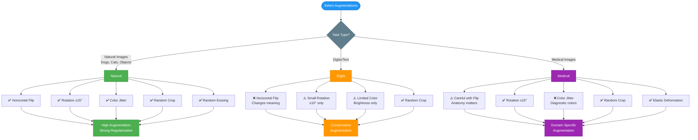
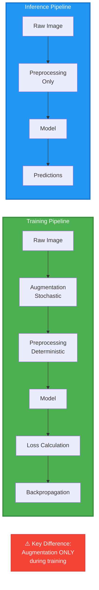

# Image Preprocessing and Augmentation Pipeline

## Pipeline Architecture (Mermaid Diagram)

```mermaid
flowchart TB
    Start([Raw Image<br/>PIL/numpy array]) --> Split{Training or<br/>Test/Val?}

    Split -->|Training| Aug[Data Augmentation]
    Split -->|Test/Val| Prep[Preprocessing Only]

    Aug --> Aug1[Random Horizontal Flip<br/>p=0.5]
    Aug1 --> Aug2[Random Rotation<br/>±15°]
    Aug2 --> Aug3[Random Crop<br/>with padding]
    Aug3 --> Aug4[Color Jitter<br/>brightness/contrast/saturation]
    Aug4 --> Aug5[Random Erasing<br/>optional]
    Aug5 --> Prep

    Prep --> Prep1[Resize to<br/>Fixed Dimensions]
    Prep1 --> Prep2[Convert to Tensor<br/>HWC → CHW]
    Prep2 --> Prep3{Normalization<br/>Strategy?}

    Prep3 -->|Min-Max| Norm1[Scale to [0, 1]<br/>X/255]
    Prep3 -->|Standardize| Norm2[μ=0, σ=1<br/>X - μ / σ]
    Prep3 -->|ImageNet| Norm3[ImageNet Stats<br/>μ=[0.485,0.456,0.406]<br/>σ=[0.229,0.224,0.225]]

    Norm1 --> Model[Model Input<br/>Tensor]
    Norm2 --> Model
    Norm3 --> Model

    Model --> Output([Predictions])

    style Start fill:#2196F3,stroke:#1976D2,color:#fff
    style Aug fill:#4CAF50,stroke:#388E3C,color:#fff
    style Prep fill:#FF9800,stroke:#F57C00,color:#fff
    style Model fill:#9C27B0,stroke:#7B1FA2,color:#fff
    style Output fill:#F44336,stroke:#D32F2F,color:#fff
    style Split fill:#607D8B,stroke:#455A64,color:#fff
    style Prep3 fill:#607D8B,stroke:#455A64,color:#fff
```

## Decision Tree: Which Augmentations to Use?



## Training vs Inference Pipeline



## Normalization Impact on Model Performance

```mermaid
flowchart TB
    Input[Raw Image<br/>Pixel values: 0-255<br/>Wide range] --> Decision{Apply<br/>Normalization?}

    Decision -->|No| Bad[❌ Poor Training<br/>• Slow convergence<br/>• Unstable gradients<br/>• Lower accuracy]

    Decision -->|Yes| Good[✅ Normalized Input<br/>Values: ~[-3, 3]<br/>Consistent scale]

    Good --> Benefits[Benefits:<br/>• Faster convergence<br/>• Stable gradients<br/>• Better accuracy<br/>• Easier optimization]

    Bad --> Fix[Solution:<br/>Apply normalization!]
    Fix --> Good

    style Input fill:#607D8B,stroke:#455A64,color:#fff
    style Decision fill:#FF9800,stroke:#F57C00,color:#fff
    style Bad fill:#F44336,stroke:#D32F2F,color:#fff
    style Good fill:#4CAF50,stroke:#388E3C,color:#fff
    style Benefits fill:#2196F3,stroke:#1976D2,color:#fff
    style Fix fill:#9C27B0,stroke:#7B1FA2,color:#fff
```

---

## Notes

These mermaid diagrams can be rendered in markdown viewers that support mermaid (GitHub, GitLab, VS Code with extension, etc.).

For inclusion in the textbook:
1. Render to SVG using mermaid CLI: `mmdc -i diagram.md -o diagram.svg`
2. Or use online renderer: https://mermaid.live/
3. Export as PNG/SVG for embedding in the chapter

The diagrams use the standard color palette:
- Blue (#2196F3): Primary concepts
- Green (#4CAF50): Positive/recommended actions
- Orange (#FF9800): Caution/moderate risk
- Red (#F44336): Warnings/problems
- Purple (#9C27B0): Advanced/specialized
- Gray (#607D8B): Neutral/decision points
