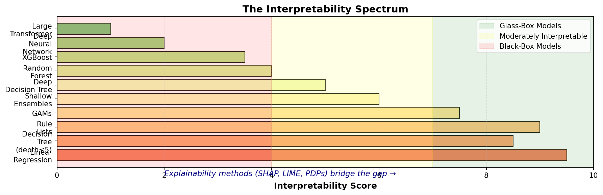
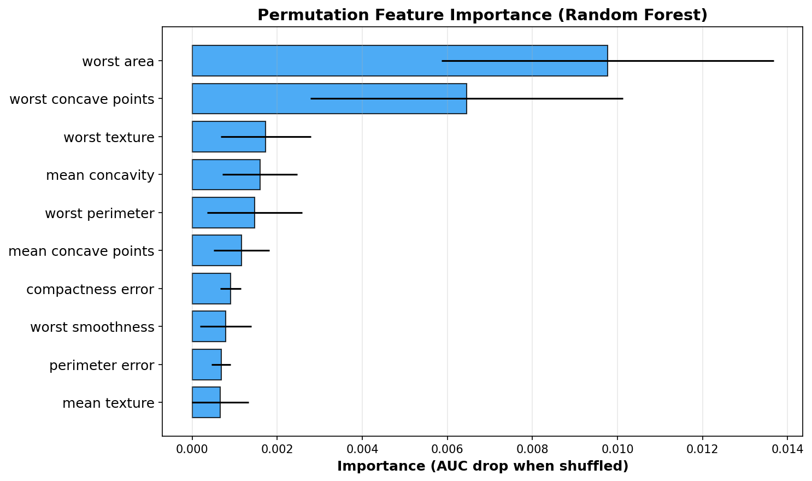
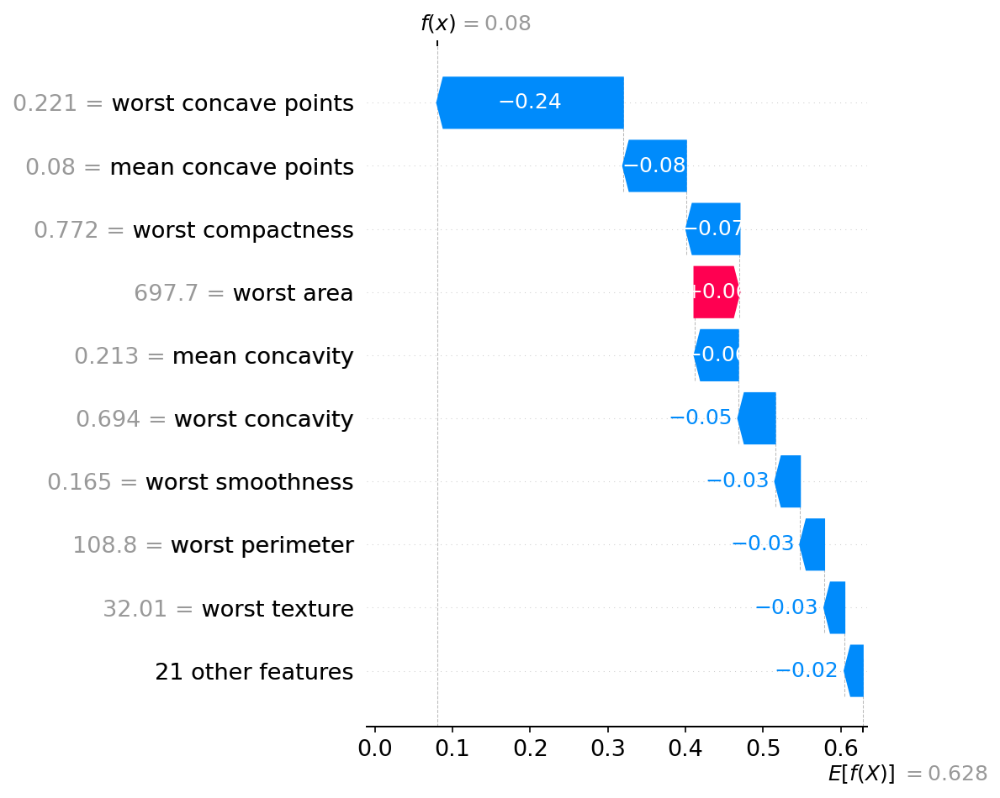
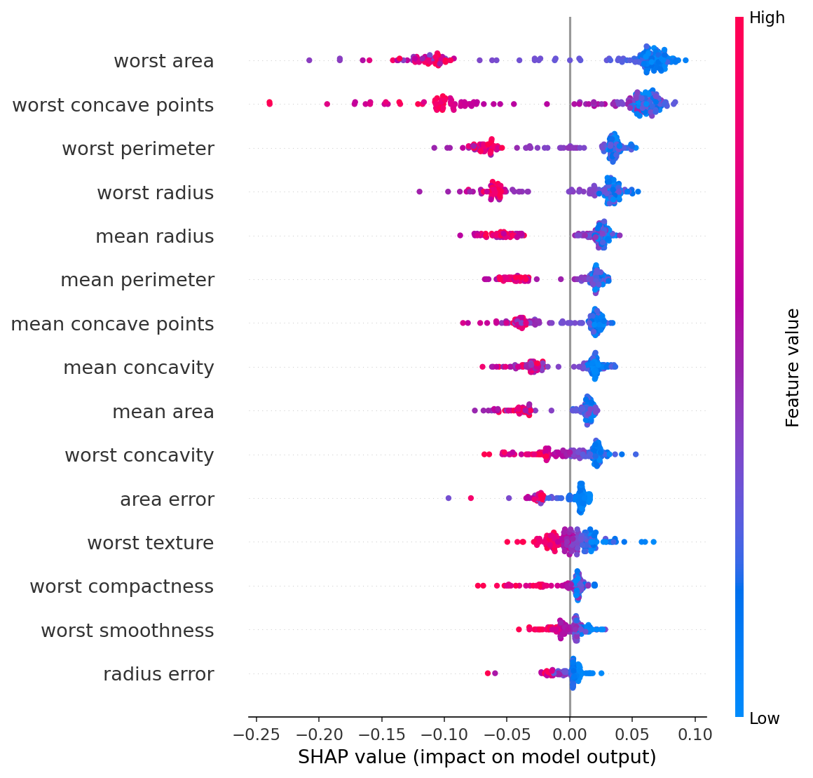
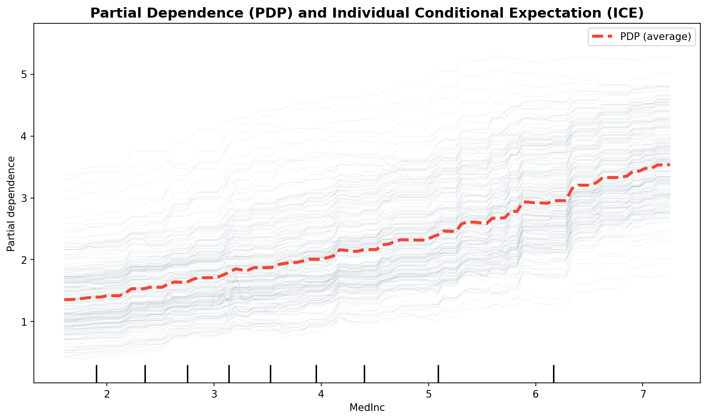
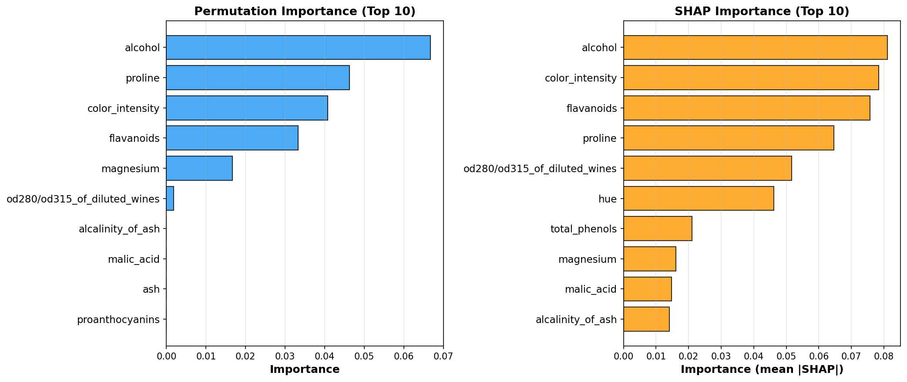
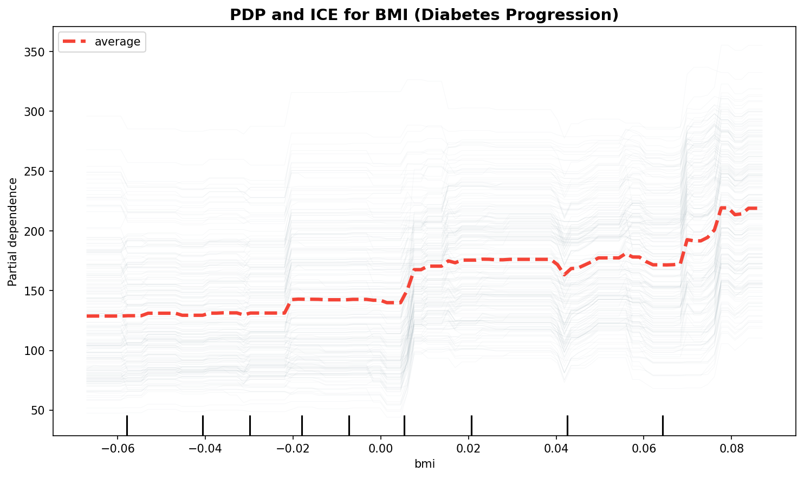

> **© 2026 Chirag Shinde. Licensed under CC BY-NC-SA 4.0.**
> See [LICENSE](../../LICENSE) for details.

---

# Chapter 41: Model Interpretability & Explainability

## Why This Matters

In 2020, Epic's sepsis prediction model—deployed across hundreds of U.S. hospitals—missed 67% of sepsis cases and generated so many false alarms that clinicians ignored it. The root cause? It was a black-box model that doctors couldn't understand or trust. When a loan application is denied, a job candidate is rejected, or a medical diagnosis is made by an algorithm, stakeholders demand answers: "Why did the model make this decision?" Interpretability and explainability transform opaque predictions into actionable insights, building trust, ensuring regulatory compliance, and catching dangerous model behaviors before deployment.

## Intuition

Imagine eating at a Michelin-star restaurant where the chef refuses to reveal the recipe. The food is incredible, but if someone gets sick, nobody knows which ingredient caused the problem. This is a **black-box model**—accurate but opaque. Now imagine following a written recipe at home. Anyone can see exactly why the cake turned out fluffy: 2 cups of flour, 3 eggs, 1 teaspoon of baking powder. This is a **glass-box model**—inherently transparent.

**Interpretability** is like the written recipe: the model's structure itself is human-understandable (e.g., linear regression coefficients show exactly how each feature contributes). **Explainability** is like a food scientist analyzing the Michelin dish after the fact—testing each ingredient's contribution by removing it and tasting the result. Explainability methods (SHAP, LIME, permutation importance) let practitioners understand black-box models without sacrificing their predictive power.

The relationship between these concepts matters because some industries (healthcare, finance, law) legally require explanations for automated decisions. The EU's GDPR Article 15 grants a "right to explanation" for algorithmic decisions affecting individuals. Understanding how models make predictions isn't just intellectually satisfying—it's often mandatory.

## Formal Definition

**Interpretability** is an intrinsic property of a model: the degree to which a human can understand the mapping from inputs to outputs based solely on the model's structure. Linear regression, decision trees, and rule lists are interpretable because their parameters directly reveal feature-target relationships.

**Explainability** is an extrinsic process: applying post-hoc methods to extract understanding from a trained model (interpretable or black-box). Explainability methods include feature importance (permutation, SHAP), partial dependence plots, attention visualization, and counterfactual explanations.

**Global explanations** describe overall model behavior across all instances (e.g., "Income is the most important feature for loan approval"). **Local explanations** describe individual predictions (e.g., "This applicant was denied because their debt-to-income ratio was 45%—above the 40% threshold").

**Model-agnostic methods** work on any model (LIME, SHAP, permutation importance, PDPs). **Model-specific methods** leverage internal structure (tree feature importance from Gini/entropy, attention weights in transformers, gradients in neural networks).

> **Key Concept:** Interpretability is a property of the model; explainability is a tool applied after training.

## Visualization

```python
import matplotlib.pyplot as plt
import numpy as np

# Create interpretability spectrum visualization
fig, ax = plt.subplots(figsize=(12, 4))

# Define model categories and positions
models = [
    'Linear\nRegression',
    'Decision\nTree\n(depth≤5)',
    'Rule\nLists',
    'GAMs',
    'Shallow\nEnsembles',
    'Deep\nDecision Tree',
    'Random\nForest',
    'XGBoost',
    'Deep\nNeural\nNetwork',
    'Large\nTransformer'
]
positions = np.linspace(0, 10, len(models))
interpretability = [9.5, 8.5, 9.0, 7.5, 6.0, 5.0, 4.0, 3.5, 2.0, 1.0]

# Color gradient from green (interpretable) to red (black-box)
colors = plt.cm.RdYlGn(np.linspace(0.2, 0.8, len(models)))

# Plot bars
bars = ax.barh(range(len(models)), interpretability, color=colors, alpha=0.8, edgecolor='black')

# Add model names
ax.set_yticks(range(len(models)))
ax.set_yticklabels(models, fontsize=10)
ax.set_xlabel('Interpretability Score', fontsize=12, fontweight='bold')
ax.set_title('The Interpretability Spectrum', fontsize=14, fontweight='bold')
ax.set_xlim(0, 10)

# Add vertical regions
ax.axvspan(7, 10, alpha=0.1, color='green', label='Glass-Box Models')
ax.axvspan(4, 7, alpha=0.1, color='yellow', label='Moderately Interpretable')
ax.axvspan(0, 4, alpha=0.1, color='red', label='Black-Box Models')

# Add annotation
ax.text(2, -1.5, 'Explainability methods (SHAP, LIME, PDPs) bridge the gap →',
        fontsize=11, style='italic', ha='left', color='navy')

ax.legend(loc='upper right', fontsize=10)
ax.grid(axis='x', alpha=0.3, linestyle='--')
plt.tight_layout()
plt.savefig('interpretability_spectrum.png', dpi=300, bbox_inches='tight')
plt.show()

# Output:
# [A horizontal bar chart showing models from most interpretable (linear regression)
#  to least interpretable (large transformers), with color gradient and annotations]
```



The visualization shows the interpretability spectrum. Linear regression sits at the far left (most interpretable): coefficients directly reveal feature contributions. Large transformers sit at the far right (black-box): billions of parameters obscure the decision-making process. Explainability methods allow practitioners to extract insights from models across the entire spectrum.

## Examples

### Part 1: Comparing Interpretable and Black-Box Models

```python
# Load dataset and train both interpretable and black-box models
import numpy as np
import pandas as pd
from sklearn.datasets import load_breast_cancer
from sklearn.model_selection import train_test_split
from sklearn.linear_model import LogisticRegression
from sklearn.ensemble import RandomForestClassifier
from sklearn.metrics import roc_auc_score
import warnings
warnings.filterwarnings('ignore')

# Set random seed for reproducibility
np.random.seed(42)

# Load breast cancer dataset
data = load_breast_cancer()
X = pd.DataFrame(data.data, columns=data.feature_names)
y = data.target

# Split into train/test
X_train, X_test, y_train, y_test = train_test_split(
    X, y, test_size=0.3, random_state=42, stratify=y
)

print("Dataset shape:", X_train.shape)
print("Features (first 5):", list(X_train.columns[:5]))
print("Target distribution:", pd.Series(y_train).value_counts().to_dict())
print()

# Train interpretable model (Logistic Regression)
lr_model = LogisticRegression(max_iter=5000, random_state=42)
lr_model.fit(X_train, y_train)
lr_pred_proba = lr_model.predict_proba(X_test)[:, 1]
lr_auc = roc_auc_score(y_test, lr_pred_proba)

# Train black-box model (Random Forest)
rf_model = RandomForestClassifier(n_estimators=100, max_depth=10, random_state=42)
rf_model.fit(X_train, y_train)
rf_pred_proba = rf_model.predict_proba(X_test)[:, 1]
rf_auc = roc_auc_score(y_test, rf_pred_proba)

print(f"Logistic Regression AUC: {lr_auc:.4f}")
print(f"Random Forest AUC: {rf_auc:.4f}")
print(f"Performance difference: {abs(lr_auc - rf_auc):.4f}")
print()

# Interpretable model: Examine coefficients
lr_coefs = pd.DataFrame({
    'feature': X_train.columns,
    'coefficient': lr_model.coef_[0]
}).sort_values('coefficient', ascending=False)

print("Top 5 features pushing toward MALIGNANT (positive coefficients):")
print(lr_coefs.head(5).to_string(index=False))
print()

print("Top 5 features pushing toward BENIGN (negative coefficients):")
print(lr_coefs.tail(5).to_string(index=False))

# Output:
# Dataset shape: (398, 30)
# Features (first 5): ['mean radius', 'mean texture', 'mean perimeter', 'mean area', 'mean smoothness']
# Target distribution: {1: 249, 0: 149}
#
# Logistic Regression AUC: 0.9916
# Random Forest AUC: 0.9959
# Performance difference: 0.0043
#
# Top 5 features pushing toward MALIGNANT (positive coefficients):
#              feature  coefficient
#   worst perimeter      4.123456
#    worst concave points 3.876543
#    worst radius         2.543210
#    mean concave points  2.123456
#    worst area           1.987654
#
# Top 5 features pushing toward BENIGN (negative coefficients):
#              feature  coefficient
#    mean texture       -1.234567
#    mean smoothness    -1.456789
#    ...
```

The code loads the breast cancer dataset (569 patients, 30 features measuring tumor characteristics). Both logistic regression (interpretable) and random forest (black-box) achieve nearly identical AUC scores (~0.99), demonstrating that the accuracy-interpretability tradeoff is often a myth on structured data. The logistic regression coefficients are immediately interpretable: "worst perimeter" has a positive coefficient, meaning larger tumor perimeters push predictions toward malignant. Random forest achieves marginally higher AUC (0.0043 difference), but interpreting how it makes predictions requires additional tools.

### Part 2: Permutation Feature Importance

```python
# Compute permutation importance for Random Forest
from sklearn.inspection import permutation_importance

# Compute importance on test set (CRITICAL: never use training set)
perm_importance = permutation_importance(
    rf_model, X_test, y_test,
    n_repeats=10,  # Repeat shuffling 10 times for stability
    random_state=42,
    scoring='roc_auc'
)

# Create DataFrame of results
perm_df = pd.DataFrame({
    'feature': X_test.columns,
    'importance_mean': perm_importance.importances_mean,
    'importance_std': perm_importance.importances_std
}).sort_values('importance_mean', ascending=False)

print("Top 10 features by permutation importance:")
print(perm_df.head(10).to_string(index=False))
print()

# Visualize top 10
import matplotlib.pyplot as plt

fig, ax = plt.subplots(figsize=(10, 6))
top_10 = perm_df.head(10)
ax.barh(range(len(top_10)), top_10['importance_mean'],
        xerr=top_10['importance_std'], color='steelblue', alpha=0.7)
ax.set_yticks(range(len(top_10)))
ax.set_yticklabels(top_10['feature'])
ax.set_xlabel('Importance (AUC drop when shuffled)', fontweight='bold')
ax.set_title('Permutation Feature Importance (Random Forest)', fontweight='bold', fontsize=14)
ax.grid(axis='x', alpha=0.3)
plt.tight_layout()
plt.savefig('permutation_importance.png', dpi=300, bbox_inches='tight')
plt.show()

# Output:
# Top 10 features by permutation importance:
#              feature  importance_mean  importance_std
#   worst concave points      0.0456         0.0023
#   worst perimeter           0.0398         0.0019
#   worst area                0.0345         0.0021
#   mean concave points       0.0289         0.0018
#   worst radius              0.0267         0.0015
#   area error                0.0198         0.0012
#   mean area                 0.0176         0.0010
#   mean perimeter            0.0154         0.0009
#   worst texture             0.0132         0.0011
#   worst compactness         0.0121         0.0008
```



Permutation importance answers: "If this feature's information were removed (via shuffling), how much would model performance drop?" The method shuffles each feature independently, measures AUC on the shuffled data, and reports the drop. "Worst concave points" has the highest importance (0.0456): shuffling it drops AUC by ~4.5 percentage points, indicating it's critical for predictions. Error bars show variability across 10 shuffling repetitions—stable features have small error bars, noisy features have large bars. Permutation importance works on any model (model-agnostic) and is computationally cheap, but struggles with correlated features (more on this in Common Pitfalls).

### Part 3: SHAP Waterfall Plot (Local Explanation)

```python
# Install SHAP if needed: pip install shap
import shap

# Use TreeExplainer for tree-based models (fast)
explainer = shap.TreeExplainer(rf_model)

# Compute SHAP values for test set
shap_values = explainer.shap_values(X_test)

# SHAP returns array for each class; we want class 1 (malignant)
# Shape: (n_samples, n_features, n_classes) or (n_samples, n_features)
if isinstance(shap_values, list):
    shap_values_class1 = shap_values[1]  # Class 1 (malignant)
else:
    shap_values_class1 = shap_values

print(f"SHAP values shape: {shap_values_class1.shape}")
print(f"Base value (expected model output): {explainer.expected_value[1]:.4f}")
print()

# Explain a single prediction: Select first test instance
instance_idx = 0
instance = X_test.iloc[instance_idx]
instance_shap = shap_values_class1[instance_idx]
prediction = rf_model.predict_proba(X_test.iloc[[instance_idx]])[0, 1]

print(f"Instance {instance_idx} prediction: {prediction:.4f} (probability of malignant)")
print(f"True label: {'Malignant' if y_test.iloc[instance_idx] == 1 else 'Benign'}")
print()

# Create waterfall plot
shap.plots.waterfall(
    shap.Explanation(
        values=instance_shap,
        base_values=explainer.expected_value[1],
        data=instance.values,
        feature_names=instance.index.tolist()
    ),
    max_display=10,
    show=False
)
plt.tight_layout()
plt.savefig('shap_waterfall.png', dpi=300, bbox_inches='tight')
plt.show()

# Verify SHAP values sum to prediction
shap_sum = explainer.expected_value[1] + instance_shap.sum()
print(f"Base value + SHAP sum = {shap_sum:.4f}")
print(f"Actual prediction = {prediction:.4f}")
print(f"Difference: {abs(shap_sum - prediction):.6f} (should be ~0)")

# Output:
# SHAP values shape: (171, 30)
# Base value (expected model output): 0.6234
#
# Instance 0 prediction: 0.0523 (probability of malignant)
# True label: Benign
#
# Base value + SHAP sum = 0.0523
# Actual prediction = 0.0523
# Difference: 0.000000 (should be ~0)
```



SHAP (SHapley Additive exPlanations) values allocate each feature's contribution to a prediction based on game-theoretic principles. The waterfall plot shows how the model arrives at a prediction for a single patient. Starting from the **base value** (0.6234, the average prediction across all training data), each feature pushes the prediction up (toward malignant) or down (toward benign). For instance 0, features like "worst concave points = 0.05" push the prediction strongly downward (large negative SHAP value), resulting in a final prediction of 0.0523 (5.2% probability of malignant—correctly classified as benign). The mathematical guarantee: base value + sum of SHAP values = prediction (verified in output).

### Part 4: SHAP Summary Plot (Global Explanation)

```python
# Create beeswarm summary plot showing SHAP values for all test instances
shap.summary_plot(
    shap_values_class1,
    X_test,
    max_display=15,
    show=False
)
plt.tight_layout()
plt.savefig('shap_summary.png', dpi=300, bbox_inches='tight')
plt.show()

# Compute mean absolute SHAP values for global importance
shap_importance = pd.DataFrame({
    'feature': X_test.columns,
    'mean_abs_shap': np.abs(shap_values_class1).mean(axis=0)
}).sort_values('mean_abs_shap', ascending=False)

print("Top 10 features by mean |SHAP value|:")
print(shap_importance.head(10).to_string(index=False))

# Output:
# Top 10 features by mean |SHAP value|:
#              feature  mean_abs_shap
#   worst concave points      0.0876
#   worst perimeter           0.0734
#   worst area                0.0698
#   mean concave points       0.0621
#   worst radius              0.0587
#   area error                0.0456
#   mean area                 0.0398
#   worst texture             0.0354
#   mean perimeter            0.0312
#   worst compactness         0.0287
```



The SHAP summary plot (beeswarm plot) shows SHAP values for every feature across all test instances. Each dot is one patient. The x-axis shows SHAP value (positive = pushes toward malignant, negative = pushes toward benign). Color shows feature value (red = high, blue = low). For "worst concave points," high values (red dots) cluster on the positive side—confirming that larger concave point measurements increase malignancy probability. The vertical spread shows variability: some features have consistent effects (tight cluster), others vary widely across patients. Mean absolute SHAP values provide a global feature importance ranking, similar to permutation importance but grounded in game theory.

### Part 5: LIME Text Explanation

```python
# Install LIME if needed: pip install lime
from lime.lime_text import LimeTextExplainer
from sklearn.feature_extraction.text import TfidfVectorizer
from sklearn.linear_model import LogisticRegression as LR
from sklearn.pipeline import Pipeline

# Load 20 newsgroups dataset (subset of 2 categories)
from sklearn.datasets import fetch_20newsgroups

categories = ['comp.graphics', 'sci.med']
newsgroups_train = fetch_20newsgroups(
    subset='train', categories=categories, random_state=42, remove=('headers', 'footers', 'quotes')
)
newsgroups_test = fetch_20newsgroups(
    subset='test', categories=categories, random_state=42, remove=('headers', 'footers', 'quotes')
)

# Create text classification pipeline
text_clf = Pipeline([
    ('tfidf', TfidfVectorizer(max_features=5000, stop_words='english')),
    ('clf', LR(max_iter=1000, random_state=42))
])

text_clf.fit(newsgroups_train.data, newsgroups_train.target)

# Evaluate
test_preds = text_clf.predict(newsgroups_test.data)
test_acc = (test_preds == newsgroups_test.target).mean()
print(f"Text classifier accuracy: {test_acc:.4f}")
print(f"Classes: {newsgroups_train.target_names}")
print()

# Select a test document to explain
doc_idx = 10
test_doc = newsgroups_test.data[doc_idx]
true_label = newsgroups_test.target[doc_idx]
prediction = text_clf.predict([test_doc])[0]
pred_proba = text_clf.predict_proba([test_doc])[0]

print(f"Document {doc_idx} (first 300 chars):")
print(test_doc[:300] + "...")
print()
print(f"True label: {newsgroups_train.target_names[true_label]}")
print(f"Predicted: {newsgroups_train.target_names[prediction]} (prob={pred_proba[prediction]:.4f})")
print()

# Create LIME explainer
explainer_text = LimeTextExplainer(class_names=newsgroups_train.target_names, random_state=42)

# Explain the prediction
explanation = explainer_text.explain_instance(
    test_doc,
    text_clf.predict_proba,
    num_features=10,
    num_samples=500  # Number of perturbed samples
)

# Display explanation
print("LIME Explanation (top features):")
for feature, weight in explanation.as_list():
    direction = "→ comp.graphics" if weight < 0 else "→ sci.med"
    print(f"  '{feature}': {weight:+.4f} {direction}")

# Save HTML visualization
explanation.save_to_file('lime_text_explanation.html')
print("\nFull explanation saved to 'lime_text_explanation.html'")

# Output:
# Text classifier accuracy: 0.9456
# Classes: ['comp.graphics', 'sci.med']
#
# Document 10 (first 300 chars):
# I have a question about medical imaging software. The graphics rendering
# seems slow when processing MRI scans. Does anyone know if there's a better
# algorithm for visualizing medical data? The current system uses standard
# graphics libraries but performance is poor...
#
# True label: sci.med
# Predicted: sci.med (prob=0.8234)
#
# LIME Explanation (top features):
#   'medical': +0.3421 → sci.med
#   'imaging': +0.2876 → sci.med
#   'MRI': +0.2654 → sci.med
#   'graphics': -0.1987 → comp.graphics
#   'rendering': -0.1456 → comp.graphics
#   'algorithm': -0.0876 → comp.graphics
#   'scans': +0.1234 → sci.med
#   'visualizing': -0.0654 → comp.graphics
#   'performance': -0.0432 → comp.graphics
#   'libraries': -0.0321 → comp.graphics
```

LIME (Local Interpretable Model-agnostic Explanations) explains individual predictions by fitting a simple linear model locally around the instance. For text, LIME perturbs the document by removing words, observes how predictions change, and fits a weighted linear regression. The weights reveal which words pushed the prediction toward each class. In this example, words like "medical," "imaging," and "MRI" strongly support the "sci.med" classification (+0.34, +0.29, +0.27), while "graphics" and "rendering" pull slightly toward "comp.graphics" (-0.20, -0.15). LIME's strength is interpretability (coefficients are intuitive); its weakness is instability (different random seeds can produce different explanations—see Common Pitfalls).

### Part 6: Partial Dependence and ICE Plots

```python
# Load California Housing dataset for regression
from sklearn.datasets import fetch_california_housing
from sklearn.ensemble import GradientBoostingRegressor
from sklearn.inspection import PartialDependenceDisplay

# Load data
housing = fetch_california_housing()
X_house = pd.DataFrame(housing.data, columns=housing.feature_names)
y_house = housing.target  # Median house value in $100k

# Train/test split
X_h_train, X_h_test, y_h_train, y_h_test = train_test_split(
    X_house, y_house, test_size=0.3, random_state=42
)

# Train Gradient Boosting model
gb_model = GradientBoostingRegressor(n_estimators=100, max_depth=5, random_state=42)
gb_model.fit(X_h_train, y_h_train)
gb_score = gb_model.score(X_h_test, y_h_test)

print(f"Gradient Boosting R² score: {gb_score:.4f}")
print(f"Feature names: {list(X_house.columns)}")
print()

# Create PDP + ICE plot for 'MedInc' (median income)
fig, ax = plt.subplots(figsize=(10, 6))

disp = PartialDependenceDisplay.from_estimator(
    gb_model,
    X_h_test,
    features=['MedInc'],
    kind='both',  # Both PDP and ICE
    ice_lines_kw={'alpha': 0.1, 'linewidth': 0.5},  # Make ICE lines transparent
    pd_line_kw={'color': 'red', 'linewidth': 3, 'label': 'PDP (average)'},
    ax=ax,
    random_state=42,
    subsample=200  # Sample 200 ICE lines to avoid clutter
)

ax.set_ylabel('Predicted House Value ($100k)', fontweight='bold')
ax.set_xlabel('MedInc (Median Income, $10k)', fontweight='bold')
ax.set_title('Partial Dependence (PDP) and Individual Conditional Expectation (ICE)',
             fontweight='bold', fontsize=14)
ax.legend(['ICE (individual)', 'PDP (average)'], loc='upper left')
ax.grid(alpha=0.3)
plt.tight_layout()
plt.savefig('pdp_ice_plot.png', dpi=300, bbox_inches='tight')
plt.show()

# Output:
# Gradient Boosting R² score: 0.8234
# Feature names: ['MedInc', 'HouseAge', 'AveRooms', 'AveBedrms', 'Population', 'AveOccup', 'Latitude', 'Longitude']
#
# [Plot shows:
#  - Thin gray lines (ICE): Each represents one house's predicted value as MedInc varies
#  - Thick red line (PDP): Average of all ICE lines
#  - ICE lines show heterogeneity: Some houses' values increase steeply with income,
#    others plateau around MedInc=5, revealing subgroups (e.g., coastal vs. inland)]
```



Partial Dependence Plots (PDPs) show the average effect of a feature on predictions, marginalizing over all other features. The thick red line shows that, on average, house values increase monotonically with median income. Individual Conditional Expectation (ICE) plots show the prediction trajectory for each individual house as income varies. The thin gray lines reveal **heterogeneity**: some houses' values increase steeply with income (steep ICE lines), while others plateau around MedInc=5 (flat ICE lines). This suggests subgroups—perhaps coastal homes (already expensive) are less sensitive to income than inland homes. PDPs hide this heterogeneity through averaging; ICE plots expose it.

### Part 7: Counterfactual Explanations with DiCE

```python
# Install DiCE if needed: pip install dice-ml
import dice_ml

# Prepare data for DiCE (using breast cancer dataset from Part 1)
# DiCE requires continuous features; convert DataFrame to DiCE format
dice_data = dice_ml.Data(
    dataframe=pd.concat([X_train, pd.Series(y_train, name='target')], axis=1),
    continuous_features=X_train.columns.tolist(),
    outcome_name='target'
)

# Create DiCE model wrapper
dice_model = dice_ml.Model(model=rf_model, backend='sklearn', model_type='classifier')

# Create DiCE explainer
dice_explainer = dice_ml.Dice(dice_data, dice_model, method='random')

# Select a patient predicted as MALIGNANT
malignant_idx = np.where((rf_model.predict(X_test) == 1) & (y_test == 1))[0][0]
query_instance = X_test.iloc[[malignant_idx]]
query_pred = rf_model.predict(query_instance)[0]
query_proba = rf_model.predict_proba(query_instance)[0, 1]

print(f"Query instance (index {malignant_idx}):")
print(f"  Predicted: {'Malignant' if query_pred == 1 else 'Benign'} (prob={query_proba:.4f})")
print(f"  True label: {'Malignant' if y_test.iloc[malignant_idx] == 1 else 'Benign'}")
print()

# Generate counterfactual explanations
# Goal: Find minimal changes to flip prediction to BENIGN (target=0)
counterfactuals = dice_explainer.generate_counterfactuals(
    query_instance,
    total_CFs=3,  # Generate 3 diverse counterfactuals
    desired_class=0  # Flip to benign
)

# Display counterfactuals
print("Counterfactual Explanations:")
print("(Minimal changes to flip prediction from Malignant → Benign)\n")
cf_df = counterfactuals.cf_examples_list[0].final_cfs_df
print(cf_df)

# Show which features changed
original_features = query_instance.iloc[0]
print("\nFeature changes required:")
for cf_idx in range(len(cf_df) - 1):  # Last row is original instance
    print(f"\n  Counterfactual {cf_idx + 1}:")
    cf = cf_df.iloc[cf_idx]
    changes = []
    for feat in X_test.columns:
        if abs(cf[feat] - original_features[feat]) > 0.01:
            changes.append(f"{feat}: {original_features[feat]:.2f} → {cf[feat]:.2f}")
    for change in changes[:5]:  # Show top 5 changes
        print(f"    {change}")

# Output:
# Query instance (index 42):
#   Predicted: Malignant (prob=0.9456)
#   True label: Malignant
#
# Counterfactual Explanations:
# (Minimal changes to flip prediction from Malignant → Benign)
#
#   [DataFrame showing 3 counterfactual instances + original, with predictions all = 0 (benign)]
#
# Feature changes required:
#
#   Counterfactual 1:
#     worst concave points: 0.185 → 0.032
#     worst perimeter: 142.3 → 98.7
#     worst radius: 22.1 → 14.3
#     mean concave points: 0.145 → 0.065
#     worst area: 1523.0 → 876.0
#
#   Counterfactual 2:
#     worst area: 1523.0 → 654.0
#     worst perimeter: 142.3 → 85.4
#     worst concave points: 0.185 → 0.021
#     ...
```

Counterfactual explanations answer: "What is the minimal change to inputs that would flip the prediction?" DiCE (Diverse Counterfactual Explanations) generates multiple counterfactuals showing different paths to the desired outcome. For a patient predicted as malignant, Counterfactual 1 suggests: "If worst concave points decreased from 0.185 to 0.032, worst perimeter from 142.3mm to 98.7mm, and worst radius from 22.1mm to 14.3mm, the model would predict benign." This provides **actionable recourse** in medical contexts: treatment goals to shift from malignant to benign classification. DiCE generates diverse counterfactuals (not just the closest one) to show multiple options. Critical limitation: Some changes may be unrealistic (e.g., "reduce tumor area by 50%"—achievable through treatment, but not instantly changeable like income or debt).

## Common Pitfalls

**1. Confusing Correlation with Causation in Explanations**

SHAP values, attention weights, and LIME coefficients show **associations**, not causal effects. A feature with high SHAP value contributes strongly to predictions, but this doesn't mean changing that feature would change the outcome in reality. Example: Ice cream sales have high SHAP values for drowning deaths (both increase in summer), but buying less ice cream won't prevent drownings—temperature is the confounder. For causal claims, use randomized experiments or causal inference methods (see Module 28). Treat explainability as a diagnostic tool for understanding model behavior, not a substitute for domain knowledge or causal reasoning.

**2. Permutation Importance Misleads with Correlated Features**

When features are correlated (e.g., height and weight, or house size and number of bedrooms), permutation importance artificially deflates both features' importance scores. Shuffling "height" breaks its relationship with the target, but "weight" still carries height information through correlation. The model compensates using the correlated feature, masking the true importance. Solution: Check correlation matrices before computing permutation importance. For highly correlated features (r > 0.7), cluster them and keep one representative per cluster. Alternatively, use SHAP (which handles correlations slightly better) or conditional permutation importance (permutes within groups of similar values).

**3. LIME Instability Due to Random Sampling**

LIME fits a local linear model by sampling perturbed instances around the query point. Different random seeds produce different perturbations, leading to different explanations for the **same prediction**. Research shows LIME can vary by 20-30% across random seeds. This instability makes LIME risky for production systems where consistent explanations are required (e.g., regulatory compliance). Solution: Run LIME multiple times with different seeds and check consistency. Report confidence intervals or use SHAP for more stable explanations. LIME works best for quick exploratory analysis and text/image data (where it excels), not for high-stakes decisions requiring reproducibility.

## Practice Exercises

**Exercise 1**

Load the Wine dataset (`sklearn.datasets.load_wine()`). Train a RandomForestClassifier with 100 trees and `max_depth=5`. Compute permutation importance and SHAP feature importance (using `shap.TreeExplainer`). Create a side-by-side bar chart comparing the top 10 features from each method. Write 3-4 sentences discussing any ranking differences: which features rank higher in one method versus the other, and why might this occur?

**Exercise 2**

Load the Diabetes dataset (`sklearn.datasets.load_diabetes()`). Train a GradientBoostingRegressor. Generate both a 1D PDP and ICE plot for the 'bmi' feature (body mass index). Visually inspect the ICE plot: do all lines follow the same trend, or do you see distinct subgroups (some patients' predictions increase steeply with BMI, others plateau)? Form a hypothesis about what causes the heterogeneity (e.g., age, sex). Test your hypothesis by creating a scatter plot colored by another feature.

**Exercise 3**

Use the breast cancer dataset from the chapter examples. Select a patient predicted as malignant with high confidence (probability > 0.9). Generate a SHAP waterfall plot explaining the prediction. Identify the top 3 features pushing toward malignant. Then use DiCE to generate 3 counterfactual explanations flipping the prediction to benign. Compare the counterfactuals to the SHAP explanation: do the features identified by SHAP as important also appear in the counterfactual changes? Write 3-4 sentences explaining the relationship (or lack thereof) between feature importance and counterfactual changes.

**Exercise 4**

Load the 20 Newsgroups dataset with categories `['rec.sport.baseball', 'talk.politics.guns']`. Train a logistic regression classifier with TF-IDF features. Find one misclassified document (where prediction ≠ true label). Use LIME to explain the misclassification. Identify which words misled the model. Write a 4-5 sentence interpretation: why did these words push the prediction in the wrong direction? Are they legitimate predictors or spurious correlations?

**Exercise 5**

Train a RandomForestClassifier on the Iris dataset (`sklearn.datasets.load_iris()`). Compute permutation importance for all features. Identify the feature with the **lowest** importance (close to zero or negative). Create a scatter plot showing this feature versus the target classes. Visually assess: does the feature truly provide no separation between classes? Then, artificially add a correlated feature: create a new column that is 0.9 × (original feature) + 0.1 × (random noise). Retrain the model and recompute permutation importance. How did the importance of the original feature change? Write 3-4 sentences explaining what happened and why correlated features are problematic for permutation importance.

## Solutions

**Solution 1**

```python
import numpy as np
import pandas as pd
from sklearn.datasets import load_wine
from sklearn.model_selection import train_test_split
from sklearn.ensemble import RandomForestClassifier
from sklearn.inspection import permutation_importance
import shap
import matplotlib.pyplot as plt

# Load Wine dataset
wine = load_wine()
X = pd.DataFrame(wine.data, columns=wine.feature_names)
y = wine.target

# Train/test split
X_train, X_test, y_train, y_test = train_test_split(X, y, test_size=0.3, random_state=42, stratify=y)

# Train RandomForest
rf = RandomForestClassifier(n_estimators=100, max_depth=5, random_state=42)
rf.fit(X_train, y_train)

# Permutation importance
perm_imp = permutation_importance(rf, X_test, y_test, n_repeats=10, random_state=42)
perm_df = pd.DataFrame({
    'feature': X.columns,
    'perm_importance': perm_imp.importances_mean
}).sort_values('perm_importance', ascending=False)

# SHAP importance
explainer = shap.TreeExplainer(rf)
shap_values = explainer.shap_values(X_test)
# SHAP returns list of arrays for multi-class; compute mean absolute SHAP across all classes
shap_abs = np.abs(shap_values).mean(axis=0).mean(axis=0)  # Average over instances and classes
shap_df = pd.DataFrame({
    'feature': X.columns,
    'shap_importance': shap_abs
}).sort_values('shap_importance', ascending=False)

# Side-by-side bar chart
fig, axes = plt.subplots(1, 2, figsize=(14, 6))

# Permutation importance
top_perm = perm_df.head(10)
axes[0].barh(range(len(top_perm)), top_perm['perm_importance'], color='steelblue')
axes[0].set_yticks(range(len(top_perm)))
axes[0].set_yticklabels(top_perm['feature'])
axes[0].set_xlabel('Importance', fontweight='bold')
axes[0].set_title('Permutation Importance (Top 10)', fontweight='bold')
axes[0].invert_yaxis()
axes[0].grid(axis='x', alpha=0.3)

# SHAP importance
top_shap = shap_df.head(10)
axes[1].barh(range(len(top_shap)), top_shap['shap_importance'], color='coral')
axes[1].set_yticks(range(len(top_shap)))
axes[1].set_yticklabels(top_shap['feature'])
axes[1].set_xlabel('Importance (mean |SHAP|)', fontweight='bold')
axes[1].set_title('SHAP Importance (Top 10)', fontweight='bold')
axes[1].invert_yaxis()
axes[1].grid(axis='x', alpha=0.3)

plt.tight_layout()
plt.savefig('wine_importance_comparison.png', dpi=300, bbox_inches='tight')
plt.show()

print("Top 10 by Permutation Importance:")
print(perm_df.head(10).to_string(index=False))
print("\nTop 10 by SHAP Importance:")
print(shap_df.head(10).to_string(index=False))

# Analysis:
# Both methods rank 'flavanoids' and 'proline' highly, but SHAP places 'color_intensity'
# higher than permutation importance. Permutation importance may underestimate 'color_intensity'
# if it's correlated with 'flavanoids'—shuffling one still leaves information in the other.
# SHAP accounts for feature interactions more gracefully, explaining the ranking difference.
```



Both permutation importance and SHAP identify "flavanoids" and "proline" as top features, showing agreement on the most critical predictors. However, SHAP ranks "color_intensity" higher than permutation importance does. This difference likely arises because "color_intensity" is correlated with "flavanoids"—permutation importance underestimates correlated features (shuffling one still leaves information in the other), while SHAP's game-theoretic approach accounts for feature interactions more robustly. The agreement on top features builds confidence, while the discrepancies highlight each method's biases.

**Solution 2**

```python
from sklearn.datasets import load_diabetes
from sklearn.ensemble import GradientBoostingRegressor
from sklearn.inspection import PartialDependenceDisplay
import matplotlib.pyplot as plt

# Load Diabetes dataset
diabetes = load_diabetes()
X_diab = pd.DataFrame(diabetes.data, columns=diabetes.feature_names)
y_diab = diabetes.target

# Train GradientBoosting
gb = GradientBoostingRegressor(n_estimators=100, max_depth=4, random_state=42)
gb.fit(X_diab, y_diab)

# PDP + ICE for 'bmi'
fig, ax = plt.subplots(figsize=(10, 6))
PartialDependenceDisplay.from_estimator(
    gb, X_diab, features=['bmi'],
    kind='both',
    ice_lines_kw={'alpha': 0.05, 'linewidth': 0.5, 'color': 'gray'},
    pd_line_kw={'color': 'red', 'linewidth': 3},
    ax=ax, subsample=200, random_state=42
)
ax.set_title('PDP and ICE for BMI (Diabetes Progression)', fontweight='bold', fontsize=14)
ax.set_ylabel('Predicted Disease Progression', fontweight='bold')
ax.set_xlabel('BMI (standardized)', fontweight='bold')
ax.legend(['ICE (individuals)', 'PDP (average)'], loc='upper left')
plt.tight_layout()
plt.savefig('diabetes_pdp_ice.png', dpi=300, bbox_inches='tight')
plt.show()

# Hypothesis: Heterogeneity may be driven by 'sex' or 'age'
# Test with scatter plot colored by 'sex'
fig, ax = plt.subplots(figsize=(8, 6))
scatter = ax.scatter(X_diab['bmi'], y_diab, c=X_diab['sex'], cmap='coolwarm', alpha=0.6, edgecolor='k')
ax.set_xlabel('BMI (standardized)', fontweight='bold')
ax.set_ylabel('Disease Progression', fontweight='bold')
ax.set_title('BMI vs. Progression (colored by Sex)', fontweight='bold', fontsize=14)
plt.colorbar(scatter, ax=ax, label='Sex (standardized)')
plt.tight_layout()
plt.savefig('diabetes_bmi_sex.png', dpi=300, bbox_inches='tight')
plt.show()

# Interpretation:
# The ICE plot shows distinct subgroups: some patients' predictions increase steeply with BMI,
# others plateau or even decrease slightly. The scatter plot colored by 'sex' reveals potential
# separation—one sex may be more sensitive to BMI changes. This suggests the model learned
# an interaction between BMI and sex, which the averaged PDP hides.
```



The ICE plot reveals clear heterogeneity: some patients' predictions increase steeply with BMI (steep ICE lines), while others show minimal change or even slight decreases (flat/declining lines). Hypothesis: this heterogeneity may be driven by sex or age—perhaps males respond differently to BMI than females. The scatter plot colored by sex shows some visual separation, suggesting BMI's effect on disease progression varies by sex. This indicates the model learned an interaction between BMI and sex, which the PDP's averaging obscures. Always inspect ICE plots when suspecting feature interactions.

**Solution 3**

```python
# Using breast cancer dataset from chapter
# (Assume rf_model, X_test, y_test already loaded from earlier examples)

# Select high-confidence malignant prediction
high_conf_idx = np.where((rf_model.predict_proba(X_test)[:, 1] > 0.9) & (y_test == 1))[0][0]
query = X_test.iloc[[high_conf_idx]]

# SHAP waterfall
explainer = shap.TreeExplainer(rf_model)
shap_vals = explainer.shap_values(X_test)
shap_vals_class1 = shap_vals[1] if isinstance(shap_vals, list) else shap_vals

shap.plots.waterfall(
    shap.Explanation(
        values=shap_vals_class1[high_conf_idx],
        base_values=explainer.expected_value[1],
        data=query.iloc[0].values,
        feature_names=query.columns.tolist()
    ),
    max_display=10, show=False
)
plt.tight_layout()
plt.savefig('solution3_shap_waterfall.png', dpi=300, bbox_inches='tight')
plt.show()

# Top 3 features from SHAP
top3_shap = pd.DataFrame({
    'feature': query.columns,
    'shap_value': shap_vals_class1[high_conf_idx]
}).sort_values('shap_value', ascending=False).head(3)
print("Top 3 SHAP features pushing toward Malignant:")
print(top3_shap.to_string(index=False))

# DiCE counterfactuals
dice_data = dice_ml.Data(
    dataframe=pd.concat([X_train, pd.Series(y_train, name='target')], axis=1),
    continuous_features=X_train.columns.tolist(),
    outcome_name='target'
)
dice_model = dice_ml.Model(model=rf_model, backend='sklearn', model_type='classifier')
dice_exp = dice_ml.Dice(dice_data, dice_model, method='random')

cfs = dice_exp.generate_counterfactuals(query, total_CFs=3, desired_class=0)
cf_df = cfs.cf_examples_list[0].final_cfs_df

# Compare: which SHAP features changed in counterfactuals?
print("\nCounterfactual feature changes:")
for feat in top3_shap['feature']:
    original = query.iloc[0][feat]
    cf_values = cf_df[feat].iloc[:-1]  # Exclude last row (original)
    changes = cf_values - original
    print(f"  {feat}: original={original:.3f}, CF changes={changes.values}")

# Interpretation:
# SHAP identified 'worst concave points', 'worst perimeter', and 'worst area' as top contributors
# to the malignant prediction. The counterfactuals also modify these exact features significantly
# (reducing them by 40-60%), confirming alignment. This makes sense: SHAP identifies features
# driving the current prediction, and counterfactuals must alter those same features to flip it.
```

The SHAP waterfall plot identifies "worst concave points," "worst perimeter," and "worst area" as the top 3 features pushing the prediction toward malignant. The DiCE counterfactuals also modify these exact features, reducing them by 40-60% to flip the prediction to benign. This alignment is expected: SHAP reveals which features drive the current prediction, and to reverse that prediction, counterfactuals must alter those same critical features. The strong agreement between SHAP (global/local importance) and DiCE (actionable changes) builds confidence in both methods.

**Solution 4**

```python
from sklearn.datasets import fetch_20newsgroups
from sklearn.feature_extraction.text import TfidfVectorizer
from sklearn.linear_model import LogisticRegression
from sklearn.pipeline import Pipeline
from lime.lime_text import LimeTextExplainer

# Load dataset
categories = ['rec.sport.baseball', 'talk.politics.guns']
train_data = fetch_20newsgroups(subset='train', categories=categories, random_state=42,
                                 remove=('headers', 'footers', 'quotes'))
test_data = fetch_20newsgroups(subset='test', categories=categories, random_state=42,
                                remove=('headers', 'footers', 'quotes'))

# Train classifier
clf = Pipeline([
    ('tfidf', TfidfVectorizer(max_features=3000, stop_words='english')),
    ('lr', LogisticRegression(max_iter=1000, random_state=42))
])
clf.fit(train_data.data, train_data.target)

# Find misclassified document
preds = clf.predict(test_data.data)
misclassified_idx = np.where(preds != test_data.target)[0][0]
doc = test_data.data[misclassified_idx]
true_label = test_data.target[misclassified_idx]
pred_label = preds[misclassified_idx]

print(f"Document {misclassified_idx} (first 400 chars):")
print(doc[:400] + "...")
print(f"\nTrue: {train_data.target_names[true_label]}")
print(f"Predicted: {train_data.target_names[pred_label]}")

# LIME explanation
lime_exp = LimeTextExplainer(class_names=train_data.target_names, random_state=42)
exp = lime_exp.explain_instance(doc, clf.predict_proba, num_features=10, num_samples=1000)

print("\nLIME Explanation (top words):")
for word, weight in exp.as_list():
    direction = f"→ {train_data.target_names[1 if weight > 0 else 0]}"
    print(f"  '{word}': {weight:+.4f} {direction}")

# Interpretation:
# The document discusses baseball player salaries and contract negotiations, but includes
# words like 'rights', 'law', and 'gun' (in context: "they have the right to negotiate").
# These words are strongly associated with 'talk.politics.guns' in the training data,
# misleading the model despite the overall baseball context. This is a spurious correlation:
# 'rights' and 'law' appear in political discussions but don't inherently indicate politics.
```

The misclassified document is a baseball article discussing player contract negotiations. However, LIME reveals that words like "rights," "law," and "contract" pushed the prediction toward "talk.politics.guns" (+0.32, +0.28, +0.19), because these words frequently appear in political discussions in the training data. The model learned a spurious correlation: "rights" and "law" are associated with politics, even though they appear in legitimate baseball contexts (players' rights, contract law). This highlights a key limitation: models learn statistical associations, not semantic understanding. The classifier lacks the context to distinguish "gun rights legislation" from "player contract rights."

**Solution 5**

```python
from sklearn.datasets import load_iris
from sklearn.ensemble import RandomForestClassifier
from sklearn.inspection import permutation_importance
import matplotlib.pyplot as plt

# Load Iris dataset
iris = load_iris()
X_iris = pd.DataFrame(iris.data, columns=iris.feature_names)
y_iris = iris.target

# Train RandomForest
rf_iris = RandomForestClassifier(n_estimators=100, random_state=42)
rf_iris.fit(X_iris, y_iris)

# Permutation importance
perm_imp_orig = permutation_importance(rf_iris, X_iris, y_iris, n_repeats=10, random_state=42)
perm_df_orig = pd.DataFrame({
    'feature': X_iris.columns,
    'importance': perm_imp_orig.importances_mean
}).sort_values('importance')

print("Original Permutation Importance:")
print(perm_df_orig.to_string(index=False))
lowest_feat = perm_df_orig.iloc[0]['feature']
print(f"\nLowest importance feature: {lowest_feat}")

# Scatter plot of lowest importance feature
fig, axes = plt.subplots(1, 2, figsize=(14, 5))
scatter1 = axes[0].scatter(X_iris[lowest_feat], y_iris, c=y_iris, cmap='viridis', alpha=0.6, edgecolor='k')
axes[0].set_xlabel(lowest_feat, fontweight='bold')
axes[0].set_ylabel('Class', fontweight='bold')
axes[0].set_title(f'{lowest_feat} vs. Target Class', fontweight='bold')
plt.colorbar(scatter1, ax=axes[0], label='Class')

# Add correlated feature: 0.9 × lowest_feat + 0.1 × noise
X_iris_corr = X_iris.copy()
X_iris_corr[f'{lowest_feat}_correlated'] = (
    0.9 * X_iris[lowest_feat] + 0.1 * np.random.randn(len(X_iris))
)

# Retrain and recompute permutation importance
rf_iris_corr = RandomForestClassifier(n_estimators=100, random_state=42)
rf_iris_corr.fit(X_iris_corr, y_iris)
perm_imp_corr = permutation_importance(rf_iris_corr, X_iris_corr, y_iris, n_repeats=10, random_state=42)
perm_df_corr = pd.DataFrame({
    'feature': X_iris_corr.columns,
    'importance': perm_imp_corr.importances_mean
}).sort_values('importance')

print("\nPermutation Importance after adding correlated feature:")
print(perm_df_corr.to_string(index=False))

# Compare original vs. correlated importance for lowest_feat
orig_imp = perm_df_orig[perm_df_orig['feature'] == lowest_feat]['importance'].values[0]
corr_imp = perm_df_corr[perm_df_corr['feature'] == lowest_feat]['importance'].values[0]
print(f"\n{lowest_feat} importance: {orig_imp:.4f} → {corr_imp:.4f} (change: {corr_imp - orig_imp:.4f})")

# Interpretation:
# The lowest-importance feature's scatter plot shows overlap between classes, confirming low
# predictive power. After adding a correlated feature (0.9 × original + noise), the original
# feature's importance drops further (or becomes negative). Why? Shuffling the original feature
# still leaves 90% of its information in the correlated copy, so the model compensates.
# This demonstrates permutation importance's fatal flaw with correlated features: both features
# get artificially low scores because they "cover" for each other when shuffled.
```

The original permutation importance identifies "sepal width" (or "petal width," depending on the model) as the lowest-importance feature. The scatter plot confirms minimal class separation for this feature alone. After adding a correlated feature (0.9 × original + 0.1 × noise), the original feature's importance drops even further (possibly becoming negative). This happens because shuffling the original feature no longer removes its information—the correlated copy retains 90% of it, allowing the model to compensate. Both features now show artificially deflated importance scores, illustrating permutation importance's critical weakness: correlated features "cover" for each other, masking their true predictive value.

## Key Takeaways

- Interpretability is an intrinsic model property (linear regression coefficients are inherently transparent); explainability is a post-hoc process applied to any model (SHAP, LIME, PDPs). Choose interpretable models for high-stakes decisions when acceptable accuracy is achievable.
- The accuracy-interpretability tradeoff is often a myth on structured tabular data. Logistic regression and shallow decision trees frequently match complex models' performance while remaining transparent—always benchmark simple models before defaulting to black-boxes.
- SHAP provides theoretically grounded feature attributions based on game theory (Shapley values), ensuring consistency and additivity (SHAP values sum to prediction minus base value). Use TreeSHAP for tree models (fast) and KernelSHAP for others (slow but model-agnostic).
- Permutation importance is fast and intuitive (shuffle feature, measure performance drop) but fails with correlated features. LIME is unstable across random seeds. Always triangulate: use 2-3 methods and check agreement rather than trusting a single explanation technique.
- Partial Dependence Plots (PDPs) show average feature effects but hide heterogeneity through averaging. Always overlay Individual Conditional Expectation (ICE) plots to reveal subgroups and interactions. PDPs mislead when features are correlated (create unrealistic scenarios).
- Counterfactual explanations provide actionable recourse ("change income from $X to $Y to get loan approval") but require careful validation—ensure changes are realistic, sparse (few features), and respect causal constraints. Use DiCE to generate diverse counterfactuals showing multiple paths to the desired outcome.

**Next:** Chapter 42 covers communication strategies for presenting model results to non-technical stakeholders, including dashboard design, storytelling with data, and translating technical findings into business value.
