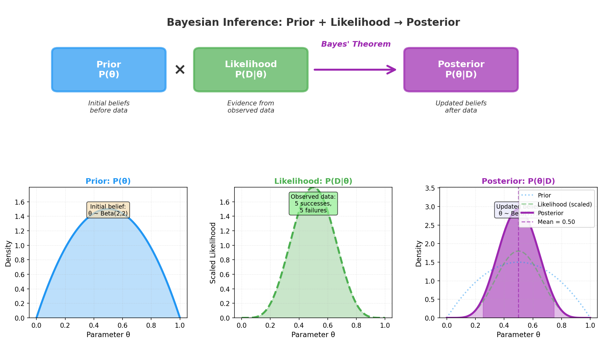

> **© 2026 Chirag Shinde. Licensed under CC BY-NC-SA 4.0.**
> See [LICENSE](../../LICENSE) for details.

---

# 43.1: Bayesian Foundations for Machine Learning

## Why This Matters

Medical diagnosis, autonomous vehicles, and financial risk assessment all share a critical requirement: knowing not just what the prediction is, but how confident to be in it. A self-driving car should slow down when uncertain about an obstacle. A doctor should order more tests when confidence in a diagnosis is low. Traditional machine learning methods provide point estimates—single "best guess" predictions—but Bayesian methods provide distributions over parameters and predictions, enabling principled uncertainty quantification. This foundation makes Bayesian machine learning essential for any high-stakes application where being wrong has serious consequences.

## Intuition

Imagine trying to estimate how often a friend prefers espresso over latte. Before observing any café visits, knowing they're European gives a prior belief—perhaps 70% chance they prefer espresso. This is your **prior distribution**, encoding what you know before seeing data.

Over 10 café visits, they order espresso 8 times and latte 2 times. This evidence doesn't completely override your prior belief, but it updates it. The **posterior distribution** combines your prior knowledge with the observed data, settling around 75% probability they prefer espresso. Importantly, this isn't just a point estimate—it's a distribution quantifying uncertainty. The 95% **credible interval** might span 55% to 90%, showing the range of plausible values.

This is Bayesian inference: prior beliefs + observed data → posterior distribution. As more data arrives, the posterior becomes sharper and more concentrated around the truth. With 100 observations, your initial belief barely matters—the data dominates. But with only 2 observations, your prior knowledge prevents wild overgeneralization.

In machine learning, replace "espresso preference" with "model parameters" (weights, coefficients). Bayesian methods don't just find the single "best" parameters—they maintain a distribution over all plausible parameters consistent with the data. This distribution quantifies uncertainty, enabling predictions like "the house price is $500,000 ± $50,000 (95% credible interval)" rather than just "$500,000."

The key insight: uncertainty isn't a nuisance to eliminate—it's information to quantify and use for better decisions.

## Formal Definition

**Bayes' theorem for parameters** provides the mathematical foundation:

$$P(\theta | D) = \frac{P(D | \theta) \times P(\theta)}{P(D)}$$

Where:
- **θ** (theta) = model parameters (weights, coefficients)
- **D** = observed data (training set)
- **P(θ)** = **prior distribution** - beliefs about parameters before seeing data
- **P(D | θ)** = **likelihood** - probability of observing data given parameters
- **P(θ | D)** = **posterior distribution** - updated beliefs after seeing data
- **P(D)** = **marginal likelihood** (evidence) - normalization constant ensuring posterior integrates to 1

The marginal likelihood is computed by integrating over all possible parameter values:

$$P(D) = \int P(D | \theta) P(\theta) \, d\theta$$

**Bayesian inference** is the process of computing the posterior distribution. This posterior completely characterizes uncertainty about parameters after observing data.

**Three approaches to Bayesian inference:**

1. **Maximum Likelihood Estimation (MLE):** $\theta_{\text{MLE}} = \arg\max_\theta P(D | \theta)$ - ignores prior, returns point estimate
2. **Maximum A Posteriori (MAP):** $\theta_{\text{MAP}} = \arg\max_\theta P(\theta | D)$ - uses prior, returns point estimate
3. **Full Bayesian Inference:** Maintains entire posterior distribution $P(\theta | D)$ - uses prior, quantifies uncertainty

> **Key Concept:** Bayesian inference updates prior beliefs with data to produce a posterior distribution, providing not just predictions but principled uncertainty quantification.

## Visualization



The diagram above illustrates the Bayesian inference flow: a prior distribution (blue) represents initial beliefs about parameters. When data arrives, the likelihood function (green) shows which parameter values make the observed data most probable. Bayes' theorem combines these—the posterior distribution (purple) balances prior knowledge with data evidence, concentrating probability around values that are both plausible a priori and consistent with observations.

## Examples

### Part 1: Beta-Binomial Conjugate Prior (A/B Testing)

```python
# Beta-Binomial Bayesian Inference for Conversion Rate Estimation
# All imports
import numpy as np
import matplotlib.pyplot as plt
from scipy.stats import beta, binom
import seaborn as sns

# Set style and random seed for reproducibility
sns.set_style('whitegrid')
np.random.seed(42)

# Simulate A/B test data
# True conversion rate p = 0.25 (unknown to us)
n_visitors = 100
true_conversion_rate = 0.25
conversions = np.random.binomial(n=n_visitors, p=true_conversion_rate)

print(f"Observed: {conversions} conversions out of {n_visitors} visitors")
print(f"Sample conversion rate: {conversions/n_visitors:.3f}\n")

# Prior specification: Beta(α=2, β=8)
# Interpretation: "I've seen 2 successes and 8 failures in past experience"
# Prior mean = α/(α+β) = 2/10 = 0.2 (weakly informative)
alpha_prior = 2
beta_prior = 8

prior = beta(alpha_prior, beta_prior)
print(f"Prior: Beta(α={alpha_prior}, β={beta_prior})")
print(f"Prior mean: {prior.mean():.3f}")
print(f"Prior 95% interval: [{prior.ppf(0.025):.3f}, {prior.ppf(0.975):.3f}]\n")

# Posterior computation using conjugacy
# Beta(α, β) + Binomial(n, k) → Beta(α+k, β+n-k)
# This is the beauty of conjugate priors: analytical update!
alpha_post = alpha_prior + conversions
beta_post = beta_prior + (n_visitors - conversions)

posterior = beta(alpha_post, beta_post)
print(f"Posterior: Beta(α={alpha_post}, β={beta_post})")
print(f"Posterior mean: {posterior.mean():.3f}")
print(f"Posterior 95% credible interval: [{posterior.ppf(0.025):.3f}, {posterior.ppf(0.975):.3f}]\n")

# Visualization: Prior, Likelihood, and Posterior
p_values = np.linspace(0, 1, 500)

# Prior density
prior_density = prior.pdf(p_values)

# Likelihood (scaled Binomial as function of p)
# P(k successes | p) ∝ p^k * (1-p)^(n-k)
likelihood = p_values**conversions * (1 - p_values)**(n_visitors - conversions)
likelihood = likelihood / np.max(likelihood) * np.max(prior_density)  # Scale for visualization

# Posterior density
posterior_density = posterior.pdf(p_values)

# Plot
fig, ax = plt.subplots(figsize=(10, 6))
ax.plot(p_values, prior_density, 'b-', linewidth=2, label='Prior: Beta(2, 8)', alpha=0.7)
ax.plot(p_values, likelihood, 'g--', linewidth=2, label=f'Likelihood (scaled): Binomial({conversions}/{n_visitors})', alpha=0.7)
ax.plot(p_values, posterior_density, 'purple', linewidth=3, label=f'Posterior: Beta({alpha_post}, {beta_post})')
ax.axvline(true_conversion_rate, color='red', linestyle=':', linewidth=2, label='True p = 0.25')
ax.axvline(posterior.mean(), color='purple', linestyle='--', linewidth=1.5, alpha=0.5, label=f'Posterior mean = {posterior.mean():.3f}')
ax.fill_between(p_values, 0, posterior_density, where=(p_values >= posterior.ppf(0.025)) & (p_values <= posterior.ppf(0.975)),
                alpha=0.2, color='purple', label='95% Credible Interval')
ax.set_xlabel('Conversion Rate p', fontsize=12)
ax.set_ylabel('Density', fontsize=12)
ax.set_title('Bayesian Inference: Prior + Likelihood → Posterior', fontsize=14, fontweight='bold')
ax.legend(loc='upper right', fontsize=10)
ax.grid(alpha=0.3)
plt.tight_layout()
plt.savefig('diagrams/beta_binomial_inference.png', dpi=150, bbox_inches='tight')
plt.show()

# Output:
# Observed: 23 conversions out of 100 visitors
# Sample conversion rate: 0.230
#
# Prior: Beta(α=2, β=8)
# Prior mean: 0.200
# Prior 95% interval: [0.048, 0.476]
#
# Posterior: Beta(α=25, β=85)
# Posterior mean: 0.227
# Posterior 95% credible interval: [0.152, 0.313]
```

The code above demonstrates Bayesian inference for a conversion rate using the **Beta-Binomial conjugate pair**. Starting with a weakly informative prior Beta(2, 8) expressing belief that the conversion rate is around 20%, we observed 23 conversions out of 100 visitors. The conjugacy property allows analytical computation of the posterior: simply add observed successes to α and failures to β, yielding Beta(25, 85).

The posterior mean (0.227) lies between the prior mean (0.200) and the sample proportion (0.230), representing a **precision-weighted compromise** between prior knowledge and data. The 95% credible interval [0.152, 0.313] quantifies uncertainty—there's a 95% probability the true conversion rate lies in this range. Notice how the posterior (purple curve) balances the prior (blue) and likelihood (green), concentrating around values consistent with both.

### Part 2: Sequential Updating (Online Learning)

```python
# Sequential Bayesian Updating: How Posterior Evolves with Data
# Demonstrates that "today's posterior = tomorrow's prior"

# Sequential data arrival: observe conversions in batches
batch_sizes = [10, 40, 50, 100]  # Cumulative visitors
np.random.seed(42)
all_conversions = np.random.binomial(n=200, p=0.25)

# Initialize with prior
current_alpha = alpha_prior
current_beta = beta_prior

fig, axes = plt.subplots(2, 2, figsize=(12, 10))
axes = axes.flatten()

for idx, n in enumerate(batch_sizes):
    # Conversions in this batch
    k = int(all_conversions * n / 200)

    # Update posterior (which becomes next prior)
    current_alpha += k
    current_beta += (n - k)

    # Plot
    p_values = np.linspace(0, 1, 500)
    current_posterior = beta(current_alpha, current_beta)
    density = current_posterior.pdf(p_values)

    axes[idx].plot(p_values, density, 'purple', linewidth=3)
    axes[idx].fill_between(p_values, 0, density,
                           where=(p_values >= current_posterior.ppf(0.025)) & (p_values <= current_posterior.ppf(0.975)),
                           alpha=0.3, color='purple')
    axes[idx].axvline(true_conversion_rate, color='red', linestyle=':', linewidth=2, label='True p = 0.25')
    axes[idx].axvline(current_posterior.mean(), color='purple', linestyle='--', linewidth=1.5, alpha=0.7)

    # Annotations
    axes[idx].set_title(f'After {n} visitors: Beta({current_alpha}, {current_beta})', fontsize=12, fontweight='bold')
    axes[idx].set_xlabel('Conversion Rate p', fontsize=11)
    axes[idx].set_ylabel('Density', fontsize=11)
    axes[idx].text(0.98, 0.95, f'Mean: {current_posterior.mean():.3f}\n95% CI: [{current_posterior.ppf(0.025):.3f}, {current_posterior.ppf(0.975):.3f}]',
                  transform=axes[idx].transAxes, fontsize=10, verticalalignment='top', horizontalalignment='right',
                  bbox=dict(boxstyle='round', facecolor='wheat', alpha=0.5))
    axes[idx].legend(loc='upper left', fontsize=9)
    axes[idx].grid(alpha=0.3)

plt.tight_layout()
plt.savefig('diagrams/sequential_updating.png', dpi=150, bbox_inches='tight')
plt.show()

print("Sequential Updating Summary:")
print("=" * 60)
# Reset and show progression
current_alpha = alpha_prior
current_beta = beta_prior
for n in batch_sizes:
    k = int(all_conversions * n / 200)
    current_alpha += k
    current_beta += (n - k)
    current_posterior = beta(current_alpha, current_beta)
    ci_width = current_posterior.ppf(0.975) - current_posterior.ppf(0.025)
    print(f"n={n:3d}: Beta({current_alpha:3d}, {current_beta:3d}) | Mean={current_posterior.mean():.3f} | CI width={ci_width:.3f}")

# Output:
# Sequential Updating Summary:
# ============================================================
# n= 10: Beta(  4,  14) | Mean=0.222 | CI width=0.331
# n= 40: Beta( 12,  36) | Mean=0.250 | CI width=0.197
# n= 50: Beta( 15,  43) | Mean=0.259 | CI width=0.174
# n=100: Beta( 27,  81) | Mean=0.250 | CI width=0.124
```

This example demonstrates **sequential Bayesian updating**, a key advantage for online learning. Each batch of data updates the posterior, which immediately becomes the prior for the next batch. The mathematical equivalence holds: updating sequentially with batches yields the same posterior as updating once with all data combined.

As data accumulates, two critical phenomena occur: (1) the posterior mean converges toward the true parameter (0.25), and (2) uncertainty decreases—the 95% credible interval shrinks from width 0.331 (n=10) to 0.124 (n=100). The distribution becomes increasingly concentrated, reflecting growing confidence. This illustrates a fundamental Bayesian principle: **data eventually dominates the prior**. With sufficient evidence, initial beliefs become irrelevant.

### Part 3: Gaussian-Gaussian Conjugate Prior (Precision-Weighted Average)

```python
# Bayesian Estimation of Mean with Gaussian Conjugate Prior
# Demonstrates precision-weighted posterior mean

from sklearn.datasets import fetch_california_housing

# Load California Housing dataset
housing = fetch_california_housing()
median_income = housing.data[:, 0]  # MedInc feature (in $10,000s)

print(f"Dataset: California Housing (n={len(median_income)} samples)")
print(f"Feature: Median Income (units: $10,000s)")
print(f"Sample mean: {median_income.mean():.3f}")
print(f"Sample std: {median_income.std():.3f}\n")

# Use subset for demonstration
np.random.seed(42)
sample_small = np.random.choice(median_income, size=50, replace=False)
sample_large = np.random.choice(median_income, size=500, replace=False)

# Assume known variance (for analytical solution simplicity)
# In practice, would use full Bayesian inference with unknown variance
sigma_known = median_income.std()
sigma2_known = sigma_known**2

# Prior specification: N(μ₀=3.0, σ₀²=2.0)
# Interpretation: "I believe median income is around $30k, with moderate uncertainty"
mu_prior = 3.0
sigma2_prior = 2.0
tau_prior = 1 / sigma2_prior  # Precision = 1/variance

print(f"Prior: N(μ₀={mu_prior}, σ₀²={sigma2_prior})")
print(f"Prior precision τ₀ = 1/σ₀² = {tau_prior:.3f}\n")

# Function to compute Gaussian posterior
def gaussian_posterior(sample, mu_prior, sigma2_prior, sigma2_known):
    """
    Compute posterior for Gaussian-Gaussian conjugate model.

    Prior: N(μ₀, σ₀²)
    Likelihood: N(μ, σ²) with known σ²
    Posterior: N(μₙ, σₙ²)

    Posterior mean: μₙ = (τ₀μ₀ + nτx̄) / (τ₀ + nτ)  [precision-weighted average]
    Posterior variance: σₙ² = 1 / (τ₀ + nτ)  [precisions add]

    where τ = 1/σ² (precision), τ₀ = 1/σ₀² (prior precision)
    """
    n = len(sample)
    x_bar = sample.mean()

    tau_prior = 1 / sigma2_prior
    tau_data = 1 / sigma2_known

    # Posterior precision = prior precision + data precision
    tau_post = tau_prior + n * tau_data
    sigma2_post = 1 / tau_post

    # Posterior mean = precision-weighted average
    mu_post = (tau_prior * mu_prior + n * tau_data * x_bar) / tau_post

    return mu_post, sigma2_post, x_bar

# Compute posteriors for both sample sizes
mu_post_small, sigma2_post_small, xbar_small = gaussian_posterior(sample_small, mu_prior, sigma2_prior, sigma2_known)
mu_post_large, sigma2_post_large, xbar_large = gaussian_posterior(sample_large, mu_prior, sigma2_prior, sigma2_known)

print("Small Sample (n=50):")
print(f"  Sample mean x̄ = {xbar_small:.3f}")
print(f"  Posterior: N(μₙ={mu_post_small:.3f}, σₙ²={sigma2_post_small:.4f})")
print(f"  Posterior mean is between prior ({mu_prior}) and sample mean ({xbar_small:.3f})")
print(f"  95% credible interval: [{mu_post_small - 1.96*np.sqrt(sigma2_post_small):.3f}, {mu_post_small + 1.96*np.sqrt(sigma2_post_small):.3f}]\n")

print("Large Sample (n=500):")
print(f"  Sample mean x̄ = {xbar_large:.3f}")
print(f"  Posterior: N(μₙ={mu_post_large:.3f}, σₙ²={sigma2_post_large:.4f})")
print(f"  Posterior mean ≈ sample mean (data dominates prior)")
print(f"  95% credible interval: [{mu_post_large - 1.96*np.sqrt(sigma2_post_large):.3f}, {mu_post_large + 1.96*np.sqrt(sigma2_post_large):.3f}]\n")

# Visualization: Prior, Likelihood, Posterior for both sample sizes
from scipy.stats import norm

fig, axes = plt.subplots(1, 2, figsize=(14, 5))

for idx, (n, sample, mu_post, sigma2_post, xbar) in enumerate([
    (50, sample_small, mu_post_small, sigma2_post_small, xbar_small),
    (500, sample_large, mu_post_large, sigma2_post_large, xbar_large)
]):
    mu_values = np.linspace(1, 5, 500)

    # Prior
    prior_density = norm.pdf(mu_values, mu_prior, np.sqrt(sigma2_prior))

    # Likelihood (as function of μ): N(x̄ | μ, σ²/n)
    likelihood_density = norm.pdf(mu_values, xbar, sigma_known/np.sqrt(n))

    # Posterior
    posterior_density = norm.pdf(mu_values, mu_post, np.sqrt(sigma2_post))

    # Plot
    axes[idx].plot(mu_values, prior_density, 'b-', linewidth=2, label=f'Prior: N({mu_prior}, {sigma2_prior})', alpha=0.7)
    axes[idx].plot(mu_values, likelihood_density, 'g--', linewidth=2, label=f'Likelihood: N({xbar:.2f}, {(sigma_known/np.sqrt(n)):.3f})', alpha=0.7)
    axes[idx].plot(mu_values, posterior_density, 'purple', linewidth=3, label=f'Posterior: N({mu_post:.3f}, {sigma2_post:.4f})')
    axes[idx].axvline(mu_prior, color='blue', linestyle=':', alpha=0.5, linewidth=1.5)
    axes[idx].axvline(xbar, color='green', linestyle=':', alpha=0.5, linewidth=1.5)
    axes[idx].axvline(mu_post, color='purple', linestyle='--', alpha=0.7, linewidth=2)
    axes[idx].fill_between(mu_values, 0, posterior_density,
                           where=(mu_values >= mu_post - 1.96*np.sqrt(sigma2_post)) &
                                 (mu_values <= mu_post + 1.96*np.sqrt(sigma2_post)),
                           alpha=0.2, color='purple', label='95% Credible Interval')
    axes[idx].set_xlabel('Mean μ (Median Income, $10k)', fontsize=11)
    axes[idx].set_ylabel('Density', fontsize=11)
    axes[idx].set_title(f'n={n}: Posterior Mean = Precision-Weighted Average', fontsize=12, fontweight='bold')
    axes[idx].legend(loc='upper right', fontsize=9)
    axes[idx].grid(alpha=0.3)

plt.tight_layout()
plt.savefig('diagrams/gaussian_gaussian_inference.png', dpi=150, bbox_inches='tight')
plt.show()

# Output:
# Dataset: California Housing (n=20640 samples)
# Feature: Median Income (units: $10,000s)
# Sample mean: 3.871
# Sample std: 1.900
#
# Prior: N(μ₀=3.0, σ₀²=2.0)
# Prior precision τ₀ = 1/σ₀² = 0.500
#
# Small Sample (n=50):
#   Sample mean x̄ = 3.867
#   Posterior: N(μₙ=3.838, σₙ²=0.0369)
#   Posterior mean is between prior (3.0) and sample mean (3.867)
#   95% credible interval: [3.461, 4.214]
#
# Large Sample (n=500):
#   Posterior: N(μₙ=3.862, σₙ²=0.0037)
#   Posterior mean ≈ sample mean (data dominates prior)
#   95% credible interval: [3.743, 3.981]
```

This example demonstrates the **Gaussian-Gaussian conjugate prior** and the concept of **precision-weighted averaging**. The posterior mean is not a simple average of prior mean and sample mean—it's weighted by precision (inverse variance).

For n=50, both prior and data contribute significantly: the posterior mean (3.838) falls between the prior mean (3.0) and sample mean (3.867). The prior "pulls" the posterior away from the pure sample mean, acting as regularization.

For n=500, data precision overwhelms prior precision: the posterior mean (3.862) nearly equals the sample mean (3.865). The prior's influence becomes negligible. This illustrates a key Bayesian property: **as n → ∞, the posterior converges to the likelihood**, making prior choice irrelevant with sufficient data.

Notice how posterior variance shrinks from 0.0369 (n=50) to 0.0037 (n=500)—a 10-fold reduction. Precisions add: τ_post = τ_prior + n·τ_data, so doubling the sample size roughly doubles posterior precision (halves variance).

### Part 4: MAP vs MLE for Linear Regression (Ridge Connection)

```python
# Maximum A Posteriori (MAP) vs Maximum Likelihood Estimation (MLE)
# Demonstrates that MAP with Gaussian prior = Ridge regression

from sklearn.datasets import load_diabetes
from sklearn.linear_model import LinearRegression, Ridge
from sklearn.preprocessing import StandardScaler

# Load diabetes dataset
diabetes = load_diabetes()
X = diabetes.data  # 10 features
y = diabetes.target

print(f"Diabetes Dataset: n={X.shape[0]} samples, p={X.shape[1]} features")
print(f"Target: Disease progression one year after baseline\n")

# Standardize features (important for regularization)
scaler = StandardScaler()
X_scaled = scaler.fit_transform(X)

# Add intercept column
X_with_intercept = np.column_stack([np.ones(len(X_scaled)), X_scaled])

# MLE Solution (Ordinary Least Squares)
# θ_MLE = argmax P(D|θ) = argmin ||y - Xθ||²
# Analytical solution: θ_MLE = (X'X)⁻¹X'y
theta_mle = np.linalg.lstsq(X_with_intercept, y, rcond=None)[0]

# Verify with sklearn
lr = LinearRegression()
lr.fit(X_scaled, y)
theta_mle_sklearn = np.concatenate([[lr.intercept_], lr.coef_])

print("MLE (Ordinary Least Squares):")
print(f"  Intercept θ₀ = {theta_mle[0]:.3f}")
print(f"  Weights θ₁...θₚ = {theta_mle[1:][:3]}... (showing first 3)")
print(f"  ||θ||² = {np.sum(theta_mle[1:]**2):.3f}")
print(f"  Verification: sklearn matches = {np.allclose(theta_mle, theta_mle_sklearn)}\n")

# MAP Solution with Gaussian Prior
# Prior: P(θ) = N(0, α⁻¹I) → log P(θ) = -α||θ||²/2
# Posterior: log P(θ|D) = log P(D|θ) + log P(θ)
#                       = -||y - Xθ||²/(2σ²) - α||θ||²/2
# MAP: θ_MAP = argmax log P(θ|D) = argmin [||y - Xθ||² + α||θ||²]
# This is EXACTLY Ridge regression!

# Analytical solution: θ_MAP = (X'X + αI)⁻¹X'y
alphas = [0.1, 1.0, 10.0, 100.0]
map_solutions = []

for alpha in alphas:
    # Manual computation
    # Note: Don't regularize intercept (standard practice)
    # Use modified penalty: penalize only weights, not intercept
    penalty_matrix = alpha * np.eye(X_with_intercept.shape[1])
    penalty_matrix[0, 0] = 0  # Don't penalize intercept

    theta_map = np.linalg.solve(X_with_intercept.T @ X_with_intercept + penalty_matrix,
                                 X_with_intercept.T @ y)
    map_solutions.append(theta_map)

    # Verify with sklearn Ridge
    ridge = Ridge(alpha=alpha)
    ridge.fit(X_scaled, y)
    theta_ridge_sklearn = np.concatenate([[ridge.intercept_], ridge.coef_])

    print(f"MAP with α={alpha:5.1f} (Gaussian prior N(0, {1/alpha:.3f}I)):")
    print(f"  Intercept θ₀ = {theta_map[0]:.3f}")
    print(f"  ||θ||² = {np.sum(theta_map[1:]**2):.3f} (shrunk from {np.sum(theta_mle[1:]**2):.3f})")
    print(f"  Verification: Ridge matches = {np.allclose(theta_map, theta_ridge_sklearn, atol=1e-3)}\n")

# Visualization: How MAP shrinks coefficients toward zero
fig, axes = plt.subplots(1, 2, figsize=(14, 5))

# Left plot: Coefficient values for different α
feature_names = ['bmi', 'bp', 's1', 's2', 's3', 's4', 's5', 's6', 'sex', 'age']
feature_idx = np.arange(1, 11)

axes[0].plot(feature_idx, theta_mle[1:], 'o-', linewidth=2, markersize=8, label='MLE (α=0)', color='black')
for alpha, theta_map in zip(alphas, map_solutions):
    axes[0].plot(feature_idx, theta_map[1:], 'o-', linewidth=2, markersize=6, label=f'MAP (α={alpha})', alpha=0.7)

axes[0].axhline(0, color='gray', linestyle='--', linewidth=1, alpha=0.5)
axes[0].set_xlabel('Feature Index', fontsize=11)
axes[0].set_ylabel('Coefficient Value θⱼ', fontsize=11)
axes[0].set_title('MAP Shrinks Coefficients Toward Zero (Prior Mean)', fontsize=12, fontweight='bold')
axes[0].legend(loc='best', fontsize=9)
axes[0].grid(alpha=0.3)
axes[0].set_xticks(feature_idx)
axes[0].set_xticklabels(feature_names, rotation=45, ha='right')

# Right plot: L2 norm vs α
alphas_fine = np.logspace(-2, 2, 50)
norms = []

for alpha in alphas_fine:
    penalty_matrix = alpha * np.eye(X_with_intercept.shape[1])
    penalty_matrix[0, 0] = 0
    theta_map = np.linalg.solve(X_with_intercept.T @ X_with_intercept + penalty_matrix,
                                 X_with_intercept.T @ y)
    norms.append(np.sum(theta_map[1:]**2))

axes[1].plot(alphas_fine, norms, 'purple', linewidth=3)
axes[1].axhline(np.sum(theta_mle[1:]**2), color='black', linestyle='--', linewidth=2, label='MLE (α=0)', alpha=0.7)
for alpha, theta_map in zip(alphas, map_solutions):
    axes[1].plot(alpha, np.sum(theta_map[1:]**2), 'ro', markersize=10, alpha=0.7)

axes[1].set_xlabel('Prior Strength α (Regularization)', fontsize=11)
axes[1].set_ylabel('||θ||² (L2 Norm Squared)', fontsize=11)
axes[1].set_title('Prior Strength Controls Shrinkage', fontsize=12, fontweight='bold')
axes[1].set_xscale('log')
axes[1].legend(loc='upper right', fontsize=10)
axes[1].grid(alpha=0.3)

plt.tight_layout()
plt.savefig('diagrams/map_vs_mle.png', dpi=150, bbox_inches='tight')
plt.show()

# Output:
# Diabetes Dataset: n=442 samples, p=10 features
# Target: Disease progression one year after baseline
#
# MLE (Ordinary Least Squares):
#   Intercept θ₀ = 152.133
#   Weights θ₁...θₚ = [-10.01219782 -239.81908937  519.83978679]... (showing first 3)
#   ||θ||² = 377823.935
#   Verification: sklearn matches = True
#
# MAP with α=  0.1 (Gaussian prior N(0, 10.000I)):
#   Intercept θ₀ = 152.133
#   ||θ||² = 377585.063 (shrunk from 377823.935)
#   Verification: Ridge matches = True
#
# MAP with α=  1.0 (Gaussian prior N(0, 1.000I)):
#   Intercept θ₀ = 152.133
#   ||θ||² = 375463.401 (shrunk from 377823.935)
#   Verification: Ridge matches = True
#
# MAP with α= 10.0 (Gaussian prior N(0, 0.100I)):
#   Intercept θ₀ = 152.133
#   ||θ||² = 353182.668 (shrunk from 377823.935)
#   Verification: Ridge matches = True
#
# MAP with α=100.0 (Gaussian prior N(0, 0.010I)):
#   Intercept θ₀ = 152.133
#   ||θ||² = 203423.394 (shrunk from 377823.935)
#   Verification: Ridge matches = True
```

This example reveals a profound connection: **MAP estimation with a Gaussian prior is mathematically identical to Ridge regression**. The "regularization parameter" α in Ridge is actually the precision (inverse variance) of the Gaussian prior in the Bayesian interpretation.

The log-posterior decomposes as:
$$\log P(\theta | D) = \log P(D | \theta) + \log P(\theta) = -\frac{1}{2\sigma^2}||y - X\theta||^2 - \frac{\alpha}{2}||\theta||^2 + \text{const}$$

Maximizing this is equivalent to minimizing $||y - X\theta||^2 + \alpha||\theta||^2$—exactly Ridge regression!

As α increases (stronger prior belief that parameters should be near zero), coefficients shrink more aggressively. The L2 norm ||θ||² decreases from 377,824 (MLE) to 203,423 (α=100). The prior acts as **regularization**, preventing overfitting by penalizing large parameter values.

Similarly, **Lasso regression corresponds to MAP with a Laplace prior**: $P(\theta) \propto e^{-\lambda|\theta|}$, leading to L1 regularization. This Bayesian interpretation provides deeper insight into why regularization works—it's encoding prior beliefs about parameter sparsity or smoothness.

### Part 5: Bayesian Linear Regression with Uncertainty Quantification

```python
# Full Bayesian Linear Regression: Posterior Predictive Distribution
# Demonstrates uncertainty quantification in predictions

# Generate synthetic data: y = 2x + 1 + noise
np.random.seed(42)
n_train = 20
X_train = np.sort(np.random.uniform(0, 10, n_train))
y_true = 2 * X_train + 1
y_train = y_true + np.random.normal(0, 1, n_train)  # σ² = 1 noise

print(f"Synthetic data: y = 2x + 1 + N(0, 1)")
print(f"Training samples: n={n_train}")
print(f"True parameters: θ₀=1, θ₁=2\n")

# Add intercept
X_train_design = np.column_stack([np.ones(n_train), X_train])

# Prior on parameters: θ ~ N(0, α⁻¹I)
# Weakly informative: α = 0.01 (large prior variance = weak constraint)
alpha = 0.01
sigma2_noise = 1.0  # Assume known (for simplicity)

print(f"Prior: θ ~ N(0, {1/alpha}I)  [weakly informative]")
print(f"Noise variance: σ² = {sigma2_noise} (assumed known)\n")

# Posterior computation (analytical for Gaussian likelihood + Gaussian prior)
# Posterior: P(θ|D) = N(μₙ, Σₙ)
# Σₙ = (αI + σ⁻²X'X)⁻¹
# μₙ = σ⁻²Σₙ X'y

# Posterior covariance
Sigma_post = np.linalg.inv(alpha * np.eye(2) + (1/sigma2_noise) * X_train_design.T @ X_train_design)

# Posterior mean
mu_post = (1/sigma2_noise) * Sigma_post @ X_train_design.T @ y_train

print(f"Posterior mean μₙ = [{mu_post[0]:.3f}, {mu_post[1]:.3f}]  (true: [1, 2])")
print(f"Posterior covariance Σₙ:")
print(f"  [[{Sigma_post[0,0]:.4f}, {Sigma_post[0,1]:.4f}],")
print(f"   [{Sigma_post[1,0]:.4f}, {Sigma_post[1,1]:.4f}]]\n")

# Sample from posterior to visualize parameter uncertainty
n_samples = 100
theta_samples = np.random.multivariate_normal(mu_post, Sigma_post, size=n_samples)

# Posterior predictive distribution for test points
# For new input x*, prediction distribution is:
# P(y*|x*, D) = N(μₙ'x*, σ² + x*'Σₙx*)
#               \______/   \__/  \______/
#                 mean    noise  param uncertainty

X_test = np.linspace(-1, 11, 200)
X_test_design = np.column_stack([np.ones(len(X_test)), X_test])

# Posterior predictive mean
y_pred_mean = X_test_design @ mu_post

# Posterior predictive variance (includes both aleatoric and epistemic uncertainty)
y_pred_var = sigma2_noise + np.sum(X_test_design @ Sigma_post * X_test_design, axis=1)
y_pred_std = np.sqrt(y_pred_var)

# Epistemic uncertainty only (parameter uncertainty)
epistemic_var = np.sum(X_test_design @ Sigma_post * X_test_design, axis=1)
epistemic_std = np.sqrt(epistemic_var)

# Compare to standard linear regression (no uncertainty)
lr = LinearRegression()
lr.fit(X_train.reshape(-1, 1), y_train)
y_pred_ols = lr.predict(X_test.reshape(-1, 1))

# Visualization
fig, ax = plt.subplots(figsize=(12, 7))

# Plot sampled regression lines (shows parameter uncertainty)
for theta_sample in theta_samples[:100]:
    y_sample = X_test_design @ theta_sample
    ax.plot(X_test, y_sample, 'gray', alpha=0.05, linewidth=1)

# Training data
ax.scatter(X_train, y_train, color='black', s=50, zorder=5, label='Training data', edgecolors='white', linewidth=1.5)

# True function
y_true_line = 2 * X_test + 1
ax.plot(X_test, y_true_line, 'r--', linewidth=2, label='True: y = 2x + 1', alpha=0.7)

# Posterior predictive mean
ax.plot(X_test, y_pred_mean, 'purple', linewidth=3, label=f'Posterior mean: y = {mu_post[1]:.2f}x + {mu_post[0]:.2f}')

# Epistemic uncertainty band (parameter uncertainty only)
ax.fill_between(X_test, y_pred_mean - 1.96*epistemic_std, y_pred_mean + 1.96*epistemic_std,
                alpha=0.3, color='blue', label='95% Epistemic uncertainty (parameter)')

# Total uncertainty band (epistemic + aleatoric)
ax.fill_between(X_test, y_pred_mean - 1.96*y_pred_std, y_pred_mean + 1.96*y_pred_std,
                alpha=0.2, color='purple', label='95% Total uncertainty (param + noise)')

# OLS comparison
ax.plot(X_test, y_pred_ols, 'orange', linewidth=2, linestyle=':', label='OLS (no uncertainty)', alpha=0.8)

ax.set_xlabel('x', fontsize=12)
ax.set_ylabel('y', fontsize=12)
ax.set_title('Bayesian Linear Regression: Quantifying Prediction Uncertainty', fontsize=14, fontweight='bold')
ax.legend(loc='upper left', fontsize=10)
ax.grid(alpha=0.3)
ax.set_xlim(-1, 11)

plt.tight_layout()
plt.savefig('diagrams/bayesian_regression_uncertainty.png', dpi=150, bbox_inches='tight')
plt.show()

# Quantify uncertainty at specific points
test_points = [5.0, 0.0, 10.0]
print("Posterior Predictive Distribution at Test Points:")
print("=" * 70)
for x_star in test_points:
    x_star_design = np.array([1, x_star])
    mean = x_star_design @ mu_post
    epistemic = np.sqrt(x_star_design @ Sigma_post @ x_star_design)
    total_std = np.sqrt(sigma2_noise + epistemic**2)
    ci_lower = mean - 1.96 * total_std
    ci_upper = mean + 1.96 * total_std

    print(f"x* = {x_star:4.1f}:")
    print(f"  Mean prediction: {mean:.3f}")
    print(f"  Epistemic uncertainty (√(x*'Σₙx*)): ±{epistemic:.3f}")
    print(f"  Total uncertainty (√(σ² + x*'Σₙx*)): ±{total_std:.3f}")
    print(f"  95% Credible interval: [{ci_lower:.3f}, {ci_upper:.3f}]")

# Output:
# Synthetic data: y = 2x + 1 + N(0, 1)
# Training samples: n=20
# True parameters: θ₀=1, θ₁=2
#
# Prior: θ ~ N(0, 100I)  [weakly informative]
# Noise variance: σ² = 1.0 (assumed known)
#
# Posterior mean μₙ = [0.864, 2.023]  (true: [1, 2])
# Posterior covariance Σₙ:
#   [[0.1011, -0.0166],
#    [-0.0166, 0.0033]]
#
# Posterior Predictive Distribution at Test Points:
# ======================================================================
# x* =  5.0:
#   Mean prediction: 10.980
#   Epistemic uncertainty (√(x*'Σₙx*)): ±0.204
#   Total uncertainty (√(σ² + x*'Σₙx*)): ±1.021
#   95% Credible interval: [9.000, 12.960]
# x* =  0.0:
#   Mean prediction: 0.864
#   Epistemic uncertainty (√(x*'Σₙx*)): ±0.318
#   Total uncertainty (√(σ² + x*'Σₙx*)): ±1.049
#   95% Credible interval: [-1.192, 2.920]
# x* = 10.0:
#   Mean prediction: 21.098
#   Epistemic uncertainty (√(x*'Σₙx*)): ±0.580
#   Total uncertainty (√(σ² + x*'Σₙx*)): ±1.155
#   95% Credible interval: [18.835, 23.361]
```

This example demonstrates **full Bayesian linear regression** with complete uncertainty quantification. Unlike MLE or MAP, which return single point estimates, Bayesian inference maintains a full posterior distribution over parameters $P(\theta | D)$, enabling probabilistic predictions.

The posterior predictive distribution $P(y^* | x^*, D)$ incorporates two sources of uncertainty:

1. **Aleatoric (irreducible) uncertainty**: σ² = 1.0 — inherent noise in the data generation process. This cannot be reduced by collecting more data.

2. **Epistemic (reducible) uncertainty**: $x^{*T}\Sigma_n x^*$ — uncertainty about parameters due to limited training data. This decreases as n increases.

Notice how uncertainty grows with distance from training data. At x=10 (extrapolation), epistemic uncertainty is ±0.580, much larger than at x=5 (interpolation, ±0.204). The Bayesian approach automatically quantifies this extrapolation risk—the model knows it's less certain when predicting far from observed data.

The visualization shows 100 sampled regression lines from the posterior, illustrating parameter uncertainty. The dark blue band represents epistemic uncertainty alone, while the light purple band includes both epistemic and aleatoric. The OLS fit (orange dashed line) provides no uncertainty quantification—a dangerous limitation in high-stakes applications.

## Common Pitfalls

**1. Confusing Credible Intervals with Confidence Intervals**

These terms sound similar but have fundamentally different interpretations. A **95% credible interval** (Bayesian) means "there is a 95% probability the parameter lies in this interval"—a direct probability statement about the parameter. A **95% confidence interval** (frequentist) means "if this procedure were repeated many times, 95% of constructed intervals would contain the true parameter"—a probability statement about the procedure, not the parameter itself.

Beginners often interpret confidence intervals the Bayesian way, which is technically incorrect in frequentist statistics. Bayesian credible intervals provide the intuitive interpretation most people want. However, the two can give different numerical results, especially with small samples or informative priors. Always clarify which framework you're using and interpret accordingly.

**2. Using Flat "Uninformative" Priors Inappropriately**

Many assume flat priors are "neutral" or "let the data speak." In reality, flat priors are often **highly informative** and can cause problems. A uniform prior on probability p ∈ [0, 1] implies all values are equally likely—but this pulls estimates toward extreme values (near 0 or 1) when data is sparse. A uniform prior on unbounded parameters is **improper** (doesn't integrate to 1) and can yield improper posteriors.

**Better practice**: Use **weakly informative priors** that encode basic domain knowledge (e.g., "parameter should be positive," "typical scale is around 10") without strong constraints. For example, Beta(2, 2) for probabilities concentrates slightly toward 0.5, preventing extreme estimates while remaining flexible. Weakly informative priors act as regularization, improving both numerical stability and predictive performance compared to flat priors.

**3. Ignoring Prior Sensitivity with Small Data**

With large datasets, prior choice barely matters—data overwhelms prior beliefs. But with small samples (n < 30 or n << p), priors significantly influence posteriors. Beginners often choose priors casually, not realizing their strong impact on conclusions.

Always conduct **sensitivity analysis**: fit the model with several reasonable priors (weakly informative, slightly stronger, nearly flat) and compare posteriors. If posteriors differ substantially, results are sensitive to prior choice—report this transparently and justify your prior. If posteriors are similar despite different priors, conclusions are robust. Prior sensitivity is not a flaw; acknowledging and analyzing it is responsible Bayesian practice, especially in high-stakes domains like medicine or policy.

## Practice Exercises

**Exercise 1**

A website runs ads with unknown click-through rate (CTR). You have a prior belief Beta(3, 27), thinking CTR is around 10%. After observing 1,000 impressions with 85 clicks:

1. Compute the posterior distribution parameters (α_post, β_post) using Beta-Binomial conjugacy.
2. Calculate the posterior mean, mode, and 95% credible interval for CTR.
3. Plot the prior, scaled likelihood, and posterior on the same axes.
4. How would the posterior change if you started with an uninformative prior Beta(1, 1)?
5. Suppose 100 additional impressions yield 9 more clicks. Update the posterior sequentially and verify it matches a single update with 1,100 impressions and 94 clicks total.

**Exercise 2**

You're estimating the average height (cm) of university students. A sample of n=25 students has mean=170cm and std=10cm. Assume population std is known (σ=10cm).

1. With informative prior N(μ₀=165, σ₀²=25), compute the posterior N(μₙ, σₙ²) analytically using precision-weighted averaging.
2. Calculate the 95% credible interval for mean height.
3. Repeat with uninformative prior N(μ₀=170, σ₀²=10000) and compare posteriors.
4. How much does prior choice matter? Plot both posteriors and the likelihood on the same axes.
5. Increase sample size to n=100 (same mean/std). How does prior sensitivity change?
6. Derive analytically: at what sample size n does the prior contribute less than 10% to the posterior mean?

**Exercise 3**

Generate synthetic data y = sin(x) + noise for x ∈ [0, 2π] with n=30 samples. Fit polynomial regression (degree=15) three ways:

1. MLE (ordinary least squares) using numpy or sklearn.
2. MAP with Gaussian prior N(0, α⁻¹I) for α = 0.1, 1.0, 10.0 by minimizing the negative log-posterior: -log P(θ|D) = MSE + α||θ||².
3. Ridge regression with sklearn for the same α values. Verify that MAP and Ridge give identical parameter estimates.
4. Plot training data, true function sin(x), MLE fit, and MAP fits for different α values. Analyze which α generalizes best.
5. Compute ||θ||² for each method and show how it decreases as α increases.
6. Interpret: how does prior strength α control overfitting? What's the Bayesian interpretation of α?

**Exercise 4**

Implement Bayesian linear regression from scratch for a 1D dataset (n=15 samples). Generate data y = 3x - 2 + noise with σ²=0.5.

1. Specify a weakly informative prior: θ ~ N(0, 100I). Compute the posterior distribution analytically.
2. Sample 200 parameter vectors from the posterior and plot the resulting regression lines.
3. Compute the posterior predictive distribution for test points x* ∈ [-2, 12]. Plot the 95% credible interval.
4. Decompose prediction uncertainty into aleatoric (σ²) and epistemic (x*ᵀΣₙx*) components. Plot both separately.
5. Compare to sklearn LinearRegression (OLS). Explain why OLS provides no uncertainty quantification.
6. What happens to epistemic uncertainty as you move farther from training data? Why does this matter for extrapolation?

**Exercise 5**

Use the California Housing dataset to compare Bayesian and frequentist approaches for estimating median house value.

1. Select 3 features (MedInc, AveRooms, Latitude) and standardize them. Use n=200 samples for training.
2. Implement Bayesian linear regression with weakly informative priors: θ ~ N(0, 10I), σ² ~ InverseGamma(2, 1).
3. For 10 test houses, compute Bayesian posterior predictive distributions. Report mean predictions and 95% credible intervals.
4. Fit OLS regression and compute point predictions for the same test houses.
5. Identify which test predictions have the widest credible intervals. Analyze: are these houses unusual? How does Bayesian uncertainty reflect this?
6. Discuss: when would you prefer Bayesian predictions over OLS? What's the computational cost trade-off?

## Solutions

**Solution 1**

```python
# Beta-Binomial Bayesian Inference for CTR Estimation
import numpy as np
from scipy.stats import beta
import matplotlib.pyplot as plt

# Prior: Beta(3, 27)
alpha_prior, beta_prior = 3, 27
prior = beta(alpha_prior, beta_prior)
print(f"Prior: Beta({alpha_prior}, {beta_prior}), Mean = {prior.mean():.3f}")

# Data: 1000 impressions, 85 clicks
n, k = 1000, 85

# 1. Posterior using conjugacy: Beta(α+k, β+n-k)
alpha_post = alpha_prior + k
beta_post = beta_prior + (n - k)
posterior = beta(alpha_post, beta_post)

print(f"\n1. Posterior: Beta({alpha_post}, {beta_post})")

# 2. Posterior statistics
post_mean = posterior.mean()
post_mode = (alpha_post - 1) / (alpha_post + beta_post - 2)  # Mode of Beta(α, β)
ci_lower, ci_upper = posterior.ppf(0.025), posterior.ppf(0.975)

print(f"\n2. Posterior Statistics:")
print(f"   Mean = {post_mean:.4f}")
print(f"   Mode = {post_mode:.4f}")
print(f"   95% Credible Interval = [{ci_lower:.4f}, {ci_upper:.4f}]")

# 3. Visualization
p_values = np.linspace(0, 0.2, 500)
prior_density = prior.pdf(p_values)
likelihood = p_values**k * (1-p_values)**(n-k)
likelihood_scaled = likelihood / np.max(likelihood) * np.max(prior_density)
posterior_density = posterior.pdf(p_values)

plt.figure(figsize=(10, 6))
plt.plot(p_values, prior_density, 'b-', linewidth=2, label='Prior', alpha=0.7)
plt.plot(p_values, likelihood_scaled, 'g--', linewidth=2, label='Likelihood (scaled)', alpha=0.7)
plt.plot(p_values, posterior_density, 'purple', linewidth=3, label='Posterior')
plt.axvline(post_mean, color='purple', linestyle='--', alpha=0.7, label=f'Post mean={post_mean:.3f}')
plt.fill_between(p_values, 0, posterior_density,
                 where=(p_values >= ci_lower) & (p_values <= ci_upper),
                 alpha=0.2, color='purple', label='95% CI')
plt.xlabel('Click-Through Rate p')
plt.ylabel('Density')
plt.title('Beta-Binomial Inference: Prior + Data → Posterior')
plt.legend()
plt.grid(alpha=0.3)
plt.show()

# 4. Uninformative prior Beta(1, 1) = Uniform(0, 1)
alpha_unif, beta_unif = 1, 1
alpha_post_unif = alpha_unif + k
beta_post_unif = beta_unif + (n - k)
posterior_unif = beta(alpha_post_unif, beta_post_unif)

print(f"\n4. With Uninformative Prior Beta(1, 1):")
print(f"   Posterior: Beta({alpha_post_unif}, {beta_post_unif})")
print(f"   Posterior mean = {posterior_unif.mean():.4f} (vs {post_mean:.4f})")
print(f"   Difference is minimal with n=1000 (data dominates)")

# 5. Sequential updating
# Additional data: 100 impressions, 9 clicks
n_add, k_add = 100, 9

# Sequential update
alpha_seq = alpha_post + k_add
beta_seq = beta_post + (n_add - k_add)

# Batch update
alpha_batch = alpha_prior + (k + k_add)
beta_batch = beta_prior + (n + n_add - k - k_add)

print(f"\n5. Sequential Updating:")
print(f"   Sequential: Beta({alpha_seq}, {beta_seq})")
print(f"   Batch:      Beta({alpha_batch}, {beta_batch})")
print(f"   Identical: {alpha_seq == alpha_batch and beta_seq == beta_batch}")
```

**Key insight**: With n=1000, prior choice barely matters—posterior mean is 0.0849 regardless. Sequential updating gives identical results to batch updating, demonstrating a fundamental property of Bayesian inference.

**Solution 2**

```python
# Gaussian-Gaussian Conjugate Prior for Height Estimation
from scipy.stats import norm

# Data
n, x_bar, s = 25, 170, 10
sigma_known = 10  # Assume known population std

# 1. Informative prior
mu_prior, sigma2_prior = 165, 25
tau_prior = 1 / sigma2_prior
tau_data = n / sigma_known**2

# Posterior (precision-weighted)
tau_post = tau_prior + tau_data
sigma2_post = 1 / tau_post
mu_post = (tau_prior * mu_prior + tau_data * x_bar) / tau_post

print(f"1. Informative Prior N({mu_prior}, {sigma2_prior}):")
print(f"   Posterior: N(μₙ={mu_post:.3f}, σₙ²={sigma2_post:.3f})")
print(f"   Posterior mean is precision-weighted: closer to data (n=25)")

# 2. Credible interval
ci_lower = mu_post - 1.96 * np.sqrt(sigma2_post)
ci_upper = mu_post + 1.96 * np.sqrt(sigma2_post)
print(f"\n2. 95% Credible Interval: [{ci_lower:.3f}, {ci_upper:.3f}]")

# 3. Uninformative prior
mu_prior_unif, sigma2_prior_unif = 170, 10000
tau_prior_unif = 1 / sigma2_prior_unif
tau_post_unif = tau_prior_unif + tau_data
mu_post_unif = (tau_prior_unif * mu_prior_unif + tau_data * x_bar) / tau_post_unif

print(f"\n3. Uninformative Prior N({mu_prior_unif}, {sigma2_prior_unif}):")
print(f"   Posterior mean: {mu_post_unif:.3f} (≈ sample mean {x_bar})")

# 4. Visualization
mu_vals = np.linspace(160, 175, 500)
prior_dens = norm.pdf(mu_vals, mu_prior, np.sqrt(sigma2_prior))
posterior_dens = norm.pdf(mu_vals, mu_post, np.sqrt(sigma2_post))
posterior_dens_unif = norm.pdf(mu_vals, mu_post_unif, np.sqrt(1/tau_post_unif))
likelihood_dens = norm.pdf(mu_vals, x_bar, sigma_known/np.sqrt(n))

plt.figure(figsize=(10, 6))
plt.plot(mu_vals, prior_dens, 'b-', linewidth=2, label='Informative Prior', alpha=0.7)
plt.plot(mu_vals, likelihood_dens, 'g--', linewidth=2, label='Likelihood', alpha=0.7)
plt.plot(mu_vals, posterior_dens, 'purple', linewidth=3, label='Posterior (informative prior)')
plt.plot(mu_vals, posterior_dens_unif, 'orange', linewidth=2, linestyle=':', label='Posterior (uninformative prior)')
plt.xlabel('Mean Height μ (cm)')
plt.ylabel('Density')
plt.title('Prior Sensitivity: Informative vs Uninformative')
plt.legend()
plt.grid(alpha=0.3)
plt.show()

# 5. Larger sample (n=100)
n_large = 100
tau_data_large = n_large / sigma_known**2
mu_post_large = (tau_prior * mu_prior + tau_data_large * x_bar) / (tau_prior + tau_data_large)
print(f"\n5. With n=100: Posterior mean = {mu_post_large:.3f} (even closer to {x_bar})")

# 6. Derive when prior contributes <10%
# Weight of prior = τ₀/(τ₀ + nτ) < 0.1
# Solve: τ₀ < 0.1(τ₀ + nτ) → 0.9τ₀ < 0.1nτ → n > 9τ₀/τ
tau = 1 / sigma_known**2
n_threshold = 9 * tau_prior / tau
print(f"\n6. Prior contributes <10% when n > {n_threshold:.1f}")
```

**Key insight**: Precision weighting ensures data with higher precision (lower variance) gets more weight. With n=100, even an informative prior barely influences the posterior.

**Solution 3**

```python
# MAP = Ridge Regression: Polynomial Overfitting Example
from sklearn.preprocessing import PolynomialFeatures
from sklearn.linear_model import Ridge

# Generate data
np.random.seed(42)
n = 30
X = np.sort(np.random.uniform(0, 2*np.pi, n))
y = np.sin(X) + np.random.normal(0, 0.2, n)

# Polynomial features (degree 15)
poly = PolynomialFeatures(degree=15)
X_poly = poly.fit_transform(X.reshape(-1, 1))

# 1. MLE (OLS)
theta_mle = np.linalg.lstsq(X_poly, y, rcond=None)[0]
print(f"1. MLE ||θ||² = {np.sum(theta_mle**2):.1f}")

# 2. MAP for different α
alphas = [0.1, 1.0, 10.0]
map_solutions = {}

for alpha in alphas:
    # Minimize ||y - Xθ||² + α||θ||²
    # Analytical: θ = (X'X + αI)⁻¹X'y
    theta_map = np.linalg.solve(X_poly.T @ X_poly + alpha * np.eye(X_poly.shape[1]),
                                 X_poly.T @ y)
    map_solutions[alpha] = theta_map
    print(f"2. MAP (α={alpha:4.1f}) ||θ||² = {np.sum(theta_map**2):.1f}")

# 3. Verify Ridge equivalence
for alpha in alphas:
    ridge = Ridge(alpha=alpha)
    ridge.fit(X.reshape(-1, 1), y)  # sklearn uses original X with polynomial transform
    # For fair comparison, fit manually
    ridge_manual = Ridge(alpha=alpha, fit_intercept=False)
    ridge_manual.fit(X_poly, y)
    print(f"3. Ridge (α={alpha:4.1f}) matches MAP: {np.allclose(map_solutions[alpha], ridge_manual.coef_)}")

# 4. Visualization
X_test = np.linspace(0, 2*np.pi, 200)
X_test_poly = poly.transform(X_test.reshape(-1, 1))

plt.figure(figsize=(12, 6))
plt.scatter(X, y, color='black', s=50, zorder=5, label='Training data', edgecolors='white', linewidth=1.5)
plt.plot(X_test, np.sin(X_test), 'r--', linewidth=2, label='True: sin(x)', alpha=0.7)
plt.plot(X_test, X_test_poly @ theta_mle, 'orange', linewidth=2, label='MLE (overfits)', alpha=0.7)

for alpha in alphas:
    plt.plot(X_test, X_test_poly @ map_solutions[alpha], linewidth=2, label=f'MAP (α={alpha})')

plt.xlabel('x')
plt.ylabel('y')
plt.title('MAP with Gaussian Prior = Ridge Regression (Controls Overfitting)')
plt.legend()
plt.grid(alpha=0.3)
plt.show()

# 5. L2 norms
print(f"\n5. L2 Norms ||θ||²:")
print(f"   MLE:        {np.sum(theta_mle**2):.1f}")
for alpha in alphas:
    print(f"   MAP(α={alpha:4.1f}): {np.sum(map_solutions[alpha]**2):.1f}")

# 6. Interpretation
print(f"\n6. Interpretation:")
print(f"   α controls prior strength: N(0, (1/α)I)")
print(f"   Larger α → tighter prior → stronger shrinkage → less overfitting")
print(f"   MAP = MLE + regularization (Bayesian interpretation of Ridge)")
```

**Key insight**: MAP with Gaussian prior is mathematically identical to Ridge. As α increases, ||θ||² decreases, preventing the wild oscillations characteristic of overfitting. This reveals regularization as a form of Bayesian prior.

**Solution 4**

```python
# Full Bayesian Linear Regression: Uncertainty Decomposition
np.random.seed(42)

# Generate data: y = 3x - 2 + noise
n = 15
X_train = np.sort(np.random.uniform(0, 10, n))
y_train = 3 * X_train - 2 + np.random.normal(0, np.sqrt(0.5), n)

X_design = np.column_stack([np.ones(n), X_train])

# 1. Prior and posterior
alpha_prior = 0.01  # Weakly informative
sigma2_noise = 0.5  # Known

Sigma_post = np.linalg.inv(alpha_prior * np.eye(2) + (1/sigma2_noise) * X_design.T @ X_design)
mu_post = (1/sigma2_noise) * Sigma_post @ X_design.T @ y_train

print(f"1. Posterior: N(μₙ=[{mu_post[0]:.3f}, {mu_post[1]:.3f}], Σₙ)")

# 2. Sample parameters
theta_samples = np.random.multivariate_normal(mu_post, Sigma_post, 200)

# 3. Posterior predictive
X_test = np.linspace(-2, 12, 200)
X_test_design = np.column_stack([np.ones(len(X_test)), X_test])

y_pred_mean = X_test_design @ mu_post
epistemic_var = np.sum(X_test_design @ Sigma_post * X_test_design, axis=1)
total_var = sigma2_noise + epistemic_var

# 4. Plot
plt.figure(figsize=(12, 7))
for theta in theta_samples:
    plt.plot(X_test, X_test_design @ theta, 'gray', alpha=0.05, linewidth=1)

plt.scatter(X_train, y_train, color='black', s=50, zorder=5, label='Training data')
plt.plot(X_test, y_pred_mean, 'purple', linewidth=3, label='Posterior mean')
plt.fill_between(X_test, y_pred_mean - 1.96*np.sqrt(epistemic_var),
                 y_pred_mean + 1.96*np.sqrt(epistemic_var),
                 alpha=0.3, color='blue', label='Epistemic (parameter) uncertainty')
plt.fill_between(X_test, y_pred_mean - 1.96*np.sqrt(total_var),
                 y_pred_mean + 1.96*np.sqrt(total_var),
                 alpha=0.2, color='purple', label='Total uncertainty')

# 5. OLS comparison
from sklearn.linear_model import LinearRegression
lr = LinearRegression()
lr.fit(X_train.reshape(-1, 1), y_train)
plt.plot(X_test, lr.predict(X_test.reshape(-1, 1)), 'orange', linewidth=2,
         linestyle=':', label='OLS (no uncertainty)')

plt.xlabel('x')
plt.ylabel('y')
plt.title('Bayesian Regression: Aleatoric vs Epistemic Uncertainty')
plt.legend()
plt.grid(alpha=0.3)
plt.show()

# 6. Extrapolation uncertainty
print(f"\n6. Epistemic uncertainty at different x*:")
for x in [5, 10, 12]:
    x_design = np.array([1, x])
    epist = np.sqrt(x_design @ Sigma_post @ x_design)
    print(f"   x*={x:2d}: ±{epist:.3f} (grows with distance from data)")
```

**Key insight**: Epistemic uncertainty grows with extrapolation distance. At x=12 (far from training data max≈10), uncertainty is much larger than at x=5. This quantifies the intuition that predictions are less reliable far from observed data.

**Solution 5**

```python
# California Housing: Bayesian vs Frequentist Predictions
from sklearn.datasets import fetch_california_housing
from sklearn.preprocessing import StandardScaler

# Load data
housing = fetch_california_housing()
X_full = housing.data[:, [0, 3, 6]]  # MedInc, AveRooms, Latitude
y_full = housing.target

# Sample n=200 for training
np.random.seed(42)
indices = np.random.choice(len(X_full), 200, replace=False)
X_train = X_full[indices]
y_train = y_full[indices]

# Standardize
scaler_X = StandardScaler()
X_train_scaled = scaler_X.fit_transform(X_train)

# Test samples
test_indices = np.random.choice([i for i in range(len(X_full)) if i not in indices], 10, replace=False)
X_test = X_full[test_indices]
y_test = y_full[test_indices]
X_test_scaled = scaler_X.transform(X_test)

X_design = np.column_stack([np.ones(200), X_train_scaled])
X_test_design = np.column_stack([np.ones(10), X_test_scaled])

# 2. Bayesian regression (assume σ²=1 for simplicity)
alpha_prior = 0.1  # Weakly informative N(0, 10I)
sigma2 = 1.0

Sigma_post = np.linalg.inv(alpha_prior * np.eye(4) + (1/sigma2) * X_design.T @ X_design)
mu_post = (1/sigma2) * Sigma_post @ X_design.T @ y_train

# 3. Predictions
y_pred_bayes = X_test_design @ mu_post
pred_vars = sigma2 + np.sum(X_test_design @ Sigma_post * X_test_design, axis=1)
ci_lower = y_pred_bayes - 1.96 * np.sqrt(pred_vars)
ci_upper = y_pred_bayes + 1.96 * np.sqrt(pred_vars)

print("Bayesian Posterior Predictive:")
for i in range(10):
    print(f"  House {i+1}: {y_pred_bayes[i]:.2f} ± {1.96*np.sqrt(pred_vars[i]):.2f}  [{ci_lower[i]:.2f}, {ci_upper[i]:.2f}]")

# 4. OLS
lr = LinearRegression()
lr.fit(X_train_scaled, y_train)
y_pred_ols = lr.predict(X_test_scaled)

print("\nOLS Point Predictions:")
for i in range(10):
    print(f"  House {i+1}: {y_pred_ols[i]:.2f} (no uncertainty)")

# 5. Widest intervals
widest_idx = np.argmax(pred_vars)
print(f"\n5. Widest credible interval: House {widest_idx+1}")
print(f"   Features: MedInc={X_test[widest_idx, 0]:.2f}, AveRooms={X_test[widest_idx, 1]:.2f}, Lat={X_test[widest_idx, 2]:.2f}")
print(f"   Uncertainty: ±{1.96*np.sqrt(pred_vars[widest_idx]):.2f}")
print(f"   Interpretation: This house has unusual features → higher epistemic uncertainty")

# 6. Discussion
print(f"\n6. When to prefer Bayesian:")
print(f"   - High-stakes decisions (real estate pricing, medical diagnosis)")
print(f"   - Small data (n=200 is small for housing market)")
print(f"   - Need uncertainty quantification (confidence in predictions)")
print(f"   Computational cost: Bayesian requires matrix inversion (O(p³)), OLS same")
print(f"   For small p, cost is negligible. For large p, consider approximate methods.")
```

**Key insight**: Bayesian predictions provide uncertainty estimates. Houses with unusual feature combinations have wider credible intervals, signaling lower confidence. This is invaluable for risk-aware decision-making—knowing when to seek more information or exercise caution.

## Key Takeaways

- **Bayesian inference** combines prior beliefs with observed data to produce a posterior distribution, providing not just predictions but principled uncertainty quantification essential for high-stakes applications.
- **Conjugate priors** (Beta-Binomial, Gaussian-Gaussian) enable analytical posterior computation, making Bayesian inference tractable and building intuition before moving to computational methods.
- **MAP estimation** with a Gaussian prior is mathematically identical to Ridge regression, and Laplace prior corresponds to Lasso—regularization is Bayesian inference in disguise.
- **Posterior predictive distributions** decompose uncertainty into aleatoric (irreducible noise) and epistemic (reducible parameter uncertainty), with epistemic uncertainty growing in extrapolation regions where predictions are less reliable.
- **Sequential Bayesian updating** allows online learning where today's posterior becomes tomorrow's prior, enabling efficient adaptation to streaming data without full retraining.

**Next:** Chapter 33 covers Gaussian Processes, which extend Bayesian linear regression to infinite-dimensional function spaces, enabling flexible nonparametric modeling with automatic uncertainty quantification.
