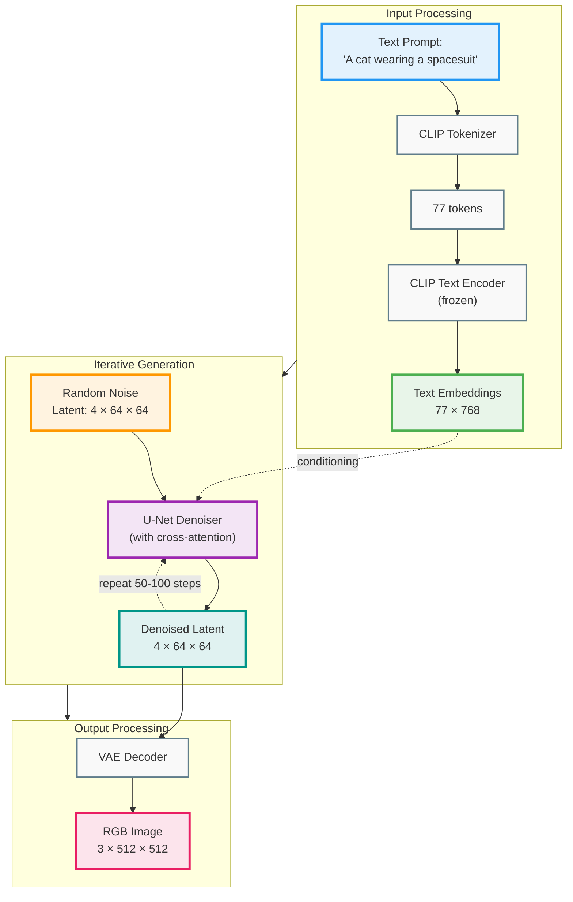

# Stable Diffusion Architecture

## Key Components

1. **CLIP Text Encoder** (frozen): Converts text to semantic embeddings
2. **U-Net with Cross-Attention** (learned): Performs diffusion in latent space
3. **VAE Decoder** (learned): Upsamples latent to full-resolution image

**Innovation**: 48× compression by working in latent space instead of pixel space
