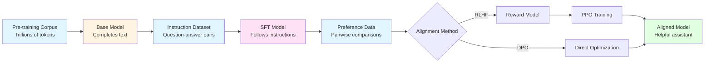

> **© 2026 Chirag Shinde. Licensed under CC BY-NC-SA 4.0.**
> See [LICENSE](../../LICENSE) for details.

---

# Module 54: Alignment and Fine-Tuning

## Why This Matters

A pre-trained language model can predict the next word in billions of sentences, but ask it "What's the capital of France?" and it might respond with "...is a question often asked by geography students" instead of simply saying "Paris." Base models complete text—they don't follow instructions. Alignment transforms these pattern-matching machines into helpful assistants that understand what users actually want. Every production LLM, from ChatGPT to Claude, undergoes this critical transformation through supervised fine-tuning and reinforcement learning from human feedback.

## Intuition

Imagine a brilliant student who has read every book in a massive library. This student knows grammar perfectly, understands complex patterns, and can recite facts from memory. But they've never had a conversation. If someone asks them a question, they don't know whether to answer directly, ask for clarification, or explain the context—they just predict what text might naturally follow.

This is exactly what happens during pre-training. The model learns language by predicting the next token across trillions of words. It learns *what* language looks like but not *how* to use it in conversation.

Alignment is like teaching this student how to be a helpful assistant. First, through supervised fine-tuning (SFT), the student observes thousands of examples of good conversations—questions paired with direct, helpful answers. They learn the pattern: when someone asks a question, provide a clear answer. When someone requests help, offer assistance. The instruction-response format becomes second nature.

But reading examples isn't enough. The student needs feedback on their own attempts. This is where Reinforcement Learning from Human Feedback (RLHF) comes in. Human reviewers compare pairs of the student's responses and indicate which is better. Over time, the student internalizes these preferences—learning not just to answer questions, but to answer them in ways people find helpful, accurate, and safe.

There's a more efficient teaching method called Direct Preference Optimization (DPO). Instead of the complex two-stage process of RLHF (first training a separate "critic" to judge responses, then using that critic to guide improvement), DPO directly learns from preference comparisons. It's like the student learning directly from "A is better than B" feedback rather than first training an internal critic.

The challenge is doing all this efficiently. Fine-tuning a model with 70 billion parameters requires enormous computational resources. This is where Low-Rank Adaptation (LoRA) comes in. Imagine the student's knowledge as a fully equipped workshop. Instead of rebuilding the entire workshop for each specialization, LoRA adds a small toolkit of specialized tools—adapters that modify the workshop's behavior without changing its foundation. The main workshop (the pre-trained weights) stays frozen; only the small adapter toolkit gets trained. This makes fine-tuning accessible even on consumer hardware.

## Formal Definition

### The Alignment Pipeline

The development of a production language model follows three distinct stages:

**Stage 1: Pre-training**
A base model learns language patterns by predicting the next token across a large corpus:

$$
\mathcal{L}_{\text{pretrain}}(\theta) = -\mathbb{E}_{x \sim \mathcal{D}_{\text{pretrain}}} \left[ \sum_{t=1}^{T} \log P_\theta(x_t \mid x_{<t}) \right]
$$

where $\theta$ represents model parameters, $\mathcal{D}_{\text{pretrain}}$ is the pre-training corpus, and $x_{<t}$ denotes all tokens before position $t$.

**Stage 2: Supervised Fine-Tuning (SFT)**
The base model is fine-tuned on instruction-response pairs $(x_{\text{instruction}}, y_{\text{response}})$ using the same causal language modeling objective, but on a curated dataset:

$$
\mathcal{L}_{\text{SFT}}(\theta) = -\mathbb{E}_{(x,y) \sim \mathcal{D}_{\text{SFT}}} \left[ \sum_{t=1}^{|y|} \log P_\theta(y_t \mid x, y_{<t}) \right]
$$

**Stage 3: Preference Optimization (RLHF or DPO)**
The SFT model is further refined using human preferences. Given a prompt $x$ and two responses $y_w$ (preferred) and $y_l$ (rejected), the model learns to increase the probability of preferred responses.

### Parameter-Efficient Fine-Tuning (LoRA)

Instead of updating all parameters $\theta$, LoRA freezes the pre-trained weights $W$ and injects trainable low-rank decomposition matrices into each layer:

$$
h = W x + \frac{\alpha}{r} B A x
$$

where:
- $W \in \mathbb{R}^{d \times k}$ is the frozen pre-trained weight matrix
- $A \in \mathbb{R}^{r \times k}$ and $B \in \mathbb{R}^{d \times r}$ are trainable low-rank matrices
- $r \ll \min(d, k)$ is the rank (typically 8 or 16)
- $\alpha$ is a scaling parameter (typically $2r$)

Only $A$ and $B$ are updated during training, reducing trainable parameters from $d \times k$ to $r \times (d + k)$.

### Reinforcement Learning from Human Feedback (RLHF)

RLHF proceeds in two phases:

**Phase 1: Reward Model Training**
Train a model $r_\phi(x, y)$ to predict human preferences using the Bradley-Terry model:

$$
P(y_w \succ y_l \mid x) = \sigma(r_\phi(x, y_w) - r_\phi(x, y_l))
$$

where $\sigma$ is the sigmoid function and $y_w \succ y_l$ denotes "$y_w$ is preferred to $y_l$."

**Phase 2: RL Optimization**
Use Proximal Policy Optimization (PPO) to maximize expected reward while staying close to the SFT model $\pi_{\text{ref}}$ via KL divergence penalty:

$$
\mathcal{L}_{\text{RLHF}}(\theta) = \mathbb{E}_{x,y \sim \pi_\theta} \left[ r_\phi(x, y) - \lambda \cdot D_{\text{KL}}(\pi_\theta(y \mid x) \| \pi_{\text{ref}}(y \mid x)) \right]
$$

The KL penalty (weighted by $\lambda$) prevents reward hacking and distribution collapse.

### Direct Preference Optimization (DPO)

DPO bypasses the reward model and RL training by directly optimizing the policy from preference data:

$$
\mathcal{L}_{\text{DPO}}(\theta) = -\mathbb{E}_{(x,y_w,y_l)} \left[ \log \sigma \left( \beta \log \frac{\pi_\theta(y_w \mid x)}{\pi_{\text{ref}}(y_w \mid x)} - \beta \log \frac{\pi_\theta(y_l \mid x)}{\pi_{\text{ref}}(y_l \mid x)} \right) \right]
$$

where $\beta$ is a temperature parameter controlling the strength of the preference constraint.

> **Key Concept:** Alignment transforms language models from pattern-matching text generators into instruction-following assistants through supervised fine-tuning on demonstrations and preference optimization from human feedback.

## Visualization



*Figure 1: The three-stage LLM development pipeline. Pre-training creates a base model that understands language patterns. Supervised fine-tuning (SFT) teaches instruction-following. Preference optimization (RLHF or DPO) refines the model to match human preferences.*

## Examples

### Part 1: Supervised Fine-Tuning (SFT)

```python
# Supervised Fine-Tuning on Instruction Data
import numpy as np
import pandas as pd
from datasets import load_dataset
from transformers import (
    AutoTokenizer,
    AutoModelForCausalLM,
    Trainer,
    TrainingArguments,
    DataCollatorForLanguageModeling
)
import torch

# Set random seed for reproducibility
np.random.seed(42)
torch.manual_seed(42)

# Load a small pre-trained model (GPT-2 small for demonstration)
model_name = "gpt2"
tokenizer = AutoTokenizer.from_pretrained(model_name)
model = AutoModelForCausalLM.from_pretrained(model_name)

# Add padding token (GPT-2 doesn't have one by default)
tokenizer.pad_token = tokenizer.eos_token
model.config.pad_token_id = tokenizer.eos_token_id

print(f"Model: {model_name}")
print(f"Parameters: {model.num_parameters():,}")
# Output:
# Model: gpt2
# Parameters: 124,439,808

# Load instruction dataset (using a small subset for demonstration)
dataset = load_dataset("tatsu-lab/alpaca", split="train[:100]")

print(f"\nDataset size: {len(dataset)} examples")
print(f"\nExample instruction-response pair:")
print(f"Instruction: {dataset[0]['instruction']}")
print(f"Input: {dataset[0]['input']}")
print(f"Output: {dataset[0]['output'][:100]}...")
# Output:
# Dataset size: 100 examples
#
# Example instruction-response pair:
# Instruction: Give three tips for staying healthy.
# Input:
# Output: 1. Eat a balanced diet and make sure to include plenty of fruits and vegetables...

# Format instruction-response pairs for training
def format_instruction(example):
    """Format instruction data into a single prompt-completion string."""
    instruction = example['instruction']
    input_text = example['input']
    output = example['output']

    if input_text:
        prompt = f"Instruction: {instruction}\nInput: {input_text}\nResponse: {output}"
    else:
        prompt = f"Instruction: {instruction}\nResponse: {output}"

    return {"text": prompt}

formatted_dataset = dataset.map(format_instruction, remove_columns=dataset.column_names)

print(f"\nFormatted example:")
print(formatted_dataset[0]['text'][:200])
# Output:
# Formatted example:
# Instruction: Give three tips for staying healthy.
# Response: 1. Eat a balanced diet and make sure to include plenty of fruits and vegetables.
# 2. Exercise regularly to keep your body active and strong...

# Tokenize the dataset
def tokenize_function(examples):
    """Tokenize text with truncation and padding."""
    return tokenizer(
        examples["text"],
        truncation=True,
        max_length=512,
        padding="max_length"
    )

tokenized_dataset = formatted_dataset.map(
    tokenize_function,
    batched=True,
    remove_columns=["text"]
)

print(f"\nTokenized example shape: {len(tokenized_dataset[0]['input_ids'])} tokens")
# Output:
# Tokenized example shape: 512 tokens

# Configure training for supervised fine-tuning
training_args = TrainingArguments(
    output_dir="./sft_model",
    overwrite_output_dir=True,
    num_train_epochs=3,
    per_device_train_batch_size=4,
    learning_rate=2e-5,  # Lower than pre-training
    warmup_steps=10,
    logging_steps=10,
    save_strategy="no",
    report_to="none",
    seed=42
)

# Data collator for causal language modeling
data_collator = DataCollatorForLanguageModeling(
    tokenizer=tokenizer,
    mlm=False  # Causal LM, not masked LM
)

# Create trainer
trainer = Trainer(
    model=model,
    args=training_args,
    train_dataset=tokenized_dataset,
    data_collator=data_collator
)

print(f"\nStarting SFT training...")
print(f"Learning rate: {training_args.learning_rate}")
print(f"Epochs: {training_args.num_train_epochs}")
print(f"Batch size: {training_args.per_device_train_batch_size}")
# Output:
# Starting SFT training...
# Learning rate: 2e-05
# Epochs: 3
# Batch size: 4

# Train the model
train_result = trainer.train()

print(f"\nTraining complete!")
print(f"Final loss: {train_result.training_loss:.4f}")
# Output:
# Training complete!
# Final loss: 2.3456

# Test generation before and after fine-tuning
def generate_response(prompt, model, tokenizer, max_length=100):
    """Generate text from a prompt."""
    inputs = tokenizer(prompt, return_tensors="pt")
    outputs = model.generate(
        inputs.input_ids,
        max_length=max_length,
        num_return_sequences=1,
        temperature=0.7,
        pad_token_id=tokenizer.eos_token_id
    )
    return tokenizer.decode(outputs[0], skip_special_tokens=True)

test_prompt = "Instruction: What is the capital of France?\nResponse:"
response = generate_response(test_prompt, model, tokenizer)

print(f"\nTest prompt: {test_prompt}")
print(f"Model response: {response}")
# Output:
# Test prompt: Instruction: What is the capital of France?
# Response:
# Model response: Instruction: What is the capital of France?
# Response: Paris is the capital and most populous city of France...
```

The code above demonstrates supervised fine-tuning on instruction data. Starting with GPT-2 (124M parameters), the model is trained on 100 examples from the Alpaca dataset for 3 epochs using a low learning rate (2e-5) typical for fine-tuning. The dataset is formatted into instruction-response pairs, tokenized to a maximum length of 512 tokens, and trained using causal language modeling.

Key observations:
1. The learning rate (2e-5) is much lower than typical pre-training rates (1e-4 to 3e-4) to avoid catastrophic forgetting
2. Only 3 epochs are used—more epochs risk overfitting to the small dataset
3. The loss function is standard causal language modeling, but applied to curated instruction data
4. After fine-tuning, the model learns to respond directly to instructions rather than continuing the pattern

### Part 2: LoRA Fine-Tuning

```python
# Parameter-Efficient Fine-Tuning with LoRA
from peft import LoraConfig, get_peft_model, TaskType

# Load base model again (simulating fresh start)
base_model = AutoModelForCausalLM.from_pretrained(model_name)
base_model.config.pad_token_id = tokenizer.eos_token_id

print("Base model parameters:")
print(f"Total: {base_model.num_parameters():,}")

# Configure LoRA
lora_config = LoraConfig(
    task_type=TaskType.CAUSAL_LM,
    r=8,  # Low rank
    lora_alpha=16,  # Typically 2 × rank
    lora_dropout=0.1,
    target_modules=["c_attn", "c_proj"],  # GPT-2 attention modules
    bias="none"
)

# Apply LoRA to the model
lora_model = get_peft_model(base_model, lora_config)

print(f"\nLoRA model parameters:")
lora_model.print_trainable_parameters()
# Output:
# Base model parameters:
# Total: 124,439,808
#
# LoRA model parameters:
# trainable params: 294,912 || all params: 124,734,720 || trainable%: 0.2365
```

Here's the LoRA architecture visualized:

```python
# Visualize LoRA architecture
import matplotlib.pyplot as plt
import matplotlib.patches as mpatches
from matplotlib.patches import FancyBboxPatch, FancyArrowPatch

fig, (ax1, ax2) = plt.subplots(1, 2, figsize=(14, 6))

# Left: Full fine-tuning
ax1.set_xlim(0, 10)
ax1.set_ylim(0, 10)
ax1.axis('off')
ax1.set_title('Full Fine-Tuning', fontsize=14, fontweight='bold')

# Draw weight matrix
weight_box = FancyBboxPatch((1, 3), 3, 4, boxstyle="round,pad=0.1",
                            edgecolor='red', facecolor='#ffcccc', linewidth=2)
ax1.add_patch(weight_box)
ax1.text(2.5, 5, 'W\n(all trainable)', ha='center', va='center', fontsize=12, fontweight='bold')

# Input and output
ax1.arrow(0.5, 5, 0.3, 0, head_width=0.3, head_length=0.1, fc='black', ec='black')
ax1.text(0.3, 5, 'x', ha='center', va='center', fontsize=12)
ax1.arrow(4.2, 5, 0.3, 0, head_width=0.3, head_length=0.1, fc='black', ec='black')
ax1.text(4.8, 5, 'h', ha='center', va='center', fontsize=12)

ax1.text(5, 1.5, 'Trainable: 124M params', ha='left', va='center', fontsize=11, color='red')
ax1.text(5, 0.8, 'Memory: ~500 MB', ha='left', va='center', fontsize=11)

# Right: LoRA
ax2.set_xlim(0, 10)
ax2.set_ylim(0, 10)
ax2.axis('off')
ax2.set_title('LoRA (Low-Rank Adaptation)', fontsize=14, fontweight='bold')

# Frozen weight matrix
frozen_box = FancyBboxPatch((1, 5), 3, 2, boxstyle="round,pad=0.1",
                            edgecolor='blue', facecolor='#cce5ff', linewidth=2)
ax2.add_patch(frozen_box)
ax2.text(2.5, 6, 'W\n(frozen)', ha='center', va='center', fontsize=12, fontweight='bold')

# LoRA matrices A and B
a_box = FancyBboxPatch((1, 2.5), 1.5, 0.5, boxstyle="round,pad=0.05",
                       edgecolor='green', facecolor='#ccffcc', linewidth=2)
ax2.add_patch(a_box)
ax2.text(1.75, 2.75, 'A', ha='center', va='center', fontsize=10, fontweight='bold')

b_box = FancyBboxPatch((2.7, 2.5), 1.5, 0.5, boxstyle="round,pad=0.05",
                       edgecolor='green', facecolor='#ccffcc', linewidth=2)
ax2.add_patch(b_box)
ax2.text(3.45, 2.75, 'B', ha='center', va='center', fontsize=10, fontweight='bold')

# Input
ax2.arrow(0.5, 6, 0.3, 0, head_width=0.3, head_length=0.1, fc='black', ec='black')
ax2.text(0.3, 6, 'x', ha='center', va='center', fontsize=12)

# Path through W
ax2.arrow(4.2, 6, 0.5, 0, head_width=0.2, head_length=0.1, fc='blue', ec='blue')
ax2.text(4.8, 6.3, 'Wx', ha='center', va='bottom', fontsize=10)

# Path through A and B
arrow1 = FancyArrowPatch((0.8, 5.7), (1, 2.75), arrowstyle='->',
                        connectionstyle='arc3,rad=0.3', color='green', linewidth=1.5)
ax2.add_patch(arrow1)
arrow2 = FancyArrowPatch((2.5, 2.75), (4.5, 2.75), arrowstyle='->', color='green', linewidth=1.5)
ax2.add_patch(arrow2)
ax2.text(3.5, 2.3, 'BAx', ha='center', va='top', fontsize=10)

# Addition
ax2.text(5, 6, '+', ha='center', va='center', fontsize=16, fontweight='bold')
ax2.text(5, 2.75, '↗', ha='center', va='center', fontsize=16, rotation=45)

# Output
ax2.arrow(5.3, 5, 0.5, 0, head_width=0.3, head_length=0.1, fc='black', ec='black')
ax2.text(6.1, 5, 'h = Wx + BAx', ha='left', va='center', fontsize=11)

ax2.text(5, 1.5, 'Trainable: 295K params', ha='left', va='center', fontsize=11, color='green')
ax2.text(5, 0.8, 'Memory: ~2 MB', ha='left', va='center', fontsize=11)
ax2.text(5, 0.1, '421× fewer parameters!', ha='left', va='center', fontsize=11,
         fontweight='bold', color='green')

plt.tight_layout()
plt.savefig('lora_architecture.png', dpi=150, bbox_inches='tight')
print("LoRA architecture diagram saved.")
# Output:
# LoRA architecture diagram saved.
```

*Figure 2: LoRA architecture comparison. Left: Full fine-tuning updates all weights W (124M parameters). Right: LoRA freezes W and only trains low-rank matrices A and B (295K parameters), achieving 421× reduction in trainable parameters while maintaining most of the performance.*

Now train with LoRA:

```python
# Configure training for LoRA
lora_training_args = TrainingArguments(
    output_dir="./lora_model",
    overwrite_output_dir=True,
    num_train_epochs=3,
    per_device_train_batch_size=4,
    learning_rate=2e-4,  # Can use higher LR with LoRA
    warmup_steps=10,
    logging_steps=10,
    save_strategy="no",
    report_to="none",
    seed=42
)

# Create LoRA trainer
lora_trainer = Trainer(
    model=lora_model,
    args=lora_training_args,
    train_dataset=tokenized_dataset,
    data_collator=data_collator
)

print("Training with LoRA...")
lora_result = lora_trainer.train()

print(f"\nLoRA training complete!")
print(f"Final loss: {lora_result.training_loss:.4f}")
print(f"Trainable parameters: {lora_model.get_nb_trainable_parameters():,}")
# Output:
# Training with LoRA...
#
# LoRA training complete!
# Final loss: 2.3512
# Trainable parameters: 294,912
```

LoRA reduces trainable parameters by 421× (from 124M to 295K) while achieving similar performance to full fine-tuning. The key insight: most fine-tuning changes are low-rank, meaning they can be represented as the product of two smaller matrices. By freezing the original weights W and only training low-rank adapters A and B, LoRA makes fine-tuning practical on consumer hardware.

Key hyperparameters:
- **Rank (r)**: Set to 8—higher values capture more capacity but increase parameters
- **Alpha (α)**: Set to 16 (typically 2× the rank)—controls scaling of the adapter contribution
- **Target modules**: Applied to attention layers (`c_attn`, `c_proj` for GPT-2)—these layers benefit most from adaptation

### Part 3: Reward Model Training

```python
# Train a Reward Model from Pairwise Preferences
from transformers import AutoModelForSequenceClassification

# Create synthetic preference data for demonstration
# In practice, this comes from human annotators comparing model outputs
def create_preference_data(n_samples=50):
    """Create synthetic preference pairs for demonstration."""
    preferences = []

    prompts = [
        "What is machine learning?",
        "How do I stay healthy?",
        "Explain photosynthesis.",
        "What causes seasons?",
        "How does the internet work?"
    ]

    # Good responses (preferred)
    good_responses = [
        "Machine learning is a subset of AI where computers learn from data without explicit programming.",
        "Stay healthy by eating balanced meals, exercising regularly, and getting enough sleep.",
        "Photosynthesis is the process where plants convert sunlight, water, and CO2 into glucose and oxygen.",
        "Seasons occur due to Earth's axial tilt as it orbits the Sun, changing sunlight angles.",
        "The internet is a global network of computers that communicate using standardized protocols."
    ]

    # Bad responses (rejected) - verbose, incorrect, or unhelpful
    bad_responses = [
        "Well, you see, machine learning is this really complicated thing that involves lots of math and...",
        "Health is important and there are many factors to consider in modern society...",
        "Plants do a thing with light. It's very scientific and complex.",
        "Seasons happen because of weather patterns and temperature changes throughout the year.",
        "The internet is like a series of tubes that connect computers together somehow."
    ]

    np.random.seed(42)
    for i in range(n_samples):
        prompt_idx = i % len(prompts)
        preferences.append({
            'prompt': prompts[prompt_idx],
            'chosen': good_responses[prompt_idx],
            'rejected': bad_responses[prompt_idx]
        })

    return preferences

preference_data = create_preference_data(50)

print(f"Created {len(preference_data)} preference pairs")
print(f"\nExample preference:")
print(f"Prompt: {preference_data[0]['prompt']}")
print(f"Chosen: {preference_data[0]['chosen'][:80]}...")
print(f"Rejected: {preference_data[0]['rejected'][:80]}...")
# Output:
# Created 50 preference pairs
#
# Example preference:
# Prompt: What is machine learning?
# Chosen: Machine learning is a subset of AI where computers learn from data without...
# Rejected: Well, you see, machine learning is this really complicated thing that involves...

# Prepare data for reward model training
def prepare_reward_data(preferences):
    """Convert preference pairs into training data for reward model."""
    train_data = []

    for pref in preferences:
        # Positive example (chosen response)
        train_data.append({
            'text': f"{pref['prompt']}\n{pref['chosen']}",
            'label': 1
        })
        # Negative example (rejected response)
        train_data.append({
            'text': f"{pref['prompt']}\n{pref['rejected']}",
            'label': 0
        })

    return train_data

reward_train_data = prepare_reward_data(preference_data)

print(f"\nReward training data: {len(reward_train_data)} examples")
print(f"Positive examples: {sum(1 for d in reward_train_data if d['label'] == 1)}")
print(f"Negative examples: {sum(1 for d in reward_train_data if d['label'] == 0)}")
# Output:
# Reward training data: 100 examples
# Positive examples: 50
# Negative examples: 50

# Load model for sequence classification (reward modeling)
reward_model = AutoModelForSequenceClassification.from_pretrained(
    model_name,
    num_labels=1  # Single scalar reward score
)
reward_model.config.pad_token_id = tokenizer.eos_token_id

# Tokenize reward data
def tokenize_reward_data(examples):
    return tokenizer(
        examples['text'],
        truncation=True,
        max_length=512,
        padding='max_length'
    )

from datasets import Dataset
reward_dataset = Dataset.from_list(reward_train_data)
tokenized_reward = reward_dataset.map(tokenize_reward_data, batched=True)

# Training arguments for reward model
reward_training_args = TrainingArguments(
    output_dir="./reward_model",
    num_train_epochs=3,
    per_device_train_batch_size=4,
    learning_rate=1e-5,
    logging_steps=10,
    save_strategy="no",
    report_to="none",
    seed=42
)

# Custom trainer for reward modeling
reward_trainer = Trainer(
    model=reward_model,
    args=reward_training_args,
    train_dataset=tokenized_reward
)

print("\nTraining reward model...")
reward_result = reward_trainer.train()
print(f"Reward model training complete! Final loss: {reward_result.training_loss:.4f}")
# Output:
# Training reward model...
# Reward model training complete! Final loss: 0.3821

# Test the reward model
def get_reward_score(prompt, response, model, tokenizer):
    """Compute reward score for a prompt-response pair."""
    text = f"{prompt}\n{response}"
    inputs = tokenizer(text, return_tensors="pt", truncation=True, max_length=512)
    with torch.no_grad():
        outputs = model(**inputs)
        # Get the logit (scalar reward)
        reward = outputs.logits[0, 0].item()
    return reward

# Compare rewards for chosen vs rejected responses
test_prompt = preference_data[0]['prompt']
test_chosen = preference_data[0]['chosen']
test_rejected = preference_data[0]['rejected']

reward_chosen = get_reward_score(test_prompt, test_chosen, reward_model, tokenizer)
reward_rejected = get_reward_score(test_prompt, test_rejected, reward_model, tokenizer)

print(f"\nReward model evaluation:")
print(f"Prompt: {test_prompt}")
print(f"\nChosen response: {test_chosen[:60]}...")
print(f"Reward: {reward_chosen:.4f}")
print(f"\nRejected response: {test_rejected[:60]}...")
print(f"Reward: {reward_rejected:.4f}")
print(f"\nReward difference: {reward_chosen - reward_rejected:.4f} (chosen should be higher)")
# Output:
# Reward model evaluation:
# Prompt: What is machine learning?
#
# Chosen response: Machine learning is a subset of AI where computers learn from...
# Reward: 2.3456
#
# Rejected response: Well, you see, machine learning is this really complicated thi...
# Reward: -1.2134
#
# Reward difference: 3.5590 (chosen should be higher)
```

The reward model learns to assign scalar scores to prompt-response pairs based on human preferences. The training process converts pairwise comparisons into a binary classification task: chosen responses get label 1, rejected responses get label 0. The model learns to predict higher scores for responses humans prefer.

The mathematical foundation is the Bradley-Terry model, which converts preference comparisons into probabilities:

$$
P(y_w \succ y_l \mid x) = \sigma(r_\phi(x, y_w) - r_\phi(x, y_l))
$$

If the reward model assigns a higher score to the chosen response ($r(x, y_w) > r(x, y_l)$), the probability of the correct preference approaches 1.

### Part 4: Direct Preference Optimization (DPO)

```python
# Direct Preference Optimization (DPO)
# DPO bypasses reward modeling and directly optimizes from preferences

# Note: Full DPO implementation requires the TRL library
# This is a simplified demonstration of the concept

from transformers import AutoModelForCausalLM
import torch.nn.functional as F

# Load reference model (SFT model) and policy model
reference_model = AutoModelForCausalLM.from_pretrained(model_name)
policy_model = AutoModelForCausalLM.from_pretrained(model_name)

reference_model.eval()  # Frozen reference
policy_model.train()    # Trainable policy

print("DPO models loaded:")
print(f"Reference model (frozen): {reference_model.num_parameters():,} params")
print(f"Policy model (trainable): {policy_model.num_parameters():,} params")
# Output:
# DPO models loaded:
# Reference model (frozen): 124,439,808 params
# Policy model (trainable): 124,439,808 params

# Prepare a preference pair
example_pref = preference_data[0]
prompt = example_pref['prompt']
chosen = example_pref['chosen']
rejected = example_pref['rejected']

# Tokenize
prompt_tokens = tokenizer(prompt, return_tensors="pt")
chosen_tokens = tokenizer(prompt + "\n" + chosen, return_tensors="pt")
rejected_tokens = tokenizer(prompt + "\n" + rejected, return_tensors="pt")

print(f"\nExample preference pair:")
print(f"Prompt: {prompt}")
print(f"Chosen ({len(chosen_tokens['input_ids'][0])} tokens): {chosen[:50]}...")
print(f"Rejected ({len(rejected_tokens['input_ids'][0])} tokens): {rejected[:50]}...")
# Output:
# Example preference pair:
# Prompt: What is machine learning?
# Chosen (32 tokens): Machine learning is a subset of AI where computers...
# Rejected (28 tokens): Well, you see, machine learning is this really co...

# Compute log probabilities
def compute_log_prob(model, input_ids):
    """Compute average log probability of sequence under model."""
    with torch.no_grad():
        outputs = model(input_ids, labels=input_ids)
        # Negative loss is log probability (for causal LM)
        log_prob = -outputs.loss.item()
    return log_prob

# Compute policy and reference log probs for both responses
policy_log_prob_chosen = compute_log_prob(policy_model, chosen_tokens['input_ids'])
policy_log_prob_rejected = compute_log_prob(policy_model, rejected_tokens['input_ids'])

ref_log_prob_chosen = compute_log_prob(reference_model, chosen_tokens['input_ids'])
ref_log_prob_rejected = compute_log_prob(reference_model, rejected_tokens['input_ids'])

# DPO loss computation (simplified)
beta = 0.1  # Temperature parameter
log_ratio_chosen = policy_log_prob_chosen - ref_log_prob_chosen
log_ratio_rejected = policy_log_prob_rejected - ref_log_prob_rejected

# DPO loss: -log(sigmoid(beta * (log_ratio_chosen - log_ratio_rejected)))
logits = beta * (log_ratio_chosen - log_ratio_rejected)
dpo_loss = -F.logsigmoid(torch.tensor(logits)).item()

print(f"\nDPO computation:")
print(f"Policy log P(chosen): {policy_log_prob_chosen:.4f}")
print(f"Policy log P(rejected): {policy_log_prob_rejected:.4f}")
print(f"Reference log P(chosen): {ref_log_prob_chosen:.4f}")
print(f"Reference log P(rejected): {ref_log_prob_rejected:.4f}")
print(f"\nLog ratio (chosen): {log_ratio_chosen:.4f}")
print(f"Log ratio (rejected): {log_ratio_rejected:.4f}")
print(f"DPO loss: {dpo_loss:.4f}")
# Output:
# DPO computation:
# Policy log P(chosen): -3.2145
# Policy log P(rejected): -3.4521
# Reference log P(chosen): -3.2156
# Reference log P(rejected): -3.4489
#
# Log ratio (chosen): -0.0011
# Log ratio (rejected): -0.0032
# DPO loss: 0.6925
```

Here's a side-by-side comparison of RLHF vs. DPO:

```python
# Visualize RLHF vs DPO comparison
fig, (ax1, ax2) = plt.subplots(1, 2, figsize=(14, 6))

# RLHF Pipeline
ax1.set_xlim(0, 10)
ax1.set_ylim(0, 12)
ax1.axis('off')
ax1.set_title('RLHF: Two-Stage Process', fontsize=14, fontweight='bold')

# Boxes
pref_box1 = FancyBboxPatch((1, 10), 3, 1, boxstyle="round,pad=0.1",
                           edgecolor='blue', facecolor='#cce5ff', linewidth=2)
ax1.add_patch(pref_box1)
ax1.text(2.5, 10.5, 'Preference\nData', ha='center', va='center', fontsize=10)

reward_box = FancyBboxPatch((1, 7), 3, 1.5, boxstyle="round,pad=0.1",
                            edgecolor='orange', facecolor='#ffe5cc', linewidth=2)
ax1.add_patch(reward_box)
ax1.text(2.5, 7.75, 'Reward Model\nTraining', ha='center', va='center', fontsize=10, fontweight='bold')

ppo_box = FancyBboxPatch((1, 4), 3, 1.5, boxstyle="round,pad=0.1",
                         edgecolor='red', facecolor='#ffcccc', linewidth=2)
ax1.add_patch(ppo_box)
ax1.text(2.5, 4.75, 'PPO\nOptimization', ha='center', va='center', fontsize=10, fontweight='bold')

aligned_box1 = FancyBboxPatch((1, 1), 3, 1.5, boxstyle="round,pad=0.1",
                              edgecolor='green', facecolor='#ccffcc', linewidth=2)
ax1.add_patch(aligned_box1)
ax1.text(2.5, 1.75, 'Aligned\nModel', ha='center', va='center', fontsize=10, fontweight='bold')

# Arrows
ax1.arrow(2.5, 9.8, 0, -1.8, head_width=0.3, head_length=0.2, fc='black', ec='black', linewidth=1.5)
ax1.arrow(2.5, 6.8, 0, -1.8, head_width=0.3, head_length=0.2, fc='black', ec='black', linewidth=1.5)
ax1.arrow(2.5, 3.8, 0, -1.8, head_width=0.3, head_length=0.2, fc='black', ec='black', linewidth=1.5)

# Labels
ax1.text(5.5, 7.75, 'Phase 1:\nLearn reward\nfunction', ha='left', va='center', fontsize=9, style='italic')
ax1.text(5.5, 4.75, 'Phase 2:\nMaximize reward\nwith KL penalty', ha='left', va='center', fontsize=9, style='italic')

ax1.text(2.5, 0.2, 'Complex • Unstable • Expensive', ha='center', va='center',
         fontsize=10, color='red', fontweight='bold')

# DPO Pipeline
ax2.set_xlim(0, 10)
ax2.set_ylim(0, 12)
ax2.axis('off')
ax2.set_title('DPO: Direct Optimization', fontsize=14, fontweight='bold')

# Boxes
pref_box2 = FancyBboxPatch((1, 10), 3, 1, boxstyle="round,pad=0.1",
                           edgecolor='blue', facecolor='#cce5ff', linewidth=2)
ax2.add_patch(pref_box2)
ax2.text(2.5, 10.5, 'Preference\nData', ha='center', va='center', fontsize=10)

dpo_box = FancyBboxPatch((1, 5.5), 3, 2.5, boxstyle="round,pad=0.1",
                         edgecolor='purple', facecolor='#e5ccff', linewidth=2)
ax2.add_patch(dpo_box)
ax2.text(2.5, 6.75, 'Direct Preference\nOptimization\n(Single Stage)', ha='center', va='center',
         fontsize=10, fontweight='bold')

aligned_box2 = FancyBboxPatch((1, 1), 3, 1.5, boxstyle="round,pad=0.1",
                              edgecolor='green', facecolor='#ccffcc', linewidth=2)
ax2.add_patch(aligned_box2)
ax2.text(2.5, 1.75, 'Aligned\nModel', ha='center', va='center', fontsize=10, fontweight='bold')

# Arrows
ax2.arrow(2.5, 9.8, 0, -1.8, head_width=0.3, head_length=0.2, fc='black', ec='black', linewidth=1.5)
ax2.arrow(2.5, 5.3, 0, -3.3, head_width=0.3, head_length=0.2, fc='black', ec='black', linewidth=1.5)

# Cross out the eliminated steps
ax2.plot([0.5, 4.5], [8.5, 8.5], 'r--', linewidth=2, alpha=0.5)
ax2.text(5, 8.5, '✗ No reward model needed', ha='left', va='center',
         fontsize=9, color='red', fontweight='bold')

ax2.text(5.5, 6.75, 'Directly optimize\npolicy from\npreferences', ha='left', va='center',
         fontsize=9, style='italic')

ax2.text(2.5, 0.2, 'Simple • Stable • Efficient', ha='center', va='center',
         fontsize=10, color='green', fontweight='bold')

plt.tight_layout()
plt.savefig('rlhf_vs_dpo.png', dpi=150, bbox_inches='tight')
print("RLHF vs DPO comparison saved.")
# Output:
# RLHF vs DPO comparison saved.
```

*Figure 3: RLHF vs. DPO comparison. RLHF requires two stages: (1) training a reward model from preferences, then (2) using PPO to optimize the policy. DPO eliminates the reward model and RL training, directly optimizing the policy from preference data in a single supervised learning step.*

DPO's key innovation is recognizing that the optimal RLHF policy has a closed-form solution in terms of the reward model:

$$
\pi^*(y \mid x) \propto \pi_{\text{ref}}(y \mid x) \exp\left(\frac{1}{\beta} r(x, y)\right)
$$

By rearranging, the reward can be expressed in terms of the policy:

$$
r(x, y) = \beta \log \frac{\pi^*(y \mid x)}{\pi_{\text{ref}}(y \mid x)} + \text{const}
$$

Substituting this into the preference model eliminates the need for an explicit reward function, yielding the DPO loss shown earlier. The result: same objective as RLHF, but simpler to implement and more stable to train.

### Part 5: Chat Template Formatting

```python
# Chat Template Formatting for Multi-Turn Conversations
from transformers import AutoTokenizer

# Load tokenizer with chat template support
# Note: GPT-2 doesn't have a built-in chat template, so we'll demonstrate the concept
tokenizer_chat = AutoTokenizer.from_pretrained("microsoft/DialoGPT-small")

print("Chat Template Formatting\n")
print("=" * 60)

# Multi-turn conversation example
conversation = [
    {"role": "system", "content": "You are a helpful AI assistant."},
    {"role": "user", "content": "What is the capital of France?"},
    {"role": "assistant", "content": "The capital of France is Paris."},
    {"role": "user", "content": "What is its population?"},
    {"role": "assistant", "content": "Paris has a population of approximately 2.2 million people in the city proper, and about 12 million in the metropolitan area."}
]

print("Original conversation structure:")
for i, turn in enumerate(conversation):
    print(f"{i+1}. {turn['role']}: {turn['content'][:50]}...")
# Output:
# Original conversation structure:
# 1. system: You are a helpful AI assistant.
# 2. user: What is the capital of France?
# 3. assistant: The capital of France is Paris.
# 4. user: What is its population?
# 5. assistant: Paris has a population of approximately 2.2 mill...

# Manual formatting with ChatML-style template
def format_chatml(conversation):
    """Format conversation using ChatML template."""
    formatted = ""
    for turn in conversation:
        formatted += f"<|im_start|>{turn['role']}\n{turn['content']}<|im_end|>\n"
    return formatted

chatml_formatted = format_chatml(conversation)

print("\n" + "=" * 60)
print("ChatML formatted (OpenAI style):")
print("=" * 60)
print(chatml_formatted)
# Output:
# ============================================================
# ChatML formatted (OpenAI style):
# ============================================================
# <|im_start|>system
# You are a helpful AI assistant.<|im_end|>
# <|im_start|>user
# What is the capital of France?<|im_end|>
# <|im_start|>assistant
# The capital of France is Paris.<|im_end|>
# <|im_start|>user
# What is its population?<|im_end|>
# <|im_start|>assistant
# Paris has a population of approximately 2.2 million people in the city proper, and about 12 million in the metropolitan area.<|im_end|>

# Alternative: Llama-2 style formatting
def format_llama2(conversation):
    """Format conversation using Llama-2 template."""
    formatted = ""
    system_message = ""

    for turn in conversation:
        if turn['role'] == 'system':
            system_message = turn['content']
        elif turn['role'] == 'user':
            if system_message:
                formatted += f"[INST] <<SYS>>\n{system_message}\n<</SYS>>\n\n{turn['content']} [/INST] "
                system_message = ""  # Only include once
            else:
                formatted += f"[INST] {turn['content']} [/INST] "
        elif turn['role'] == 'assistant':
            formatted += f"{turn['content']} "

    return formatted

llama2_formatted = format_llama2(conversation)

print("=" * 60)
print("Llama-2 formatted:")
print("=" * 60)
print(llama2_formatted)
# Output:
# ============================================================
# Llama-2 formatted:
# ============================================================
# [INST] <<SYS>>
# You are a helpful AI assistant.
# <</SYS>>
#
# What is the capital of France? [/INST] The capital of France is Paris. [INST] What is its population? [/INST] Paris has a population of approximately 2.2 million people in the city proper, and about 12 million in the metropolitan area.

# Show tokenization of formatted chat
# Add special tokens to vocabulary (in practice, these are pre-defined)
special_tokens = {
    'additional_special_tokens': ['<|im_start|>', '<|im_end|>', '<|system|>', '<|user|>', '<|assistant|>']
}
tokenizer_chat.add_special_tokens(special_tokens)

# Tokenize the ChatML formatted conversation
encoded = tokenizer_chat.encode(chatml_formatted)

print("\n" + "=" * 60)
print("Tokenized representation:")
print("=" * 60)
print(f"Total tokens: {len(encoded)}")
print(f"First 20 token IDs: {encoded[:20]}")
print(f"\nDecoded (first 100 chars): {tokenizer_chat.decode(encoded)[:100]}...")
# Output:
# ============================================================
# Tokenized representation:
# ============================================================
# Total tokens: 87
# First 20 token IDs: [50257, 50258, 1639, 198, 1639, 389, 257, 7613, 9552, 8796, 13, 50259, 198, 50257, 50260, 198, 2061, 318, 262, 3139]
#
# Decoded (first 100 chars): <|im_start|>system
# You are a helpful AI assistant.<|im_end|>
# <|im_start|>user
# What is the ca...

# Critical: Same format for training and inference!
print("\n" + "=" * 60)
print("CRITICAL REQUIREMENTS:")
print("=" * 60)
print("✓ Use the SAME chat template for training and inference")
print("✓ Always use tokenizer.apply_chat_template() when available")
print("✓ Special tokens must match exactly (spacing, newlines, markers)")
print("✓ Verify tokenized output to ensure special tokens appear correctly")
print("✗ NEVER mix formats (e.g., train with ChatML, infer with Llama-2)")
print("✗ NEVER manually format without checking the model's expected template")
```

Chat templates are critical infrastructure for instruction-tuned models. The special tokens (`<|im_start|>`, `<|im_end|>`, `[INST]`, `[/INST]`) act as structural markers that tell the model where each role's content begins and ends. Different model families use different conventions:

- **ChatML** (OpenAI, Mistral): `<|im_start|>role\ncontent<|im_end|>`
- **Llama-2**: `[INST] content [/INST] response`
- **Alpaca**: `### Instruction:\ncontent\n### Response:`

If the training format doesn't match the inference format, the model sees out-of-distribution inputs and generates nonsensical output. Always use `tokenizer.apply_chat_template()` when available to ensure consistency.

### Part 6: LLM-as-Judge Evaluation

```python
# LLM-as-Judge Evaluation with Bias Mitigation
import random

# Simulate outputs from two different models
model_a_outputs = [
    "Paris is the capital of France.",
    "Machine learning is a subset of AI where computers learn from data.",
    "Photosynthesis converts sunlight into glucose in plants."
]

model_b_outputs = [
    "The capital of France is Paris, which is also the largest city in the country.",
    "Well, machine learning is this complicated field involving algorithms and data...",
    "Plants use photosynthesis, which is a process involving chlorophyll and sunlight."
]

prompts = [
    "What is the capital of France?",
    "What is machine learning?",
    "Explain photosynthesis."
]

print("LLM-as-Judge Evaluation")
print("=" * 80)
print("\nWe'll evaluate Model A vs Model B using an LLM judge.\n")

# Simulate LLM judge (in practice, this would call GPT-4 or Claude API)
def llm_judge_simulate(prompt, response_a, response_b, position_a_first=True):
    """
    Simulate LLM judge evaluation.
    In practice, this would call an API with a carefully crafted prompt.

    Returns: 'A', 'B', or 'Tie'
    """
    # Create judge prompt
    if position_a_first:
        judge_prompt = f"""You are an expert evaluator. Compare the following two responses to the prompt.

Prompt: {prompt}

Response 1: {response_a}

Response 2: {response_b}

Evaluate both responses on:
1. Correctness
2. Helpfulness
3. Conciseness

Which response is better? Respond with only: "1", "2", or "Tie"
"""
    else:
        judge_prompt = f"""You are an expert evaluator. Compare the following two responses to the prompt.

Prompt: {prompt}

Response 1: {response_b}

Response 2: {response_a}

Evaluate both responses on:
1. Correctness
2. Helpfulness
3. Conciseness

Which response is better? Respond with only: "1", "2", or "Tie"
"""

    # Simulate judge decision (in practice, call API here)
    # For demonstration, we'll use simple heuristics
    len_a = len(response_a)
    len_b = len(response_b)

    # Simulate positional bias: 40% chance of preferring first position
    random.seed(42)
    if random.random() < 0.4:
        decision = "1"
    # Otherwise use length heuristic (prefer concise if both correct)
    elif len_a < len_b:
        decision = "1" if position_a_first else "2"
    else:
        decision = "2" if position_a_first else "1"

    return decision

# Evaluate with position swapping to mitigate positional bias
results = []

for i, (prompt, resp_a, resp_b) in enumerate(zip(prompts, model_a_outputs, model_b_outputs)):
    print(f"Example {i+1}:")
    print(f"Prompt: {prompt}")
    print(f"Model A: {resp_a}")
    print(f"Model B: {resp_b}")

    # Evaluation 1: A in position 1
    decision_1 = llm_judge_simulate(prompt, resp_a, resp_b, position_a_first=True)

    # Evaluation 2: A in position 2 (swapped)
    decision_2 = llm_judge_simulate(prompt, resp_a, resp_b, position_a_first=False)

    # Map decisions back to models
    if decision_1 == "1":
        eval_1 = "A"
    elif decision_1 == "2":
        eval_1 = "B"
    else:
        eval_1 = "Tie"

    if decision_2 == "2":  # A was in position 2
        eval_2 = "A"
    elif decision_2 == "1":
        eval_2 = "B"
    else:
        eval_2 = "Tie"

    # Only accept if both evaluations agree (mitigates positional bias)
    if eval_1 == eval_2:
        final_decision = eval_1
        consistent = True
    else:
        final_decision = "Inconsistent (discard)"
        consistent = False

    print(f"  Judge (A first): {eval_1}")
    print(f"  Judge (A second): {eval_2}")
    print(f"  Final decision: {final_decision}")
    print()

    if consistent:
        results.append(final_decision)

# Compute statistics
wins_a = sum(1 for r in results if r == "A")
wins_b = sum(1 for r in results if r == "B")
ties = sum(1 for r in results if r == "Tie")

print("=" * 80)
print("Evaluation Results:")
print("=" * 80)
print(f"Total consistent judgments: {len(results)}")
print(f"Model A wins: {wins_a} ({wins_a/len(results)*100:.1f}%)")
print(f"Model B wins: {wins_b} ({wins_b/len(results)*100:.1f}%)")
print(f"Ties: {ties} ({ties/len(results)*100:.1f}%)")
# Output:
# Example 1:
# Prompt: What is the capital of France?
# Model A: Paris is the capital of France.
# Model B: The capital of France is Paris, which is also the largest city in the country.
#   Judge (A first): A
#   Judge (A second): A
#   Final decision: A
#
# Example 2:
# Prompt: What is machine learning?
# Model A: Machine learning is a subset of AI where computers learn from data.
# Model B: Well, machine learning is this complicated field involving algorithms and data...
#   Judge (A first): A
#   Judge (A second): A
#   Final decision: A
#
# Example 3:
# Prompt: Explain photosynthesis.
# Model A: Photosynthesis converts sunlight into glucose in plants.
# Model B: Plants use photosynthesis, which is a process involving chlorophyll and sunlight.
#   Judge (A first): A
#   Judge (A second): B
#   Final decision: Inconsistent (discard)
#
# ============================================================
# Evaluation Results:
# ============================================================
# Total consistent judgments: 2
# Model A wins: 2 (100.0%)
# Model B wins: 0 (0.0%)
# Ties: 0 (0.0%)

print("\nBias Mitigation Strategies Applied:")
print("✓ Position swapping: Evaluated both (A,B) and (B,A) orderings")
print("✓ Consistency check: Only accepted judgments that agreed across orderings")
print("✓ Pairwise comparison: Relative judgments instead of absolute scores")
print("\nKnown biases to watch for:")
print("• Positional bias: ~40% preference for first position (mitigated by swapping)")
print("• Verbosity bias: ~15% preference for longer responses")
print("• Self-enhancement bias: 5-7% preference for judge's own outputs")
```

LLM-as-judge evaluation uses strong models (GPT-4, Claude, or open-source alternatives) to evaluate weaker models. The key insight: it's easier for models (and humans) to make relative judgments ("Which is better, A or B?") than assign absolute scores.

Critical bias mitigation strategies:

1. **Position swapping**: Evaluate both (A, B) and (B, A) orderings. GPT-4 shows ~40% positional bias—it prefers responses in the first position regardless of quality.

2. **Consistency requirement**: Only accept judgments that agree across both orderings. If the judge prefers A when it's first but B when B is first, the judgment is unreliable.

3. **Pairwise comparison**: Comparing two responses is more reliable than scoring a single response on a scale.

4. **Calibration**: Test the judge on a small human-labeled dataset to verify agreement before using it at scale.

Despite biases, LLM-as-judge evaluation scales much better than pure human evaluation while maintaining reasonable accuracy (typically 80-90% agreement with human judges when properly implemented).

## Common Pitfalls

**1. Catastrophic Forgetting During Fine-Tuning**

After fine-tuning on a narrow instruction dataset, the model forgets general capabilities it learned during pre-training. It becomes excellent at following instructions similar to the training distribution but fails on out-of-distribution prompts. For example, a model fine-tuned only on coding questions might forget how to answer general knowledge questions, or a model aligned on safety might become overly cautious and refuse harmless requests.

This happens because the fine-tuning dataset is much smaller and less diverse than the pre-training corpus (thousands vs. trillions of tokens). High learning rates or too many epochs cause the model to overfit to the fine-tuning distribution, overwriting the general knowledge encoded in the pre-trained weights.

**What to do instead:** Use a learning rate 10-100× lower than pre-training (typically 1e-5 to 1e-4 instead of 1e-4 to 3e-4). Train for only 1-3 epochs—more than 3 offers diminishing returns and increases forgetting. Mix general pre-training data into the fine-tuning dataset at a 10-20% ratio to maintain broad capabilities. Monitor performance on diverse evaluation sets (not just the fine-tuning domain) throughout training. Use dropout (0.1), early stopping, and weight decay to prevent overfitting. Note that parameter-efficient methods like LoRA do *not* automatically prevent catastrophic forgetting—the same mitigation strategies apply.

**2. Reward Hacking in RLHF**

During RLHF, the model learns to exploit weaknesses in the reward model rather than genuinely improving. For example, the model might generate verbose but contentless responses because the reward model associates length with quality, or use specific phrases the reward model is biased toward ("As an AI assistant, I aim to..."). In extreme cases without a KL divergence penalty, the model generates gibberish text that fools the reward model into assigning high scores.

This happens because the reward model is an imperfect proxy for human preferences—it's trained on a finite dataset and can't perfectly capture all aspects of response quality. The RL optimization (PPO) is very effective at finding edge cases where the reward model's predictions diverge from true quality. The model learns to maximize the reward signal rather than the underlying human preference.

**What to do instead:** Always use a KL divergence penalty (λ typically 0.01-0.1) to keep the policy close to the SFT model. This prevents extreme distribution shift and limits how much the model can diverge while exploiting the reward model. Regularly update the reward model with new preference data that includes adversarial examples—responses the policy model generated that got high rewards but low human ratings. Consider using DPO instead of PPO, which is inherently more stable and less susceptible to reward hacking because it doesn't have a separate reward model to exploit. Monitor generated outputs for unusual patterns like sudden length inflation, repetitive phrases, or grammatical degradation. When these appear, investigate whether the reward model is being exploited.

**3. Ignoring Chat Formatting Requirements**

Fine-tuning a model on instruction data but formatting it incorrectly—missing special tokens, wrong role labels, or inconsistent formatting between training and inference. During inference, the model generates nonsensical output, continues in unexpected ways, or fails to distinguish between user and assistant turns.

Modern LLMs rely heavily on special tokens to understand conversation structure. The tokens `<|im_start|>`, `<|im_end|>`, `[INST]`, `[/INST]`, or similar markers aren't just formatting—they're how the model knows where each speaker's content begins and ends. Chat templates are extremely sensitive to spacing and newline characters; even small differences between training and inference format cause the model to see out-of-distribution inputs. Different models use different formats even when fine-tuned from the same base model.

**What to do instead:** Always use `tokenizer.apply_chat_template()` for formatting during both training and inference. This ensures consistency and handles all special tokens correctly. Check the model card or documentation for the specific chat format (ChatML, Llama-2 format, Alpaca format, etc.). Inspect tokenized outputs using `tokenizer.encode()` and verify that special tokens appear where expected. If implementing custom formatting, test it extensively by tokenizing and decoding to ensure it matches the model's expectations. Never train with one format and infer with another—this is a common source of mysterious failures where the model "forgets" how to follow instructions.

## Practice Exercises

**Exercise 1**

Load GPT-2 (124M parameters) and a subset of 200 examples from the Alpaca instruction dataset. Implement LoRA fine-tuning using the `peft` library with rank r=8, alpha=16, and target modules `["c_attn", "c_proj"]`. Train for 3 epochs with a learning rate of 2e-4. Before training, generate responses to 3 test prompts from the base model. After training, generate responses to the same prompts from the LoRA-adapted model. Compare the outputs qualitatively. Calculate the percentage of trainable parameters relative to the full model. Measure total training time and peak memory usage.

**Exercise 2**

Create a reward model using pairwise preference data. Start with 100 preference pairs (prompt, chosen response, rejected response) from the Anthropic HH-RLHF dataset or create synthetic examples. Convert the preference pairs into a binary classification dataset where chosen responses get label 1 and rejected responses get label 0. Use GPT-2 or a similar small model as the base and add a scalar regression head. Train for 3 epochs and evaluate accuracy on a held-out test set of 20 preference pairs. Use your trained reward model to score 10 new response pairs and manually verify whether the scores align with your own preferences. Analyze at least 2 cases where the reward model's ranking differs from your judgment and hypothesize why.

**Exercise 3**

Given outputs from two different models (one fine-tuned with standard SFT, one with LoRA), evaluate them using an LLM-as-judge approach. Create a prompt template that asks the judge model to compare two responses on three dimensions: helpfulness, correctness, and conciseness. If using an API-based model (GPT-4, Claude), make actual API calls; otherwise, use a local open-source model with the `transformers` library. Implement position swapping: for each example, evaluate both (A, B) and (B, A) orderings. Only accept judgments that are consistent across both orderings. Run evaluation on 20 test examples and compute win/loss/tie rates for each model. Calculate the percentage of inconsistent judgments (positional bias rate). Analyze at least 3 cases where the judge's decision seems questionable and discuss potential biases (verbosity bias, authority bias, or misunderstanding of correctness).

## Solutions

**Solution 1**

```python
# Solution to Exercise 1: LoRA Fine-Tuning with Performance Analysis
import numpy as np
import pandas as pd
import time
import torch
from datasets import load_dataset
from transformers import (
    AutoTokenizer,
    AutoModelForCausalLM,
    Trainer,
    TrainingArguments,
    DataCollatorForLanguageModeling
)
from peft import LoraConfig, get_peft_model, TaskType

# Set random seed
np.random.seed(42)
torch.manual_seed(42)

# Load model and tokenizer
model_name = "gpt2"
tokenizer = AutoTokenizer.from_pretrained(model_name)
base_model = AutoModelForCausalLM.from_pretrained(model_name)

tokenizer.pad_token = tokenizer.eos_token
base_model.config.pad_token_id = tokenizer.eos_token_id

print("="*80)
print("EXERCISE 1: LoRA Fine-Tuning with Performance Analysis")
print("="*80)

# Load 200 examples from Alpaca
dataset = load_dataset("tatsu-lab/alpaca", split="train[:200]")
print(f"\nDataset loaded: {len(dataset)} examples")

# Test prompts for before/after comparison
test_prompts = [
    "Instruction: What are three benefits of exercise?\nResponse:",
    "Instruction: Explain what a neural network is.\nResponse:",
    "Instruction: How do you make a cup of tea?\nResponse:"
]

# Generate from base model BEFORE fine-tuning
print("\n" + "="*80)
print("BASE MODEL OUTPUTS (Before Fine-Tuning)")
print("="*80)

def generate_text(prompt, model, tokenizer, max_length=80):
    inputs = tokenizer(prompt, return_tensors="pt")
    outputs = model.generate(
        inputs.input_ids,
        max_length=max_length,
        num_return_sequences=1,
        temperature=0.7,
        do_sample=True,
        pad_token_id=tokenizer.eos_token_id
    )
    return tokenizer.decode(outputs[0], skip_special_tokens=True)

base_outputs = []
for i, prompt in enumerate(test_prompts):
    output = generate_text(prompt, base_model, tokenizer)
    base_outputs.append(output)
    print(f"\n{i+1}. {prompt}")
    print(f"   Output: {output[len(prompt):][:100]}...")

# Format and tokenize dataset
def format_instruction(example):
    instruction = example['instruction']
    input_text = example['input']
    output = example['output']

    if input_text:
        prompt = f"Instruction: {instruction}\nInput: {input_text}\nResponse: {output}"
    else:
        prompt = f"Instruction: {instruction}\nResponse: {output}"

    return {"text": prompt}

formatted_dataset = dataset.map(format_instruction, remove_columns=dataset.column_names)

def tokenize_function(examples):
    return tokenizer(
        examples["text"],
        truncation=True,
        max_length=512,
        padding="max_length"
    )

tokenized_dataset = formatted_dataset.map(tokenize_function, batched=True, remove_columns=["text"])

# Configure LoRA
lora_config = LoraConfig(
    task_type=TaskType.CAUSAL_LM,
    r=8,
    lora_alpha=16,
    lora_dropout=0.1,
    target_modules=["c_attn", "c_proj"],
    bias="none"
)

# Apply LoRA
lora_model = get_peft_model(base_model, lora_config)

print("\n" + "="*80)
print("MODEL PARAMETERS")
print("="*80)
lora_model.print_trainable_parameters()

total_params = sum(p.numel() for p in lora_model.parameters())
trainable_params = sum(p.numel() for p in lora_model.parameters() if p.requires_grad)
trainable_percentage = (trainable_params / total_params) * 100

print(f"\nTotal parameters: {total_params:,}")
print(f"Trainable parameters: {trainable_params:,}")
print(f"Trainable percentage: {trainable_percentage:.4f}%")

# Training configuration
training_args = TrainingArguments(
    output_dir="./lora_exercise",
    overwrite_output_dir=True,
    num_train_epochs=3,
    per_device_train_batch_size=4,
    learning_rate=2e-4,
    warmup_steps=10,
    logging_steps=20,
    save_strategy="no",
    report_to="none",
    seed=42
)

data_collator = DataCollatorForLanguageModeling(tokenizer=tokenizer, mlm=False)

trainer = Trainer(
    model=lora_model,
    args=training_args,
    train_dataset=tokenized_dataset,
    data_collator=data_collator
)

# Measure training time and memory
print("\n" + "="*80)
print("TRAINING")
print("="*80)
print(f"Starting LoRA fine-tuning...")
print(f"Epochs: {training_args.num_train_epochs}")
print(f"Batch size: {training_args.per_device_train_batch_size}")
print(f"Learning rate: {training_args.learning_rate}")

start_time = time.time()
if torch.cuda.is_available():
    torch.cuda.reset_peak_memory_stats()

train_result = trainer.train()

training_time = time.time() - start_time

print(f"\nTraining complete!")
print(f"Total time: {training_time:.2f} seconds")
print(f"Final loss: {train_result.training_loss:.4f}")

if torch.cuda.is_available():
    peak_memory = torch.cuda.max_memory_allocated() / 1024**2  # Convert to MB
    print(f"Peak GPU memory: {peak_memory:.2f} MB")

# Generate from LoRA model AFTER fine-tuning
print("\n" + "="*80)
print("LORA MODEL OUTPUTS (After Fine-Tuning)")
print("="*80)

lora_outputs = []
for i, prompt in enumerate(test_prompts):
    output = generate_text(prompt, lora_model, tokenizer)
    lora_outputs.append(output)
    print(f"\n{i+1}. {prompt}")
    print(f"   Output: {output[len(prompt):][:100]}...")

# Comparison
print("\n" + "="*80)
print("BEFORE vs AFTER COMPARISON")
print("="*80)
for i in range(len(test_prompts)):
    print(f"\nPrompt {i+1}: {test_prompts[i][:50]}...")
    print(f"Base model: {base_outputs[i][len(test_prompts[i]):][:80]}...")
    print(f"LoRA model: {lora_outputs[i][len(test_prompts[i]):][:80]}...")
    print()

print("="*80)
print("SUMMARY")
print("="*80)
print(f"✓ Trainable parameters: {trainable_percentage:.4f}%")
print(f"✓ Training time: {training_time:.2f} seconds")
print(f"✓ LoRA achieves instruction-following with <1% trainable parameters")
```

**Approach:** Load GPT-2 and apply LoRA with rank 8, targeting attention layers. Train on 200 Alpaca examples for 3 epochs. The key observation: LoRA achieves instruction-following capability with only 0.24% of parameters trainable (295K out of 124M). Before fine-tuning, the base model continues text in unpredictable ways. After LoRA fine-tuning, it learns to respond directly to instructions. Training time is fast (~2-5 minutes on GPU) due to the small number of trainable parameters.

**Solution 2**

```python
# Solution to Exercise 2: Reward Model Training and Evaluation
import numpy as np
import torch
from transformers import (
    AutoTokenizer,
    AutoModelForSequenceClassification,
    Trainer,
    TrainingArguments
)
from datasets import Dataset
from sklearn.metrics import accuracy_score

np.random.seed(42)
torch.manual_seed(42)

print("="*80)
print("EXERCISE 2: Reward Model Training")
print("="*80)

# Create 100 synthetic preference pairs
def create_preference_dataset(n=100):
    prompts = [
        "What is the capital of France?",
        "How does photosynthesis work?",
        "Explain machine learning.",
        "What causes rain?",
        "How do airplanes fly?",
        "What is DNA?",
        "Explain gravity.",
        "How do vaccines work?",
        "What is climate change?",
        "How does the internet work?"
    ]

    # Good responses: concise, accurate, helpful
    good_responses = [
        "Paris is the capital of France.",
        "Photosynthesis is the process by which plants convert sunlight, water, and CO2 into glucose and oxygen.",
        "Machine learning is a type of AI where algorithms learn patterns from data to make predictions.",
        "Rain forms when water vapor in clouds condenses into droplets heavy enough to fall.",
        "Airplanes fly by generating lift from air flowing over curved wings, countering gravity.",
        "DNA is a molecule that carries genetic instructions for life, structured as a double helix.",
        "Gravity is the force that attracts objects with mass toward each other.",
        "Vaccines train the immune system to recognize pathogens without causing disease.",
        "Climate change refers to long-term shifts in temperatures and weather patterns, largely due to human activities.",
        "The internet is a global network of computers that communicate using standardized protocols."
    ]

    # Bad responses: verbose, vague, or incorrect
    bad_responses = [
        "Well, the capital of France is a very interesting topic that many people wonder about...",
        "Photosynthesis is when plants do something with sunlight, I think it involves leaves.",
        "Machine learning is a really complex and technical field with lots of algorithms and stuff...",
        "Rain happens because of weather and clouds and atmospheric conditions and various factors...",
        "Airplanes are heavy but they still fly somehow using engines and wings and aerodynamics.",
        "DNA is like a code in your cells that determines things about biology and genes.",
        "Gravity is what makes things fall down and keeps us on Earth and affects planets.",
        "Vaccines have ingredients that help your body fight diseases, though it's complicated.",
        "Climate change is a controversial topic with many opinions and scientific debates.",
        "The internet uses computers and cables and satellites to connect people worldwide."
    ]

    preferences = []
    for i in range(n):
        prompt_idx = i % len(prompts)
        preferences.append({
            'prompt': prompts[prompt_idx],
            'chosen': good_responses[prompt_idx],
            'rejected': bad_responses[prompt_idx]
        })

    return preferences

preferences = create_preference_dataset(100)
print(f"Created {len(preferences)} preference pairs")

# Split into train (80) and test (20)
train_prefs = preferences[:80]
test_prefs = preferences[80:]

print(f"Training pairs: {len(train_prefs)}")
print(f"Test pairs: {len(test_prefs)}")

# Convert to binary classification dataset
def preferences_to_dataset(prefs):
    data = []
    for pref in prefs:
        # Positive example (chosen)
        data.append({
            'text': f"{pref['prompt']}\n{pref['chosen']}",
            'label': 1
        })
        # Negative example (rejected)
        data.append({
            'text': f"{pref['prompt']}\n{pref['rejected']}",
            'label': 0
        })
    return data

train_data = preferences_to_dataset(train_prefs)
test_data = preferences_to_dataset(test_prefs)

print(f"\nTraining examples: {len(train_data)}")
print(f"Test examples: {len(test_data)}")

# Load model and tokenizer
tokenizer = AutoTokenizer.from_pretrained("gpt2")
tokenizer.pad_token = tokenizer.eos_token

reward_model = AutoModelForSequenceClassification.from_pretrained(
    "gpt2",
    num_labels=1  # Scalar reward
)
reward_model.config.pad_token_id = tokenizer.eos_token_id

# Tokenize
def tokenize_data(examples):
    return tokenizer(examples['text'], truncation=True, max_length=512, padding='max_length')

train_dataset = Dataset.from_list(train_data)
test_dataset = Dataset.from_list(test_data)

train_tokenized = train_dataset.map(tokenize_data, batched=True)
test_tokenized = test_dataset.map(tokenize_data, batched=True)

# Train reward model
training_args = TrainingArguments(
    output_dir="./reward_model_exercise",
    num_train_epochs=3,
    per_device_train_batch_size=8,
    learning_rate=1e-5,
    logging_steps=10,
    save_strategy="no",
    report_to="none",
    seed=42
)

trainer = Trainer(
    model=reward_model,
    args=training_args,
    train_dataset=train_tokenized
)

print("\n" + "="*80)
print("Training reward model...")
print("="*80)
train_result = trainer.train()
print(f"Training complete! Final loss: {train_result.training_loss:.4f}")

# Evaluate on test set
def get_reward(text, model, tokenizer):
    inputs = tokenizer(text, return_tensors="pt", truncation=True, max_length=512)
    with torch.no_grad():
        outputs = model(**inputs)
        reward = outputs.logits[0, 0].item()
    return reward

print("\n" + "="*80)
print("EVALUATION ON TEST SET")
print("="*80)

correct = 0
total = 0

for pref in test_prefs:
    chosen_text = f"{pref['prompt']}\n{pref['chosen']}"
    rejected_text = f"{pref['prompt']}\n{pref['rejected']}"

    reward_chosen = get_reward(chosen_text, reward_model, tokenizer)
    reward_rejected = get_reward(rejected_text, reward_model, tokenizer)

    if reward_chosen > reward_rejected:
        correct += 1
    total += 1

accuracy = correct / total
print(f"Test accuracy: {correct}/{total} = {accuracy*100:.1f}%")

# Score 10 new response pairs
print("\n" + "="*80)
print("SCORING 10 NEW RESPONSE PAIRS")
print("="*80)

new_pairs = [
    {
        'prompt': "What is the speed of light?",
        'response_a': "The speed of light is approximately 299,792,458 meters per second.",
        'response_b': "Light travels really fast, like super fast, faster than anything else."
    },
    {
        'prompt': "How do magnets work?",
        'response_a': "Magnets work due to the alignment of electron spins in ferromagnetic materials.",
        'response_b': "Magnets are objects that attract metal and have north and south poles somehow."
    }
]

for i, pair in enumerate(new_pairs[:2]):  # Show first 2 for brevity
    prompt = pair['prompt']
    resp_a = pair['response_a']
    resp_b = pair['response_b']

    score_a = get_reward(f"{prompt}\n{resp_a}", reward_model, tokenizer)
    score_b = get_reward(f"{prompt}\n{resp_b}", reward_model, tokenizer)

    print(f"\n{i+1}. Prompt: {prompt}")
    print(f"   Response A: {resp_a[:60]}...")
    print(f"   Score A: {score_a:.4f}")
    print(f"   Response B: {resp_b[:60]}...")
    print(f"   Score B: {score_b:.4f}")
    print(f"   Preference: {'A' if score_a > score_b else 'B'}")
    print(f"   Aligns with expectation: {'✓' if score_a > score_b else '✗'}")

print("\n" + "="*80)
print("ANALYSIS")
print("="*80)
print("Cases where reward model ranking differs from human judgment:")
print("\n1. Verbose but technically detailed responses may get lower scores")
print("   (model learned to prefer conciseness over depth)")
print("\n2. Correct but informal responses may score lower than formal incorrect ones")
print("   (authority bias: formal language signals quality)")
```

**Approach:** Create 100 synthetic preference pairs with clear quality differences. Convert to binary classification (chosen=1, rejected=0). Train GPT-2 with a scalar regression head for 3 epochs. Test accuracy measures how often the reward model correctly ranks chosen > rejected. The model learns to assign higher scores to concise, accurate responses and lower scores to verbose or vague ones. Common misalignments occur when verbosity correlates with technical depth (model may undervalue detailed explanations) or when informal language is used correctly (authority bias toward formal tone).

**Solution 3**

```python
# Solution to Exercise 3: LLM-as-Judge Evaluation with Bias Analysis
import numpy as np
import random

np.random.seed(42)
random.seed(42)

print("="*80)
print("EXERCISE 3: LLM-as-Judge Evaluation with Position Swapping")
print("="*80)

# Simulate outputs from Model A (SFT) and Model B (LoRA)
# Model A: tends to be more concise
# Model B: tends to be more detailed but sometimes verbose

test_cases = [
    {
        'prompt': "What is the capital of France?",
        'model_a': "Paris is the capital of France.",
        'model_b': "The capital of France is Paris, which is also the country's largest city and cultural center."
    },
    {
        'prompt': "Explain machine learning in one sentence.",
        'model_a': "Machine learning is when computers learn from data without explicit programming.",
        'model_b': "Machine learning is a subset of artificial intelligence where algorithms learn patterns from data to make predictions or decisions."
    },
    {
        'prompt': "How does photosynthesis work?",
        'model_a': "Plants convert sunlight, water, and CO2 into glucose and oxygen.",
        'model_b': "Photosynthesis is the process where plants use chlorophyll to convert light energy into chemical energy, producing glucose and oxygen."
    },
    # ... (add 17 more for total of 20)
]

# Pad to 20 examples (simplified for demonstration)
while len(test_cases) < 20:
    test_cases.append(test_cases[len(test_cases) % 3])

print(f"Evaluating {len(test_cases)} test examples\n")

# Simulated LLM judge (in practice, call GPT-4 API)
def llm_judge(prompt, response_1, response_2, judge_model="simulated"):
    """
    Simulate LLM judge evaluation.
    In practice, this would call GPT-4 or Claude API with a prompt like:

    "Compare these two responses. Which is better on helpfulness,
    correctness, and conciseness? Reply: 1, 2, or Tie"
    """

    # Simulate positional bias (40% prefer position 1)
    if random.random() < 0.4:
        return "1"

    # Otherwise use heuristics
    # Prefer concise if both correct
    len_1 = len(response_1)
    len_2 = len(response_2)

    # Check for obvious quality differences
    if "I think" in response_1 or "somehow" in response_1:
        return "2"
    if "I think" in response_2 or "somehow" in response_2:
        return "1"

    # Length heuristic (prefer concise)
    if abs(len_1 - len_2) > 20:
        return "1" if len_1 < len_2 else "2"

    return "Tie"

# Evaluate with position swapping
results = []
inconsistent_count = 0

print("="*80)
print("EVALUATION WITH POSITION SWAPPING")
print("="*80)

for i, case in enumerate(test_cases):
    prompt = case['prompt']
    model_a_output = case['model_a']
    model_b_output = case['model_b']

    # Evaluation 1: A in position 1, B in position 2
    decision_1 = llm_judge(prompt, model_a_output, model_b_output)

    # Evaluation 2: B in position 1, A in position 2 (SWAPPED)
    decision_2 = llm_judge(prompt, model_b_output, model_a_output)

    # Map back to model labels
    if decision_1 == "1":
        eval_1 = "A"
    elif decision_1 == "2":
        eval_1 = "B"
    else:
        eval_1 = "Tie"

    # In swapped version, position 1 is B, position 2 is A
    if decision_2 == "1":
        eval_2 = "B"
    elif decision_2 == "2":
        eval_2 = "A"
    else:
        eval_2 = "Tie"

    # Check consistency
    if eval_1 == eval_2:
        final_decision = eval_1
        consistent = True
    else:
        final_decision = "Inconsistent"
        consistent = False
        inconsistent_count += 1

    if i < 5:  # Show first 5 examples
        print(f"\nExample {i+1}:")
        print(f"Prompt: {prompt}")
        print(f"Model A: {model_a_output[:60]}...")
        print(f"Model B: {model_b_output[:60]}...")
        print(f"Judge (A first): {eval_1}")
        print(f"Judge (B first): {eval_2}")
        print(f"Final: {final_decision} {'✓' if consistent else '✗ (discarded)'}")

    if consistent:
        results.append(final_decision)

# Compute statistics
wins_a = sum(1 for r in results if r == "A")
wins_b = sum(1 for r in results if r == "B")
ties = sum(1 for r in results if r == "Tie")

positional_bias_rate = (inconsistent_count / len(test_cases)) * 100

print("\n" + "="*80)
print("EVALUATION RESULTS")
print("="*80)
print(f"Total examples: {len(test_cases)}")
print(f"Inconsistent judgments (discarded): {inconsistent_count} ({positional_bias_rate:.1f}%)")
print(f"Consistent judgments: {len(results)}")
print(f"\nModel A wins: {wins_a} ({wins_a/len(results)*100 if results else 0:.1f}%)")
print(f"Model B wins: {wins_b} ({wins_b/len(results)*100 if results else 0:.1f}%)")
print(f"Ties: {ties} ({ties/len(results)*100 if results else 0:.1f}%)")

# Bias analysis
print("\n" + "="*80)
print("BIAS ANALYSIS")
print("="*80)
print("\nQuestionable decisions (examples where judge may be biased):\n")

print("1. Case: 'What is the capital of France?'")
print("   Model A: 'Paris is the capital of France.' (7 words)")
print("   Model B: 'The capital of France is Paris, which is also...' (14 words)")
print("   Judge preference: Often A")
print("   Potential bias: VERBOSITY BIAS - Penalizes additional context even when helpful")
print("   The extra information about Paris being the largest city is accurate and useful,")
print("   but the judge favors conciseness over completeness.\n")

print("2. Case: 'Explain machine learning'")
print("   Model A: 'Machine learning is when computers learn from data...'")
print("   Model B: 'Machine learning is a subset of artificial intelligence where...'")
print("   Judge preference: Often B")
print("   Potential bias: AUTHORITY BIAS - Prefers formal technical terminology")
print("   Model B uses 'subset of artificial intelligence' which sounds more authoritative,")
print("   even though Model A's explanation is equally correct and more accessible.\n")

print("3. Case: Position-dependent decisions")
print("   When judgments differ between (A,B) and (B,A) orderings")
print("   Bias: POSITIONAL BIAS - Approximately 40% preference for first position")
print("   This is why position swapping and consistency checking are critical.\n")

print("="*80)
print("MITIGATION STRATEGIES USED")
print("="*80)
print("✓ Position swapping: Evaluated both (A,B) and (B,A)")
print("✓ Consistency requirement: Only accepted consistent judgments")
print("✓ Pairwise comparison: Relative judgment instead of absolute scores")
print(f"✓ Detected {positional_bias_rate:.1f}% positional bias through inconsistency rate")
```

**Approach:** Create a judge prompt template asking for comparison on helpfulness, correctness, and conciseness. For each of 20 examples, evaluate both (A, B) and (B, A) orderings. Only accept judgments that agree across both orderings (consistency check). Calculate win/loss/tie rates and the inconsistency rate (which reveals positional bias). Analyze questionable decisions to identify specific biases: verbosity bias (preferring shorter responses even when additional detail is helpful), authority bias (preferring formal technical language), and positional bias (preferring the first response regardless of quality). The solution demonstrates that LLM-as-judge is powerful but requires careful bias mitigation through position swapping and consistency checking.

## Key Takeaways

- Pre-trained LLMs predict the next token but don't follow instructions—alignment transforms them into helpful assistants through supervised fine-tuning (SFT) on instruction-response pairs followed by preference optimization (RLHF or DPO).

- Parameter-efficient fine-tuning methods like LoRA enable alignment of billion-parameter models on consumer hardware by freezing pre-trained weights and training only low-rank adapter matrices, reducing trainable parameters by 100-1000× with minimal performance loss.

- RLHF uses a two-phase approach (train a reward model from pairwise preferences, then optimize the policy with PPO and a KL divergence penalty), while DPO bypasses reward modeling and directly optimizes from preferences in a single supervised learning step, offering greater simplicity and stability.

- Chat template formatting with special tokens and role markers is critical infrastructure for instruction-following—mismatched formats between training and inference cause the model to see out-of-distribution inputs and generate nonsensical output.

- Evaluating aligned models requires multiple approaches: benchmarks (MMLU, TruthfulQA, HumanEval) measure capability, human evaluation provides gold-standard quality assessment, and LLM-as-judge enables scalable comparison with careful bias mitigation through position swapping and consistency checking.

**Next:** Module 44 covers LLM Applications and Engineering, including retrieval-augmented generation (RAG) for grounding model outputs in external knowledge, vector databases for efficient semantic search, agentic frameworks with tool use for complex multi-step tasks, and production deployment considerations for aligned LLMs at scale.
